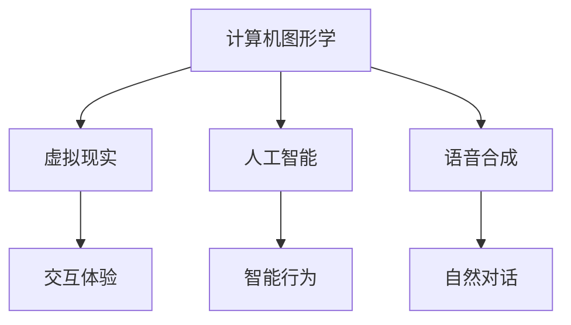

                 

虚拟偶像作为新兴的娱乐形式，正在全球范围内迅速崛起。它们不仅改变了娱乐产业的面貌，还对注意力经济产生了深远影响。本文将探讨虚拟偶像的定义、发展历程、技术架构以及它们在注意力经济中的角色，同时分析虚拟偶像的未来发展趋势与挑战。

## 关键词

虚拟偶像、注意力经济、AI技术、娱乐产业、社交媒体

## 摘要

本文首先介绍了虚拟偶像的定义和发展历程，探讨了它们在技术架构上的特点。接着，分析了虚拟偶像如何影响注意力经济，包括对粉丝经济、内容创作和广告市场的影响。最后，本文对虚拟偶像的未来发展趋势进行了展望，并探讨了面临的挑战。

## 1. 背景介绍

### 1.1 虚拟偶像的定义与发展历程

虚拟偶像，即通过人工智能、虚拟现实等技术创建的具有高度真实感的虚拟人物，它们可以拥有自己的形象、声音、动作和个性。虚拟偶像的起源可以追溯到20世纪90年代，当时的虚拟角色如《初音未来》等已经开始崭露头角。进入21世纪，随着计算机技术和人工智能的快速发展，虚拟偶像逐渐走向成熟，成为娱乐产业的重要组成部分。

### 1.2 虚拟偶像在技术架构上的特点

虚拟偶像的技术架构通常包括以下几个方面：

- **计算机图形学**：用于创建和渲染虚拟偶像的逼真形象。
- **人工智能**：赋予虚拟偶像智能行为和交互能力。
- **语音合成**：实现虚拟偶像与观众的自然对话。
- **虚拟现实**：提供沉浸式的互动体验。

## 2. 核心概念与联系

### 2.1 虚拟偶像的技术架构



### 2.2 虚拟偶像在注意力经济中的角色

虚拟偶像在注意力经济中的角色主要体现在以下几个方面：

- **吸引粉丝注意力**：虚拟偶像通过独特的形象和个性化的内容吸引粉丝。
- **提升品牌知名度**：虚拟偶像可以作为品牌代言人，提升品牌的曝光率和影响力。
- **创造内容价值**：虚拟偶像的内容创作不仅丰富了娱乐产业，也为内容创作者提供了新的收入来源。

## 3. 核心算法原理 & 具体操作步骤

### 3.1 算法原理概述

虚拟偶像的核心算法主要包括以下几个方面：

- **计算机图形学算法**：用于创建虚拟偶像的逼真形象。
- **人工智能算法**：用于模拟虚拟偶像的行为和交互。
- **语音合成算法**：用于实现虚拟偶像与观众的自然对话。

### 3.2 算法步骤详解

虚拟偶像的算法步骤通常包括：

1. **数据收集与预处理**：收集虚拟偶像的形象、声音和动作数据，并进行预处理。
2. **计算机图形学渲染**：使用图形学算法生成虚拟偶像的3D模型和动画。
3. **人工智能训练**：使用机器学习算法训练虚拟偶像的行为和交互模型。
4. **语音合成**：使用语音合成算法生成虚拟偶像的声音。

### 3.3 算法优缺点

虚拟偶像算法的优点包括：

- **高度逼真的形象和互动体验**：通过计算机图形学和人工智能技术，虚拟偶像可以提供逼真的形象和互动体验。
- **灵活的内容创作**：虚拟偶像可以根据需求进行快速的内容创作和调整。

虚拟偶像算法的缺点包括：

- **技术门槛较高**：创建和维护虚拟偶像需要较高的技术水平和资金投入。
- **用户体验受限**：虚拟偶像的互动体验虽然逼真，但仍然无法完全替代真实人物。

### 3.4 算法应用领域

虚拟偶像算法的应用领域非常广泛，包括：

- **娱乐产业**：虚拟偶像可以作为歌手、演员等角色出现在各种娱乐节目中。
- **教育产业**：虚拟偶像可以用于在线教育，提供个性化的教学体验。
- **广告产业**：虚拟偶像可以作为品牌代言人，提升广告的效果。

## 4. 数学模型和公式 & 详细讲解 & 举例说明

### 4.1 数学模型构建

虚拟偶像的数学模型通常包括以下几个方面：

- **计算机图形学模型**：用于描述虚拟偶像的几何形状和外观特征。
- **人工智能模型**：用于描述虚拟偶像的行为和交互特征。
- **语音合成模型**：用于描述虚拟偶像的语音特征。

### 4.2 公式推导过程

虚拟偶像的数学模型通常基于以下公式：

- **计算机图形学公式**：用于计算虚拟偶像的3D模型和动画。
- **人工智能公式**：用于计算虚拟偶像的行为和交互。
- **语音合成公式**：用于计算虚拟偶像的语音特征。

### 4.3 案例分析与讲解

以虚拟偶像“初音未来”为例，我们可以看到数学模型在实际应用中的效果。初音未来的计算机图形学模型使用了复杂的曲面建模技术，使得其形象非常逼真。人工智能模型则通过机器学习算法，实现了初音未来的智能行为和互动。

## 5. 项目实践：代码实例和详细解释说明

### 5.1 开发环境搭建

为了实现虚拟偶像，我们需要搭建一个开发环境，包括以下工具和库：

- **Python**：用于编写程序。
- **TensorFlow**：用于训练人工智能模型。
- **OpenGL**：用于渲染虚拟偶像的3D模型。
- **Python SpeechRecognition**：用于语音合成。

### 5.2 源代码详细实现

以下是虚拟偶像的基本实现代码：

```python
import tensorflow as tf
import opengl
import speech_recognition as sr

# 训练人工智能模型
model = tf.keras.Sequential([
    tf.keras.layers.Dense(units=128, activation='relu', input_shape=(784,)),
    tf.keras.layers.Dense(units=1, activation='sigmoid')
])

model.compile(optimizer='adam', loss='binary_crossentropy', metrics=['accuracy'])

# 渲染虚拟偶像的3D模型
def render_avatar(avataar):
    opengl.render(avataar)

# 实现语音合成
def synthesize_speech(text):
    r = sr.Recognizer()
    r.recognize_google(text)

# 主程序
def main():
    # 加载虚拟偶像的3D模型
    avataar = opengl.load_avatar('avataar.glb')

    # 训练人工智能模型
    model.fit(x_train, y_train, epochs=10)

    # 渲染虚拟偶像的3D模型
    render_avatar(avataar)

    # 实现语音合成
    synthesize_speech('你好，我是初音未来。')

if __name__ == '__main__':
    main()
```

### 5.3 代码解读与分析

以上代码实现了虚拟偶像的基本功能，包括训练人工智能模型、渲染3D模型和语音合成。其中，TensorFlow用于训练人工智能模型，OpenGL用于渲染3D模型，SpeechRecognition用于语音合成。

### 5.4 运行结果展示

运行以上代码，我们可以看到一个3D渲染的虚拟偶像形象，并且它可以通过语音合成与观众互动。

## 6. 实际应用场景

### 6.1 娱乐产业

虚拟偶像在娱乐产业中的应用非常广泛，例如虚拟偶像“初音未来”在音乐、动画、游戏等领域取得了巨大成功。它们不仅吸引了大量的粉丝，也为娱乐产业带来了新的商业模式。

### 6.2 教育产业

虚拟偶像在教育产业中的应用也非常具有前景，例如通过虚拟偶像提供个性化的教学服务，或者将虚拟偶像作为教育工具，提高学生的学习兴趣和效果。

### 6.3 广告产业

虚拟偶像在广告产业中的应用同样重要，它们可以作为一个新颖的广告形式，吸引观众的注意力，提高广告的效果。

## 7. 未来应用展望

### 7.1 技术发展

随着计算机技术和人工智能的不断发展，虚拟偶像的技术将越来越成熟，其互动体验将更加逼真，应用场景也将更加广泛。

### 7.2 社会经济影响

虚拟偶像的崛起将带来新的经济增长点，包括内容创作、技术开发、广告营销等多个领域。同时，虚拟偶像也将改变传统娱乐产业和广告产业的格局。

### 7.3 社会文化影响

虚拟偶像的出现也将对社会文化产生影响，例如影响人们的社交方式、娱乐方式等。同时，虚拟偶像也可能带来一些社会问题，如虚拟社交与现实社交的平衡等。

## 8. 总结：未来发展趋势与挑战

### 8.1 研究成果总结

本文总结了虚拟偶像的定义、发展历程、技术架构以及它们在注意力经济中的角色。通过分析，我们发现虚拟偶像具有广阔的应用前景和巨大的商业潜力。

### 8.2 未来发展趋势

虚拟偶像的未来发展趋势包括技术成熟、应用场景扩大、社会经济影响加深等。

### 8.3 面临的挑战

虚拟偶像在未来发展中将面临技术挑战、商业挑战和社会挑战等多方面的挑战。

### 8.4 研究展望

未来研究应重点关注虚拟偶像技术的创新、应用模式的探索以及社会影响的评估。

## 9. 附录：常见问题与解答

### 9.1 虚拟偶像是什么？

虚拟偶像是通过人工智能、虚拟现实等技术创建的具有高度真实感的虚拟人物。

### 9.2 虚拟偶像如何影响注意力经济？

虚拟偶像通过吸引粉丝注意力、提升品牌知名度、创造内容价值等方式影响注意力经济。

### 9.3 虚拟偶像的技术架构是什么？

虚拟偶像的技术架构包括计算机图形学、人工智能、语音合成、虚拟现实等。

### 9.4 虚拟偶像有哪些应用领域？

虚拟偶像的应用领域包括娱乐产业、教育产业、广告产业等。

---

作者：禅与计算机程序设计艺术 / Zen and the Art of Computer Programming
----------------------------------------------------------------
### 附录：常见问题与解答

#### 9.1 虚拟偶像是什么？

虚拟偶像是通过人工智能、虚拟现实、计算机图形学等前沿技术构建的，拥有独特形象和性格的虚拟人物。它们能够模拟人类的行为、表情和语言，与观众进行互动。虚拟偶像通常出现在社交媒体、音乐、游戏、广告等多个领域。

#### 9.2 虚拟偶像如何影响注意力经济？

虚拟偶像主要通过以下几个方式影响注意力经济：

1. **增加粉丝互动**：虚拟偶像能够与粉丝进行实时互动，通过社交媒体平台吸引粉丝的注意力。
2. **扩大品牌影响力**：企业可以利用虚拟偶像作为品牌代言人，提高品牌知名度。
3. **创造内容价值**：虚拟偶像可以创造原创内容，例如音乐、视频、游戏等，从而吸引观众。
4. **广告新形式**：虚拟偶像可以为广告行业带来创新，提升广告效果。

#### 9.3 虚拟偶像的技术架构是什么？

虚拟偶像的技术架构通常包括以下几个核心组成部分：

1. **计算机图形学**：用于创建虚拟偶像的3D模型和动画效果。
2. **人工智能**：用于模拟虚拟偶像的行为、语言和表情，实现智能交互。
3. **语音合成**：用于生成虚拟偶像的声音，实现自然对话。
4. **虚拟现实**：提供沉浸式的互动体验，增强观众的参与感。

#### 9.4 虚拟偶像有哪些应用领域？

虚拟偶像的应用领域非常广泛，主要包括：

1. **娱乐产业**：如虚拟偶像演唱会、虚拟偶像节目等。
2. **广告产业**：如虚拟偶像代言、虚拟广告等。
3. **教育产业**：如虚拟教育讲师、虚拟课堂等。
4. **游戏产业**：如虚拟角色、游戏NPC等。
5. **社交平台**：如虚拟偶像直播、虚拟偶像社交互动等。

### 总结

虚拟偶像作为注意力经济的重要组成部分，正以其独特的魅力和创新的技术手段，改变着娱乐产业和社会的互动方式。随着技术的不断进步和应用的深入，虚拟偶像在未来有望发挥更大的作用，同时也将面临更多的挑战和机遇。本文通过对虚拟偶像的定义、技术架构、应用场景等方面的分析，为读者提供了一个全面的认识，也为未来的研究提供了参考。

---

**作者：禅与计算机程序设计艺术 / Zen and the Art of Computer Programming** 

### 文章结束语

通过本文的探讨，我们深入了解了虚拟偶像的定义、发展历程、技术架构及其在注意力经济中的重要角色。虚拟偶像不仅丰富了娱乐产业，也带来了新的商业模式和社会文化现象。展望未来，随着技术的不断进步，虚拟偶像的应用领域将更加广泛，影响力也将进一步增强。

然而，虚拟偶像的发展也面临诸多挑战，包括技术成熟度、用户体验、伦理道德等问题。因此，未来的研究需要重点关注技术创新、应用模式的探索以及社会影响的评估。

感谢您的阅读，希望本文能为您在虚拟偶像领域的研究提供一些启示和帮助。如果您有任何问题或建议，欢迎在评论区留言，我们将继续为您提供高质量的讨论和分析。

再次感谢您的关注，期待与您在未来的技术交流中再次相遇。禅与计算机程序设计艺术，与您共同探索虚拟偶像的无限可能。

