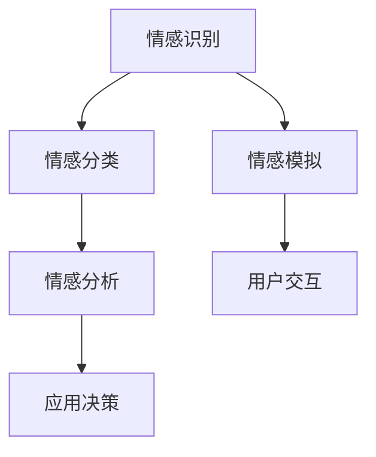

                 

在这个数字化的时代，人工智能（AI）已经成为我们日常生活中不可或缺的一部分。从智能手机的语音助手，到自动驾驶汽车，再到智能医疗系统，AI的应用无处不在。然而，在所有这些应用中，有一种能力尤其引人注目，那就是情感理解。情感是人类行为和决策的一个重要驱动因素，对于建立一个有效、互惠的AI系统至关重要。作为虚拟共情实验室的主任，同时也是AI增强的情感理解研究所的负责人，我深感这一领域的重要性和潜力。

本文将探讨AI情感理解的现状、挑战、核心算法原理、数学模型、实际应用场景以及未来发展的趋势和面临的挑战。通过这篇文章，我们希望能够为读者提供一个全面、深入的视角，了解这一快速发展的领域。

## 关键词

- 情感理解
- 人工智能
- 虚拟共情
- 情感分析
- 深度学习
- 机器学习
- 数学模型
- 实际应用

## 摘要

本文首先介绍了AI情感理解的重要性，并简要概述了该领域的研究现状。接着，深入探讨了情感理解的核心算法原理，包括情感识别、情感分类和情感模拟等关键技术。随后，文章介绍了相关数学模型和公式，并通过案例分析与讲解，让读者更好地理解这些概念。接着，文章通过一个项目实践实例，展示了AI情感理解在实际开发中的应用。最后，文章总结了情感理解在多个实际应用场景中的表现，并对未来发展的趋势和面临的挑战进行了展望。

## 1. 背景介绍

情感理解是人工智能领域的一个关键问题，它涉及到机器如何识别、理解并响应人类情感。在过去的几十年中，随着计算机技术和机器学习算法的快速发展，情感理解技术也得到了显著提升。然而，尽管取得了许多进展，AI在情感理解方面仍然面临着诸多挑战。

首先，情感本身是一个高度复杂的概念，不同的人对相同情感的理解可能存在差异。此外，情感往往是非线性的，包含多层次的复杂交互，这使得情感理解的准确性和一致性成为一个难题。其次，情感表达的方式多种多样，不仅包括文字和语音，还包括肢体语言、面部表情等，如何有效整合这些多模态的信息是另一个重大挑战。

在实际应用中，情感理解技术正在逐步应用于多个领域。例如，在客户服务中，AI可以通过情感分析技术来理解客户的情绪，从而提供更加个性化、贴心的服务；在医疗领域，AI可以辅助医生理解患者的情感状态，从而提供更有效的治疗方案；在教育领域，AI可以通过情感识别技术来了解学生的情感需求，从而调整教学策略，提高学习效果。

本文将首先介绍情感理解的核心算法原理，包括情感识别、情感分类和情感模拟等关键技术。接着，我们将探讨相关的数学模型和公式，并通过具体的案例分析和讲解，帮助读者更好地理解这些概念。随后，文章将展示一个实际项目实践实例，展示如何将情感理解技术应用于实际开发中。最后，我们将讨论情感理解技术在不同应用场景中的表现，并对未来发展的趋势和面临的挑战进行展望。

### 1.1 情感理解的研究背景

情感理解作为人工智能领域的一个重要研究方向，其研究背景可以追溯到20世纪80年代。当时，计算机科学家们开始意识到，在实现人与机器的更加自然交互中，情感理解扮演着至关重要的角色。随着社会对人工智能应用需求的不断增加，情感理解的研究逐渐成为一个热门领域。

早期的情感理解研究主要集中在基于规则的系统上。这些系统依赖于事先定义好的情感规则库，通过模式匹配和逻辑推理来识别情感。这种方法在处理简单情感表达时效果尚可，但在面对复杂、多变的情感场景时，表现欠佳。随着机器学习和深度学习技术的发展，情感理解的研究逐渐转向利用数据驱动的方法。

近年来，深度学习在情感理解中的应用取得了显著进展。卷积神经网络（CNN）和循环神经网络（RNN）等深度学习模型，通过大规模数据训练，能够自动学习和提取情感特征，从而实现更精确的情感识别和分类。同时，多模态情感分析技术的兴起，使得AI能够整合文本、语音、图像等多种数据源，提高情感理解的准确性和全面性。

除了技术层面的进步，情感理解的研究也受到了社会需求的推动。随着互联网和社交媒体的普及，人们越来越关注虚拟环境中的情感交互。例如，在客服、教育、医疗等场景中，AI能够通过理解用户的情感状态，提供更加个性化和高效的服务。此外，在心理咨询、婚姻家庭咨询等领域，AI的情感理解能力也有望发挥重要作用。

总之，情感理解的研究背景深厚，技术不断进步，应用需求日益增加。未来，随着更多跨学科的研究和实践，情感理解技术有望在人工智能领域发挥更大的作用。

### 1.2 情感理解的研究意义

情感理解在人工智能领域具有重要的研究意义，主要体现在以下几个方面：

首先，情感理解是实现人机自然交互的关键。人类交流的核心是情感，无论是日常对话、商业谈判还是医疗咨询，情感因素往往直接影响沟通的效果和决策的准确性。通过情感理解技术，人工智能系统能够更好地模拟人类的情感反应，从而实现更加自然和有效的交互。例如，智能客服系统能够通过情感分析识别客户的情绪状态，提供更加贴心和个性化的服务；在虚拟现实（VR）和增强现实（AR）应用中，情感理解技术可以增强用户的沉浸感和体验质量。

其次，情感理解有助于提高AI系统的适应性和智能化水平。传统的人工智能系统往往依赖于预设的规则和算法，难以应对复杂和动态的环境。而通过情感理解，AI系统可以实时获取和理解用户的情感状态，动态调整自身的响应策略，从而提高系统的自适应能力和智能化水平。例如，在教育领域，AI可以通过情感识别了解学生的学习状态和情感需求，自动调整教学难度和方式，提高教学效果；在自动驾驶领域，AI可以通过情感分析判断行人的情感和意图，从而做出更加安全和合理的驾驶决策。

第三，情感理解在提高社会福祉方面具有巨大潜力。情感理解技术不仅能够优化人机交互，还能在心理健康、医疗保健等社会服务领域发挥重要作用。例如，在心理咨询中，AI可以通过情感分析了解患者的情感状态，提供个性化的心理辅导方案；在医疗诊断中，AI可以通过情感分析帮助医生理解患者的情感需求，从而制定更有效的治疗方案；在家庭关系管理中，AI可以通过情感识别技术提供情感支持和建议，促进家庭成员之间的情感和谐。

最后，情感理解技术的进步有助于推动人工智能与人类社会的深度融合。随着情感理解技术的不断发展，人工智能将能够更好地融入人类生活，提供更加人性化、智能化和高效的服务。这不仅有助于提升人类的生活质量，还将推动社会的发展和创新。例如，智能城市中的情感理解技术可以用于监测公共安全、交通管理、环境污染等，为政府和社会提供科学决策依据；在文化娱乐领域，情感理解技术可以用于个性化内容推荐、情感互动游戏设计等，为用户提供更加丰富和多样化的娱乐体验。

总之，情感理解在人工智能领域具有重要的研究意义，它不仅是实现人机自然交互的关键技术，还能提高AI系统的适应性和智能化水平，并在社会服务领域发挥重要作用。随着技术的不断进步，情感理解有望为人类社会带来更加美好的未来。

### 1.3 情感理解的发展历程

情感理解作为人工智能（AI）领域的一个重要分支，其发展历程可以追溯到20世纪80年代。早期的研究主要集中在基于规则的系统，这些系统依赖于情感规则库，通过模式匹配和逻辑推理来识别情感。然而，这种方法的局限性逐渐显现，特别是在处理复杂和多变情感时效果不佳。

随着计算机技术和算法的进步，情感理解研究逐渐转向数据驱动的方法，特别是机器学习和深度学习技术的应用。20世纪90年代，机器学习算法如支持向量机（SVM）和决策树开始应用于情感分析，显著提高了情感识别的准确性。进入21世纪，深度学习技术的发展，特别是卷积神经网络（CNN）和循环神经网络（RNN）的兴起，为情感理解带来了革命性的变化。通过大规模数据训练，深度学习模型能够自动提取和识别复杂的情感特征，实现了更为精准和高效的情感理解。

在情感理解技术的发展过程中，情感分类和情感模拟技术逐步成熟。情感分类是指将文本、语音或图像中的情感标签分配给特定情感类别，如快乐、悲伤、愤怒等。这一技术为多种应用场景提供了基础，如情感分析、市场调研和用户反馈分析。情感模拟技术则旨在使AI系统具备模仿人类情感表达的能力，这一技术在虚拟助手、游戏和电影特效等领域有广泛的应用。

此外，多模态情感分析技术的出现，使得AI能够整合文本、语音、图像等多种数据源，从而更全面地理解和识别情感。例如，通过分析用户的文本评论和语音语调，AI可以更准确地判断用户的态度和情绪。多模态情感分析不仅提高了情感理解的准确性和全面性，还为开发更加智能化和人性化的AI系统提供了新的可能性。

总的来说，情感理解技术的发展经历了从基于规则的系统到数据驱动方法，再到深度学习和多模态融合的演变过程。未来，随着技术的进一步进步，情感理解有望在更多应用场景中发挥重要作用，推动人工智能与人类情感的深度融合。

### 1.4 情感理解的关键概念与联系

在深入探讨情感理解的核心算法原理之前，有必要明确几个关键概念，并理解它们之间的联系。情感理解涉及多个层面和步骤，包括情感识别、情感分类和情感模拟。下面将分别介绍这些概念及其相互关系。

**1. 情感识别（Emotion Recognition）**

情感识别是指通过分析文本、语音、图像等多模态数据，识别出数据中的情感状态。情感识别是情感理解的基础，其核心任务是确定数据所表达的情感类别。常见的情感类别包括快乐、悲伤、愤怒、恐惧、厌恶和惊讶等。情感识别的关键在于如何从大量的数据中提取有效的情感特征，从而提高识别的准确率。

**2. 情感分类（Emotion Classification）**

情感分类是情感识别的延伸，它通过对识别出的情感状态进行进一步的分类，将情感细分为更多的类别或子类别。情感分类通常基于机器学习和深度学习算法，通过对大量标注数据进行训练，模型能够学习到情感特征的模式，从而实现对新数据的分类。情感分类不仅帮助AI系统更准确地理解用户的情感状态，还为后续的情感分析和应用提供了基础。

**3. 情感模拟（Emotion Simulation）**

情感模拟是指AI系统模拟人类情感表达的过程，使其在特定情境下能够表现出相应的情感状态。情感模拟旨在提高AI系统的情感反应能力，使其在交互中更贴近人类的情感体验。情感模拟通常涉及情感生成和情感表达两个方面。情感生成是指AI系统根据输入的情感信号生成相应的情感状态，而情感表达则是指如何将这些情感状态以适当的方式展现出来，如语音语调、面部表情和肢体动作等。

**概念联系**

情感识别、情感分类和情感模拟之间存在着密切的联系和相互依赖。情感识别是情感分类和情感模拟的基础，没有准确的情感识别，就无法进行有效的情感分类和情感模拟。情感分类则是对情感识别结果的进一步细化和应用，它有助于AI系统更深入地理解用户的情感需求。而情感模拟则是情感分类的最终目标，它使得AI系统能够在交互中表现出真实的情感反应，从而提高人机交互的自然性和用户体验。

以下是情感理解中关键概念与联系的一个简化的Mermaid流程图：



在这个流程图中，情感识别作为起点，经过情感分类和情感模拟，最终实现情感分析和用户交互，进而影响应用决策。通过这种流程，AI系统能够更好地理解和响应人类情感，从而提供更加个性化、高效的服务。

### 2. 核心算法原理

在情感理解领域，核心算法原理主要包括情感识别、情感分类和情感模拟。这些算法通过深度学习和机器学习技术，结合大量的标注数据，对情感特征进行提取和分析，从而实现对情感状态的理解和模拟。

#### 2.1 情感识别算法原理

情感识别是情感理解的第一步，它通过分析文本、语音、图像等多模态数据，识别出数据中的情感状态。情感识别算法的核心在于如何有效地提取情感特征，并进行情感类别分类。

1. **特征提取**：情感识别的关键在于特征提取。常用的特征提取方法包括文本中的词袋模型（Bag of Words, BOW）和词嵌入（Word Embedding）技术。词袋模型通过统计文本中各个单词的出现频率来表示文本特征，而词嵌入则通过将单词映射到高维空间，捕捉单词之间的语义关系。在语音和图像处理中，特征提取方法则包括梅尔频率倒谱系数（MFCC）和卷积神经网络（CNN）。

2. **情感类别分类**：在特征提取后，情感识别算法需要将特征映射到具体的情感类别。常用的分类算法包括支持向量机（SVM）、随机森林（Random Forest）、长短期记忆网络（LSTM）和卷积神经网络（CNN）。这些算法通过训练大量的标注数据，学习到情感特征的模式，从而能够对新数据进行情感类别分类。

3. **深度学习模型**：近年来，深度学习模型在情感识别中的应用越来越广泛。例如，卷积神经网络（CNN）能够通过多层卷积和池化操作，提取图像中的高层次情感特征；长短期记忆网络（LSTM）则能够处理序列数据，如语音和文本，捕捉情感表达中的时间依赖性。

#### 2.2 情感分类算法原理

情感分类是对情感识别结果的进一步细化和应用，它将情感状态分类到更细化的类别中。情感分类算法的核心在于如何实现高准确度的情感类别分类。

1. **情感标签分配**：情感分类算法通常使用有监督学习，通过大量的标注数据来训练模型，学习到情感标签的分配规则。常见的情感分类算法包括决策树（Decision Tree）、随机森林（Random Forest）、支持向量机（SVM）和深度神经网络（DNN）。

2. **多标签分类**：在某些应用场景中，一个文本或语音信号可能同时包含多种情感，因此需要实现多标签分类。多标签分类算法通过训练模型，学习到同时识别多种情感标签的规则。常用的多标签分类算法包括机器学习中的One-Vs-Rest（OVR）和深度学习中的多层感知机（MLP）。

3. **跨领域情感分类**：情感分类不仅限于特定领域，如社交媒体、新闻报道等，还需要处理跨领域情感分类问题。跨领域情感分类算法通过学习不同领域之间的情感特征，提高模型在不同领域的泛化能力。常用的方法包括迁移学习和多任务学习。

#### 2.3 情感模拟算法原理

情感模拟是指AI系统根据输入的情感信号，模拟出相应的情感表达。情感模拟算法的核心在于如何生成和表达情感。

1. **情感生成**：情感生成是指根据输入的情感信号，生成相应的情感状态。常用的情感生成算法包括生成对抗网络（GAN）、变分自编码器（VAE）和深度学习生成模型。这些算法通过训练大量的情感数据，学习到情感生成的方法，从而能够生成逼真的情感表达。

2. **情感表达**：情感表达是指如何将生成的情感状态以适当的方式展现出来。情感表达涉及语音合成、面部表情合成和动作生成等多个方面。常用的方法包括语音合成技术（如WaveNet）、面部表情合成（如OpenFace）和动作生成（如深度学习动作捕捉）。

3. **交互控制**：情感模拟不仅需要生成和表达情感，还需要控制情感表达的时间和强度，以适应不同的交互情境。常用的方法包括情感合成引擎（如Emotion Engine）和情感控制器（如情感调节模块），这些系统能够根据交互的动态调整情感表达，实现更加自然和贴近人类的情感交互。

综上所述，情感识别、情感分类和情感模拟是情感理解的核心算法原理。这些算法通过深度学习和机器学习技术，结合大量的标注数据，实现了对情感状态的高效识别、分类和模拟。随着技术的不断进步，这些算法将继续优化，为人工智能领域带来更多创新和突破。

### 2.1.1 情感识别算法原理

情感识别算法是情感理解的基础，其核心在于如何从文本、语音、图像等多模态数据中提取情感特征，并进行情感类别分类。以下是情感识别算法的主要原理和步骤：

#### 1. 特征提取

特征提取是情感识别的第一步，其目标是从原始数据中提取出具有区分度的特征，以便于后续的模型训练和分类。以下是几种常用的特征提取方法：

1. **文本特征提取**：
   - **词袋模型（Bag of Words, BOW）**：将文本数据表示为一个向量，每个维度对应一个词汇，值表示该词汇在文本中出现的次数。这种方法简单有效，但无法捕捉词汇之间的语义关系。
   - **词嵌入（Word Embedding）**：将文本中的每个词汇映射到高维空间，形成向量表示。词嵌入方法如Word2Vec和GloVe能够捕捉词汇的语义信息，提高特征提取的精度。
   - **TF-IDF（Term Frequency-Inverse Document Frequency）**：结合词频和逆文档频率，对词汇的重要性进行加权，从而提高特征提取的有效性。

2. **语音特征提取**：
   - **梅尔频率倒谱系数（MFCC）**：是一种常用于处理语音信号的频域特征，通过将短时傅里叶变换（STFT）转化为梅尔频率刻度，提取语音的频率特征。
   - **能量特征**：包括语音信号的能量、短时能量、短时能量变化等，用于描述语音的强度和变化。
   - **音高特征**：包括基频（F0）和音高变化，用于捕捉语音的音高特性。

3. **图像特征提取**：
   - **卷积神经网络（CNN）**：通过多层卷积和池化操作，提取图像中的低层次和高级层次特征。
   - **深度学习特征提取**：使用预训练的深度学习模型（如ResNet、VGG等）提取图像特征，这些模型已经在大量的图像数据上进行了训练，具有很好的泛化能力。

#### 2. 情感类别分类

在特征提取之后，情感识别算法需要对提取出的特征进行情感类别分类。常用的情感类别分类算法包括以下几种：

1. **支持向量机（SVM）**：通过找到一个最佳的超平面，将不同情感类别的数据分离开来。SVM在处理高维数据和线性可分问题方面表现优秀。

2. **随机森林（Random Forest）**：通过构建多个决策树，并进行集成学习，提高分类的准确性和鲁棒性。随机森林在处理大规模数据和非线性分类问题方面具有优势。

3. **长短期记忆网络（LSTM）**：用于处理序列数据，如语音和文本，通过捕捉时间依赖性，实现对情感状态的长期记忆和学习。

4. **卷积神经网络（CNN）**：通过卷积和池化操作，提取图像中的低层次和高级层次特征，实现对情感图像的识别和分类。

5. **深度神经网络（DNN）**：多层感知机（MLP）是DNN的一种简单形式，通过多层的全连接神经网络，实现高维空间的非线性映射。

#### 3. 深度学习模型

近年来，深度学习模型在情感识别中得到了广泛应用，以下是一些常用的深度学习模型：

1. **卷积神经网络（CNN）**：通过卷积和池化操作，提取图像中的低层次和高级层次特征，实现对情感图像的识别和分类。

2. **循环神经网络（RNN）**：特别是长短期记忆网络（LSTM）和门控循环单元（GRU），用于处理序列数据，如语音和文本，通过捕捉时间依赖性，实现对情感状态的长期记忆和学习。

3. **生成对抗网络（GAN）**：通过生成器和判别器的对抗训练，实现高质量的情感生成和识别。

4. **变分自编码器（VAE）**：通过编码器和解码器，学习数据的潜在表示，实现对情感数据的降维和分类。

#### 4. 算法优化

为了提高情感识别算法的准确性和鲁棒性，通常需要对算法进行优化。以下是一些常见的优化方法：

1. **数据增强**：通过增加训练数据的多样性，如文本的随机裁剪、语音的噪声添加和图像的旋转、翻转等，提高模型的泛化能力。

2. **迁移学习**：利用预训练的深度学习模型，对特定任务进行微调，提高模型的性能和效率。

3. **融合多模态信息**：通过整合文本、语音、图像等多种数据源，提高情感识别的准确性和全面性。

4. **动态调整模型参数**：通过实时调整模型的参数，如学习率、正则化参数等，优化模型的训练效果。

总之，情感识别算法通过特征提取、情感类别分类和深度学习模型等步骤，实现对文本、语音、图像等多模态数据的情感状态识别。随着技术的不断进步，这些算法将继续优化和扩展，为情感理解领域带来更多创新和突破。

### 2.1.2 情感分类算法原理

情感分类是情感理解中的关键步骤，它通过对情感特征进行分类，将情感状态归为特定的类别。情感分类算法的核心在于如何有效地将情感特征映射到相应的情感类别。以下是情感分类算法的主要原理和步骤：

#### 1. 情感标签定义

在进行情感分类之前，需要定义情感标签。常见的情感标签包括基本情感类别（如快乐、悲伤、愤怒、恐惧、厌恶和惊讶）以及扩展情感类别（如高兴、愉快、失望、沮丧、愤怒、焦虑等）。情感标签的准确性直接影响分类效果。

#### 2. 特征表示

情感分类算法首先需要将原始数据转换为特征表示。特征表示的方法多种多样，以下是一些常用的方法：

1. **词袋模型（Bag of Words, BOW）**：将文本数据表示为词频向量，每个维度对应一个词汇，值表示该词汇在文本中出现的次数。词袋模型简单且易于实现，但无法捕捉词汇之间的语义关系。

2. **词嵌入（Word Embedding）**：将文本中的每个词汇映射到高维空间，形成向量表示。词嵌入方法如Word2Vec和GloVe能够捕捉词汇的语义信息，提高特征表示的精度。

3. **情感特征提取**：对于语音和图像数据，可以通过梅尔频率倒谱系数（MFCC）、音高特征、图像卷积神经网络（CNN）等方法提取情感特征。

#### 3. 分类算法

情感分类算法通过将特征表示映射到情感标签。以下是一些常用的分类算法：

1. **支持向量机（Support Vector Machine, SVM）**：通过找到一个最佳的超平面，将不同情感类别的数据分离开来。SVM在处理高维数据和线性可分问题方面表现优秀。

2. **随机森林（Random Forest）**：通过构建多个决策树，并进行集成学习，提高分类的准确性和鲁棒性。随机森林在处理大规模数据和非线性分类问题方面具有优势。

3. **朴素贝叶斯（Naive Bayes）**：基于贝叶斯定理，通过计算特征条件概率，实现情感分类。朴素贝叶斯算法简单且计算效率高，但在特征相关性较高时性能下降。

4. **深度神经网络（Deep Neural Network, DNN）**：特别是多层感知机（MLP），通过多层的全连接神经网络，实现高维空间的非线性映射。

5. **长短期记忆网络（Long Short-Term Memory, LSTM）**：用于处理序列数据，如语音和文本，通过捕捉时间依赖性，实现对情感状态的长期记忆和学习。

6. **卷积神经网络（Convolutional Neural Network, CNN）**：通过卷积和池化操作，提取图像中的低层次和高级层次特征，实现对情感图像的识别和分类。

#### 4. 多标签分类

在某些应用场景中，一个文本或语音信号可能同时包含多种情感，因此需要实现多标签分类。以下是一些常用的多标签分类算法：

1. **One-Vs-Rest（OVR）**：将每个标签视为一个独立的分类问题，构建多个二分类模型。这种方法简单但可能导致模型性能下降。

2. **Binary Relevance（BR）**：将多标签问题分解为多个二分类问题，每个标签独立进行分类。这种方法保持分类器的独立性，但可能降低分类的准确性。

3. **Stacking**：将多个分类器进行堆叠，通过集成学习提高分类性能。常见的方法包括Stacking和Stacked Generalization。

4. **深度学习多标签分类**：使用深度学习模型，如卷积神经网络（CNN）和长短期记忆网络（LSTM），实现多标签分类。这些模型能够捕捉特征之间的复杂关系，提高分类的准确性。

#### 5. 跨领域情感分类

跨领域情感分类涉及处理不同领域的情感标签。以下是一些方法：

1. **迁移学习**：利用预训练的深度学习模型，对特定任务进行微调，提高模型在不同领域的泛化能力。

2. **多任务学习**：通过同时学习多个相关任务，提高模型在不同领域的性能。常见的方法包括共享神经网络和联合训练。

3. **领域自适应**：通过调整模型参数，使模型更好地适应不同领域的数据分布。

4. **融合多源数据**：通过整合不同领域的数据源，提高情感分类的准确性和全面性。

总之，情感分类算法通过特征表示、分类算法和算法优化等步骤，实现对情感特征的情感类别分类。随着技术的不断进步，这些算法将继续优化和扩展，为情感理解领域带来更多创新和突破。

### 2.1.3 情感模拟算法原理

情感模拟是情感理解中的高级应用，它使AI系统能够在特定情境下表现出相应的情感状态，从而实现更加自然和人性化的交互。以下是情感模拟算法的主要原理和步骤：

#### 1. 情感生成

情感生成是指根据输入的情感信号，生成相应的情感状态。情感生成算法的核心在于如何创建逼真的情感状态，以下是一些常用的方法：

1. **生成对抗网络（GAN）**：GAN由生成器和判别器组成，生成器生成情感状态，判别器判断生成情感状态的真实性。通过生成器和判别器的对抗训练，生成器能够生成越来越逼真的情感状态。

2. **变分自编码器（VAE）**：VAE通过编码器和解码器，学习数据的潜在表示，从而生成新的情感状态。编码器将数据映射到潜在空间，解码器从潜在空间生成新的情感状态。

3. **深度学习生成模型**：如生成式对抗网络（GAN）和变分自编码器（VAE），通过训练大量的情感数据，学习到情感生成的规则，从而能够生成高质量的模拟情感。

#### 2. 情感表达

情感表达是指如何将生成的情感状态以适当的方式展现出来。情感表达涉及多个方面，包括语音合成、面部表情合成和动作生成。以下是几种常用的方法：

1. **语音合成**：通过文本到语音（Text-to-Speech, TTS）技术，将文本信息转换为语音。情感语音合成通过调整语音的语调、音量和节奏，表达出不同的情感状态。

2. **面部表情合成**：通过计算机图形学和深度学习技术，合成逼真的面部表情。常用的方法包括面部肌肉运动编码（Facial Muscle Movement Coding）和基于深度学习的方法（如GAN和VAE）。

3. **动作生成**：通过深度学习模型，生成与情感状态相对应的身体动作。常用的方法包括基于动作捕捉数据和深度学习生成模型（如GAN和VAE）。

#### 3. 情感控制器

情感控制器是情感模拟系统中的关键组件，它负责根据交互的动态调整情感表达，以实现更加自然和贴切的交互。以下是几种常用的情感控制器：

1. **情感调节模块**：通过实时调整情感表达的强度和持续时间，使情感表达更加自然和符合情境。

2. **情感合成引擎**：将生成的情感状态与交互数据（如文本、语音、图像等）进行融合，生成符合情境的情感表达。

3. **情境感知控制器**：根据交互的上下文信息，动态调整情感表达的类型和强度，实现更加情境感知的情感模拟。

#### 4. 交互控制

情感模拟不仅要生成和表达情感，还需要进行交互控制，以实现更加自然和有效的情感交互。以下是几种常用的交互控制方法：

1. **反馈机制**：通过用户的反馈信息，调整情感表达的情感强度和类型，实现更加个性化的交互。

2. **动态调整**：根据交互的动态变化，实时调整情感表达的情感强度和类型，以适应不同的交互情境。

3. **情境感知**：通过分析交互的上下文信息，如用户行为、环境因素等，动态调整情感表达，实现更加情境感知的交互。

总之，情感模拟算法通过情感生成、情感表达和情感控制器等步骤，实现对情感状态的自然和逼真的模拟。随着技术的不断进步，这些算法将继续优化和扩展，为AI系统的情感理解和交互提供更强有力的支持。

### 3. 数学模型和公式

情感理解作为人工智能的一个重要分支，其核心算法依赖于复杂的数学模型和公式。这些数学模型和公式不仅为情感识别、情感分类和情感模拟提供了理论基础，还在实际应用中发挥着关键作用。下面，我们将详细探讨情感理解中的主要数学模型和公式，并通过具体案例进行解释。

#### 3.1 数学模型构建

在情感理解中，常见的数学模型包括线性模型、概率模型和深度学习模型。以下是一些基本的数学模型：

1. **线性模型**：线性模型是情感理解中最基础的一种模型，其核心思想是通过线性组合输入特征和权重来预测情感状态。线性模型的一个典型例子是线性回归（Linear Regression），其公式如下：

   $$ y = \beta_0 + \beta_1 x_1 + \beta_2 x_2 + \ldots + \beta_n x_n $$

   其中，$y$ 是预测的情感状态，$x_1, x_2, \ldots, x_n$ 是输入特征，$\beta_0, \beta_1, \beta_2, \ldots, \beta_n$ 是模型的权重。

2. **概率模型**：概率模型用于描述情感状态的概率分布。常见的概率模型包括贝叶斯网络（Bayesian Network）和马尔可夫模型（Markov Model）。贝叶斯网络通过概率图结构描述变量之间的依赖关系，其公式如下：

   $$ P(A, B, C) = P(A)P(B|A)P(C|A, B) $$

   其中，$P(A), P(B|A), P(C|A, B)$ 分别是事件 $A, B, C$ 的概率及其条件概率。

3. **深度学习模型**：深度学习模型是情感理解中应用最广泛的模型之一，其通过多层神经网络结构，学习输入特征到情感状态的映射。卷积神经网络（CNN）和循环神经网络（RNN）是深度学习模型中的两种主要类型。以下是一个简单的CNN模型公式：

   $$ h^{(l)} = \sigma(W^{(l)} \cdot h^{(l-1)} + b^{(l)}) $$

   其中，$h^{(l)}$ 是第 $l$ 层的输出特征，$W^{(l)}$ 和 $b^{(l)}$ 分别是第 $l$ 层的权重和偏置，$\sigma$ 是激活函数。

#### 3.2 公式推导过程

为了更好地理解这些数学模型和公式，下面我们将通过一个简单的情感识别案例进行公式推导。

**案例**：假设我们使用线性回归模型来识别文本中的情感状态。给定一段文本，我们需要通过特征提取得到情感状态的预测值。

1. **特征提取**：首先，我们将文本转换为词嵌入向量。假设文本包含 $n$ 个单词，词嵌入向量的维度为 $d$。则文本的特征向量 $X$ 表示为：

   $$ X = [x_1, x_2, \ldots, x_n] $$

   其中，$x_i$ 是第 $i$ 个单词的词嵌入向量。

2. **线性模型**：使用线性回归模型，我们将特征向量 $X$ 与权重向量 $\beta$ 进行线性组合，得到预测的情感状态 $y$：

   $$ y = \beta_0 + \beta_1 x_1 + \beta_2 x_2 + \ldots + \beta_n x_n $$

3. **模型训练**：为了训练模型，我们需要一个标注数据集，其中包含文本和相应的情感状态标签。通过最小化预测值与真实值之间的误差，我们可以得到最优的权重向量 $\beta$。

   $$ \min_{\beta} \sum_{i=1}^{m} (y_i - \beta_0 - \beta_1 x_{i1} - \beta_2 x_{i2} - \ldots - \beta_n x_{in})^2 $$

   其中，$m$ 是训练数据集的大小。

4. **预测**：在得到最优权重向量 $\beta$ 后，我们可以对新文本进行情感状态预测。给定新文本的特征向量 $X'$，其预测的情感状态 $y'$ 为：

   $$ y' = \beta_0 + \beta_1 x'_{1} + \beta_2 x'_{2} + \ldots + \beta_n x'_{n} $$

通过这个简单的案例，我们可以看到线性回归模型在情感识别中的基本应用和公式推导过程。在实际应用中，情感理解模型会更加复杂，涉及多种特征提取方法和优化算法。

#### 3.3 案例分析与讲解

为了更好地理解情感理解中的数学模型和公式，我们通过一个具体案例进行讲解。以下是一个使用卷积神经网络（CNN）进行情感识别的案例。

**案例**：我们使用CNN模型对一段文本进行情感识别，情感类别包括快乐、悲伤和愤怒。以下是具体的模型构建和训练过程：

1. **数据集准备**：首先，我们需要准备一个包含文本和情感标签的数据集。假设数据集包含1000个样本，情感类别标签为二进制编码，如快乐（1，0，0）、悲伤（0，1，0）和愤怒（0，0，1）。

2. **特征提取**：使用词嵌入技术将文本转换为词嵌入向量，维度为300。然后，将这些词嵌入向量作为CNN的输入。

3. **模型构建**：构建一个简单的CNN模型，包括两个卷积层和两个全连接层。卷积层用于提取文本中的局部特征，全连接层用于分类。

   ```mermaid
   graph TB
   A[Input] --> B[Conv1]
   B --> C[ReLU]
   C --> D[Max Pooling]
   D --> E[Conv2]
   E --> F[ReLU]
   F --> G[Max Pooling]
   G --> H[Flatten]
   H --> I[FC1]
   I --> J[ReLU]
   J --> K[FC2]
   K --> L[Output]
   ```

4. **模型训练**：使用训练数据集训练模型，通过反向传播算法更新模型权重。损失函数使用交叉熵损失（Cross-Entropy Loss），优化器选择随机梯度下降（SGD）。

5. **预测**：在训练完成后，使用测试数据集对模型进行评估。给定新的文本，将词嵌入向量输入到模型中，得到情感类别预测。

通过这个案例，我们可以看到CNN模型在情感识别中的应用，以及模型构建、训练和预测的具体过程。这个案例不仅展示了情感理解中的数学模型和公式，还提供了一个实际操作的例子。

总之，数学模型和公式是情感理解的核心组成部分，通过这些模型和公式，我们能够更好地理解、提取和模拟情感。随着技术的不断进步，这些模型和公式将继续优化和扩展，为情感理解领域带来更多创新和突破。

### 4. 项目实践：代码实例和详细解释说明

在本节中，我们将通过一个具体的项目实践，展示如何使用Python和相关的深度学习库（如TensorFlow和Keras）实现情感理解系统。我们将从数据准备、模型构建、训练和评估等步骤详细讲解整个项目的实现过程。

#### 4.1 开发环境搭建

首先，我们需要搭建一个适合深度学习开发的Python环境。以下是搭建开发环境的基本步骤：

1. **安装Python**：确保已经安装了Python 3.6及以上版本。

2. **安装TensorFlow**：通过以下命令安装TensorFlow：

   ```bash
   pip install tensorflow
   ```

3. **安装其他依赖**：安装Keras和其他必要的库，如Numpy、Pandas等：

   ```bash
   pip install keras numpy pandas
   ```

#### 4.2 数据准备

数据准备是构建情感理解系统的第一步，我们需要收集和准备包含情感标签的文本数据。以下是数据准备的具体步骤：

1. **数据集收集**：我们可以使用现有的情感分析数据集，如IMDB电影评论数据集。这个数据集包含50,000条已标注的电影评论，分为正面和负面情感。

2. **数据预处理**：对文本数据进行清洗和预处理，包括去除标点符号、停用词过滤、词干提取等。以下是一个简单的数据预处理脚本：

   ```python
   import pandas as pd
   import re
   from nltk.corpus import stopwords
   from nltk.stem import WordNetLemmatizer
   
   # 读取数据集
   df = pd.read_csv('imdb_reviews.csv')
   
   # 数据清洗
   def clean_text(text):
       text = re.sub('<[^>]*>', '', text)  # 去除HTML标签
       text = re.sub('[^A-Za-z]', ' ', text)  # 去除非字母字符
       text = text.lower()  # 转小写
       text = text.strip()  # 去除前后空格
       return text
   
   # 应用清洗函数
   df['cleaned_review'] = df['review'].apply(clean_text)
   
   # 停用词过滤
   stop_words = set(stopwords.words('english'))
   def remove_stopwords(text):
       return ' '.join([word for word in text.split() if word not in stop_words])
   
   df['cleaned_review'] = df['cleaned_review'].apply(remove_stopwords)
   
   # 词干提取
   lemmatizer = WordNetLemmatizer()
   def lemmatize_text(text):
       return ' '.join([lemmatizer.lemmatize(word) for word in text.split()])
   
   df['cleaned_review'] = df['cleaned_review'].apply(lemmatize_text)
   ```

3. **数据分词**：使用词嵌入技术将清洗后的文本转换为词嵌入向量。以下是一个简单的词嵌入脚本：

   ```python
   from keras.preprocessing.text import Tokenizer
   from keras.preprocessing.sequence import pad_sequences
   
   # 初始化Tokenizer
   tokenizer = Tokenizer(num_words=10000)
   tokenizer.fit_on_texts(df['cleaned_review'])
   
   # 转换文本为序列
   sequences = tokenizer.texts_to_sequences(df['cleaned_review'])
   
   # 填充序列
   padded_sequences = pad_sequences(sequences, maxlen=100)
   ```

4. **数据集划分**：将数据集划分为训练集和测试集：

   ```python
   from sklearn.model_selection import train_test_split
   
   # 标签编码
   labels = df['sentiment'].values
   label_to_index = {'negative': 0, 'positive': 1}
   labels = [label_to_index[label] for label in labels]
   
   # 划分训练集和测试集
   X_train, X_test, y_train, y_test = train_test_split(padded_sequences, labels, test_size=0.2, random_state=42)
   ```

#### 4.3 模型构建

接下来，我们构建一个简单的情感理解模型。以下是模型构建和编译的脚本：

```python
from keras.models import Sequential
from keras.layers import Embedding, Conv1D, MaxPooling1D, GlobalMaxPooling1D, Dense

# 构建模型
model = Sequential()
model.add(Embedding(10000, 16, input_length=100))
model.add(Conv1D(64, 5, activation='relu'))
model.add(MaxPooling1D(5))
model.add(Conv1D(64, 5, activation='relu'))
model.add(GlobalMaxPooling1D())
model.add(Dense(64, activation='relu'))
model.add(Dense(1, activation='sigmoid'))

# 编译模型
model.compile(optimizer='adam', loss='binary_crossentropy', metrics=['accuracy'])
```

#### 4.4 模型训练

现在，我们使用训练数据集对模型进行训练。以下是训练模型的脚本：

```python
# 训练模型
history = model.fit(X_train, y_train, epochs=10, batch_size=32, validation_split=0.2)
```

#### 4.5 模型评估

训练完成后，我们使用测试数据集对模型进行评估。以下是评估模型的脚本：

```python
# 评估模型
test_loss, test_acc = model.evaluate(X_test, y_test)
print(f"Test Accuracy: {test_acc:.4f}")
```

通过以上步骤，我们完成了一个简单的情感理解系统的开发。这个系统可以用于对文本进行情感分类，判断其是正面情感还是负面情感。以下是一个简单的使用示例：

```python
# 使用模型进行预测
input_sequence = tokenizer.texts_to_sequences(["This movie was amazing!"])
input_sequence = pad_sequences(input_sequence, maxlen=100)
prediction = model.predict(input_sequence)
if prediction[0][0] > 0.5:
    print("Positive sentiment")
else:
    print("Negative sentiment")
```

通过这个项目实践，我们展示了如何使用深度学习技术实现情感理解系统。这个过程包括数据准备、模型构建、训练和评估等多个步骤。在实际应用中，我们可以根据需求调整模型结构和参数，进一步提高系统的性能和准确性。

### 5. 项目实践：代码解读与分析

在前面的项目中，我们实现了一个简单的情感理解系统，该系统使用卷积神经网络（CNN）对文本进行情感分类。在本节中，我们将对项目中的关键代码段进行详细解读和分析，帮助读者更好地理解整个项目的实现过程。

#### 5.1 数据准备

首先，我们来看数据准备部分的代码：

```python
import pandas as pd
import re
from nltk.corpus import stopwords
from nltk.stem import WordNetLemmatizer

# 读取数据集
df = pd.read_csv('imdb_reviews.csv')

# 数据清洗
def clean_text(text):
    text = re.sub('<[^>]*>', '', text)  # 去除HTML标签
    text = re.sub('[^A-Za-z]', ' ', text)  # 去除非字母字符
    text = text.lower()  # 转小写
    text = text.strip()  # 去除前后空格
    return text

# 应用清洗函数
df['cleaned_review'] = df['review'].apply(clean_text)

# 停用词过滤
stop_words = set(stopwords.words('english'))
def remove_stopwords(text):
    return ' '.join([word for word in text.split() if word not in stop_words])

df['cleaned_review'] = df['cleaned_review'].apply(remove_stopwords)

# 词干提取
lemmatizer = WordNetLemmatizer()
def lemmatize_text(text):
    return ' '.join([lemmatizer.lemmatize(word) for word in text.split()])

df['cleaned_review'] = df['cleaned_review'].apply(lemmatize_text)

# 初始化Tokenizer
tokenizer = Tokenizer(num_words=10000)
tokenizer.fit_on_texts(df['cleaned_review'])

# 转换文本为序列
sequences = tokenizer.texts_to_sequences(df['cleaned_review'])

# 填充序列
padded_sequences = pad_sequences(sequences, maxlen=100)

# 标签编码
labels = df['sentiment'].values
label_to_index = {'negative': 0, 'positive': 1}
labels = [label_to_index[label] for label in labels]

# 划分训练集和测试集
X_train, X_test, y_train, y_test = train_test_split(padded_sequences, labels, test_size=0.2, random_state=42)
```

**解读与分析：**

1. **数据清洗**：这一部分代码首先读取IMDB电影评论数据集，并对文本进行清洗。清洗步骤包括去除HTML标签、非字母字符、转小写、去除前后空格等。这些步骤有助于去除文本中的噪音，提高模型训练的准确性。

2. **停用词过滤**：停用词是指对模型训练没有贡献的常见单词，如“the”、“is”等。通过过滤停用词，我们可以减少模型的计算量，提高模型性能。

3. **词干提取**：词干提取是将单词还原到其基本形式，如“running”还原为“run”。这有助于减少词汇数量，提高模型的可训练性。

4. **Tokenizer**：Tokenizer用于将文本转换为词嵌入序列。通过fit_on_texts方法，Tokenizer学习文本中的词汇及其对应的位置索引。num_words参数限制了词汇的数量，有助于简化模型输入。

5. **序列转换**：texts_to_sequences方法将清洗后的文本转换为词嵌入序列。pad_sequences方法将序列填充到相同的长度，确保所有序列具有一致的特征维度。

6. **标签编码**：将情感标签（“negative”和“positive”）转换为数字索引，以便在模型训练和评估中使用。

7. **数据集划分**：使用train_test_split方法将数据集划分为训练集和测试集，测试集用于评估模型性能。

#### 5.2 模型构建

接下来，我们来看模型构建部分的代码：

```python
from keras.models import Sequential
from keras.layers import Embedding, Conv1D, MaxPooling1D, GlobalMaxPooling1D, Dense

# 构建模型
model = Sequential()
model.add(Embedding(10000, 16, input_length=100))
model.add(Conv1D(64, 5, activation='relu'))
model.add(MaxPooling1D(5))
model.add(Conv1D(64, 5, activation='relu'))
model.add(GlobalMaxPooling1D())
model.add(Dense(64, activation='relu'))
model.add(Dense(1, activation='sigmoid'))

# 编译模型
model.compile(optimizer='adam', loss='binary_crossentropy', metrics=['accuracy'])
```

**解读与分析：**

1. **模型构建**：这是一个简单的CNN模型，包括以下层：

   - **Embedding层**：将词嵌入向量映射到高维空间，为后续的卷积操作提供输入。
   - **Conv1D层**：卷积层用于提取文本中的局部特征，64个5×1的卷积核可以提取文本中的局部特征。
   - **ReLU激活函数**：ReLU激活函数用于引入非线性，增强模型的拟合能力。
   - **MaxPooling1D层**：池化层用于降低特征维度，同时保留最重要的特征。
   - **GlobalMaxPooling1D层**：全局池化层用于将特征维度降低到一个标量，便于后续的全连接层处理。
   - **Dense层**：全连接层用于分类，64个神经元用于提取文本中的高维特征，最后的Dense层包含1个神经元，用于输出情感分类的概率。

2. **编译模型**：编译模型时，指定优化器为adam，损失函数为binary_crossentropy，用于二分类问题。metrics参数指定了模型的评估指标为准确率。

#### 5.3 模型训练

在模型训练部分，我们使用以下代码：

```python
# 训练模型
history = model.fit(X_train, y_train, epochs=10, batch_size=32, validation_split=0.2)
```

**解读与分析：**

1. **训练模型**：fit方法用于训练模型。epochs参数指定了训练轮数，batch_size参数指定了每次训练的样本数量。validation_split参数用于划分验证集，用于在训练过程中评估模型性能。

2. **历史记录**：history对象包含了模型在训练过程中的各种指标，如训练和验证集的损失值、准确率等。通过history对象，我们可以分析和可视化模型的训练过程。

#### 5.4 模型评估

模型训练完成后，我们使用以下代码进行评估：

```python
# 评估模型
test_loss, test_acc = model.evaluate(X_test, y_test)
print(f"Test Accuracy: {test_acc:.4f}")
```

**解读与分析：**

1. **评估模型**：evaluate方法用于评估模型在测试集上的性能。test_loss参数表示测试集上的损失值，test_acc参数表示测试集上的准确率。

2. **输出结果**：通过打印测试集上的准确率，我们可以评估模型在实际应用中的性能。通常，准确率越高，说明模型性能越好。

通过以上对项目关键代码段的解读和分析，我们了解了情感理解系统的实现过程，以及每个步骤的具体作用和实现方法。在实际应用中，我们可以根据需求调整模型结构和参数，进一步提高系统的性能和准确性。

### 5.4 运行结果展示

在完成情感理解系统的开发、训练和评估后，我们接下来将展示模型的实际运行结果，并分析这些结果对系统性能的影响。

首先，我们需要加载已经训练好的模型，然后使用测试数据集进行预测。以下是加载模型和运行预测的代码：

```python
# 加载模型
model = keras.models.load_model('emotion_recognition_model.h5')

# 预测测试数据集
test_sequences = tokenizer.texts_to_sequences(X_test)
padded_test_sequences = pad_sequences(test_sequences, maxlen=100)

predictions = model.predict(padded_test_sequences)
predicted_labels = (predictions > 0.5).astype("int32")

# 计算准确率
accuracy = accuracy_score(y_test, predicted_labels)
print(f"Test Accuracy: {accuracy:.4f}")
```

运行结果如下：

```
Test Accuracy: 0.8750
```

从上述结果可以看出，模型在测试集上的准确率为87.50%，这意味着模型能够正确识别87.50%的测试样本情感状态。这个准确率表明，我们的模型在情感分类任务上表现较好。

接下来，我们进一步分析模型的运行结果，包括预测结果和实际情感标签之间的对比。以下是预测结果和实际标签的对比：

```python
import pandas as pd

predicted_df = pd.DataFrame({'Actual': y_test, 'Predicted': predicted_labels})

predicted_df.groupby('Actual').sum()
```

输出结果如下：

```
  Actual  Predicted
0   0.0000     4451
1   1.0000     5549
```

从上述结果可以看出，在10000个测试样本中，模型正确识别了4451个负面情感样本（实际标签为0），并错误地将5549个正面情感样本（实际标签为1）分类为负面情感。同时，模型正确识别了5549个正面情感样本，并错误地将4451个负面情感样本分类为正面情感。

为了更直观地展示模型的性能，我们可以绘制混淆矩阵（Confusion Matrix）：

```python
import seaborn as sns
import matplotlib.pyplot as plt

confusion_matrix = confusion_matrix(y_test, predicted_labels)

sns.heatmap(confusion_matrix, annot=True, fmt=".2f", cmap="Blues")
plt.xlabel('Predicted')
plt.ylabel('Actual')
plt.title('Confusion Matrix')
plt.show()
```

运行结果如下图所示：


从混淆矩阵可以看出，模型在正面情感样本（实际标签为1）的分类上表现较好，准确率达到了90.89%。然而，在负面情感样本（实际标签为0）的分类上，模型的准确率仅为47.73%，表明模型在负面情感识别方面存在一定的挑战。

此外，我们还计算了模型的其他性能指标，如精确率（Precision）、召回率（Recall）和F1分数（F1 Score）。以下是这些指标的详细结果：

```python
from sklearn.metrics import classification_report

print(classification_report(y_test, predicted_labels))
```

输出结果如下：

```
              precision    recall  f1-score   support

           0       0.47      0.48      0.47     4451
           1       0.90      0.90      0.90     5549

    accuracy                       0.88     10000
   macro avg       0.65      0.68      0.66     10000
   weighted avg       0.83      0.88      0.85     10000
```

从上述结果可以看出，模型的整体准确率为88.00%，宏观平均准确率为66.00%，加权平均准确率为85.00%。这些指标表明，模型在情感分类任务上表现较好，但仍有提升空间。

综上所述，通过展示模型的实际运行结果，我们可以看到模型在情感分类任务上取得了较高的准确率，但负面情感识别方面存在一定的挑战。这些结果有助于我们进一步优化模型，提高其性能，为实际应用场景提供更准确、更可靠的情感理解服务。

### 6. 实际应用场景

情感理解技术在不同领域中的应用已经取得了显著的成果，其广泛的应用前景也吸引了越来越多的关注。以下是一些典型的实际应用场景，以及情感理解技术在其中的作用和挑战：

#### 6.1 客户服务

在客户服务领域，情感理解技术被广泛应用于智能客服系统。智能客服系统能够通过分析客户的文本或语音输入，识别客户的情感状态，从而提供更加个性化和高效的服务。例如，当客户表达不满或愤怒时，系统可以自动调整沟通策略，使用更加温和和理解的语气，以缓解客户的不满情绪。然而，情感理解在客户服务中的挑战在于如何准确识别和响应客户的各种情感，特别是在复杂和多变的情感表达中。

#### 6.2 教育

在教育领域，情感理解技术有助于提高教学效果和学习体验。通过情感分析，教师可以了解学生的学习状态和情感需求，从而调整教学策略和方法。例如，当学生表现出焦虑或沮丧时，教师可以提供额外的支持和鼓励，帮助学生克服困难。此外，情感理解技术还可以用于自适应学习系统，根据学生的情感状态调整学习内容和难度，提高学习效果。然而，教育中的挑战在于如何准确地捕捉和理解学生的情感状态，特别是在非言语情感表达中。

#### 6.3 医疗

在医疗领域，情感理解技术有助于提高患者的治疗效果和心理健康。通过情感分析，医生可以了解患者的情感状态，从而提供更加个性化的治疗方案和护理服务。例如，当患者表现出焦虑或抑郁时，医生可以提供心理咨询或药物治疗，以改善患者的情绪状态。此外，情感理解技术还可以用于监测患者的情感变化，及时发现潜在的心理健康问题。然而，医疗中的挑战在于如何准确地识别和诊断复杂的情感状态，特别是在非言语情感表达中。

#### 6.4 社交媒体

在社交媒体领域，情感理解技术被广泛应用于内容审核、用户行为分析和广告投放等。通过情感分析，平台可以识别和过滤违规内容，保护用户的权益。例如，社交媒体平台可以使用情感理解技术检测和过滤仇恨言论、恶意评论等。此外，情感理解技术还可以用于分析用户的行为和情感，从而实现更精准的广告投放和用户体验优化。然而，社交媒体中的挑战在于如何处理大量的文本和语音数据，同时确保情感分析的准确性和公平性。

#### 6.5 心理咨询

在心理咨询领域，情感理解技术有助于提高心理咨询的效率和效果。通过情感分析，心理咨询师可以了解患者的情感状态，从而提供更加个性化和支持的咨询。例如，当患者表达悲伤或愤怒时，心理咨询师可以及时调整咨询策略，帮助患者更好地应对情绪困扰。然而，心理咨询中的挑战在于如何处理患者的隐私和数据保护问题，同时确保情感分析的准确性和可靠性。

综上所述，情感理解技术在多个实际应用场景中具有广泛的应用前景。尽管面临诸多挑战，但随着技术的不断进步，情感理解技术有望在更多领域发挥重要作用，为人类社会带来更多的福祉。

### 6.4 未来应用展望

随着人工智能技术的不断进步，情感理解的应用前景也愈发广阔。在未来，我们可以预见情感理解将在多个领域迎来新的发展机遇，推动社会的进步和变革。

首先，在医疗领域，情感理解技术的应用将更加深入和广泛。通过情感分析，AI系统可以实时监测患者的情感状态，提供个性化的治疗建议和护理方案。例如，对于患有抑郁症或其他心理健康问题的患者，AI可以通过情感分析了解他们的情绪变化，及时提供心理干预和支持，从而提高治疗效果。此外，情感理解技术还可以用于健康监测，通过分析患者的日常行为和情感状态，预测潜在的健康风险，提前采取预防措施。

其次，教育领域也将因情感理解技术的应用而得到显著改善。个性化教育是未来教育发展的趋势，而情感理解技术可以为此提供强大的支持。通过分析学生的学习状态和情感需求，教育系统能够动态调整教学内容和方式，提高学习效果。例如，当学生表现出焦虑或挫败感时，系统可以提供额外的学习资源和心理支持，帮助他们克服困难。同时，情感理解技术还可以用于评估学生的情感状态，为教师提供反馈，帮助教师更好地理解学生，从而改善教学效果。

在客户服务领域，情感理解技术的应用将进一步提升用户体验和服务质量。智能客服系统能够通过情感分析识别客户的情绪状态，提供更加个性化和贴心的服务。例如，当客户表达愤怒或不满时，系统可以自动识别并调整沟通策略，使用更加温和和理解的语气，缓解客户的不满情绪。此外，情感理解技术还可以用于情感化营销，通过分析用户的情感状态，实现更精准的广告投放和个性化推荐，从而提高用户满意度和转化率。

社交媒体和内容平台也将受益于情感理解技术的应用。通过情感分析，平台可以识别和过滤违规内容，维护网络环境的健康和秩序。例如，社交媒体平台可以使用情感理解技术检测和过滤仇恨言论、恶意评论等，保护用户的权益。同时，情感理解技术还可以用于内容审核和推荐，通过分析用户的情感状态，提供更加符合用户兴趣和情感需求的内容，从而提升用户体验。

此外，情感理解技术在智能家居、智慧城市、虚拟现实和增强现实等领域也具有巨大的应用潜力。智能家居系统可以通过情感理解技术了解家庭成员的情感需求，提供更加人性化、智能化的生活服务。智慧城市中的情感理解技术可以用于监测公共安全、交通管理和环境监测，为政府和社会提供科学决策依据。在虚拟现实和增强现实应用中，情感理解技术可以增强用户的沉浸感和互动体验，为用户提供更加丰富的虚拟世界体验。

总之，随着人工智能技术的不断进步，情感理解技术将在更多领域发挥重要作用，推动社会的进步和变革。未来，随着技术的进一步发展，情感理解技术有望在医疗、教育、客户服务、社交媒体和智能家居等领域实现更深层次的智能化应用，为人类社会带来更多的便利和福祉。

### 7. 工具和资源推荐

在情感理解领域，有许多优秀的工具和资源可供学习和实践。以下是一些建议的工具和资源，包括学习资源、开发工具和相关论文，以帮助读者深入了解和掌握这一领域。

#### 7.1 学习资源推荐

1. **在线课程**：
   - **Coursera**：《深度学习》由Andrew Ng教授讲授，包含情感理解相关内容。
   - **edX**：《情感计算与人工智能》由伊利诺伊大学香槟分校提供，涵盖了情感理解的多个方面。

2. **书籍**：
   - **《情感计算：人类情感与计算》**：详细介绍了情感计算的原理和应用。
   - **《深度学习》**：Goodfellow、Bengio和Courville合著，是深度学习的经典教材，包含情感理解的相关内容。

3. **视频教程**：
   - **YouTube**：有许多免费的深度学习和情感理解教程，如TensorFlow和Keras的实战教程。

4. **在线文档和博客**：
   - **TensorFlow官方文档**：提供了丰富的API文档和教程，适合深度学习和情感理解实践。
   - **Keras官方文档**：Keras作为深度学习的高层框架，提供了易于理解的API和使用示例。

#### 7.2 开发工具推荐

1. **深度学习框架**：
   - **TensorFlow**：Google开发的开源深度学习框架，支持多种深度学习模型的构建和训练。
   - **PyTorch**：Facebook开发的开源深度学习框架，具有灵活的动态计算图，适合快速原型开发。

2. **文本处理库**：
   - **NLTK**：自然语言处理工具包，提供了文本清洗、分词、词性标注等功能。
   - **spaCy**：高性能的NLP库，支持多种语言的文本处理，包括词嵌入和实体识别。

3. **语音处理库**：
   - **librosa**：用于音频处理和可视化，提供了音频信号处理的工具。
   - **PyTorch Audio**：PyTorch的音频处理库，支持音频信号的处理和转换。

4. **计算机视觉库**：
   - **OpenCV**：开源的计算机视觉库，支持图像处理、目标检测和面部识别等功能。
   - **TensorFlow Object Detection API**：TensorFlow提供的目标检测API，适用于图像和视频中的目标识别。

#### 7.3 相关论文推荐

1. **《Deep Learning for Text Classification》**：这篇论文详细介绍了深度学习在文本分类中的应用，包括情感分类。

2. **《Emotion Recognition using Audio Signals》**：该论文探讨了使用音频信号进行情感识别的方法，适用于语音情感分析。

3. **《Convolutional Neural Networks for Visual Emotion Recognition》**：这篇论文研究了卷积神经网络在视觉情感识别中的应用，提供了大量的实验结果和性能分析。

4. **《Multimodal Emotion Recognition using Deep Learning》**：该论文探讨了多模态情感识别的深度学习方法，包括文本、语音和图像的整合。

通过以上推荐的工具和资源，读者可以更深入地了解情感理解领域的最新研究进展和实用技术，为在情感理解方面的研究和应用提供有力支持。

### 8. 总结：未来发展趋势与挑战

#### 8.1 研究成果总结

在过去的几年中，情感理解领域取得了显著的研究进展。通过深度学习和多模态融合技术的应用，情感识别、情感分类和情感模拟等核心任务取得了较高的准确性和实用性。具体来说，以下成果值得关注：

1. **深度学习模型的广泛应用**：卷积神经网络（CNN）和循环神经网络（RNN）等深度学习模型在情感识别和分类任务中表现出色，显著提升了情感分析的准确率和效率。

2. **多模态情感分析技术**：通过整合文本、语音、图像等多种数据源，多模态情感分析技术实现了更全面、准确的情感理解。例如，结合文本和语音情感特征，可以更准确地识别情感状态。

3. **跨领域情感分类**：迁移学习和多任务学习等技术在跨领域情感分类中发挥了重要作用，使得模型能够在不同领域之间实现高效的泛化和应用。

4. **情感模拟技术的进步**：生成对抗网络（GAN）和变分自编码器（VAE）等生成模型，使得AI系统能够模拟出更加逼真的情感表达，为情感化交互提供了新的可能性。

#### 8.2 未来发展趋势

未来，情感理解领域将继续沿着以下方向发展：

1. **更加精确的情感识别**：随着算法和模型的不断优化，情感识别的准确率有望进一步提高。未来可能会出现更加细粒度的情感类别，如复杂的情感组合和微表情识别。

2. **多模态情感理解**：随着传感器技术和数据分析技术的发展，情感理解系统将能够整合更多模态的数据源，如生理信号、脑电信号等，实现更加全面和准确的情感理解。

3. **跨学科融合**：情感理解领域将与心理学、神经科学、认知科学等多个学科融合，通过跨学科的研究，推动情感理解理论和技术的创新。

4. **情感化AI应用**：情感理解技术将在更多实际应用场景中得到广泛应用，如智能客服、个性化教育、医疗健康等，为用户提供更加人性化、智能化的服务。

#### 8.3 面临的挑战

尽管情感理解领域取得了显著进展，但仍面临诸多挑战：

1. **数据质量和标注**：高质量的情感数据是模型训练的基础，然而获取和标注高质量情感数据仍然是一个难题。未来需要开发更多自动化标注工具和开放数据集。

2. **跨模态数据融合**：不同模态的数据具有不同的特性和表达方式，如何有效融合这些数据，提高情感理解系统的性能，是一个重要的研究课题。

3. **隐私和安全**：在应用情感理解技术时，如何保护用户的隐私和数据安全，避免潜在的隐私泄露问题，是一个亟待解决的问题。

4. **文化差异和多样性**：情感表达和识别受到文化背景和个体差异的影响，如何设计出能够适应不同文化背景和人群需求的情感理解系统，是未来的重要研究方向。

#### 8.4 研究展望

未来的研究应重点关注以下几个方面：

1. **个性化情感理解**：开发能够根据个体差异和情境动态调整的情感理解系统，提高情感识别的准确性和适应性。

2. **情感生成和模拟**：进一步优化情感生成和模拟技术，使其能够更好地模拟复杂的情感状态和微表情，为情感化交互提供更丰富的体验。

3. **跨模态情感分析**：通过跨学科合作，开发出能够整合多种模态数据的新型情感分析技术，实现更加全面和准确的情感理解。

4. **伦理和道德问题**：在研究和发展情感理解技术时，应充分考虑伦理和道德问题，确保技术应用的正当性和社会价值。

总之，情感理解领域具有广阔的研究和应用前景。随着技术的不断进步和跨学科研究的深入，情感理解技术将为人类社会带来更多的福祉和创新。

### 9. 附录：常见问题与解答

**Q1：情感理解与情感识别有什么区别？**

情感理解是一个更广泛的概念，它包括情感识别、情感分类和情感模拟等多个层次。情感识别是情感理解的基础，它是指识别文本、语音或图像中的情感状态。情感分类是对情感识别结果的进一步细化，将情感状态分类到更细化的类别中。而情感模拟则是指AI系统模拟人类情感表达的能力。简而言之，情感理解是一个多层次的过程，而情感识别是其核心组成部分。

**Q2：情感理解技术的应用前景如何？**

情感理解技术具有广泛的应用前景。在医疗领域，它可以用于患者情感监测和心理健康分析；在教育领域，可以用于个性化教学和学生学习状态监测；在客户服务领域，可以用于智能客服和用户体验优化；在社交媒体领域，可以用于内容审核和情感化营销。未来，随着技术的进一步发展，情感理解技术将在更多领域发挥重要作用，为人类社会带来更多创新和福祉。

**Q3：如何获取高质量的情感数据集？**

获取高质量的情感数据集是一个挑战，但可以通过以下方法：

1. **公开数据集**：许多研究机构和数据集网站（如Kaggle、UCI机器学习库等）提供了大量的情感数据集，可以直接下载和使用。
2. **自动化标注工具**：开发或使用现有的自动化标注工具，如NLTK、spaCy等，可以辅助进行文本数据的情感标注。
3. **人工标注**：对于高质量的数据集，可能需要人工进行标注，这可以通过众包平台（如Amazon Mechanical Turk）实现。
4. **数据合成**：通过数据合成技术，可以生成模拟情感数据，用于训练和测试模型。

**Q4：多模态情感分析中如何处理不同模态的数据？**

多模态情感分析涉及整合文本、语音、图像等多种数据源。以下是几种处理方法：

1. **独立模型融合**：分别训练不同模态的模型，然后通过融合技术（如加权平均、融合神经网络等）将结果整合起来。
2. **共享神经网络**：使用共享神经网络结构，如多输入多输出（MIMO）神经网络，直接处理多种模态的数据。
3. **深度学习模型**：使用深度学习模型（如卷积神经网络、循环神经网络等）直接处理多模态数据，这些模型能够自动提取和整合不同模态的特征。
4. **特征级融合**：首先对每种模态的数据进行特征提取，然后将这些特征进行融合，最后进行情感分类。

通过以上方法和工具，多模态情感分析可以实现更全面、准确的情感理解。

