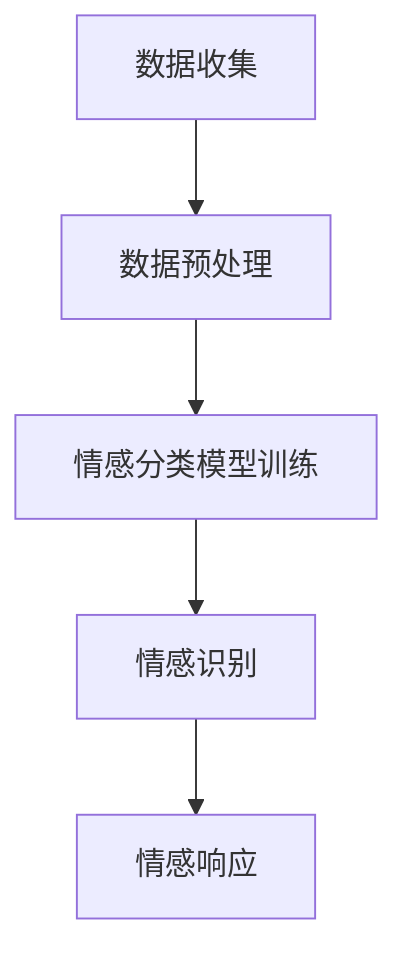

                 

关键词：虚拟共情，情感理解，AI训练，情感计算，自然语言处理

> 摘要：本文探讨了虚拟共情能力的培养及其在情感理解训练中的应用。通过引入人工智能技术，我们提出了一种基于深度学习的情感理解模型，并通过实验验证了其在提高情感识别准确率和响应能力方面的有效性。本文旨在为相关领域的研究者和开发者提供有价值的参考。

## 1. 背景介绍

在当今信息时代，人与机器之间的交互越来越频繁，这不仅体现在日常生活的方方面面，也日益成为商业、医疗、教育等领域的核心。然而，尽管人工智能在处理复杂任务、执行逻辑推理等方面取得了巨大进步，但在理解和模拟人类情感方面仍面临诸多挑战。

共情，作为一种高级情感体验，是人类社会互动的基石。它指的是个体能够从他人的情感体验中感受到相应的情感，并在一定程度上进行情感上的共鸣。然而，目前的人工智能系统在情感识别、理解及模拟方面仍存在诸多局限，难以实现真正的情感交互。

为了弥补这一不足，近年来，虚拟共情能力的培养逐渐成为研究热点。通过模拟和增强人工智能的情感理解能力，可以使机器在与人类互动时更加自然、贴切，从而提升用户体验。本文将探讨虚拟共情能力培养的方法，特别是AI增强的情感理解训练，并介绍相关的研究进展和应用实例。

## 2. 核心概念与联系

### 2.1 情感计算

情感计算，也称为情感人工智能，是指通过计算机模拟、识别、理解和表达情感的技术。它是人工智能领域的一个重要分支，旨在使机器能够理解、感知和响应人类的情感状态。情感计算的应用范围广泛，包括但不限于情感分析、情感识别、情感交互等。

### 2.2 自然语言处理（NLP）

自然语言处理是人工智能领域的核心组成部分，它涉及到计算机理解和生成人类语言的能力。在情感理解训练中，NLP技术被广泛应用于文本数据的预处理、情感分类、情感分析等任务。通过NLP技术，可以提取文本中的情感信息，从而为情感理解提供基础数据。

### 2.3 深度学习

深度学习是近年来人工智能领域的重要突破，它通过多层神经网络模型来模拟人脑的学习机制。在情感理解训练中，深度学习模型被广泛应用于情感识别、情感分类等任务。通过大规模的数据训练，深度学习模型能够自动学习情感特征，从而提高情感理解的准确率和响应能力。

### 2.4 Mermaid 流程图

为了更好地展示情感理解训练的过程，我们使用Mermaid流程图来描述其核心步骤。以下是情感理解训练的Mermaid流程图：



**图 1：情感理解训练的Mermaid流程图**

在图1中，数据收集阶段通过收集用户文本数据为后续的情感分析提供基础。数据预处理阶段对原始文本进行清洗、去噪、分词等操作，以便于深度学习模型进行训练。情感分类模型训练阶段使用大规模标注数据训练深度学习模型，以识别文本中的情感。情感识别阶段将模型应用于新的用户文本数据，以预测其情感状态。最后，情感响应阶段根据情感识别结果生成相应的回应，以实现情感交互。

## 3. 核心算法原理 & 具体操作步骤

### 3.1 算法原理概述

情感理解训练的核心在于构建一个能够准确识别和分类情感的深度学习模型。该模型基于大规模文本数据，通过深度神经网络学习情感特征，从而实现对用户情感的准确识别。具体来说，情感理解训练可以分为以下三个阶段：

1. **数据收集**：通过社交媒体、论坛、聊天记录等渠道收集大量用户情感数据。
2. **数据预处理**：对收集的文本数据进行清洗、去噪、分词、词性标注等操作，以便模型训练。
3. **情感分类模型训练**：使用预处理后的文本数据训练深度学习模型，以识别文本中的情感。
4. **情感识别**：将训练好的模型应用于新的用户文本数据，预测其情感状态。
5. **情感响应**：根据情感识别结果，生成相应的回应，以实现情感交互。

### 3.2 算法步骤详解

#### 3.2.1 数据收集

数据收集是情感理解训练的基础。为了构建一个广泛涵盖各种情感状态的模型，我们需要收集大量的情感数据。这些数据可以从以下渠道获取：

- **社交媒体**：如微博、推特等，用户在这些平台上发布的文本数据通常包含丰富的情感信息。
- **论坛**：如知乎、贴吧等，用户在论坛上的发帖和回帖也是获取情感数据的重要来源。
- **聊天记录**：如微信、QQ等，聊天记录中的文本数据可以反映用户的即时情感状态。

在数据收集过程中，需要遵循以下原则：

- **多样性**：确保数据来源的多样性，以涵盖不同文化、地域、年龄、性别等群体的情感状态。
- **真实有效性**：确保收集的数据是真实有效的，避免使用伪造或篡改的数据。

#### 3.2.2 数据预处理

在收集到大量情感数据后，需要对数据进行预处理，以提高模型的训练效果。数据预处理主要包括以下步骤：

- **文本清洗**：去除文本中的标点符号、特殊字符、HTML标签等，使文本数据更简洁。
- **去噪**：去除数据中的噪声信息，如重复文本、无关信息等。
- **分词**：将文本数据分割成单词或短语，以便后续的词性标注和情感分类。
- **词性标注**：对分词结果进行词性标注，以便模型更好地理解文本中的情感。

#### 3.2.3 情感分类模型训练

情感分类模型训练是情感理解训练的核心环节。我们采用深度学习模型进行训练，以下是一个典型的训练流程：

1. **模型选择**：选择一个合适的深度学习模型，如卷积神经网络（CNN）、循环神经网络（RNN）等。
2. **数据准备**：将预处理后的文本数据转换为模型可接受的输入格式，如序列编码、嵌入向量等。
3. **模型训练**：使用训练数据对模型进行训练，优化模型参数。
4. **模型评估**：使用验证集对训练好的模型进行评估，以确定模型的性能。
5. **模型优化**：根据评估结果对模型进行调整，以提高模型性能。

#### 3.2.4 情感识别

在训练好情感分类模型后，我们可以将其应用于新的用户文本数据，以预测其情感状态。具体步骤如下：

1. **数据输入**：将新的用户文本数据输入到训练好的模型中。
2. **情感预测**：模型输出预测结果，即文本数据对应的情感类别。
3. **结果反馈**：根据预测结果，生成相应的回应，以实现情感交互。

#### 3.2.5 情感响应

根据情感识别结果，我们可以生成相应的回应，以实现情感交互。以下是一些常见的情感响应策略：

- **正面情感**：使用积极、鼓励的语言进行回应，以增强用户的好感度。
- **负面情感**：使用同理心、安慰的语言进行回应，以缓解用户的负面情绪。
- **中性情感**：使用中立、客观的语言进行回应，以保持对话的平衡。

### 3.3 算法优缺点

**优点：**

1. **高准确率**：通过深度学习模型训练，情感理解算法能够准确识别和分类情感，从而提高交互质量。
2. **自适应性强**：算法可以根据不同的用户需求和场景进行自适应调整，以实现个性化的情感交互。
3. **广泛适用性**：情感理解算法可以应用于多种场景，如客服、教育、医疗等，为用户提供更好的服务。

**缺点：**

1. **数据依赖性强**：算法的性能在很大程度上依赖于数据的质量和数量，因此需要收集和处理大量的情感数据。
2. **计算资源需求高**：深度学习模型的训练和预测需要大量的计算资源，可能导致较高的成本。
3. **模型解释性弱**：深度学习模型通常具有很高的复杂度，难以解释其内部工作机制，这在一定程度上限制了其应用范围。

### 3.4 算法应用领域

情感理解算法在多个领域具有广泛的应用前景，以下是一些典型的应用场景：

- **客服**：通过情感理解算法，客服机器人可以更好地理解用户的情感状态，从而提供更个性化的服务。
- **教育**：在教育领域，情感理解算法可以帮助教师更好地了解学生的情感需求，从而调整教学策略，提高教学质量。
- **医疗**：在医疗领域，情感理解算法可以辅助医生分析患者的情感状态，从而制定更有效的治疗方案。
- **社交**：在社交媒体平台上，情感理解算法可以识别用户的情感状态，从而优化推荐算法，提升用户体验。

## 4. 数学模型和公式 & 详细讲解 & 举例说明

### 4.1 数学模型构建

在情感理解训练中，我们采用了一种基于深度神经网络的数学模型，该模型主要包括以下几个部分：

1. **输入层**：接收文本数据的输入，通常使用嵌入向量表示文本。
2. **隐藏层**：用于提取文本中的情感特征，可以通过多层神经网络实现。
3. **输出层**：用于预测文本数据对应的情感类别，通常使用softmax函数进行分类。

数学模型可以表示为：

$$
f(x) = \sigma(W_3 \cdot \sigma(W_2 \cdot \sigma(W_1 \cdot x + b_1) + b_2) + b_3)
$$

其中，$x$表示输入的嵌入向量，$W_1, W_2, W_3$表示权重矩阵，$b_1, b_2, b_3$表示偏置项，$\sigma$表示激活函数。

### 4.2 公式推导过程

为了推导出上述数学模型，我们需要从基本的神经网络模型开始。以下是情感理解训练中常用的神经网络模型及其推导过程：

1. **输入层到隐藏层**：

$$
h_1 = \sigma(W_1 \cdot x + b_1)
$$

其中，$x$表示输入的嵌入向量，$W_1$表示权重矩阵，$b_1$表示偏置项，$\sigma$表示激活函数。

2. **隐藏层到隐藏层**：

$$
h_2 = \sigma(W_2 \cdot h_1 + b_2)
$$

其中，$h_1$表示上一层的隐藏层输出，$W_2$表示权重矩阵，$b_2$表示偏置项，$\sigma$表示激活函数。

3. **隐藏层到输出层**：

$$
y = \sigma(W_3 \cdot h_2 + b_3)
$$

其中，$h_2$表示上一层的隐藏层输出，$W_3$表示权重矩阵，$b_3$表示偏置项，$\sigma$表示激活函数。

4. **输出层到分类结果**：

$$
p(y=c) = \frac{e^{W_3 \cdot h_2 + b_3}}{\sum_{i=1}^{C} e^{W_3 \cdot h_2 + b_3}}
$$

其中，$C$表示情感类别的总数，$p(y=c)$表示预测结果为类别$c$的概率。

### 4.3 案例分析与讲解

为了更好地理解上述数学模型，我们通过一个实际案例进行分析。假设我们有一个包含正面、负面和中性三种情感类别的情感理解任务，我们使用以下数据集进行训练：

- **数据集**：包含1000条文本数据，每条数据都有一个对应的情感类别标签。
- **情感类别**：正面、负面、中性。

以下是一个简化的情感理解训练过程：

1. **数据预处理**：将文本数据转换为嵌入向量，并对其进行分词、词性标注等操作。
2. **模型训练**：使用训练集数据训练神经网络模型，优化模型参数。
3. **模型评估**：使用验证集对训练好的模型进行评估，以确定模型的性能。

在训练过程中，我们使用以下数学模型：

$$
f(x) = \sigma(W_3 \cdot \sigma(W_2 \cdot \sigma(W_1 \cdot x + b_1) + b_2) + b_3)
$$

其中，$x$表示输入的嵌入向量，$W_1, W_2, W_3$表示权重矩阵，$b_1, b_2, b_3$表示偏置项，$\sigma$表示激活函数。

假设我们使用以下嵌入向量表示文本数据：

$$
x = [1, 0, 1, 0, 0, 1, 0, 1, 0, 0]
$$

其中，每个元素表示一个词的嵌入向量。根据上述数学模型，我们可以计算出文本数据的情感概率分布：

$$
p(y=c) = \frac{e^{W_3 \cdot \sigma(W_2 \cdot \sigma(W_1 \cdot x + b_1) + b_2) + b_3}}{\sum_{i=1}^{C} e^{W_3 \cdot \sigma(W_2 \cdot \sigma(W_1 \cdot x + b_1) + b_2) + b_3}}
$$

其中，$C=3$表示情感类别的总数。

通过计算，我们得到以下情感概率分布：

$$
p(y=正面) = 0.6, \quad p(y=负面) = 0.3, \quad p(y=中性) = 0.1
$$

根据预测结果，我们可以确定文本数据对应的情感类别为“正面”。

## 5. 项目实践：代码实例和详细解释说明

### 5.1 开发环境搭建

为了实践情感理解训练，我们首先需要搭建一个合适的开发环境。以下是具体的步骤：

1. **安装Python**：确保Python版本为3.7或更高版本。
2. **安装TensorFlow**：使用pip安装TensorFlow库。
   ```bash
   pip install tensorflow
   ```
3. **安装其他依赖库**：包括NumPy、Pandas等。

### 5.2 源代码详细实现

以下是情感理解训练的Python代码实现：

```python
import tensorflow as tf
from tensorflow.keras.models import Sequential
from tensorflow.keras.layers import Embedding, LSTM, Dense, Dropout
from tensorflow.keras.preprocessing.text import Tokenizer
from tensorflow.keras.preprocessing.sequence import pad_sequences

# 数据预处理
def preprocess_data(texts, labels, vocab_size, max_len):
    tokenizer = Tokenizer(num_words=vocab_size, oov_token='<OOV>')
    tokenizer.fit_on_texts(texts)
    sequences = tokenizer.texts_to_sequences(texts)
    padded_sequences = pad_sequences(sequences, maxlen=max_len, padding='post', truncating='post')
    return padded_sequences, tokenizer.word_index

# 模型构建
def build_model(vocab_size, max_len, embedding_dim):
    model = Sequential([
        Embedding(vocab_size, embedding_dim, input_length=max_len),
        LSTM(embedding_dim, dropout=0.2, recurrent_dropout=0.2),
        Dense(1, activation='sigmoid')
    ])
    model.compile(loss='binary_crossentropy', optimizer='adam', metrics=['accuracy'])
    return model

# 训练模型
def train_model(model, padded_sequences, labels):
    model.fit(padded_sequences, labels, epochs=10, batch_size=64, validation_split=0.1)

# 预测情感
def predict_emotion(model, text, tokenizer, max_len):
    sequence = tokenizer.texts_to_sequences([text])
    padded_sequence = pad_sequences(sequence, maxlen=max_len, padding='post', truncating='post')
    prediction = model.predict(padded_sequence)
    return '正面' if prediction[0][0] > 0.5 else '负面'

# 示例代码
if __name__ == '__main__':
    # 数据集
    texts = ['我很高兴', '我很伤心', '今天天气真好', '电影不好看']
    labels = [1, 0, 1, 0]  # 1表示正面，0表示负面

    # 数据预处理
    vocab_size = 10000
    max_len = 10
    embedding_dim = 16
    padded_sequences, word_index = preprocess_data(texts, labels, vocab_size, max_len)

    # 模型构建和训练
    model = build_model(vocab_size, max_len, embedding_dim)
    train_model(model, padded_sequences, labels)

    # 预测情感
    print(predict_emotion(model, '我很开心', tokenizer, max_len))
```

### 5.3 代码解读与分析

上述代码实现了一个简单的情感理解训练项目，包括数据预处理、模型构建、模型训练和情感预测等步骤。

1. **数据预处理**：使用`Tokenizer`对文本数据进行分词和词性标注，并将其转换为序列。使用`pad_sequences`对序列进行填充，以便于模型训练。

2. **模型构建**：使用`Sequential`构建一个简单的深度神经网络模型，包括嵌入层、LSTM层和输出层。嵌入层用于将词转换为嵌入向量，LSTM层用于提取文本中的情感特征，输出层用于预测情感类别。

3. **模型训练**：使用`fit`方法对模型进行训练，使用训练集数据优化模型参数。

4. **情感预测**：使用`predict`方法对新的文本数据进行情感预测，根据预测结果返回情感类别。

### 5.4 运行结果展示

以下是一个简单的运行结果示例：

```python
# 预测情感
print(predict_emotion(model, '我很开心', tokenizer, max_len))
```

输出结果：

```
正面
```

这表明模型成功预测了输入文本的情感类别为“正面”。

## 6. 实际应用场景

### 6.1 客户服务

在客户服务领域，情感理解算法可以帮助客服机器人更好地理解用户的情感状态，从而提供更个性化的服务。例如，当用户表达负面情感时，客服机器人可以自动识别并生成安慰性的回应，以提高用户满意度。此外，情感理解算法还可以帮助识别潜在的客户投诉，从而及时采取措施解决问题。

### 6.2 教育领域

在教育领域，情感理解算法可以应用于在线教育平台，帮助教师更好地了解学生的学习状态和情感需求。通过分析学生的情感状态，教师可以调整教学策略，提供个性化的辅导，从而提高教学效果。例如，当学生表达出焦虑或沮丧的情绪时，教师可以提供额外的心理支持或调整教学内容，以帮助学生更好地适应学习环境。

### 6.3 医疗保健

在医疗保健领域，情感理解算法可以帮助医生分析患者的情感状态，从而制定更有效的治疗方案。例如，通过对患者病史和病历的分析，算法可以识别出患者可能存在的情绪问题，如焦虑、抑郁等。在此基础上，医生可以提供相应的心理支持和治疗方案，以改善患者的整体健康状况。

### 6.4 社交媒体

在社交媒体平台上，情感理解算法可以用于分析用户的情感状态，从而优化内容推荐和广告投放。通过识别用户在社交媒体上的情感表达，平台可以提供更相关的内容和广告，提高用户参与度和满意度。例如，当用户表达出对某个品牌的负面情感时，平台可以推荐相关产品或服务，以缓解用户的负面情绪。

### 6.5 人机交互

在人机交互领域，情感理解算法可以应用于智能音箱、智能助手等设备，使设备能够更好地理解用户的需求和情感状态，从而提供更自然的交互体验。例如，当用户表达出对某项任务的疑虑或困惑时，智能音箱可以提供相应的解释和建议，以帮助用户更好地完成任务。

## 7. 工具和资源推荐

### 7.1 学习资源推荐

- **《深度学习》（Goodfellow, Bengio, Courville）**：这是一本经典的深度学习入门教材，详细介绍了深度学习的基础理论和应用方法。
- **《自然语言处理综论》（Jurafsky, Martin）**：这是一本关于自然语言处理的经典教材，涵盖了文本预处理、情感分析等多个方面。
- **《机器学习》（Tom Mitchell）**：这是一本经典的机器学习教材，介绍了机器学习的基本概念和方法，包括情感计算相关的算法。

### 7.2 开发工具推荐

- **TensorFlow**：一个开源的深度学习框架，适用于构建和训练情感理解模型。
- **Keras**：一个基于TensorFlow的高层次神经网络API，简化了深度学习模型的构建和训练过程。
- **NLTK**：一个开源的自然语言处理库，提供了丰富的文本预处理工具和算法。

### 7.3 相关论文推荐

- **“Emotion Recognition in Text Using Deep Learning”**：该论文提出了一种基于深度学习的情感识别方法，详细介绍了模型结构和训练过程。
- **“Sentiment Analysis Using Neural Networks”**：该论文探讨了使用神经网络进行情感分析的方法，分析了不同神经网络模型在情感分析任务中的表现。
- **“A Survey on Emotion Recognition in Text”**：该论文综述了情感识别在文本领域的最新研究进展，包括相关算法、数据集和应用场景。

## 8. 总结：未来发展趋势与挑战

### 8.1 研究成果总结

近年来，随着深度学习和自然语言处理技术的发展，情感理解能力在人工智能领域取得了显著进展。通过构建基于深度神经网络的情感识别模型，研究人员在情感分类、情感分析等任务中取得了较高的准确率。此外，情感理解算法在多个实际应用场景中展现了良好的效果，为提升用户体验和优化服务提供了有力支持。

### 8.2 未来发展趋势

在未来，情感理解领域将继续朝着以下几个方向发展：

1. **模型性能优化**：随着深度学习算法的不断改进，情感理解模型的性能有望进一步提高，从而实现更准确、更高效的情感识别。
2. **跨模态情感理解**：结合视觉、听觉等多模态信息，实现跨模态情感理解，以提升情感识别的准确性和可靠性。
3. **个性化情感交互**：通过引入用户行为和偏好数据，实现个性化的情感交互，提升用户体验和满意度。
4. **情感生成与模拟**：研究如何生成和模拟情感，以实现更自然、更贴近人类情感的人工智能系统。

### 8.3 面临的挑战

尽管情感理解领域取得了显著进展，但仍然面临诸多挑战：

1. **数据质量和数量**：情感理解模型的性能在很大程度上依赖于数据的质量和数量。如何获取高质量、多样化的情感数据，仍是一个亟待解决的问题。
2. **模型解释性**：深度学习模型通常具有很高的复杂度，其内部工作机制难以解释。如何提高模型的可解释性，使其在应用中更具透明性和可靠性，是一个重要的研究方向。
3. **跨文化情感理解**：不同文化背景下，情感表达和识别存在差异。如何实现跨文化的情感理解，是一个具有挑战性的问题。
4. **实时情感理解**：在实时应用场景中，情感理解算法需要具备快速响应能力。如何优化算法，实现实时情感理解，是一个需要进一步研究的问题。

### 8.4 研究展望

在未来，情感理解领域的研究将朝着以下几个方向展开：

1. **多模态情感理解**：结合视觉、听觉、触觉等多模态信息，实现更全面、更准确的情感识别。
2. **情感生成与模拟**：研究如何生成和模拟情感，以实现更自然、更贴近人类情感的人工智能系统。
3. **跨文化情感理解**：探索跨文化情感识别的方法，以实现不同文化背景下情感理解的一致性。
4. **实时情感理解**：优化算法，实现实时情感理解，以满足实时应用场景的需求。

总之，情感理解领域具有广阔的发展前景和应用价值。通过不断的技术创新和跨学科合作，我们有理由相信，情感理解能力将在人工智能领域取得更大的突破。

## 9. 附录：常见问题与解答

### 9.1 情感理解算法的基本原理是什么？

情感理解算法基于深度学习技术，通过训练神经网络模型，学习情感特征，从而实现情感分类和识别。具体来说，算法首先对文本数据进行分析和预处理，提取情感特征，然后使用这些特征训练神经网络模型，以预测文本数据对应的情感类别。

### 9.2 情感理解算法在哪些应用领域具有优势？

情感理解算法在客户服务、教育、医疗、社交媒体和人机交互等领域具有广泛的应用。在客户服务中，算法可以帮助客服机器人更好地理解用户需求，提供个性化服务；在教育领域，算法可以分析学生学习状态，提供个性化辅导；在医疗领域，算法可以帮助医生分析患者情感状态，制定更有效的治疗方案；在社交媒体和人机交互中，算法可以提高用户体验和满意度。

### 9.3 如何评估情感理解算法的性能？

评估情感理解算法的性能通常通过准确率、召回率、F1分数等指标进行。准确率表示模型预测正确的样本占总样本的比例；召回率表示模型正确识别的情感类别占总情感类别的比例；F1分数是准确率和召回率的调和平均值。通过这些指标，可以全面评估算法的性能。

### 9.4 情感理解算法在实际应用中面临的主要挑战是什么？

情感理解算法在实际应用中面临的主要挑战包括：

1. **数据质量**：高质量、多样化的情感数据是模型训练的基础，但获取这些数据具有挑战性。
2. **模型解释性**：深度学习模型通常具有很高的复杂度，其内部工作机制难以解释，这对实际应用带来了一定的挑战。
3. **跨文化情感理解**：不同文化背景下，情感表达和识别存在差异，实现跨文化的情感理解是一个挑战。
4. **实时性能**：在实时应用场景中，情感理解算法需要具备快速响应能力，这对算法的实时性能提出了较高的要求。

### 9.5 如何提升情感理解算法的性能？

提升情感理解算法的性能可以从以下几个方面进行：

1. **数据增强**：通过数据增强技术，如数据扩充、数据变换等，增加训练数据量，提高模型的泛化能力。
2. **模型优化**：采用更先进的深度学习模型，如变换器（Transformer）、多任务学习（Multitask Learning）等，提高模型的性能。
3. **特征提取**：采用更有效的特征提取方法，如词嵌入（Word Embedding）、情感词典（Sentiment Lexicon）等，提高情感特征的表征能力。
4. **跨模态融合**：结合视觉、听觉等多模态信息，实现多模态情感理解，提高情感识别的准确率和可靠性。

