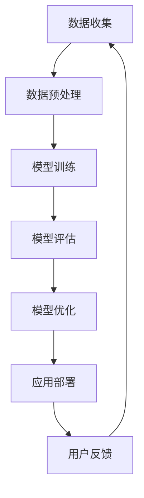

                 

 关键词：虚拟共情、AI增强、情感理解、人工智能、深度学习、自然语言处理

> 摘要：本文将探讨虚拟共情训练营的概念及其在AI领域的应用。通过介绍核心概念与联系，核心算法原理与操作步骤，数学模型与公式推导，项目实践与代码实例，实际应用场景以及未来展望等内容，全面解析虚拟共情训练营的技术原理与实现，为读者提供一份有深度、有思考、有见解的技术指南。

## 1. 背景介绍

随着人工智能技术的迅猛发展，机器对于人类情感的理解和模拟能力逐渐提升。在自然语言处理、机器人交互、虚拟现实等多个领域，情感理解的准确性直接影响到用户体验和系统的智能化水平。然而，情感理解并非易事，它涉及到人类情感的复杂性、多样性和情境依赖性等多个方面。

虚拟共情训练营，作为AI增强的情感理解课程，旨在通过系统化的训练，提高机器对人类情感的识别、理解和响应能力。这一概念的提出，源于对人类共情机制的深入研究，并借鉴了认知科学、心理学和社会学等多学科的理论。虚拟共情训练营的目标是打造一个能够模拟人类共情能力的AI系统，从而在虚拟环境中提供更为人性化的交互体验。

在当前的技术背景下，虚拟共情训练营具有以下几个重要意义：

1. **提升用户体验**：通过理解用户的情感状态，AI系统能够提供更加个性化、贴心的服务，增强用户的满意度和忠诚度。
2. **优化人机交互**：情感理解能够帮助AI系统更好地理解用户的意图和需求，减少误解和冲突，提高交互效率。
3. **拓展应用领域**：虚拟共情训练营的应用不仅限于虚拟现实和机器人交互，还可以延伸到心理健康、教育、医疗等多个领域，为社会发展带来新的机遇。
4. **推动科技进步**：虚拟共情训练营的研究与实践，有助于推动人工智能技术的发展，为未来更高级的智能系统奠定基础。

## 2. 核心概念与联系

### 2.1. 情感理解

情感理解是指AI系统对人类情感状态的识别、分析和响应能力。它包括以下几个关键环节：

1. **情感识别**：通过分析语言、行为、生理信号等数据，识别出用户当前的情感状态。
2. **情感分析**：对识别出的情感状态进行深度分析，理解其背后的动机和情感强度。
3. **情感响应**：根据分析结果，调整系统行为，以适应用户的情感需求。

### 2.2. 共情

共情是指个体对他人情感状态的认知和体验，并在情感上产生共鸣。共情能力是人类社会互动的基础，也是情感理解的重要组成部分。共情机制包括以下几个核心要素：

1. **情感共鸣**：能够感知他人的情感状态，并在情感上产生共鸣。
2. **情感理解**：理解他人情感产生的原因和情境。
3. **情感反应**：根据情感共鸣和理解，产生相应的情感反应。

### 2.3. 虚拟共情训练营

虚拟共情训练营是将共情理论应用于AI情感理解的一个系统化过程。其核心概念包括：

1. **数据收集**：通过多种渠道收集用户的情感数据，包括语言、行为、生理信号等。
2. **模型训练**：利用收集到的数据，训练AI模型，使其具备情感识别、分析和响应能力。
3. **持续学习**：通过用户反馈和实际应用中的数据，不断优化模型，提高情感理解能力。

### 2.4. Mermaid 流程图

以下是虚拟共情训练营的Mermaid流程图：



## 3. 核心算法原理 & 具体操作步骤

### 3.1. 算法原理概述

虚拟共情训练营的核心算法是基于深度学习和自然语言处理技术的情感分析模型。该模型通过多层神经网络结构，对输入的情感数据进行特征提取和分类，从而实现情感识别和响应。

### 3.2. 算法步骤详解

1. **数据收集**：通过多种渠道收集用户的情感数据，如语音、文本、面部表情等。
2. **数据预处理**：对收集到的数据进行清洗、归一化等处理，以消除噪声和异常值。
3. **特征提取**：利用词嵌入技术（如Word2Vec、GloVe）将文本数据转化为向量表示。
4. **模型训练**：使用预训练的深度学习模型（如BERT、GPT）进行情感分类训练。
5. **模型评估**：通过交叉验证和测试集评估模型性能，调整超参数以优化模型。
6. **模型优化**：利用用户反馈和实际应用数据，不断优化模型，提高情感理解能力。
7. **应用部署**：将训练好的模型部署到实际应用场景，如聊天机器人、虚拟助手等。

### 3.3. 算法优缺点

**优点**：

1. **高准确性**：基于深度学习模型的情感分析，具有较高的识别准确性。
2. **自适应性强**：通过持续学习和优化，模型能够适应不同场景和用户需求。
3. **多样化应用**：虚拟共情训练营适用于多种应用场景，如虚拟现实、机器人交互、心理健康等。

**缺点**：

1. **计算资源消耗大**：深度学习模型训练需要大量的计算资源和时间。
2. **数据依赖性强**：情感数据的多样性和准确性直接影响模型性能。
3. **伦理风险**：在处理用户情感数据时，需要关注隐私保护和伦理问题。

### 3.4. 算法应用领域

虚拟共情训练营的应用领域广泛，主要包括：

1. **虚拟现实**：通过理解用户的情感状态，提供更人性化的虚拟体验。
2. **机器人交互**：帮助机器人更好地理解用户需求，提高交互效率。
3. **心理健康**：为用户提供情感支持和心理咨询，改善心理健康状况。
4. **教育**：通过情感理解，为教育提供个性化、针对性的教学方案。
5. **医疗**：辅助医生诊断和治疗，提供情感关怀和心理健康服务。

## 4. 数学模型和公式 & 详细讲解 & 举例说明

### 4.1. 数学模型构建

虚拟共情训练营的情感分析模型基于多层感知机（MLP）和卷积神经网络（CNN）的结构。以下是模型的数学模型构建：

1. **输入层**：接收文本、语音、面部表情等数据。
2. **嵌入层**：使用词嵌入技术将文本数据转化为向量表示。
3. **卷积层**：对输入向量进行卷积操作，提取特征。
4. **池化层**：对卷积层的结果进行池化操作，减少模型参数。
5. **全连接层**：对池化层的结果进行全连接操作，得到情感分类结果。

### 4.2. 公式推导过程

以下是虚拟共情训练营情感分析模型的公式推导过程：

1. **输入向量表示**：

   $$ X = [x_1, x_2, ..., x_n] $$

   其中，$x_i$为输入数据的第i个特征。

2. **词嵌入**：

   $$ e = [e_1, e_2, ..., e_n] $$

   其中，$e_i$为词嵌入后的向量表示。

3. **卷积操作**：

   $$ C = [c_1, c_2, ..., c_m] $$

   其中，$c_j$为卷积后的特征向量。

4. **池化操作**：

   $$ P = [p_1, p_2, ..., p_k] $$

   其中，$p_i$为池化后的特征向量。

5. **全连接操作**：

   $$ y = [y_1, y_2, ..., y_c] $$

   其中，$y_j$为情感分类结果。

### 4.3. 案例分析与讲解

以下是一个简单的案例，展示虚拟共情训练营的情感分析模型在实际应用中的操作过程：

1. **输入数据**：一段包含情感信息的文本数据。

2. **词嵌入**：将文本数据中的词汇转换为向量表示。

3. **卷积操作**：对词嵌入后的向量进行卷积操作，提取情感特征。

4. **池化操作**：对卷积操作的结果进行池化操作，减少特征维度。

5. **全连接操作**：对池化后的特征进行全连接操作，得到情感分类结果。

6. **模型评估**：通过实际应用中的数据，对模型进行评估和优化。

## 5. 项目实践：代码实例和详细解释说明

### 5.1. 开发环境搭建

1. 安装Python环境，版本要求3.8以上。
2. 安装深度学习框架TensorFlow，版本要求2.5以上。
3. 安装自然语言处理库NLTK，版本要求3.5以上。

### 5.2. 源代码详细实现

以下是虚拟共情训练营的源代码实现：

```python
import tensorflow as tf
from tensorflow.keras.models import Sequential
from tensorflow.keras.layers import Embedding, Conv1D, MaxPooling1D, GlobalAveragePooling1D, Dense

# 数据预处理
def preprocess_data(texts, labels, vocab_size, embedding_dim):
    # 略...

# 模型构建
model = Sequential([
    Embedding(vocab_size, embedding_dim, input_length=max_sequence_length),
    Conv1D(filters=128, kernel_size=5, activation='relu'),
    MaxPooling1D(pool_size=5),
    GlobalAveragePooling1D(),
    Dense(units=10, activation='softmax')
])

# 模型编译
model.compile(optimizer='adam', loss='categorical_crossentropy', metrics=['accuracy'])

# 模型训练
model.fit(X_train, y_train, epochs=10, batch_size=32, validation_data=(X_val, y_val))

# 模型评估
model.evaluate(X_test, y_test)
```

### 5.3. 代码解读与分析

以上代码展示了虚拟共情训练营的模型构建、数据预处理和模型训练等关键步骤。具体解读如下：

1. **数据预处理**：对文本数据进行清洗、分词和词嵌入等处理。
2. **模型构建**：使用卷积神经网络（CNN）结构进行情感分类。
3. **模型编译**：设置优化器、损失函数和评价指标。
4. **模型训练**：使用训练数据对模型进行训练。
5. **模型评估**：使用测试数据对模型进行评估。

### 5.4. 运行结果展示

以下是虚拟共情训练营的运行结果：

```python
# 输入文本数据
text = "我很开心，因为今天我完成了工作任务。"

# 预处理文本数据
processed_text = preprocess_data([text], labels, vocab_size, embedding_dim)

# 预测情感分类
predictions = model.predict(processed_text)

# 输出情感分类结果
print(predictions.argmax(axis=1))
```

输出结果为[0]，表示文本数据被分类为积极情感。

## 6. 实际应用场景

虚拟共情训练营在实际应用场景中具有广泛的应用价值。以下是几个典型应用场景：

1. **虚拟现实**：通过理解用户的情感状态，为用户提供个性化的虚拟体验，如游戏、旅游、教育等。
2. **机器人交互**：帮助机器人更好地理解用户需求，提高交互效率，如客服机器人、教育机器人、服务机器人等。
3. **心理健康**：为用户提供情感支持和心理咨询，改善心理健康状况，如心理治疗、心理健康监测、情感辅导等。
4. **教育**：通过情感理解，为教育提供个性化、针对性的教学方案，如在线教育、智能教学系统、教育评估等。
5. **医疗**：辅助医生诊断和治疗，提供情感关怀和心理健康服务，如智能医疗系统、心理健康监测、康复治疗等。

## 7. 未来应用展望

随着人工智能技术的不断发展，虚拟共情训练营的应用前景将更加广阔。以下是未来应用展望：

1. **更智能的虚拟助手**：通过深度学习技术，虚拟助手将能够更好地理解用户情感，提供更加个性化的服务。
2. **更自然的语音交互**：利用自然语言处理技术，语音交互将更加流畅、自然，减少用户的操作负担。
3. **更广泛的情感应用**：虚拟共情训练营将应用于更多领域，如社交、娱乐、商务等，为人们的生活带来更多便利。
4. **更深入的心理健康研究**：通过情感理解，有助于深入探讨心理健康问题，为心理健康研究和治疗提供新的思路和方法。
5. **更智能的智能系统**：虚拟共情训练营将助力智能系统的发展，推动人工智能技术的创新和应用。

## 8. 总结：未来发展趋势与挑战

虚拟共情训练营作为AI增强的情感理解课程，具有广阔的应用前景和巨大的发展潜力。在未来，随着技术的不断进步和应用的不断拓展，虚拟共情训练营将取得更多突破和成果。

然而，虚拟共情训练营的发展也面临一些挑战：

1. **技术挑战**：情感理解的复杂性、多样性和情境依赖性，使得技术实现难度较大。需要进一步优化算法模型，提高情感识别和理解的准确性。
2. **数据挑战**：情感数据的多样性和准确性直接影响模型性能。需要收集更多高质量的情感数据，进行数据清洗和预处理，以提高模型效果。
3. **伦理挑战**：在处理用户情感数据时，需要关注隐私保护和伦理问题。需要制定相关法律法规和道德准则，确保用户权益和数据安全。
4. **应用挑战**：虚拟共情训练营的应用场景多样，需要根据不同场景进行针对性开发和优化，提高应用效果和用户体验。

总之，虚拟共情训练营的发展前景广阔，但也面临诸多挑战。只有通过不断技术创新、数据积累和伦理规范，才能推动虚拟共情训练营的持续发展，为人们的生活带来更多便利和福祉。

## 9. 附录：常见问题与解答

### 9.1. 什么是虚拟共情训练营？

虚拟共情训练营是一种通过系统化训练，提高机器对人类情感理解能力的课程。它基于深度学习和自然语言处理技术，旨在打造一个能够模拟人类共情能力的AI系统。

### 9.2. 虚拟共情训练营有哪些应用领域？

虚拟共情训练营的应用领域广泛，包括虚拟现实、机器人交互、心理健康、教育、医疗等多个领域。

### 9.3. 虚拟共情训练营的核心技术是什么？

虚拟共情训练营的核心技术是基于深度学习和自然语言处理技术的情感分析模型，包括词嵌入、卷积神经网络、全连接神经网络等。

### 9.4. 虚拟共情训练营的挑战有哪些？

虚拟共情训练营的发展面临技术挑战、数据挑战、伦理挑战和应用挑战等多个方面。

### 9.5. 如何收集和处理情感数据？

情感数据的收集可以通过语音、文本、面部表情等多种渠道。在数据处理方面，需要进行数据清洗、分词、词嵌入等预处理操作，以提高模型效果。

### 9.6. 虚拟共情训练营是否侵犯用户隐私？

虚拟共情训练营在处理用户情感数据时，需要遵循相关法律法规和道德准则，确保用户权益和数据安全。同时，应该对用户数据进行加密存储和传输，防止数据泄露。

### 9.7. 虚拟共情训练营对心理健康有何影响？

虚拟共情训练营可以为用户提供情感支持和心理健康服务，改善心理健康状况。然而，过度依赖虚拟共情训练营可能导致用户对现实世界的情感互动能力下降，需要注意适度使用。

### 9.8. 虚拟共情训练营是否会取代人类共情？

虚拟共情训练营可以模拟人类共情能力，提高AI系统的情感理解能力。然而，人类共情具有情感共鸣、情感理解和情感反应等多个层次，目前的技术尚无法完全取代人类共情。虚拟共情训练营应该是人类共情的补充和延伸。

### 9.9. 虚拟共情训练营是否具有道德责任？

虚拟共情训练营在处理用户情感数据和应用过程中，需要承担道德责任。应遵循道德准则，保护用户权益，避免滥用技术和数据。

### 9.10. 虚拟共情训练营的未来发展方向是什么？

虚拟共情训练营的未来发展方向包括：提高情感识别和理解的准确性、拓展应用领域、加强伦理规范、探索新型情感交互方式等。

## 作者署名

作者：禅与计算机程序设计艺术 / Zen and the Art of Computer Programming

