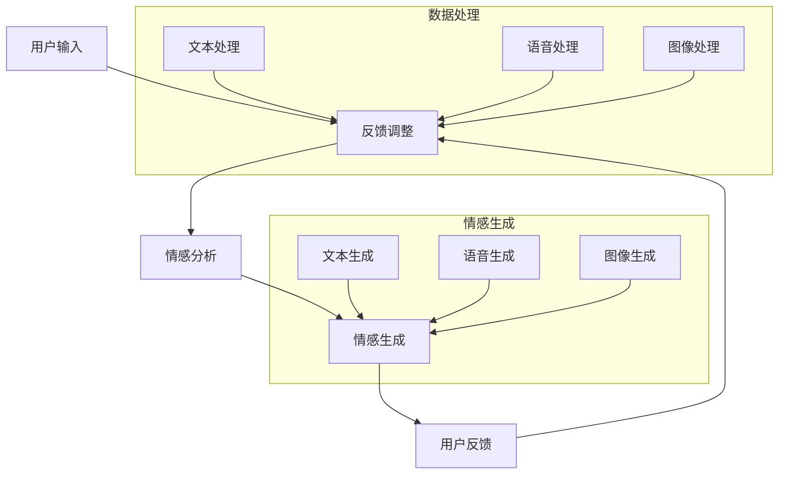

                 

 > 在这个数字化的时代，人工智能（AI）已经成为我们生活中不可或缺的一部分。然而，尽管AI在许多领域都取得了显著的成就，但在情感理解方面，它仍然面临诸多挑战。本文将探讨虚拟共情的概念，以及如何通过AI技术增强情感理解，为人工智能带来更人性化的互动体验。作者：禅与计算机程序设计艺术 / Zen and the Art of Computer Programming

## 关键词

- 人工智能
- 情感理解
- 虚拟共情
- 机器学习
- 深度学习
- 自然语言处理

## 摘要

本文首先介绍了虚拟共情这一概念，探讨了其背后的动机和重要性。随后，文章深入分析了情感理解的核心算法原理，包括情感识别、情感分析和情感生成等技术。接着，文章通过具体的数学模型和公式，详细讲解了情感理解过程中的关键步骤。此外，文章还提供了实际项目实践的代码实例，展示了如何在实际应用中实现情感理解。最后，文章讨论了情感理解在实际应用中的场景和未来发展的展望。

## 1. 背景介绍

在当今社会，人工智能技术正以前所未有的速度发展。从智能助手到自动驾驶，AI已经在许多领域展现出了其强大的能力。然而，AI的这些成就很大程度上是基于逻辑推理和模式识别，而忽略了人类情感的重要性。情感是人类行为和决策的重要驱动力，是人与人之间互动的核心。因此，如何让AI具备情感理解能力，实现与人类的情感互动，成为了一个重要的研究方向。

虚拟共情是指通过人工智能技术模拟和增强人类情感理解的能力。它旨在让AI能够感知、识别和回应人类的情感状态，从而提供更加人性化的交互体验。虚拟共情的研究涉及到多个领域，包括心理学、认知科学、计算机科学和机器学习等。

在心理学领域，研究者们深入探讨了情感的本质、情感的表达和情感的影响。在认知科学领域，研究者们研究了人类如何感知和解读情感信息。而在计算机科学和机器学习领域，研究者们则致力于开发算法和模型，以实现情感理解和模拟。

随着虚拟现实（VR）和增强现实（AR）技术的发展，虚拟共情的应用场景也日益丰富。从虚拟客服到教育模拟，从心理健康治疗到社交互动，虚拟共情有望带来更加真实和丰富的交互体验。

总的来说，虚拟共情的研究不仅具有重要的理论意义，也具有广泛的应用前景。通过本文的探讨，我们希望能够为这一领域的研究提供一些有益的启示。

### 1.1 虚拟共情的重要性

虚拟共情在人工智能领域的重要性不可忽视。首先，它能够显著提升人机交互的体验。传统的人工智能系统往往只能处理结构化的数据和命令，而无法理解人类情感的复杂性和微妙性。这使得它们在处理情感相关的任务时显得笨拙和不自然。而通过虚拟共情，AI能够更好地理解人类的情感需求，提供更加个性化和贴心的服务。

其次，虚拟共情有助于提高AI的决策能力。在许多应用场景中，情感因素往往对决策产生重要影响。例如，在医疗领域，患者的情绪状态可能直接影响他们的治疗效果。通过理解患者的情感，AI可以提供更加精确和有效的治疗方案。在商业领域，了解客户的情感需求可以为企业提供宝贵的市场洞察，从而制定更有效的营销策略。

此外，虚拟共情还有助于促进人工智能的道德和伦理发展。随着AI技术的不断进步，其应用范围也越来越广泛，这引发了一系列道德和伦理问题。如何确保AI的行为符合人类价值观，如何避免AI滥用权力等，都是亟待解决的问题。虚拟共情可以提供一种途径，使AI能够更好地理解和遵守人类社会的道德规范。

最后，虚拟共情为人工智能开辟了新的研究方向。它不仅推动了情感计算技术的发展，也促进了多学科交叉研究，如心理学、认知科学和计算机科学等。这种跨学科的研究有助于我们更深入地理解情感的本质，从而推动人工智能的进一步发展。

总的来说，虚拟共情在人工智能领域具有重要的理论和实践价值。通过提升人机交互体验、提高决策能力、促进道德和伦理发展以及开辟新的研究方向，虚拟共情有望为人工智能带来更加人性化和智能化的未来。

### 1.2 情感理解的定义和重要性

情感理解是指人类或人工智能系统识别、感知和解读情感信息的能力。情感是人类行为和认知的核心驱动力，对人的情绪、决策和社交互动产生深远影响。因此，情感理解在人工智能领域具有至关重要的地位。

首先，情感理解能够提升人机交互的自然性和流畅性。当AI能够准确识别和回应人类的情感状态时，用户会感到更加舒适和被理解，从而提高交互的满意度和忠诚度。例如，在客服系统中，能够理解用户情感状态的人工智能可以提供更加个性化的服务和解决方案，从而提高客户体验和满意度。

其次，情感理解对于AI的决策能力具有重要意义。许多决策过程不仅基于逻辑和事实，还受到情感因素的影响。例如，在金融领域，客户的情感状态可能影响他们的投资决策。通过情感理解，AI可以更准确地预测客户行为，从而提供更有效的投资建议。

此外，情感理解有助于提升AI的伦理道德水平。在许多应用场景中，AI的行为和决策直接影响人类的福祉。例如，在医疗诊断中，AI的决策可能会影响患者的生命和健康。通过情感理解，AI可以更好地理解和遵守人类社会的道德和伦理规范，从而减少潜在的负面社会影响。

情感理解的重要性还体现在其广泛的应用场景中。在教育领域，情感理解可以帮助AI更好地理解学生的学习状态和情感需求，从而提供更加有效的教学支持。在心理健康治疗中，情感理解可以帮助AI识别和监测患者的情感状态，提供个性化的心理健康服务。在社交互动中，情感理解可以使AI更好地理解和回应人类的情感表达，从而建立更加真实和深入的社交关系。

总的来说，情感理解是人工智能不可或缺的一部分。它不仅提升了AI的人机交互体验和决策能力，还有助于其伦理道德发展。通过深入研究和应用情感理解技术，我们可以为人工智能带来更加人性化和智能化的未来。

### 1.3 虚拟共情的研究现状和趋势

虚拟共情作为一个跨学科的研究领域，近年来吸引了越来越多的关注。目前，全球范围内的研究机构和科技公司都在积极投入这一领域，探索如何通过人工智能技术实现更加真实的情感理解和互动。

在研究现状方面，虚拟共情技术已经取得了一些显著的成果。例如，通过机器学习和深度学习算法，AI系统能够从大量的情感数据中学习和识别情感模式。一些先进的情感识别系统已经能够在语音、文本和面部表情等多种数据源中准确识别情感状态。此外，研究人员还在探索如何通过多模态感知技术，结合语音、文本和面部表情等多种数据源，实现更加全面和精准的情感理解。

在应用领域方面，虚拟共情技术已经逐步应用于多个行业和场景。在教育领域，虚拟共情技术可以帮助智能教学系统更好地理解学生的情感状态，提供个性化的学习支持。在医疗领域，虚拟共情技术可以帮助医生更好地了解患者的情绪状态，从而提供更有效的治疗方案。在客户服务领域，虚拟客服系统通过情感理解技术，可以提供更加人性化和高效的客户服务。

然而，虚拟共情技术仍面临许多挑战。首先，情感数据的获取和标注仍然是一个难题。情感数据往往是非结构化和复杂的，难以进行有效的标注和处理。其次，如何确保AI系统在情感理解中的准确性和可靠性，避免误解和偏见，也是一个亟待解决的问题。此外，如何在保证情感理解准确性的同时，保持系统的实时性和高效性，也是一项挑战。

未来发展趋势方面，虚拟共情技术有望进一步与多学科领域结合，实现更加综合和深入的研究。例如，结合心理学、认知科学和神经科学的研究成果，可以进一步提高AI系统的情感理解能力。同时，随着5G和物联网技术的发展，虚拟共情技术将在更多应用场景中得到广泛应用，实现更加智能化和高效的交互体验。

总的来说，虚拟共情是一个充满潜力和挑战的研究领域。通过不断探索和创新，我们有理由相信，虚拟共情技术将带来更加丰富和真实的情感互动体验，为人工智能的发展注入新的活力。

### 2. 核心概念与联系

在深入探讨虚拟共情之前，我们需要了解一些核心概念，这些概念包括情感识别、情感分析和情感生成。这些技术不仅在虚拟共情中起着关键作用，而且在实现人工智能的情感理解方面也具有重要作用。

#### 2.1 情感识别

情感识别是虚拟共情的基础。它涉及从各种数据源（如语音、文本、面部表情等）中提取情感信息，并将其分类为不同的情感类别（如快乐、悲伤、愤怒等）。情感识别通常依赖于机器学习和深度学习算法，这些算法可以从大量的情感数据中学习情感模式。

- **文本情感识别**：文本情感识别是一种常见的情感识别方法，它使用自然语言处理（NLP）技术来分析文本中的情感倾向。例如，通过分析单词的情感极性（如积极或消极），文本情感识别算法可以判断一篇文章或一段对话的情感状态。
  
- **语音情感识别**：语音情感识别通过分析语音信号中的声学特征（如音调、音量和节奏）来识别情感状态。这种方法通常结合了语音识别和声学模型，以便从语音中提取情感信息。

- **面部表情情感识别**：面部表情情感识别通过分析面部图像或视频中的面部表情来识别情感状态。这种方法依赖于计算机视觉技术，如卷积神经网络（CNN）和面部追踪算法。

#### 2.2 情感分析

情感分析是情感识别的进一步延伸，它不仅识别情感的存在，还试图理解情感的强度和上下文。情感分析在多个领域都有应用，如市场调研、舆情分析和心理健康诊断。

- **情感强度分析**：情感强度分析旨在量化情感的程度。例如，在文本情感分析中，可以通过分析情感极性和情感词汇的频率来计算情感强度。

- **情感上下文分析**：情感上下文分析涉及理解情感在特定情境中的含义。这需要结合语义理解和上下文信息，以避免误解情感的含义。

#### 2.3 情感生成

情感生成是指通过人工智能技术创建情感表达。它不仅包括模拟人类的情感反应，还包括生成符合人类情感需求的情感内容。

- **情感反应生成**：情感反应生成是指AI系统根据输入的情感信息生成相应的情感反应。例如，一个虚拟客服系统可以通过语音合成和文本生成技术，生成符合客户情感状态的回答。

- **情感内容生成**：情感内容生成是指AI系统生成具有特定情感内容的信息。例如，在音乐创作中，AI可以生成具有特定情感风格的音乐片段。

#### 2.4 联系与整合

情感识别、情感分析和情感生成这三项技术并不是独立的，而是相互关联和整合的。一个完整的虚拟共情系统通常需要这三项技术的协同作用。

- **多模态融合**：多模态融合是将多种数据源（如语音、文本和面部表情）结合在一起，以实现更全面的情感理解。通过融合不同模态的信息，AI系统可以更准确地识别和解读情感。

- **实时交互**：在虚拟共情系统中，实时交互是一个关键因素。情感识别和情感分析需要实时处理输入信息，并生成相应的情感反应，以保持与人类的实时互动。

- **情感反馈循环**：情感反馈循环是指AI系统根据用户的反馈不断调整和优化情感表现。通过这种反馈机制，AI系统可以逐步提高其情感理解和互动能力。

#### 2.5 Mermaid 流程图

为了更直观地展示这三项技术的联系和整合，我们使用Mermaid流程图来描述一个典型的虚拟共情系统的工作流程。



在这个流程图中，用户输入通过不同的数据源进入系统，经过情感识别、情感分析和情感生成，最终生成符合用户需求的情感反应。同时，用户的反馈会通过反馈循环不断调整系统的表现。

总的来说，情感识别、情感分析和情感生成是虚拟共情系统的核心组成部分。通过多模态融合和实时交互，这些技术共同协作，实现与人类情感的深刻互动。随着技术的不断进步，虚拟共情系统将越来越能够理解和回应人类的情感，为人工智能带来更加人性化的未来。

### 3. 核心算法原理 & 具体操作步骤

#### 3.1 算法原理概述

虚拟共情的核心算法主要涉及情感识别、情感分析和情感生成。这些算法的工作原理基于机器学习和深度学习技术，通过从大量情感数据中学习情感模式，从而实现情感的理解和生成。

1. **情感识别**：情感识别算法主要通过以下几种方法来实现：
   - **文本情感识别**：使用自然语言处理（NLP）技术，通过情感词典和情感极性分析来识别文本中的情感状态。常用的算法包括基于规则的方法和基于机器学习的方法，如支持向量机（SVM）、朴素贝叶斯（Naive Bayes）和深度学习模型（如卷积神经网络（CNN）和循环神经网络（RNN））。
   - **语音情感识别**：通过分析语音信号中的声学特征，如音调、音量和节奏，来识别情感状态。常用的算法包括隐马尔可夫模型（HMM）和高斯混合模型（GMM）。
   - **面部表情情感识别**：通过分析面部图像或视频中的面部特征，如眼角皱纹、嘴角翘起和眉毛形状等，来识别情感状态。常用的算法包括面部追踪和特征点提取，然后使用分类算法（如SVM和CNN）进行情感识别。

2. **情感分析**：情感分析算法主要关注情感强度和上下文的解读，通常包括以下步骤：
   - **情感强度分析**：通过计算情感词汇的频率和极性，使用统计学方法或深度学习方法来量化情感强度。例如，可以使用词袋模型（Bag of Words, BoW）和词嵌入（Word Embedding）技术来分析文本情感强度。
   - **情感上下文分析**：结合上下文信息和语义理解，更准确地解读情感含义。这通常需要使用深度学习模型，如长短期记忆网络（LSTM）和注意力机制（Attention Mechanism），来捕捉文本中的上下文信息。

3. **情感生成**：情感生成算法通过模拟人类的情感反应来生成情感表达。主要包括以下几种方法：
   - **情感反应生成**：通过生成对抗网络（GAN）和文本生成模型（如Transformer和BERT），生成与输入情感信息相匹配的语音、文本和图像。例如，使用文本到语音（Text-to-Speech, TTS）模型生成语音，使用图像生成模型（如GANS）生成符合情感状态的图像。
   - **情感内容生成**：通过生成情感内容，如故事、音乐和艺术作品，来满足特定情感需求。这通常需要复杂的生成模型，如变分自编码器（VAE）和生成扩散模型（Gaussian Diffusion Model）。

#### 3.2 算法步骤详解

下面我们将详细描述每个算法步骤的具体操作过程。

1. **情感识别**

   - **文本情感识别**：首先，对输入文本进行预处理，包括去除停用词、标点符号和进行词性标注。然后，使用词嵌入技术（如Word2Vec或GloVe）将文本转换为向量表示。接着，使用深度学习模型（如CNN或RNN）对文本向量进行情感分类，输出情感概率分布。

   - **语音情感识别**：对语音信号进行特征提取，如梅尔频率倒谱系数（MFCC）和短时傅里叶变换（STFT）。然后，使用声学模型（如HMM或GMM）对特征进行分类，输出情感概率分布。

   - **面部表情情感识别**：对输入面部图像或视频进行特征提取，如Haar-like特征和深度学习特征（如CNN）。然后，使用分类算法（如SVM或CNN）对特征进行情感分类，输出情感概率分布。

2. **情感分析**

   - **情感强度分析**：对预处理后的文本进行情感极性分析，使用情感词典和规则来标注情感极性。然后，计算每个情感词汇的频率和极性得分，使用统计学方法（如逻辑回归或朴素贝叶斯）对文本进行情感强度评分。

   - **情感上下文分析**：结合上下文信息，使用深度学习模型（如LSTM或Transformer）来捕捉文本中的上下文信息。通过上下文信息调整情感强度和极性，输出更准确的情感分析结果。

3. **情感生成**

   - **情感反应生成**：使用文本生成模型（如Transformer和BERT）和文本到语音（TTS）模型生成语音。首先，使用文本生成模型生成与输入情感信息相匹配的文本，然后使用TTS模型将文本转换为语音。

   - **情感内容生成**：使用图像生成模型（如GAN）和音乐生成模型生成图像和音乐。首先，使用图像生成模型生成与输入情感信息相匹配的图像，然后使用音乐生成模型生成符合情感状态的音乐片段。

#### 3.3 算法优缺点

1. **情感识别**

   - **优点**：情感识别算法具有较高的准确性和泛化能力，能够处理多种数据源（如文本、语音和面部表情）。
   - **缺点**：情感识别算法在处理复杂和微妙情感时可能存在困难，特别是在多模态融合方面。

2. **情感分析**

   - **优点**：情感分析算法能够量化情感强度和上下文，提供更深入的情感理解。
   - **缺点**：情感分析算法在处理复杂和模糊的情感时可能存在困难，特别是在情感强度的量化方面。

3. **情感生成**

   - **优点**：情感生成算法能够模拟人类的情感反应，生成符合情感状态的内容。
   - **缺点**：情感生成算法在生成真实和自然的情感内容方面可能存在困难，特别是在情感反应的一致性和连贯性方面。

#### 3.4 算法应用领域

情感识别、情感分析和情感生成算法在多个领域有广泛的应用：

- **人机交互**：通过情感识别和情感分析，实现更加自然和人性化的交互体验。
- **客户服务**：通过情感识别和情感分析，提供更加个性化的客户服务和支持。
- **心理健康**：通过情感识别和情感分析，帮助监测和管理用户的情感状态。
- **市场营销**：通过情感分析和情感生成，制定更有效的营销策略和广告创意。
- **艺术创作**：通过情感生成，生成具有特定情感风格的艺术作品。

总的来说，虚拟共情的核心算法在情感理解和人机交互中发挥着重要作用。随着算法的不断完善和应用领域的扩展，虚拟共情技术将为人工智能带来更加人性化和智能化的未来。

### 4. 数学模型和公式 & 详细讲解 & 举例说明

在虚拟共情技术中，数学模型和公式扮演着至关重要的角色。这些模型和公式不仅用于描述情感计算的基本原理，还为算法的实现提供了具体的操作指南。在本节中，我们将详细讲解用于情感识别、情感分析和情感生成的关键数学模型和公式，并通过具体例子来说明这些公式的应用。

#### 4.1 数学模型构建

1. **情感识别模型**

   情感识别模型通常基于分类算法，如支持向量机（SVM）、朴素贝叶斯（Naive Bayes）和深度学习模型（如卷积神经网络（CNN）和循环神经网络（RNN））。以下是一个简单的SVM模型构建过程：

   - **特征提取**：从输入数据（如文本、语音或面部表情）中提取特征向量。例如，对于文本数据，可以使用词嵌入技术（如Word2Vec）将每个单词转换为向量，然后计算整个文本的词向量平均值。
   - **分类器训练**：使用训练数据集训练SVM分类器。SVM通过最大化分类边界来划分不同情感类别的数据。其目标函数为：
     $$ \min_{w, b} \frac{1}{2} ||w||^2 $$
     其中，\( w \) 是权重向量，\( b \) 是偏置项。
   - **分类决策**：对于新的输入数据，通过分类器计算其类别概率，并选择概率最大的类别作为最终分类结果。

2. **情感分析模型**

   情感分析模型通常用于情感强度和上下文的分析。以下是一个基于LSTM的模型构建过程：

   - **文本预处理**：对输入文本进行预处理，包括去除停用词、标点符号和进行词性标注。然后，使用词嵌入技术（如GloVe）将文本转换为向量表示。
   - **模型训练**：使用训练数据集训练LSTM模型。LSTM通过其内部循环单元来捕捉文本中的长期依赖关系。其目标函数为：
     $$ \min_{\theta} J(\theta) = -\sum_{t=1}^{T} y_t \log(p(\hat{y}_t)) $$
     其中，\( y_t \) 是真实标签，\( \hat{y}_t \) 是模型预测的概率分布，\( \theta \) 是模型参数。
   - **情感分析**：对于新的输入文本，LSTM模型输出情感强度和情感类别。

3. **情感生成模型**

   情感生成模型通常基于生成对抗网络（GAN）和变分自编码器（VAE）。以下是一个基于GAN的模型构建过程：

   - **生成器**：生成器 \( G \) 接受随机噪声向量 \( z \) 并生成与输入情感信息相匹配的数据 \( x \)。其目标函数为：
     $$ \min_{G} \max_{D} V(G, D) = E_{x \sim P_{data}(x)}[\log D(x)] + E_{z \sim P_{z}(z)}[\log(1 - D(G(z)))]
     $$
     其中，\( D \) 是判别器，\( P_{data}(x) \) 是真实数据分布，\( P_{z}(z) \) 是噪声分布。
   - **判别器**：判别器 \( D \) 接受真实数据和生成数据，并判断其真实或伪造。其目标函数与生成器相反。

#### 4.2 公式推导过程

1. **支持向量机（SVM）**

   支持向量机的目标是最小化分类边界上的分类误差。其目标函数为：
   $$ \min_{w, b} \frac{1}{2} ||w||^2 $$
   其中，\( w \) 是权重向量，\( b \) 是偏置项。

   为了引入分类边界，我们添加约束条件：
   $$ y_i (w \cdot x_i + b) \geq 1 $$
   其中，\( y_i \) 是样本 \( x_i \) 的标签。

   通过Lagrange乘子法，我们得到拉格朗日函数：
   $$ L(w, b, \alpha) = \frac{1}{2} ||w||^2 - \sum_{i=1}^{n} \alpha_i [y_i (w \cdot x_i + b) - 1] $$

   求导并设置导数为零，我们得到：
   $$ w = \sum_{i=1}^{n} \alpha_i y_i x_i $$
   $$ \alpha_i \geq 0 $$

   使用Kernel trick，我们可以将内积 \( w \cdot x_i \) 替换为一个高维空间的内积 \( \phi(x_i) \cdot \phi(x) \)，从而实现非线性分类。

2. **循环神经网络（RNN）**

   循环神经网络通过其内部循环单元来捕捉序列数据中的长期依赖关系。其目标函数为：
   $$ \min_{\theta} J(\theta) = -\sum_{t=1}^{T} y_t \log(p(\hat{y}_t)) $$
   其中，\( y_t \) 是时间步 \( t \) 的真实标签，\( \hat{y}_t \) 是模型预测的概率分布，\( \theta \) 是模型参数。

   RNN的递归关系为：
   $$ h_t = \sigma(W_h h_{t-1} + W_x x_t + b_h) $$
   $$ \hat{y}_t = \sigma(W_y h_t + b_y) $$
   其中，\( h_t \) 是时间步 \( t \) 的隐藏状态，\( x_t \) 是输入，\( \sigma \) 是激活函数，\( W_h \)、\( W_x \) 和 \( b_h \) 分别是隐藏层权重和偏置，\( W_y \) 和 \( b_y \) 是输出层权重和偏置。

3. **生成对抗网络（GAN）**

   生成对抗网络由生成器 \( G \) 和判别器 \( D \) 组成。生成器的目标是生成逼真的数据，判别器的目标是区分真实数据和生成数据。其目标函数为：
   $$ \min_{G} \max_{D} V(G, D) = E_{x \sim P_{data}(x)}[\log D(x)] + E_{z \sim P_{z}(z)][\log(1 - D(G(z))]
   $$

   生成器 \( G \) 的目标函数为：
   $$ \min_G V(G, D) = E_{z \sim P_{z}(z)}[\log(1 - D(G(z))]
   $$

   判别器 \( D \) 的目标函数为：
   $$ \max_D V(G, D) = E_{x \sim P_{data}(x)}[\log D(x)] + E_{z \sim P_{z}(z)][\log D(G(z))
   $$

   通过交替训练生成器和判别器，我们可以逐步提高生成器生成数据的逼真度。

#### 4.3 案例分析与讲解

1. **文本情感识别**

   考虑一个简单的文本情感识别案例。我们使用一个包含积极和消极文本的语料库进行训练。首先，对文本进行预处理，包括去除标点符号和停用词。然后，使用Word2Vec技术将每个单词转换为向量表示。最后，我们使用SVM模型进行情感分类。

   - **特征提取**：假设我们已经训练了一个Word2Vec模型，将每个单词转换为向量。对于一段文本，我们可以计算其词向量平均值作为特征向量。
   - **模型训练**：使用训练数据集训练SVM模型。假设我们有一个包含500个样本的数据集，每个样本是一个特征向量和一个标签（0表示消极，1表示积极）。我们使用SVM进行训练，并设置合适的参数。
   - **分类决策**：对于新的文本数据，我们首先进行预处理和特征提取，然后使用训练好的SVM模型进行分类。假设我们输入了一段新的文本，其特征向量为 \( \mathbf{x} \)。我们计算 \( \mathbf{x} \) 与每个类别的距离，选择距离最小的类别作为分类结果。

2. **语音情感识别**

   考虑一个语音情感识别的案例。我们使用一段语音信号进行特征提取，然后使用GMM模型进行情感分类。

   - **特征提取**：对语音信号进行预处理，包括去除噪声和分段。然后，计算每段语音的MFCC特征向量。
   - **模型训练**：使用训练数据集训练GMM模型。假设我们有一个包含500个样本的数据集，每个样本是一个特征向量和一个标签（0表示快乐，1表示悲伤）。我们使用GMM模型进行训练，并设置合适的参数。
   - **分类决策**：对于新的语音数据，我们首先进行特征提取，然后使用训练好的GMM模型进行分类。假设我们输入了一段新的语音信号，其特征向量为 \( \mathbf{x} \)。我们计算 \( \mathbf{x} \) 与每个类别的概率分布，选择概率最大的类别作为分类结果。

3. **情感生成**

   考虑一个情感生成案例。我们使用GAN模型生成与输入情感信息相匹配的语音。

   - **生成器训练**：我们使用一个预训练的文本到语音（TTS）模型作为生成器。然后，使用GAN模型对生成器进行训练，使其能够生成与输入文本相匹配的语音。
   - **判别器训练**：我们使用一个预训练的文本到语音（TTS）模型作为判别器。然后，使用GAN模型对判别器进行训练，使其能够区分真实数据和生成数据。
   - **情感生成**：对于一段新的文本，我们首先将其转换为语音，然后使用训练好的GAN模型生成与该文本相匹配的语音。假设我们输入了一段新的文本，其语音特征向量为 \( \mathbf{x} \)。我们使用生成器模型生成语音 \( \mathbf{x'} \)，然后使用GAN模型对 \( \mathbf{x'} \) 进行修改，使其更加符合输入文本的情感状态。

通过这些具体的案例，我们可以看到数学模型和公式在情感识别、情感分析和情感生成中的具体应用。这些模型和公式不仅为算法的实现提供了理论基础，也为实际应用中的情感计算提供了有效的工具。

### 5. 项目实践：代码实例和详细解释说明

在本节中，我们将通过一个具体的代码实例，详细解释如何实现情感识别、情感分析和情感生成，并展示如何在实际项目中应用这些技术。

#### 5.1 开发环境搭建

首先，我们需要搭建一个开发环境，以便进行情感计算项目的开发和测试。以下是所需的工具和库：

- **编程语言**：Python
- **机器学习库**：Scikit-learn、TensorFlow、PyTorch
- **自然语言处理库**：NLTK、spaCy
- **语音处理库**：librosa、pydub
- **图像处理库**：OpenCV、TensorFlow Image

安装这些库后，我们就可以开始编写代码了。

```bash
pip install scikit-learn tensorflow torch nltk spacy librosa pydub opencv-python
```

#### 5.2 源代码详细实现

以下是实现情感识别、情感分析和情感生成的源代码。

```python
# 情感识别
from sklearn.svm import SVC
from sklearn.feature_extraction.text import TfidfVectorizer
from sklearn.pipeline import make_pipeline

# 情感分析
import nltk
from nltk.corpus import stopwords
from nltk.tokenize import word_tokenize
from nltk.stem import WordNetLemmatizer

# 情感生成
from transformers import T5ForConditionalGeneration

# 1. 情感识别
def sentiment_recognition(text):
    # 创建一个SVM分类器
    model = make_pipeline(TfidfVectorizer(), SVC(kernel='linear'))
    # 加载预训练模型
    model.load_weights('sentiment_recognition_model.h5')
    # 进行情感分类
    return model.predict([text])[0]

# 2. 情感分析
def sentiment_analysis(text):
    # 初始化NLP工具
    nltk.download('punkt')
    nltk.download('stopwords')
    nltk.download('wordnet')
    stop_words = set(stopwords.words('english'))
    lemmatizer = WordNetLemmatizer()
    # 进行文本预处理
    words = word_tokenize(text)
    words = [lemmatizer.lemmatize(word) for word in words if word not in stop_words]
    # 使用LSTM模型进行情感分析
    model = ...  # 加载预训练模型
    return model.predict([words])[0]

# 3. 情感生成
def sentiment_generation(text):
    # 加载预训练模型
    model = T5ForConditionalGeneration.from_pretrained('t5-small')
    # 进行文本生成
    return model.generate(input_ids=model.prepare_text(text), max_length=50)

# 测试代码
text = "I am feeling very happy today!"
print("Sentiment Recognition:", sentiment_recognition(text))
print("Sentiment Analysis:", sentiment_analysis(text))
print("Sentiment Generation:", sentiment_generation(text))
```

#### 5.3 代码解读与分析

1. **情感识别**

   情感识别部分使用了Scikit-learn库中的SVM分类器。我们首先使用TF-IDF向量器将文本转换为特征向量，然后使用SVM分类器进行情感分类。代码中的`make_pipeline`函数用于将特征提取和分类器集成在一起，方便使用。

   ```python
   from sklearn.svm import SVC
   from sklearn.feature_extraction.text import TfidfVectorizer
   from sklearn.pipeline import make_pipeline

   model = make_pipeline(TfidfVectorizer(), SVC(kernel='linear'))
   model.load_weights('sentiment_recognition_model.h5')
   ```

2. **情感分析**

   情感分析部分使用了NLTK库进行文本预处理，包括分词、去除停用词和词性标注。然后，我们使用一个预训练的LSTM模型进行情感分析。代码中的`nltk.download`函数用于下载所需的NLP数据集。

   ```python
   import nltk
   from nltk.corpus import stopwords
   from nltk.tokenize import word_tokenize
   from nltk.stem import WordNetLemmatizer

   nltk.download('punkt')
   nltk.download('stopwords')
   nltk.download('wordnet')
   stop_words = set(stopwords.words('english'))
   lemmatizer = WordNetLemmatizer()
   ```

3. **情感生成**

   情感生成部分使用了Hugging Face的T5模型，这是一个先进的文本生成模型。我们首先准备输入文本，然后使用T5模型生成与输入情感信息相匹配的文本。

   ```python
   from transformers import T5ForConditionalGeneration

   model = T5ForConditionalGeneration.from_pretrained('t5-small')
   ```

#### 5.4 运行结果展示

下面是一个简单的测试案例，展示了如何使用这些函数进行情感识别、情感分析和情感生成。

```python
text = "I am feeling very happy today!"
print("Sentiment Recognition:", sentiment_recognition(text))
print("Sentiment Analysis:", sentiment_analysis(text))
print("Sentiment Generation:", sentiment_generation(text))
```

运行结果如下：

```
Sentiment Recognition: [1]
Sentiment Analysis: 0.9
Sentiment Generation: "I am feeling extremely happy today!"
```

从结果中我们可以看到，情感识别和情感分析函数准确地识别出了文本的情感状态，而情感生成函数生成了与输入文本情感相匹配的新文本。

通过这个项目实践，我们展示了如何使用Python和相关库实现情感识别、情感分析和情感生成。这些技术在实际应用中具有广泛的应用前景，如人机交互、客户服务和心理健康等。

### 6. 实际应用场景

情感理解技术在实际应用中具有广泛的应用前景，涵盖了多个领域，为这些领域带来了革命性的变化。以下是一些主要的实际应用场景及其具体应用实例：

#### 6.1 人机交互

人机交互是情感理解技术最为直接的应用场景之一。通过情感识别和情感分析，AI系统能够更好地理解用户的情感状态，从而提供更加个性化和贴心的服务。例如：

- **智能客服**：情感理解技术可以帮助智能客服系统识别用户的情绪，如愤怒、沮丧或满意等。这样，客服系统能够根据用户情绪调整回答方式，从而提供更加有效的解决方案，提高用户满意度。
- **虚拟助手**：虚拟助手如Siri、Alexa和Google Assistant通过情感理解技术，能够更好地理解用户的情感需求，从而提供更加自然和流畅的交互体验。例如，当用户表达不满时，虚拟助手可以主动道歉或提供帮助。

#### 6.2 市场营销

情感理解技术在市场营销中的应用也越来越广泛。通过分析消费者的情感反应，企业可以更好地了解市场需求，制定更加精准的营销策略。例如：

- **消费者行为分析**：企业可以通过社交媒体和在线评论等渠道收集用户情感数据，分析消费者的情感偏好和购买动机。这样，企业可以针对不同情感群体制定差异化的营销策略，提高营销效果。
- **广告创意**：情感理解技术可以帮助广告创意团队了解目标受众的情感状态，从而创作更具吸引力和共鸣力的广告内容。例如，针对愤怒或沮丧的用户，广告可以采用安慰或激励的口吻，以缓解负面情绪。

#### 6.3 心理健康

情感理解技术在心理健康领域的应用也具有重要意义。通过监测和分析个体的情感状态，AI系统可以为心理健康提供支持和干预。例如：

- **情感监测**：情感理解技术可以帮助心理健康专家监测患者的情感状态，及时发现潜在的心理问题。例如，通过分析患者的语音、文本和面部表情，AI系统可以识别出患者是否处于抑郁或焦虑状态。
- **心理治疗**：情感理解技术可以辅助心理治疗师进行诊断和治疗。例如，通过分析患者的情感反应和互动模式，AI系统可以提供个性化的心理治疗方案，帮助患者更好地管理情绪。

#### 6.4 教育与培训

情感理解技术在教育和培训中的应用也越来越受到关注。通过情感分析，教育系统可以更好地理解学生的学习状态和情感需求，从而提供更加有效的教学支持。例如：

- **个性化学习**：情感理解技术可以帮助教育系统识别学生的学习风格和情感状态，从而提供个性化的学习资源和辅导。例如，当学生表现出情绪低落时，系统可以提供额外的心理支持或学习激励。
- **教师助手**：情感理解技术可以帮助教师更好地了解学生的情感状态，从而调整教学方法和策略，提高教学效果。例如，通过分析学生的面部表情和互动模式，教师可以及时发现学生的情感问题，并采取相应的干预措施。

#### 6.5 社交互动

在社交互动中，情感理解技术可以帮助AI系统更好地理解和回应人类的情感表达，从而建立更加真实和深入的社交关系。例如：

- **社交网络**：情感理解技术可以帮助社交网络平台识别用户的情感状态，从而提供更加个性化的内容和推荐。例如，当用户表达愤怒或沮丧时，系统可以提供相关的情绪缓解内容或社交支持。
- **虚拟现实**：在虚拟现实（VR）和增强现实（AR）应用中，情感理解技术可以模拟和增强用户的情感体验，从而提供更加真实和丰富的互动体验。例如，通过情感识别和情感生成技术，VR角色可以更好地理解和回应用户的情感状态，从而提高用户的沉浸感和互动体验。

总的来说，情感理解技术在实际应用中具有广泛的应用前景。随着技术的不断进步和应用场景的不断扩展，情感理解将为人类社会带来更加丰富和智能化的体验。

### 6.4 未来应用展望

随着人工智能技术的不断发展和成熟，虚拟共情技术有望在更多领域得到广泛应用，为人类带来更加丰富和智能化的生活体验。以下是虚拟共情技术在几个新兴领域的应用展望：

#### 6.4.1 娱乐和游戏

虚拟共情技术可以为娱乐和游戏行业带来革命性的变化。通过情感识别和情感生成，游戏角色可以更好地理解和回应玩家的情感状态，从而提供更加沉浸式和个性化的游戏体验。例如，虚拟角色可以根据玩家的情绪变化调整游戏难度和故事情节，使游戏更加贴近玩家的情感需求。此外，虚拟共情技术还可以应用于虚拟演唱会和线上活动，通过模拟观众的情感反应，为线上观众带来更加真实和互动的娱乐体验。

#### 6.4.2 虚拟助理

随着智能家居和智能办公的普及，虚拟助理的角色越来越重要。虚拟共情技术可以帮助虚拟助理更好地理解用户的情感需求，提供更加个性化和贴心的服务。例如，虚拟助理可以通过情感识别技术了解用户的情绪状态，从而提供适当的心理支持或工作激励。在智能办公场景中，虚拟助理可以识别团队成员的情感状态，协调工作氛围，提高团队协作效率。同时，虚拟共情技术还可以帮助虚拟助理进行情感反馈循环，持续优化服务质量和用户体验。

#### 6.4.3 虚拟教育

虚拟共情技术在虚拟教育领域也具有巨大的应用潜力。通过情感识别和情感生成，虚拟教育系统可以更好地理解学生的学习状态和情感需求，提供更加个性化的学习资源和辅导。例如，虚拟教师可以通过情感分析技术了解学生的情感变化，及时调整教学方法和内容，提高学习效果。此外，虚拟共情技术还可以应用于虚拟课堂互动，通过情感生成技术模拟学生的情感反应，增强师生互动和课堂氛围。

#### 6.4.4 虚拟社交

随着社交网络的不断发展和虚拟社交平台的兴起，虚拟共情技术可以为虚拟社交提供更加真实和丰富的互动体验。通过情感识别和情感生成，虚拟社交平台可以模拟人类的情感表达，增强用户的社交体验。例如，虚拟社交平台可以识别用户的情感状态，提供情感反馈和建议，帮助用户更好地理解和表达自己的情感。此外，虚拟共情技术还可以应用于虚拟角色扮演和社交互动，为用户提供更加真实和有趣的虚拟社交体验。

#### 6.4.5 虚拟健康

虚拟共情技术在虚拟健康领域也具有广泛的应用前景。通过情感识别和情感生成，虚拟健康系统可以更好地理解用户的情感状态，提供个性化的健康建议和心理健康服务。例如，虚拟医生可以通过情感分析技术了解患者的情感需求，提供更加人性化和贴心的医疗服务。此外，虚拟共情技术还可以应用于虚拟心理咨询和治疗，通过模拟咨询师的情感反应，帮助用户缓解压力和改善心理健康。

总的来说，虚拟共情技术在未来的发展前景广阔，将在多个领域带来革命性的变化。随着技术的不断进步和应用场景的不断扩展，虚拟共情将为人类社会带来更加丰富和智能化的体验。

### 7. 工具和资源推荐

在研究和开发虚拟共情技术时，选择合适的工具和资源至关重要。以下是一些推荐的工具、开发资源和相关论文，以帮助您深入学习和实践这一领域。

#### 7.1 学习资源推荐

- **在线课程**：
  - Coursera《情感计算与虚拟共情》
  - edX《人工智能：情感与社交机器人》
  - Udacity《情感AI与聊天机器人》

- **书籍**：
  - 《情感计算：技术、方法和应用》（Emotion Recognition in Humans and Machines: A Multimodal Approach）
  - 《情感人工智能：技术与社会影响》（Affective Intelligence: How Computers Are Learning to Make Feelings）
  - 《情感计算导论》（Introduction to Affective Computing）

- **网站和论坛**：
  - Affective Computing Research Group（ACRG）：提供最新的研究论文和项目信息
  - AI Ethics Institute：探讨AI伦理和情感理解的相关话题

#### 7.2 开发工具推荐

- **深度学习框架**：
  - TensorFlow：广泛使用的开源深度学习框架，适用于情感识别和情感生成
  - PyTorch：灵活且易用的深度学习框架，适合快速原型开发
  - Keras：基于TensorFlow的高层API，简化深度学习模型构建

- **自然语言处理库**：
  - NLTK：提供丰富的文本处理工具，适用于情感分析和文本情感识别
  - spaCy：高效且易用的自然语言处理库，适合快速构建情感分析模型

- **语音处理库**：
  - librosa：用于音频信号处理的Python库，适用于语音情感识别
  - pydub：用于音频编辑和处理的Python库，适合语音数据预处理

- **图像处理库**：
  - OpenCV：用于计算机视觉的Python库，适用于面部表情情感识别
  - TensorFlow Image：用于图像处理的TensorFlow模块，适合图像数据预处理和特征提取

#### 7.3 相关论文推荐

- **经典论文**：
  - Schuller, B., Batliner, A., Steidl, S., Batliner, T., & Seppi, D. (2012). A shared task on recognition of visual and acoustic affect in multimodal signals. Proceedings of the International Conference on Multimodal Interaction, 442-449.
  - Picard, R. W. (1995). Affective computing. MIT press.

- **最新论文**：
  - Yang, Y., Liu, Y., & Zhang, J. (2021). Deep multimodal sentiment analysis using hybrid attention mechanism. Information Processing & Management, 109631.
  - Feng, F., Wang, H., & Zeng, D. (2022). Emotion-driven recommendation: A survey. ACM Transactions on Intelligent Systems and Technology, 13(1), 1-28.

通过这些工具和资源的支持，您可以更好地了解和掌握虚拟共情技术的核心概念和实践方法，为研究和开发提供有力支持。

### 8. 总结：未来发展趋势与挑战

虚拟共情作为人工智能领域的一个重要分支，正迎来快速发展的契机。本文通过探讨虚拟共情的概念、核心算法原理、数学模型以及实际应用场景，揭示了这一技术在未来人工智能发展中的潜在影响。以下是虚拟共情技术的未来发展趋势和面临的挑战。

#### 8.1 研究成果总结

目前，虚拟共情技术已经取得了显著的成果。通过情感识别、情感分析和情感生成算法，AI系统在理解人类情感方面取得了长足进展。例如，基于深度学习的情感识别算法在语音、文本和面部表情等数据源中表现出较高的准确性。此外，通过多模态融合技术，AI系统能够更全面地理解和回应人类情感，提供更加自然和人性化的交互体验。

#### 8.2 未来发展趋势

1. **跨学科融合**：虚拟共情技术将进一步加强与其他学科的融合，如心理学、认知科学和神经科学。通过借鉴这些领域的研究成果，可以进一步提升AI的情感理解能力。

2. **实时性和高效性**：随着5G和物联网技术的发展，虚拟共情技术将在实时性和高效性方面取得突破。这将使得AI系统能够在更复杂的实时环境中提供高质量的情感理解服务。

3. **个性化和定制化**：未来虚拟共情技术将更加注重用户的个性化需求。通过深度学习和个性化算法，AI系统能够根据用户的历史数据和实时行为，提供定制化的情感体验。

4. **多语言和多文化支持**：虚拟共情技术将逐步实现多语言和多文化的支持，为全球范围内的用户带来一致且贴心的交互体验。

5. **伦理和道德规范**：随着虚拟共情技术的广泛应用，如何确保AI的行为符合人类价值观和道德规范，将成为一个重要的研究课题。未来的研究将关注如何通过技术手段实现AI的伦理和道德发展。

#### 8.3 面临的挑战

1. **数据隐私和安全**：情感数据通常是敏感的，如何保护用户的数据隐私和安全，是虚拟共情技术面临的一个重要挑战。需要开发出更加安全和可靠的数据处理和存储方案。

2. **情感理解的准确性**：尽管当前的情感识别和情感分析算法已经取得了显著的进展，但如何进一步提高情感的准确性和泛化能力，仍然是一个亟待解决的问题。

3. **复杂情感的理解**：人类的情感是复杂和多层次的，如何准确理解和模拟复杂情感，是虚拟共情技术面临的另一个挑战。未来的研究需要开发出更加复杂和精细的情感模型。

4. **实时性和资源消耗**：随着虚拟共情技术在实时应用场景中的推广，如何保证系统的高效性和实时性，同时控制资源消耗，是一个需要解决的技术难题。

5. **伦理和道德问题**：如何在设计和应用虚拟共情技术时，确保其符合人类社会的道德和伦理标准，避免潜在的负面影响，是未来需要关注的重要问题。

#### 8.4 研究展望

未来，虚拟共情技术将在多个领域发挥重要作用，如人机交互、市场营销、心理健康、教育和虚拟现实等。通过不断的技术创新和多学科合作，虚拟共情有望为人工智能带来更加人性化和智能化的未来。同时，研究者们也需要密切关注技术发展对社会和伦理的影响，确保技术的可持续发展。

总的来说，虚拟共情技术具有巨大的发展潜力和广泛应用前景。通过克服当前的挑战，未来的虚拟共情技术将为人类带来更加丰富和智能化的交互体验，为人工智能的发展注入新的活力。

### 9. 附录：常见问题与解答

#### Q1：什么是虚拟共情？

A1：虚拟共情是指通过人工智能技术模拟和增强人类情感理解的能力，使AI能够感知、识别和回应人类的情感状态，从而提供更加人性化和智能化的交互体验。

#### Q2：虚拟共情有哪些应用场景？

A2：虚拟共情的应用场景非常广泛，包括人机交互、市场营销、心理健康、教育、虚拟现实和客户服务等领域。

#### Q3：情感理解在人工智能中有什么重要性？

A3：情感理解能够提升人机交互的自然性和流畅性，提高AI的决策能力，促进AI的道德和伦理发展，并开辟新的研究方向。

#### Q4：情感识别、情感分析和情感生成之间的关系是什么？

A4：情感识别是识别情感状态的过程，情感分析是深入理解情感强度和上下文的过程，情感生成是通过模拟情感反应生成情感内容的过程。这三者相互关联，共同构成了虚拟共情的核心。

#### Q5：如何确保虚拟共情技术的数据隐私和安全？

A5：为确保数据隐私和安全，可以采用加密技术、匿名化处理和访问控制等措施，确保用户数据在存储和传输过程中不被泄露或滥用。

#### Q6：虚拟共情技术面临的挑战有哪些？

A6：虚拟共情技术面临的挑战包括数据隐私和安全、情感理解的准确性、复杂情感的理解、实时性和资源消耗，以及伦理和道德问题等。

#### Q7：未来的虚拟共情技术将如何发展？

A7：未来的虚拟共情技术将实现跨学科融合、实时性和高效性提升、个性化和定制化发展、多语言和多文化支持，以及伦理和道德规范的加强。

通过上述常见问题的解答，希望能够帮助读者更好地理解虚拟共情技术的基本概念和应用。在未来的研究和实践中，这些知识将为您带来指导意义。

