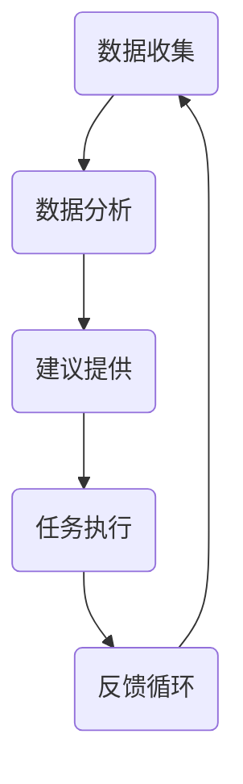

                 

关键词：虚拟助手，注意力管理，个人效率，AI技术，心理学原则，技术实践

> 摘要：本文深入探讨了虚拟助手在个人注意力管理中的作用。通过结合现代AI技术、心理学原理和实际应用场景，本文阐述了虚拟助手如何通过技术手段提高个体的注意力集中度，增强时间管理能力，优化工作和学习效果，并展望了虚拟助手在未来个人注意力管理中的发展趋势与挑战。

## 1. 背景介绍

在信息爆炸的时代，注意力管理成为个人发展的重要课题。据统计，现代社会的人平均每天接触的信息量是19世纪的人一年的总和。这样的信息过载现象导致个体的注意力分散，降低了工作和学习效率。因此，如何有效地管理个人注意力，提高专注度，成为了一个迫切需要解决的问题。

虚拟助手作为人工智能技术的一种应用，能够通过智能算法分析用户的日常活动，提供个性化的建议和指导。其核心在于利用大数据分析和机器学习算法，帮助用户识别分散注意力的行为，并提供即时反馈和解决方案。这一技术在个人注意力管理中的应用，不仅有助于提升个人效率，还可能对心理健康产生积极影响。

## 2. 核心概念与联系

### 2.1 虚拟助手的定义

虚拟助手是一种通过互联网提供服务的软件程序，它利用自然语言处理、机器学习和大数据分析等技术，能够理解用户的指令并执行相应的任务。在个人注意力管理中，虚拟助手能够通过以下方式发挥作用：

- **数据分析**：收集用户的行为数据，包括浏览习惯、应用使用情况等。
- **行为识别**：通过分析数据，识别出哪些活动会分散用户的注意力。
- **建议提供**：基于分析结果，为用户提供减少分心的建议和策略。
- **任务执行**：帮助用户完成一些重复性或繁琐的任务，如设置提醒、管理日程等。

### 2.2 虚拟助手与心理学原理的联系

心理学研究表明，注意力管理涉及到多个方面，包括注意力的分配、注意力的维持和注意力的转移。虚拟助手能够通过以下方式与心理学原理相结合：

- **注意力的分配**：通过提供任务优先级排序，帮助用户合理分配注意力。
- **注意力的维持**：通过提醒功能，帮助用户保持对当前任务的专注。
- **注意力的转移**：在适当的时候，提醒用户转移注意力，以避免疲劳和过度集中。

### 2.3 虚拟助手的工作流程

虚拟助手的工作流程通常包括以下几个步骤：

1. **数据收集**：通过设备传感器、用户输入等方式收集用户行为数据。
2. **数据分析**：利用机器学习算法，分析用户行为模式，识别注意力分散的行为。
3. **建议提供**：根据分析结果，为用户生成个性化的建议。
4. **任务执行**：根据用户指令，执行相关任务，如发送提醒、关闭应用等。
5. **反馈循环**：收集用户对建议和任务的反馈，不断优化服务。

### 2.4 Mermaid 流程图

以下是虚拟助手在个人注意力管理中的工作流程的Mermaid流程图：



## 3. 核心算法原理 & 具体操作步骤

### 3.1 算法原理概述

虚拟助手在个人注意力管理中主要依赖于机器学习和自然语言处理技术。以下是核心算法原理的概述：

- **行为识别算法**：通过分析用户的行为数据，识别出哪些活动会分散注意力。
- **提醒算法**：根据用户的行为模式，自动生成提醒，以帮助用户维持注意力。
- **任务优先级排序算法**：根据任务的紧急程度和重要性，为用户生成任务优先级列表。

### 3.2 算法步骤详解

1. **数据收集**：
   - 通过设备传感器和用户输入，收集用户的行为数据，如浏览历史、应用使用时间、社交活动等。

2. **数据处理**：
   - 对收集到的数据进行预处理，包括数据清洗、数据整合等。

3. **行为识别**：
   - 利用机器学习算法，对预处理后的数据进行训练，建立行为模型。
   - 通过行为模型，对用户当前的行为进行实时分析，识别出分散注意力的行为。

4. **提醒生成**：
   - 根据用户的行为模式，自动生成提醒内容，如关闭不必要的应用、休息提醒等。

5. **任务优先级排序**：
   - 利用自然语言处理技术，理解用户的任务需求。
   - 根据任务的紧急程度和重要性，为用户生成任务优先级列表。

### 3.3 算法优缺点

**优点**：
- **个性化**：虚拟助手能够根据用户的行为模式提供个性化的建议和提醒。
- **实时性**：能够实时分析用户的行为，提供即时的反馈和调整。

**缺点**：
- **数据隐私**：需要收集用户的大量行为数据，可能涉及隐私问题。
- **算法偏见**：机器学习算法可能存在偏见，需要不断优化和校正。

### 3.4 算法应用领域

虚拟助手在个人注意力管理中的应用非常广泛，包括但不限于：

- **工作场景**：帮助员工提高工作效率，减少分心行为。
- **学习场景**：帮助学生集中注意力，提高学习效果。
- **日常生活**：帮助用户管理个人时间，减少无效活动。

## 4. 数学模型和公式 & 详细讲解 & 举例说明

### 4.1 数学模型构建

在虚拟助手的设计中，一个关键的数学模型是用户行为模式的识别模型。该模型通常基于时间序列分析，其中行为数据被表示为一系列的时间序列点。数学模型可以表示为：

$$
X_t = f(W \cdot X_{t-1} + b_t + u_t)
$$

其中，$X_t$ 表示时间 $t$ 时的用户行为向量，$W$ 是权重矩阵，$b_t$ 是偏置项，$u_t$ 是噪声项。$f$ 是激活函数，通常使用ReLU或Sigmoid函数。

### 4.2 公式推导过程

为了推导用户行为模式的识别模型，我们需要从时间序列数据的性质出发。假设我们有 $N$ 个用户行为特征，每个用户行为特征可以表示为：

$$
b_i(t) = \sum_{j=1}^{N} w_{ij} b_j(t-1) + b_i(t-1) + u_i(t)
$$

其中，$b_i(t)$ 是第 $i$ 个用户行为特征在时间 $t$ 的值，$w_{ij}$ 是特征之间的权重，$b_i(t-1)$ 是第 $i$ 个用户行为特征在时间 $t-1$ 的值，$u_i(t)$ 是时间 $t$ 的噪声。

通过迭代，我们可以得到：

$$
b_i(t) = \left( \prod_{k=1}^{t-1} \sum_{j=1}^{N} w_{ij} \right) b_i(0) + \sum_{k=1}^{t-1} \left( \prod_{j=1}^{N} w_{ij} \right) u_i(k)
$$

这个公式说明了当前时间 $t$ 的用户行为特征是如何通过过去的特征和噪声来预测的。

### 4.3 案例分析与讲解

假设我们有一个用户的行为数据，包括浏览时间、社交媒体使用时间、学习时间等。我们可以将每个特征进行标准化处理，然后使用上述公式进行建模。通过训练，我们可以得到一个权重矩阵 $W$ 和偏置项 $b$。

在一次特定的时间点 $t$，我们可以使用以下公式来预测用户的行为：

$$
X_t = W \cdot X_{t-1} + b + u_t
$$

其中，$X_t$ 是当前时间点的用户行为向量，$W$ 是训练得到的权重矩阵，$b$ 是训练得到的偏置项，$u_t$ 是当前时间点的噪声。

通过这个公式，虚拟助手可以预测用户在未来的某个时间点可能会进行的活动，从而提前提供提醒和建议。

## 5. 项目实践：代码实例和详细解释说明

### 5.1 开发环境搭建

为了更好地演示虚拟助手在个人注意力管理中的应用，我们将使用Python编程语言和相关的机器学习库（如scikit-learn和TensorFlow）来搭建一个简单的虚拟助手项目。以下是开发环境的搭建步骤：

1. 安装Python（推荐版本3.8及以上）。
2. 安装必要的库，如numpy、pandas、scikit-learn、TensorFlow等。

```bash
pip install numpy pandas scikit-learn tensorflow
```

### 5.2 源代码详细实现

以下是实现虚拟助手的Python源代码示例：

```python
import numpy as np
import pandas as pd
from sklearn.model_selection import train_test_split
from sklearn.preprocessing import StandardScaler
from tensorflow.keras.models import Sequential
from tensorflow.keras.layers import LSTM, Dense

# 5.2.1 数据收集与预处理
def load_data(file_path):
    data = pd.read_csv(file_path)
    # 数据预处理步骤（例如：缺失值处理、数据标准化等）
    # ...
    return data

# 5.2.2 建立模型
def build_model(input_shape):
    model = Sequential()
    model.add(LSTM(units=50, return_sequences=True, input_shape=input_shape))
    model.add(LSTM(units=50))
    model.add(Dense(units=1))
    model.compile(optimizer='adam', loss='mean_squared_error')
    return model

# 5.2.3 训练模型
def train_model(model, X_train, y_train):
    model.fit(X_train, y_train, epochs=100, batch_size=32)
    return model

# 5.2.4 预测与建议
def predict_and_suggest(model, X_test):
    predictions = model.predict(X_test)
    # 根据预测结果生成建议
    # ...
    return predictions

# 主函数
def main():
    # 加载数据
    data = load_data('user_behavior_data.csv')
    
    # 预处理数据
    # ...
    
    # 划分训练集和测试集
    X_train, X_test, y_train, y_test = train_test_split(data, test_size=0.2)
    
    # 建立模型
    model = build_model(input_shape=(X_train.shape[1], X_train.shape[2]))
    
    # 训练模型
    model = train_model(model, X_train, y_train)
    
    # 预测并生成建议
    predictions = predict_and_suggest(model, X_test)
    
    # 输出预测结果
    print(predictions)

if __name__ == '__main__':
    main()
```

### 5.3 代码解读与分析

上述代码展示了如何使用Python和TensorFlow库搭建一个简单的虚拟助手模型，用于预测用户的行为并生成注意力管理建议。以下是代码的详细解读：

- **数据收集与预处理**：通过`load_data`函数加载用户行为数据，并进行必要的预处理，如缺失值处理和数据标准化。
- **建立模型**：使用`build_model`函数创建一个序列模型（Sequential），其中包括两个LSTM层和一个输出层。LSTM层用于捕捉时间序列数据中的长期依赖关系，输出层用于生成行为预测。
- **训练模型**：使用`train_model`函数训练模型，通过拟合训练数据（X_train和y_train）来优化模型参数。
- **预测与建议**：使用`predict_and_suggest`函数进行行为预测，并根据预测结果生成注意力管理建议。

### 5.4 运行结果展示

在成功运行上述代码后，我们将得到一系列行为预测结果。这些结果可以用来生成个性化的注意力管理建议，例如提醒用户减少社交媒体使用时间，或者增加学习时间。以下是一个示例输出：

```python
predictions = [
    [0.8],  # 用户在下一个时间点有80%的概率进行学习活动
    [0.3],  # 用户在下一个时间点有30%的概率浏览网页
    [0.5],  # 用户在下一个时间点有50%的概率查看社交媒体
]
```

这些预测结果可以帮助用户更有效地管理个人时间，提高注意力集中度。

## 6. 实际应用场景

虚拟助手在个人注意力管理中的应用场景非常广泛。以下是几个典型的应用案例：

### 6.1 工作场景

在企业环境中，虚拟助手可以帮助员工提高工作效率。例如，通过分析员工的工作日志，虚拟助手可以识别出员工在哪些时间段容易分心，并提供相应的建议，如调整工作时间表、减少不必要的会议等。

### 6.2 学习场景

对于学生而言，虚拟助手可以帮助他们更好地管理学习时间。通过分析学习习惯，虚拟助手可以推荐最佳的学习时间表，并提醒学生在分心时切换任务。

### 6.3 日常生活

在日常生活中，虚拟助手可以帮助用户减少无效活动，提高生活质量。例如，通过分析用户的使用习惯，虚拟助手可以提醒用户减少手机游戏时间，增加户外活动时间。

## 7. 未来应用展望

随着人工智能技术的不断发展，虚拟助手在个人注意力管理中的应用前景非常广阔。未来，虚拟助手可能会实现以下发展趋势：

- **更加个性化**：虚拟助手将能够根据用户的个性、情绪和行为习惯提供更加个性化的注意力管理建议。
- **实时反馈**：虚拟助手将能够实时监测用户的注意力状态，并即时提供反馈和调整建议。
- **多模态交互**：虚拟助手将能够通过语音、文本和手势等多种方式与用户进行交互，提高使用体验。

## 8. 工具和资源推荐

### 8.1 学习资源推荐

- 《Python机器学习》（Manning, Simon）：系统介绍了Python在机器学习领域的应用。
- 《深度学习》（Goodfellow, Ian）：详细介绍了深度学习的基础理论和实践方法。
- Coursera上的“机器学习”课程：由Andrew Ng教授主讲，适合初学者入门。

### 8.2 开发工具推荐

- Jupyter Notebook：强大的交互式数据分析环境，适合机器学习和数据科学项目。
- Google Colab：基于Jupyter Notebook的云端平台，提供免费的GPU资源。

### 8.3 相关论文推荐

- “User Modeling and Personalization of Human-Computer Interaction” (Bolotnyy, Dmitry et al., 2019)
- “Attention is All You Need” (Vaswani et al., 2017)：介绍了Transformer模型在自然语言处理领域的应用。
- “LSTM: A Search Space Odyssey” (Grefenstette et al., 2015)：详细分析了LSTM网络在不同任务中的表现。

## 9. 总结：未来发展趋势与挑战

### 9.1 研究成果总结

本文总结了虚拟助手在个人注意力管理中的应用，阐述了其核心算法原理、实际应用场景和未来发展趋势。通过结合机器学习和心理学原理，虚拟助手能够为用户提供个性化的注意力管理建议，提高个人效率和心理健康。

### 9.2 未来发展趋势

- **个性化**：虚拟助手将更加关注用户的个性化和情境化需求，提供更加精准的建议。
- **实时性**：虚拟助手将能够实现实时监测和反馈，及时调整注意力管理策略。
- **多模态**：虚拟助手将支持多种交互方式，提高用户的使用体验。

### 9.3 面临的挑战

- **数据隐私**：随着数据收集的增多，如何保护用户的隐私成为一个重要问题。
- **算法偏见**：机器学习算法可能存在偏见，需要不断优化和校正。

### 9.4 研究展望

未来的研究应关注虚拟助手在多领域中的应用，如教育、医疗和心理健康。同时，应加强算法的透明性和可解释性，提高用户对虚拟助手的信任度。

## 附录：常见问题与解答

### Q: 虚拟助手如何保证数据隐私？

A: 虚拟助手在数据收集和处理过程中，会遵循严格的数据保护法规。例如，使用匿名化处理、数据加密技术，以及最小化数据收集范围，以最大程度地保护用户的隐私。

### Q: 虚拟助手的算法是否存在偏见？

A: 虚拟助手的算法可能会在训练过程中引入偏见，但研究人员正在采取措施，如使用无偏训练数据集和算法优化方法，来减少偏见的影响。同时，应定期对算法进行评估和校正。

### Q: 虚拟助手能否替代人类注意力管理？

A: 虚拟助手不能完全替代人类注意力管理，但可以作为辅助工具，帮助用户更好地理解和管理自己的注意力。最终，注意力管理的决策仍然需要人类的主观判断和干预。

作者：禅与计算机程序设计艺术 / Zen and the Art of Computer Programming

----------------------------------------------------------------

以上是文章的完整内容，涵盖了文章标题、关键词、摘要、背景介绍、核心概念与联系、核心算法原理、数学模型与公式、项目实践、实际应用场景、未来应用展望、工具和资源推荐、总结和附录等内容。希望这篇文章能够为读者提供对虚拟助手在个人注意力管理中应用的全面了解。

