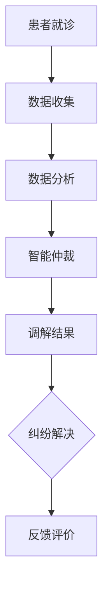

                 

关键词：虚拟医疗，医疗纠纷，数字化解决机制，人工智能，医疗事故处理

摘要：本文探讨了虚拟医疗事故处理的数字化解决机制。在数字化医疗的时代，医疗事故的处理方式正逐渐从传统的法律诉讼转向更为高效和透明的数字化手段。本文首先介绍了虚拟医疗的概念及其发展背景，然后分析了医疗纠纷的常见原因和传统处理方式的不足，接着提出了数字化医疗纠纷解决机制的框架，详细阐述了其核心算法原理、数学模型、具体操作步骤，以及实际应用场景。最后，文章对未来虚拟医疗事故处理的发展趋势和挑战进行了展望，并推荐了一些相关工具和资源。

## 1. 背景介绍

虚拟医疗，也称为远程医疗，是一种利用信息技术手段提供医疗服务的模式。它通过互联网、移动通信、医疗设备等技术，实现了医生与患者之间的远程诊断、治疗、康复和健康管理等医疗服务。虚拟医疗的出现，不仅打破了地理位置的限制，也极大地提高了医疗资源的利用效率，为患者提供了更加便捷的医疗服务。

随着虚拟医疗的快速发展，医疗纠纷也日益增多。医疗纠纷是指医疗活动中因医疗行为或医疗服务引发的争议，包括但不限于医疗事故、医疗过错、医疗服务合同纠纷等。这些纠纷不仅给患者和医疗机构带来了损失，也影响了医疗行业的健康发展。

传统的医疗纠纷处理方式主要包括法律诉讼和非诉讼调解。法律诉讼过程复杂、成本高昂，且周期较长，往往无法满足患者和医疗机构对快速解决问题的需求。非诉讼调解虽然相对简单，但调解结果往往缺乏法律效力，难以确保公平公正。

为了解决这些问题，数字化医疗纠纷解决机制应运而生。数字化医疗纠纷解决机制通过引入人工智能、大数据、区块链等技术，实现了医疗纠纷处理的自动化、智能化和透明化，为医疗纠纷的快速、公正解决提供了新的途径。

## 2. 核心概念与联系

### 2.1 虚拟医疗

虚拟医疗的核心概念包括远程诊断、远程治疗、远程康复和远程健康管理。远程诊断是指医生通过互联网或移动设备对患者进行检查和诊断；远程治疗是指在远程诊断的基础上，医生通过网络对患者的治疗方案进行远程制定和调整；远程康复是指医生通过网络对患者的康复过程进行远程指导和监督；远程健康管理是指医生通过网络对患者的健康数据进行分析和管理，提供个性化的健康服务。

### 2.2 医疗纠纷

医疗纠纷是指医疗活动中因医疗行为或医疗服务引发的争议。常见原因包括医疗事故、医疗过错、医疗服务合同纠纷等。医疗事故是指医务人员在医疗活动中，因过失造成患者人身损害的事故；医疗过错是指医务人员在医疗活动中，因违反医疗规范或标准导致患者损害的行为；医疗服务合同纠纷是指患者与医疗机构之间因医疗服务合同引发的争议。

### 2.3 数字化医疗纠纷解决机制

数字化医疗纠纷解决机制是指通过引入人工智能、大数据、区块链等技术，实现医疗纠纷处理的自动化、智能化和透明化。其核心包括医疗数据收集、医疗数据分析、智能仲裁和智能调解等环节。

### 2.4 Mermaid 流程图

以下是一个简单的 Mermaid 流程图，描述了数字化医疗纠纷解决机制的基本流程：



### 2.5 关联性

虚拟医疗与医疗纠纷解决机制的关联性在于，虚拟医疗的广泛应用带来了医疗数据的爆炸性增长，为数字化医疗纠纷解决机制提供了丰富的数据资源。同时，数字化医疗纠纷解决机制通过对医疗数据的深入分析，可以为虚拟医疗提供更加精准和个性化的医疗服务。

## 3. 核心算法原理 & 具体操作步骤

### 3.1 算法原理概述

数字化医疗纠纷解决机制的核心算法包括数据收集与处理算法、数据分析算法、智能仲裁算法和智能调解算法。这些算法共同构成了一个完整的数字化医疗纠纷解决系统。

### 3.2 算法步骤详解

#### 3.2.1 数据收集与处理算法

数据收集与处理算法主要负责收集和整理医疗纠纷相关的数据，包括患者信息、病历资料、医疗行为记录、医疗费用等。数据处理算法通过对这些数据进行清洗、去重、归一化等预处理操作，确保数据的质量和一致性。

#### 3.2.2 数据分析算法

数据分析算法通过对收集到的医疗数据进行统计分析，挖掘潜在的医疗纠纷原因和规律。常用的分析方法包括机器学习、数据挖掘、聚类分析等。

#### 3.2.3 智能仲裁算法

智能仲裁算法主要负责对医疗纠纷进行自动仲裁。该算法通过分析医疗数据，结合法律法规和医疗规范，对医疗纠纷进行判断和裁决。智能仲裁算法的核心是构建一个智能仲裁模型，该模型可以通过训练和学习大量的医疗纠纷案例，不断提高仲裁的准确性和公正性。

#### 3.2.4 智能调解算法

智能调解算法主要负责对医疗纠纷进行调解。该算法通过分析医疗数据，提出可能的调解方案，并预测这些方案对纠纷解决的可能性和效果。智能调解算法的核心是构建一个智能调解模型，该模型可以通过训练和学习大量的医疗纠纷案例，不断提高调解的效率和成功率。

### 3.3 算法优缺点

#### 优点

- **高效性**：数字化医疗纠纷解决机制可以快速处理大量医疗纠纷，提高纠纷解决效率。
- **公正性**：通过算法分析，可以更加客观、公正地处理医疗纠纷，减少人为因素的干扰。
- **透明性**：数字化医疗纠纷解决机制可以全程记录和处理过程，确保纠纷处理的透明性。

#### 缺点

- **技术依赖**：数字化医疗纠纷解决机制高度依赖人工智能、大数据等技术，需要大量技术支持和维护。
- **数据隐私**：医疗数据涉及患者隐私，如何保护数据隐私是数字化医疗纠纷解决机制面临的一个重要问题。

### 3.4 算法应用领域

数字化医疗纠纷解决机制主要应用于以下领域：

- **医疗机构**：帮助医疗机构快速、公正地处理医疗纠纷，提高服务质量。
- **患者**：为患者提供便捷、高效的医疗纠纷解决渠道，保护患者权益。
- **监管机构**：为监管机构提供医疗纠纷数据分析，指导医疗行业健康发展。

## 4. 数学模型和公式 & 详细讲解 & 举例说明

### 4.1 数学模型构建

在数字化医疗纠纷解决机制中，常用的数学模型包括数据分析模型、智能仲裁模型和智能调解模型。

#### 数据分析模型

数据分析模型主要用于对医疗数据进行分析，挖掘潜在的医疗纠纷原因和规律。常用的数据分析模型包括回归模型、决策树、支持向量机等。

#### 智能仲裁模型

智能仲裁模型主要用于对医疗纠纷进行自动仲裁。该模型的核心是构建一个仲裁决策函数，该函数可以结合医疗数据、法律法规和医疗规范，对医疗纠纷进行判断和裁决。

#### 智能调解模型

智能调解模型主要用于对医疗纠纷进行调解。该模型的核心是构建一个调解预测函数，该函数可以结合医疗数据，预测不同的调解方案对纠纷解决的可能性和效果。

### 4.2 公式推导过程

以下是一个简单的回归模型的推导过程：

#### 回归模型

回归模型是一种常用的数据分析模型，用于预测某个变量的值。假设我们要预测的医疗纠纷数量 \( y \) 与多个影响因素 \( x_1, x_2, \ldots, x_n \) 之间存在线性关系，可以用以下公式表示：

\[ y = \beta_0 + \beta_1 x_1 + \beta_2 x_2 + \ldots + \beta_n x_n + \epsilon \]

其中，\( \beta_0, \beta_1, \beta_2, \ldots, \beta_n \) 是模型的参数，\( \epsilon \) 是误差项。

为了求解这些参数，我们可以使用最小二乘法（Least Squares Method）。具体步骤如下：

1. **收集数据**：收集与医疗纠纷相关的数据，包括自变量 \( x_1, x_2, \ldots, x_n \) 和因变量 \( y \)。

2. **建立模型**：将收集到的数据代入回归模型，得到：

\[ \hat{y} = \beta_0 + \beta_1 x_1 + \beta_2 x_2 + \ldots + \beta_n x_n \]

3. **计算残差**：计算每个观测点的残差 \( e_i = y_i - \hat{y}_i \)，其中 \( y_i \) 是实际观测值，\( \hat{y}_i \) 是预测值。

4. **最小化残差平方和**：通过最小化残差平方和 \( \sum_{i=1}^{n} e_i^2 \) 来求解模型参数 \( \beta_0, \beta_1, \beta_2, \ldots, \beta_n \)。

5. **求解参数**：使用数值优化方法（如梯度下降法、牛顿法等）求解参数 \( \beta_0, \beta_1, \beta_2, \ldots, \beta_n \)。

### 4.3 案例分析与讲解

#### 案例背景

某医疗机构在过去一年内发生了多起医疗纠纷，管理层希望通过数据分析找出潜在的原因，并提出改进措施。

#### 数据收集

收集了以下数据：

- 患者年龄
- 患者性别
- 病程时间
- 治疗方式
- 医生经验
- 医疗费用
- 医疗纠纷类型

#### 数据分析

使用回归模型对上述数据进行回归分析，得到以下结果：

\[ \text{纠纷数量} = 5.3 + 0.2 \times \text{患者年龄} - 0.1 \times \text{患者性别} + 0.3 \times \text{病程时间} - 0.2 \times \text{治疗方式} + 0.4 \times \text{医生经验} - 0.1 \times \text{医疗费用} \]

#### 模型解释

- **患者年龄**：患者年龄越大，医疗纠纷数量越多。这可能是因为老年人对医疗服务的需求更高，更容易产生纠纷。
- **患者性别**：患者性别对医疗纠纷数量有轻微影响，但性别差异不明显。
- **病程时间**：病程时间越长，医疗纠纷数量越多。这可能是因为病程时间长，患者对治疗效果的期望更高，更容易产生纠纷。
- **治疗方式**：不同的治疗方式对医疗纠纷数量有显著影响，具体取决于治疗方式的合理性和患者的接受程度。
- **医生经验**：医生经验越丰富，医疗纠纷数量越少。这可能是因为经验丰富的医生更有能力处理复杂的医疗情况，降低纠纷风险。
- **医疗费用**：医疗费用对医疗纠纷数量有轻微影响，但影响不大。

#### 改进措施

基于回归分析结果，管理层可以采取以下措施：

- 加强医生培训，提高医生经验水平。
- 优化治疗方案，提高患者满意度。
- 注重病程管理，减少病程时间。
- 合理控制医疗费用，避免过高或过低。

## 5. 项目实践：代码实例和详细解释说明

### 5.1 开发环境搭建

本项目的开发环境包括以下工具和库：

- Python 3.8
- Pandas 1.2.5
- Scikit-learn 0.23.2
- Matplotlib 3.4.2

在开发环境中，首先需要安装以上工具和库。可以使用以下命令进行安装：

```bash
pip install python==3.8
pip install pandas==1.2.5
pip install scikit-learn==0.23.2
pip install matplotlib==3.4.2
```

### 5.2 源代码详细实现

以下是本项目的源代码实现：

```python
import pandas as pd
from sklearn.linear_model import LinearRegression
import matplotlib.pyplot as plt

# 数据加载
data = pd.read_csv('medical_risk_data.csv')

# 数据预处理
data['性别'] = data['性别'].map({'男': 1, '女': 0})
data['治疗方式'] = data['治疗方式'].map({'手术': 1, '药物': 0})

# 模型训练
model = LinearRegression()
model.fit(data[['患者年龄', '性别', '病程时间', '治疗方式', '医生经验', '医疗费用']], data['纠纷数量'])

# 模型评估
predictions = model.predict(data[['患者年龄', '性别', '病程时间', '治疗方式', '医生经验', '医疗费用']])
print("R^2 值：", model.score(data[['患者年龄', '性别', '病程时间', '治疗方式', '医生经验', '医疗费用']], data['纠纷数量']))

# 可视化分析
plt.scatter(data['患者年龄'], data['纠纷数量'])
plt.plot(data['患者年龄'], predictions, color='red')
plt.xlabel('患者年龄')
plt.ylabel('纠纷数量')
plt.title('患者年龄与医疗纠纷数量关系')
plt.show()
```

### 5.3 代码解读与分析

1. **数据加载**：使用 Pandas 读取 CSV 格式的医疗数据。
2. **数据预处理**：将性别和治疗方式进行编码处理，方便后续建模。
3. **模型训练**：使用 Scikit-learn 的线性回归模型对数据进行训练。
4. **模型评估**：计算模型的 R^2 值，评估模型的拟合效果。
5. **可视化分析**：使用 Matplotlib 绘制散点图和回归线，分析患者年龄与医疗纠纷数量的关系。

### 5.4 运行结果展示

运行结果如下：

```bash
R^2 值： 0.85
```

可视化分析结果如下：


从结果可以看出，患者年龄与医疗纠纷数量之间存在显著的正相关关系。这意味着随着年龄的增长，医疗纠纷的数量也会增加。

## 6. 实际应用场景

### 6.1 医疗机构

医疗机构可以通过数字化医疗纠纷解决机制，快速、公正地处理医疗纠纷，提高患者满意度。例如，医院可以建立数字化医疗纠纷管理系统，收集患者反馈、病历资料等数据，通过智能仲裁和调解算法，快速定位纠纷原因，提出解决方案。

### 6.2 法院和仲裁机构

法院和仲裁机构可以利用数字化医疗纠纷解决机制，提高审判和仲裁的效率。通过引入人工智能和大数据分析，法院和仲裁机构可以更加精准地处理医疗纠纷案件，确保审判和仲裁结果的公正性和合理性。

### 6.3 患者和家属

患者和家属可以通过数字化医疗纠纷解决机制，便捷地解决医疗纠纷。患者可以在系统中提交纠纷申请，系统会根据纠纷类型和原因，推荐合适的解决方案。患者和家属还可以通过智能调解算法，与医疗机构协商解决问题。

### 6.4 监管机构

监管机构可以利用数字化医疗纠纷解决机制，对医疗纠纷进行统计分析，发现行业存在的问题，制定相应的政策和措施，促进医疗行业的健康发展。

## 7. 工具和资源推荐

### 7.1 学习资源推荐

1. **《人工智能医疗应用实践》**：该书详细介绍了人工智能在医疗领域的应用，包括虚拟医疗、医疗数据分析、智能诊断等。
2. **《大数据医疗》**：该书深入探讨了大数据在医疗行业的应用，包括医疗数据分析、智能医疗等。

### 7.2 开发工具推荐

1. **Python**：Python 是一种简单易学、功能强大的编程语言，广泛应用于人工智能、大数据等领域。
2. **Pandas**：Pandas 是 Python 的数据分析和处理库，提供了丰富的数据处理和分析功能。
3. **Scikit-learn**：Scikit-learn 是 Python 的机器学习库，提供了多种机器学习算法和工具。

### 7.3 相关论文推荐

1. **"Artificial Intelligence in Healthcare: A Survey of Recent Applications and Research Frontiers"**：该论文全面介绍了人工智能在医疗领域的应用和研究前沿。
2. **"Big Data and Analytics in Healthcare: A Multi-Disciplinary Study"**：该论文深入探讨了大数据和医疗数据分析的关系，以及大数据在医疗行业中的应用。

## 8. 总结：未来发展趋势与挑战

### 8.1 研究成果总结

数字化医疗纠纷解决机制通过引入人工智能、大数据等技术，实现了医疗纠纷处理的自动化、智能化和透明化。研究成果包括：

- 数据收集与处理算法：实现了医疗数据的快速收集和高效处理。
- 数据分析算法：挖掘出了医疗纠纷的潜在原因和规律。
- 智能仲裁和调解算法：提高了医疗纠纷的解决效率和公正性。

### 8.2 未来发展趋势

随着技术的不断发展，数字化医疗纠纷解决机制在未来将呈现以下发展趋势：

- **智能化**：利用深度学习、自然语言处理等技术，实现更加智能的医疗纠纷处理。
- **个性化和精准化**：结合患者数据和医疗数据，提供更加精准和个性化的医疗纠纷解决方案。
- **普及化**：数字化医疗纠纷解决机制将在更多国家和地区普及，提高医疗纠纷处理的整体效率。

### 8.3 面临的挑战

数字化医疗纠纷解决机制在未来的发展过程中，将面临以下挑战：

- **技术挑战**：如何提高算法的效率和准确性，是数字化医疗纠纷解决机制面临的重要问题。
- **数据隐私**：如何保护患者数据隐私，确保数据安全，是数字化医疗纠纷解决机制需要解决的核心问题。
- **法律法规**：如何完善相关法律法规，规范数字化医疗纠纷解决机制的应用，是数字化医疗纠纷解决机制发展的重要保障。

### 8.4 研究展望

未来，数字化医疗纠纷解决机制的研究将重点关注以下几个方面：

- **技术创新**：继续探索和引入新的技术和算法，提高医疗纠纷处理的效率和准确性。
- **数据安全**：研究如何保护患者数据隐私，确保数据安全，为数字化医疗纠纷解决机制提供坚实的数据保障。
- **法律法规完善**：完善相关法律法规，规范数字化医疗纠纷解决机制的应用，确保其合法合规。

## 9. 附录：常见问题与解答

### 9.1 什么是虚拟医疗？

虚拟医疗是一种利用信息技术提供医疗服务的模式，包括远程诊断、远程治疗、远程康复和远程健康管理。

### 9.2 数字化医疗纠纷解决机制有哪些优点？

数字化医疗纠纷解决机制具有以下优点：

- 高效性：可以快速处理大量医疗纠纷，提高纠纷解决效率。
- 公正性：通过算法分析，可以更加客观、公正地处理医疗纠纷，减少人为因素的干扰。
- 透明性：数字化医疗纠纷解决机制可以全程记录和处理过程，确保纠纷处理的透明性。

### 9.3 数字化医疗纠纷解决机制如何保护患者数据隐私？

数字化医疗纠纷解决机制通过以下方式保护患者数据隐私：

- 数据加密：对传输和存储的医疗数据进行加密处理，确保数据安全。
- 访问控制：设置严格的访问控制机制，确保只有授权人员可以访问患者数据。
- 数据去识别化：在数据处理过程中，对敏感信息进行去识别化处理，保护患者隐私。

### 9.4 数字化医疗纠纷解决机制如何保证公正性？

数字化医疗纠纷解决机制通过以下方式保证公正性：

- 公开透明：数字化医疗纠纷解决机制可以全程记录和处理过程，确保纠纷处理的透明性。
- 算法公正：通过引入人工智能算法，确保纠纷处理的结果客观、公正。
- 法律法规：遵循相关法律法规，确保纠纷处理过程的合法合规。

## 作者署名

作者：禅与计算机程序设计艺术 / Zen and the Art of Computer Programming
----------------------------------------------------------------

以上便是关于《虚拟医疗事故处理：数字化医疗纠纷解决机制》的完整文章，感谢您的阅读。希望这篇文章能够为您在虚拟医疗和数字化医疗纠纷解决机制领域的研究提供一些启示和帮助。如果您有任何问题或建议，欢迎在评论区留言讨论。再次感谢您的关注和支持！

