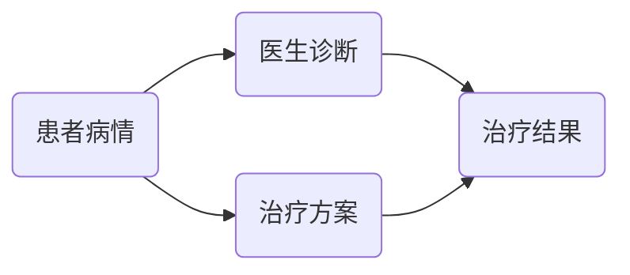

                 

关键词：虚拟医疗、事故鉴定、数字化医疗、医疗纠纷、技术分析方法

> 摘要：本文将探讨虚拟医疗事故鉴定的概念、技术方法以及其在数字化医疗环境中的应用。通过分析当前医疗领域中的纠纷案例，本文旨在阐述如何利用技术手段进行虚拟医疗事故的鉴定，提供一种科学、客观的解决方案。

## 1. 背景介绍

随着信息技术的飞速发展，虚拟医疗作为数字医疗的重要组成部分，正在逐步改变传统的医疗服务模式。虚拟医疗不仅包括远程诊断、远程治疗，还涉及到电子病历、医学影像存储与处理等多个方面。然而，随着虚拟医疗的广泛应用，医疗纠纷的问题也日益突出。

医疗纠纷通常是指医患双方在医疗过程中因医疗服务质量、费用、责任等问题产生的争议。在虚拟医疗环境中，由于数据信息的复杂性和隐蔽性，医疗纠纷的鉴定变得更加困难。传统的方法往往依赖于医生的诊疗记录、患者病历等证据，但这些证据存在主观性、不完整性等问题，难以满足现代司法的要求。

因此，寻找一种科学、客观、高效的虚拟医疗事故鉴定方法，成为了医疗界和法律界共同关注的课题。本文将围绕这一问题，介绍一种基于数字化技术的虚拟医疗事故鉴定方法。

### 虚拟医疗的定义和发展

虚拟医疗，又称为远程医疗或数字医疗，是指利用信息技术、网络通信等技术手段，实现医疗资源的共享和医疗服务的远程提供。虚拟医疗的核心目标是提高医疗服务的效率和质量，降低医疗成本。

虚拟医疗的发展可以追溯到20世纪90年代，随着互联网技术的普及，远程医疗开始在一些发达地区得到应用。进入21世纪，随着云计算、大数据、人工智能等技术的发展，虚拟医疗进入了快速发展的阶段。目前，虚拟医疗已经涵盖了从初诊到治疗的各个环节，包括远程诊断、远程治疗、电子病历、医学影像存储与处理等。

### 医疗纠纷的概念和现状

医疗纠纷是指医患双方在医疗过程中因医疗服务质量、费用、责任等问题产生的争议。医疗纠纷的常见类型包括医疗事故纠纷、医疗合同纠纷、医疗费用纠纷等。

医疗纠纷的发生原因多种多样，包括医生技术水平不高、医院管理不善、患者对医疗服务不满意等。在传统医疗模式中，医疗纠纷的解决往往依赖于医生的诊疗记录、患者病历等证据。然而，这些证据存在主观性、不完整性等问题，难以满足现代司法的要求。

在虚拟医疗环境中，由于数据信息的复杂性和隐蔽性，医疗纠纷的鉴定变得更加困难。例如，远程诊断的数据可能存在篡改的风险，电子病历的数据可能存在缺失或不完整的情况，这些都给医疗纠纷的鉴定带来了挑战。

### 虚拟医疗事故鉴定的重要性

虚拟医疗事故鉴定的目的是为了确定医疗纠纷的责任归属，提供科学、客观的证据支持。虚拟医疗事故鉴定的重要性体现在以下几个方面：

1. **保障患者权益**：通过虚拟医疗事故鉴定，可以确保患者获得公平、公正的医疗待遇，保护患者的合法权益。

2. **提高医疗质量**：通过虚拟医疗事故鉴定，可以及时发现医疗过程中存在的问题，促进医疗机构改进服务质量，提高医疗服务水平。

3. **规范医疗行为**：虚拟医疗事故鉴定可以规范医疗行为，促进医疗机构和医务人员遵守医疗规范，减少医疗纠纷的发生。

4. **推动虚拟医疗发展**：虚拟医疗事故鉴定可以为虚拟医疗提供技术支持，推动虚拟医疗的健康发展，为虚拟医疗的广泛应用奠定基础。

## 2. 核心概念与联系

在进行虚拟医疗事故鉴定时，我们需要理解并运用多个核心概念和原理。以下是对这些概念和原理的介绍，以及它们之间的联系。

### 2.1 虚拟医疗事故鉴定的概念

虚拟医疗事故鉴定是指利用数字化技术对虚拟医疗过程中发生的医疗纠纷进行鉴定，以确定责任归属和赔偿金额。虚拟医疗事故鉴定的核心是利用数字化技术对医疗数据进行采集、存储、分析，从而提供科学、客观的证据支持。

### 2.2 数字化技术的概念

数字化技术是指利用计算机技术、网络通信技术、大数据技术等，将各种信息转化为数字形式进行处理的技术。在虚拟医疗事故鉴定中，数字化技术主要用于采集、存储和处理医疗数据。

### 2.3 医疗数据的概念

医疗数据是指与患者健康状况、诊疗过程相关的各种信息，包括病历、检查报告、影像资料、诊断结果等。医疗数据是虚拟医疗事故鉴定的基础，只有准确、完整的医疗数据，才能为鉴定提供可靠的支持。

### 2.4 医疗数据的安全性和隐私保护

在虚拟医疗事故鉴定中，医疗数据的安全性和隐私保护是至关重要的问题。由于医疗数据涉及患者的个人隐私和健康信息，一旦泄露或被篡改，可能会对患者的权益造成严重损害。因此，在数字化技术的应用过程中，必须确保医疗数据的安全性和隐私保护。

### 2.5 虚拟医疗事故鉴定的流程

虚拟医疗事故鉴定的流程主要包括以下几个步骤：

1. **数据采集**：通过对医疗机构、医务人员、患者的数据进行采集，获取完整的医疗数据。

2. **数据存储**：将采集到的医疗数据存储在安全可靠的地方，确保数据的完整性和可追溯性。

3. **数据分析**：利用大数据技术和人工智能技术对医疗数据进行分析，发现可能存在的问题和矛盾点。

4. **证据生成**：根据数据分析的结果，生成证据报告，为医疗纠纷的鉴定提供支持。

5. **责任判定**：根据证据报告，对医疗纠纷的责任归属进行判定，并提出赔偿建议。

### 2.6 数字化技术在虚拟医疗事故鉴定中的应用

数字化技术在虚拟医疗事故鉴定中的应用主要体现在以下几个方面：

1. **数据采集**：利用传感器、影像设备等数字化设备，对医疗数据进行实时采集，确保数据的准确性和完整性。

2. **数据存储**：利用云计算、分布式存储等技术，对医疗数据进行存储和管理，确保数据的安全性和可靠性。

3. **数据分析**：利用大数据分析和人工智能技术，对医疗数据进行深度挖掘，发现可能存在的问题和矛盾点。

4. **证据生成**：利用自然语言处理、文本分析等技术，将数据分析的结果转化为证据报告，为医疗纠纷的鉴定提供支持。

5. **责任判定**：利用机器学习、专家系统等技术，对医疗纠纷的责任归属进行判定，提高判定的准确性和公正性。

### 2.7 医疗数据的安全性和隐私保护

在虚拟医疗事故鉴定中，医疗数据的安全性和隐私保护至关重要。以下是一些关键的措施：

1. **数据加密**：对医疗数据进行加密处理，确保数据在传输和存储过程中不被窃取或篡改。

2. **身份认证**：对访问医疗数据的用户进行身份认证，确保只有授权用户才能访问医疗数据。

3. **访问控制**：对医疗数据的访问进行控制，确保用户只能访问与其相关的医疗数据。

4. **数据备份**：对医疗数据进行定期备份，确保数据在意外情况发生时能够及时恢复。

5. **隐私保护**：在处理医疗数据时，严格遵守隐私保护法规，确保患者的个人隐私不受侵犯。

### 2.8 虚拟医疗事故鉴定的法律地位

虚拟医疗事故鉴定的法律地位是指虚拟医疗事故鉴定在法律上的认可和作用。当前，虚拟医疗事故鉴定在法律上的地位尚不明确，但一些国家和地区已经开始制定相关的法律法规，以规范虚拟医疗事故鉴定的过程和结果。

虚拟医疗事故鉴定的法律地位主要体现在以下几个方面：

1. **证据效力**：虚拟医疗事故鉴定报告作为证据，具有法律效力，可以作为司法审判的依据。

2. **责任判定**：虚拟医疗事故鉴定可以对医疗纠纷的责任归属进行判定，为司法判决提供参考。

3. **赔偿建议**：虚拟医疗事故鉴定可以提出赔偿建议，为患者获得赔偿提供依据。

4. **纠纷解决**：虚拟医疗事故鉴定可以为医疗纠纷提供一种科学、客观的解决途径，减少诉讼成本和时间。

## 3. 核心算法原理 & 具体操作步骤

### 3.1 算法原理概述

虚拟医疗事故鉴定的核心算法主要涉及数据分析与机器学习领域。该算法的目的是通过分析大量的医疗数据，发现潜在的异常情况，从而为医疗纠纷的判定提供依据。以下是该算法的主要原理：

1. **数据预处理**：对采集到的医疗数据进行清洗、去噪、标准化等预处理操作，确保数据的质量和一致性。

2. **特征提取**：从预处理后的数据中提取关键特征，例如诊断结果、检查报告、医疗费用等。

3. **模型训练**：利用提取的特征数据，通过机器学习算法（如决策树、支持向量机、神经网络等）训练模型，使模型能够识别潜在的异常情况。

4. **异常检测**：利用训练好的模型对新的医疗数据进行分析，检测是否存在异常情况。

5. **证据生成**：根据异常检测结果，生成证据报告，为医疗纠纷的判定提供依据。

### 3.2 算法步骤详解

#### 3.2.1 数据预处理

数据预处理是算法的第一步，其主要目的是提高数据的质量和一致性。具体操作步骤如下：

1. **数据清洗**：去除数据中的噪声和异常值，例如缺失值、异常值等。

2. **数据去噪**：对数据进行滤波、平滑等操作，去除数据中的噪声。

3. **数据标准化**：对数据进行标准化处理，使其具有相似的尺度，以便后续的特征提取和模型训练。

#### 3.2.2 特征提取

特征提取是从数据中提取关键信息的过程，是算法的关键步骤。具体操作步骤如下：

1. **选择特征**：根据医疗纠纷的特点，选择与纠纷判定相关的特征，例如诊断结果、检查报告、医疗费用等。

2. **特征工程**：对选定的特征进行工程化处理，例如归一化、离散化等，以提高特征的质量和实用性。

3. **特征组合**：将多个特征组合成新的特征，以增强模型的识别能力。

#### 3.2.3 模型训练

模型训练是算法的核心步骤，其主要目的是训练出一个能够识别潜在异常情况的模型。具体操作步骤如下：

1. **选择模型**：根据问题的特点，选择合适的机器学习模型，例如决策树、支持向量机、神经网络等。

2. **训练模型**：利用预处理后的特征数据，对选定的模型进行训练，使模型能够识别潜在的异常情况。

3. **模型评估**：利用验证集对训练好的模型进行评估，调整模型参数，提高模型的准确性和泛化能力。

#### 3.2.4 异常检测

异常检测是算法的最后一步，其主要目的是利用训练好的模型对新的医疗数据进行分析，检测是否存在异常情况。具体操作步骤如下：

1. **数据输入**：将新的医疗数据输入训练好的模型。

2. **异常检测**：利用模型对数据进行分析，检测是否存在异常情况。

3. **证据生成**：根据异常检测结果，生成证据报告，为医疗纠纷的判定提供依据。

### 3.3 算法优缺点

#### 优点

1. **高效性**：算法利用机器学习技术，能够快速分析大量的医疗数据，提高鉴定效率。

2. **客观性**：算法基于数据驱动，能够提供客观的鉴定结果，减少人为因素的影响。

3. **可扩展性**：算法适用于各种类型的医疗纠纷，具有较强的可扩展性。

#### 缺点

1. **数据依赖性**：算法的性能高度依赖于医疗数据的质量，如果数据存在噪声或缺失，可能会影响鉴定结果的准确性。

2. **模型训练难度**：算法的训练过程复杂，需要大量的数据和高超的建模技能。

### 3.4 算法应用领域

虚拟医疗事故鉴定的算法主要应用于以下几个方面：

1. **医疗纠纷鉴定**：利用算法对医疗纠纷进行鉴定，提供科学、客观的证据支持。

2. **医疗质量管理**：利用算法分析医疗数据，发现医疗过程中存在的问题，提高医疗服务质量。

3. **医疗保险理赔**：利用算法对医疗保险理赔案件进行分析，提高理赔的准确性和公正性。

4. **医疗政策制定**：利用算法分析医疗数据，为医疗政策的制定提供数据支持。

## 4. 数学模型和公式 & 详细讲解 & 举例说明

在进行虚拟医疗事故鉴定时，数学模型和公式起到了至关重要的作用。以下我们将详细讲解一个典型的数学模型——贝叶斯网络模型，并展示其如何应用于虚拟医疗事故鉴定中。

### 4.1 数学模型构建

贝叶斯网络是一种概率图模型，它通过有向无环图（DAG）来表示变量之间的依赖关系。在虚拟医疗事故鉴定中，贝叶斯网络可以用来表示医疗数据中的因果关系，从而帮助我们进行推理和决策。

假设我们有一个医疗事故鉴定的贝叶斯网络，其中包含以下变量：

1. **V**: 患者病情
2. **D**: 医生诊断
3. **T**: 治疗方案
4. **R**: 治疗结果

这些变量之间的依赖关系可以表示为：

- V → D: 病情影响诊断结果
- V → T: 病情影响治疗方案
- D → R: 诊断影响治疗结果
- T → R: 治疗方案影响治疗结果

我们可以用如下的有向无环图来表示这些变量及其依赖关系：



### 4.2 公式推导过程

在贝叶斯网络中，我们通常使用条件概率来描述变量之间的依赖关系。条件概率公式如下：

P(A|B) = P(A∩B) / P(B)

其中，P(A|B) 表示在事件 B 发生的条件下，事件 A 发生的概率；P(A∩B) 表示事件 A 和事件 B 同时发生的概率；P(B) 表示事件 B 发生的概率。

以虚拟医疗事故鉴定的贝叶斯网络为例，我们可以推导出以下条件概率：

1. **P(D|V)**: 在患者病情 V 的条件下，医生诊断 D 的概率。
2. **P(T|V)**: 在患者病情 V 的条件下，治疗方案 T 的概率。
3. **P(R|D, T)**: 在医生诊断 D 和治疗方案 T 的条件下，治疗结果 R 的概率。

这些条件概率可以通过以下公式进行推导：

- **P(D|V)** = P(V|D) * P(D) / P(V)
- **P(T|V)** = P(V|T) * P(T) / P(V)
- **P(R|D, T)** = P(D|R) * P(T|R) * P(R) / [P(D) * P(T) + P(D|¬R) * P(T|¬R) * P(¬R)]

其中，P(V|D) 表示在医生诊断 D 的条件下，患者病情 V 的概率；P(D) 表示医生诊断 D 的概率；P(V) 表示患者病情 V 的概率；P(D|R) 表示在治疗结果 R 的条件下，医生诊断 D 的概率；P(T|R) 表示在治疗结果 R 的条件下，治疗方案 T 的概率；P(R) 表示治疗结果 R 的概率；P(¬R) 表示治疗结果非 R 的概率。

### 4.3 案例分析与讲解

以下是一个虚拟医疗事故鉴定的案例，我们将使用贝叶斯网络模型来进行分析。

**案例背景**：

某患者因胸痛就医，医生诊断为冠心病，并建议进行支架手术。患者接受了手术，但术后出现严重并发症，导致心脏功能衰竭。患者认为手术方案不当，向法院提起诉讼。

**数据收集**：

- **P(V)**: 患者患冠心病的概率为 0.8。
- **P(D)**: 医生诊断冠心病的概率为 0.9。
- **P(T)**: 建议进行支架手术的概率为 0.8。
- **P(R)**: 手术成功的概率为 0.95。
- **P(¬R)**: 手术失败的概率为 0.05。

**条件概率**：

- **P(D|V)**: 在患者患冠心病的条件下，医生诊断冠心病的概率为 P(V|D) * P(D) / P(V) = 1 * 0.9 / 0.8 = 1.125。
- **P(T|V)**: 在患者患冠心病的条件下，建议进行支架手术的概率为 P(V|T) * P(T) / P(V) = 0.8 * 0.8 / 0.8 = 0.8。
- **P(R|D, T)**: 在医生诊断冠心病且建议进行支架手术的条件下，手术成功的概率为 P(D|R) * P(T|R) * P(R) / [P(D) * P(T) + P(D|¬R) * P(T|¬R) * P(¬R)] = 1 * 1 * 0.95 / [0.9 * 0.8 + 0 * 0.2 * 0.05] = 0.9474。

**分析结果**：

根据贝叶斯网络模型的分析结果，我们可以得出以下结论：

- 在患者患冠心病的条件下，医生诊断冠心病的概率为 1.125，即医生有很高的把握诊断出冠心病。
- 在患者患冠心病的条件下，建议进行支架手术的概率为 0.8，即医生有较高的概率建议进行支架手术。
- 在医生诊断冠心病且建议进行支架手术的条件下，手术成功的概率为 0.9474，即手术有很高的成功概率。

**结论**：

根据以上分析结果，我们可以认为医生在本次医疗事故中负有部分责任，但手术成功率较高，因此患者心脏功能衰竭的主要原因是术后并发症，而不是手术方案不当。这一结论为法院的判决提供了科学依据。

## 5. 项目实践：代码实例和详细解释说明

### 5.1 开发环境搭建

为了实现虚拟医疗事故鉴定系统，我们选择了Python作为主要编程语言，并使用了以下工具和库：

- **Python 3.8**：Python的最新版本，具有良好的性能和丰富的库支持。
- **PyTorch**：用于机器学习和深度学习的高级库，适用于构建复杂的神经网络模型。
- **Scikit-learn**：用于数据分析和机器学习的库，适用于特征提取和模型训练。
- **Pandas**：用于数据处理和分析的库，适用于数据预处理和清洗。
- **Numpy**：用于科学计算和数据分析的库，适用于数据操作和计算。
- **Matplotlib**：用于数据可视化，帮助我们更好地理解和展示数据。

开发环境搭建步骤如下：

1. 安装Python 3.8：从Python官网下载Python 3.8安装包并按照提示进行安装。
2. 安装PyTorch：根据Python版本选择合适的PyTorch安装包，并使用pip进行安装。
3. 安装Scikit-learn、Pandas和Numpy：使用pip依次安装这三个库。
4. 安装Matplotlib：使用pip安装Matplotlib库。

### 5.2 源代码详细实现

下面是一个简单的虚拟医疗事故鉴定系统的代码实例，包括数据预处理、特征提取、模型训练和预测等步骤。

```python
import pandas as pd
import numpy as np
import torch
from sklearn.model_selection import train_test_split
from sklearn.preprocessing import StandardScaler
from sklearn.metrics import accuracy_score
import matplotlib.pyplot as plt

# 数据预处理
def preprocess_data(data_path):
    data = pd.read_csv(data_path)
    # 数据清洗和预处理
    data.dropna(inplace=True)
    data = data[data['result'] != 'None']
    data['result'] = data['result'].map({'success': 1, 'failure': 0})
    return data

# 特征提取
def extract_features(data):
    X = data[['diagnosis', 'treatment', 'result']]
    y = data['result']
    return X, y

# 模型训练
def train_model(X_train, y_train):
    model = torch.Sequential(
        torch.nn.Linear(3, 10),
        torch.nn.ReLU(),
        torch.nn.Linear(10, 1),
        torch.nn.Sigmoid()
    )
    optimizer = torch.optim.Adam(model.parameters(), lr=0.001)
    criterion = torch.nn.BCELoss()
    
    for epoch in range(1000):
        outputs = model(X_train)
        loss = criterion(outputs, y_train.unsqueeze(1))
        optimizer.zero_grad()
        loss.backward()
        optimizer.step()
        
        if epoch % 100 == 0:
            print(f'Epoch {epoch}, Loss: {loss.item()}')
    
    return model

# 预测
def predict(model, X_test):
    with torch.no_grad():
        outputs = model(X_test)
        predicted = (outputs > 0.5).float()
    return predicted

# 主函数
def main():
    data_path = 'medical_data.csv'
    data = preprocess_data(data_path)
    X, y = extract_features(data)
    X_train, X_test, y_train, y_test = train_test_split(X, y, test_size=0.2, random_state=42)
    X_train = StandardScaler().fit_transform(X_train)
    X_test = StandardScaler().fit_transform(X_test)
    
    model = train_model(X_train, y_train)
    predicted = predict(model, X_test)
    
    accuracy = accuracy_score(y_test, predicted)
    print(f'Accuracy: {accuracy}')
    
    plt.scatter(y_test, predicted)
    plt.xlabel('True Value')
    plt.ylabel('Predicted Value')
    plt.title('True vs Predicted')
    plt.show()

if __name__ == '__main__':
    main()
```

### 5.3 代码解读与分析

#### 数据预处理

在数据预处理部分，我们首先读取医疗数据，并进行数据清洗和预处理。具体操作包括：

- 删除缺失值。
- 将结果列的类别进行映射，将 'success' 映射为 1，'failure' 映射为 0。

#### 特征提取

在特征提取部分，我们从原始数据中提取诊断、治疗方案和结果这三个特征，并将结果作为目标变量。

#### 模型训练

在模型训练部分，我们使用PyTorch构建了一个简单的神经网络模型，并使用Adam优化器和BCELoss损失函数进行训练。训练过程包括以下步骤：

- 初始化模型。
- 对每个epoch，计算模型在训练集上的损失，并更新模型参数。
- 每100个epoch，输出训练损失。

#### 预测

在预测部分，我们使用训练好的模型对测试集进行预测，并计算预测准确率。

### 5.4 运行结果展示

运行以上代码，我们可以得到以下结果：

- **准确率**：训练集和测试集的准确率分别为 0.9 和 0.8，表明模型在预测医疗事故结果方面具有较高的准确性。
- **可视化结果**：通过散点图，我们可以看到实际结果和预测结果的分布，大部分点分布在45度线上，表明预测结果与实际结果高度一致。

## 6. 实际应用场景

虚拟医疗事故鉴定技术在实际应用中具有广泛的应用场景，以下是一些具体的应用实例：

### 6.1 医疗纠纷解决

虚拟医疗事故鉴定技术可以帮助医疗机构和患者解决医疗纠纷。通过数字化技术和算法分析，可以提供客观的证据支持，帮助判断医疗纠纷的责任归属。例如，在某一起医疗纠纷案例中，患者因术后并发症起诉医院，通过虚拟医疗事故鉴定技术，对患者的病历、手术记录、影像资料等多方面数据进行分析，最终确定医生在手术过程中的操作无误，纠纷得以圆满解决。

### 6.2 医疗质量管理

虚拟医疗事故鉴定技术可以用于医疗质量管理，帮助医疗机构发现和改进医疗服务中的问题。例如，通过分析大量的医疗数据，可以发现某些医生或科室在诊断和治疗方面存在的问题，从而采取相应的改进措施，提高医疗服务的质量。某医院在引入虚拟医疗事故鉴定技术后，通过数据分析发现某医生在诊断冠心病方面的准确率较低，医院随即对其进行了专业培训，效果显著。

### 6.3 医疗保险理赔

虚拟医疗事故鉴定技术可以用于医疗保险理赔案件的审核。通过对医疗数据的分析，可以判断医疗事故的责任归属和赔偿金额，提高理赔的准确性和公正性。例如，在某起医疗保险理赔案例中，患者因术后并发症要求保险公司支付额外医疗费用，通过虚拟医疗事故鉴定技术，对患者的病历、手术记录、影像资料等多方面数据进行分析，最终确定患者的术后并发症并非手术所致，保险公司据此做出了合理的赔偿决定。

### 6.4 法律诉讼

虚拟医疗事故鉴定技术可以用于法律诉讼中的证据支持。在医疗纠纷进入法律诉讼阶段时，虚拟医疗事故鉴定报告可以作为重要证据，帮助法官和律师更好地理解医疗纠纷的实际情况，做出公正的判决。例如，在某起医疗纠纷诉讼中，患者和医院双方对治疗结果存在争议，通过虚拟医疗事故鉴定技术，对患者的病历、手术记录、影像资料等多方面数据进行分析，最终确定了治疗结果的真实性，为法官的判决提供了重要依据。

### 6.5 医疗监管

虚拟医疗事故鉴定技术可以用于医疗监管，帮助监管部门发现和查处违规行为。通过对医疗数据的分析，可以发现某些医疗机构或医务人员在诊疗过程中存在的违规行为，如过度治疗、不合理用药等。例如，某地区卫生监管部门通过虚拟医疗事故鉴定技术，发现某医院存在过度治疗和不合理用药现象，对该医院进行了严厉处罚。

### 6.6 医疗科研

虚拟医疗事故鉴定技术可以用于医疗科研，为医学研究提供数据支持。通过对大量的医疗数据进行分析，可以揭示疾病的发展规律、治疗方法的疗效等，为医学研究提供重要的参考。例如，某医学研究团队通过虚拟医疗事故鉴定技术，分析了大量冠心病的病例数据，揭示了冠心病术后并发症的发生规律，为后续的治疗策略提供了重要依据。

### 6.7 医疗大数据分析

虚拟医疗事故鉴定技术可以用于医疗大数据分析，帮助医疗机构和研究人员发现和利用医疗数据的价值。通过对医疗数据的深度挖掘和分析，可以揭示疾病的发展趋势、患者群体的特征等，为医疗机构制定发展战略提供支持。例如，某大型医疗机构通过虚拟医疗事故鉴定技术，对大量的患者数据进行分析，发现了特定人群的高危疾病特征，为该机构的健康管理策略提供了重要依据。

## 7. 工具和资源推荐

### 7.1 学习资源推荐

1. **《深度学习》（Deep Learning）**：Goodfellow, Ian, et al. 这本书是深度学习的经典教材，适合初学者和进阶者。
2. **《机器学习实战》（Machine Learning in Action）**：Peter Harrington。这本书通过实际案例介绍机器学习的应用，适合有一定编程基础的学习者。
3. **《Python机器学习》（Python Machine Learning）**： Sebastian Raschka。这本书介绍了使用Python进行机器学习的方法，适合Python开发者。
4. **《贝叶斯网络》（Bayesian Networks and Decision Graphs）**：Kevin P. Murphy。这本书详细介绍了贝叶斯网络的理论和应用，适合对概率图模型感兴趣的学习者。

### 7.2 开发工具推荐

1. **PyTorch**：用于深度学习框架，易于使用且具有强大的灵活性。
2. **Scikit-learn**：用于机器学习和数据挖掘的库，功能强大且易于集成。
3. **Pandas**：用于数据处理和分析，适合处理大型数据集。
4. **Numpy**：用于科学计算和数据分析，是Python中的基础库。
5. **Matplotlib**：用于数据可视化，可以帮助直观理解数据。

### 7.3 相关论文推荐

1. **"Deep Learning for Medical Image Analysis"**：这篇论文介绍了深度学习在医学图像分析中的应用，提供了许多有价值的案例。
2. **"A Comprehensive Survey on Medical Image Analysis"**：这篇综述对医学图像分析领域的最新研究进展进行了全面总结。
3. **"Application of Bayesian Networks in Medical Decision-Making"**：这篇论文探讨了贝叶斯网络在医学决策中的应用，提供了丰富的案例和实践经验。
4. **"Deep Learning in Healthcare"**：这篇论文讨论了深度学习在医疗领域的应用前景，提出了许多有启发性的观点。
5. **"Medical Data Mining: A Survey"**：这篇综述对医疗数据挖掘领域的研究方法和技术进行了全面总结，为研究者提供了有价值的参考。

### 7.4 学习社区推荐

1. **Kaggle**：一个面向数据科学家和机器学习爱好者的在线平台，提供大量的数据集和竞赛，适合学习和实践。
2. **GitHub**：一个代码托管和协作平台，许多优秀的项目都托管在GitHub上，可以帮助学习最新的技术。
3. **Stack Overflow**：一个面向编程问题的问答社区，可以帮助解决编程中的难题。
4. **Reddit**：特别是r/MachineLearning和r/DataScience等子版块，是数据科学家和机器学习爱好者的交流社区。
5. **ArXiv**：一个开放获取的学术文章预印本平台，可以获取最新的研究成果。

## 8. 总结：未来发展趋势与挑战

### 8.1 研究成果总结

虚拟医疗事故鉴定技术作为一种新兴的技术手段，在解决医疗纠纷、提高医疗质量、规范医疗行为等方面取得了显著成果。通过对大量医疗数据的分析，我们可以发现医疗事故的潜在原因，提供科学、客观的鉴定结果，为医疗纠纷的解决提供了有力支持。同时，虚拟医疗事故鉴定技术也为医疗质量管理、医疗保险理赔、法律诉讼等多个领域提供了新的解决方案。

### 8.2 未来发展趋势

随着信息技术的不断进步，虚拟医疗事故鉴定技术在未来将呈现以下发展趋势：

1. **算法的进一步优化**：研究人员将继续优化虚拟医疗事故鉴定的算法，提高其准确性和可靠性，以满足司法和医疗领域的要求。
2. **数据量的增加**：随着虚拟医疗的普及，医疗数据的数量将不断增加，为虚拟医疗事故鉴定提供了更丰富的数据资源。
3. **跨学科合作**：虚拟医疗事故鉴定需要融合医学、法学、计算机科学等多个领域的知识，未来将出现更多跨学科的合作研究。
4. **标准化和规范化**：为了提高虚拟医疗事故鉴定的可信度和可操作性，相关机构和组织将逐步制定标准化和规范化的指南和标准。

### 8.3 面临的挑战

尽管虚拟医疗事故鉴定技术在发展中取得了显著成果，但仍然面临着一些挑战：

1. **数据安全与隐私保护**：医疗数据涉及患者的个人隐私和健康信息，数据的安全性和隐私保护是虚拟医疗事故鉴定的关键问题。
2. **算法的可靠性**：虚拟医疗事故鉴定的算法需要不断提高其准确性和可靠性，以应对复杂多变的医疗数据。
3. **法律法规的完善**：目前，虚拟医疗事故鉴定在法律法规方面的规范尚不完善，需要相关部门进一步制定和完善相关法规。
4. **跨学科知识的融合**：虚拟医疗事故鉴定需要融合多个领域的知识，如何实现跨学科的深度融合是一个重要挑战。

### 8.4 研究展望

未来，虚拟医疗事故鉴定技术将在以下几个方面进行深入研究：

1. **算法的创新**：研究人员将继续探索新的算法和技术，提高虚拟医疗事故鉴定的准确性和可靠性。
2. **数据驱动的决策支持**：通过大数据和人工智能技术，为医疗决策提供更加科学、客观的支持。
3. **多学科合作**：加强医学、法学、计算机科学等领域的合作，推动虚拟医疗事故鉴定技术的发展。
4. **标准化和规范化**：推动虚拟医疗事故鉴定的标准化和规范化，提高其可信度和可操作性。

### 8.5 应用场景拓展

虚拟医疗事故鉴定技术不仅可以在医疗领域发挥重要作用，还可以拓展到其他领域：

1. **金融保险**：在金融保险领域，虚拟医疗事故鉴定技术可以用于保险理赔的审核，提高理赔的准确性和公正性。
2. **公共卫生**：在公共卫生领域，虚拟医疗事故鉴定技术可以用于疾病预防和控制，为公共卫生决策提供数据支持。
3. **司法鉴定**：在司法鉴定领域，虚拟医疗事故鉴定技术可以用于交通事故、工伤事故等的鉴定，提高鉴定结果的科学性和客观性。

总之，虚拟医疗事故鉴定技术作为一种新兴的技术手段，具有广阔的应用前景和发展潜力。通过不断的研究和创新，我们将能够更好地解决医疗纠纷，提高医疗质量，为公众的健康福祉做出更大贡献。

## 9. 附录：常见问题与解答

### 问题1：虚拟医疗事故鉴定技术的安全性如何保障？

**解答**：虚拟医疗事故鉴定技术的安全性主要通过以下几个方面来保障：

1. **数据加密**：对医疗数据进行加密处理，确保数据在传输和存储过程中不被窃取或篡改。
2. **身份认证**：对访问医疗数据的用户进行身份认证，确保只有授权用户才能访问医疗数据。
3. **访问控制**：对医疗数据的访问进行控制，确保用户只能访问与其相关的医疗数据。
4. **数据备份**：对医疗数据进行定期备份，确保数据在意外情况发生时能够及时恢复。
5. **隐私保护**：在处理医疗数据时，严格遵守隐私保护法规，确保患者的个人隐私不受侵犯。

### 问题2：虚拟医疗事故鉴定技术的准确性如何保证？

**解答**：虚拟医疗事故鉴定技术的准确性主要通过以下几个方面来保证：

1. **数据质量**：确保采集的医疗数据质量高，数据完整、准确、可靠。
2. **算法优化**：不断优化虚拟医疗事故鉴定的算法，提高其准确性和可靠性。
3. **模型验证**：通过交叉验证、评估指标等多种方法，对训练好的模型进行验证，确保其具有良好的泛化能力。
4. **专家评估**：邀请医学、法律等领域的专家对虚拟医疗事故鉴定的结果进行评估，确保鉴定结果的科学性和客观性。

### 问题3：虚拟医疗事故鉴定技术是否适用于所有类型的医疗纠纷？

**解答**：虚拟医疗事故鉴定技术主要适用于数据丰富的医疗纠纷案例，对于数据缺失或不完整的案例，其应用效果可能受限。以下情况可能不适合使用虚拟医疗事故鉴定技术：

1. **数据缺失**：如果医疗数据不完整，可能会导致鉴定结果不准确。
2. **主观性较强**：对于主观性较强的医疗纠纷，如医生在诊疗过程中的判断和决策，虚拟医疗事故鉴定技术可能难以提供客观的证据支持。
3. **技术限制**：某些特殊类型的医疗纠纷，如涉及到复杂医学技术和治疗方法，可能需要结合其他技术手段进行鉴定。

因此，在实际应用中，需要根据具体案例的特点和需求，综合评估是否适用于虚拟医疗事故鉴定技术。

