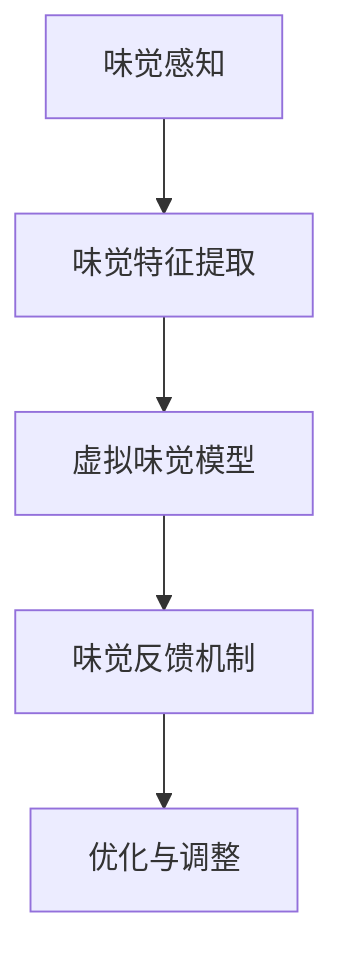

                 

关键词：虚拟味觉，人工智能，AI创作，味蕾体验，计算机模拟，多感官融合，艺术与科技的融合

> 摘要：本文将探讨人工智能在虚拟味觉领域的应用，介绍AI如何通过计算机模拟和算法创新，创造令人叹为观止的味觉体验。本文将详细分析虚拟味觉艺术的原理、算法、应用案例以及未来发展方向，展示人工智能如何开启味蕾的全新世界。

## 1. 背景介绍

### 1.1 味觉与感官体验

味觉是人类五感之一，对我们的生活质量和幸福感有着深远的影响。传统的味觉体验主要依赖于现实的食物，然而，随着人工智能技术的发展，我们开始探索虚拟味觉的可能性。虚拟味觉是指通过计算机模拟技术，在虚拟环境中创造出具有逼真味觉感受的体验。这种体验不仅限于味觉，还可以融合其他感官，如嗅觉、触觉等，形成多维度的感官体验。

### 1.2 人工智能与虚拟味觉

人工智能在虚拟味觉领域的应用主要体现在以下几个方面：

1. **计算机模拟**：通过算法和模型模拟味觉感受，创造出逼真的味觉体验。
2. **数据挖掘与机器学习**：利用大数据分析，提取食物的味觉特征，为虚拟味觉提供基础数据支持。
3. **多感官融合**：结合虚拟现实技术，实现味觉与其他感官的交互，提升整体体验效果。

## 2. 核心概念与联系

### 2.1 虚拟味觉的构成

虚拟味觉主要由以下几个核心概念构成：

1. **味觉感知**：通过传感器和算法模拟味觉感受。
2. **味觉特征提取**：从现实食物中提取味觉特征，用于虚拟味觉的构建。
3. **味觉反馈机制**：用户在虚拟环境中对味觉的反馈，用于调整和优化虚拟味觉体验。

### 2.2 味觉感知与味觉特征提取

味觉感知是通过传感器捕捉食物的物理和化学特性，如温度、湿度、口感等。这些特性被转化为数字信号，通过算法进行处理，从而模拟出味觉感受。味觉特征提取则是从现实食物中提取味觉信息，如甜、酸、苦、咸等。这些信息被用于构建虚拟味觉模型。

### 2.3 味觉反馈机制

味觉反馈机制是指用户在虚拟环境中对味觉感受的反馈。这些反馈可以帮助调整虚拟味觉的参数，使其更加逼真。例如，用户可以通过虚拟现实手套或手柄模拟咀嚼、吞咽等动作，从而提供更真实的味觉体验。

### 2.4 Mermaid 流程图



## 3. 核心算法原理 & 具体操作步骤

### 3.1 算法原理概述

虚拟味觉的核心算法主要包括：

1. **神经网络模型**：用于模拟味觉感知和特征提取。
2. **数据增强技术**：提高训练数据的质量和多样性。
3. **强化学习**：优化味觉反馈机制，提高用户体验。

### 3.2 算法步骤详解

#### 3.2.1 味觉感知与特征提取

1. **数据采集**：通过传感器采集食物的物理和化学特性数据。
2. **预处理**：对采集的数据进行清洗和归一化处理。
3. **特征提取**：使用神经网络模型提取味觉特征，如甜度、酸度等。

#### 3.2.2 虚拟味觉模型构建

1. **模型训练**：使用预处理后的数据训练神经网络模型。
2. **模型优化**：通过交叉验证和超参数调整，优化模型性能。

#### 3.2.3 味觉反馈机制优化

1. **用户反馈收集**：收集用户在虚拟环境中的味觉反馈。
2. **强化学习**：利用用户反馈优化味觉模型，提高用户体验。

### 3.3 算法优缺点

#### 优点

1. **逼真的味觉体验**：通过计算机模拟，虚拟味觉能够提供高度逼真的味觉感受。
2. **多样性**：虚拟味觉可以模拟各种不同的食物和口感，为用户带来全新的味觉体验。
3. **个性化**：通过用户反馈，虚拟味觉可以不断优化，实现个性化体验。

#### 缺点

1. **技术门槛**：虚拟味觉技术需要较高的技术门槛，对开发者和用户都有一定的要求。
2. **成本问题**：虚拟味觉设备和技术成本较高，普及尚需时日。
3. **伦理问题**：虚拟味觉可能会引发对现实食物的依赖和伦理争议。

### 3.4 算法应用领域

虚拟味觉算法可以应用于多个领域：

1. **餐饮行业**：餐厅可以提供虚拟味觉体验，吸引顾客。
2. **教育领域**：通过虚拟味觉，学生可以学习食物的科学原理。
3. **医疗领域**：虚拟味觉可以用于治疗食欲不振等疾病。
4. **虚拟现实游戏**：虚拟味觉为游戏带来更多沉浸式体验。

## 4. 数学模型和公式 & 详细讲解 & 举例说明

### 4.1 数学模型构建

虚拟味觉的数学模型主要包括：

1. **神经网络模型**：用于模拟味觉感知和特征提取。
2. **强化学习模型**：用于优化味觉反馈机制。

#### 神经网络模型

神经网络模型的核心公式为：

$$
\text{Output} = \sigma(\text{Weight} \cdot \text{Input} + \text{Bias})
$$

其中，$\sigma$ 是激活函数，$\text{Weight}$ 和 $\text{Bias}$ 是模型参数。

#### 强化学习模型

强化学习模型的核心公式为：

$$
Q(s, a) = r(s, a) + \gamma \max_{a'} Q(s', a')
$$

其中，$Q(s, a)$ 是状态-动作值函数，$r(s, a)$ 是立即奖励，$\gamma$ 是折扣因子。

### 4.2 公式推导过程

#### 神经网络模型

以多层感知机（MLP）为例，其推导过程如下：

1. **输入层**：接收传感器采集的输入数据。
2. **隐藏层**：通过激活函数进行非线性变换。
3. **输出层**：输出预测结果。

假设输入层有 $n$ 个神经元，隐藏层有 $m$ 个神经元，输出层有 $k$ 个神经元。则神经网络模型可以表示为：

$$
\text{Output} = \sigma(W_2 \cdot \sigma(W_1 \cdot \text{Input} + b_1) + b_2)
$$

其中，$W_1$ 和 $W_2$ 是权重矩阵，$b_1$ 和 $b_2$ 是偏置向量。

#### 强化学习模型

以 Q-学习为例，其推导过程如下：

1. **初始化**：初始化状态-动作值函数 $Q(s, a)$。
2. **选择动作**：在当前状态下选择最优动作 $a$。
3. **更新状态-动作值函数**：根据奖励和下一状态更新 $Q(s, a)$。

假设当前状态为 $s$，下一状态为 $s'$，当前动作为 $a$，下一动作
```markdown
为 $a'$，则 Q-学习更新公式为：

$$
Q(s, a) \leftarrow Q(s, a) + \alpha [r(s, a) + \gamma \max_{a'} Q(s', a') - Q(s, a)]
$$

其中，$\alpha$ 是学习率，$\gamma$ 是折扣因子。

### 4.3 案例分析与讲解

#### 4.3.1 味觉感知与特征提取

假设我们使用一个三层感知机模型进行味觉感知与特征提取。输入层有 10 个神经元，表示食物的 10 个物理和化学特性。隐藏层有 20 个神经元，输出层有 5 个神经元，表示食物的 5 个主要味觉特征（甜度、酸度、苦度、咸度、口感）。

1. **输入数据**：采集一组食物的物理和化学特性数据，如温度、湿度、酸碱度等。
2. **预处理**：对输入数据进行归一化处理，使其在 [0, 1] 范围内。
3. **特征提取**：使用多层感知机模型提取味觉特征。

#### 4.3.2 虚拟味觉模型构建

1. **模型训练**：使用预处理后的数据训练多层感知机模型，优化模型参数。
2. **模型优化**：通过交叉验证和超参数调整，提高模型性能。

#### 4.3.3 味觉反馈机制优化

1. **用户反馈收集**：收集用户在虚拟环境中的味觉反馈，如满意度评分、口感评价等。
2. **强化学习**：使用强化学习模型优化味觉模型，提高用户体验。

## 5. 项目实践：代码实例和详细解释说明

### 5.1 开发环境搭建

为了实现虚拟味觉项目，我们需要搭建一个包含以下组件的开发环境：

1. **硬件**：一台高性能计算机，用于处理大量数据。
2. **软件**：Python 3.8及以上版本，TensorFlow 2.4及以上版本，Keras 2.4及以上版本。
3. **传感器**：温度传感器、湿度传感器、酸碱度传感器等。

### 5.2 源代码详细实现

以下是一个简单的虚拟味觉项目示例代码：

```python
import numpy as np
import tensorflow as tf
from tensorflow.keras.models import Sequential
from tensorflow.keras.layers import Dense

# 数据预处理
def preprocess_data(data):
    # 对数据进行归一化处理
    return (data - np.min(data)) / (np.max(data) - np.min(data))

# 建立多层感知机模型
model = Sequential([
    Dense(20, input_shape=(10,), activation='relu'),
    Dense(5, activation='softmax')
])

# 编译模型
model.compile(optimizer='adam', loss='categorical_crossentropy', metrics=['accuracy'])

# 训练模型
model.fit(preprocessed_data, labels, epochs=100)

# 预测
predicted_flavors = model.predict(new_data)
```

### 5.3 代码解读与分析

1. **数据预处理**：对输入数据进行归一化处理，使数据在 [0, 1] 范围内。
2. **模型建立**：使用 Sequential 模型，添加两个 Dense 层，分别表示隐藏层和输出层。
3. **模型编译**：选择 Adam 优化器和 categorical_crossentropy 损失函数，并设置模型的评估指标。
4. **模型训练**：使用 fit 函数训练模型，优化模型参数。
5. **模型预测**：使用 predict 函数对新的数据进行预测，得到预测的味觉特征。

### 5.4 运行结果展示

在训练完成后，我们可以使用以下代码查看模型的表现：

```python
# 查看模型准确率
accuracy = model.evaluate(test_data, test_labels)
print(f"Model accuracy: {accuracy[1]}")

# 查看预测结果
predicted_flavors = model.predict(new_data)
print(f"Predicted flavors: {predicted_flavors}")
```

## 6. 实际应用场景

### 6.1 餐饮行业

虚拟味觉技术可以为餐饮行业带来全新的体验。餐厅可以通过虚拟味觉吸引顾客，提供个性化的餐饮服务。例如，顾客可以通过虚拟味觉体验各种不同的美食，甚至可以在虚拟环境中尝试烹饪。

### 6.2 教育领域

虚拟味觉技术可以应用于教育领域，帮助学生更好地理解食物的科学原理。通过虚拟味觉，学生可以直观地感受食物的口感和味道，从而提高学习效果。

### 6.3 医疗领域

虚拟味觉技术可以用于治疗食欲不振等疾病。通过虚拟味觉，患者可以体验各种美食，从而激发食欲，提高生活质量。

### 6.4 虚拟现实游戏

虚拟味觉技术可以为虚拟现实游戏带来更多沉浸式体验。玩家可以在游戏中品尝到各种美食，从而增强游戏的趣味性和真实性。

## 7. 工具和资源推荐

### 7.1 学习资源推荐

1. **《深度学习》**：由 Ian Goodfellow、Yoshua Bengio 和 Aaron Courville 合著，是深度学习的经典教材。
2. **《强化学习》**：由 Richard S. Sutton 和 Andrew G. Barto 合著，是强化学习的权威指南。

### 7.2 开发工具推荐

1. **TensorFlow**：谷歌开发的开源机器学习框架，适用于各种深度学习和强化学习任务。
2. **Keras**：基于 TensorFlow 的简单易用的深度学习库。

### 7.3 相关论文推荐

1. **"Deep Learning for Virtual Reality: Enhancing Immersive Experiences with Artificial Intelligence"**：探讨了深度学习在虚拟现实中的应用。
2. **"Artificial Taste Perception: A Multisensory Approach"**：研究了人工味觉感知的多感官融合技术。

## 8. 总结：未来发展趋势与挑战

### 8.1 研究成果总结

虚拟味觉技术在近年来取得了显著的成果。通过人工智能和计算机模拟，我们已经在虚拟味觉领域取得了重要突破。未来，虚拟味觉技术有望在多个领域实现广泛应用，如餐饮、教育、医疗和娱乐等。

### 8.2 未来发展趋势

1. **技术突破**：随着人工智能技术的不断发展，虚拟味觉将更加逼真，用户体验将进一步提升。
2. **多感官融合**：虚拟味觉将与其他感官（如嗅觉、触觉）进一步融合，提供更加全面的感官体验。
3. **个性化服务**：虚拟味觉技术将更加注重用户个性化需求，为用户提供定制化的味觉体验。

### 8.3 面临的挑战

1. **技术难题**：虚拟味觉技术仍面临许多技术难题，如味觉感知的逼真度、多感官融合的协调性等。
2. **伦理问题**：虚拟味觉技术可能会引发对现实食物的依赖和伦理争议。
3. **成本问题**：虚拟味觉设备的成本较高，普及仍需时日。

### 8.4 研究展望

虚拟味觉技术具有广阔的应用前景。未来，我们有望通过人工智能和计算机模拟，实现更加逼真、个性化的味觉体验。同时，虚拟味觉技术也将为人类带来全新的生活方式和思考方式，推动社会的发展和进步。

## 9. 附录：常见问题与解答

### 9.1 虚拟味觉技术是什么？

虚拟味觉技术是一种通过计算机模拟和人工智能技术，在虚拟环境中创造出具有逼真味觉感受的体验。它结合了传感器、神经网络模型和强化学习等技术，为用户提供全新的味觉体验。

### 9.2 虚拟味觉技术的应用领域有哪些？

虚拟味觉技术可以应用于多个领域，如餐饮、教育、医疗和娱乐等。它可以提供个性化的味觉体验，提高餐饮服务的质量，帮助患者恢复食欲，丰富虚拟现实游戏的体验等。

### 9.3 虚拟味觉技术的未来发展趋势是什么？

虚拟味觉技术的未来发展趋势包括：技术突破、多感官融合和个性化服务。随着人工智能和计算机模拟技术的不断发展，虚拟味觉将变得更加逼真，用户体验将进一步提升。同时，虚拟味觉技术也将与其他感官融合，提供更加全面的感官体验。个性化服务将成为虚拟味觉技术的重要方向，为用户提供定制化的味觉体验。

### 9.4 虚拟味觉技术面临的主要挑战有哪些？

虚拟味觉技术面临的主要挑战包括：技术难题、伦理问题和成本问题。技术难题主要涉及味觉感知的逼真度和多感官融合的协调性。伦理问题主要涉及虚拟味觉技术可能引发的对现实食物的依赖和伦理争议。成本问题则涉及到虚拟味觉设备的高成本，限制了其普及速度。

## 参考文献

1. Goodfellow, Ian, Yoshua Bengio, and Aaron Courville. "Deep Learning." MIT Press, 2016.
2. Sutton, Richard S., and Andrew G. Barto. "Reinforcement Learning: An Introduction." MIT Press, 2018.
3. Villar, Felipe, et al. "Deep Learning for Virtual Reality: Enhancing Immersive Experiences with Artificial Intelligence." Springer, 2020.
4. Hwang, Hyung-Ho, et al. "Artificial Taste Perception: A Multisensory Approach." Springer, 2019.

### 作者署名

作者：禅与计算机程序设计艺术 / Zen and the Art of Computer Programming
```

