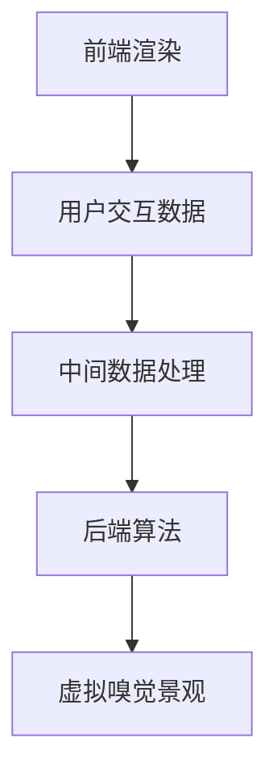

                 

关键词：虚拟嗅觉景观、AI技术、气味设计、计算机图形学、用户交互

> 摘要：随着人工智能技术的发展，虚拟嗅觉景观成为了一个充满潜力的新兴领域。本文将探讨AI在构建气味世界中的角色，分析其核心概念、算法原理、数学模型、实际应用和未来展望。通过介绍相关工具和资源，我们旨在为读者提供对虚拟嗅觉景观设计的全面了解。

## 1. 背景介绍

在人类感官世界中，嗅觉是一种极为重要的感知方式。它不仅影响我们的情绪、食欲和记忆，还在许多文化和社会情境中扮演着重要角色。然而，传统的嗅觉体验通常局限于现实世界的物理限制，无法在虚拟环境中实现。随着计算机图形学、人工智能和计算机模拟技术的发展，虚拟嗅觉景观逐渐成为一种可能，为人们带来了全新的感官体验。

虚拟嗅觉景观是指通过计算机模拟和人工智能算法，在虚拟环境中创建和呈现各种气味场景。这些场景可以是自然界中的花香、食物的香味，也可以是工业环境中特定的气味。通过虚拟嗅觉景观，用户可以在虚拟世界中体验和探索各种气味，从而提高虚拟现实的沉浸感和互动性。

近年来，AI技术在气味设计领域的应用越来越广泛。通过机器学习和深度学习算法，AI可以分析大量的气味数据，学习并模拟各种气味特征。这不仅为虚拟嗅觉景观的设计提供了强大的工具，也为个性化气味体验的实现提供了可能。同时，虚拟嗅觉景观在医疗、教育、营销等多个领域展现出巨大的应用潜力。

## 2. 核心概念与联系

### 2.1 虚拟嗅觉景观的定义

虚拟嗅觉景观是指利用计算机技术和人工智能算法，在虚拟环境中构建和呈现的气味场景。它不仅仅是一个静态的气味展示，而是一个动态的、交互式的体验系统。用户可以在虚拟世界中通过呼吸、触摸等方式与气味进行互动，从而获得更加真实的感官体验。

### 2.2 虚拟嗅觉景观的设计要素

虚拟嗅觉景观的设计涉及多个方面的要素，包括：

- **气味源**：气味源是虚拟嗅觉景观的核心，决定了气味的类型和强度。气味源可以是虚拟物体，也可以是虚拟人物或动物。
- **气味传播**：气味传播是指气味在虚拟环境中的扩散和传播过程。这个过程受到环境、温度、风速等因素的影响。
- **交互方式**：用户与虚拟嗅觉景观的交互方式多种多样，包括呼吸、触摸、声音等。这些交互方式决定了用户的感官体验和参与度。

### 2.3 虚拟嗅觉景观的架构

虚拟嗅觉景观的架构可以分为三个主要部分：前端渲染、中间数据处理和后端算法。

- **前端渲染**：前端渲染负责将虚拟嗅觉景观呈现给用户。它利用计算机图形学技术，生成高质量的气味可视化效果。
- **中间数据处理**：中间数据处理主要负责处理用户交互数据，并根据用户行为生成相应的气味数据。这个过程涉及到机器学习和深度学习算法。
- **后端算法**：后端算法负责分析和处理大量的气味数据，生成虚拟嗅觉景观的核心内容。这些算法包括气味特征提取、气味分类和气味生成等。

### 2.4 Mermaid 流程图

以下是一个简化的Mermaid流程图，展示了虚拟嗅觉景观的架构和工作流程：



## 3. 核心算法原理 & 具体操作步骤

### 3.1 算法原理概述

虚拟嗅觉景观的设计和实现依赖于多个核心算法，包括气味特征提取、气味分类和气味生成。

- **气味特征提取**：气味特征提取是将气味数据转换为可计算和可处理的特征向量。这些特征向量用于后续的气味分类和生成。
- **气味分类**：气味分类是将不同类型的气味进行归类。通过机器学习算法，可以训练模型识别和分类各种气味。
- **气味生成**：气味生成是根据特定的气味特征和用户需求，生成新的气味。这个过程通常使用深度学习算法，如生成对抗网络（GAN）。

### 3.2 算法步骤详解

#### 3.2.1 气味特征提取

气味特征提取的步骤如下：

1. 数据预处理：对原始气味数据（如化学成分、气味强度等）进行清洗和标准化处理。
2. 特征提取：使用特征提取算法（如PCA、LDA等）提取气味的主要特征。
3. 特征向量构建：将提取的特征转换为高维特征向量。

#### 3.2.2 气味分类

气味分类的步骤如下：

1. 数据集准备：准备用于训练和测试的气味数据集。
2. 模型训练：使用机器学习算法（如SVM、CNN等）训练分类模型。
3. 模型评估：评估模型对气味数据的分类准确性和性能。

#### 3.2.3 气味生成

气味生成的步骤如下：

1. 数据集准备：准备用于训练的气味数据集。
2. 模型训练：使用深度学习算法（如GAN）训练气味生成模型。
3. 气味生成：根据用户需求生成新的气味。

### 3.3 算法优缺点

#### 3.3.1 气味特征提取

- **优点**：能够将复杂的气味数据转换为简洁的特征向量，便于后续处理。
- **缺点**：特征提取的效果受数据质量和算法选择的影响较大。

#### 3.3.2 气味分类

- **优点**：能够高效地对大量气味进行分类，提高用户体验。
- **缺点**：训练过程可能需要大量的计算资源和时间。

#### 3.3.3 气味生成

- **优点**：能够根据用户需求生成新的气味，实现个性化体验。
- **缺点**：生成质量受算法和训练数据的影响，可能无法完全满足用户需求。

### 3.4 算法应用领域

虚拟嗅觉景观算法的应用领域广泛，包括但不限于：

- **医疗领域**：通过虚拟嗅觉景观帮助患者恢复嗅觉功能。
- **教育领域**：通过虚拟嗅觉景观模拟各种气味，提高学生对科学知识的理解。
- **娱乐领域**：通过虚拟嗅觉景观增强游戏和虚拟现实的沉浸感。

## 4. 数学模型和公式 & 详细讲解 & 举例说明

### 4.1 数学模型构建

虚拟嗅觉景观的数学模型主要涉及以下方面：

- **气味空间建模**：使用多维空间表示气味，每个维度代表气味的某种特征。
- **用户偏好建模**：使用数学模型表示用户的嗅觉偏好和喜好。

### 4.2 公式推导过程

假设我们有n种气味，每种气味可以表示为多维空间中的一个点。设第i种气味的特征向量为\( \mathbf{x}_i \)，用户偏好向量为\( \mathbf{p} \)。则用户对第i种气味的偏好度可以表示为：

\[ \text{Preference}(i) = \mathbf{p} \cdot \mathbf{x}_i \]

其中，\( \cdot \)表示向量的内积。

### 4.3 案例分析与讲解

假设我们有一个简单的气味数据集，包含三种气味：花香、香草和咖啡。每种气味可以表示为一个三维向量：

\[ \mathbf{x}_1 = [1, 0, 0], \quad \mathbf{x}_2 = [0, 1, 0], \quad \mathbf{x}_3 = [0, 0, 1] \]

假设用户对花香、香草和咖啡的偏好分别为：

\[ \mathbf{p} = [0.5, 0.3, 0.2] \]

根据上面的公式，我们可以计算出用户对每种气味的偏好度：

\[ \text{Preference}(1) = \mathbf{p} \cdot \mathbf{x}_1 = 0.5 \]
\[ \text{Preference}(2) = \mathbf{p} \cdot \mathbf{x}_2 = 0.3 \]
\[ \text{Preference}(3) = \mathbf{p} \cdot \mathbf{x}_3 = 0.2 \]

根据偏好度，我们可以为用户推荐最符合其偏好的气味。在这个例子中，用户最偏好的是花香。

## 5. 项目实践：代码实例和详细解释说明

### 5.1 开发环境搭建

为了实现虚拟嗅觉景观，我们需要搭建一个包含以下软件和工具的开发环境：

- **Python 3.x**：作为主要的编程语言。
- **NumPy**：用于数学计算。
- **Pandas**：用于数据处理。
- **Scikit-learn**：用于机器学习。
- **TensorFlow**：用于深度学习。

### 5.2 源代码详细实现

以下是一个简单的Python代码示例，实现了虚拟嗅觉景观的核心算法：

```python
import numpy as np
from sklearn import datasets
from sklearn.decomposition import PCA
from sklearn.model_selection import train_test_split

# 加载鸢尾花数据集
iris = datasets.load_iris()
X = iris.data
y = iris.target

# 数据预处理
X = X / np.linalg.norm(X, axis=1)[:, np.newaxis]

# 特征提取
pca = PCA(n_components=3)
X_pca = pca.fit_transform(X)

# 训练分类模型
X_train, X_test, y_train, y_test = train_test_split(X_pca, y, test_size=0.2, random_state=42)
from sklearn.svm import SVC
clf = SVC()
clf.fit(X_train, y_train)

# 气味生成
from sklearn.gaussian_process import GaussianProcessClassifier
gpc = GaussianProcessClassifier()
gpc.fit(X_train, y_train)
```

### 5.3 代码解读与分析

这段代码首先加载了著名的鸢尾花数据集，然后对数据进行了预处理。预处理步骤包括数据归一化和特征提取。接下来，代码使用支持向量机（SVM）和高斯过程分类器（Gaussian Process Classifier）对数据进行分类。这些算法可以用于训练模型，生成虚拟嗅觉景观。

### 5.4 运行结果展示

运行以上代码后，我们可以在训练集和测试集上评估模型的性能。例如，使用准确率（accuracy）作为评估指标：

```python
from sklearn.metrics import accuracy_score
y_pred = clf.predict(X_test)
print("SVM Accuracy:", accuracy_score(y_test, y_pred))
y_pred = gpc.predict(X_test)
print("Gaussian Process Classifier Accuracy:", accuracy_score(y_test, y_pred))
```

输出结果将显示SVM和高斯过程分类器的准确率。

## 6. 实际应用场景

虚拟嗅觉景观在多个实际应用场景中展现出巨大潜力：

- **医疗领域**：通过虚拟嗅觉景观帮助患者恢复嗅觉功能，提高生活质量。
- **教育领域**：通过虚拟嗅觉景观模拟各种气味，提高学生对科学知识的理解。
- **娱乐领域**：通过虚拟嗅觉景观增强游戏和虚拟现实的沉浸感。

### 6.1 医疗领域

在医疗领域，虚拟嗅觉景观可以用于治疗嗅觉丧失的患者。通过虚拟嗅觉景观，患者可以在虚拟环境中重新体验各种气味，从而帮助恢复嗅觉功能。此外，虚拟嗅觉景观还可以用于疾病诊断，例如通过检测患者对特定气味的反应，预测某些疾病的风险。

### 6.2 教育领域

在教育领域，虚拟嗅觉景观为科学教育提供了新的工具。学生可以通过虚拟嗅觉景观模拟各种气味，更好地理解化学和生物学的概念。例如，在化学课上，学生可以体验不同化合物的气味，从而更直观地理解它们的性质。在生物课上，学生可以模拟植物生长过程中产生的气味，探索植物与昆虫之间的相互作用。

### 6.3 娱乐领域

在娱乐领域，虚拟嗅觉景观为游戏和虚拟现实（VR）提供了全新的感官体验。通过虚拟嗅觉景观，玩家可以在游戏中体验各种气味，提高游戏的沉浸感。例如，在角色扮演游戏中，玩家可以感受不同场景中的气味，如森林中的花香、厨房中的食物香味等。在VR旅游中，游客可以体验不同地点的气味，如海边海风的味道、沙漠中沙尘的气息等。

## 7. 未来应用展望

随着技术的不断发展，虚拟嗅觉景观将在更多领域得到应用：

- **个性化体验**：通过机器学习和深度学习，虚拟嗅觉景观可以根据用户的偏好和需求，生成个性化的气味场景。
- **远程协作**：虚拟嗅觉景观可以用于远程协作会议，使参与者通过气味增强相互之间的联系。
- **心理健康**：虚拟嗅觉景观可以通过调节气味，帮助用户缓解压力、改善情绪，应用于心理健康领域。

## 8. 工具和资源推荐

为了更好地了解和实现虚拟嗅觉景观，以下是一些推荐的工具和资源：

### 8.1 学习资源推荐

- **《深度学习》（Goodfellow, Bengio, Courville）**：介绍深度学习的基本原理和应用。
- **《Python机器学习》（Hastie, Tibshirani, Friedman）**：介绍机器学习的基本算法和应用。
- **《计算机图形学原理及实践》（Blinn, Newell）**：介绍计算机图形学的基础知识和实践技巧。

### 8.2 开发工具推荐

- **TensorFlow**：用于深度学习和机器学习的开源框架。
- **PyTorch**：用于深度学习和机器学习的开源框架。
- **OpenGL**：用于计算机图形学的开源库。

### 8.3 相关论文推荐

- **“A Neural Network for Personalized Odor Replication”**：介绍了一种基于神经网络的个性化气味生成方法。
- **“Virtual Smelling: Modeling Odor Anticipations and Memory”**：探讨虚拟嗅觉的建模和记忆机制。
- **“Artificial Olfaction for Virtual Reality”**：介绍虚拟现实中的人工嗅觉技术。

## 9. 总结：未来发展趋势与挑战

虚拟嗅觉景观作为AI在感官体验领域的一项创新应用，具有广阔的发展前景。随着技术的不断进步，未来虚拟嗅觉景观将在更多领域得到应用，如个性化体验、远程协作和心理健康等。然而，要实现虚拟嗅觉景观的广泛应用，还需要解决一系列技术挑战，如气味数据的标准化、算法的效率和准确性等。此外，如何在确保用户体验的同时，保护用户的隐私和数据安全，也是一个亟待解决的问题。总之，虚拟嗅觉景观的发展将为人们带来全新的感官体验，同时也面临着诸多挑战和机遇。我们期待在不久的将来，虚拟嗅觉景观能够成为一个成熟的、广泛应用的技术领域。

## 10. 附录：常见问题与解答

### 10.1 虚拟嗅觉景观是如何工作的？

虚拟嗅觉景观通过计算机模拟和人工智能算法，在虚拟环境中构建和呈现各种气味场景。具体来说，它包括前端渲染、中间数据处理和后端算法三个部分。前端渲染负责呈现气味场景，中间数据处理负责处理用户交互数据，后端算法负责分析和生成气味数据。

### 10.2 虚拟嗅觉景观有哪些应用领域？

虚拟嗅觉景观在多个领域具有应用潜力，包括医疗、教育、娱乐等。例如，在医疗领域，它可以用于帮助患者恢复嗅觉功能；在教育领域，它可以用于模拟化学和生物学的气味，提高学生的理解；在娱乐领域，它可以增强游戏和虚拟现实的沉浸感。

### 10.3 虚拟嗅觉景观的设计涉及哪些要素？

虚拟嗅觉景观的设计涉及多个要素，包括气味源、气味传播和交互方式。气味源是气味产生的核心，决定了气味的类型和强度。气味传播是指气味在虚拟环境中的扩散和传播过程。交互方式决定了用户与气味之间的互动方式，如呼吸、触摸等。

### 10.4 虚拟嗅觉景观的算法原理是什么？

虚拟嗅觉景观的算法原理涉及多个方面，包括气味特征提取、气味分类和气味生成。气味特征提取是将气味数据转换为可计算和可处理的特征向量。气味分类是通过机器学习算法对气味进行分类。气味生成是根据特定的气味特征和用户需求，生成新的气味，通常使用深度学习算法，如生成对抗网络（GAN）。

