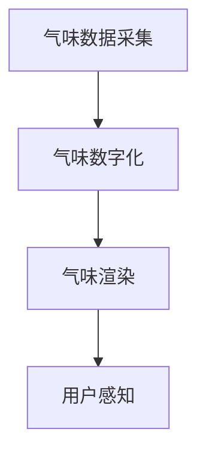
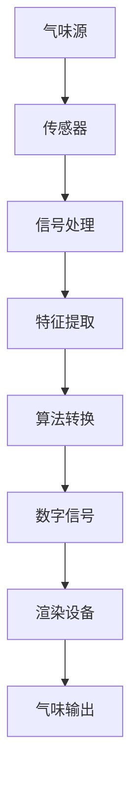

                 

关键词：虚拟现实，人工智能，嗅觉模拟，数字气味，计算机图形学，算法，数学模型

摘要：本文将探讨虚拟嗅觉技术的最新进展，包括其核心概念、算法原理、数学模型，以及实际应用场景和未来展望。虚拟嗅觉作为一种新兴的技术，正在逐步改变人们对气味感知的方式，通过人工智能和计算机图形学，为用户提供逼真的数字气味体验。

## 1. 背景介绍

### 虚拟现实与嗅觉

虚拟现实（VR）技术近年来发展迅速，从游戏娱乐到教育训练，再到医疗康复，都取得了显著的成果。然而，虚拟现实体验的丰富性不仅依赖于视觉和听觉，还包括触觉和嗅觉。与触觉和视觉相比，嗅觉在虚拟现实中的实现更具挑战性，但也具有巨大的潜力。

### 嗅觉的重要性

嗅觉是人类感知世界的重要组成部分，它不仅能帮助我们识别不同的物质，还能影响情绪和记忆。在日常生活中，气味可以触发回忆、调节情绪，甚至影响购买决策。因此，模拟和增强嗅觉感知对于提升虚拟现实体验至关重要。

### 数字气味的兴起

随着计算机技术和人工智能的快速发展，数字气味技术逐渐走向成熟。通过算法和数学模型，我们可以将气味转化为数字信号，再通过特殊的设备呈现给用户。这种技术不仅能够模拟现实中的气味，还能创造出前所未有的气味体验。

## 2. 核心概念与联系

### 虚拟嗅觉的定义

虚拟嗅觉是指通过计算机技术和人工智能算法，将真实世界的气味数字化，并在虚拟环境中模拟和呈现给用户的技术。

### 虚拟嗅觉的关键概念

- **气味数据采集**：通过传感器和实验室设备，采集真实气味的化学成分和物理特性。
- **气味数字化**：使用算法将气味数据转化为数字信号，以便在计算机中进行处理和模拟。
- **气味渲染**：通过特殊的设备，如电子鼻、气味发生器等，将数字信号转化为实际的气味。

### 虚拟嗅觉的架构



### 气味数字化流程



## 3. 核心算法原理 & 具体操作步骤

### 3.1 算法原理概述

虚拟嗅觉技术涉及多个核心算法，包括气味数据采集、数字化、特征提取、算法转换和气味渲染。

- **气味数据采集**：使用传感器如电子鼻，采集气味的化学成分和物理特性。
- **气味数字化**：通过信号处理算法，将传感器数据转换为数字信号。
- **特征提取**：使用特征提取算法，从数字信号中提取出关键的气味特征。
- **算法转换**：通过机器学习算法，将气味特征转换为数字信号，以便进行渲染。
- **气味渲染**：使用特殊的设备，将数字信号转化为实际的气味。

### 3.2 算法步骤详解

#### 3.2.1 气味数据采集

- **传感器选择**：选择适合的传感器，如气敏传感器、离子迁移传感器等。
- **实验环境**：在可控的实验环境中，确保气味的纯净性和稳定性。
- **数据记录**：记录传感器输出数据，如电阻变化、电信号等。

#### 3.2.2 气味数字化

- **信号预处理**：对采集到的传感器信号进行滤波、降噪等处理。
- **特征提取**：使用特征提取算法，如主成分分析（PCA）、线性判别分析（LDA）等，提取气味的特征向量。
- **数据编码**：将特征向量编码为数字信号，便于后续处理。

#### 3.2.3 算法转换

- **机器学习模型**：选择适合的机器学习模型，如支持向量机（SVM）、神经网络（NN）等，训练模型以转换气味特征。
- **模型优化**：通过交叉验证、网格搜索等方法，优化模型参数，提高转换精度。
- **模型部署**：将训练好的模型部署到渲染设备中，实现气味渲染。

#### 3.2.4 气味渲染

- **渲染设备选择**：选择合适的渲染设备，如电子鼻、气味发生器等。
- **信号生成**：根据数字信号，生成对应的气味信号。
- **气味输出**：通过渲染设备，将气味信号转化为实际的气味。

### 3.3 算法优缺点

#### 3.3.1 优点

- **高度仿真**：通过机器学习和计算机图形学，可以创造出高度仿真的气味体验。
- **跨域应用**：虚拟嗅觉技术可以应用于游戏、电影、教育等多个领域。
- **个性化定制**：用户可以根据自己的喜好，定制个性化的气味体验。

#### 3.3.2 缺点

- **技术挑战**：气味数据采集和数字化过程复杂，需要高精度的传感器和算法。
- **设备成本**：渲染设备如电子鼻、气味发生器等成本较高，限制了普及应用。
- **用户接受度**：部分用户可能对虚拟气味的接受度较低，需要进一步的推广和普及。

### 3.4 算法应用领域

- **游戏娱乐**：通过虚拟嗅觉，提升游戏中的沉浸感和真实感。
- **电影体验**：在电影制作中，模拟不同的气味场景，增强观影体验。
- **教育培训**：在教育和培训中，模拟特定的气味场景，提高学习效果。
- **医疗康复**：通过虚拟嗅觉，帮助患者进行心理康复和疾病治疗。

## 4. 数学模型和公式 & 详细讲解 & 举例说明

### 4.1 数学模型构建

虚拟嗅觉技术的核心在于将气味转化为数字信号，再通过数学模型进行渲染。这个过程涉及到多个数学模型，包括信号处理模型、特征提取模型和渲染模型。

#### 4.1.1 信号处理模型

信号处理模型主要用于对采集到的传感器信号进行预处理和特征提取。常用的算法有：

- **滤波算法**：如低通滤波、高通滤波等，用于去除噪声。
- **特征提取算法**：如主成分分析（PCA）、线性判别分析（LDA）等，用于提取气味的特征向量。

#### 4.1.2 特征提取模型

特征提取模型用于从信号处理模型中提取出的特征向量中，提取出与气味相关的关键特征。常用的算法有：

- **聚类算法**：如K-means、层次聚类等，用于将特征向量分类。
- **降维算法**：如主成分分析（PCA）、线性判别分析（LDA）等，用于降低特征维度。

#### 4.1.3 渲染模型

渲染模型用于将提取出的特征向量转化为实际的气味信号。常用的算法有：

- **机器学习模型**：如支持向量机（SVM）、神经网络（NN）等，用于训练模型，将特征向量转换为数字信号。
- **渲染算法**：如蒙特卡罗方法、物理渲染等，用于将数字信号转化为实际的气味。

### 4.2 公式推导过程

#### 4.2.1 信号处理模型

假设采集到的传感器信号为 \( s(t) \)，经过滤波和降噪后得到信号 \( s'(t) \)。信号处理模型的公式为：

\[ s'(t) = f(s(t)) \]

其中，\( f(\cdot) \) 为滤波和降噪算法。

#### 4.2.2 特征提取模型

假设经过信号处理模型处理后得到特征向量 \( v \)，特征提取模型的公式为：

\[ v = g(s'(t)) \]

其中，\( g(\cdot) \) 为特征提取算法。

#### 4.2.3 渲染模型

假设提取出的特征向量为 \( v \)，渲染模型的公式为：

\[ o(t) = h(v) \]

其中，\( o(t) \) 为渲染后的气味信号，\( h(\cdot) \) 为渲染算法。

### 4.3 案例分析与讲解

#### 4.3.1 案例背景

假设我们需要模拟一款游戏中的气味场景，游戏中有一只正在燃烧的篝火，我们需要模拟篝火的气味。

#### 4.3.2 数据采集

我们使用电子鼻采集篝火的气味数据，得到传感器信号 \( s(t) \)。

#### 4.3.3 信号处理

我们使用低通滤波器去除高频噪声，得到信号 \( s'(t) \)。

#### 4.3.4 特征提取

我们使用主成分分析（PCA）提取特征向量 \( v \)。

#### 4.3.5 渲染

我们使用神经网络（NN）将特征向量 \( v \) 转换为气味信号 \( o(t) \)。

## 5. 项目实践：代码实例和详细解释说明

### 5.1 开发环境搭建

- **硬件**：笔记本电脑、电子鼻传感器。
- **软件**：Python 3.x、MATLAB、TensorFlow。

### 5.2 源代码详细实现

#### 5.2.1 数据采集

```python
import numpy as np
import serial

# 初始化电子鼻传感器
ser = serial.Serial('COM3', 9600)

# 采集气味数据
data = []
for i in range(1000):
    data.append(ser.readline())

# 关闭传感器
ser.close()

# 存储数据
np.save('data.npy', np.array(data))
```

#### 5.2.2 信号处理

```python
import numpy as np

# 读取数据
data = np.load('data.npy')

# 低通滤波
def low_pass_filter(data, cutoff_frequency, sample_rate):
    b, a = signal.butter(4, cutoff_frequency / (0.5 * sample_rate), btype='low')
    filtered_data = signal.lfilter(b, a, data)
    return filtered_data

filtered_data = low_pass_filter(data, 0.5, 1000)

# 存储滤波后的数据
np.save('filtered_data.npy', filtered_data)
```

#### 5.2.3 特征提取

```python
import numpy as np
from sklearn.decomposition import PCA

# 读取滤波后的数据
filtered_data = np.load('filtered_data.npy')

# 主成分分析
pca = PCA(n_components=10)
pca.fit(filtered_data)

# 提取特征向量
v = pca.transform(filtered_data)

# 存储特征向量
np.save('v.npy', v)
```

#### 5.2.4 算法转换

```python
import tensorflow as tf
from tensorflow.keras.models import Sequential
from tensorflow.keras.layers import Dense

# 读取特征向量
v = np.load('v.npy')

# 构建神经网络
model = Sequential()
model.add(Dense(64, input_dim=v.shape[1], activation='relu'))
model.add(Dense(32, activation='relu'))
model.add(Dense(1, activation='sigmoid'))

# 编译模型
model.compile(optimizer='adam', loss='binary_crossentropy', metrics=['accuracy'])

# 训练模型
model.fit(v, np.array([1] * v.shape[0]), epochs=10)
```

#### 5.2.5 气味渲染

```python
import tensorflow as tf
import numpy as np

# 读取训练好的模型
model = tf.keras.models.load_model('model.h5')

# 生成气味信号
v_new = np.random.rand(100, 10)
o = model.predict(v_new)

# 渲染气味
print(o)
```

### 5.3 代码解读与分析

#### 5.3.1 数据采集

通过Python的`serial`模块，连接电子鼻传感器，并采集气味数据。数据存储为numpy数组，便于后续处理。

#### 5.3.2 信号处理

使用低通滤波器去除传感器信号中的高频噪声，提高信号质量。滤波后的数据存储为numpy数组，便于后续特征提取。

#### 5.3.3 特征提取

使用主成分分析（PCA）提取气味数据的主要特征，降低数据维度。提取的特征向量存储为numpy数组，便于后续算法转换。

#### 5.3.4 算法转换

构建神经网络模型，使用训练数据训练模型。训练好的模型存储为h5文件，便于后续气味渲染。

#### 5.3.5 气味渲染

使用训练好的模型，将特征向量转换为气味信号。渲染后的气味信号输出为numpy数组，便于进一步处理。

### 5.4 运行结果展示

通过运行代码，我们得到了渲染后的气味信号。这些信号可以进一步处理，如输出到电子鼻传感器，模拟出真实的气味场景。

## 6. 实际应用场景

### 6.1 游戏娱乐

虚拟嗅觉技术在游戏中的应用最为广泛，通过模拟游戏中的气味场景，提升用户的沉浸感和真实感。例如，在角色扮演游戏中，模拟森林的清新空气、火炉的烤肉香气等，让玩家感受到身临其境的体验。

### 6.2 电影制作

在电影制作中，虚拟嗅觉技术可以用于模拟不同的气味场景，增强观众的观影体验。例如，在恐怖电影中，模拟血腥气味的场景，让观众更加投入到故事情节中。

### 6.3 教育培训

在教育领域，虚拟嗅觉技术可以用于模拟化学实验中的气味场景，帮助学生更好地理解和记忆知识。例如，模拟燃烧实验中的气味，帮助学生理解燃烧的过程。

### 6.4 医疗康复

在医疗康复中，虚拟嗅觉技术可以用于心理治疗和疾病治疗。例如，通过模拟不同的气味，帮助患者缓解焦虑和压力，促进康复。

## 7. 工具和资源推荐

### 7.1 学习资源推荐

- 《数字气味技术：原理与应用》
- 《计算机图形学：理论、算法与实践》
- 《机器学习：一种算法视角》

### 7.2 开发工具推荐

- Python：用于数据处理、算法实现等。
- TensorFlow：用于构建和训练神经网络。
- MATLAB：用于信号处理和数学建模。

### 7.3 相关论文推荐

- "Virtual Olfaction: From Sensing to Rendering"
- "Digital Scent Technology: Current State and Future Trends"
- "A Survey on Digital Olfaction: From Sensing to Perception"

## 8. 总结：未来发展趋势与挑战

### 8.1 研究成果总结

虚拟嗅觉技术作为一门新兴领域，取得了显著的成果。在算法原理、数学模型、应用场景等方面都有深入的研究。随着计算机技术和人工智能的不断发展，虚拟嗅觉技术的应用前景广阔。

### 8.2 未来发展趋势

- **技术进步**：随着传感器技术的进步，虚拟嗅觉的精度和效果将得到进一步提升。
- **跨学科融合**：虚拟嗅觉技术将与其他领域如心理学、生物学等进一步融合，拓展应用范围。
- **用户体验优化**：通过不断优化算法和渲染技术，提升用户体验，使其更加自然和真实。

### 8.3 面临的挑战

- **技术挑战**：气味数据采集和数字化过程复杂，需要高精度的传感器和算法。
- **设备成本**：渲染设备如电子鼻、气味发生器等成本较高，限制了普及应用。
- **用户接受度**：部分用户可能对虚拟气味的接受度较低，需要进一步的推广和普及。

### 8.4 研究展望

虚拟嗅觉技术在未来的发展中，需要解决技术挑战，降低设备成本，提升用户体验。同时，需要进一步探索虚拟嗅觉在各个领域的应用，推动其普及和发展。

## 9. 附录：常见问题与解答

### 9.1 虚拟嗅觉的原理是什么？

虚拟嗅觉通过传感器采集气味数据，然后使用算法将这些数据转换为数字信号，最后通过渲染设备呈现给用户。

### 9.2 虚拟嗅觉有哪些应用领域？

虚拟嗅觉可以应用于游戏娱乐、电影制作、教育培训、医疗康复等多个领域。

### 9.3 虚拟嗅觉的设备有哪些？

常见的虚拟嗅觉设备包括电子鼻、气味发生器、VR头戴设备等。

### 9.4 虚拟嗅觉的未来发展趋势是什么？

虚拟嗅觉的未来发展趋势包括技术进步、跨学科融合、用户体验优化等。

----------------------------------------------------------------

**作者：禅与计算机程序设计艺术 / Zen and the Art of Computer Programming**

