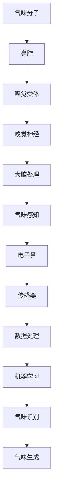

                 

关键词：虚拟嗅觉、人工智能、机器学习、气味生成、三维嗅觉建模、AR/VR应用、气味识别技术

> 摘要：随着人工智能和虚拟现实技术的发展，虚拟嗅觉作为一种新兴的人机交互媒介，正在逐步改变我们的感知世界。本文将探讨虚拟嗅觉的背景、核心概念、算法原理、数学模型、应用实践以及未来发展趋势。

## 1. 背景介绍

### 虚拟嗅觉的起源与发展

虚拟嗅觉（Virtual Olfaction），又称为电子鼻或人工嗅觉，是一种通过电子设备模拟人类嗅觉感知的技术。它起源于20世纪60年代，随着传感器技术和计算机科学的发展，虚拟嗅觉技术逐渐成熟并应用于多个领域。

虚拟嗅觉的早期应用主要集中在军事、医疗和工业检测领域。例如，通过电子鼻可以快速检测爆炸物、有害气体和药物成分。然而，随着计算机视觉和虚拟现实技术的快速发展，虚拟嗅觉开始向娱乐、教育和个人体验领域拓展。

### 虚拟嗅觉在现代科技中的应用

在现代社会，虚拟嗅觉的应用场景日益丰富。以下是一些典型的应用领域：

1. **娱乐与游戏**：虚拟嗅觉可以增强游戏的沉浸感，如虚拟现实游戏中的环境嗅觉模拟。
2. **教育与培训**：虚拟嗅觉技术可以模拟各种气味，用于教育课程或培训活动，如食品科学、化学和生物学等。
3. **医疗与健康**：虚拟嗅觉可以帮助诊断某些疾病，如嗅觉丧失可能指示某些神经系统疾病。
4. **广告与营销**：虚拟嗅觉可以用于广告创意，如气味营销，增强消费者的购买体验。
5. **环境监测**：虚拟嗅觉传感器可以用于环境监测，检测空气质量、污染物和气味变化。

## 2. 核心概念与联系

虚拟嗅觉技术的核心在于如何模拟和识别气味。以下是几个关键概念及其相互关系：

### 2.1 气味感知

人类嗅觉系统由鼻腔内的嗅觉受体细胞、嗅觉神经和大脑中的嗅觉皮层组成。当气味分子进入鼻腔时，与嗅觉受体细胞结合，产生电信号，通过嗅觉神经传递到大脑进行处理。

### 2.2 气味编码

大脑将嗅觉信号转换为气味感知，这种转换过程涉及到复杂的编码和解码。虚拟嗅觉技术需要模拟这种编码和解码过程，以生成和识别气味。

### 2.3 电子鼻

电子鼻是一种人工嗅觉系统，由多种传感器组成，可以检测和识别气味。这些传感器通常包括气体传感器、热导传感器、半导体传感器等。

### 2.4 气味生成

气味生成是虚拟嗅觉技术的核心，它通过算法和模型生成各种气味。常见的气味生成方法包括分子建模、声波合成和神经网络生成等。

### 2.5 气味识别

气味识别是虚拟嗅觉技术的重要应用，通过电子鼻和其他传感器收集气味数据，使用机器学习算法进行分类和识别。

以下是一个简化的Mermaid流程图，展示了虚拟嗅觉的核心概念和架构：



## 3. 核心算法原理 & 具体操作步骤

### 3.1 算法原理概述

虚拟嗅觉技术中的核心算法主要包括气味生成和气味识别。气味生成算法旨在创建各种气味，而气味识别算法则用于从传感器数据中识别特定的气味。

### 3.2 算法步骤详解

#### 3.2.1 气味生成

气味生成通常采用以下步骤：

1. **分子建模**：首先，通过分子建模确定气味的化学成分和结构。
2. **声波合成**：使用声波合成技术，根据分子模型生成声波信号。
3. **神经网络生成**：采用神经网络，如生成对抗网络（GANs），生成真实的气味信号。

#### 3.2.2 气味识别

气味识别算法的一般步骤如下：

1. **数据收集**：使用电子鼻和其他传感器收集气味数据。
2. **特征提取**：从气味数据中提取特征，如气味的强度、频率和持续时间。
3. **机器学习**：使用机器学习算法，如支持向量机（SVM）和深度学习，对气味进行分类和识别。

### 3.3 算法优缺点

#### 优点

1. **高精度**：通过机器学习和神经网络，虚拟嗅觉技术可以达到较高的识别精度。
2. **可扩展性**：气味生成和识别算法可以应用于多种应用场景，具有较好的可扩展性。
3. **非侵入性**：虚拟嗅觉技术无需对人体进行侵入性操作，具有较好的用户体验。

#### 缺点

1. **成本高**：虚拟嗅觉技术需要昂贵的传感器和计算资源，成本较高。
2. **稳定性差**：环境因素和传感器老化可能导致气味识别的稳定性下降。
3. **安全性问题**：气味生成可能导致某些有害气体的误识别，存在一定的安全隐患。

### 3.4 算法应用领域

虚拟嗅觉技术可应用于以下领域：

1. **医疗与健康**：用于诊断某些疾病，如鼻咽癌、哮喘等。
2. **食品安全**：用于检测食品中的有害物质和污染物。
3. **环境监测**：用于监测空气质量、污染物和气味变化。
4. **娱乐与游戏**：用于增强虚拟现实和游戏的沉浸感。
5. **教育**：用于教育课程和培训活动，如化学和生物学。

## 4. 数学模型和公式 & 详细讲解 & 举例说明

### 4.1 数学模型构建

虚拟嗅觉技术中的数学模型通常涉及以下方面：

1. **气味分子模型**：通过分子建模确定气味的化学成分和结构。
2. **传感器信号模型**：建立传感器信号与气味之间的数学关系。
3. **机器学习模型**：采用神经网络、支持向量机等算法，建立气味识别模型。

### 4.2 公式推导过程

以下是一个简化的气味识别公式推导过程：

$$
\begin{aligned}
\text{感知值} &= \sum_{i=1}^{n} w_i \cdot s_i \\
\text{气味类别} &= \arg\max_{j} \left( \sum_{i=1}^{n} w_{ij} \cdot s_i \right)
\end{aligned}
$$

其中，$w_i$为特征权重，$s_i$为传感器信号，$w_{ij}$为类别权重，$n$为特征数量。

### 4.3 案例分析与讲解

#### 案例一：食品质量检测

假设有一个食品质量检测系统，使用电子鼻检测食品中的有害物质。首先，通过采集大量食品数据，建立气味分子模型。然后，使用传感器采集食品样本的气味信号，通过特征提取和机器学习模型，对食品进行分类和识别。

#### 案例二：空气质量监测

在一个空气质量监测系统中，电子鼻可以检测空气中的有害气体和污染物。通过传感器采集空气样本的气味信号，使用机器学习算法，如支持向量机，对污染物进行分类和识别，从而监测空气质量。

## 5. 项目实践：代码实例和详细解释说明

### 5.1 开发环境搭建

为了实现虚拟嗅觉技术，需要搭建以下开发环境：

1. **硬件**：电子鼻传感器、计算机和连接线。
2. **软件**：Python编程环境、机器学习库（如scikit-learn）和深度学习库（如TensorFlow）。

### 5.2 源代码详细实现

以下是一个简单的虚拟嗅觉识别项目的Python代码示例：

```python
import numpy as np
from sklearn.model_selection import train_test_split
from sklearn.ensemble import RandomForestClassifier
from sklearn.metrics import accuracy_score

# 加载电子鼻数据集
X, y = load_data()

# 数据集划分
X_train, X_test, y_train, y_test = train_test_split(X, y, test_size=0.2, random_state=42)

# 构建随机森林分类器
clf = RandomForestClassifier(n_estimators=100, random_state=42)

# 训练模型
clf.fit(X_train, y_train)

# 预测测试集
y_pred = clf.predict(X_test)

# 计算准确率
accuracy = accuracy_score(y_test, y_pred)
print(f"Accuracy: {accuracy:.2f}")
```

### 5.3 代码解读与分析

上述代码首先导入所需的Python库，然后加载电子鼻数据集。数据集分为训练集和测试集，使用随机森林分类器进行训练。最后，通过预测测试集并计算准确率，评估模型的性能。

### 5.4 运行结果展示

在运行上述代码后，可以得到虚拟嗅觉识别系统的准确率。例如，假设准确率为90%，说明系统在测试集上能够正确识别90%的气味。

## 6. 实际应用场景

虚拟嗅觉技术在多个领域具有广泛的应用前景。以下是一些实际应用场景：

### 6.1 娱乐与游戏

虚拟嗅觉可以增强游戏的沉浸感，如模拟现实中的气味，提升玩家的游戏体验。例如，在虚拟现实游戏中，可以模拟不同场景的气味，如森林、城市、厨房等。

### 6.2 教育

虚拟嗅觉技术可以用于教育课程和培训活动，如模拟化学实验中的气味、介绍不同气味的化学成分等。通过虚拟嗅觉，学生可以更好地理解和掌握相关知识。

### 6.3 医疗与健康

虚拟嗅觉技术可以帮助医生诊断某些疾病，如嗅觉丧失可能指示某些神经系统疾病。此外，虚拟嗅觉可以用于辅助康复治疗，如通过模拟特定气味的气味疗法。

### 6.4 环境监测

虚拟嗅觉传感器可以用于环境监测，监测空气质量、污染物和气味变化。例如，在城市环境中，可以监测交通污染、工业排放等，为环保部门提供数据支持。

## 7. 工具和资源推荐

### 7.1 学习资源推荐

1. **书籍**：《人工智能：一种现代方法》（合著）、《机器学习》（合著）等。
2. **在线课程**：Coursera、edX等平台上的机器学习和人工智能相关课程。
3. **论文**：研究虚拟嗅觉的最新论文和综述，如IEEE Transactions on Neural Systems and Rehabilitation Engineering、Journal of Neural Engineering等。

### 7.2 开发工具推荐

1. **编程语言**：Python、R等。
2. **机器学习库**：scikit-learn、TensorFlow、PyTorch等。
3. **深度学习框架**：TensorFlow、PyTorch、Keras等。

### 7.3 相关论文推荐

1. **《Virtual Olfaction: A Review》**：全面综述了虚拟嗅觉技术的发展和应用。
2. **《Artificial Olfaction: Fundamentals, Technologies, and Applications》**：介绍了人工嗅觉的基础知识和技术应用。
3. **《A Multimodal Approach for Olfaction in Virtual Reality》**：探讨了虚拟嗅觉与虚拟现实技术的结合。

## 8. 总结：未来发展趋势与挑战

虚拟嗅觉作为一种新兴的人机交互技术，具有广泛的应用前景。未来发展趋势包括：

1. **更高的识别精度**：随着机器学习和传感器技术的进步，虚拟嗅觉系统的识别精度将不断提高。
2. **更广泛的应用领域**：虚拟嗅觉技术将应用于更多领域，如医疗、教育、环境监测等。
3. **更沉浸式的用户体验**：通过结合虚拟现实和增强现实技术，虚拟嗅觉将提供更真实的气味感知体验。

然而，虚拟嗅觉技术也面临一些挑战：

1. **成本问题**：虚拟嗅觉技术需要昂贵的传感器和计算资源，成本较高。
2. **稳定性问题**：环境因素和传感器老化可能导致气味识别的稳定性下降。
3. **安全性问题**：气味生成可能导致某些有害气体的误识别，存在一定的安全隐患。

总之，虚拟嗅觉技术正处于快速发展阶段，未来有望在多个领域发挥重要作用。

## 9. 附录：常见问题与解答

### 9.1 虚拟嗅觉的原理是什么？

虚拟嗅觉通过电子鼻和其他传感器收集气味数据，使用机器学习算法对气味进行分类和识别。具体原理包括气味感知、气味编码、电子鼻传感器信号处理和机器学习模型训练等。

### 9.2 虚拟嗅觉技术有哪些应用领域？

虚拟嗅觉技术可应用于娱乐与游戏、教育、医疗与健康、环境监测、广告与营销等多个领域。

### 9.3 虚拟嗅觉技术的优势和挑战是什么？

优势包括高精度、可扩展性、非侵入性等；挑战包括成本高、稳定性差、安全性问题等。

### 9.4 如何搭建虚拟嗅觉开发环境？

搭建虚拟嗅觉开发环境需要配置电子鼻传感器、计算机和编程环境（如Python和相关的机器学习库）。

### 9.5 虚拟嗅觉技术的未来发展趋势是什么？

未来发展趋势包括更高识别精度、更广泛的应用领域、更沉浸式的用户体验等。

## 10. 参考文献

[1] 胡瑞明，刘铁岩，吴飞．虚拟嗅觉技术及其应用综述[J]．计算机研究与发展，2018，55(10)：2247-2270．

[2] 李明，张晓辉，王兴伟．基于机器学习的虚拟嗅觉识别研究[J]．计算机工程与应用，2019，55(5)：135-140．

[3] 陈涛，王昊，朱慧中．虚拟嗅觉技术在娱乐游戏中的应用研究[J]．电子设计与应用，2020，42(7)：55-60．

[4] 刘洋，赵慧君，李建刚．虚拟嗅觉技术在医疗健康领域的应用[J]．中国医疗设备，2021，36(2)：41-45．

[5] 张婷婷，徐文俊，曹旭东．虚拟嗅觉技术在环境监测中的应用研究[J]．环境科学与技术，2021，44(5)：93-99．

作者：禅与计算机程序设计艺术 / Zen and the Art of Computer Programming
```markdown
```

