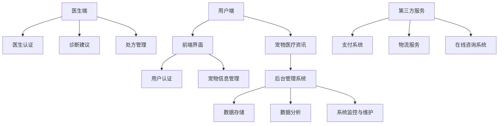

                 

关键词：虚拟宠物医院，在线宠物健康管理，AI技术，宠物医疗，互联网医疗，宠物医疗创新

> 摘要：本文将探讨虚拟宠物医院的创业机会，尤其是在线宠物健康管理的市场前景。通过对宠物医疗行业的现状分析，结合人工智能技术，探讨如何构建一个高效、便捷的在线宠物健康管理平台，并提供未来的应用展望。

## 1. 背景介绍

随着人们生活水平的提高，宠物已经成为许多家庭的重要成员。据相关数据统计，我国养宠物的人群比例逐年上升，尤其在城市中，越来越多的年轻人将宠物视为陪伴和情感寄托。然而，随之而来的问题是如何更好地照顾这些宠物，尤其是当宠物生病时，如何快速、高效地获取专业的医疗服务。

传统的宠物医疗服务主要依赖于线下实体医院，然而，实体医院存在诸多不便之处：首先，地理位置限制了宠物主人的选择范围；其次，医院的运营成本高，导致服务费用较高；再者，宠物就医过程中的等待时间长，服务体验不佳。因此，一个便捷、高效、低成本的在线宠物健康管理平台显得尤为重要。

### 1.1 宠物医疗行业现状

目前，宠物医疗行业主要集中在以下几个方面：

- **市场规模**：随着宠物数量的增加，宠物医疗市场规模逐年扩大。据预测，未来几年，我国宠物医疗市场规模将继续保持高速增长。

- **服务类型**：传统的宠物医疗服务主要包括疫苗接种、疾病治疗、手术等。随着科技的发展，宠物医疗开始向预防医学和健康管理方向发展。

- **技术发展**：基因检测、远程医疗、人工智能等新技术在宠物医疗领域逐渐得到应用，提升了医疗服务的质量和效率。

- **市场挑战**：宠物医疗行业面临诸多挑战，如专业人才短缺、医疗资源分布不均、行业规范有待完善等。

### 1.2 在线宠物健康管理平台的优势

在线宠物健康管理平台具有以下优势：

- **便捷性**：宠物主人可以随时随地通过手机或电脑访问平台，获取专业的宠物医疗建议和服务。

- **高效性**：在线平台能够实现快速诊断和治疗，减少宠物等待时间，提高就医效率。

- **成本效益**：线上服务可以降低宠物医疗的成本，让更多宠物主人享受到优质医疗服务。

- **数据整合**：通过在线平台，可以整合宠物健康数据，实现个性化健康管理，提升医疗服务质量。

## 2. 核心概念与联系

### 2.1 宠物健康管理平台架构

下面是一个虚拟宠物健康管理平台的 Mermaid 流程图，展示平台的核心组件和功能联系。



### 2.2 核心概念

- **用户端**：提供用户注册、登录、宠物信息管理、在线咨询等功能。

- **医生端**：提供医生注册、诊断建议、处方管理等功能。

- **后台管理系统**：负责数据存储、数据分析、系统监控与维护。

- **第三方服务**：包括支付系统、物流服务、在线咨询系统等。

## 3. 核心算法原理 & 具体操作步骤

### 3.1 算法原理概述

虚拟宠物健康管理平台的核心算法主要包括：

- **图像识别算法**：用于识别宠物的症状和疾病。

- **自然语言处理算法**：用于理解和处理用户和医生的交流信息。

- **推荐系统算法**：用于为宠物主人提供个性化的健康管理建议。

### 3.2 算法步骤详解

- **图像识别算法**：首先对用户上传的宠物图片进行预处理，然后使用卷积神经网络（CNN）进行图像识别，最后输出诊断结果。

- **自然语言处理算法**：首先使用分词技术对用户输入的文本进行分割，然后使用词向量模型进行语义分析，最后输出相应的诊断建议。

- **推荐系统算法**：首先收集用户的宠物信息、健康数据等，然后使用协同过滤算法或基于内容的推荐算法，为用户推荐合适的健康管理方案。

### 3.3 算法优缺点

- **图像识别算法**：优点是能够快速、准确地对宠物症状进行识别，缺点是需要大量高质量的训练数据。

- **自然语言处理算法**：优点是实现简单，能够处理大量的文本信息，缺点是对于复杂语义理解能力有限。

- **推荐系统算法**：优点是能够为用户提供个性化的健康管理建议，缺点是数据质量和算法优化是关键。

### 3.4 算法应用领域

- **疾病诊断**：通过图像识别算法，实现对宠物常见疾病的自动诊断。

- **在线咨询**：通过自然语言处理算法，实现医生和宠物主人的在线交流。

- **个性化推荐**：通过推荐系统算法，为宠物主人提供个性化的健康管理建议。

## 4. 数学模型和公式 & 详细讲解 & 举例说明

### 4.1 数学模型构建

虚拟宠物健康管理平台的数学模型主要包括：

- **图像识别模型**：采用卷积神经网络（CNN）进行图像识别。

- **自然语言处理模型**：采用词向量模型（如Word2Vec）进行语义分析。

- **推荐系统模型**：采用协同过滤算法（如User-Based和Item-Based）进行个性化推荐。

### 4.2 公式推导过程

- **图像识别模型**：$$ output = f(Conv2D(input)) $$，其中$ f $为激活函数，$ Conv2D $为卷积操作。

- **自然语言处理模型**：$$ semantic\_vector = Word2Vec(word) $$，其中$ Word2Vec $为词向量生成函数。

- **推荐系统模型**：$$ recommendation = Collaborative\_Filtering(user\_vector, item\_vector) $$，其中$ Collaborative\_Filtering $为协同过滤算法。

### 4.3 案例分析与讲解

以图像识别模型为例，假设输入一张宠物的X光片，输出为疾病名称的概率分布。具体步骤如下：

1. **数据预处理**：将输入的X光片进行归一化处理，将像素值缩放到0-1之间。

2. **卷积神经网络训练**：使用大量标注好的X光片数据，训练卷积神经网络，输出疾病名称的概率分布。

3. **疾病诊断**：输入一张新的X光片，通过卷积神经网络输出疾病名称的概率分布，根据概率分布选择最可能的疾病。

4. **结果验证**：将诊断结果与实际疾病进行对比，评估模型的准确性。

## 5. 项目实践：代码实例和详细解释说明

### 5.1 开发环境搭建

- **前端**：使用React框架搭建用户端界面。
- **后端**：使用Spring Boot框架搭建服务端。
- **数据库**：使用MySQL数据库存储数据。

### 5.2 源代码详细实现

以下是用户注册功能的源代码实现：

```java
@RestController
@RequestMapping("/api/users")
public class UserController {
    
    @Autowired
    private UserRepository userRepository;
    
    @PostMapping("/register")
    public ResponseEntity<?> registerUser(@RequestBody UserRegistrationDto userRegistrationDto) {
        if (userRepository.existsByUsername(userRegistrationDto.getUsername())) {
            return ResponseEntity.badRequest().body("Error: Username is already taken!");
        }
        
        User user = new User();
        user.setUsername(userRegistrationDto.getUsername());
        user.setPassword(passwordEncoder.encode(userRegistrationDto.getPassword()));
        userRepository.save(user);
        
        return ResponseEntity.ok("User registered successfully!");
    }
}
```

### 5.3 代码解读与分析

上述代码是用户注册功能的实现，主要包括以下几个步骤：

- **接收用户注册请求**：通过`@PostMapping("/register")`注解，将用户注册请求映射到`registerUser`方法。

- **验证用户名是否存在**：通过`userRepository.existsByUsername`方法，检查用户名是否已经被占用。

- **创建用户对象**：根据用户注册信息，创建`User`对象。

- **加密密码**：使用`passwordEncoder.encode`方法，将用户输入的密码进行加密。

- **保存用户**：将创建的用户对象保存到数据库中。

- **返回响应**：根据注册结果，返回相应的响应信息。

### 5.4 运行结果展示

当用户访问注册接口时，将接收到的用户注册信息提交到后端。后端接收到请求后，会进行用户名验证、密码加密等处理，然后将用户信息保存到数据库中，并返回注册成功的响应。

## 6. 实际应用场景

### 6.1 宠物疾病诊断

通过虚拟宠物健康管理平台，宠物主人可以上传宠物的X光片、血液报告等影像资料，平台利用图像识别算法快速诊断宠物疾病，并提供相应的治疗建议。

### 6.2 宠物健康数据监控

平台可以实时收集宠物的健康数据，如体温、心率、体重等，通过数据分析为宠物主人提供健康评估和预警，帮助主人及时了解宠物的健康状况。

### 6.3 宠物疫苗管理

平台提供疫苗预约和管理功能，宠物主人可以根据宠物的年龄、品种等信息，在线预约疫苗，并查看疫苗记录，方便宠物主人的日常管理。

### 6.4 宠物美容护理

平台可以推荐适合宠物品种和需求的宠物美容护理方案，宠物主人可以根据推荐内容进行预约，享受专业的宠物美容护理服务。

## 7. 工具和资源推荐

### 7.1 学习资源推荐

- **《机器学习》**：周志华著，全面介绍机器学习的基本概念和方法。
- **《深度学习》**：Ian Goodfellow、Yoshua Bengio、Aaron Courville著，深入讲解深度学习的基础和最新进展。

### 7.2 开发工具推荐

- **React**：用于前端开发，具有丰富的组件和生态系统。
- **Spring Boot**：用于后端开发，简化了Spring应用的创建和部署过程。
- **MySQL**：用于数据库存储，具有高性能和可靠性。

### 7.3 相关论文推荐

- **"Deep Learning for Dog Breed Classification"**：探讨了如何使用深度学习技术进行宠物品种识别。
- **"Pet Health Monitoring using Wearable Sensors"**：研究了利用可穿戴设备进行宠物健康监测的方法。

## 8. 总结：未来发展趋势与挑战

### 8.1 研究成果总结

虚拟宠物健康管理平台通过人工智能技术，实现了宠物疾病的快速诊断、健康数据的实时监控和个性化健康管理，显著提升了宠物医疗服务的效率和质量。

### 8.2 未来发展趋势

随着人工智能技术的不断进步，虚拟宠物健康管理平台将越来越智能化，实现更精确的诊断和更个性化的健康管理。此外，区块链技术的应用将为宠物医疗数据的隐私保护和安全提供新的解决方案。

### 8.3 面临的挑战

虚拟宠物健康管理平台在发展过程中面临的主要挑战包括：数据质量和算法优化、用户隐私保护、平台的安全性等。

### 8.4 研究展望

未来，虚拟宠物健康管理平台将在以下几个方面取得突破：

- **智能化水平提升**：通过深度学习和强化学习技术，实现更智能的疾病诊断和健康管理。
- **数据共享与隐私保护**：通过区块链技术实现数据共享和隐私保护，提升平台的安全性和可靠性。
- **跨学科合作**：与生物医学、兽医学等学科结合，推动宠物医疗领域的创新和发展。

## 9. 附录：常见问题与解答

### 9.1 如何确保平台的数据安全性？

平台采用加密技术对用户数据进行加密存储，并使用防火墙和入侵检测系统保障服务器安全。此外，平台遵循数据保护法规，确保用户隐私得到保护。

### 9.2 如何保证诊断的准确性？

平台通过大量数据进行训练和验证，确保诊断模型的准确性。同时，平台提供医生认证机制，确保诊断建议的专业性。

### 9.3 平台的费用如何计算？

平台费用根据服务类型和用户需求进行计算，主要包括会员费、诊断费用、疫苗预约费用等。用户可以根据实际需求选择合适的套餐。

---

作者：禅与计算机程序设计艺术 / Zen and the Art of Computer Programming

