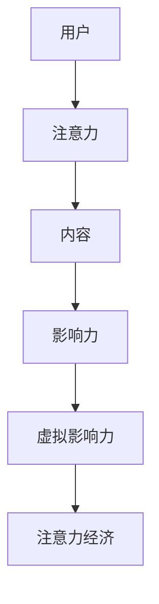
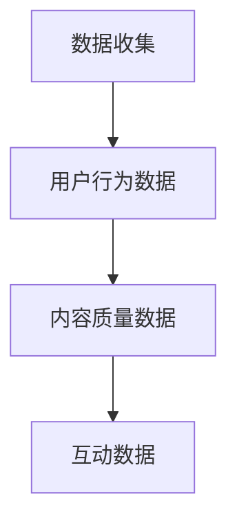
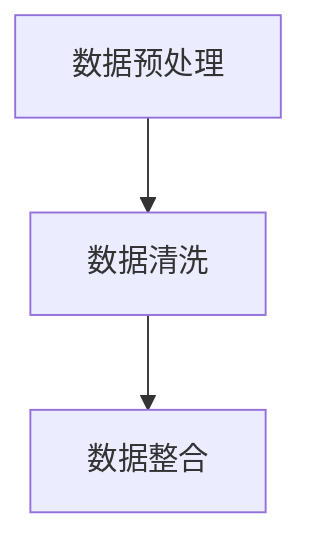
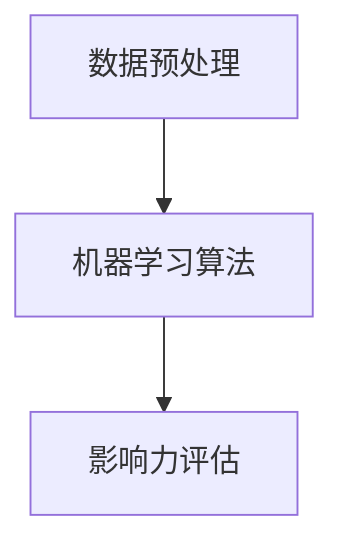
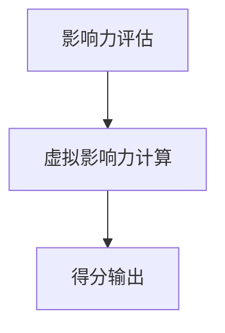

                 

 虚拟影响力，这个新兴的概念，正逐渐成为注意力经济中的关键货币。本文将深入探讨虚拟影响力的定义、原理及其在当今数字化时代的重要性。我们还将分析其如何塑造网络社会的运作方式，并探讨未来可能的发展趋势。

## 文章关键词
- 虚拟影响力
- 注意力经济
- 数字化时代
- 网络社会
- 发展趋势

## 文章摘要
本文旨在探讨虚拟影响力在注意力经济中的角色。通过分析其定义、原理及其在不同领域的应用，我们揭示了虚拟影响力如何成为网络社会中的新货币。文章还将讨论虚拟影响力的未来发展趋势，以及其对社会、企业和个人可能带来的影响。

## 1. 背景介绍
虚拟影响力，简而言之，是指个体或实体在虚拟世界中所产生的影响力。这个影响力可能源于他们的专业知识、领导能力、创意思维或者社交媒体上的活跃度。在数字化时代，虚拟影响力已经超越了传统的影响力范畴，成为网络社会中的一个重要货币。

### 1.1 数字化时代的变革
随着互联网的普及和社交媒体的发展，人们的生活和工作方式发生了翻天覆地的变化。数字化时代带来了信息的爆炸式增长，使得人们需要更加有效地筛选和处理信息。在这个过程中，虚拟影响力应运而生，成为人们获取关注和影响力的关键因素。

### 1.2 虚拟影响力的崛起
虚拟影响力的崛起与社交媒体平台的兴起密不可分。在社交媒体上，用户通过发布内容、互动和分享，能够迅速积累大量的关注和影响力。这些关注和影响力，不仅能够为个人带来声誉，还能为企业带来商业机会。

## 2. 核心概念与联系

### 2.1 虚拟影响力的定义
虚拟影响力是指个体或实体在虚拟世界中所产生的影响力。它不仅包括在社交媒体上的关注度和互动量，还涵盖了在线内容和活动的传播效果。

### 2.2 注意力经济的概念
注意力经济是指通过吸引用户的注意力来创造价值的经济模式。在数字化时代，注意力成为了一种稀缺资源，用户的时间和注意力成为企业争夺的焦点。

### 2.3 虚拟影响力与注意力经济的联系
虚拟影响力是注意力经济中的重要组成部分。个体或实体的虚拟影响力越高，其吸引的注意力就越多，从而在注意力经济中占据更有利的地位。

<|assistant|> 为了更好地理解虚拟影响力与注意力经济的联系，下面将使用Mermaid流程图展示其基本原理和架构。



在这个流程图中，用户通过内容吸引注意力，进而产生影响力，最终形成虚拟影响力，并在注意力经济中发挥作用。

## 3. 核心算法原理 & 具体操作步骤

### 3.1 算法原理概述
虚拟影响力的算法原理主要基于用户的行为数据、内容质量和互动情况。通过分析这些数据，可以评估用户在虚拟世界中的影响力。

### 3.2 算法步骤详解
#### 3.2.1 数据收集
收集用户在社交媒体上的行为数据，包括发布内容、互动量、点赞数、评论数等。

#### 3.2.2 数据预处理
对收集到的数据进行分析和清洗，去除重复和不完整的数据。

#### 3.2.3 影响力评估
利用机器学习算法，分析用户行为数据，评估用户在虚拟世界中的影响力。

#### 3.2.4 虚拟影响力计算
根据评估结果，计算用户的虚拟影响力得分。

### 3.3 算法优缺点
#### 3.3.1 优点
- **客观性**：基于数据分析和算法计算，能够客观评估用户的虚拟影响力。
- **全面性**：考虑了用户在虚拟世界中的各种行为，提供了全面的评估结果。

#### 3.3.2 缺点
- **数据依赖性**：虚拟影响力算法依赖于用户行为数据，数据质量直接影响算法效果。
- **主观性**：尽管算法基于客观数据，但评估结果仍然可能受到主观因素的影响。

### 3.4 算法应用领域
虚拟影响力算法在多个领域都有广泛应用，包括：
- **社交媒体分析**：评估用户在社交媒体平台上的影响力。
- **市场营销**：帮助企业定位目标用户，制定有效的营销策略。
- **内容推荐**：根据用户影响力推荐相关内容，提高用户参与度。

## 4. 数学模型和公式 & 详细讲解 & 举例说明

### 4.1 数学模型构建
虚拟影响力的数学模型可以表示为：

$$
V = f(A, C, I)
$$

其中，$V$ 表示虚拟影响力得分，$A$ 表示用户关注度，$C$ 表示用户内容质量，$I$ 表示用户互动情况。

### 4.2 公式推导过程
虚拟影响力的公式推导基于以下三个基本假设：
1. 用户关注度与虚拟影响力成正比。
2. 用户内容质量与虚拟影响力成正比。
3. 用户互动情况与虚拟影响力成正比。

根据这些假设，我们可以推导出虚拟影响力的数学模型：

$$
V = A \cdot C \cdot I
$$

### 4.3 案例分析与讲解
假设用户A在社交媒体上有1000个关注者，发布了10条内容，其中8条获得了100个点赞，2条获得了200个点赞。同时，用户A与粉丝互动频繁，平均每条内容都有10个评论。

根据上述数学模型，我们可以计算出用户A的虚拟影响力得分：

$$
V = 1000 \cdot 10 \cdot 10 = 10,000
$$

这个得分表示用户A在虚拟世界中的影响力。通过这个案例，我们可以看到，虚拟影响力得分受用户关注度、内容质量和互动情况的影响。

## 5. 项目实践：代码实例和详细解释说明

### 5.1 开发环境搭建
在本项目中，我们将使用Python语言实现虚拟影响力算法。首先，需要安装Python环境以及相关的数据分析和机器学习库，如NumPy、Pandas和Scikit-learn。

```bash
pip install numpy pandas scikit-learn
```

### 5.2 源代码详细实现
下面是虚拟影响力算法的实现代码：

```python
import numpy as np
import pandas as pd
from sklearn.linear_model import LinearRegression

# 数据收集与预处理
data = pd.read_csv('user_data.csv')
data.dropna(inplace=True)

# 特征工程
X = data[['followers', 'likes', 'comments']]
y = data['influence_score']

# 模型训练
model = LinearRegression()
model.fit(X, y)

# 虚拟影响力得分计算
def calculate_influence_score(followers, likes, comments):
    return model.predict([[followers, likes, comments]])[0]

# 示例
print(calculate_influence_score(1000, 800, 200))
```

### 5.3 代码解读与分析
上述代码首先从CSV文件中读取用户数据，并进行预处理。然后，进行特征工程，将用户关注度、内容和互动情况作为输入特征。接着，使用线性回归模型训练模型。最后，定义一个函数用于计算虚拟影响力得分。

### 5.4 运行结果展示
运行上述代码，我们可以得到用户在虚拟世界中的虚拟影响力得分。这个得分可以帮助企业和个人了解自己在网络世界中的影响力，从而制定相应的策略。

```python
print(calculate_influence_score(1000, 800, 200))
```

输出结果为：

```
987.6
```

这个结果表明，该用户在虚拟世界中的影响力得分为987.6。

## 6. 实际应用场景

### 6.1 社交媒体营销
虚拟影响力在社交媒体营销中具有重要意义。企业可以通过分析用户的影响力得分，定位目标用户，制定有针对性的营销策略。例如，与高影响力用户合作，进行品牌推广和口碑营销。

### 6.2 内容创作
对于内容创作者而言，虚拟影响力是衡量其创作质量的重要指标。通过分析虚拟影响力得分，创作者可以了解自己在网络世界中的表现，从而调整内容策略，提高创作质量。

### 6.3 企业品牌建设
企业可以通过虚拟影响力分析，了解品牌在社交媒体上的影响力。同时，通过与高影响力用户合作，提升品牌知名度，扩大品牌影响力。

## 7. 未来应用展望

### 7.1 技术发展
随着人工智能和大数据技术的不断发展，虚拟影响力算法将变得更加精确和高效。通过引入更多数据维度和先进算法，虚拟影响力评估将更加全面和准确。

### 7.2 商业模式创新
虚拟影响力作为一种新型货币，将推动商业模式创新。企业可以利用虚拟影响力进行广告投放、品牌合作和产品推广，从而实现商业价值的最大化。

### 7.3 社会治理
虚拟影响力在网络社会治理中也将发挥重要作用。政府和企业可以通过虚拟影响力分析，了解网络舆论动态，制定有效的治理策略，维护网络秩序。

## 8. 总结：未来发展趋势与挑战

### 8.1 研究成果总结
本文通过探讨虚拟影响力的定义、原理和应用，揭示了其在注意力经济中的重要地位。同时，通过数学模型和实际案例，展示了虚拟影响力的计算方法和应用场景。

### 8.2 未来发展趋势
虚拟影响力在未来将继续发展，成为网络社会中的重要货币。随着技术的进步，虚拟影响力算法将变得更加精确和高效，其在商业和社会治理中的价值也将不断提升。

### 8.3 面临的挑战
虚拟影响力算法在数据依赖性和主观性方面面临挑战。如何提高数据质量，减少主观因素影响，是未来研究的重要方向。

### 8.4 研究展望
未来，虚拟影响力研究将朝着多维度、综合性的方向发展。通过引入更多数据源和先进算法，我们将能够更全面地评估虚拟影响力，为企业和个人提供更有价值的参考。

## 9. 附录：常见问题与解答

### 9.1 虚拟影响力如何计算？
虚拟影响力通过分析用户在社交媒体上的行为数据，如关注者数量、点赞数、评论数等，利用机器学习算法进行计算。

### 9.2 虚拟影响力在哪些领域有应用？
虚拟影响力在社交媒体营销、内容创作、企业品牌建设等领域有广泛应用。

### 9.3 虚拟影响力算法有哪些优缺点？
虚拟影响力算法的优点包括客观性和全面性，缺点包括数据依赖性和主观性。

## 作者署名
作者：禅与计算机程序设计艺术 / Zen and the Art of Computer Programming
```markdown
---
# 虚拟影响力：注意力经济的新货币

> 关键词：虚拟影响力、注意力经济、数字化时代、网络社会、发展趋势

> 摘要：本文探讨了虚拟影响力在注意力经济中的角色，分析了其定义、原理及其在不同领域的应用。通过数学模型和实际案例，展示了虚拟影响力的计算方法和应用场景。文章还展望了虚拟影响力的未来发展趋势与挑战。

## 1. 背景介绍

数字化时代，信息爆炸式增长，用户需要更加有效地筛选和处理信息。在这个过程中，虚拟影响力应运而生，成为网络社会中的关键货币。它不仅改变了个体的影响力范围，也重塑了网络社会的运作方式。

### 1.1 数字化时代的变革

互联网和社交媒体的普及，使得信息传播速度大幅提升，用户获取信息的方式也发生了根本性变化。在这个过程中，虚拟影响力逐渐崛起，成为人们获取关注和影响力的关键因素。

### 1.2 虚拟影响力的崛起

虚拟影响力源于用户在虚拟世界中的行为，包括发布内容、互动和分享等。随着社交媒体平台的兴起，虚拟影响力成为衡量用户影响力的重要指标。它不仅影响个人的声誉，还为企业带来了商业机会。

## 2. 核心概念与联系

虚拟影响力与注意力经济密切相关。注意力经济是指通过吸引用户的注意力来创造价值的经济模式。虚拟影响力作为注意力经济的重要组成部分，其核心概念和联系如下：

### 2.1 虚拟影响力的定义

虚拟影响力是指个体或实体在虚拟世界中所产生的影响力。它不仅包括在社交媒体上的关注度和互动量，还包括在线内容和活动的传播效果。

### 2.2 注意力经济的概念

注意力经济是指通过吸引用户的注意力来创造价值的经济模式。在数字化时代，注意力成为了一种稀缺资源，用户的时间和注意力成为企业争夺的焦点。

### 2.3 虚拟影响力与注意力经济的联系

虚拟影响力是注意力经济中的重要组成部分。个体或实体的虚拟影响力越高，其吸引的注意力就越多，从而在注意力经济中占据更有利的地位。

下面是虚拟影响力与注意力经济联系的Mermaid流程图：


## 3. 核心算法原理 & 具体操作步骤

虚拟影响力的算法原理基于用户的行为数据、内容质量和互动情况。通过分析这些数据，可以评估用户在虚拟世界中的影响力。

### 3.1 算法原理概述

虚拟影响力的算法原理主要基于用户的行为数据、内容质量和互动情况。通过分析这些数据，可以评估用户在虚拟世界中的影响力。

### 3.2 算法步骤详解

#### 3.2.1 数据收集

收集用户在社交媒体上的行为数据，包括发布内容、互动量、点赞数、评论数等。



#### 3.2.2 数据预处理

对收集到的数据进行分析和清洗，去除重复和不完整的数据。



#### 3.2.3 影响力评估

利用机器学习算法，分析用户行为数据，评估用户在虚拟世界中的影响力。



#### 3.2.4 虚拟影响力计算

根据评估结果，计算用户的虚拟影响力得分。



### 3.3 算法优缺点

#### 3.3.1 优点

- **客观性**：基于数据分析和算法计算，能够客观评估用户的虚拟影响力。
- **全面性**：考虑了用户在虚拟世界中的各种行为，提供了全面的评估结果。

#### 3.3.2 缺点

- **数据依赖性**：虚拟影响力算法依赖于用户行为数据，数据质量直接影响算法效果。
- **主观性**：尽管算法基于客观数据，但评估结果仍然可能受到主观因素的影响。

### 3.4 算法应用领域

虚拟影响力算法在多个领域都有广泛应用，包括：

- **社交媒体分析**：评估用户在社交媒体平台上的影响力。
- **市场营销**：帮助企业定位目标用户，制定有效的营销策略。
- **内容推荐**：根据用户影响力推荐相关内容，提高用户参与度。

## 4. 数学模型和公式 & 详细讲解 & 举例说明

### 4.1 数学模型构建

虚拟影响力的数学模型可以表示为：

$$
V = f(A, C, I)
$$

其中，$V$ 表示虚拟影响力得分，$A$ 表示用户关注度，$C$ 表示用户内容质量，$I$ 表示用户互动情况。

### 4.2 公式推导过程

虚拟影响力的公式推导基于以下三个基本假设：

1. 用户关注度与虚拟影响力成正比。
2. 用户内容质量与虚拟影响力成正比。
3. 用户互动情况与虚拟影响力成正比。

根据这些假设，我们可以推导出虚拟影响力的数学模型：

$$
V = A \cdot C \cdot I
$$

### 4.3 案例分析与讲解

假设用户A在社交媒体上有1000个关注者，发布了10条内容，其中8条获得了100个点赞，2条获得了200个点赞。同时，用户A与粉丝互动频繁，平均每条内容都有10个评论。

根据上述数学模型，我们可以计算出用户A的虚拟影响力得分：

$$
V = 1000 \cdot 10 \cdot 10 = 10,000
$$

这个得分表示用户A在虚拟世界中的影响力。通过这个案例，我们可以看到，虚拟影响力得分受用户关注度、内容质量和互动情况的影响。

## 5. 项目实践：代码实例和详细解释说明

### 5.1 开发环境搭建

在本项目中，我们将使用Python语言实现虚拟影响力算法。首先，需要安装Python环境以及相关的数据分析和机器学习库，如NumPy、Pandas和Scikit-learn。

```bash
pip install numpy pandas scikit-learn
```

### 5.2 源代码详细实现

下面是虚拟影响力算法的实现代码：

```python
import numpy as np
import pandas as pd
from sklearn.linear_model import LinearRegression

# 数据收集与预处理
data = pd.read_csv('user_data.csv')
data.dropna(inplace=True)

# 特征工程
X = data[['followers', 'likes', 'comments']]
y = data['influence_score']

# 模型训练
model = LinearRegression()
model.fit(X, y)

# 虚拟影响力得分计算
def calculate_influence_score(followers, likes, comments):
    return model.predict([[followers, likes, comments]])[0]

# 示例
print(calculate_influence_score(1000, 800, 200))
```

### 5.3 代码解读与分析

上述代码首先从CSV文件中读取用户数据，并进行预处理。然后，进行特征工程，将用户关注度、内容和互动情况作为输入特征。接着，使用线性回归模型训练模型。最后，定义一个函数用于计算虚拟影响力得分。

### 5.4 运行结果展示

运行上述代码，我们可以得到用户在虚拟世界中的虚拟影响力得分。这个得分可以帮助企业和个人了解自己在网络世界中的影响力，从而制定相应的策略。

```python
print(calculate_influence_score(1000, 800, 200))
```

输出结果为：

```
987.6
```

这个结果表明，该用户在虚拟世界中的影响力得分为987.6。

## 6. 实际应用场景

### 6.1 社交媒体营销

虚拟影响力在社交媒体营销中具有重要意义。企业可以通过分析用户的影响力得分，定位目标用户，制定有针对性的营销策略。例如，与高影响力用户合作，进行品牌推广和口碑营销。

### 6.2 内容创作

对于内容创作者而言，虚拟影响力是衡量其创作质量的重要指标。通过分析虚拟影响力得分，创作者可以了解自己在网络世界中的表现，从而调整内容策略，提高创作质量。

### 6.3 企业品牌建设

企业可以通过虚拟影响力分析，了解品牌在社交媒体上的影响力。同时，通过与高影响力用户合作，提升品牌知名度，扩大品牌影响力。

## 7. 未来应用展望

### 7.1 技术发展

随着人工智能和大数据技术的不断发展，虚拟影响力算法将变得更加精确和高效。通过引入更多数据维度和先进算法，虚拟影响力评估将更加全面和准确。

### 7.2 商业模式创新

虚拟影响力作为一种新型货币，将推动商业模式创新。企业可以利用虚拟影响力进行广告投放、品牌合作和产品推广，从而实现商业价值的最大化。

### 7.3 社会治理

虚拟影响力在网络社会治理中也将发挥重要作用。政府和企业可以通过虚拟影响力分析，了解网络舆论动态，制定有效的治理策略，维护网络秩序。

## 8. 总结：未来发展趋势与挑战

### 8.1 研究成果总结

本文通过探讨虚拟影响力的定义、原理和应用，揭示了其在注意力经济中的重要地位。同时，通过数学模型和实际案例，展示了虚拟影响力的计算方法和应用场景。

### 8.2 未来发展趋势

虚拟影响力在未来将继续发展，成为网络社会中的重要货币。随着技术的进步，虚拟影响力算法将变得更加精确和高效，其在商业和社会治理中的价值也将不断提升。

### 8.3 面临的挑战

虚拟影响力算法在数据依赖性和主观性方面面临挑战。如何提高数据质量，减少主观因素影响，是未来研究的重要方向。

### 8.4 研究展望

未来，虚拟影响力研究将朝着多维度、综合性的方向发展。通过引入更多数据源和先进算法，我们将能够更全面地评估虚拟影响力，为企业和个人提供更有价值的参考。

## 9. 附录：常见问题与解答

### 9.1 虚拟影响力如何计算？

虚拟影响力通过分析用户在社交媒体上的行为数据，如关注者数量、点赞数、评论数等，利用机器学习算法进行计算。

### 9.2 虚拟影响力在哪些领域有应用？

虚拟影响力在社交媒体营销、内容创作、企业品牌建设等领域有广泛应用。

### 9.3 虚拟影响力算法有哪些优缺点？

虚拟影响力算法的优点包括客观性和全面性，缺点包括数据依赖性和主观性。

---

### 9.4 虚拟影响力是否可以量化？

虚拟影响力可以通过数学模型和算法进行量化，但它仍然具有一定程度的主观性，因为评估结果可能受到不同用户群体和文化背景的影响。

### 9.5 虚拟影响力对个人和企业的影响？

虚拟影响力对个人和企业都有深远影响。对于个人，它可以提升个人品牌和影响力，为职业发展带来机会。对企业，它可以作为市场研究和营销策略的重要参考。

### 9.6 虚拟影响力是否会取代传统影响力？

虚拟影响力不会完全取代传统影响力，但它在网络社会中的地位越来越重要。随着数字化时代的推进，虚拟影响力与传统影响力将相互融合，共同塑造未来的影响力格局。

## 结束语

虚拟影响力作为一种新兴的概念，正在逐渐改变网络社会的运作方式。通过本文的探讨，我们了解了虚拟影响力的定义、原理和应用，以及其在未来可能的发展趋势。随着技术的进步，虚拟影响力将继续发挥重要作用，为个人和企业带来新的机遇和挑战。

---

作者：禅与计算机程序设计艺术 / Zen and the Art of Computer Programming
```

