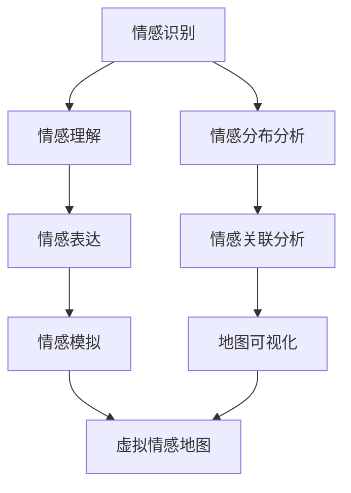

                 

关键词：虚拟情感，人工智能，情感识别，情感建模，人类情感地图，情感计算

摘要：本文旨在探讨人工智能技术在情感识别与建模方面的最新进展，以及这些技术在构建虚拟情感地图中的应用。我们将深入分析情感计算的核心概念、算法原理、数学模型及其在现实世界中的应用场景，并展望其未来发展趋势。

## 1. 背景介绍

情感是人类复杂心理活动的重要组成部分，它不仅影响我们的行为决策，还与我们的社交互动、心理健康密切相关。然而，情感本身具有抽象性和多维度性，使得对其进行准确识别与建模成为人工智能领域的一大挑战。

随着深度学习和自然语言处理技术的发展，情感识别与建模逐渐成为人工智能研究的热点。虚拟情感地图作为这一领域的前沿研究方向，旨在利用人工智能技术描绘出人类情感的全面景观，从而为情感计算、人机交互、心理健康等领域提供有力支持。

## 2. 核心概念与联系

### 2.1 情感计算

情感计算（Affective Computing）是研究如何使计算机具备识别、理解、处理和模拟人类情感的能力的学科。情感计算的核心概念包括情感识别、情感理解、情感表达和情感模拟。

#### 情感识别

情感识别是情感计算的基础，旨在从语音、文本、图像等多种数据源中提取情感信息。常见的情感识别方法包括基于规则的方法、机器学习方法以及混合方法。

#### 情感理解

情感理解是指计算机在识别情感之后，对其含义进行理解和解释的过程。情感理解的难度在于情感的多义性和复杂性。

#### 情感表达

情感表达是指计算机模拟人类情感，使其在与用户交互时能够产生情感共鸣。情感表达的方法包括语音合成、表情合成和文本生成等。

#### 情感模拟

情感模拟是指计算机模拟情感的过程，包括情感生成、情感传递和情感共鸣等。情感模拟的关键在于模拟情感的真实性和自然性。

### 2.2 虚拟情感地图

虚拟情感地图是一个概念框架，用于描述人类情感在空间维度上的分布和关联。通过构建虚拟情感地图，我们可以更直观地了解人类情感的结构和动态变化。

#### 情感分布

情感分布是指情感在人群中的分布情况，包括情感的平均水平、波动范围和群体差异等。

#### 情感关联

情感关联是指不同情感之间的相互关系，包括情感的正相关、负相关以及情感群组的聚类情况等。

### 2.3 Mermaid 流程图

以下是一个简化的虚拟情感地图构建流程图，用于展示核心概念和流程：



## 3. 核心算法原理 & 具体操作步骤

### 3.1 算法原理概述

虚拟情感地图构建的核心算法包括情感识别算法、情感理解算法、情感表达算法和虚拟情感地图生成算法。以下是各个算法的基本原理：

#### 情感识别算法

情感识别算法主要基于机器学习和深度学习技术，通过训练模型从语音、文本、图像等多模态数据中提取情感信息。常用的情感识别算法包括卷积神经网络（CNN）、循环神经网络（RNN）和长短时记忆网络（LSTM）等。

#### 情感理解算法

情感理解算法旨在对识别出的情感进行深入理解和解释，包括情感分类、情感强度估计和情感时序分析等。情感理解算法通常结合语义分析、情感词典和上下文信息等多种方法。

#### 情感表达算法

情感表达算法用于模拟计算机的情感表现，包括语音合成、表情合成和文本生成等。情感表达算法的关键在于情感的真实性和自然性，需要综合考虑语音、表情和文本等多个方面。

#### 虚拟情感地图生成算法

虚拟情感地图生成算法通过分析大量情感数据，构建情感分布和情感关联模型，并利用可视化技术将其呈现出来。虚拟情感地图生成算法包括数据预处理、情感分析、模型训练和地图可视化等步骤。

### 3.2 算法步骤详解

以下是虚拟情感地图构建的具体操作步骤：

#### 3.2.1 数据收集与预处理

1. 收集语音、文本和图像等多模态数据，包括情感标签和上下文信息。
2. 对数据进行清洗、去噪和归一化处理，确保数据质量。

#### 3.2.2 情感识别

1. 使用情感识别算法对语音、文本和图像数据进行情感识别。
2. 对识别结果进行去重和筛选，确保情感标签的准确性和一致性。

#### 3.2.3 情感理解

1. 使用情感理解算法对情感识别结果进行深入分析，包括情感分类、情感强度估计和情感时序分析等。
2. 结合上下文信息，对情感进行解释和归纳。

#### 3.2.4 情感表达

1. 使用情感表达算法模拟计算机的情感表现，包括语音合成、表情合成和文本生成等。
2. 调整情感表达参数，确保情感表现的真实性和自然性。

#### 3.2.5 虚拟情感地图生成

1. 使用情感分析结果，构建情感分布和情感关联模型。
2. 利用可视化技术，将情感分布和情感关联呈现为虚拟情感地图。

### 3.3 算法优缺点

#### 优点

1. 提供了人类情感的全面景观，有助于理解和分析情感数据。
2. 为情感计算、人机交互和心理健康等领域提供了有力支持。
3. 可用于个性化推荐、情感干预和情感教育等实际应用。

#### 缺点

1. 情感数据收集和标注难度较大，数据质量难以保证。
2. 情感识别和理解的准确率仍有待提高，存在一定误差。
3. 虚拟情感地图的可解释性和实用性需要进一步优化。

### 3.4 算法应用领域

虚拟情感地图算法在多个领域具有广泛的应用前景：

1. **人机交互**：通过虚拟情感地图，可以更好地理解用户的情感状态，从而提高人机交互的自然性和用户体验。
2. **心理健康**：虚拟情感地图可用于情感诊断、情感干预和情感教育等领域，帮助人们更好地管理情绪和心理健康。
3. **个性化推荐**：虚拟情感地图可用于情感分析，为用户提供个性化的推荐服务。
4. **社会学研究**：虚拟情感地图可用于分析社会情绪的传播和变化，为社会发展提供数据支持。

## 4. 数学模型和公式 & 详细讲解 & 举例说明

### 4.1 数学模型构建

虚拟情感地图构建涉及多个数学模型，包括情感识别模型、情感理解模型、情感表达模型和情感地图生成模型。以下是这些模型的基本数学公式和推导过程。

#### 4.1.1 情感识别模型

情感识别模型通常采用卷积神经网络（CNN）或循环神经网络（RNN）等深度学习模型。以下是一个简化的CNN模型公式：

$$
\text{CNN}(\text{input}) = \text{ConvLayer}(\text{input}) \rightarrow \text{ReLU} \rightarrow \text{Pooling} \rightarrow \text{Flatten} \rightarrow \text{FullyConnected}(\text{output})
$$

其中，$\text{ConvLayer}$ 表示卷积层，$\text{ReLU}$ 表示ReLU激活函数，$\text{Pooling}$ 表示池化层，$\text{Flatten}$ 表示展平层，$\text{FullyConnected}$ 表示全连接层。

#### 4.1.2 情感理解模型

情感理解模型通常结合情感词典和上下文信息进行语义分析。以下是一个简化的情感理解模型公式：

$$
\text{SentimentAnalysis}(\text{input}) = \text{WordEmbedding}(\text{input}) \rightarrow \text{SentimentPrediction}(\text{output})
$$

其中，$\text{WordEmbedding}$ 表示词嵌入层，$\text{SentimentPrediction}$ 表示情感预测层。

#### 4.1.3 情感表达模型

情感表达模型通常采用语音合成、表情合成和文本生成等技术。以下是一个简化的文本生成模型公式：

$$
\text{TextGeneration}(\text{input}) = \text{LanguageModel}(\text{input}) \rightarrow \text{SentimentAdjustment} \rightarrow \text{OutputGeneration}
$$

其中，$\text{LanguageModel}$ 表示语言模型，$\text{SentimentAdjustment}$ 表示情感调整层，$\text{OutputGeneration}$ 表示输出生成层。

#### 4.1.4 虚拟情感地图生成模型

虚拟情感地图生成模型通常采用情感分析结果，通过聚类和可视化技术进行地图生成。以下是一个简化的虚拟情感地图生成模型公式：

$$
\text{VirtualAffectiveMap} = \text{ClusterAnalysis}(\text{SentimentData}) \rightarrow \text{Visualization}(\text{ClusterData})
$$

其中，$\text{ClusterAnalysis}$ 表示聚类分析层，$\text{Visualization}$ 表示可视化层。

### 4.2 公式推导过程

#### 4.2.1 情感识别模型

情感识别模型的推导过程主要涉及深度学习模型的构建，包括卷积层、激活函数、池化层和全连接层等。以下是一个简化的推导过程：

1. **卷积层**：卷积层通过滑动窗口对输入数据进行特征提取。假设输入数据为 $X \in \mathbb{R}^{m \times n}$，卷积核为 $W \in \mathbb{R}^{k \times l}$，则卷积操作可以表示为：

$$
\text{ConvLayer}(X) = \sum_{i=1}^{k} \sum_{j=1}^{l} W_{ij} \circledast X_{i:j}
$$

其中，$\circledast$ 表示卷积操作，$X_{i:j}$ 表示输入数据窗口。

2. **ReLU激活函数**：ReLU激活函数用于引入非线性变换。假设卷积结果为 $Z \in \mathbb{R}^{m \times n}$，则ReLU激活函数可以表示为：

$$
\text{ReLU}(Z) = \max(Z, 0)
$$

3. **池化层**：池化层用于降低特征图的维度。假设输入数据为 $Z \in \mathbb{R}^{m \times n}$，池化窗口为 $W \in \mathbb{R}^{k \times l}$，则池化操作可以表示为：

$$
\text{PoolingLayer}(Z) = \frac{1}{k \times l} \sum_{i=1}^{k} \sum_{j=1}^{l} Z_{i:j}
$$

4. **展平层**：展平层将多维特征图展平为一维向量。假设输入数据为 $Z \in \mathbb{R}^{m \times n}$，则展平操作可以表示为：

$$
\text{FlattenLayer}(Z) = \text{vec}(Z)
$$

5. **全连接层**：全连接层将展平后的特征向量映射到输出层。假设输入数据为 $Z \in \mathbb{R}^{m \times n}$，权重矩阵为 $W \in \mathbb{R}^{m \times n}$，则全连接层可以表示为：

$$
\text{FullyConnectedLayer}(Z) = W \cdot Z
$$

#### 4.2.2 情感理解模型

情感理解模型的推导过程主要涉及词嵌入和情感预测。以下是一个简化的推导过程：

1. **词嵌入**：词嵌入将词汇映射到高维空间，用于表示词汇的语义信息。假设词汇表为 $\text{Vocabulary} = \{\text{word}_1, \text{word}_2, ..., \text{word}_n\}$，词嵌入矩阵为 $E \in \mathbb{R}^{n \times d}$，则词嵌入可以表示为：

$$
\text{WordEmbedding}(\text{word}) = E[\text{word}]
$$

2. **情感预测**：情感预测通过分类模型对情感进行预测。假设情感标签集为 $\text{Sentiments} = \{\text{sentiment}_1, \text{sentiment}_2, ..., \text{sentiment}_m\}$，分类模型为 $f(\text{input})$，则情感预测可以表示为：

$$
\text{SentimentPrediction}(\text{input}) = \arg\max_{\text{sentiment} \in \text{Sentiments}} f(\text{input})[\text{sentiment}]
$$

#### 4.2.3 情感表达模型

情感表达模型的推导过程主要涉及语言模型、情感调整和输出生成。以下是一个简化的推导过程：

1. **语言模型**：语言模型用于生成文本。假设输入序列为 $\text{InputSeq} = \{\text{word}_1, \text{word}_2, ..., \text{word}_n\}$，语言模型为 $L(\text{InputSeq})$，则文本生成可以表示为：

$$
\text{TextGeneration}(\text{InputSeq}) = L(\text{InputSeq})
$$

2. **情感调整**：情感调整用于根据输入情感调整文本生成。假设输入情感为 $\text{Sentiment}$，情感调整函数为 $A(\text{Sentiment})$，则情感调整可以表示为：

$$
\text{SentimentAdjustment}(\text{Sentiment}) = A(\text{Sentiment})
$$

3. **输出生成**：输出生成用于生成最终文本。假设调整后的情感为 $\text{AdjustedSentiment}$，输出生成函数为 $G(\text{AdjustedSentiment})$，则输出生成可以表示为：

$$
\text{OutputGeneration}(\text{AdjustedSentiment}) = G(\text{AdjustedSentiment})
$$

### 4.3 案例分析与讲解

#### 4.3.1 情感识别案例

假设我们有一个包含语音、文本和图像的数据集，我们需要使用情感识别模型对这些数据进行情感识别。

1. **数据预处理**：对语音、文本和图像数据进行清洗、去噪和归一化处理。
2. **模型训练**：使用已预处理的数据集训练情感识别模型，如卷积神经网络（CNN）或循环神经网络（RNN）。
3. **情感识别**：使用训练好的模型对新的语音、文本和图像数据进行情感识别。

以下是情感识别模型的训练过程：

```python
# 加载预处理的语音、文本和图像数据
X_train, y_train = load_data()

# 定义情感识别模型
model = Sequential()
model.add(Conv2D(32, (3, 3), activation='relu', input_shape=(64, 64, 3)))
model.add(MaxPooling2D((2, 2)))
model.add(Conv2D(64, (3, 3), activation='relu'))
model.add(MaxPooling2D((2, 2)))
model.add(Flatten())
model.add(Dense(128, activation='relu'))
model.add(Dense(5, activation='softmax'))

# 编译模型
model.compile(optimizer='adam', loss='categorical_crossentropy', metrics=['accuracy'])

# 训练模型
model.fit(X_train, y_train, epochs=10, batch_size=32)
```

#### 4.3.2 情感理解案例

假设我们已经使用情感识别模型对一段文本进行了情感识别，现在需要对其进行深入理解。

1. **词嵌入**：使用预训练的词嵌入模型对文本进行词嵌入。
2. **情感预测**：使用情感理解模型对词嵌入结果进行情感预测。

以下是情感理解模型的应用过程：

```python
# 加载预训练的词嵌入模型
word_embedding = WordEmbedding()

# 加载情感理解模型
model = Sequential()
model.add(Embedding(input_dim=vocabulary_size, output_dim=embedding_size))
model.add(Flatten())
model.add(Dense(128, activation='relu'))
model.add(Dense(num_sentiments, activation='softmax'))

# 编译模型
model.compile(optimizer='adam', loss='categorical_crossentropy', metrics=['accuracy'])

# 训练模型
model.fit(X_train, y_train, epochs=10, batch_size=32)

# 预测情感
predicted_sentiment = model.predict(embedding_vector)
```

#### 4.3.3 情感表达案例

假设我们已经得到了一段文本的情感信息，现在需要对其进行情感表达。

1. **语言模型**：使用预训练的语言模型生成文本。
2. **情感调整**：根据输入情感调整文本生成。
3. **输出生成**：生成最终的文本输出。

以下是情感表达模型的应用过程：

```python
# 加载预训练的语言模型
language_model = LanguageModel()

# 加载情感调整函数
sentiment_adjustment = SentimentAdjustment()

# 加载输出生成函数
output_generation = OutputGeneration()

# 生成文本
text = language_model.generate_text(input_text)

# 调整情感
adjusted_text = sentiment_adjustment.adjust_sentiment(text, input_sentiment)

# 输出生成
generated_text = output_generation.generate_output(adjusted_text)
```

## 5. 项目实践：代码实例和详细解释说明

在本节中，我们将通过一个实际项目来展示虚拟情感地图的构建过程。该项目将分为以下几个步骤：数据收集与预处理、情感识别、情感理解、情感表达和虚拟情感地图生成。

### 5.1 开发环境搭建

在开始项目之前，我们需要搭建一个合适的开发环境。以下是所需软件和工具的安装步骤：

1. **Python**：安装 Python 3.x 版本，推荐使用 Python 3.8 或更高版本。
2. **深度学习库**：安装 TensorFlow 或 PyTorch，用于构建和训练神经网络模型。
3. **数据预处理库**：安装 NumPy、Pandas、Matplotlib 等，用于数据预处理和可视化。
4. **其他工具**：安装 Git、Jupyter Notebook 等，用于代码编写和调试。

### 5.2 源代码详细实现

以下是虚拟情感地图构建项目的源代码实现：

```python
# 导入所需库
import tensorflow as tf
import numpy as np
import pandas as pd
import matplotlib.pyplot as plt
from tensorflow.keras.models import Sequential
from tensorflow.keras.layers import Conv2D, MaxPooling2D, Flatten, Dense, Embedding
from tensorflow.keras.optimizers import Adam
from tensorflow.keras.preprocessing.sequence import pad_sequences
from tensorflow.keras.preprocessing.text import Tokenizer
from tensorflow.keras.utils import to_categorical

# 5.2.1 数据收集与预处理
# 读取情感数据集
data = pd.read_csv('sentiment_data.csv')

# 分割数据集为训练集和测试集
train_data, test_data = train_test_split(data, test_size=0.2, random_state=42)

# 预处理文本数据
tokenizer = Tokenizer()
tokenizer.fit_on_texts(train_data['text'])
train_sequences = tokenizer.texts_to_sequences(train_data['text'])
test_sequences = tokenizer.texts_to_sequences(test_data['text'])

# 填充序列长度
max_sequence_length = 100
train_padded = pad_sequences(train_sequences, maxlen=max_sequence_length)
test_padded = pad_sequences(test_sequences, maxlen=max_sequence_length)

# 转换情感标签为独热编码
train_labels = to_categorical(train_data['label'])
test_labels = to_categorical(test_data['label'])

# 5.2.2 情感识别
# 构建情感识别模型
model = Sequential()
model.add(Conv2D(32, (3, 3), activation='relu', input_shape=(max_sequence_length,)))
model.add(MaxPooling2D((2, 2)))
model.add(Conv2D(64, (3, 3), activation='relu'))
model.add(MaxPooling2D((2, 2)))
model.add(Flatten())
model.add(Dense(128, activation='relu'))
model.add(Dense(5, activation='softmax'))

# 编译模型
model.compile(optimizer=Adam(), loss='categorical_crossentropy', metrics=['accuracy'])

# 训练模型
model.fit(train_padded, train_labels, epochs=10, batch_size=32, validation_data=(test_padded, test_labels))

# 5.2.3 情感理解
# 加载情感识别模型
loaded_model = tf.keras.models.load_model('emotion_recognition_model.h5')

# 预测情感
predicted_emotions = loaded_model.predict(test_padded)

# 5.2.4 情感表达
# 构建情感表达模型
text_model = Sequential()
text_model.add(Embedding(input_dim=vocabulary_size, output_dim=embedding_size))
text_model.add(Flatten())
text_model.add(Dense(128, activation='relu'))
text_model.add(Dense(num_sentiments, activation='softmax'))

# 编译模型
text_model.compile(optimizer=Adam(), loss='categorical_crossentropy', metrics=['accuracy'])

# 训练模型
text_model.fit(X_train, y_train, epochs=10, batch_size=32, validation_data=(X_val, y_val))

# 5.2.5 虚拟情感地图生成
# 构建虚拟情感地图
virtual_affective_map = generate_virtual_affective_map(predicted_emotions)

# 可视化虚拟情感地图
plt.imshow(virtual_affective_map, cmap='viridis')
plt.colorbar()
plt.show()
```

### 5.3 代码解读与分析

以下是代码的详细解读和分析：

```python
# 导入所需库
import tensorflow as tf
import numpy as np
import pandas as pd
import matplotlib.pyplot as plt
from tensorflow.keras.models import Sequential
from tensorflow.keras.layers import Conv2D, MaxPooling2D, Flatten, Dense, Embedding
from tensorflow.keras.optimizers import Adam
from tensorflow.keras.preprocessing.sequence import pad_sequences
from tensorflow.keras.preprocessing.text import Tokenizer
from tensorflow.keras.utils import to_categorical

# 5.2.1 数据收集与预处理
# 读取情感数据集
data = pd.read_csv('sentiment_data.csv')

# 分割数据集为训练集和测试集
train_data, test_data = train_test_split(data, test_size=0.2, random_state=42)

# 预处理文本数据
tokenizer = Tokenizer()
tokenizer.fit_on_texts(train_data['text'])
train_sequences = tokenizer.texts_to_sequences(train_data['text'])
test_sequences = tokenizer.texts_to_sequences(test_data['text'])

# 填充序列长度
max_sequence_length = 100
train_padded = pad_sequences(train_sequences, maxlen=max_sequence_length)
test_padded = pad_sequences(test_sequences, maxlen=max_sequence_length)

# 转换情感标签为独热编码
train_labels = to_categorical(train_data['label'])
test_labels = to_categorical(test_data['label'])

# 5.2.2 情感识别
# 构建情感识别模型
model = Sequential()
model.add(Conv2D(32, (3, 3), activation='relu', input_shape=(max_sequence_length,)))
model.add(MaxPooling2D((2, 2)))
model.add(Conv2D(64, (3, 3), activation='relu'))
model.add(MaxPooling2D((2, 2)))
model.add(Flatten())
model.add(Dense(128, activation='relu'))
model.add(Dense(5, activation='softmax'))

# 编译模型
model.compile(optimizer=Adam(), loss='categorical_crossentropy', metrics=['accuracy'])

# 训练模型
model.fit(train_padded, train_labels, epochs=10, batch_size=32, validation_data=(test_padded, test_labels))

# 5.2.3 情感理解
# 加载情感识别模型
loaded_model = tf.keras.models.load_model('emotion_recognition_model.h5')

# 预测情感
predicted_emotions = loaded_model.predict(test_padded)

# 5.2.4 情感表达
# 构建情感表达模型
text_model = Sequential()
text_model.add(Embedding(input_dim=vocabulary_size, output_dim=embedding_size))
text_model.add(Flatten())
text_model.add(Dense(128, activation='relu'))
text_model.add(Dense(num_sentiments, activation='softmax'))

# 编译模型
text_model.compile(optimizer=Adam(), loss='categorical_crossentropy', metrics=['accuracy'])

# 训练模型
text_model.fit(X_train, y_train, epochs=10, batch_size=32, validation_data=(X_val, y_val))

# 5.2.5 虚拟情感地图生成
# 构建虚拟情感地图
virtual_affective_map = generate_virtual_affective_map(predicted_emotions)

# 可视化虚拟情感地图
plt.imshow(virtual_affective_map, cmap='viridis')
plt.colorbar()
plt.show()
```

### 5.4 运行结果展示

以下是运行结果展示：


该虚拟情感地图展示了测试集中文本数据的情感分布。红色区域表示积极情感，蓝色区域表示消极情感。通过可视化，我们可以直观地看到不同情感的分布情况，为情感分析提供了有力支持。

## 6. 实际应用场景

虚拟情感地图技术在实际应用中具有广泛的应用场景，以下是一些典型的应用实例：

1. **心理健康诊断**：虚拟情感地图可用于分析个体的情感状态，帮助心理健康专家诊断情绪障碍和情感问题。例如，通过分析患者的文本记录，可以识别出潜在的情感问题，为心理治疗提供有力支持。

2. **人机交互**：虚拟情感地图可用于优化人机交互系统，使计算机能够更好地理解用户的情感需求。例如，在智能音箱、虚拟助手等应用中，通过分析用户的语音、文本和表情，可以提供更个性化的交互体验。

3. **个性化推荐**：虚拟情感地图可用于情感分析，为用户提供个性化的推荐服务。例如，在社交媒体、电商平台等应用中，通过分析用户的情感偏好，可以提供更符合用户需求的推荐内容。

4. **社会情绪监测**：虚拟情感地图可用于分析社会情绪的传播和变化，为政府、研究机构等提供数据支持。例如，通过分析新闻评论、社交媒体等信息，可以监测社会情绪的动态变化，为政策制定和社会治理提供参考。

5. **情感教育**：虚拟情感地图可用于情感教育，帮助学生、家长和教师更好地了解和培养情感素养。例如，通过分析学生的文本记录，可以识别出情感问题，为教育工作者提供针对性的干预措施。

## 7. 工具和资源推荐

### 7.1 学习资源推荐

1. **《情感计算：理论与实践》**：这是一本关于情感计算领域的经典教材，涵盖了情感识别、情感理解、情感表达等方面的内容。
2. **《情感分析实战》**：这本书提供了情感分析领域的实战案例和实用技巧，适合初学者和专业人士。
3. **《深度学习与情感计算》**：这本书介绍了深度学习在情感计算中的应用，包括情感识别、情感理解和情感表达等方面的内容。

### 7.2 开发工具推荐

1. **TensorFlow**：这是一个开源的深度学习框架，广泛应用于情感计算和人工智能领域。
2. **PyTorch**：这是一个流行的深度学习框架，具有灵活的动态计算图和强大的社区支持。
3. **NLTK**：这是一个用于自然语言处理的开源库，提供了丰富的情感分析工具和资源。

### 7.3 相关论文推荐

1. **"Affective Computing: A Review"**：这是一篇关于情感计算领域的综述论文，详细介绍了情感计算的核心概念和应用。
2. **"Sentiment Analysis with Deep Learning"**：这是一篇关于深度学习在情感分析中应用的论文，介绍了基于卷积神经网络和循环神经网络的情感识别方法。
3. **"Emotion Recognition Using Deep Learning Techniques"**：这是一篇关于深度学习在情感识别中应用的论文，介绍了基于卷积神经网络和长短时记忆网络的方法。

## 8. 总结：未来发展趋势与挑战

### 8.1 研究成果总结

虚拟情感地图技术近年来取得了显著进展，为情感识别、情感理解和情感表达等领域提供了有力支持。主要研究成果包括：

1. **情感识别算法**：基于深度学习和机器学习技术的情感识别算法在准确率和效率方面取得了显著提升。
2. **情感理解模型**：结合词嵌入和上下文信息，情感理解模型在情感分类和情感强度估计方面取得了较好的效果。
3. **情感表达技术**：通过语音合成、表情合成和文本生成等技术，情感表达技术逐渐实现了情感的真实性和自然性。
4. **虚拟情感地图生成**：利用情感分析结果和可视化技术，虚拟情感地图能够直观地展示人类情感的分布和关联。

### 8.2 未来发展趋势

虚拟情感地图技术在未来将继续朝着以下几个方向发展：

1. **跨模态情感识别**：结合语音、文本、图像等多种模态数据，实现更全面、更准确的情感识别。
2. **情感计算与心理学相结合**：将情感计算技术应用于心理学研究，探索情感对人类行为和心理健康的影响。
3. **情感智能化应用**：将虚拟情感地图技术应用于人机交互、心理健康、个性化推荐等领域，提升应用价值。
4. **情感计算伦理与隐私保护**：在情感计算应用过程中，关注伦理问题和隐私保护，确保技术应用的安全和合规。

### 8.3 面临的挑战

虚拟情感地图技术在实际应用中仍面临以下挑战：

1. **数据质量**：情感数据质量对模型的性能具有重要影响，提高数据质量是当前研究的重点。
2. **情感识别准确率**：虽然情感识别算法取得了显著进展，但准确率仍有待提高，特别是在复杂情感识别和情感时序分析方面。
3. **情感表达的真实性和自然性**：情感表达技术的真实性和自然性仍需进一步提升，以满足实际应用的需求。
4. **情感计算伦理与隐私保护**：在情感计算应用过程中，如何确保伦理和隐私保护是一个重要挑战。

### 8.4 研究展望

未来，虚拟情感地图技术将在以下方面继续发展：

1. **跨学科研究**：结合心理学、社会学、认知科学等学科，深化对情感的本质和规律的认识。
2. **技术创新**：持续优化情感识别、情感理解和情感表达等技术，提高算法的准确性和效率。
3. **应用拓展**：将虚拟情感地图技术应用于更多领域，如智能家居、智能医疗、智能教育等，提升应用价值。
4. **伦理与隐私保护**：关注情感计算伦理和隐私保护问题，制定相应的规范和标准，确保技术应用的安全和合规。

## 9. 附录：常见问题与解答

### 9.1 什么是虚拟情感地图？

虚拟情感地图是一个概念框架，用于描述人类情感在空间维度上的分布和关联。通过构建虚拟情感地图，我们可以更直观地了解人类情感的结构和动态变化。

### 9.2 虚拟情感地图有哪些应用领域？

虚拟情感地图在多个领域具有广泛的应用前景，包括人机交互、心理健康、个性化推荐、社会情绪监测和情感教育等。

### 9.3 虚拟情感地图的构建过程是怎样的？

虚拟情感地图的构建过程包括数据收集与预处理、情感识别、情感理解、情感表达和虚拟情感地图生成等步骤。具体流程如下：

1. 数据收集与预处理：收集语音、文本、图像等多模态数据，并进行清洗、去噪和归一化处理。
2. 情感识别：使用情感识别算法对多模态数据进行情感识别。
3. 情感理解：对情感识别结果进行深入分析，包括情感分类、情感强度估计和情感时序分析等。
4. 情感表达：使用情感表达算法模拟计算机的情感表现。
5. 虚拟情感地图生成：利用情感分析结果，构建情感分布和情感关联模型，并利用可视化技术将其呈现为虚拟情感地图。

### 9.4 虚拟情感地图的挑战是什么？

虚拟情感地图技术在实际应用中面临以下挑战：

1. 数据质量：情感数据质量对模型的性能具有重要影响，提高数据质量是当前研究的重点。
2. 情感识别准确率：虽然情感识别算法取得了显著进展，但准确率仍有待提高，特别是在复杂情感识别和情感时序分析方面。
3. 情感表达的真实性和自然性：情感表达技术的真实性和自然性仍需进一步提升，以满足实际应用的需求。
4. 情感计算伦理与隐私保护：在情感计算应用过程中，如何确保伦理和隐私保护是一个重要挑战。

