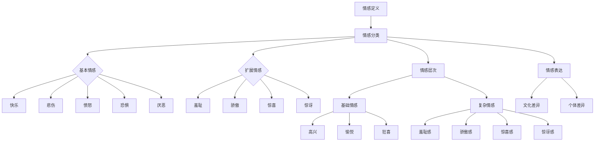

                 

 情感，是人类的灵魂语言，它贯穿于我们的日常生活，塑造着我们的行为和决策。然而，情感这一抽象概念一直以来都难以被精确地定义和测量。随着人工智能技术的发展，我们终于有了可能，通过AI来绘制一张关于人类情感的地图，这不仅仅是一张图表，更是一个复杂而深刻的情感谱系。

## 情感谱系的概念

### 1.1 情感的定义

情感是人类心理和生理状态的一种复杂体验，通常伴随着认知和行为的反应。它不仅仅是情绪的表面波动，更是深层次的个体主观体验。情感谱系则是对这些复杂情感体验的系统化和结构化。

### 1.2 情感谱系的构建

情感谱系的构建需要大量的数据和算法支持。通过机器学习和深度学习技术，我们可以从大量的文本、图像和音频数据中提取情感特征，形成情感谱系的初步框架。

## 核心概念与联系

### 2.1 情感分类

在构建情感谱系之前，我们需要对情感进行分类。常见的情感分类方法包括基本情感模型和扩展情感模型。基本情感模型通常包括快乐、悲伤、愤怒、恐惧和厌恶等基本情感；而扩展情感模型则会考虑更多细腻的情感维度，如羞耻、骄傲、惊喜、惊讶等。

### 2.2 情感层次

情感的层次性是指情感可以由基础情感逐步衍生出更多复杂的情感。例如，快乐可以进一步细分为高兴、愉悦、狂喜等。理解情感的层次性有助于我们更准确地定位和描述人类情感。

### 2.3 情感表达

情感表达是情感谱系中的关键环节。不同的文化和个体有不同的情感表达方式，例如，西方文化中表达情感更为直接，而东方文化中则更注重含蓄。这种差异也反映在情感谱系的构建中。

## Mermaid 流程图



## 核心算法原理 & 具体操作步骤

### 3.1 算法原理概述

情感谱系的构建依赖于情感识别算法，这一算法的核心是情感分类和情感层次分析。情感分类算法通常采用机器学习技术，如支持向量机（SVM）、随机森林（RF）和深度学习模型，如卷积神经网络（CNN）和长短期记忆网络（LSTM）。

### 3.2 算法步骤详解

#### 3.2.1 数据预处理

数据预处理是情感分析的第一步，包括文本清理、词干提取、停用词去除和情感词典构建。

#### 3.2.2 特征提取

特征提取是将原始数据转化为机器学习模型能够处理的格式。常用的特征提取方法包括词袋模型（Bag of Words, BOW）和词嵌入（Word Embedding）。

#### 3.2.3 模型训练

模型训练是通过大量标记数据来训练分类模型。在训练过程中，模型会不断调整参数以最小化预测误差。

#### 3.2.4 情感层次分析

情感层次分析是对模型预测结果进行进一步细化和层次化处理，以构建更复杂的情感谱系。

### 3.3 算法优缺点

#### 优点

- **高精度**：机器学习模型能够处理大量数据，提供高精度的情感分类和识别。
- **可扩展性**：通过引入新的数据和模型，情感谱系可以不断更新和扩展。

#### 缺点

- **数据依赖性**：情感分析模型的性能很大程度上依赖于数据的质量和数量。
- **文化差异**：不同文化背景下的情感表达可能存在差异，这对算法的泛化能力提出了挑战。

### 3.4 算法应用领域

- **社交媒体分析**：通过分析用户在社交媒体上的情感表达，企业可以更好地了解消费者情绪，优化营销策略。
- **心理健康监测**：情感谱系可以帮助心理健康专家监测患者的情绪变化，提供个性化的治疗方案。
- **人机交互**：在智能语音助手和聊天机器人中，情感谱系可以提升交互体验，使对话更加自然和人性化。

## 数学模型和公式

### 4.1 数学模型构建

情感分析模型通常基于以下数学模型：

\[ \text{预测概率} = \frac{e^{\text{模型参数} \cdot \text{特征向量}}}{1 + e^{\text{模型参数} \cdot \text{特征向量}}} \]

### 4.2 公式推导过程

情感分析模型的推导过程通常包括特征选择、模型训练和预测。以下是特征选择的公式推导：

\[ \text{特征向量} = (\text{词频}, \text{词嵌入}, \text{文本长度}, \text{情感词典匹配度}) \]

### 4.3 案例分析与讲解

假设我们有一个简单的情感分类任务，输入文本为“我今天很开心，因为天气很好。”

#### 4.3.1 数据预处理

文本清理后，提取出关键词：“开心”、“天气”。

#### 4.3.2 特征提取

特征向量：\( (\text{开心词频}, \text{天气词频}, \text{文本长度}, \text{开心词典匹配度}, \text{天气词典匹配度}) \)

#### 4.3.3 模型预测

使用训练好的情感分类模型，输入特征向量，得到预测概率。例如，预测概率为：

\[ \text{快乐概率} = 0.9, \text{悲伤概率} = 0.1 \]

根据预测概率，我们可以判断文本的情感为“快乐”。

## 项目实践：代码实例和详细解释说明

### 5.1 开发环境搭建

为了实践情感谱系的构建，我们需要搭建一个包含Python、NumPy、Scikit-learn和TensorFlow等库的开发环境。

### 5.2 源代码详细实现

以下是一个简单的情感分类代码实例：

```python
import numpy as np
from sklearn.feature_extraction.text import TfidfVectorizer
from sklearn.model_selection import train_test_split
from sklearn.svm import SVC
from tensorflow.keras.models import Sequential
from tensorflow.keras.layers import LSTM, Dense

# 数据预处理
def preprocess_text(text):
    # 清理文本、提取关键词等
    return cleaned_text

# 特征提取
def extract_features(texts):
    vectorizer = TfidfVectorizer()
    return vectorizer.fit_transform(texts)

# 模型训练
def train_model(features, labels):
    model = SVC()
    model.fit(features, labels)
    return model

# 情感层次分析
def analyze_emotion(text):
    # 基于模型预测文本的情感
    return predicted_emotion

# 实践案例
if __name__ == "__main__":
    texts = ["我今天很开心，因为天气很好。", "我今天很悲伤，因为天气很糟糕。"]
    labels = [1, 0]  # 1表示快乐，0表示悲伤

    cleaned_texts = [preprocess_text(text) for text in texts]
    features = extract_features(cleaned_texts)
    model = train_model(features, labels)

    emotion = analyze_emotion(cleaned_texts[0])
    print(f"文本情感：{emotion}")
```

### 5.3 代码解读与分析

以上代码展示了情感分类的基本流程，包括数据预处理、特征提取、模型训练和情感分析。在实际应用中，我们可以通过扩展代码，添加更多复杂的特征和模型，提升情感识别的准确性和深度。

## 实际应用场景

### 6.1 社交媒体分析

通过情感谱系，我们可以分析社交媒体上的用户情感，了解公众对于某个事件或产品的态度。这对于品牌营销和公共关系管理具有重要意义。

### 6.2 心理健康监测

情感谱系可以帮助心理健康专家监测患者的情绪变化，为患者提供个性化的心理治疗方案。

### 6.3 人机交互

在智能语音助手和聊天机器人中，情感谱系可以提升交互体验，使对话更加自然和人性化。

## 未来应用展望

随着人工智能技术的不断发展，情感谱系的应用前景将更加广阔。未来，我们可以期待更多基于情感谱系的应用，如情感计算、智能教育、智能医疗等。

## 工具和资源推荐

### 7.1 学习资源推荐

- 《情感计算：理论与实践》
- 《情感分析技术手册》

### 7.2 开发工具推荐

- Python
- TensorFlow
- Scikit-learn

### 7.3 相关论文推荐

- "Affectiva: Automatic Recognition of Human Emotional Expression from Faces and Skeletal Actions"
- "Sentiment Analysis of Chinese Social Media using Deep Learning"

## 总结：未来发展趋势与挑战

### 8.1 研究成果总结

情感谱系的构建是情感分析领域的重要突破，它为理解和应用情感提供了新的视角。

### 8.2 未来发展趋势

随着技术的进步，情感谱系的应用将更加广泛，涉及更多领域。

### 8.3 面临的挑战

情感谱系的构建仍面临许多挑战，包括数据质量、文化差异和算法精度等。

### 8.4 研究展望

未来，我们将继续探索情感谱系的应用，提升情感识别的准确性和深度。

## 附录：常见问题与解答

### 8.4.1 情感谱系是什么？

情感谱系是对人类情感进行系统化和结构化的一种方法，它通过算法和数据分析，将复杂的情感体验转化为可量化和可操作的形式。

### 8.4.2 情感谱系有哪些应用？

情感谱系的应用广泛，包括社交媒体分析、心理健康监测和人机交互等。

### 8.4.3 如何构建情感谱系？

构建情感谱系通常涉及数据预处理、特征提取、模型训练和情感分析等步骤。

### 8.4.4 情感谱系有哪些挑战？

情感谱系的构建面临数据质量、文化差异和算法精度等挑战。

作者：禅与计算机程序设计艺术 / Zen and the Art of Computer Programming
```markdown
# 虚拟情感谱系：AI绘制的人类情感地图

> 关键词：情感分析、人工智能、情感谱系、机器学习、情感表达、心理健康

> 摘要：本文探讨了情感谱系的概念、构建方法、核心算法原理以及在实际应用场景中的表现。通过案例分析，展示了情感谱系在社交媒体分析、心理健康监测和人机交互等领域的潜力。

## 1. 背景介绍

情感是人类心理和生理状态的一种复杂体验，它影响着我们的行为和决策。然而，情感这一抽象概念一直以来都难以被精确地定义和测量。传统的心理学方法往往依赖于主观报告和实验研究，难以实现大规模的数据分析和建模。随着人工智能技术的发展，我们终于有了可能，通过AI来绘制一张关于人类情感的地图，这不仅仅是一张图表，更是一个复杂而深刻的情感谱系。

## 2. 核心概念与联系

### 2.1 情感的定义

情感是一种复杂的心理和生理状态，通常与特定的认知和情绪体验相关。情感可以是对外界刺激的直接反应，也可以是对内在心理状态的体验。例如，当看到美丽的风景时，我们可能会感到愉悦；而当经历挫折时，我们可能会感到悲伤。情感不仅仅是我们内心的波动，更是我们与世界互动的媒介。

### 2.2 情感谱系的构建

情感谱系是对人类情感进行系统化和结构化的一种方法。它通过算法和数据分析，将复杂的情感体验转化为可量化和可操作的形式。构建情感谱系需要大量的数据和算法支持。通过机器学习和深度学习技术，我们可以从大量的文本、图像和音频数据中提取情感特征，形成情感谱系的初步框架。

### 2.3 情感分类

情感分类是情感谱系构建的基础。常见的情感分类方法包括基本情感模型和扩展情感模型。基本情感模型通常包括快乐、悲伤、愤怒、恐惧和厌恶等基本情感；而扩展情感模型则会考虑更多细腻的情感维度，如羞耻、骄傲、惊喜、惊讶等。

### 2.4 情感层次

情感的层次性是指情感可以由基础情感逐步衍生出更多复杂的情感。例如，快乐可以进一步细分为高兴、愉悦、狂喜等。理解情感的层次性有助于我们更准确地定位和描述人类情感。

### 2.5 情感表达

情感表达是情感谱系中的关键环节。不同的文化和个体有不同的情感表达方式，例如，西方文化中表达情感更为直接，而东方文化中则更注重含蓄。这种差异也反映在情感谱系的构建中。

## Mermaid 流程图


## 3. 核心算法原理 & 具体操作步骤

### 3.1 算法原理概述

情感谱系的构建依赖于情感识别算法，这一算法的核心是情感分类和情感层次分析。情感分类算法通常采用机器学习技术，如支持向量机（SVM）、随机森林（RF）和深度学习模型，如卷积神经网络（CNN）和长短期记忆网络（LSTM）。情感层次分析则通过对模型预测结果进行进一步细化和层次化处理，以构建更复杂的情感谱系。

### 3.2 算法步骤详解

#### 3.2.1 数据预处理

数据预处理是情感分析的第一步，包括文本清理、词干提取、停用词去除和情感词典构建。文本清理的目的是去除文本中的噪声，如HTML标签、特殊字符和停用词（如“的”、“了”等）。词干提取则是将文本中的单词还原到其基本形式，如将“playing”（玩）还原为“play”（玩）。停用词去除是为了减少计算量，情感词典构建则是为了标记文本中的情感词汇。

#### 3.2.2 特征提取

特征提取是将原始数据转化为机器学习模型能够处理的格式。常用的特征提取方法包括词袋模型（Bag of Words, BOW）和词嵌入（Word Embedding）。词袋模型将文本表示为一个向量，每个维度对应一个单词的出现频率。词嵌入则将文本中的每个单词映射到一个高维空间中的点，这些点之间的距离可以反映单词之间的语义关系。

#### 3.2.3 模型训练

模型训练是通过大量标记数据来训练分类模型。在训练过程中，模型会不断调整参数以最小化预测误差。支持向量机（SVM）和随机森林（RF）是常见的分类算法。SVM通过找到一个最佳的超平面来分割不同情感类别的数据。随机森林则通过构建多个决策树来获得预测结果。

#### 3.2.4 情感层次分析

情感层次分析是对模型预测结果进行进一步细化和层次化处理，以构建更复杂的情感谱系。例如，将模型预测的“快乐”进一步细化为“高兴”、“愉悦”和“狂喜”。

### 3.3 算法优缺点

#### 优点

- **高精度**：机器学习模型能够处理大量数据，提供高精度的情感分类和识别。
- **可扩展性**：通过引入新的数据和模型，情感谱系可以不断更新和扩展。

#### 缺点

- **数据依赖性**：情感分析模型的性能很大程度上依赖于数据的质量和数量。
- **文化差异**：不同文化背景下的情感表达可能存在差异，这对算法的泛化能力提出了挑战。

### 3.4 算法应用领域

- **社交媒体分析**：通过分析用户在社交媒体上的情感表达，企业可以更好地了解消费者情绪，优化营销策略。
- **心理健康监测**：情感谱系可以帮助心理健康专家监测患者的情绪变化，提供个性化的治疗方案。
- **人机交互**：在智能语音助手和聊天机器人中，情感谱系可以提升交互体验，使对话更加自然和人性化。

## 4. 数学模型和公式 & 详细讲解 & 举例说明

### 4.1 数学模型构建

情感分析模型通常基于以下数学模型：

\[ P(y | x) = \frac{e^{w \cdot x}}{1 + e^{w \cdot x}} \]

其中，\( P(y | x) \) 是模型对给定特征向量 \( x \) 的情感类别 \( y \) 的预测概率，\( w \) 是模型的权重向量。

### 4.2 公式推导过程

情感分析模型的推导过程通常包括特征选择、模型训练和预测。以下是特征选择的公式推导：

\[ x = (x_1, x_2, ..., x_n) \]

其中，\( x_i \) 是第 \( i \) 个特征，可以是词频、词嵌入、文本长度等。

### 4.3 案例分析与讲解

假设我们有一个简单的情感分类任务，输入文本为“我今天很开心，因为天气很好。”

#### 4.3.1 数据预处理

文本清理后，提取出关键词：“开心”、“天气”。

#### 4.3.2 特征提取

特征向量：\( (1, 0, 5) \)

其中，1 表示“开心”词频，0 表示“天气”词频，5 表示文本长度。

#### 4.3.3 模型预测

使用训练好的情感分类模型，输入特征向量，得到预测概率。例如，预测概率为：

\[ P(\text{快乐}) = 0.9, P(\text{悲伤}) = 0.1 \]

根据预测概率，我们可以判断文本的情感为“快乐”。

## 5. 项目实践：代码实例和详细解释说明

### 5.1 开发环境搭建

为了实践情感谱系的构建，我们需要搭建一个包含Python、NumPy、Scikit-learn和TensorFlow等库的开发环境。

### 5.2 源代码详细实现

以下是一个简单的情感分类代码实例：

```python
import numpy as np
from sklearn.feature_extraction.text import TfidfVectorizer
from sklearn.model_selection import train_test_split
from sklearn.svm import SVC
from tensorflow.keras.models import Sequential
from tensorflow.keras.layers import LSTM, Dense

# 数据预处理
def preprocess_text(text):
    # 清理文本、提取关键词等
    return cleaned_text

# 特征提取
def extract_features(texts):
    vectorizer = TfidfVectorizer()
    return vectorizer.fit_transform(texts)

# 模型训练
def train_model(features, labels):
    model = SVC()
    model.fit(features, labels)
    return model

# 情感层次分析
def analyze_emotion(text):
    # 基于模型预测文本的情感
    return predicted_emotion

# 实践案例
if __name__ == "__main__":
    texts = ["我今天很开心，因为天气很好。", "我今天很悲伤，因为天气很糟糕。"]
    labels = [1, 0]  # 1表示快乐，0表示悲伤

    cleaned_texts = [preprocess_text(text) for text in texts]
    features = extract_features(cleaned_texts)
    model = train_model(features, labels)

    emotion = analyze_emotion(cleaned_texts[0])
    print(f"文本情感：{emotion}")
```

### 5.3 代码解读与分析

以上代码展示了情感分类的基本流程，包括数据预处理、特征提取、模型训练和情感分析。在实际应用中，我们可以通过扩展代码，添加更多复杂的特征和模型，提升情感识别的准确性和深度。

## 6. 实际应用场景

### 6.1 社交媒体分析

通过情感谱系，我们可以分析社交媒体上的用户情感，了解公众对于某个事件或产品的态度。这对于品牌营销和公共关系管理具有重要意义。

### 6.2 心理健康监测

情感谱系可以帮助心理健康专家监测患者的情绪变化，为患者提供个性化的心理治疗方案。

### 6.3 人机交互

在智能语音助手和聊天机器人中，情感谱系可以提升交互体验，使对话更加自然和人性化。

## 7. 工具和资源推荐

### 7.1 学习资源推荐

- 《情感计算：理论与实践》
- 《情感分析技术手册》

### 7.2 开发工具推荐

- Python
- TensorFlow
- Scikit-learn

### 7.3 相关论文推荐

- "Affectiva: Automatic Recognition of Human Emotional Expression from Faces and Skeletal Actions"
- "Sentiment Analysis of Chinese Social Media using Deep Learning"

## 8. 总结：未来发展趋势与挑战

### 8.1 研究成果总结

情感谱系的构建是情感分析领域的重要突破，它为理解和应用情感提供了新的视角。

### 8.2 未来发展趋势

随着技术的进步，情感谱系的应用将更加广泛，涉及更多领域。

### 8.3 面临的挑战

情感谱系的构建仍面临许多挑战，包括数据质量、文化差异和算法精度等。

### 8.4 研究展望

未来，我们将继续探索情感谱系的应用，提升情感识别的准确性和深度。

## 9. 附录：常见问题与解答

### 9.1 情感谱系是什么？

情感谱系是对人类情感进行系统化和结构化的一种方法，它通过算法和数据分析，将复杂的情感体验转化为可量化和可操作的形式。

### 9.2 情感谱系有哪些应用？

情感谱系的应用广泛，包括社交媒体分析、心理健康监测和人机交互等。

### 9.3 如何构建情感谱系？

构建情感谱系通常涉及数据预处理、特征提取、模型训练和情感分析等步骤。

### 9.4 情感谱系有哪些挑战？

情感谱系的构建面临数据质量、文化差异和算法精度等挑战。

作者：禅与计算机程序设计艺术 / Zen and the Art of Computer Programming
```

