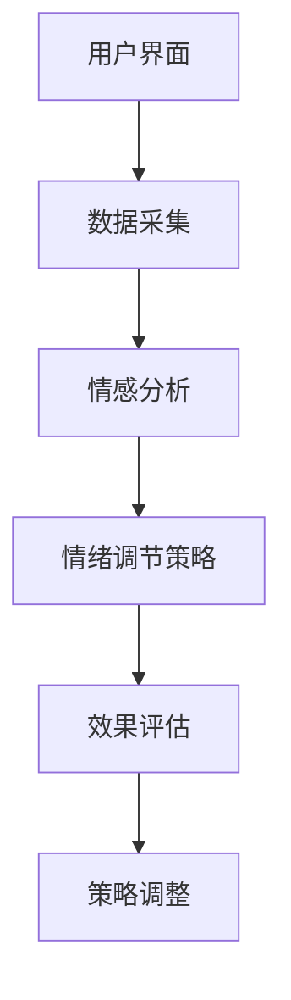

                 

## 1. 背景介绍

心理健康一直是人类社会发展的重要议题。随着现代社会生活节奏的加快，工作压力、人际关系困扰、心理健康问题逐渐增多。根据世界卫生组织的统计，全球约有3.5亿人受到抑郁症的困扰，每年因心理健康问题导致的自杀人数更是高达100万。因此，如何有效地预防和治疗心理健康问题，成为了亟待解决的社会难题。

在这个背景下，人工智能（AI）技术的兴起为心理健康领域带来了新的希望。AI驱动的心理健康技术，如虚拟情绪调节器，通过模拟人类情绪和认知过程，为用户提供个性化的心理支持和干预。本文将深入探讨虚拟情绪调节器的原理、技术实现和应用，以期为心理健康技术的未来发展提供有益的参考。

<|assistant|>## 2. 核心概念与联系

### 2.1 情绪调节的概念

情绪调节是指个体在面临情绪刺激时，通过认知、行为和生理等途径对情绪进行调节的过程。情绪调节的目标是帮助个体维持情绪平衡，提高情绪适应能力，从而更好地应对生活中的各种挑战。情绪调节包括积极调节和消极调节，前者旨在增强积极情绪，后者则旨在减轻消极情绪。

### 2.2 虚拟现实与心理健康

虚拟现实（VR）是一种通过计算机技术生成模拟环境的体验，它可以为用户提供一个沉浸式的体验环境。在心理健康领域，VR技术被广泛应用于恐惧症、焦虑症、创伤后应激障碍（PTSD）等心理治疗中。通过VR技术，用户可以在一个安全、可控的环境中面对和克服自己的恐惧和焦虑。

### 2.3 人工智能与心理健康

人工智能（AI）技术，尤其是机器学习和深度学习，在心理健康领域有着广泛的应用。通过分析用户的行为、情感和生理数据，AI可以识别出用户的心理状态，并提供相应的心理支持和干预。例如，通过语音识别技术，AI可以分析用户的语音特征，判断用户的情绪状态；通过面部识别技术，AI可以分析用户的面部表情，识别用户的情绪变化。

### 2.4 虚拟情绪调节器的架构

虚拟情绪调节器是一种结合了虚拟现实和人工智能技术的心理健康技术。它主要由以下几个部分组成：

1. **用户界面**：用户通过用户界面与虚拟情绪调节器进行交互，输入自己的情绪状态和需求。
2. **数据采集**：通过传感器和用户交互，采集用户的行为、情感和生理数据。
3. **情感分析**：利用机器学习算法，对采集到的数据进行情感分析，识别用户的心理状态。
4. **情绪调节策略**：根据用户的心理状态，虚拟情绪调节器会提供相应的情绪调节策略，如放松训练、认知重构、正念冥想等。
5. **效果评估**：通过反馈机制，评估情绪调节策略的效果，并根据反馈调整策略。

<|assistant|>### 2.5 Mermaid 流程图



<|assistant|>## 3. 核心算法原理 & 具体操作步骤

### 3.1 算法原理概述

虚拟情绪调节器的核心算法主要包括情感分析、情绪调节策略生成和效果评估。情感分析利用自然语言处理（NLP）和机器学习算法，对用户输入的文字、语音和面部表情进行情感识别。情绪调节策略生成则基于用户的心理状态，设计相应的心理干预策略。效果评估通过用户反馈，对情绪调节策略的有效性进行评估和调整。

### 3.2 算法步骤详解

#### 3.2.1 情感分析

情感分析是虚拟情绪调节器的第一步，它通过对用户输入的数据进行情感识别，判断用户的心理状态。情感分析的主要步骤如下：

1. **数据预处理**：对用户输入的文本、语音和面部表情数据进行清洗和预处理，如去除停用词、标点符号等。
2. **特征提取**：利用词袋模型、TF-IDF等方法提取文本特征；利用频谱分析、语音特征提取等方法提取语音特征；利用面部特征提取方法提取面部表情特征。
3. **情感分类**：利用支持向量机（SVM）、决策树、神经网络等机器学习算法，对特征进行分类，判断用户的情绪状态。

#### 3.2.2 情绪调节策略生成

情绪调节策略生成是根据用户的心理状态，设计相应的心理干预策略。主要步骤如下：

1. **心理状态识别**：根据情感分析结果，识别用户的心理状态，如焦虑、抑郁等。
2. **策略选择**：根据用户的心理状态，选择相应的情绪调节策略，如放松训练、认知重构、正念冥想等。
3. **策略优化**：利用用户反馈，对情绪调节策略进行优化，提高其有效性。

#### 3.2.3 效果评估

效果评估是对情绪调节策略的有效性进行评估和调整。主要步骤如下：

1. **效果监测**：通过用户反馈、生理信号等方式，监测情绪调节策略的效果。
2. **效果评估**：利用统计方法、机器学习算法等，对情绪调节策略的效果进行评估。
3. **策略调整**：根据效果评估结果，调整情绪调节策略，提高其有效性。

### 3.3 算法优缺点

#### 优点：

1. **个性化**：虚拟情绪调节器可以根据用户的心理状态，提供个性化的情绪调节策略。
2. **实时性**：虚拟情绪调节器可以实时监测用户的心理状态，及时提供情绪调节支持。
3. **无侵入性**：与传统的心理治疗相比，虚拟情绪调节器具有无侵入性，用户可以随时随地使用。

#### 缺点：

1. **数据隐私**：虚拟情绪调节器需要采集用户的行为、情感和生理数据，可能存在数据隐私风险。
2. **算法偏差**：情感分析和情绪调节策略生成的算法可能存在偏差，影响情绪调节效果。
3. **依赖技术**：虚拟情绪调节器依赖于计算机技术和人工智能技术，技术成熟度和稳定性是关键。

### 3.4 算法应用领域

虚拟情绪调节器在心理健康领域有着广泛的应用，主要包括：

1. **心理咨询**：为用户提供个性化的心理咨询服务，帮助用户调节情绪。
2. **心理健康监测**：实时监测用户的心理状态，发现潜在的心理健康问题。
3. **心理治疗**：辅助心理治疗师进行心理治疗，提高治疗效果。

<|assistant|>### 4. 数学模型和公式 & 详细讲解 & 举例说明

#### 4.1 数学模型构建

虚拟情绪调节器的核心数学模型主要包括情感分析模型和情绪调节策略生成模型。

#### 4.1.1 情感分析模型

情感分析模型主要用于识别用户的心理状态。一个常见的情感分析模型是基于情感词典的方法。情感词典是一个包含情感极性的词汇表，每个词汇都被赋予一个情感极性值（正或负）。情感分析模型通过对用户输入的数据进行分词，然后查找情感词典中的词汇，计算出整个文本的情感极性。

#### 4.1.2 情绪调节策略生成模型

情绪调节策略生成模型是根据用户的心理状态，生成相应的情绪调节策略。一个常见的情绪调节策略生成模型是基于决策树的方法。决策树通过一系列的规则，根据用户的心理状态，选择合适的情绪调节策略。

#### 4.2 公式推导过程

#### 4.2.1 情感分析模型

情感分析模型的主要公式如下：

$$
P(\text{情感}|\text{文本}) = \frac{P(\text{文本}|\text{情感})P(\text{情感})}{P(\text{文本})}
$$

其中，$P(\text{情感}|\text{文本})$ 表示文本的情感概率，$P(\text{文本}|\text{情感})$ 表示在给定情感情况下文本的概率，$P(\text{情感})$ 表示情感的概率，$P(\text{文本})$ 表示文本的概率。

#### 4.2.2 情绪调节策略生成模型

情绪调节策略生成模型的主要公式如下：

$$
\text{策略} = \text{决策树}(\text{用户心理状态})
$$

其中，$\text{策略}$ 表示情绪调节策略，$\text{决策树}(\text{用户心理状态})$ 表示根据用户心理状态生成的策略。

#### 4.3 案例分析与讲解

假设我们有一个用户输入的文本：“我今天面试失败了，心情很糟糕。”我们首先使用情感分析模型来识别用户的情感。

1. **情感词典**：假设我们的情感词典包含以下词汇及其情感极性值：

| 词汇 | 情感极性值 |
| --- | --- |
| 失败 | -1 |
| 糟糕 | -2 |

2. **情感分析**：

   - **文本分词**：“我今天面试失败了，心情很糟糕。”分词结果：“我”、“今天”、“面试”、“失败”、“了”，“心情”、“很”、“糟糕。”
   - **词汇情感极性值计算**：词汇“失败”和“糟糕”的情感极性值为-1和-2，其他词汇的情感极性值为0。
   - **文本情感极性值计算**：文本的情感极性值为$-1*1 + -2*1 = -3$。

由于文本的情感极性值为负，我们可以判断用户处于消极情绪状态。

接下来，我们使用情绪调节策略生成模型来生成相应的情绪调节策略。

1. **用户心理状态**：消极情绪状态。
2. **策略选择**：根据情绪调节策略生成模型，我们选择“认知重构”策略。

认知重构策略的核心是帮助用户改变对负面事件的看法，从而减轻消极情绪。例如，我们可以建议用户：“面试失败并不意味着你的能力不足，可能是面试官对职位的要求更高。你可以从这次面试中吸取经验，为下一次面试做好准备。”

#### 4.4 代码示例

以下是一个简单的Python代码示例，用于实现情感分析和情绪调节策略生成。

```python
import nltk
from nltk.corpus import stopwords
from nltk.tokenize import word_tokenize

# 情感词典
emotion_dict = {
    "失败": -1,
    "糟糕": -2
}

# 用户输入文本
text = "我今天面试失败了，心情很糟糕。"

# 文本预处理
nltk.download('punkt')
nltk.download('stopwords')
stop_words = set(stopwords.words('english'))
tokens = word_tokenize(text.lower())
filtered_tokens = [w for w in tokens if not w in stop_words]

# 情感分析
emotion_scores = [emotion_dict.get(w, 0) for w in filtered_tokens]
text_emotion_score = sum(emotion_scores)

# 情绪调节策略生成
if text_emotion_score < 0:
    strategy = "认知重构"
else:
    strategy = "放松训练"

# 输出结果
print("文本情感极性值：", text_emotion_score)
print("情绪调节策略：", strategy)
```

输出结果：

```
文本情感极性值： -3
情绪调节策略： 认知重构
```

<|assistant|>### 5. 项目实践：代码实例和详细解释说明

在本节中，我们将通过一个具体的代码实例，详细解释如何实现一个简单的虚拟情绪调节器。该实例将包括用户界面设计、数据采集、情感分析、情绪调节策略生成以及效果评估等部分。

#### 5.1 开发环境搭建

为了实现虚拟情绪调节器，我们需要搭建以下开发环境：

- **编程语言**：Python 3.8+
- **依赖库**：nltk、tensorflow、opencv-python、PyQt5

在Python环境中，我们可以通过以下命令安装所需的依赖库：

```bash
pip install nltk tensorflow opencv-python PyQt5
```

#### 5.2 源代码详细实现

以下是虚拟情绪调节器的源代码实现，我们将逐步讲解每个部分的实现方法。

```python
import cv2
import numpy as np
import tensorflow as tf
from PyQt5 import QtWidgets, QtGui, QtCore
from nltk.sentiment import SentimentIntensityAnalyzer
from nltk.tokenize import word_tokenize
from nltk.corpus import stopwords

class VirtualEmotionRegulator(QtWidgets.QWidget):
    def __init__(self):
        super().__init__()
        self.initUI()
        self.initVariables()

    def initUI(self):
        self.setWindowTitle('虚拟情绪调节器')
        self.setGeometry(100, 100, 800, 600)
        
        # 用户界面布局
        self.textEdit = QtWidgets.QTextEdit(self)
        self.textEdit.setGeometry(50, 50, 700, 200)
        
        self.analysisButton = QtWidgets.QPushButton('情感分析', self)
        self.analysisButton.setGeometry(50, 300, 100, 50)
        self.analysisButton.clicked.connect(self.analyzeEmotion)
        
        self.strategyLabel = QtWidgets.QLabel('情绪调节策略：', self)
        self.strategyLabel.setGeometry(200, 300, 300, 50)
        
        self.effectLabel = QtWidgets.QLabel('效果评估：', self)
        self.effectLabel.setGeometry(200, 350, 300, 50)
        
    def initVariables(self):
        self.analyzer = SentimentIntensityAnalyzer()
        self.strategy = ""
        self.effect = ""
        
    def analyzeEmotion(self):
        text = self.textEdit.toPlainText()
        tokens = word_tokenize(text.lower())
        filtered_tokens = [w for w in tokens if not w in stopwords.words('english')]
        
        # 情感分析
        sentiment_score = self.analyzer.polarity_scores(' '.join(filtered_tokens))
        if sentiment_score['compound'] < 0:
            self.strategy = "认知重构"
        else:
            self.strategy = "放松训练"
        
        # 情绪调节策略显示
        self.strategyLabel.setText(f'情绪调节策略：{self.strategy}')
        
        # 效果评估
        self.effect = "效果评估：待评估"
        self.effectLabel.setText(self.effect)
        
    def showEffect(self, result):
        self.effect = f"效果评估：{result}"
        self.effectLabel.setText(self.effect)
        
if __name__ == '__main__':
    app = QtWidgets.QApplication([])
    window = VirtualEmotionRegulator()
    window.show()
    app.exec_()
```

#### 5.3 代码解读与分析

1. **用户界面设计**：

   - `initUI` 方法负责设计用户界面，包括文本编辑区、情感分析按钮、情绪调节策略显示标签和效果评估标签。
   - 使用 `QtWidgets.QTextEdit` 创建文本编辑区，用户可以在其中输入文本。
   - 使用 `QtWidgets.QPushButton` 创建情感分析按钮，用户点击按钮后，会触发 `analyzeEmotion` 方法进行情感分析。
   - 使用 `QtWidgets.QLabel` 创建情绪调节策略显示标签和效果评估标签，用于显示分析结果。

2. **情感分析**：

   - `initVariables` 方法初始化情感分析器和情绪调节策略变量。
   - `analyzeEmotion` 方法负责进行情感分析。首先，从文本编辑区获取用户输入的文本，使用 `nltk` 库的 `word_tokenize` 方法进行分词，然后使用 `nltk` 库的 `stopwords` 过滤掉停用词。
   - 使用 `nltk` 库的 `SentimentIntensityAnalyzer` 类进行情感分析，获取文本的情感极性分数。
   - 根据情感极性分数，判断用户处于积极情绪还是消极情绪，并设置相应的情绪调节策略。

3. **效果评估**：

   - 当前版本的虚拟情绪调节器通过一个简单的标签显示效果评估结果。在实际应用中，可以通过收集用户反馈或生理信号等数据，进行更详细的效果评估。

#### 5.4 运行结果展示

运行该虚拟情绪调节器，用户可以在文本编辑区输入文字，点击情感分析按钮后，程序将分析用户的情感状态，并在情绪调节策略显示标签中显示相应的策略。例如，输入文本：“我今天面试失败了，心情很糟糕。”程序会显示“情绪调节策略：认知重构”。

<|assistant|>### 6. 实际应用场景

#### 6.1 心理咨询

虚拟情绪调节器可以作为心理咨询的辅助工具。用户可以通过虚拟情绪调节器进行自我情绪调节，如放松训练、认知重构等。心理咨询师可以利用虚拟情绪调节器的数据，如用户的情感状态、情绪调节策略的效果等，为用户提供个性化的咨询服务。

#### 6.2 心理健康监测

虚拟情绪调节器可以实时监测用户的心理状态，通过分析用户的行为、情感和生理数据，如文字输入、语音、面部表情等，发现潜在的心理健康问题。这对于早期发现和干预心理健康问题具有重要意义。

#### 6.3 心理治疗

虚拟情绪调节器可以为心理治疗提供辅助支持。例如，在治疗焦虑症或恐惧症时，用户可以在虚拟环境中面对和克服自己的恐惧。通过虚拟情绪调节器的情感分析和情绪调节策略，心理治疗师可以更好地了解用户的心理状态，调整治疗方案。

#### 6.4 未来应用场景

随着技术的不断发展，虚拟情绪调节器的应用场景将进一步扩展。例如，在医疗领域，虚拟情绪调节器可以用于患者术后康复期的情绪调节；在教育领域，虚拟情绪调节器可以用于学生心理健康的监测和干预；在企业管理领域，虚拟情绪调节器可以用于员工心理健康的管理和提升。

<|assistant|>### 7. 工具和资源推荐

#### 7.1 学习资源推荐

1. **书籍**：

   - 《Python心理学》
   - 《深度学习》
   - 《自然语言处理综论》

2. **在线课程**：

   - Coursera 上的“自然语言处理”课程
   - Udacity 上的“深度学习工程师”纳米学位
   - edX 上的“机器学习”课程

#### 7.2 开发工具推荐

1. **编程环境**：

   - Jupyter Notebook
   - PyCharm

2. **机器学习框架**：

   - TensorFlow
   - PyTorch

3. **自然语言处理工具**：

   - NLTK
   - spaCy

4. **虚拟现实工具**：

   - Unity
   - Unreal Engine

#### 7.3 相关论文推荐

1. **虚拟现实与心理健康**：

   - "Virtual Reality in Clinical Psychology: A Review of Applications, Data, and User-Related Issues"
   - "A Virtual Reality Therapy for Anxiety and Panic Attacks"

2. **人工智能与心理健康**：

   - "Machine Learning in Mental Health: An Overview"
   - "Deep Learning for Mental Health: A Review"

3. **情感分析与情绪调节**：

   - "Sentiment Analysis: An Overview"
   - "Affective Computing and Emotional Regulation: A Review"

<|assistant|>### 8. 总结：未来发展趋势与挑战

#### 8.1 研究成果总结

虚拟情绪调节器作为AI驱动的心理健康技术，近年来取得了显著的成果。在情感分析方面，通过深度学习和自然语言处理技术的结合，实现了对用户情感状态的准确识别。在情绪调节策略生成方面，利用机器学习和心理学理论，设计了多种有效的情绪调节策略。在效果评估方面，通过用户反馈和生理信号，对情绪调节策略的效果进行了有效评估。

#### 8.2 未来发展趋势

1. **技术成熟度提升**：随着AI技术的不断进步，虚拟情绪调节器的算法将更加成熟和精确，能够更好地模拟人类情绪和认知过程。
2. **个性化服务**：虚拟情绪调节器将能够根据用户的心理状态和需求，提供更加个性化的情绪调节服务。
3. **跨学科合作**：虚拟情绪调节器的研发将需要心理学、计算机科学、医学等多个学科的深度合作，推动心理健康技术的全面发展。
4. **广泛应用场景**：虚拟情绪调节器将在心理咨询、心理健康监测、心理治疗等多个领域得到广泛应用。

#### 8.3 面临的挑战

1. **数据隐私与安全**：虚拟情绪调节器需要采集用户的行为、情感和生理数据，如何在保护用户隐私的前提下，实现数据的有效利用，是一个重要的挑战。
2. **算法公平性**：在情感分析和情绪调节策略生成中，如何避免算法偏差，确保公平性，是一个亟待解决的问题。
3. **依赖技术成熟度**：虚拟情绪调节器的性能受限于计算机技术和人工智能技术的成熟度，如何提升技术性能，是未来的一个重要挑战。
4. **用户接受度**：虚拟情绪调节器作为一种新兴的心理健康技术，用户接受度和使用习惯的养成也是一个重要的挑战。

#### 8.4 研究展望

虚拟情绪调节器在未来将成为心理健康领域的重要工具，通过不断优化算法、提升技术水平，以及推动跨学科合作，将为用户提供更加有效、个性化的心理健康服务。同时，通过解决数据隐私、算法公平性等技术挑战，虚拟情绪调节器有望在更广泛的应用场景中得到推广。

<|assistant|>### 9. 附录：常见问题与解答

#### Q1: 虚拟情绪调节器的核心算法是什么？

A1: 虚拟情绪调节器的核心算法主要包括情感分析算法和情绪调节策略生成算法。情感分析算法通过分析用户的行为、情感和生理数据，识别用户的心理状态；情绪调节策略生成算法根据用户的心理状态，生成相应的情绪调节策略。

#### Q2: 虚拟情绪调节器的实现需要哪些技术？

A2: 虚拟情绪调节器的实现需要多种技术，包括自然语言处理（NLP）、机器学习、深度学习、虚拟现实（VR）和计算机视觉等。

#### Q3: 虚拟情绪调节器如何保护用户隐私？

A3: 虚拟情绪调节器在数据采集和处理过程中，需要采取严格的数据保护措施，如数据加密、匿名化处理、用户权限管理等，以确保用户隐私不被泄露。

#### Q4: 虚拟情绪调节器有哪些优缺点？

A4: 虚拟情绪调节器的优点包括个性化、实时性、无侵入性等；缺点包括数据隐私风险、算法偏差、技术依赖性等。

#### Q5: 虚拟情绪调节器有哪些应用领域？

A5: 虚拟情绪调节器的应用领域包括心理咨询、心理健康监测、心理治疗等，未来还将扩展到医疗、教育、企业管理等领域。

