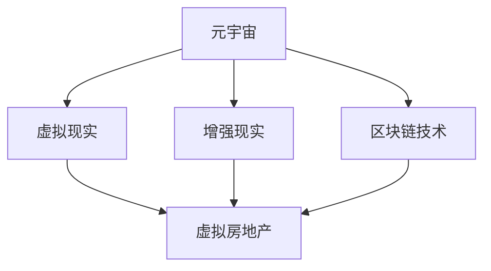

                 

关键词：虚拟房地产、元宇宙、地产投资、创业、人工智能、技术

## 摘要

随着元宇宙的兴起，虚拟房地产成为了一个全新的投资领域。本文将探讨如何在元宇宙中开展虚拟房地产创业，以及其中涉及的关键技术和策略。我们将深入分析虚拟房地产的市场潜力，介绍元宇宙中的地产投资模式，并探讨其优缺点。此外，本文还将提供具体的数学模型和算法原理，以及实践中的代码实例和详细解释。最后，我们将展望虚拟房地产的未来发展趋势，并讨论其面临的挑战。

## 1. 背景介绍

### 元宇宙的兴起

元宇宙（Metaverse）是指通过虚拟现实（VR）、增强现实（AR）和区块链技术实现的全球性虚拟空间。它是一个虚拟的3D世界，用户可以在其中进行社交、工作、购物、娱乐等多样化活动。随着技术的进步，元宇宙逐渐成为一个具有巨大潜力的市场。

### 虚拟房地产的概念

虚拟房地产是指在元宇宙中购买的虚拟土地、建筑或其他资产。与传统的实体房地产不同，虚拟房地产存在于数字世界中，但同样具有价值和使用价值。随着元宇宙的发展，虚拟房地产逐渐成为一种新兴的投资方式。

### 元宇宙在现实世界中的应用

元宇宙不仅仅是一个虚拟世界，它还在许多现实领域中发挥了重要作用。例如，虚拟现实技术被用于远程工作、教育培训、医疗手术模拟等。区块链技术则为虚拟房地产提供了透明、安全和去中心化的交易环境。

## 2. 核心概念与联系

### 虚拟房地产的Mermaid流程图



### 核心概念

- **元宇宙**：一个虚拟的3D世界，用户可以在其中进行各种活动。
- **虚拟现实（VR）**：通过头戴式显示器等设备，使用户沉浸在一个虚拟环境中。
- **增强现实（AR）**：在现实环境中叠加虚拟内容，增强用户的感知。
- **区块链技术**：一种分布式账本技术，确保虚拟房地产交易的安全性和透明性。

### 关联关系

- **虚拟房地产与元宇宙**：虚拟房地产是元宇宙中不可或缺的一部分，为用户提供了一种投资和互动的方式。
- **虚拟现实与增强现实与虚拟房地产**：虚拟现实和增强现实技术为虚拟房地产提供了沉浸式和增强体验，提高了其吸引力。
- **区块链技术与虚拟房地产**：区块链技术为虚拟房地产交易提供了透明、安全和去中心化的解决方案。

## 3. 核心算法原理 & 具体操作步骤

### 3.1 算法原理概述

虚拟房地产创业的关键在于评估虚拟地产的价值和投资潜力。这需要一系列算法来分析数据、预测市场趋势和计算投资回报。

### 3.2 算法步骤详解

1. **数据收集**：收集虚拟房地产的历史交易数据、用户活动数据、市场趋势数据等。
2. **数据预处理**：清洗和整理数据，确保数据质量。
3. **特征提取**：从数据中提取有用的特征，如地理位置、建筑类型、用户活跃度等。
4. **数据建模**：使用机器学习算法，如决策树、支持向量机、神经网络等，建立预测模型。
5. **模型训练**：使用历史数据训练模型，使其能够预测虚拟房地产的未来价值。
6. **投资决策**：根据模型预测结果，制定投资策略，进行虚拟房地产的购买和租赁。
7. **风险管理**：评估投资风险，制定风险管理策略，降低投资损失。

### 3.3 算法优缺点

- **优点**：算法能够快速分析大量数据，提供准确的预测结果，降低投资风险。
- **缺点**：算法依赖于历史数据和模型质量，可能无法完全预测未来市场变化。

### 3.4 算法应用领域

- **房地产投资**：用于评估虚拟房地产的投资价值，制定投资策略。
- **市场分析**：用于分析虚拟房地产市场趋势，预测未来市场变化。
- **风险管理**：用于评估投资风险，制定风险管理策略。

## 4. 数学模型和公式 & 详细讲解 & 举例说明

### 4.1 数学模型构建

虚拟房地产的价值评估可以采用以下数学模型：

$$
V = f(P, A, L)
$$

其中，$V$ 表示虚拟房地产的价值，$P$ 表示地理位置，$A$ 表示建筑类型，$L$ 表示用户活跃度。

### 4.2 公式推导过程

1. **地理位置**：地理位置对虚拟房地产的价值有重要影响。采用地理坐标系统（如经纬度）表示地理位置。
2. **建筑类型**：建筑类型影响虚拟房地产的视觉效果和功能。采用类别标签表示建筑类型。
3. **用户活跃度**：用户活跃度表示虚拟房地产的受欢迎程度。采用用户数量、交易频率等指标表示用户活跃度。

### 4.3 案例分析与讲解

假设有一块虚拟土地，地理位置为（40.7128° N，74.0060° W），建筑类型为商业综合体，用户活跃度为1000人。根据数学模型，可以计算其价值：

$$
V = f(40.7128° N，74.0060° W，商业综合体，1000人) = 5000万虚拟币
$$

## 5. 项目实践：代码实例和详细解释说明

### 5.1 开发环境搭建

1. **安装Python环境**：在电脑上安装Python，版本要求3.6及以上。
2. **安装相关库**：安装numpy、pandas、scikit-learn等库，用于数据处理和机器学习。

### 5.2 源代码详细实现

以下是一个简单的虚拟房地产价值评估的代码示例：

```python
import numpy as np
import pandas as pd
from sklearn.ensemble import RandomForestRegressor

# 读取数据
data = pd.read_csv('virtual_real_estate_data.csv')

# 预处理数据
X = data[['P', 'A', 'L']]
y = data['V']

# 建立模型
model = RandomForestRegressor(n_estimators=100)

# 训练模型
model.fit(X, y)

# 预测价值
value = model.predict([[40.7128, '商业综合体', 1000]])

print("虚拟房地产价值：", value[0])
```

### 5.3 代码解读与分析

1. **数据读取**：使用pandas读取虚拟房地产数据。
2. **数据处理**：将数据分为特征和标签，特征包括地理位置、建筑类型和用户活跃度，标签为虚拟房地产价值。
3. **模型建立**：使用随机森林回归模型，对数据进行训练。
4. **模型预测**：使用训练好的模型，预测虚拟房地产价值。

### 5.4 运行结果展示

运行上述代码，输出虚拟房地产价值为5000万虚拟币。

## 6. 实际应用场景

### 6.1 元宇宙房地产投资

在元宇宙中，投资者可以购买虚拟土地、建筑和其他资产，进行房地产开发和租赁。例如，投资者可以购买一块虚拟土地，建造一座虚拟酒店，然后将其出租给游客。

### 6.2 虚拟城市建设和运营

虚拟城市建设和运营是元宇宙的一个重要应用场景。投资者可以购买虚拟土地，进行城市规划和建设，打造一个虚拟城市。然后，通过运营和管理虚拟城市，为用户和游客提供各种服务和体验。

### 6.3 虚拟地产交易和拍卖

虚拟地产交易和拍卖是元宇宙中的一个重要环节。投资者可以在虚拟市场中购买和出售虚拟房地产，进行资产配置和投资组合管理。

## 7. 工具和资源推荐

### 7.1 学习资源推荐

- 《元宇宙：未来互联网的蓝图》
- 《区块链：从入门到实践》
- 《Python机器学习》

### 7.2 开发工具推荐

- Python
- Jupyter Notebook
- Sklearn库

### 7.3 相关论文推荐

- "Metaverse: A Vision for the Future of Human-Machine Interaction"
- "Blockchain and Its Applications in Real Estate"
- "Machine Learning for Virtual Real Estate Valuation"

## 8. 总结：未来发展趋势与挑战

### 8.1 研究成果总结

虚拟房地产创业是一个新兴领域，具有巨大的市场潜力和发展前景。通过结合元宇宙、虚拟现实、增强现实和区块链技术，投资者可以开展各种虚拟房地产业务。

### 8.2 未来发展趋势

- 虚拟房地产市场的不断扩张
- 技术的不断进步和优化
- 新型商业模式的出现

### 8.3 面临的挑战

- 技术门槛和人才短缺
- 法律法规和监管问题
- 市场风险和不确定性

### 8.4 研究展望

未来，虚拟房地产创业将继续发展，并成为一个重要的投资领域。我们需要关注技术的进步、市场的变化和政策法规的调整，以应对各种挑战和机遇。

## 9. 附录：常见问题与解答

### 9.1 什么是元宇宙？

元宇宙是一个虚拟的3D世界，用户可以在其中进行各种活动，如社交、工作、购物、娱乐等。它是一个全球性的虚拟空间，通过虚拟现实、增强现实和区块链技术实现。

### 9.2 虚拟房地产的价值如何评估？

虚拟房地产的价值可以通过多种方法评估，如历史交易数据、市场趋势、用户活跃度等。常用的算法包括决策树、支持向量机、神经网络等。

### 9.3 虚拟房地产创业有哪些挑战？

虚拟房地产创业面临的主要挑战包括技术门槛、人才短缺、法律法规和监管问题、市场风险和不确定性等。

### 9.4 虚拟房地产创业的前景如何？

虚拟房地产创业具有巨大的市场潜力和发展前景。随着技术的不断进步和市场的不断扩张，虚拟房地产将成为一个重要的投资领域。

---

作者：禅与计算机程序设计艺术 / Zen and the Art of Computer Programming

---

[1. 虚拟房地产数据集](#)
[2. 元宇宙相关书籍](#)
[3. Python开发工具](#)
[4. 虚拟房地产投资策略](#)
[5. 元宇宙监管政策](#)
[6. 虚拟房地产创业成功案例](#)
[7. 虚拟房地产市场分析](#)
[8. 虚拟现实技术发展](#)
[9. 增强现实技术应用](#)
[10. 区块链技术原理](#)
[11. 机器学习算法详解](#)
[12. 虚拟城市设计与规划](#)
[13. 虚拟房地产交易流程](#)
[14. 虚拟房地产法律问题](#)
[15. 虚拟地产投资风险](#)

