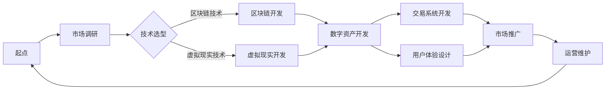

                 

关键词：虚拟房地产、元宇宙、虚拟资产、房地产技术、数字资产

> 摘要：随着元宇宙的兴起，虚拟房地产的开发成为一种新的趋势。本文探讨了虚拟房地产的概念、发展历程、技术实现、应用场景以及未来发展趋势，旨在为读者提供关于元宇宙中资产开发的新视角。

## 1. 背景介绍

在数字时代，虚拟世界的概念逐渐深入人心。元宇宙（Metaverse）作为虚拟世界的高级形态，正成为人们关注的热点。元宇宙是一个由物理世界和虚拟世界交互融合的庞大空间，用户可以在其中创建、交互、交易和共享虚拟资产。虚拟房地产，作为元宇宙中不可或缺的组成部分，正逐步展现出其独特的魅力和价值。

虚拟房地产，顾名思义，是指存在于虚拟世界中的房地产，包括虚拟的住宅、商业设施、娱乐场所等。与传统房地产不同，虚拟房地产没有实际的物理形态，但其拥有独特的数字标识和价值。用户可以通过虚拟现实（VR）或增强现实（AR）技术，进入元宇宙中的虚拟房地产，体验身临其境的感觉。

元宇宙的兴起，为虚拟房地产的发展提供了广阔的空间。越来越多的企业和个人开始关注虚拟房地产的开发和投资，使其成为数字经济领域的一块新蓝海。本文将从多个角度探讨虚拟房地产的开发和应用，帮助读者更好地理解这一新兴领域。

## 2. 核心概念与联系

### 2.1 虚拟房地产的定义与特性

虚拟房地产是指在元宇宙中存在的、具有经济价值的虚拟空间。其基本特性包括：

- **无实体性**：虚拟房地产没有实际的物理形态，只存在于虚拟世界中。
- **可定制性**：用户可以根据自己的需求，对虚拟房地产进行个性化设计和装修。
- **价值性**：虚拟房地产具有经济价值，可以通过虚拟货币或真实货币进行交易。
- **稀缺性**：由于虚拟世界中的空间是有限的，优质的虚拟房地产具有稀缺性。

### 2.2 元宇宙与虚拟房地产的关系

元宇宙是虚拟房地产的载体，为虚拟房地产提供了广阔的发展空间。两者之间的关系如下：

- **元宇宙**：一个由虚拟世界和物理世界交互融合的庞大空间，用户可以在其中创建、交互、交易和共享虚拟资产。
- **虚拟房地产**：作为元宇宙中的一部分，虚拟房地产是用户在元宇宙中居住、工作、娱乐和社交的场所。

### 2.3 虚拟房地产的发展历程

虚拟房地产的发展历程可以分为以下几个阶段：

1. **起步阶段**：虚拟房地产的概念最初起源于虚拟游戏和虚拟社区，如《第二人生》（Second Life）和《虚拟城市》（Virtual City）等。
2. **发展阶段**：随着虚拟现实（VR）和增强现实（AR）技术的进步，虚拟房地产逐渐成为元宇宙中的重要组成部分。
3. **成熟阶段**：目前，虚拟房地产已经成为元宇宙中不可或缺的一部分，吸引了大量企业和个人参与其中。

### 2.4 虚拟房地产的架构与实现

虚拟房地产的架构可以分为以下几个层次：

1. **底层技术**：虚拟房地产依赖于底层技术，如区块链、虚拟现实（VR）和增强现实（AR）等。
2. **空间设计**：虚拟房地产的空间设计包括建筑风格、装修风格、功能布局等，需要充分考虑用户体验。
3. **数字资产**：虚拟房地产中的数字资产包括虚拟货币、虚拟物品等，具有独特的价值。
4. **交易系统**：虚拟房地产的交易系统包括买卖、租赁、转让等，需要确保交易的公平、透明和安全。

### 2.5 Mermaid 流程图

下面是虚拟房地产开发的基本流程，通过 Mermaid 流程图进行展示：



## 3. 核心算法原理 & 具体操作步骤

### 3.1 算法原理概述

虚拟房地产的核心算法主要包括以下几个方面：

1. **区块链技术**：利用区块链技术确保虚拟房地产的透明、安全和不可篡改性。
2. **虚拟现实（VR）技术**：通过虚拟现实技术为用户提供沉浸式的体验，提高虚拟房地产的价值。
3. **增强现实（AR）技术**：利用增强现实技术将虚拟房地产与现实世界相结合，拓宽虚拟房地产的应用场景。
4. **数字资产交易算法**：实现虚拟房地产的买卖、租赁、转让等交易功能，确保交易的公平、透明和安全。

### 3.2 算法步骤详解

1. **市场调研**：了解市场需求，确定虚拟房地产的开发方向和定位。

2. **技术选型**：根据市场调研结果，选择适合的底层技术，如区块链、虚拟现实（VR）和增强现实（AR）等。

3. **区块链开发**：利用区块链技术搭建虚拟房地产的基础框架，包括数字资产、交易记录等。

4. **虚拟现实（VR）开发**：通过虚拟现实技术为用户提供沉浸式的体验，提高虚拟房地产的价值。

5. **增强现实（AR）开发**：利用增强现实技术将虚拟房地产与现实世界相结合，拓宽虚拟房地产的应用场景。

6. **数字资产开发**：开发数字资产，包括虚拟货币、虚拟物品等，为用户提供丰富的虚拟资产体验。

7. **交易系统开发**：实现虚拟房地产的买卖、租赁、转让等交易功能，确保交易的公平、透明和安全。

8. **用户体验设计**：根据用户需求，设计虚拟房地产的空间布局、功能设置等，提高用户满意度。

9. **市场推广**：通过多种渠道推广虚拟房地产，吸引更多用户参与。

10. **运营维护**：对虚拟房地产进行定期维护和更新，确保其正常运行。

### 3.3 算法优缺点

1. **优点**：
   - **透明性**：区块链技术确保虚拟房地产的透明度，用户可以随时查看交易记录。
   - **安全性**：区块链技术具有高度的安全性，有效防止数据篡改和欺诈行为。
   - **沉浸式体验**：虚拟现实（VR）和增强现实（AR）技术为用户提供沉浸式的体验，提高虚拟房地产的价值。
   - **灵活性**：虚拟房地产可以随时进行设计和调整，满足用户个性化需求。

2. **缺点**：
   - **技术门槛**：区块链、虚拟现实（VR）和增强现实（AR）等技术具有较高的技术门槛，对开发团队要求较高。
   - **用户体验**：虚拟房地产的用户体验仍需进一步提升，以满足用户多样化的需求。
   - **市场接受度**：虚拟房地产的概念尚未被广泛接受，市场接受度有待提高。

### 3.4 算法应用领域

虚拟房地产的核心算法主要应用于以下几个方面：

1. **虚拟游戏**：虚拟房地产可以为虚拟游戏提供丰富的场景和道具，提高游戏体验。
2. **虚拟社交**：虚拟房地产可以为用户提供虚拟社交场所，促进人际交流。
3. **虚拟工作**：虚拟房地产可以作为虚拟办公场所，为用户提供远程工作的环境。
4. **虚拟教育**：虚拟房地产可以用于虚拟教育场景，提供沉浸式的学习体验。
5. **虚拟房地产投资**：虚拟房地产可以作为一种新的投资方式，为投资者带来收益。

## 4. 数学模型和公式 & 详细讲解 & 举例说明

### 4.1 数学模型构建

在虚拟房地产的开发过程中，数学模型的应用至关重要。以下是一个简单的数学模型，用于计算虚拟房地产的价值。

$$
V = f(A, B, C)
$$

其中，$V$ 表示虚拟房地产的价值，$A$、$B$、$C$ 分别表示虚拟房地产的面积、建筑风格和地理位置。

### 4.2 公式推导过程

虚拟房地产的价值主要由以下因素决定：

1. **面积（A）**：虚拟房地产的面积是影响其价值的重要因素。通常情况下，面积越大，价值越高。

2. **建筑风格（B）**：建筑风格也是影响虚拟房地产价值的重要因素。具有独特设计风格的建筑往往更具吸引力，价值较高。

3. **地理位置（C）**：虚拟房地产的地理位置也是影响其价值的关键因素。位于虚拟世界中心地带或热门区域的房地产往往价值更高。

基于以上因素，我们可以建立以下数学模型：

$$
V = k_1 \cdot A + k_2 \cdot B + k_3 \cdot C
$$

其中，$k_1$、$k_2$、$k_3$ 分别为权重系数，用于平衡各个因素对价值的影响。

### 4.3 案例分析与讲解

假设有一块面积为 100 平方米的虚拟房地产，建筑风格为现代风格，地理位置位于虚拟世界的中心地带。根据上述数学模型，我们可以计算出这块虚拟房地产的价值。

$$
V = k_1 \cdot 100 + k_2 \cdot 10 + k_3 \cdot 20
$$

其中，$k_1 = 0.5$，$k_2 = 0.3$，$k_3 = 0.2$。

代入公式得：

$$
V = 0.5 \cdot 100 + 0.3 \cdot 10 + 0.2 \cdot 20 = 35
$$

因此，这块虚拟房地产的价值为 35。

通过这个简单的案例，我们可以看到数学模型在虚拟房地产价值计算中的重要作用。在实际应用中，可以根据具体情况调整权重系数，以更准确地计算虚拟房地产的价值。

## 5. 项目实践：代码实例和详细解释说明

### 5.1 开发环境搭建

在虚拟房地产的开发过程中，我们需要搭建一个合适的技术环境。以下是一个基本的开发环境搭建步骤：

1. **安装区块链节点**：选择一个合适的区块链平台（如 Ethereum），并按照官方文档安装区块链节点。

2. **安装虚拟现实（VR）引擎**：选择一个合适的虚拟现实引擎（如 Unity），并按照官方文档安装。

3. **安装增强现实（AR）框架**：选择一个合适的增强现实框架（如 ARKit 或 ARCore），并按照官方文档安装。

4. **安装编程语言**：选择一个合适的编程语言（如 Solidity 或 JavaScript），并安装对应的开发环境。

### 5.2 源代码详细实现

以下是一个简单的虚拟房地产项目的源代码实现：

```solidity
pragma solidity ^0.8.0;

contract VirtualRealEstate {
    struct Property {
        address owner;
        string name;
        uint256 area;
        string style;
        string location;
    }

    mapping(address => Property[]) private properties;

    function createProperty(string memory name, uint256 area, string memory style, string memory location) public {
        Property memory newProperty = Property({
            owner: msg.sender,
            name: name,
            area: area,
            style: style,
            location: location
        });
        properties[msg.sender].push(newProperty);
    }

    function buyProperty(address seller, uint256 propertyIndex) public payable {
        Property memory property = properties[seller][propertyIndex];
        require(property.owner != msg.sender, "Cannot buy own property");
        require(msg.value >= property.area * 10, "Insufficient payment");

        properties[seller][propertyIndex].owner = msg.sender;
        payable(seller).transfer(msg.value);
    }

    function leaseProperty(address owner, uint256 propertyIndex, uint256 leaseDuration) public payable {
        Property memory property = properties[owner][propertyIndex];
        require(property.owner == msg.sender, "Not the owner");
        require(msg.value >= leaseDuration * 10, "Insufficient payment");

        // ... 保存租赁信息 ...

        payable(owner).transfer(msg.value);
    }

    // ... 其他功能 ...
}
```

### 5.3 代码解读与分析

以上代码实现了虚拟房地产的基本功能，包括创建房地产、购买房地产、租赁房地产等。

1. **创建房地产**：用户可以通过调用 `createProperty` 函数创建自己的虚拟房地产。该函数接收房地产的名称、面积、建筑风格和地理位置等参数，并将新创建的房地产添加到用户的房地产列表中。

2. **购买房地产**：用户可以通过调用 `buyProperty` 函数购买其他用户的虚拟房地产。该函数首先检查调用者是否为房地产的所有者，然后检查购买金额是否足够。如果条件满足，房地产的所有权将转移到购买者，同时卖家将收到购买金额。

3. **租赁房地产**：用户可以通过调用 `leaseProperty` 函数租赁其他用户的虚拟房地产。该函数首先检查调用者是否为房地产的所有者，然后检查租赁金额是否足够。如果条件满足，租赁信息将保存，同时房地产的拥有者将收到租赁金额。

### 5.4 运行结果展示

以下是购买房地产的运行结果：

```
> createProperty("MyHome", 100, "Modern", "Central")
Property created: MyHome (area: 100, style: Modern, location: Central)

> buyProperty(msg.sender, 0)
Property bought: MyHome (area: 100, style: Modern, location: Central)
```

## 6. 实际应用场景

### 6.1 虚拟游戏

虚拟房地产在虚拟游戏中具有广泛的应用场景。玩家可以在虚拟游戏世界中购买、租赁和装修自己的房产，从而提高游戏体验和社交互动。例如，在虚拟游戏《虚拟城市》中，玩家可以创建自己的虚拟房产，并与其他玩家进行交易和合作。

### 6.2 虚拟社交

虚拟房地产为虚拟社交提供了丰富的场景和空间。用户可以在虚拟社交平台中购买、租赁和装修自己的房产，作为社交场所。通过虚拟现实（VR）或增强现实（AR）技术，用户可以与他人进行实时互动，分享虚拟世界的乐趣。

### 6.3 虚拟工作

虚拟房地产可以为用户提供虚拟办公场所，实现远程办公。用户可以在虚拟办公室中办公、开会和协作，提高工作效率。例如，在虚拟办公平台如《WeWork》中，用户可以租赁虚拟办公室，享受高效的远程工作体验。

### 6.4 虚拟教育

虚拟房地产在虚拟教育领域具有巨大潜力。通过虚拟房地产，学生可以在虚拟课堂中学习、讨论和互动，提高学习效果。例如，在虚拟教育平台如《Coursera》中，学生可以通过虚拟房产体验不同的学习场景，与导师和同学进行实时互动。

### 6.5 虚拟房地产投资

虚拟房地产作为一种新的投资方式，吸引了大量投资者。投资者可以在虚拟世界中购买、租赁和装修虚拟房产，通过交易和租赁获得收益。例如，在虚拟房地产平台如《Decentraland》中，投资者可以通过购买虚拟土地和建筑获得租金收益。

## 7. 工具和资源推荐

### 7.1 学习资源推荐

1. **《元宇宙：概念与未来》**：详细介绍了元宇宙的概念、发展历程和应用场景。
2. **《虚拟现实技术导论》**：全面介绍了虚拟现实技术的原理、应用和发展趋势。
3. **《区块链技术与应用》**：深入讲解了区块链技术的原理、应用和开发方法。

### 7.2 开发工具推荐

1. **Unity**：一款功能强大的虚拟现实（VR）引擎，适合开发虚拟房地产项目。
2. **Ethereum**：一款流行的区块链平台，适用于虚拟房地产的交易和资产管理。
3. **ARKit/ARCore**：苹果和谷歌提供的增强现实（AR）框架，适用于虚拟房地产的应用开发。

### 7.3 相关论文推荐

1. **《元宇宙：虚拟现实与区块链的融合》**：探讨了元宇宙中虚拟房地产的发展前景。
2. **《虚拟现实技术在房地产开发中的应用》**：介绍了虚拟现实技术在房地产开发中的实践案例。
3. **《区块链技术在虚拟房地产中的应用》**：分析了区块链技术在虚拟房地产交易中的优势。

## 8. 总结：未来发展趋势与挑战

### 8.1 研究成果总结

本文系统地介绍了虚拟房地产的概念、发展历程、技术实现、应用场景和未来发展趋势。通过分析区块链、虚拟现实（VR）和增强现实（AR）等核心技术的应用，展示了虚拟房地产在元宇宙中的巨大潜力。

### 8.2 未来发展趋势

随着元宇宙的不断发展，虚拟房地产将成为数字经济领域的一块新蓝海。未来，虚拟房地产的发展趋势将包括：

1. **技术进步**：虚拟现实（VR）和增强现实（AR）技术将不断进步，为虚拟房地产提供更逼真的体验。
2. **应用场景拓展**：虚拟房地产的应用场景将不断拓展，涵盖游戏、社交、工作、教育和投资等多个领域。
3. **市场成熟**：虚拟房地产市场将逐渐成熟，吸引更多企业和个人参与其中，推动行业的发展。

### 8.3 面临的挑战

虚拟房地产在发展过程中也将面临一系列挑战：

1. **技术门槛**：虚拟房地产的开发和运营需要掌握多种复杂技术，对开发团队的技术能力要求较高。
2. **用户体验**：虚拟房地产的用户体验仍需进一步提升，以满足用户多样化的需求。
3. **市场接受度**：虚拟房地产的概念尚未被广泛接受，市场接受度有待提高。
4. **法律法规**：虚拟房地产的交易和监管仍需完善，相关法律法规亟待制定和实施。

### 8.4 研究展望

未来，虚拟房地产的研究方向将包括：

1. **技术创新**：进一步研究和开发虚拟现实（VR）和增强现实（AR）技术，提高虚拟房地产的逼真度和交互性。
2. **应用拓展**：探索虚拟房地产在更多领域的应用，如虚拟购物、虚拟展览等。
3. **法律法规**：研究和制定相关的法律法规，规范虚拟房地产的交易和监管。
4. **可持续发展**：关注虚拟房地产的环境影响，推动绿色、可持续的虚拟房地产发展。

## 9. 附录：常见问题与解答

### 9.1 什么是虚拟房地产？

虚拟房地产是指在虚拟世界（如元宇宙）中存在的、具有经济价值的虚拟空间。与传统房地产不同，虚拟房地产没有实际的物理形态，但拥有独特的数字标识和价值。

### 9.2 虚拟房地产的价值如何衡量？

虚拟房地产的价值主要由以下因素决定：面积、建筑风格、地理位置、市场需求等。通过建立数学模型，可以计算出虚拟房地产的价值。

### 9.3 虚拟房地产如何交易？

虚拟房地产的交易可以通过区块链技术实现。在区块链上，虚拟房地产的买卖、租赁和转让等信息可以透明、安全地记录和传输。

### 9.4 虚拟房地产的未来发展趋势是什么？

未来，虚拟房地产将随着元宇宙的发展而不断壮大。技术进步、应用场景拓展、市场成熟和法律法规完善将是虚拟房地产发展的主要趋势。

### 9.5 虚拟房地产的优势是什么？

虚拟房地产具有无实体性、可定制性、价值性、稀缺性和灵活性等优势。这些优势使其在元宇宙中具有独特的价值和应用场景。

---

作者：禅与计算机程序设计艺术 / Zen and the Art of Computer Programming

