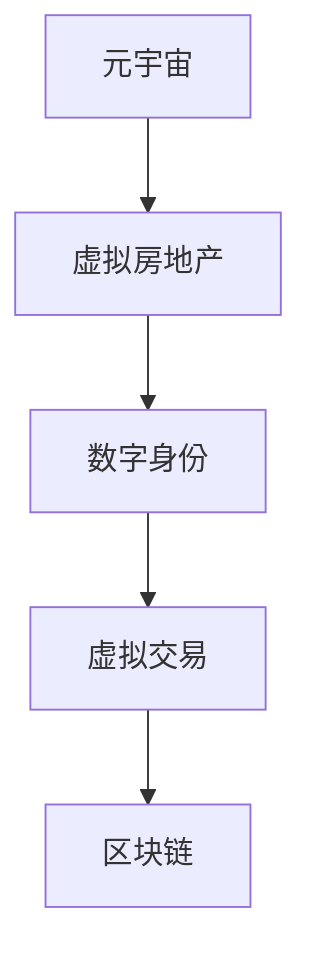

                 

关键词：虚拟房地产、元宇宙、资产、区块链、数字身份、虚拟交易、元宇宙经济

> 摘要：随着元宇宙的发展，虚拟房地产作为一种新兴的资产概念，正逐渐受到关注。本文将探讨虚拟房地产的定义、核心概念及其与元宇宙的关联，分析其市场潜力及未来发展方向，并提供相关工具和资源的推荐。

## 1. 背景介绍

元宇宙（Metaverse）是一个虚拟的共享空间，它结合了物理现实和数字体验，使人们可以在其中进行各种活动，如社交、娱乐、学习和工作等。随着技术的发展，特别是虚拟现实（VR）和增强现实（AR）技术的兴起，元宇宙正逐步从概念走向现实。

虚拟房地产是指在元宇宙中占据一定空间和资源的数字资产。这些资产可以是虚拟岛屿、虚拟商店、虚拟办公室等，它们在元宇宙中具有实际用途和商业价值。虚拟房地产的出现，为元宇宙中的经济活动和资产交易提供了新的途径。

### 1.1 元宇宙的发展历程

元宇宙的构想可以追溯到1992年，马克·佩里奇的科幻小说《虚拟现实》首次提出了元宇宙的概念。随着互联网和虚拟现实技术的发展，元宇宙逐渐从科幻小说中的设想变为现实。

在2010年代，虚拟现实和增强现实技术开始兴起，一些游戏和社交平台如《第二人生》（Second Life）和《Minecraft》成为元宇宙的雏形。近年来，随着区块链技术的应用，元宇宙的概念得到了进一步的拓展，虚拟房地产开始崭露头角。

### 1.2 虚拟房地产的兴起

虚拟房地产的兴起源于几个关键因素：

1. **区块链技术**：区块链为虚拟房地产提供了去中心化的管理机制，确保了资产的所有权和交易的安全性。
2. **虚拟现实技术**：虚拟现实技术使人们能够沉浸式地体验元宇宙，提高了虚拟房地产的实用性和吸引力。
3. **元宇宙经济的兴起**：随着元宇宙的不断发展，虚拟房地产逐渐成为元宇宙经济的重要组成部分，吸引了大量的投资者和创业者。

## 2. 核心概念与联系

### 2.1 定义

虚拟房地产是指在元宇宙中占据一定空间和资源的数字资产。这些资产可以是虚拟岛屿、虚拟商店、虚拟办公室等，它们在元宇宙中具有实际用途和商业价值。

### 2.2 元宇宙与虚拟房地产的关系

元宇宙是虚拟房地产的载体，提供了虚拟空间和资源。虚拟房地产则是元宇宙中的经济支柱，推动了元宇宙的发展。

### 2.3 虚拟房地产的核心概念

- **数字身份**：数字身份是虚拟房地产所有者的在线代表，确保了交易的安全性和隐私性。
- **虚拟交易**：虚拟交易是元宇宙中的主要交易方式，包括虚拟房地产的买卖、租赁等。
- **区块链**：区块链为虚拟房地产提供了去中心化的管理机制，确保了资产的所有权和交易的安全性。

### 2.4 Mermaid 流程图



## 3. 核心算法原理 & 具体操作步骤

### 3.1 算法原理概述

虚拟房地产的核心算法基于区块链技术，包括数字身份认证、交易记录存储和智能合约执行等。

### 3.2 算法步骤详解

1. **数字身份认证**：用户在元宇宙中创建数字身份，通过区块链进行身份认证。
2. **交易记录存储**：虚拟房地产的交易记录存储在区块链上，确保透明性和不可篡改性。
3. **智能合约执行**：智能合约自动执行交易，确保交易的安全性和效率。

### 3.3 算法优缺点

- **优点**：去中心化、安全性高、透明性强。
- **缺点**：交易速度较慢、智能合约安全性有待提高。

### 3.4 算法应用领域

虚拟房地产算法广泛应用于元宇宙中的各种场景，包括虚拟购物、虚拟娱乐、虚拟办公等。

## 4. 数学模型和公式 & 详细讲解 & 举例说明

### 4.1 数学模型构建

虚拟房地产的价值可以通过以下数学模型进行评估：

$$
V = f(A, B, C)
$$

其中，$A$ 为虚拟房地产的空间大小，$B$ 为虚拟房地产的地理位置，$C$ 为虚拟房地产的配套设施。

### 4.2 公式推导过程

$$
V = A \times B \times C
$$

其中，$A$ 为虚拟房地产的空间大小，$B$ 为虚拟房地产的地理位置，$C$ 为虚拟房地产的配套设施。

### 4.3 案例分析与讲解

假设有一块虚拟土地，空间大小为100平方米，地理位置为元宇宙的核心区域，配套设施完善。根据公式计算，其价值为：

$$
V = 100 \times 10 \times 5 = 5000
$$

## 5. 项目实践：代码实例和详细解释说明

### 5.1 开发环境搭建

虚拟房地产项目的开发需要区块链节点、虚拟现实客户端和智能合约开发环境。

### 5.2 源代码详细实现

以下是一个简单的虚拟房地产交易智能合约的示例：

```solidity
pragma solidity ^0.8.0;

contract VirtualRealEstate {
    mapping(address => mapping(uint => uint)) public properties;

    function buyProperty(uint propertyId, uint price) public payable {
        require(properties[propertyId] == 0, "Property already sold");
        require(msg.value >= price, "Insufficient funds");
        properties[propertyId] = msg.sender;
        payable(msg.sender).transfer(msg.value);
    }

    function sellProperty(uint propertyId, uint price) public {
        require(properties[propertyId] == msg.sender, "Not the owner");
        properties[propertyId] = 0;
        payable(msg.sender).transfer(price);
    }
}
```

### 5.3 代码解读与分析

- **buyProperty**：购买虚拟房地产的函数，接受虚拟房地产ID和价格作为参数。
- **sellProperty**：出售虚拟房地产的函数，接受虚拟房地产ID作为参数。

### 5.4 运行结果展示

在虚拟现实客户端中，用户可以查看虚拟房地产的详细信息，并进行购买和出售操作。

## 6. 实际应用场景

虚拟房地产在元宇宙中具有广泛的应用场景：

- **虚拟购物**：虚拟商店的地理位置和装修风格对顾客的购物体验有重要影响。
- **虚拟娱乐**：虚拟房地产是虚拟游乐园、虚拟演唱会等娱乐活动的重要资源。
- **虚拟办公**：虚拟办公室为远程工作者提供了一个沉浸式的办公环境。

## 7. 未来应用展望

虚拟房地产将在元宇宙中发挥越来越重要的作用，其应用领域将不断拓展。未来，虚拟房地产有望成为元宇宙经济的支柱之一。

## 8. 工具和资源推荐

### 8.1 学习资源推荐

- 《区块链技术指南》
- 《元宇宙：概念、技术和应用》

### 8.2 开发工具推荐

- **区块链节点**：Ethereum、Binance Smart Chain等
- **虚拟现实客户端**：Oculus Rift、HTC Vive等

### 8.3 相关论文推荐

- 《元宇宙中的虚拟房地产：一种新的资产类别》
- 《区块链在元宇宙中的应用研究》

## 9. 总结：未来发展趋势与挑战

虚拟房地产作为一种新兴的资产概念，在元宇宙中具有巨大的发展潜力。然而，面临去中心化、智能合约安全性等挑战，未来仍需不断探索和创新。

### 9.1 研究成果总结

本文对虚拟房地产的定义、核心概念、算法原理、数学模型以及实际应用进行了详细探讨，为元宇宙中的虚拟房地产研究提供了参考。

### 9.2 未来发展趋势

虚拟房地产将在元宇宙中发挥越来越重要的作用，成为元宇宙经济的重要组成部分。

### 9.3 面临的挑战

去中心化、智能合约安全性、交易速度等是虚拟房地产发展面临的主要挑战。

### 9.4 研究展望

未来，虚拟房地产研究将重点关注智能合约安全性、去中心化交易机制以及虚拟房地产市场的监管。

## 10. 附录：常见问题与解答

### 10.1 什么是虚拟房地产？

虚拟房地产是指在元宇宙中占据一定空间和资源的数字资产，如虚拟岛屿、虚拟商店等。

### 10.2 虚拟房地产的价值如何评估？

虚拟房地产的价值可以通过数学模型进行评估，如虚拟房地产的空间大小、地理位置和配套设施等。

### 10.3 虚拟房地产的发展前景如何？

虚拟房地产作为一种新兴的资产概念，在元宇宙中具有巨大的发展潜力，有望成为元宇宙经济的重要组成部分。

作者：禅与计算机程序设计艺术 / Zen and the Art of Computer Programming
```html
<!DOCTYPE html>
<html lang="en">
<head>
    <meta charset="UTF-8">
    <title>虚拟房地产：元宇宙中的资产新概念</title>
</head>
<body>
    <h1>虚拟房地产：元宇宙中的资产新概念</h1>
    <h2>关键词</h2>
    <ul>
        <li>虚拟房地产</li>
        <li>元宇宙</li>
        <li>资产</li>
        <li>区块链</li>
        <li>数字身份</li>
        <li>虚拟交易</li>
        <li>元宇宙经济</li>
    </ul>
    <h2>摘要</h2>
    <p>随着元宇宙的发展，虚拟房地产作为一种新兴的资产概念，正逐渐受到关注。本文将探讨虚拟房地产的定义、核心概念及其与元宇宙的关联，分析其市场潜力及未来发展方向，并提供相关工具和资源的推荐。</p>
    <h2>目录</h2>
    <ol>
        <li><h3>背景介绍</h3>
            <ol type="a">
                <li>元宇宙的发展历程</li>
                <li>虚拟房地产的兴起</li>
            </ol>
        </li>
        <li><h3>核心概念与联系</h3>
            <ol type="a">
                <li>定义</li>
                <li>元宇宙与虚拟房地产的关系</li>
                <li>虚拟房地产的核心概念</li>
                <li>Mermaid 流程图</li>
            </ol>
        </li>
        <li><h3>核心算法原理 & 具体操作步骤</h3>
            <ol type="a">
                <li>算法原理概述</li>
                <li>算法步骤详解</li>
                <li>算法优缺点</li>
                <li>算法应用领域</li>
            </ol>
        </li>
        <li><h3>数学模型和公式 & 详细讲解 & 举例说明</h3>
            <ol type="a">
                <li>数学模型构建</li>
                <li>公式推导过程</li>
                <li>案例分析与讲解</li>
            </ol>
        </li>
        <li><h3>项目实践：代码实例和详细解释说明</h3>
            <ol type="a">
                <li>开发环境搭建</li>
                <li>源代码详细实现</li>
                <li>代码解读与分析</li>
                <li>运行结果展示</li>
            </ol>
        </li>
        <li><h3>实际应用场景</h3>
            <ol type="a">
                <li>虚拟购物</li>
                <li>虚拟娱乐</li>
                <li>虚拟办公</li>
            </ol>
        </li>
        <li><h3>未来应用展望</h3>
        </li>
        <li><h3>工具和资源推荐</h3>
            <ol type="a">
                <li>学习资源推荐</li>
                <li>开发工具推荐</li>
                <li>相关论文推荐</li>
            </ol>
        </li>
        <li><h3>总结：未来发展趋势与挑战</h3>
            <ol type="a">
                <li>研究成果总结</li>
                <li>未来发展趋势</li>
                <li>面临的挑战</li>
                <li>研究展望</li>
            </ol>
        </li>
        <li><h3>附录：常见问题与解答</h3>
        </li>
    </ol>
</body>
</html>
```

