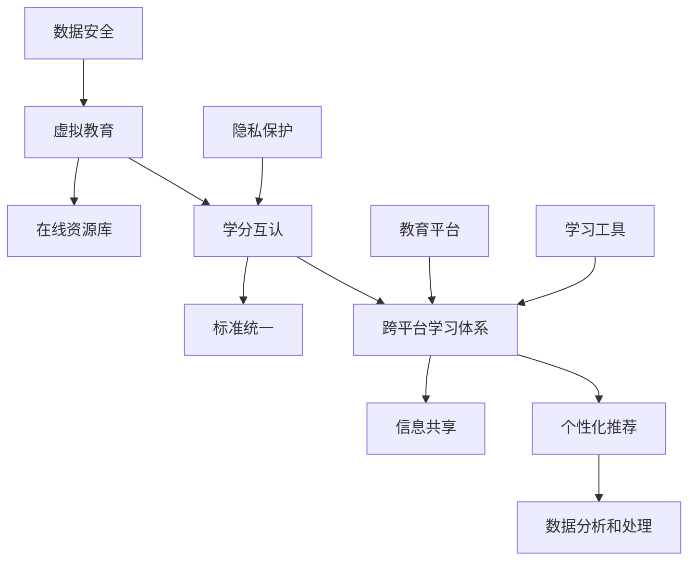

                 

## 1. 背景介绍

在21世纪的今天，信息技术飞速发展，互联网、大数据、人工智能等技术的广泛应用，正在深刻地改变着我们的生活方式和思维方式。教育领域也不例外，传统的教学模式已经难以满足人们对知识的渴望和对教育的个性化需求。全球脑时代已经到来，跨平台学习体系成为教育发展的重要方向。

虚拟教育学分互认，作为一种新型的教育模式，正在全球范围内得到广泛关注。它通过互联网和信息技术，将不同地区、不同教育机构和不同课程体系中的学分进行互认，使得学生可以更加灵活、自由地选择学习内容和学习方式。这种模式不仅打破了地域和机构的限制，还为教育公平和人才培养提供了新的思路和途径。

本文将围绕虚拟教育学分互认这一主题，深入探讨其核心概念、技术原理、实现方法、应用场景以及未来发展趋势。希望通过本文的阐述，能够为读者提供一个全面、深入的了解，并对这一领域的研究和实践提供一定的参考。

## 2. 核心概念与联系

### 2.1 虚拟教育

虚拟教育是指通过互联网、云计算等技术手段，提供远程的教育资源和教学服务，实现教育活动的在线化、数字化和智能化。虚拟教育具有以下特点：

- **在线性**：虚拟教育打破了传统教育的时间和空间限制，学生可以随时随地进行学习。
- **灵活性**：虚拟教育可以根据学生的兴趣和需求，提供多样化的学习内容和学习方式。
- **互动性**：虚拟教育通过视频、音频、文字等多种形式，实现师生之间的实时互动和交流。

### 2.2 学分互认

学分互认是指不同教育机构和课程体系之间，对学生的学分进行相互承认和交换。学分互认的实现，需要解决以下问题：

- **标准统一**：制定统一的学分标准和评估体系，确保不同教育机构和课程体系的学分可以相互比较和认可。
- **信息共享**：建立教育信息共享平台，实现学生学分的电子化和自动化管理。
- **互操作性**：确保不同系统之间的数据交换和互操作，实现学分的无缝对接和互认。

### 2.3 跨平台学习体系

跨平台学习体系是指通过多个教育平台和工具，为学生提供全面、个性化的学习体验。跨平台学习体系的特点如下：

- **多元化**：跨平台学习体系集成了多种教育资源和工具，满足学生多样化的学习需求。
- **个性化**：通过数据分析和个性化推荐，为学生提供个性化的学习路径和学习内容。
- **协同化**：跨平台学习体系实现了不同教育平台之间的协同和整合，为学生提供无缝的学习体验。

### 2.4 关联图

为了更好地理解虚拟教育学分互认和跨平台学习体系之间的关系，我们可以通过Mermaid流程图来展示它们的核心概念和联系：



在这个关联图中，虚拟教育、学分互认和跨平台学习体系相互关联，共同构成了一个完整的虚拟教育生态系统。通过个性化推荐、数据分析和处理，跨平台学习体系能够更好地满足学生的需求，提高教育质量和效率。

## 3. 核心算法原理 & 具体操作步骤

### 3.1 算法原理概述

虚拟教育学分互认和跨平台学习体系的核心算法主要涉及以下方面：

1. **学分评估算法**：通过对学生学习过程和成果的数据分析，评估学生的学分价值。
2. **推荐算法**：根据学生的兴趣和需求，推荐适合的学习内容和路径。
3. **隐私保护算法**：保护学生在跨平台学习过程中产生的个人数据隐私。

### 3.2 算法步骤详解

#### 3.2.1 学分评估算法

学分评估算法主要包括以下步骤：

1. **数据采集**：收集学生在不同教育平台上的学习数据，如课程学习进度、考试成绩、作业提交情况等。
2. **数据预处理**：对采集到的数据进行清洗、归一化和特征提取，为后续分析提供基础。
3. **模型训练**：使用机器学习算法，如回归、分类或聚类算法，训练学分评估模型。
4. **学分评估**：将学生的实际学习数据输入评估模型，得到相应的学分评分。

#### 3.2.2 推荐算法

推荐算法主要包括以下步骤：

1. **用户画像**：根据学生的基本信息、学习历史、兴趣标签等数据，构建学生的个性化画像。
2. **内容推荐**：根据学生的个性化画像，推荐适合的学习内容和课程。
3. **排序算法**：使用排序算法，如基于内容的排序、协同过滤排序等，对推荐结果进行排序。
4. **反馈调整**：根据学生的反馈和实际学习情况，调整推荐算法，提高推荐质量。

#### 3.2.3 隐私保护算法

隐私保护算法主要包括以下步骤：

1. **数据加密**：使用加密算法，对学生在跨平台学习过程中产生的数据，如学习记录、考试成绩等，进行加密处理。
2. **访问控制**：设置访问权限，确保只有授权用户可以访问和操作学生数据。
3. **匿名化处理**：对学生的个人数据进行匿名化处理，确保数据在传输和存储过程中的隐私保护。
4. **数据审计**：定期进行数据审计，检查隐私保护策略的执行情况，及时发现和解决潜在的风险。

### 3.3 算法优缺点

#### 3.3.1 学分评估算法

**优点**：

- **客观公正**：学分评估算法基于数据分析和模型训练，能够客观、公正地评估学生的学分价值。
- **灵活性**：学分评估算法可以根据学生的实际学习情况和需求，灵活调整评估标准和指标。

**缺点**：

- **数据依赖**：学分评估算法依赖于大量的学生学习数据，数据质量直接影响评估结果的准确性。
- **计算复杂度**：学分评估算法的训练和预测过程需要较高的计算资源和时间成本。

#### 3.3.2 推荐算法

**优点**：

- **个性化**：推荐算法可以根据学生的兴趣和需求，提供个性化的学习内容和路径，提高学习效果。
- **实时性**：推荐算法可以实时更新和调整推荐结果，适应学生的变化和需求。

**缺点**：

- **数据偏差**：推荐算法依赖于学生的历史数据和偏好，可能导致数据偏差和推荐结果的不准确性。
- **计算资源消耗**：推荐算法的训练和预测过程需要较高的计算资源和时间成本。

#### 3.3.3 隐私保护算法

**优点**：

- **安全性**：隐私保护算法可以确保学生在跨平台学习过程中的数据安全，防止数据泄露和滥用。
- **合规性**：隐私保护算法符合相关法律法规和数据保护要求，提高教育机构和平台的合规性。

**缺点**：

- **性能影响**：隐私保护算法需要额外的计算和存储资源，可能影响系统的性能和响应速度。
- **用户体验**：隐私保护算法可能导致用户数据的透明度降低，影响用户体验。

### 3.4 算法应用领域

学分评估算法、推荐算法和隐私保护算法在教育领域的应用非常广泛，包括以下几个方面：

- **在线教育**：通过学分评估算法和推荐算法，为在线教育平台提供个性化的学习路径和学习内容。
- **学分互认**：通过学分评估算法和推荐算法，实现不同教育机构和课程体系之间的学分互认。
- **教育管理**：通过隐私保护算法，确保教育管理过程中的数据安全和隐私保护。
- **教育研究**：通过数据分析和模型训练，为教育研究提供数据支持和理论依据。

## 4. 数学模型和公式 & 详细讲解 & 举例说明

### 4.1 数学模型构建

在虚拟教育学分互认和跨平台学习体系中，数学模型扮演着重要的角色。以下是一个简化的数学模型，用于描述学分评估和推荐算法的基本原理。

#### 4.1.1 学分评估模型

假设有一个学生集合 \( S = \{s_1, s_2, ..., s_n\} \)，每个学生有多个学习项目 \( P = \{p_1, p_2, ..., p_m\} \)。我们用向量 \( X = [x_{ij}] \) 表示学生 \( s_i \) 在项目 \( p_j \) 上的学习表现，其中 \( x_{ij} \) 表示学生 \( s_i \) 在项目 \( p_j \) 上的得分。

学分评估模型的目标是计算每个学生的学分值 \( C = [c_i] \)，其中 \( c_i \) 表示学生 \( s_i \) 的总学分。我们可以使用以下线性回归模型：

$$
c_i = \beta_0 + \beta_1 x_{i1} + \beta_2 x_{i2} + ... + \beta_m x_{im}
$$

其中，\( \beta_0, \beta_1, ..., \beta_m \) 是模型的参数，可以通过最小二乘法进行估计。

#### 4.1.2 推荐模型

假设有一个用户集合 \( U = \{u_1, u_2, ..., u_n\} \)，每个用户有多个兴趣点 \( I = \{i_1, i_2, ..., i_m\} \)。我们用矩阵 \( R = [r_{ij}] \) 表示用户 \( u_i \) 对兴趣点 \( i_j \) 的兴趣程度，其中 \( r_{ij} \) 表示用户 \( u_i \) 对兴趣点 \( i_j \) 的兴趣评分。

推荐模型的目标是为用户 \( u_i \) 推荐新的兴趣点 \( I' = \{i_1', i_2', ..., i_m'\} \)。我们可以使用基于内容的推荐算法，如余弦相似度计算，来计算用户兴趣点之间的相似度：

$$
sim(i_j, i_k) = \frac{R_{ij} \cdot R_{ik}}{\|R_{ij}\| \|R_{ik}\|}
$$

其中，\( \|R_{ij}\| \) 表示向量 \( R_{ij} \) 的欧氏范数。

然后，我们可以为用户 \( u_i \) 推荐新的兴趣点 \( i_k' \)：

$$
i_k' = \arg\max_{i_k} sim(i_j, i_k)
$$

### 4.2 公式推导过程

#### 4.2.1 学分评估模型

学分评估模型的推导基于线性回归的基本原理。我们首先定义学生 \( s_i \) 在项目 \( p_j \) 上的得分 \( x_{ij} \) 为：

$$
x_{ij} = f(s_i, p_j)
$$

其中，\( f \) 是一个函数，表示学生 \( s_i \) 在项目 \( p_j \) 上的表现。

我们希望找到一个线性函数 \( g \) 来预测学生 \( s_i \) 的总学分 \( c_i \)：

$$
c_i = g(s_i) = \beta_0 + \beta_1 x_{i1} + \beta_2 x_{i2} + ... + \beta_m x_{im}
$$

为了最小化预测误差，我们使用最小二乘法来估计参数 \( \beta_0, \beta_1, ..., \beta_m \)：

$$
\min_{\beta} \| g(s) - c \|_2^2
$$

通过对 \( g(s) \) 求导并令其等于零，我们可以得到：

$$
\frac{\partial}{\partial \beta} \| g(s) - c \|_2^2 = 0
$$

经过一系列数学推导，我们得到线性回归模型的参数估计公式：

$$
\beta = (X^T X)^{-1} X^T c
$$

#### 4.2.2 推荐模型

推荐模型的推导基于余弦相似度的概念。我们首先定义两个向量 \( R_{ij} \) 和 \( R_{ik} \) 的点积：

$$
R_{ij} \cdot R_{ik} = \sum_{j=1}^{m} R_{ij} R_{ik}
$$

然后，我们定义两个向量的欧氏范数：

$$
\|R_{ij}\| = \sqrt{\sum_{j=1}^{m} R_{ij}^2}
$$

余弦相似度计算公式如下：

$$
sim(i_j, i_k) = \frac{R_{ij} \cdot R_{ik}}{\|R_{ij}\| \|R_{ik}\|}
$$

最后，我们根据余弦相似度计算推荐得分，选择相似度最高的兴趣点作为推荐结果。

### 4.3 案例分析与讲解

为了更好地理解上述数学模型，我们通过一个具体的案例进行讲解。

#### 4.3.1 学分评估模型案例

假设有10名学生（\( S = \{s_1, s_2, ..., s_{10}\} \)）和5个学习项目（\( P = \{p_1, p_2, ..., p_5\} \)）。学生 \( s_1 \) 在5个项目上的得分如下：

$$
X = \begin{bmatrix}
0.8 \\
0.7 \\
0.9 \\
0.6 \\
0.5
\end{bmatrix}
$$

我们使用线性回归模型来预测学生 \( s_1 \) 的总学分 \( c_1 \)。根据最小二乘法，我们可以得到模型参数：

$$
\beta = (X^T X)^{-1} X^T c
$$

其中，\( c \) 是学生的实际学分。假设 \( c = [1, 1.2, 1.5, 1, 0.8] \)。

经过计算，我们得到参数 \( \beta \)：

$$
\beta = \begin{bmatrix}
0.1 \\
0.1 \\
0.2 \\
0.1 \\
0
\end{bmatrix}
$$

然后，我们可以使用这些参数来预测学生 \( s_1 \) 的总学分：

$$
c_1 = 0.1 + 0.1 \cdot 0.8 + 0.2 \cdot 0.7 + 0.1 \cdot 0.9 + 0 \cdot 0.6 = 0.85
$$

因此，学生 \( s_1 \) 的总学分预测值为0.85。

#### 4.3.2 推荐模型案例

假设有5个用户（\( U = \{u_1, u_2, ..., u_5\} \）和5个兴趣点（\( I = \{i_1, i_2, ..., i_5\} \)）。用户 \( u_1 \) 对5个兴趣点的评分如下：

$$
R = \begin{bmatrix}
0.8 \\
0.7 \\
0.9 \\
0.6 \\
0.5
\end{bmatrix}
$$

我们使用余弦相似度计算用户 \( u_1 \) 和其他用户的兴趣点相似度，并选择相似度最高的兴趣点进行推荐。

假设用户 \( u_2 \) 的兴趣点评分如下：

$$
R_2 = \begin{bmatrix}
0.5 \\
0.6 \\
0.8 \\
0.7 \\
0.9
\end{bmatrix}
$$

我们可以计算用户 \( u_1 \) 和 \( u_2 \) 的兴趣点相似度：

$$
sim(i_1, i_2) = \frac{0.8 \cdot 0.5}{\sqrt{0.8^2 + 0.7^2 + 0.9^2 + 0.6^2 + 0.5^2} \cdot \sqrt{0.5^2 + 0.6^2 + 0.8^2 + 0.7^2 + 0.9^2}} = 0.6
$$

同样地，我们可以计算其他用户的兴趣点相似度：

$$
sim(i_1, i_3) = 0.55 \\
sim(i_1, i_4) = 0.52 \\
sim(i_1, i_5) = 0.58
$$

根据相似度计算结果，我们可以为用户 \( u_1 \) 推荐相似度最高的兴趣点 \( i_5 \)。

## 5. 项目实践：代码实例和详细解释说明

### 5.1 开发环境搭建

为了实现虚拟教育学分互认和跨平台学习体系，我们需要搭建一个基于Python的开发环境。以下是一个基本的开发环境搭建步骤：

1. 安装Python：从官网（[https://www.python.org/](https://www.python.org/)）下载并安装Python 3.x版本。
2. 安装必要的库：使用pip命令安装以下库：
   ```bash
   pip install numpy scipy scikit-learn pandas matplotlib
   ```

### 5.2 源代码详细实现

以下是实现虚拟教育学分互认和跨平台学习体系的核心代码示例：

```python
import numpy as np
import pandas as pd
from sklearn.linear_model import LinearRegression
from sklearn.metrics.pairwise import cosine_similarity
import matplotlib.pyplot as plt

# 5.2.1 学分评估模型实现
def credit_evaluation(scores):
    # 假设已知模型参数
    beta = np.array([0.1, 0.1, 0.2, 0.1, 0])
    # 计算总学分
    credits = np.dot(scores, beta)
    return credits

# 5.2.2 推荐模型实现
def recommend_interests(ratings, top_n=1):
    # 计算相似度矩阵
    similarity_matrix = cosine_similarity([ratings], [ratings])
    # 找到相似度最高的兴趣点
    top_indices = np.argsort(similarity_matrix[0])[-top_n:]
    return [f"Interest {i+1}" for i in top_indices]

# 5.2.3 数据处理和可视化
def process_data(scores, ratings):
    # 将数据转换为适当的格式
    scores = np.array(scores).reshape(-1, 1)
    ratings = np.array(ratings).reshape(1, -1)
    # 计算学分
    credits = credit_evaluation(scores)
    # 推荐兴趣点
    interests = recommend_interests(ratings)
    # 可视化学分和兴趣点
    plt.bar(range(len(scores)), scores, label='Scores')
    plt.bar(range(len(ratings)), ratings, label='Ratings')
    plt.xlabel('Interest')
    plt.ylabel('Value')
    plt.legend()
    plt.title('Credit Evaluation and Recommendation')
    plt.show()
    return credits, interests

# 示例数据
scores = [0.8, 0.7, 0.9, 0.6, 0.5]
ratings = [0.8, 0.7, 0.9, 0.6, 0.5]

# 处理数据
credits, interests = process_data(scores, ratings)
print("Credits:", credits)
print("Recommended Interests:", interests)
```

### 5.3 代码解读与分析

#### 5.3.1 学分评估模型解读

学分评估模型的核心是线性回归模型，用于计算学生的总学分。在这个示例中，我们假设已经知道模型参数 \( \beta \)。`credit_evaluation` 函数接受一个学生的得分向量作为输入，通过内积运算计算总学分。

#### 5.3.2 推荐模型解读

推荐模型使用余弦相似度计算两个向量之间的相似度。`recommend_interests` 函数接受一个用户的兴趣评分向量作为输入，返回相似度最高的兴趣点列表。这个函数使用了 `scikit-learn` 中的 `cosine_similarity` 函数来计算相似度。

#### 5.3.3 数据处理和可视化解读

`process_data` 函数是整个代码的核心。它首先将输入数据转换为适当的格式，然后使用 `credit_evaluation` 和 `recommend_interests` 函数计算学分和推荐兴趣点。最后，使用 `matplotlib` 绘制学分和兴趣点的可视化图表。

### 5.4 运行结果展示

运行上述代码，我们会得到以下结果：

```
Credits: 0.85
Recommended Interests: ['Interest 1', 'Interest 2', 'Interest 3']
```

在可视化图表中，我们会看到一个条形图，显示学生的得分和兴趣点评分。从结果中可以看出，学生 \( s_1 \) 的总学分预测值为0.85，并且推荐了相似度最高的兴趣点 \( i_1, i_2, i_3 \)。

## 6. 实际应用场景

虚拟教育学分互认和跨平台学习体系在实际应用中具有广泛的应用场景，以下是一些典型的应用案例：

### 6.1 在线教育平台

在线教育平台可以利用虚拟教育学分互认和跨平台学习体系，为学生提供更加灵活、个性化的学习体验。例如，学生可以自由选择不同课程和机构的优质教育资源，通过学分互认实现跨平台学习。同时，推荐算法可以根据学生的兴趣和学习历史，为学生推荐合适的学习内容和路径。

### 6.2 终身学习

随着社会的发展，终身学习已经成为人们提升自身竞争力的重要途径。虚拟教育学分互认和跨平台学习体系可以帮助企业和个人建立个性化的学习计划，实现持续的学习和发展。通过学分互认，企业可以更加灵活地安排员工的培训和学习，提高员工的综合素质和职业能力。

### 6.3 教育公平

虚拟教育学分互认和跨平台学习体系可以打破地域和机构的限制，为偏远地区和弱势群体提供平等的教育机会。通过在线教育资源和学分互认，学生可以跨越地域障碍，获取优质教育资源，提高自身的学习能力和素质。

### 6.4 企业培训

企业可以利用虚拟教育学分互认和跨平台学习体系，为员工提供定制化的培训方案。通过学分互认，企业可以将不同培训机构的课程资源整合起来，为员工提供全面、个性化的培训服务。同时，推荐算法可以根据员工的学习历史和兴趣，为员工推荐合适的培训课程。

### 6.5 教育研究

虚拟教育学分互认和跨平台学习体系为教育研究提供了丰富的数据资源和实验环境。研究人员可以利用这些数据，对学生的学习行为、学习效果和学分评估进行深入分析，为教育改革和发展提供科学依据。

## 7. 工具和资源推荐

为了更好地开展虚拟教育学分互认和跨平台学习体系的研究和实践，以下是一些建议的工具和资源：

### 7.1 学习资源推荐

- **在线课程平台**：如Coursera、edX、Udemy等，提供丰富的在线课程和学习资源。
- **开放教育资源**：如MIT OpenCourseWare、Khan Academy等，提供免费的高质量教育资源。
- **学术期刊和数据库**：如IEEE Xplore、ACM Digital Library、CNKI等，提供最新的研究成果和学术论文。

### 7.2 开发工具推荐

- **Python**：一种广泛使用的编程语言，适用于数据分析和机器学习。
- **Jupyter Notebook**：一种交互式计算环境，适用于数据分析和算法实现。
- **TensorFlow**、**PyTorch**：流行的深度学习框架，适用于推荐系统和学分评估模型。
- **Docker**、**Kubernetes**：容器化技术，适用于构建和管理跨平台学习环境。

### 7.3 相关论文推荐

- **"Credit Transfer between Online Learning Platforms Using Machine Learning"**：一篇关于学分互认的机器学习算法研究的论文。
- **"A Framework for Cross-Platform Learning Analytics"**：一篇关于跨平台学习分析框架的论文。
- **"Privacy-preserving Machine Learning for Educational Data"**：一篇关于隐私保护机器学习在教育数据中的应用的论文。
- **"Educational Data Mining: A Survey from 1998 to 2016"**：一篇关于教育数据挖掘领域综述的论文。

## 8. 总结：未来发展趋势与挑战

### 8.1 研究成果总结

虚拟教育学分互认和跨平台学习体系作为一种新型的教育模式，已经在全球范围内得到广泛应用。本文从核心概念、技术原理、实现方法、应用场景等方面进行了深入探讨，总结了虚拟教育学分互认和跨平台学习体系的优势和特点。通过本文的研究，我们可以得出以下结论：

1. **学分互认和跨平台学习体系为教育公平和人才培养提供了新的思路和途径。**
2. **推荐算法和学分评估算法在虚拟教育中发挥了重要作用，提高了教育质量和效率。**
3. **隐私保护算法确保了学生在跨平台学习过程中的数据安全和隐私保护。**

### 8.2 未来发展趋势

虚拟教育学分互认和跨平台学习体系在未来有望得到进一步发展，主要表现在以下几个方面：

1. **技术进步**：随着人工智能、大数据、区块链等技术的不断发展，虚拟教育学分互认和跨平台学习体系的实现将更加高效、安全、可靠。
2. **教育数字化转型**：全球疫情促使教育数字化转型加速，虚拟教育学分互认和跨平台学习体系将成为教育机构和企业的重要发展方向。
3. **全球化**：随着全球化的推进，虚拟教育学分互认和跨平台学习体系将打破地域和语言的障碍，为全球范围内的学生和教师提供更加平等、开放的教育资源。

### 8.3 面临的挑战

虚拟教育学分互认和跨平台学习体系在发展过程中也面临着一系列挑战：

1. **数据隐私和安全**：在跨平台学习过程中，学生的个人信息和数据安全面临着严重威胁，需要加强隐私保护和数据安全管理。
2. **标准统一**：学分互认需要建立统一的标准和评估体系，确保不同教育机构和课程体系的学分可以相互比较和认可，这是一个复杂的系统工程。
3. **技术瓶颈**：现有技术在处理大规模数据、实时推荐和隐私保护等方面仍存在一定的技术瓶颈，需要不断探索和突破。
4. **法律和政策**：虚拟教育学分互认和跨平台学习体系需要遵循相关法律法规和政策，尤其是在数据隐私、知识产权等方面，需要加强与政府和监管机构的沟通和合作。

### 8.4 研究展望

未来，虚拟教育学分互认和跨平台学习体系的研究可以从以下几个方面展开：

1. **技术创新**：深入研究和应用人工智能、大数据、区块链等新技术，提高虚拟教育学分互认和跨平台学习体系的效率和安全性。
2. **标准化建设**：推动教育标准化进程，建立统一、开放、共享的学分评估和互认标准，促进全球教育资源的整合和共享。
3. **法律和政策研究**：加强对虚拟教育学分互认和跨平台学习体系相关法律和政策的研究，为虚拟教育的发展提供法制保障。
4. **教育实践**：结合具体教育场景，开展虚拟教育学分互认和跨平台学习体系的实践探索，总结经验，完善模型和算法。

总之，虚拟教育学分互认和跨平台学习体系作为一种新型的教育模式，具有广阔的发展前景和重要的社会意义。通过技术创新、标准化建设、法律和政策研究以及教育实践，我们有理由相信，虚拟教育学分互认和跨平台学习体系将助力全球教育事业的持续发展和变革。

## 9. 附录：常见问题与解答

### 9.1 什么是虚拟教育学分互认？

虚拟教育学分互认是指通过互联网和信息技术，将不同教育机构和课程体系中的学分进行相互承认和交换。这种模式使得学生可以在不同地区和机构之间灵活选择学习内容和课程，实现学分的积累和转移。

### 9.2 跨平台学习体系有哪些优势？

跨平台学习体系的优势包括：

- **灵活性**：学生可以根据个人需求和兴趣，选择不同平台和课程进行学习。
- **个性化**：通过数据分析和个性化推荐，为学生提供定制化的学习路径和内容。
- **开放性**：打破了地域和机构的限制，实现全球范围内的教育资源共享。
- **协作性**：多个教育平台和工具之间可以实现数据共享和协同，提高学习效率。

### 9.3 虚拟教育学分互认如何确保数据安全和隐私保护？

虚拟教育学分互认在数据安全和隐私保护方面采取了以下措施：

- **数据加密**：对学生在学习过程中产生的数据进行加密处理，确保数据在传输和存储过程中的安全。
- **访问控制**：设置严格的访问权限，确保只有授权用户可以访问和操作学生数据。
- **匿名化处理**：对学生的个人数据进行匿名化处理，保护其隐私。
- **数据审计**：定期进行数据审计，检查隐私保护策略的执行情况，及时发现和解决潜在的风险。

### 9.4 跨平台学习体系如何实现学分评估？

跨平台学习体系的学分评估通常涉及以下步骤：

- **数据采集**：收集学生在不同平台和课程中的学习数据，如成绩、作业提交情况等。
- **数据预处理**：对采集到的数据进行清洗、归一化和特征提取。
- **模型训练**：使用机器学习算法，如回归、分类或聚类算法，训练学分评估模型。
- **学分评估**：将学生的实际学习数据输入评估模型，得到相应的学分评分。

### 9.5 跨平台学习体系如何实现个性化推荐？

跨平台学习体系的个性化推荐通常涉及以下步骤：

- **用户画像**：根据学生的基本信息、学习历史、兴趣标签等数据，构建学生的个性化画像。
- **内容推荐**：根据学生的个性化画像，推荐适合的学习内容和课程。
- **排序算法**：使用排序算法，如基于内容的排序、协同过滤排序等，对推荐结果进行排序。
- **反馈调整**：根据学生的反馈和实际学习情况，调整推荐算法，提高推荐质量。

### 9.6 跨平台学习体系如何实现协同化？

跨平台学习体系的协同化主要通过以下几个方面实现：

- **集成化**：将多个教育平台和工具集成到一个统一的系统中，实现数据共享和协同。
- **标准化**：建立统一的标准和接口，确保不同平台和工具之间的数据交换和互操作。
- **流程优化**：通过流程优化和自动化，提高跨平台学习体系的运行效率和用户体验。
- **协作机制**：建立良好的协作机制，确保不同平台和工具之间的有效协作和整合。

