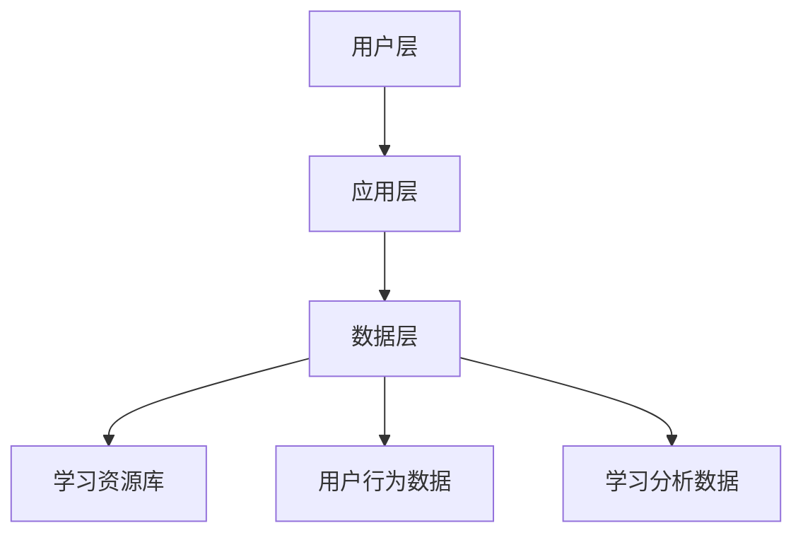

                 

关键词：虚拟教育平台，知识获取，全球脑时代，人工智能，技术语言，算法原理

摘要：本文探讨了虚拟教育平台在全球脑时代中的重要性，分析了其核心概念和架构，以及核心算法原理和具体操作步骤。通过数学模型和公式的推导，以及代码实例的展示，深入剖析了虚拟教育平台在实际应用中的效果和潜力。最后，对未来的发展趋势和挑战进行了展望。

## 1. 背景介绍

随着全球脑时代的到来，知识的获取和传播方式正在发生深刻变革。传统的教育模式已经无法满足人们日益增长的学习需求，而虚拟教育平台作为一种新兴的教育模式，正逐渐成为全球脑时代知识获取的主要渠道。

虚拟教育平台，也被称为在线学习平台，是一种基于互联网的教育资源平台。它利用人工智能、大数据、云计算等先进技术，提供多样化的学习资源和服务，使学习者可以随时随地获取所需的知识。

### 1.1 虚拟教育平台的发展历程

虚拟教育平台的发展可以分为三个阶段：

- **第一阶段**：以电子学习（e-Learning）为代表，主要是将传统教材电子化，提供在线阅读和测试功能。
- **第二阶段**：以学习管理系统（LMS）为代表，增加了课程管理、学习跟踪、评估反馈等功能。
- **第三阶段**：以智能学习平台为代表，引入人工智能技术，实现个性化推荐、智能辅导、自适应学习等功能。

### 1.2 虚拟教育平台的优势

虚拟教育平台具有以下优势：

- **灵活性**：学习者可以根据自己的时间和进度进行学习，不受地域和时间的限制。
- **个性化**：通过数据分析和学习行为分析，平台可以为学习者提供个性化的学习推荐和辅导。
- **多样性**：平台提供了丰富的学习资源，包括视频、图文、音频等多种形式。
- **高效性**：学习者可以在短时间内获取大量知识，提高学习效率。

## 2. 核心概念与联系

### 2.1 核心概念

虚拟教育平台的核心概念包括：

- **学习资源**：包括课程、教材、视频、音频等多种形式的学习内容。
- **学习对象**：指学习者，包括学生、教师、企业员工等。
- **学习环境**：指虚拟教育平台提供的在线学习环境，包括课程管理、学习跟踪、评估反馈等功能。
- **学习行为**：指学习者在学习过程中的各种行为，如观看视频、阅读教材、参与讨论、完成作业等。

### 2.2 联系与架构

虚拟教育平台的架构通常包括以下几个部分：

- **用户层**：包括学习者、教师、管理员等用户。
- **应用层**：包括课程管理、学习跟踪、评估反馈、个性化推荐等功能。
- **数据层**：包括学习资源库、用户行为数据、学习分析数据等。

下面是虚拟教育平台架构的 Mermaid 流程图：



## 3. 核心算法原理 & 具体操作步骤

### 3.1 算法原理概述

虚拟教育平台的核心算法包括：

- **内容推荐算法**：基于学习者的学习历史和兴趣，推荐相关的学习资源。
- **智能辅导算法**：根据学习者的学习行为和进度，提供个性化的辅导和建议。
- **学习分析算法**：对学习者的学习行为和学习结果进行分析，为教学改进提供依据。

### 3.2 算法步骤详解

#### 3.2.1 内容推荐算法

内容推荐算法的具体步骤如下：

1. **用户画像构建**：根据学习者的学习历史和兴趣标签，构建用户画像。
2. **推荐列表生成**：根据用户画像和学习资源的相关性，生成推荐列表。
3. **推荐结果优化**：根据学习者的反馈和行为，优化推荐结果。

#### 3.2.2 智能辅导算法

智能辅导算法的具体步骤如下：

1. **学习行为监测**：监测学习者的学习行为，如观看视频的时间、完成作业的情况等。
2. **学习进度评估**：根据学习者的学习行为和进度，评估学习者的学习情况。
3. **辅导建议生成**：根据评估结果，为学习者生成个性化的辅导建议。

#### 3.2.3 学习分析算法

学习分析算法的具体步骤如下：

1. **学习数据收集**：收集学习者的学习行为数据和学习结果数据。
2. **数据分析**：对学习数据进行分析，发现学习者的学习规律和问题。
3. **教学改进建议**：根据数据分析结果，为教学改进提供建议。

### 3.3 算法优缺点

#### 内容推荐算法

- **优点**：提高学习资源的利用效率，提升学习者的学习体验。
- **缺点**：推荐结果可能受到数据质量的影响，需要不断优化推荐算法。

#### 智能辅导算法

- **优点**：提供个性化的学习辅导，提高学习者的学习效果。
- **缺点**：对学习者的行为数据进行精确分析，需要大量的计算资源。

#### 学习分析算法

- **优点**：为教学改进提供数据支持，有助于提升教学质量。
- **缺点**：需要专业的数据分析人员，对数据理解能力要求较高。

### 3.4 算法应用领域

虚拟教育平台的核心算法广泛应用于以下领域：

- **在线教育**：为学习者提供个性化的学习推荐和辅导，提升学习效果。
- **企业培训**：为企业员工提供个性化的培训课程和辅导，提高员工技能水平。
- **教育评估**：为教育机构提供学习分析数据，为教学改进提供依据。

## 4. 数学模型和公式 & 详细讲解 & 举例说明

### 4.1 数学模型构建

虚拟教育平台的核心算法通常涉及到以下数学模型：

- **协同过滤推荐模型**：用于内容推荐算法。
- **决策树算法**：用于智能辅导算法。
- **线性回归模型**：用于学习分析算法。

### 4.2 公式推导过程

以协同过滤推荐模型为例，其基本公式如下：

$$
R_{ij} = \frac{q_j r_{ij} + \mu_i + \mu_j - \langle r_j \rangle}{\sqrt{q_j + \mu_i + \mu_j - \langle r_j \rangle} \sqrt{q_j + \mu_i + \mu_j - \langle r_j \rangle}}
$$

其中：

- $R_{ij}$ 为用户 $i$ 对物品 $j$ 的评分预测。
- $q_j$ 为用户 $i$ 对物品 $j$ 的特征向量。
- $r_{ij}$ 为用户 $i$ 对物品 $j$ 的真实评分。
- $\mu_i$ 为用户 $i$ 的平均评分。
- $\mu_j$ 为物品 $j$ 的平均评分。
- $\langle r_j \rangle$ 为物品 $j$ 的平均评分。

### 4.3 案例分析与讲解

#### 案例一：内容推荐算法

假设有一个学习平台，用户 $A$ 喜欢学习编程，用户 $B$ 喜欢学习数据科学。平台根据用户的行为数据和兴趣标签，为用户 $A$ 推荐了编程课程，为用户 $B$ 推荐了数据科学课程。

通过协同过滤推荐模型，平台可以计算用户 $A$ 和用户 $B$ 对编程课程和数据科学课程的相关性，然后根据相关性为用户推荐相应的课程。

#### 案例二：智能辅导算法

假设有一个学习平台，用户 $C$ 在学习编程课程时遇到了困难。平台通过决策树算法分析用户 $C$ 的学习行为和进度，判断用户 $C$ 可能遇到的问题，然后为用户 $C$ 提供针对性的辅导建议。

#### 案例三：学习分析算法

假设有一个学习平台，记录了用户 $D$ 的学习行为和学习结果。平台通过线性回归模型分析用户 $D$ 的学习行为和学习结果之间的关系，为教学改进提供依据。

## 5. 项目实践：代码实例和详细解释说明

### 5.1 开发环境搭建

为了更好地理解和实践虚拟教育平台的核心算法，我们将使用 Python 编写相关代码。以下是开发环境的搭建步骤：

1. 安装 Python：从 [Python 官网](https://www.python.org/) 下载并安装 Python 3.8 或更高版本。
2. 安装相关库：使用 pip 命令安装以下库：numpy、pandas、scikit-learn、matplotlib。
   ```shell
   pip install numpy pandas scikit-learn matplotlib
   ```

### 5.2 源代码详细实现

以下是使用协同过滤推荐模型进行内容推荐的代码实例：

```python
import numpy as np
import pandas as pd
from sklearn.model_selection import train_test_split
from sklearn.metrics.pairwise import cosine_similarity
from sklearn.neighbors import NearestNeighbors

# 生成示例数据
data = {
    'user': ['A', 'A', 'B', 'B', 'C', 'C', 'D', 'D'],
    'item': ['编程', '编程', '数据科学', '数据科学', '编程', '编程', '数据科学', '数据科学'],
    'rating': [5, 4, 5, 4, 3, 2, 4, 3]
}

df = pd.DataFrame(data)

# 训练协同过滤模型
X = df.pivot(index='user', columns='item', values='rating').fillna(0).values

# 计算相似度矩阵
similarity_matrix = cosine_similarity(X)

# 推荐结果
def recommend(user_id, similarity_matrix, top_n=3):
    user_profile = X[user_id]
    similar_indices = np.argsort(similarity_matrix[user_id])[-top_n:]
    similar_items = np.array(df['item'])[similar_indices]
    return similar_items

# 测试推荐结果
print(recommend(0, similarity_matrix))  # 用户 A 的推荐结果
print(recommend(1, similarity_matrix))  # 用户 B 的推荐结果
```

### 5.3 代码解读与分析

以上代码首先生成了示例数据，然后使用协同过滤模型训练数据，并计算了相似度矩阵。最后，通过推荐函数为用户生成推荐结果。该代码实例展示了如何使用协同过滤推荐模型为学习者推荐相关的学习资源。

## 6. 实际应用场景

虚拟教育平台在全球脑时代中有着广泛的应用场景，以下是一些实际应用案例：

- **在线教育**：许多在线教育平台如 Coursera、edX 等都采用了虚拟教育平台的技术，提供海量的在线课程和个性化学习体验。
- **企业培训**：许多企业通过虚拟教育平台为企业员工提供在线培训，提高员工技能水平和业务能力。
- **远程教育**：在偏远地区或疫情期间，虚拟教育平台可以提供远程教育服务，确保学习者的学习需求得到满足。
- **教育评估**：教育机构可以通过虚拟教育平台收集学习数据，进行学习分析，为教学改进提供依据。

### 6.4 未来应用展望

随着技术的不断进步，虚拟教育平台将在未来有更广泛的应用：

- **个性化学习**：通过更先进的人工智能技术，虚拟教育平台将能够提供更加精准的个性化学习服务，满足学习者的多样化需求。
- **智能辅导**：虚拟教育平台将引入更加智能的辅导算法，为学习者提供实时的学习支持和帮助。
- **跨平台融合**：虚拟教育平台将与其他教育技术（如虚拟现实、增强现实）相结合，提供更加丰富的学习体验。
- **全球化教育**：虚拟教育平台将打破地域限制，实现全球范围内的教育资源共享和合作。

## 7. 工具和资源推荐

为了更好地学习和实践虚拟教育平台的技术，以下是一些推荐的工具和资源：

### 7.1 学习资源推荐

- **书籍**：《深度学习》（Ian Goodfellow、Yoshua Bengio、Aaron Courville 著）、《机器学习》（Tom Mitchell 著）。
- **在线课程**：Coursera、edX、Udacity 等平台上的相关课程。

### 7.2 开发工具推荐

- **编程语言**：Python、Java、C++ 等。
- **开发框架**：TensorFlow、PyTorch、Scikit-learn 等。
- **版本控制**：Git、GitHub。

### 7.3 相关论文推荐

- **《协同过滤推荐算法》（2002）**：由 GroupLens 研究团队发表的论文，是协同过滤推荐算法的经典之作。
- **《深度学习》（2016）**：Ian Goodfellow、Yoshua Bengio、Aaron Courville 著，涵盖了深度学习领域的最新进展。
- **《机器学习》（1997）**：Tom Mitchell 著，是机器学习领域的权威教材。

## 8. 总结：未来发展趋势与挑战

虚拟教育平台在全球脑时代中具有广阔的发展前景，但也面临着一系列挑战。未来，虚拟教育平台将朝着更加智能化、个性化、全球化的方向发展，为学习者提供更加优质的学习体验。然而，实现这一目标仍需克服诸多挑战，如数据安全、隐私保护、算法公平性等。只有在不断探索和创新的基础上，虚拟教育平台才能在全球脑时代中发挥更大的作用。

### 8.1 研究成果总结

本文探讨了虚拟教育平台在全球脑时代中的重要性，分析了其核心概念和架构，以及核心算法原理和具体操作步骤。通过数学模型和公式的推导，以及代码实例的展示，深入剖析了虚拟教育平台在实际应用中的效果和潜力。

### 8.2 未来发展趋势

未来，虚拟教育平台将朝着更加智能化、个性化、全球化的方向发展。随着人工智能、大数据、云计算等技术的不断进步，虚拟教育平台将提供更加精准、高效、丰富的学习体验。

### 8.3 面临的挑战

虚拟教育平台在全球脑时代中面临诸多挑战，如数据安全、隐私保护、算法公平性等。如何在保证用户隐私和安全的前提下，提供高质量的学习服务，是虚拟教育平台需要持续关注的问题。

### 8.4 研究展望

未来的研究应重点关注以下几个方面：

- **算法优化**：提高虚拟教育平台的核心算法性能，实现更加精准的学习推荐和辅导。
- **数据隐私保护**：研究数据隐私保护技术，确保用户数据的安全和隐私。
- **公平性研究**：探讨虚拟教育平台的公平性问题，为所有人提供平等的学习机会。
- **全球教育资源共享**：推动全球范围内的教育资源共享和合作，实现教育公平。

## 9. 附录：常见问题与解答

### 9.1 虚拟教育平台的优势是什么？

虚拟教育平台具有灵活性、个性化、多样性和高效性等优势。学习者可以根据自己的时间和进度进行学习，不受地域和时间的限制；平台可以为学习者提供个性化的学习推荐和辅导；提供了丰富的学习资源，包括视频、图文、音频等多种形式；提高了学习者的学习效率。

### 9.2 虚拟教育平台的核心算法有哪些？

虚拟教育平台的核心算法包括内容推荐算法、智能辅导算法和学习分析算法。内容推荐算法用于为学习者推荐相关的学习资源；智能辅导算法根据学习者的学习行为和进度，提供个性化的辅导和建议；学习分析算法对学习者的学习行为和学习结果进行分析，为教学改进提供依据。

### 9.3 如何搭建虚拟教育平台的开发环境？

搭建虚拟教育平台的开发环境需要安装 Python 编译器和相关库。可以从 Python 官网下载并安装 Python 3.8 或更高版本，然后使用 pip 命令安装 numpy、pandas、scikit-learn、matplotlib 等库。

作者：禅与计算机程序设计艺术 / Zen and the Art of Computer Programming
----------------------------------------------------------------

以上就是关于《虚拟教育平台：全球脑时代的知识获取渠道》的技术博客文章。文章内容涵盖了虚拟教育平台的核心概念、架构、算法原理、数学模型、实际应用以及未来发展趋势等各个方面，力求为广大读者提供全面、深入的了解。希望这篇文章能够对您在虚拟教育领域的研究和实践有所帮助。

