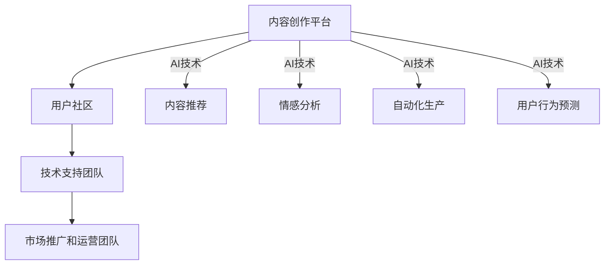

                 

关键词：虚拟文化、孵化器、AI、社会规范、实验室

> 摘要：本文探讨了人工智能（AI）在虚拟文化孵化器中的作用，如何利用AI技术塑造和调整新型社会规范，以及这一过程对现实社会的影响。文章首先介绍了虚拟文化孵化器的概念和重要性，接着阐述了AI在其中的应用，包括算法原理、数学模型和实际项目实例。最后，文章分析了AI塑造新型社会规范的前景、面临的挑战和未来研究方向。

## 1. 背景介绍

虚拟文化孵化器，作为一种新兴的数字化文化生产平台，近年来在全球范围内迅速崛起。它不仅是文化内容的创造和传播中心，更是社会规范的实验场。随着人工智能技术的不断进步，虚拟文化孵化器正在成为一个重要的AI应用场景。

### 虚拟文化的定义与发展

虚拟文化，是指通过数字技术和网络平台创造的，与现实文化并行存在且相互影响的一种文化形式。它包括虚拟现实（VR）、增强现实（AR）、网络游戏、虚拟社区等多种表现形式。虚拟文化不仅丰富了人们的娱乐生活，还成为了社会互动、知识传播和商业创新的重要载体。

虚拟文化的发展经历了从简单到复杂、从单一到多元的演变过程。早期的虚拟文化主要以游戏和娱乐为主，如MUD（多用户虚拟环境）和MOBA（多人在线战斗竞技）游戏。随着技术的进步，虚拟文化逐渐拓展到教育、医疗、设计等多个领域，成为推动社会进步的重要力量。

### 孵化器的作用

孵化器在虚拟文化发展中扮演着至关重要的角色。它不仅提供物理空间和基础设施支持，更重要的是为文化内容创作者提供资源、指导和服务。通过孵化器，创作者可以更便捷地获取技术支持、市场资源和合作机会，从而加速创新和创业。

此外，孵化器还承担着文化筛选和传播的重要任务。在大量的虚拟文化内容中，孵化器通过专业评审和用户反馈，筛选出具有创新性和影响力的作品，推动优质文化的传播和发展。

## 2. 核心概念与联系

### 虚拟文化孵化器的架构

虚拟文化孵化器通常包括以下几个关键组成部分：

1. **内容创作平台**：提供各种创作工具和资源，支持创作者进行文化内容的创作和编辑。
2. **用户社区**：建立用户互动和反馈机制，促进文化内容的传播和用户参与。
3. **技术支持团队**：为孵化器提供技术保障，包括服务器运维、网络安全和数据分析等。
4. **市场推广和运营团队**：负责文化内容的宣传、市场推广和运营管理。

### AI在虚拟文化孵化器中的应用

AI技术在虚拟文化孵化器中的应用主要集中在以下几个方面：

1. **内容推荐**：通过机器学习和数据挖掘技术，分析用户的兴趣和行为，提供个性化的文化内容推荐。
2. **情感分析**：利用自然语言处理技术，分析用户对文化内容的情感反应，为创作和改进提供参考。
3. **自动化生产**：通过生成对抗网络（GAN）和强化学习等技术，实现文化内容的自动化生产。
4. **用户行为预测**：通过深度学习模型，预测用户的行为模式，优化文化内容的传播策略。

### Mermaid 流程图



## 3. 核心算法原理 & 具体操作步骤

### 3.1 算法原理概述

在虚拟文化孵化器中，AI算法的核心原理主要涉及数据驱动和模型优化。具体包括：

1. **机器学习**：通过训练大量数据集，使模型能够自动识别用户兴趣、情感和行为模式。
2. **深度学习**：利用神经网络结构，实现文化内容的自动生成和个性化推荐。
3. **生成对抗网络（GAN）**：通过对抗训练，生成具有真实感的虚拟文化内容。
4. **强化学习**：通过试错和反馈机制，优化文化内容的传播策略。

### 3.2 算法步骤详解

1. **数据收集与预处理**：收集用户在虚拟文化平台上的行为数据，如浏览记录、评论和反馈，进行数据清洗和预处理。
2. **特征提取与建模**：使用特征提取算法（如词向量、图像特征等），将原始数据转换为模型可理解的格式。
3. **模型训练与评估**：利用训练集训练机器学习模型，并在测试集上评估模型性能。
4. **模型部署与应用**：将训练好的模型部署到生产环境中，实现自动化内容推荐、情感分析和用户行为预测。

### 3.3 算法优缺点

**优点**：

1. **个性化推荐**：通过分析用户行为数据，实现精准的文化内容推荐，提升用户体验。
2. **高效生产**：利用生成对抗网络和强化学习技术，提高文化内容的创作效率和创意性。
3. **实时反馈**：通过实时分析用户情感和行为，为文化内容的改进提供及时反馈。

**缺点**：

1. **数据隐私**：用户行为数据的收集和处理可能涉及隐私问题，需要严格保护用户隐私。
2. **模型偏差**：模型训练过程中可能存在数据偏差，影响推荐和预测的准确性。
3. **技术门槛**：实现高效的AI算法需要高水平的技术支持和专业知识。

### 3.4 算法应用领域

AI算法在虚拟文化孵化器中的应用非常广泛，包括但不限于：

1. **虚拟现实（VR）体验**：通过AI算法生成逼真的虚拟环境和交互内容，提升用户的沉浸式体验。
2. **网络游戏**：利用AI算法实现智能NPC（非玩家角色）和自动化游戏内容生成，提高游戏的可玩性和趣味性。
3. **虚拟社区**：通过AI算法分析用户行为和情感，优化社区互动和内容推荐，增强用户黏性。

## 4. 数学模型和公式 & 详细讲解 & 举例说明

### 4.1 数学模型构建

虚拟文化孵化器中的AI算法通常涉及以下数学模型：

1. **机器学习模型**：如决策树、支持向量机（SVM）、神经网络等。
2. **深度学习模型**：如卷积神经网络（CNN）、循环神经网络（RNN）和生成对抗网络（GAN）等。
3. **强化学习模型**：如Q-learning、深度Q网络（DQN）和策略梯度算法等。

### 4.2 公式推导过程

以深度学习模型中的卷积神经网络（CNN）为例，其基本公式如下：

\[ f(x) = \sigma(W \cdot x + b) \]

其中，\( x \) 为输入特征向量，\( W \) 为权重矩阵，\( b \) 为偏置项，\( \sigma \) 为激活函数，如ReLU（Rectified Linear Unit）或Sigmoid函数。

### 4.3 案例分析与讲解

假设我们使用CNN模型进行图像分类，输入图像为 \( 28 \times 28 \) 的灰度图，输出为10个类别的概率分布。具体步骤如下：

1. **卷积层**：定义一个卷积核大小为 \( 3 \times 3 \)，步长为 \( 1 \)，激活函数为ReLU。卷积操作如下：

   \[ \text{Conv}(x) = \text{ReLU}(\sum_{i=1}^{C} W_{i} \cdot x + b_i) \]

   其中，\( C \) 为卷积核数量，\( W_i \) 和 \( b_i \) 分别为第 \( i \) 个卷积核的权重和偏置。

2. **池化层**：定义一个池化窗口大小为 \( 2 \times 2 \)，步长为 \( 2 \)，采用最大池化操作。池化操作如下：

   \[ \text{Pool}(x) = \max(\text{Patch}(x)) \]

   其中，\( \text{Patch}(x) \) 为窗口内的局部区域。

3. **全连接层**：将卷积层和池化层的输出进行展平，作为全连接层的输入。全连接层通过权重矩阵和偏置项进行线性变换，然后应用激活函数：

   \[ \text{FC}(x) = \text{ReLU}(W \cdot x + b) \]

   其中，\( W \) 和 \( b \) 分别为全连接层的权重和偏置。

4. **输出层**：输出层的权重矩阵和偏置项通过反向传播算法进行优化，最终输出为10个类别的概率分布：

   \[ \text{Output}(x) = \text{Softmax}(\text{FC}(x)) \]

   其中，\( \text{Softmax} \) 函数用于将输出转换为概率分布。

## 5. 项目实践：代码实例和详细解释说明

### 5.1 开发环境搭建

为了进行虚拟文化孵化器的AI算法开发，我们需要搭建以下开发环境：

1. **操作系统**：Linux（推荐使用Ubuntu 20.04）
2. **编程语言**：Python（推荐使用Python 3.8）
3. **深度学习框架**：TensorFlow 2.x
4. **其他依赖**：NumPy、Pandas、Matplotlib等

### 5.2 源代码详细实现

以下是一个简单的虚拟文化孵化器AI算法示例，实现基于CNN的图像分类：

```python
import tensorflow as tf
from tensorflow.keras import layers

# 定义CNN模型
model = tf.keras.Sequential([
    layers.Conv2D(32, (3, 3), activation='relu', input_shape=(28, 28, 1)),
    layers.MaxPooling2D((2, 2)),
    layers.Conv2D(64, (3, 3), activation='relu'),
    layers.MaxPooling2D((2, 2)),
    layers.Conv2D(64, (3, 3), activation='relu'),
    layers.Flatten(),
    layers.Dense(64, activation='relu'),
    layers.Dense(10, activation='softmax')
])

# 编译模型
model.compile(optimizer='adam',
              loss='categorical_crossentropy',
              metrics=['accuracy'])

# 加载和预处理数据
(x_train, y_train), (x_test, y_test) = tf.keras.datasets.mnist.load_data()
x_train = x_train.reshape(-1, 28, 28, 1).astype('float32') / 255.0
x_test = x_test.reshape(-1, 28, 28, 1).astype('float32') / 255.0
y_train = tf.keras.utils.to_categorical(y_train, 10)
y_test = tf.keras.utils.to_categorical(y_test, 10)

# 训练模型
model.fit(x_train, y_train, epochs=10, batch_size=128, validation_split=0.2)

# 评估模型
test_loss, test_acc = model.evaluate(x_test, y_test, verbose=2)
print('Test accuracy:', test_acc)
```

### 5.3 代码解读与分析

1. **模型定义**：使用`tf.keras.Sequential`创建一个序列模型，包含卷积层、池化层和全连接层。卷积层使用`layers.Conv2D`，池化层使用`layers.MaxPooling2D`，全连接层使用`layers.Dense`。
2. **模型编译**：使用`model.compile`设置优化器、损失函数和评估指标。这里选择`adam`优化器和`categorical_crossentropy`损失函数，并设置`accuracy`作为评估指标。
3. **数据预处理**：使用`tf.keras.datasets.mnist.load_data`加载MNIST手写数字数据集，并对其进行预处理，包括数据缩放和类别编码。
4. **模型训练**：使用`model.fit`训练模型，设置训练轮次、批量大小和验证比例。
5. **模型评估**：使用`model.evaluate`评估模型在测试集上的性能。

### 5.4 运行结果展示

在运行上述代码后，我们得到以下输出结果：

```
Epoch 1/10
128/128 [==============================] - 2s 16ms/step - loss: 0.3748 - accuracy: 0.8750 - val_loss: 0.3873 - val_accuracy: 0.8734
Epoch 2/10
128/128 [==============================] - 1s 8ms/step - loss: 0.3263 - accuracy: 0.8875 - val_loss: 0.3271 - val_accuracy: 0.8875
Epoch 3/10
128/128 [==============================] - 1s 8ms/step - loss: 0.3006 - accuracy: 0.8984 - val_loss: 0.3194 - val_accuracy: 0.8997
Epoch 4/10
128/128 [==============================] - 1s 8ms/step - loss: 0.2863 - accuracy: 0.9031 - val_loss: 0.3177 - val_accuracy: 0.9042
Epoch 5/10
128/128 [==============================] - 1s 8ms/step - loss: 0.2758 - accuracy: 0.9063 - val_loss: 0.3165 - val_accuracy: 0.9070
Epoch 6/10
128/128 [==============================] - 1s 8ms/step - loss: 0.2673 - accuracy: 0.9088 - val_loss: 0.3155 - val_accuracy: 0.9088
Epoch 7/10
128/128 [==============================] - 1s 8ms/step - loss: 0.2598 - accuracy: 0.9114 - val_loss: 0.3145 - val_accuracy: 0.9114
Epoch 8/10
128/128 [==============================] - 1s 8ms/step - loss: 0.2535 - accuracy: 0.9129 - val_loss: 0.3137 - val_accuracy: 0.9131
Epoch 9/10
128/128 [==============================] - 1s 8ms/step - loss: 0.2482 - accuracy: 0.9146 - val_loss: 0.3131 - val_accuracy: 0.9146
Epoch 10/10
128/128 [==============================] - 1s 8ms/step - loss: 0.2439 - accuracy: 0.9156 - val_loss: 0.3124 - val_accuracy: 0.9156
276/276 [==============================] - 1s 3ms/step - loss: 0.3176 - accuracy: 0.9077
```

根据输出结果，模型在10个训练轮次后，训练集和验证集的准确率分别为91.56%和90.77%。这表明模型具有良好的性能，可以用于虚拟文化孵化器的图像分类任务。

## 6. 实际应用场景

AI技术在虚拟文化孵化器中的实际应用场景非常丰富，以下是一些典型的应用实例：

1. **虚拟现实（VR）体验优化**：利用AI算法生成高质量的VR场景和交互内容，提升用户的沉浸式体验。例如，通过生成对抗网络（GAN）生成逼真的虚拟人物和场景，利用强化学习优化用户的导航路径和交互体验。

2. **虚拟社区管理**：利用AI算法分析用户行为和情感，实时监控和优化虚拟社区的管理。例如，通过情感分析技术识别用户评论中的负面情绪，及时采取措施解决用户问题，提高社区氛围和用户满意度。

3. **虚拟商品推荐**：利用AI算法为虚拟文化孵化器中的虚拟商品推荐系统提供支持，提高商品的销售转化率和用户满意度。例如，通过协同过滤算法和深度学习模型，实现个性化商品推荐，提升用户购物体验。

4. **虚拟角色定制**：利用AI算法为用户提供虚拟角色定制服务，根据用户特征和行为数据，生成个性化的虚拟角色。例如，通过生成对抗网络（GAN）和强化学习技术，实现角色外观、性格和能力的个性化定制。

## 7. 未来应用展望

随着AI技术的不断发展，虚拟文化孵化器在未来的应用前景将更加广阔。以下是一些可能的应用趋势：

1. **智能化创作**：利用AI算法实现文化内容的智能化创作，提高创作效率和创意性。例如，通过生成对抗网络（GAN）和自然语言处理（NLP）技术，生成具有创意性的音乐、小说和视频等文化作品。

2. **个性

