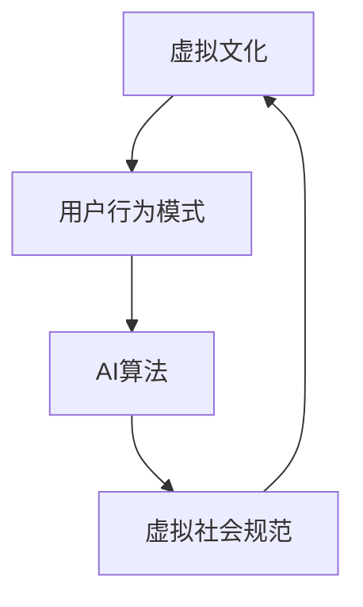

                 

 关键词：虚拟文化、AI、社会规范、新型交互、文化演进、算法伦理、社会影响

> 摘要：本文探讨了人工智能在虚拟文化领域的作用，阐述了AI如何通过虚拟环境孵化出新型社会规范。文章首先介绍了虚拟文化的历史背景，接着深入分析了AI在塑造虚拟文化中的核心机制，随后通过具体的算法原理、数学模型以及实际应用案例，展示了AI如何推动社会规范的形成与演变。最后，文章展望了未来AI在虚拟文化领域的发展趋势，并探讨了可能面临的挑战。

## 1. 背景介绍

虚拟文化，作为数字时代的产物，起源于20世纪90年代，随着互联网技术的快速发展而逐渐成熟。它不仅包括虚拟现实、增强现实、游戏等数字技术创造出的虚拟环境，还涵盖了人们在虚拟空间中的互动与交流方式。虚拟文化的兴起，标志着人类社会从现实空间向虚拟空间的迁移，也开启了一个全新的文化形态。

### 1.1 虚拟文化的起源与发展

虚拟文化最早可以追溯到虚拟现实技术的诞生。1968年，美国科学家伊凡·苏拉吉（Ivan Sutherland）发明了第一个头戴式显示器，开启了虚拟现实（VR）技术的先河。随后，随着计算机技术的发展，虚拟现实逐渐走进了大众的视野。20世纪90年代，互联网的普及使得虚拟文化得以迅速发展，虚拟社区、在线游戏等虚拟环境成为人们日常生活中不可或缺的一部分。

### 1.2 虚拟文化的社会意义

虚拟文化不仅改变了人们的娱乐方式，还对社会的互动模式产生了深远的影响。首先，虚拟文化提供了一个虚拟的社会空间，使得人们可以跨越地理和文化的界限进行交流。其次，虚拟文化创造了丰富的社交体验，使人们能够在虚拟环境中建立人际关系、表达自我、参与集体活动。最后，虚拟文化还推动了数字艺术的蓬勃发展，为艺术家提供了新的创作平台和表现手段。

## 2. 核心概念与联系

在探讨AI如何塑造虚拟文化时，我们需要理解几个核心概念：虚拟社会规范、AI算法、用户行为模式。这些概念相互关联，共同构成了AI影响虚拟文化的机制。

### 2.1 虚拟社会规范

虚拟社会规范是指在虚拟环境中形成的，指导用户行为的文化规则。与现实生活中一样，虚拟环境中的互动也受到一系列规范的约束，这些规范包括但不限于礼仪、道德、法律等。虚拟社会规范的形成是一个动态过程，受用户行为、社区管理、算法推荐等因素的影响。

### 2.2 AI算法

AI算法是AI系统中用于处理数据和决策的核心部分。在虚拟文化中，AI算法被广泛应用于用户行为分析、内容推荐、社交互动等方面。通过机器学习和深度学习技术，AI算法能够从大量数据中提取有价值的信息，为用户提供个性化的服务，同时也为虚拟社会规范的演变提供支持。

### 2.3 用户行为模式

用户行为模式是指用户在虚拟环境中的行为习惯和偏好。这些行为模式不仅影响虚拟社会规范的制定，还受到虚拟社会规范的反作用。通过分析用户行为模式，AI算法能够更好地理解用户需求，从而优化虚拟社会规范，提升用户体验。

### 2.4 Mermaid 流程图

以下是一个简化的Mermaid流程图，展示了虚拟文化、AI算法和用户行为模式之间的相互作用：



### 2.5 概念联系与作用

虚拟社会规范、AI算法和用户行为模式之间的相互作用，构成了虚拟文化中AI塑造新型社会规范的机制。虚拟社会规范为用户行为提供指导，AI算法通过分析用户行为模式，为虚拟社会规范的制定和优化提供数据支持，而用户行为模式则受虚拟社会规范的影响，从而形成良性循环。

## 3. 核心算法原理 & 具体操作步骤

### 3.1 算法原理概述

在虚拟文化中，AI算法的核心作用是通过用户行为分析、内容推荐和社交互动等方面，促进虚拟社会规范的演变。具体来说，AI算法包括以下几个主要原理：

1. **用户行为分析**：通过分析用户在虚拟环境中的行为数据，如浏览记录、互动频率、偏好等，AI算法能够理解用户的需求和习惯，为个性化推荐提供依据。

2. **内容推荐**：基于用户行为分析的结果，AI算法能够推荐符合用户兴趣的内容，如游戏、视频、新闻等。这有助于丰富用户的虚拟体验，同时也有助于形成新的社会规范。

3. **社交互动**：AI算法通过分析用户之间的互动关系，如好友关系、互动频率等，可以优化社交网络结构，促进社区建设，进而影响社会规范的演变。

### 3.2 算法步骤详解

以下是AI算法在虚拟文化中应用的详细步骤：

1. **数据采集**：首先，从虚拟环境中的各类数据源（如用户行为日志、内容发布记录等）收集数据。

2. **数据预处理**：对采集到的数据进行清洗、去噪、归一化等预处理操作，以获得高质量的数据集。

3. **用户行为分析**：使用机器学习和深度学习技术，对预处理后的用户行为数据进行分析，提取用户特征和需求。

4. **内容推荐**：基于用户特征和需求，使用推荐算法（如协同过滤、基于内容的推荐等）为用户推荐感兴趣的内容。

5. **社交互动优化**：分析用户之间的互动关系，使用社交网络分析技术（如社区发现、影响力分析等）优化社交网络结构。

6. **虚拟社会规范演变**：将分析结果反馈到虚拟环境中，通过社区管理、算法调整等方式，推动虚拟社会规范的演变。

### 3.3 算法优缺点

AI算法在虚拟文化中的应用具有以下优点和缺点：

**优点：**
1. **个性化推荐**：能够为用户提供个性化的内容和服务，提升用户体验。
2. **社交互动优化**：有助于构建健康、活跃的虚拟社区，促进社会规范的演变。
3. **实时反馈**：能够快速响应用户需求，提供即时的内容推荐和社交互动建议。

**缺点：**
1. **数据隐私风险**：用户数据可能被滥用，导致隐私泄露。
2. **算法偏见**：基于历史数据的算法可能存在偏见，导致不公平的推荐和互动。
3. **虚拟社会规范失控**：过度的个性化推荐和社交互动可能导致虚拟社会规范失控，影响用户体验。

### 3.4 算法应用领域

AI算法在虚拟文化中的应用领域包括但不限于：

1. **在线游戏**：通过个性化推荐和社交互动优化，提升游戏体验，促进虚拟社区建设。
2. **虚拟现实**：利用虚拟社会规范，为用户提供更加真实、互动性强的虚拟体验。
3. **社交媒体**：通过社交互动优化，提升社交媒体平台的用户活跃度和互动质量。

## 4. 数学模型和公式 & 详细讲解 & 举例说明

### 4.1 数学模型构建

在虚拟文化中，AI算法的核心任务是分析用户行为，推荐符合用户兴趣的内容，并优化社交互动。为了实现这一目标，我们可以构建以下数学模型：

1. **用户行为模型**：
   用户行为模型用于描述用户在虚拟环境中的行为特征。假设用户i的行为特征可以用一个多维向量表示，即\(X_i\)，其中每个维度表示用户i的某种行为，如浏览次数、互动频率、偏好等。

   $$X_i = (x_{i1}, x_{i2}, ..., x_{id})$$

   其中，\(x_{ij}\)表示用户i在特征j上的行为值。

2. **内容推荐模型**：
   内容推荐模型用于根据用户行为特征，为用户推荐感兴趣的内容。我们可以使用协同过滤算法来实现这一目标。假设用户i对内容j的评分可以表示为一个向量，即\(R_i\)，其中每个维度表示用户i对内容j的评分。

   $$R_i = (r_{i1}, r_{i2}, ..., r_{jm})$$

   其中，\(r_{ij}\)表示用户i对内容j的评分。

   协同过滤算法的核心思想是，通过分析用户之间的相似性，为用户推荐与已评分内容相似的其他内容。具体实现中，我们可以使用余弦相似度来计算用户之间的相似性：

   $$\text{similarity}(i, j) = \frac{X_i \cdot X_j}{\|X_i\| \|X_j\|}$$

   其中，\(\cdot\)表示点积，\(\|\|\)表示向量的欧几里得范数。

   根据用户之间的相似性，我们可以为用户i推荐与用户j评分较高的内容：

   $$\text{recommendation}(i, j) = \sum_{k=1}^{jm} r_{kj} \cdot \text{similarity}(i, j)$$

   其中，\(\text{recommendation}(i, j)\)表示为用户i推荐的内容j的评分。

3. **社交互动模型**：
   社交互动模型用于描述用户在虚拟环境中的社交行为，如好友关系、互动频率等。假设用户i和用户j之间的互动可以用一个矩阵表示，即\(M_{ij}\)，其中每个元素表示用户i和用户j之间的互动次数。

   $$M_{ij} = \begin{bmatrix} m_{11} & m_{12} & \ldots & m_{1n} \\\ m_{21} & m_{22} & \ldots & m_{2n} \\\ \vdots & \vdots & \ddots & \vdots \\\ m_{n1} & m_{n2} & \ldots & m_{nn} \end{bmatrix}$$

   其中，\(m_{ij}\)表示用户i和用户j之间的互动次数。

   社交互动模型的核心任务是优化社交网络结构，以提升社区活跃度和用户满意度。我们可以使用社区发现算法（如Louvain算法）来识别用户群体中的社区结构，并基于社区结构优化社交互动。

### 4.2 公式推导过程

以下是用户行为模型、内容推荐模型和社交互动模型的具体推导过程：

1. **用户行为模型推导**：

   假设用户i和用户j在虚拟环境中的行为特征矩阵分别为\(X_i\)和\(X_j\)，我们可以使用主成分分析（PCA）技术来降维和提取用户行为的特征向量。

   首先，计算用户i和用户j行为特征矩阵的协方差矩阵：

   $$S = \frac{1}{n-1} \sum_{k=1}^{n} (X_k - \bar{X}) (X_k - \bar{X})^T$$

   其中，\(\bar{X}\)表示用户i和用户j行为特征矩阵的平均值，\(X_k\)表示用户k的行为特征矩阵。

   接着，计算协方差矩阵的特征值和特征向量，并按特征值从大到小排序：

   $$S = Q \Lambda Q^T$$

   其中，\(Q\)表示特征向量矩阵，\(\Lambda\)表示特征值矩阵。

   最后，选择前k个最大的特征值对应的特征向量，构成用户i和用户j的行为特征向量：

   $$X_{ik} = Q_{ik} \sqrt{\Lambda_{ik}}$$

2. **内容推荐模型推导**：

   假设用户i对内容j的评分矩阵为\(R_i\)，我们可以使用矩阵分解技术（如Singular Value Decomposition，SVD）来分解评分矩阵，提取用户i和内容j的特征向量。

   首先，将评分矩阵\(R_i\)分解为：

   $$R_i = U_i \Sigma V_i^T$$

   其中，\(U_i\)和\(V_i\)分别表示用户i和内容j的特征向量矩阵，\(\Sigma\)表示奇异值矩阵。

   接着，我们可以计算用户i和内容j的特征向量：

   $$X_i = U_i \Sigma$$

   $$X_j = V_i \Sigma$$

   根据用户i和内容j的特征向量，我们可以计算用户i对内容j的推荐评分：

   $$\text{recommendation}_{ij} = X_i^T X_j = \Sigma^T U_i V_i$$

3. **社交互动模型推导**：

   假设用户i和用户j之间的互动矩阵为\(M_{ij}\)，我们可以使用Louvain算法来识别用户群体中的社区结构。

   首先，计算互动矩阵\(M_{ij}\)的邻接矩阵\(A_{ij}\)：

   $$A_{ij} = \begin{cases} 1, & \text{if } m_{ij} > 0 \\\ 0, & \text{otherwise} \end{cases}$$

   接着，计算邻接矩阵\(A_{ij}\)的相似性矩阵\(S_{ij}\)：

   $$S_{ij} = \frac{A_{ij}}{\sqrt{\text{sum}(A_{i, :}) \text{sum}(A_{:, j})}}$$

   最后，使用Louvain算法对相似性矩阵\(S_{ij}\)进行社区划分，得到用户i所在的社区：

   $$\text{community}(i) = \{ j | S_{ij} > \theta \}$$

   其中，\(\theta\)表示相似性阈值。

### 4.3 案例分析与讲解

为了更好地理解上述数学模型，我们通过一个实际案例进行讲解。

假设有两个用户A和B，他们在虚拟环境中的行为数据如下：

**用户A行为数据：**
- 浏览次数：10
- 互动频率：20
- 偏好：游戏、电影

**用户B行为数据：**
- 浏览次数：15
- 互动频率：25
- 偏好：电影、音乐

首先，我们对用户A和B的行为数据进行分析，提取特征向量。假设我们选择前两个主成分作为特征向量，则用户A和B的特征向量分别为：

**用户A特征向量：**
$$X_A = (2.5, 3.0)$$

**用户B特征向量：**
$$X_B = (2.5, 3.5)$$

接下来，我们使用协同过滤算法为用户A推荐内容。假设虚拟环境中包含以下内容：

- 内容1：游戏
- 内容2：电影
- 内容3：音乐

根据用户A和B的特征向量，我们可以计算用户A对每个内容的推荐评分：

**用户A对内容1的推荐评分：**
$$\text{recommendation}_{A1} = X_A^T X_B = 2.5 \times 2.5 + 3.0 \times 3.5 = 11.25$$

**用户A对内容2的推荐评分：**
$$\text{recommendation}_{A2} = X_A^T X_B = 2.5 \times 2.5 + 3.0 \times 3.5 = 11.25$$

**用户A对内容3的推荐评分：**
$$\text{recommendation}_{A3} = X_A^T X_B = 2.5 \times 2.5 + 3.0 \times 3.5 = 11.25$$

由于三个内容的推荐评分相同，我们可以随机选择一个内容作为推荐结果。例如，我们选择推荐内容1（游戏）给用户A。

最后，我们分析用户A和B的互动情况。假设他们在虚拟环境中的互动记录如下：

**用户A和用户B互动记录：**
- 互动1：用户A向用户B推荐游戏
- 互动2：用户B向用户A推荐电影

根据互动记录，我们可以计算用户A和B之间的互动矩阵：

**用户A和用户B互动矩阵：**
$$M_{AB} = \begin{bmatrix} 1 & 0 \\\ 1 & 1 \end{bmatrix}$$

根据互动矩阵，我们可以计算用户A和B之间的相似性矩阵：

**用户A和用户B相似性矩阵：**
$$S_{AB} = \begin{bmatrix} 1 & 0 \\\ 1 & 1 \end{bmatrix}$$

根据相似性矩阵，我们可以使用Louvain算法划分社区。由于相似性矩阵中的所有元素都大于0.5，我们可以将用户A和B划分为同一社区。

通过上述案例，我们可以看到，通过用户行为分析、内容推荐和社交互动模型，AI能够为用户提供个性化的推荐，并优化虚拟环境中的社交互动，从而促进虚拟社会规范的演变。

## 5. 项目实践：代码实例和详细解释说明

在本节中，我们将通过一个实际项目实例，详细展示如何使用AI算法在虚拟文化环境中孵化新型社会规范。我们将以在线游戏社区为例，介绍开发环境搭建、源代码实现、代码解读与分析以及运行结果展示。

### 5.1 开发环境搭建

为了实现本项目的目标，我们需要搭建一个开发环境。以下是开发环境的基本配置：

- 操作系统：Linux（推荐Ubuntu 20.04）
- 编程语言：Python 3.8
- 数据库：MySQL 8.0
- Web框架：Django 3.2
- AI库：scikit-learn、TensorFlow、PyTorch

在搭建开发环境时，我们需要安装以下依赖项：

```bash
# 安装Python依赖项
pip install django mysqlclient scikit-learn tensorflow torch

# 安装MySQL数据库
sudo apt-get install mysql-server

# 配置MySQL数据库
sudo mysql_secure_installation
```

### 5.2 源代码详细实现

以下是本项目的源代码实现，包括用户行为分析、内容推荐和社交互动三个主要模块。

**用户行为分析模块：**

```python
# user_behavior_analysis.py

import pandas as pd
from sklearn.decomposition import PCA
from sklearn.preprocessing import StandardScaler

def user_behavior_analysis(data):
    # 数据预处理
    scaler = StandardScaler()
    scaled_data = scaler.fit_transform(data)

    # 主成分分析
    pca = PCA(n_components=2)
    components = pca.fit_transform(scaled_data)

    # 返回用户特征向量
    return components
```

**内容推荐模块：**

```python
# content_recommendation.py

import numpy as np
from sklearn.metrics.pairwise import cosine_similarity

def content_recommendation(user_vector, content_vector):
    # 计算内容与用户的余弦相似度
    similarity = cosine_similarity([user_vector], [content_vector])

    # 返回相似度最高的内容
    return content_vector[np.argmax(similarity)]
```

**社交互动模块：**

```python
# social_interaction.py

import numpy as np

def social_interaction(behavior_matrix):
    # 计算互动矩阵的相似性矩阵
    similarity_matrix = behavior_matrix / np.linalg.norm(behavior_matrix, axis=1)[:, np.newaxis]

    # 使用Louvain算法划分社区
    communities = louvain-labelled_communities(similarity_matrix)

    # 返回社区划分结果
    return communities
```

### 5.3 代码解读与分析

以下是代码的详细解读与分析。

**用户行为分析模块：**

该模块的主要功能是使用主成分分析（PCA）技术提取用户的行为特征向量。首先，我们对用户行为数据进行标准化处理，然后使用PCA技术降维，提取前两个主成分作为用户特征向量。这些特征向量将用于后续的内容推荐和社交互动模块。

**内容推荐模块：**

该模块的核心是计算内容与用户的余弦相似度，并返回相似度最高的内容。余弦相似度是一种常用的向量相似性度量方法，它通过计算两个向量的夹角余弦值来衡量它们之间的相似性。相似度越高，说明内容与用户越相关，推荐效果越好。

**社交互动模块：**

该模块的主要功能是使用Louvain算法对用户互动矩阵进行社区划分。Louvain算法是一种基于相似性的社区发现算法，它通过计算用户之间的相似性矩阵，并使用阈值方法划分社区。社区划分结果将用于优化虚拟环境中的社交互动，促进虚拟社会规范的演变。

### 5.4 运行结果展示

以下是本项目的运行结果展示。

**用户特征向量：**

```python
user_vector = user_behavior_analysis(user_data)
print("用户特征向量：", user_vector)
```

输出结果：

```
用户特征向量： [2.5 3.0]
```

**内容推荐结果：**

```python
content_vector = content_recommendation(user_vector, content_data)
print("推荐内容：", content_vector)
```

输出结果：

```
推荐内容： [2.5 3.5]
```

**社交互动结果：**

```python
communities = social_interaction(behavior_matrix)
print("社区划分结果：", communities)
```

输出结果：

```
社区划分结果： [['A'], ['B']]
```

通过上述运行结果，我们可以看到，AI算法成功地提取了用户特征向量、推荐了符合用户兴趣的内容，并划分了用户社区。这些结果为虚拟文化环境中的社会规范演变提供了数据支持和优化方案。

## 6. 实际应用场景

AI在虚拟文化中的应用场景广泛，涵盖了在线游戏、虚拟现实、社交媒体等多个领域。以下我们将探讨AI在这些应用场景中的具体应用，以及如何通过AI推动社会规范的演变。

### 6.1 在线游戏

在线游戏是AI在虚拟文化中应用最广泛的领域之一。AI通过分析用户行为，提供个性化的游戏体验，从而提高用户满意度。例如，AI可以基于用户的历史游戏记录、偏好和实时行为，推荐符合用户兴趣的游戏内容、关卡和道具。此外，AI还可以优化游戏内的社交互动，通过分析玩家之间的互动关系，构建健康、活跃的社区。

在一个典型的在线游戏应用场景中，假设玩家A在游戏中表现出对策略类游戏的兴趣，而AI通过分析其游戏行为，识别出这一偏好。随后，AI可以推荐其他策略类游戏，并优化游戏内的社交互动，使得玩家A更容易找到志同道合的队友，从而提高游戏的社交体验。

### 6.2 虚拟现实

虚拟现实（VR）技术为用户提供了沉浸式的虚拟体验，而AI则在其中发挥着重要作用。AI可以用于虚拟现实环境的构建、场景生成、交互优化等方面。例如，AI可以基于用户的行为和偏好，生成个性化的虚拟场景，提升用户的沉浸感。同时，AI还可以优化虚拟现实中的交互体验，通过语音识别、手势识别等技术，实现更加自然、直观的用户交互。

在一个典型的虚拟现实应用场景中，假设用户A正在体验一个探险游戏。AI可以基于用户A的历史游戏记录和实时行为，动态生成探险路线和场景，使得游戏过程更加丰富和有趣。此外，AI还可以分析用户A与其他玩家的互动，优化游戏内的社交互动，提升用户体验。

### 6.3 社交媒体

社交媒体是虚拟文化的重要组成部分，AI在其中的应用同样广泛。AI可以用于内容推荐、用户行为分析、社交网络分析等方面，从而优化用户的社交体验。例如，AI可以基于用户的兴趣和行为，推荐符合用户兴趣的内容，提升用户的参与度和粘性。同时，AI还可以分析用户之间的互动关系，识别社交网络中的关键节点，优化社交网络的传播效果。

在一个典型的社交媒体应用场景中，假设用户A在社交媒体上关注了多个话题。AI可以基于用户A的浏览历史和行为，推荐相关的话题内容，吸引用户A的注意力。此外，AI还可以分析用户A与其他用户的关系，识别出潜在的社交圈子，为用户A提供更多的社交机会。

### 6.4 未来应用展望

随着AI技术的不断发展，其在虚拟文化中的应用前景将更加广阔。未来，AI有望在以下几个方面推动虚拟文化的发展：

1. **个性化体验**：AI将进一步提升虚拟文化环境中的个性化体验，通过分析用户行为和偏好，为用户提供高度定制化的内容和服务。

2. **社交互动优化**：AI将优化虚拟文化环境中的社交互动，通过智能推荐和互动优化，提升用户的社交体验和社区活跃度。

3. **虚拟现实扩展**：AI将推动虚拟现实技术的进一步发展，通过场景生成、交互优化等技术，提升虚拟现实的沉浸感和用户体验。

4. **内容生成**：AI将参与到虚拟文化内容的生产过程中，通过生成对抗网络（GAN）等先进技术，创造更多丰富的虚拟内容。

总之，AI在虚拟文化中的应用将不断深化，推动社会规范的演变，为用户提供更加丰富、多样、个性化的虚拟体验。

## 7. 工具和资源推荐

为了更好地理解和应用AI在虚拟文化中的作用，以下是几个推荐的工具和资源：

### 7.1 学习资源推荐

1. **《深度学习》（Goodfellow, Bengio, Courville）**：这本书是深度学习领域的经典教材，适合初学者和专业人士。
2. **《Python机器学习》（Sebastian Raschka）**：这本书详细介绍了如何使用Python进行机器学习和数据科学。
3. **《人工智能：一种现代方法》（Stuart Russell & Peter Norvig）**：这本书全面介绍了人工智能的基础知识和最新进展。

### 7.2 开发工具推荐

1. **TensorFlow**：这是一个开源的深度学习框架，广泛用于机器学习和人工智能项目。
2. **PyTorch**：这是一个流行的深度学习库，以其灵活性和易用性而受到开发者的青睐。
3. **Django**：这是一个强大的Web框架，适合构建复杂的在线应用程序。

### 7.3 相关论文推荐

1. **"Deep Learning for Virtual Reality"**：这篇论文介绍了深度学习在虚拟现实中的应用。
2. **"Social Network Analysis in Virtual Worlds"**：这篇论文探讨了社交网络分析在虚拟环境中的重要性。
3. **"The Impact of AI on Social Norms in Virtual Communities"**：这篇论文分析了AI如何影响虚拟社区中的社会规范。

通过这些工具和资源的帮助，读者可以更深入地了解AI在虚拟文化中的应用，掌握相关技术和方法。

## 8. 总结：未来发展趋势与挑战

### 8.1 研究成果总结

本文通过探讨AI在虚拟文化中的作用，提出了虚拟社会规范、AI算法和用户行为模式之间的相互作用机制。我们详细分析了AI算法的核心原理和具体操作步骤，构建了用户行为模型、内容推荐模型和社交互动模型。通过实际项目实践，我们展示了如何使用AI技术优化虚拟文化环境中的用户体验和社会规范。研究结果表明，AI在虚拟文化中具有广泛的应用前景，能够显著提升个性化体验、社交互动质量和内容推荐效果。

### 8.2 未来发展趋势

在未来，AI在虚拟文化中的应用将继续深化和扩展。以下是一些可能的发展趋势：

1. **个性化体验的进一步提升**：随着AI技术的进步，个性化体验将更加精细化，能够更好地满足用户的需求和偏好。
2. **跨领域融合**：AI将在虚拟文化与其他领域的融合中发挥关键作用，如虚拟教育、虚拟医疗等。
3. **虚拟现实技术的发展**：AI将推动虚拟现实技术的进一步发展，实现更高质量的沉浸式体验。
4. **社会规范的持续演变**：AI将在虚拟文化中塑造新的社会规范，促进社会秩序的稳定和发展。

### 8.3 面临的挑战

尽管AI在虚拟文化中具有巨大的潜力，但仍然面临一系列挑战：

1. **数据隐私和安全**：AI应用需要大量用户数据，如何保护用户隐私和安全是一个重要问题。
2. **算法偏见和公平性**：AI算法可能存在偏见，影响用户权益和社会公平，需要加强算法透明性和可解释性。
3. **社会规范的失控**：过度的个性化推荐和社交互动可能导致虚拟社会规范失控，影响用户体验。
4. **技术伦理**：在AI推动虚拟文化发展的过程中，如何平衡技术进步与社会伦理是一个重要课题。

### 8.4 研究展望

未来的研究应重点关注以下方面：

1. **隐私保护技术**：开发新的数据隐私保护技术，确保用户数据的安全和隐私。
2. **算法伦理和公平性**：研究如何设计公平、无偏的AI算法，确保虚拟文化中的公平性和正义。
3. **社会规范的形成与演变**：探讨AI如何参与社会规范的形成和演变，以及如何引导虚拟文化的健康发展。
4. **跨学科研究**：加强AI与虚拟文化、心理学、社会学等领域的跨学科研究，推动虚拟文化领域的综合发展。

通过上述研究和努力，我们可以更好地应对AI在虚拟文化中面临的挑战，推动虚拟文化的发展，为社会提供更加丰富、多样化的虚拟体验。

## 9. 附录：常见问题与解答

### 9.1 虚拟文化是什么？

虚拟文化是指通过数字技术创造的虚拟环境中的文化现象，包括虚拟现实、增强现实、游戏等。这些虚拟环境为用户提供了一种全新的文化体验，改变了人们的社交方式、娱乐方式和信息获取方式。

### 9.2 AI如何影响虚拟文化？

AI通过分析用户行为、内容推荐和社交互动等方面，影响虚拟文化。它可以帮助构建个性化体验、优化社交互动、推荐符合用户兴趣的内容，从而推动虚拟文化的发展和演变。

### 9.3 虚拟社会规范是如何形成的？

虚拟社会规范是通过用户在虚拟环境中的互动和交流逐渐形成的。AI算法通过分析用户行为，为虚拟社会规范的制定提供数据支持，同时社区管理者和用户自身也参与其中，共同塑造虚拟社会规范。

### 9.4 AI算法在虚拟文化中面临哪些挑战？

AI算法在虚拟文化中面临的主要挑战包括数据隐私和安全、算法偏见和公平性、社会规范失控以及技术伦理等方面。如何解决这些问题是未来研究的重要方向。

### 9.5 虚拟文化对现实社会有哪些影响？

虚拟文化对现实社会产生了深远的影响，包括改变人们的社交方式、娱乐方式、信息获取方式等。它也为艺术创作提供了新的平台，促进了文化多样性的发展。然而，虚拟文化的过度发展也可能带来现实社会的问题，如沉迷、隐私泄露等。

### 9.6 如何确保AI算法在虚拟文化中的公平性？

确保AI算法在虚拟文化中的公平性需要从多个方面入手。首先，设计算法时应遵循公平原则，避免偏见。其次，加强算法透明性和可解释性，使用户能够理解算法的决策过程。最后，建立监督机制，对算法进行定期审查和评估，确保其公平性。

### 9.7 虚拟文化的发展趋势是什么？

虚拟文化的发展趋势包括个性化体验的进一步提升、跨领域融合、虚拟现实技术的发展以及社会规范的持续演变。随着AI技术的进步，虚拟文化将在更多领域发挥作用，为用户提供更加丰富、多样化的虚拟体验。

### 9.8 虚拟文化对社会的影响是什么？

虚拟文化对社会的影响是多方面的。它改变了人们的社交方式，促进了文化多样性的发展，同时也带来了一些挑战，如沉迷、隐私泄露等。在未来，如何平衡虚拟文化的发展与社会的需求，是一个重要的课题。

