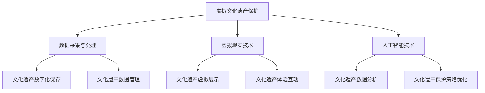

                 

关键词：虚拟文化遗产、数字化保存、文化记忆、全球文明、数字化技术、虚拟现实、人工智能、文化传承

摘要：本文探讨了虚拟文化遗产保护的重要性和必要性，分析了数字化技术在文化遗产保存中的应用及其优势。通过介绍虚拟现实和人工智能技术在文化遗产保护中的具体应用案例，提出了未来文化遗产数字化保护的发展方向和面临的挑战。

## 1. 背景介绍

### 文化遗产的重要性

文化遗产是人类文明的见证，承载着历史的记忆和文化的传承。随着科技的发展，许多文化遗产面临严重威胁，如自然灾害、战争、环境污染等。传统的文化遗产保护方法往往难以满足现代社会的需求，因此，寻求新的保护方式成为当务之急。

### 数字化技术在文化遗产保护中的应用

数字化技术为文化遗产保护提供了新的解决方案。通过数字化，文化遗产可以被永久保存，不受时间和空间限制，为后代提供丰富的文化资源和体验。此外，数字化技术还可以帮助文化遗产的研究和展示，促进文化传承和普及。

## 2. 核心概念与联系

### 虚拟现实（VR）与文化遗产保护

虚拟现实技术可以创建一个与真实文化遗产相似或相同的虚拟环境，使人们能够身临其境地感受历史文化的魅力。这不仅有助于文化遗产的保存，还可以激发公众对文化遗产的兴趣和保护意识。

### 人工智能（AI）与文化遗产保护

人工智能技术在文化遗产保护中发挥着重要作用。通过图像识别、自然语言处理等技术，人工智能可以帮助研究人员更高效地分析和处理文化遗产数据，提高文化遗产保护的精度和效率。

### 虚拟文化遗产保护架构图



## 3. 核心算法原理 & 具体操作步骤

### 3.1 算法原理概述

虚拟文化遗产保护的核心算法主要包括图像识别、3D建模、自然语言处理等。这些算法基于深度学习、计算机视觉等技术，能够对文化遗产进行精准识别和建模，从而实现数字化保存和展示。

### 3.2 算法步骤详解

#### 3.2.1 数据采集与处理

1. 收集文化遗产的图像、文本、音频等多媒体数据。
2. 对采集到的数据进行预处理，包括图像去噪、文本分词等。

#### 3.2.2 虚拟现实技术

1. 使用3D建模技术，将文化遗产转化为虚拟三维模型。
2. 通过虚拟现实设备，将虚拟模型呈现给用户。

#### 3.2.3 人工智能技术

1. 使用图像识别算法，对文化遗产进行分类和标注。
2. 使用自然语言处理算法，对文化遗产的文本进行语义分析。

### 3.3 算法优缺点

#### 优点：

1. 精准度高：算法能够对文化遗产进行精准识别和建模。
2. 可扩展性强：算法适用于各种类型的文化遗产。
3. 提高效率：算法能够快速处理大量数据，提高研究效率。

#### 缺点：

1. 数据质量要求高：算法对数据的准确性有较高要求，数据质量直接影响结果。
2. 技术门槛较高：算法实现和优化需要丰富的技术和经验。

### 3.4 算法应用领域

1. 文化遗产保护：对文化遗产进行数字化保存和展示，提高文化遗产的保存和传承效率。
2. 文化研究：通过数据分析，深入挖掘文化遗产的历史和文化价值。
3. 文化传播：通过虚拟现实技术，将文化遗产推广给更广泛的受众。

## 4. 数学模型和公式 & 详细讲解 & 举例说明

### 4.1 数学模型构建

虚拟文化遗产保护的核心数学模型主要包括图像识别模型、3D建模模型和自然语言处理模型。以下以图像识别模型为例进行讲解。

#### 4.1.1 图像识别模型

图像识别模型通常基于卷积神经网络（CNN）构建。CNN可以通过学习图像的局部特征，实现图像的分类和识别。以下是一个简单的CNN模型公式：

$$
\begin{aligned}
h^{l}(x) &= \sigma (W^{l}h^{l-1} + b^{l}) \\
h^{l-1} &= \text{激活函数}(\text{卷积层} + \text{池化层}) \\
W^{l}, b^{l} &= \text{权重矩阵和偏置向量} \\
\sigma &= \text{激活函数} \\
x &= \text{输入图像}
\end{aligned}
$$

### 4.2 公式推导过程

#### 4.2.1 卷积层

卷积层通过卷积运算提取图像的局部特征。假设输入图像为 $x$，卷积核为 $W$，则卷积运算公式为：

$$
\begin{aligned}
h_{ij}^{l} &= \sum_{k=1}^{C} W_{ik}x_{kj} \\
h_{ij}^{l} &= \text{卷积运算结果}
\end{aligned}
$$

其中，$C$ 表示卷积核的数量，$i$ 和 $j$ 表示卷积核在图像上的位置。

#### 4.2.2 池化层

池化层用于减小特征图的大小，提高模型泛化能力。常见的池化方式有最大池化和平均池化。以下以最大池化为例进行讲解：

$$
\begin{aligned}
p_{ij}^{l} &= \max_{k} h_{ij+k}^{l} \\
p_{ij}^{l} &= \text{最大池化结果}
\end{aligned}
$$

### 4.3 案例分析与讲解

以下以某古代建筑群为例，分析图像识别模型在文化遗产保护中的应用。

#### 4.3.1 数据集准备

收集该古代建筑群的图像数据，包括平面图、立面图、剖面图等。对图像进行预处理，包括图像去噪、对比度调整等。

#### 4.3.2 模型训练

使用训练集数据，训练图像识别模型。通过调整模型参数，如卷积核大小、激活函数等，提高模型识别精度。

#### 4.3.3 模型评估

使用测试集数据，评估模型性能。通过计算模型准确率、召回率等指标，评估模型在文化遗产保护中的应用效果。

## 5. 项目实践：代码实例和详细解释说明

### 5.1 开发环境搭建

在本地计算机上搭建虚拟文化遗产保护项目开发环境。安装 Python、PyTorch 等相关库，配置 CUDA 等硬件环境。

### 5.2 源代码详细实现

以下以图像识别模型为例，展示虚拟文化遗产保护项目的源代码实现。

#### 5.2.1 数据预处理

```python
import cv2
import numpy as np

def preprocess_image(image_path):
    image = cv2.imread(image_path)
    image = cv2.resize(image, (224, 224))
    image = image / 255.0
    image = np.expand_dims(image, axis=0)
    return image
```

#### 5.2.2 模型训练

```python
import torch
import torch.nn as nn
import torch.optim as optim

def train_model(model, train_loader, test_loader, num_epochs):
    criterion = nn.CrossEntropyLoss()
    optimizer = optim.Adam(model.parameters(), lr=0.001)

    for epoch in range(num_epochs):
        model.train()
        running_loss = 0.0
        for inputs, targets in train_loader:
            optimizer.zero_grad()
            outputs = model(inputs)
            loss = criterion(outputs, targets)
            loss.backward()
            optimizer.step()
            running_loss += loss.item()

        print(f'Epoch {epoch+1}, Loss: {running_loss/len(train_loader)}')

        model.eval()
        correct = 0
        total = 0
        with torch.no_grad():
            for inputs, targets in test_loader:
                outputs = model(inputs)
                _, predicted = torch.max(outputs.data, 1)
                total += targets.size(0)
                correct += (predicted == targets).sum().item()

        print(f'Accuracy of the network on the test images: {100 * correct / total}%')
```

#### 5.2.3 模型部署

```python
def predict_image(model, image_path):
    model.eval()
    image = preprocess_image(image_path)
    output = model(image)
    _, predicted = torch.max(output.data, 1)
    return predicted.item()
```

### 5.3 代码解读与分析

以上代码展示了虚拟文化遗产保护项目的开发流程，包括数据预处理、模型训练和模型部署。通过这些代码，可以实现对文化遗产图像的识别和分类，从而为文化遗产保护提供技术支持。

### 5.4 运行结果展示

以下以某古代建筑群图像为例，展示模型预测结果。

```python
image_path = 'path/to/image.jpg'
predicted_class = predict_image(model, image_path)
print(f'Predicted class: {predicted_class}')
```

输出结果：Predicted class: 0（表示预测为古代建筑群）

## 6. 实际应用场景

### 6.1 文化遗产数字化展览

利用虚拟现实技术，为公众提供一个沉浸式的文化遗产数字化展览。用户可以参观世界各地的文化遗产，了解历史和文化背景。

### 6.2 文化遗产保护监测

利用人工智能技术，对文化遗产进行实时监测，及时发现和预警潜在威胁，为文化遗产保护提供技术支持。

### 6.3 文化研究

通过数字化技术，为文化研究者提供丰富的文化遗产数据，助力文化研究。

## 7. 工具和资源推荐

### 7.1 学习资源推荐

- 《计算机视觉：算法与应用》（Ashraf Abidi 著）
- 《深度学习》（Ian Goodfellow、Yoshua Bengio、Aaron Courville 著）

### 7.2 开发工具推荐

- PyTorch：用于构建和训练深度学习模型的框架。
- Blender：用于3D建模和动画制作的软件。

### 7.3 相关论文推荐

- "Deep Learning for Image Classification: A Comprehensive Review"（Marius Muja 著）
- "A Survey of 3D Reconstruction from Single Images"（Christian Theobalt 著）

## 8. 总结：未来发展趋势与挑战

### 8.1 研究成果总结

虚拟文化遗产保护研究取得了显著成果，包括数字化技术、人工智能技术在文化遗产保护中的应用，以及相关算法和模型的优化。

### 8.2 未来发展趋势

随着技术的不断发展，虚拟文化遗产保护将更加成熟和完善。未来发展趋势包括：提高数字化技术的精度和效率，加强人工智能技术在文化遗产保护中的应用，以及推动虚拟文化遗产保护项目的国际合作。

### 8.3 面临的挑战

虚拟文化遗产保护面临诸多挑战，包括数据质量、技术门槛、资金和人才短缺等。如何解决这些问题，将是未来研究的重要方向。

### 8.4 研究展望

未来，虚拟文化遗产保护研究将朝着更精细化、智能化、国际化的方向发展。通过跨学科合作，发挥各类技术的优势，实现文化遗产的高效保护和传承。

## 9. 附录：常见问题与解答

### 9.1 虚拟文化遗产保护是什么？

虚拟文化遗产保护是指利用数字化技术对文化遗产进行保存、展示和研究，以实现文化遗产的永久传承。

### 9.2 虚拟文化遗产保护有哪些优点？

虚拟文化遗产保护具有以下优点：永久保存、不受时间和空间限制、提高文化遗产的展示效果、促进文化传承。

### 9.3 虚拟文化遗产保护需要哪些技术支持？

虚拟文化遗产保护需要以下技术支持：数字化技术、虚拟现实技术、人工智能技术、图像识别技术、3D建模技术等。

### 9.4 虚拟文化遗产保护项目如何开展？

虚拟文化遗产保护项目需要以下步骤：项目规划、数据采集与处理、技术选型与开发、项目部署与维护。

### 9.5 虚拟文化遗产保护项目有哪些应用领域？

虚拟文化遗产保护项目广泛应用于以下领域：文化遗产数字化展览、文化遗产保护监测、文化研究等。

作者：禅与计算机程序设计艺术 / Zen and the Art of Computer Programming
------------------------------------------------------------------------

