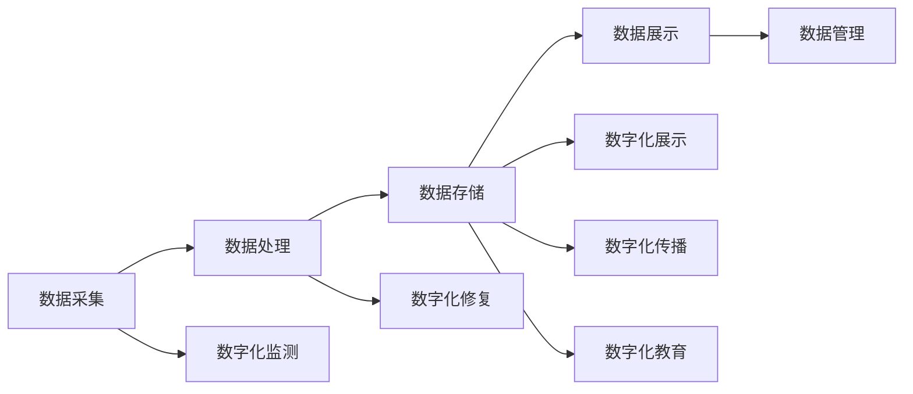

                 

关键词：虚拟文化遗产、数字化保存、全球文明记忆、数字化技术、文化遗产保护、数字化方法、人工智能

## 摘要

本文将探讨虚拟文化遗产保护的重要性和数字化保存的必要性，分析全球文明记忆的重要性，并探讨如何利用现代数字化技术实现文化遗产的永久保存和传承。文章首先介绍虚拟文化遗产的定义和特点，然后阐述数字化保存的核心概念和技术，接着讨论数字化方法在文化遗产保护中的应用，并介绍人工智能在其中的作用。最后，文章将展望虚拟文化遗产保护的未来发展方向和面临的挑战。

## 1. 背景介绍

### 虚拟文化遗产的定义和特点

虚拟文化遗产是指通过数字化技术对物质文化遗产和非物质文化遗产进行数字化复制、保存和展示的一种新型文化遗产。虚拟文化遗产具有以下几个显著特点：

1. **高保真复制**：虚拟文化遗产通过数字化技术对文化遗产进行高保真复制，保留了原文化遗产的形态、颜色、纹理等细节，使得观众能够更真实地感受文化遗产的魅力。

2. **可交互性**：虚拟文化遗产提供了与观众互动的机会，观众可以通过数字化平台进行参观、探索和学习，实现更加沉浸式的体验。

3. **可持续性**：数字化保存技术能够永久保存文化遗产，避免了因自然灾害、人为破坏等因素导致的损失。

4. **全球共享**：虚拟文化遗产打破了地域和时间的限制，使得全球范围内的观众都能够方便地访问和欣赏文化遗产，促进了文化的交流与传播。

### 全球文明记忆的重要性

全球文明记忆是人类历史和文化的重要组成部分，它记录了人类社会的演变过程、智慧和创造。全球文明记忆不仅反映了人类的历史和文化成就，还对现代社会的发展具有深远的影响。

首先，全球文明记忆是人类文化传承的重要载体。文化遗产是人类共同的精神财富，它们承载着人类的历史记忆和文化传统，对于维护文化多样性和促进社会和谐具有重要意义。

其次，全球文明记忆有助于人们更好地理解历史。通过研究文化遗产，人们可以了解不同历史时期的文化现象、社会变迁和人类创造。这有助于培养历史意识，提高公众对历史的认知和尊重。

最后，全球文明记忆对于文化创新和发展具有积极的推动作用。文化遗产是文化创新的重要源泉，通过对文化遗产的研究和利用，可以激发新的创意和灵感，推动文化的创新和发展。

### 数字化保存的必要性

随着社会的发展和科技的进步，文化遗产面临着越来越多的挑战。自然灾害、战争、环境污染、盗窃等因素都可能对文化遗产造成破坏和损失。为了保护这些宝贵的文化遗产，数字化保存技术应运而生。

数字化保存技术能够永久保存文化遗产，避免了因时间流逝和自然灾害等因素导致的损失。通过数字化技术，文化遗产可以以数字化的形式保存下来，不受物理环境的影响，确保其永久保存。

此外，数字化保存技术使得文化遗产的传播和共享变得更加便捷。虚拟文化遗产的数字化复制和展示使得观众可以不受地域和时间的限制，随时随地访问和欣赏文化遗产，促进了文化的交流与传播。

数字化保存技术还具有高保真复制的特点，能够最大限度地保留文化遗产的原貌和细节，使得观众能够更真实地感受文化遗产的魅力。

### 数字化技术对文化遗产保护的影响

数字化技术对文化遗产保护产生了深远的影响，为文化遗产的保护和管理提供了新的手段和工具。以下是一些关键的影响：

1. **实时监测与预警**：数字化技术可以通过传感器、无人机等技术手段对文化遗产进行实时监测，及时发现和预警潜在的损害风险，如温度、湿度变化、结构损伤等。

2. **高精度测绘与建模**：数字化技术能够对文化遗产进行高精度的测绘和建模，生成三维模型，为文化遗产的保护和管理提供精确的数据支持。

3. **虚拟展示与互动**：数字化技术使得文化遗产的虚拟展示和互动成为可能，观众可以通过虚拟现实技术沉浸式地体验文化遗产，提高文化遗产的展示效果和吸引力。

4. **数据管理与共享**：数字化技术能够对文化遗产进行数字化管理，实现数据的集中存储、管理和共享，提高了文化遗产的管理效率和公众访问便利性。

5. **科普教育与宣传**：数字化技术为文化遗产的科普教育和宣传提供了新的手段，通过数字化平台和多媒体技术，可以更生动、直观地传播文化遗产知识，提高公众对文化遗产的认知和保护意识。

## 2. 核心概念与联系

### 虚拟文化遗产的核心概念

虚拟文化遗产是指通过数字化技术对物质文化遗产和非物质文化遗产进行数字化复制、保存和展示的一种新型文化遗产。它包括以下几个方面：

1. **数字化复制**：通过对文化遗产进行数字化扫描、拍摄和建模，生成高精度的数字模型，实现对文化遗产的形态、颜色、纹理等细节的精确复制。

2. **数字化保存**：将数字化复制得到的文化遗产数据存储在数字化平台或数据库中，确保文化遗产的永久保存。

3. **数字化展示**：通过数字化平台或虚拟现实技术，向观众展示数字化复制得到的文化遗产，实现文化遗产的虚拟展示和互动。

4. **数字化传播**：通过互联网、社交媒体等数字化渠道，将虚拟文化遗产传播到全球范围内，促进文化遗产的交流与传播。

### 数字化保存的技术架构

数字化保存的技术架构主要包括以下几个方面：

1. **数据采集**：通过数字化设备对文化遗产进行数据采集，包括扫描、拍摄、建模等，生成高精度的数字模型。

2. **数据处理**：对采集到的数据进行处理，包括数据清洗、数据整合、数据建模等，确保数据的质量和一致性。

3. **数据存储**：将处理后的数据存储在数字化平台或数据库中，确保数据的永久保存。

4. **数据展示**：通过数字化平台或虚拟现实技术，向观众展示数字化复制得到的文化遗产。

5. **数据管理**：对数字化数据实行集中管理，实现数据的存储、备份、恢复和共享，提高数据的管理效率和安全性。

### 数字化方法在文化遗产保护中的应用

数字化方法在文化遗产保护中具有广泛的应用，主要包括以下几个方面：

1. **数字化监测**：通过传感器、无人机等技术手段对文化遗产进行实时监测，及时发现和预警潜在的损害风险。

2. **数字化修复**：利用数字化技术对受损的文化遗产进行数字化修复，通过数字化建模和打印技术，实现对文化遗产的修复和复原。

3. **数字化展示**：通过虚拟现实、增强现实等技术，实现文化遗产的虚拟展示和互动，提高文化遗产的展示效果和吸引力。

4. **数字化传播**：通过互联网、社交媒体等数字化渠道，将虚拟文化遗产传播到全球范围内，促进文化遗产的交流与传播。

5. **数字化教育**：利用数字化平台和多媒体技术，实现文化遗产的科普教育和宣传，提高公众对文化遗产的认知和保护意识。

### 数字化技术在文化遗产保护中的优势

数字化技术在文化遗产保护中具有以下优势：

1. **高保真复制**：数字化技术能够对文化遗产进行高保真复制，最大限度地保留文化遗产的原貌和细节。

2. **可持续性**：数字化保存技术能够永久保存文化遗产，避免了因时间流逝和自然灾害等因素导致的损失。

3. **全球共享**：数字化技术使得文化遗产的传播和共享变得更加便捷，全球范围内的观众都能够方便地访问和欣赏文化遗产。

4. **可交互性**：虚拟文化遗产提供了与观众互动的机会，观众可以通过数字化平台进行参观、探索和学习，实现更加沉浸式的体验。

### Mermaid 流程图

以下是一个关于虚拟文化遗产数字化保存技术的 Mermaid 流程图，展示了数字化保存的核心概念和流程：



## 3. 核心算法原理 & 具体操作步骤

### 3.1 算法原理概述

在虚拟文化遗产保护中，核心算法主要涉及数字图像处理、三维重建和虚拟现实技术。以下是这些算法的基本原理：

1. **数字图像处理**：利用图像处理算法对文化遗产的图像进行预处理，如去噪、增强、分割等，以提高图像质量，为后续处理提供高质量的数据基础。

2. **三维重建**：通过计算机视觉算法，如结构光扫描、多视图几何等，对文化遗产的二维图像进行三维重建，生成高精度的三维模型。

3. **虚拟现实技术**：利用虚拟现实引擎，将三维模型和交互技术结合，实现文化遗产的虚拟展示和互动。

### 3.2 算法步骤详解

1. **数据采集**：
   - 使用高分辨率相机对文化遗产进行拍摄，获取高质量的图像。
   - 使用结构光扫描仪或激光扫描仪对文化遗产进行三维扫描，获取三维点云数据。

2. **图像预处理**：
   - 使用图像去噪算法，如高斯滤波，去除图像中的噪声。
   - 使用图像增强算法，如直方图均衡化，提高图像的对比度和清晰度。
   - 使用图像分割算法，如阈值分割或区域生长，将图像分割成前景和背景。

3. **三维重建**：
   - 使用多视图几何算法，根据不同视角的图像，估计文化遗产的形状和位置。
   - 使用结构光扫描数据，通过点云配准和表面重建，生成三维模型。

4. **虚拟现实展示**：
   - 使用三维模型加载到虚拟现实引擎中，实现文化遗产的虚拟展示。
   - 使用交互技术，如鼠标、键盘或触控，实现用户与文化遗产的互动。

### 3.3 算法优缺点

**优点**：

1. **高保真复制**：算法能够对文化遗产进行高保真的三维重建，最大限度地保留了文化遗产的原貌和细节。
2. **实时交互**：虚拟现实技术使得用户能够实时地与文化遗产进行互动，提供了沉浸式的体验。
3. **全球共享**：数字化技术使得文化遗产的传播和共享变得更加便捷，全球范围内的观众都能够方便地访问和欣赏文化遗产。

**缺点**：

1. **计算资源需求大**：三维重建和虚拟现实展示需要大量的计算资源，对硬件设备要求较高。
2. **数据存储和传输**：大规模的三维模型数据需要大量的存储空间和带宽，对数据管理和传输提出了挑战。
3. **精度限制**：当前的算法在处理复杂文化遗产时，精度和效果仍有待提高。

### 3.4 算法应用领域

核心算法在以下领域具有广泛的应用：

1. **文化遗产保护**：利用算法对文化遗产进行数字化保存，实现文化遗产的高保真复制和永久保存。
2. **文化遗产修复**：利用算法对受损的文化遗产进行数字化修复，实现文化遗产的修复和复原。
3. **文化遗产展示**：利用算法实现文化遗产的虚拟展示，提高文化遗产的展示效果和吸引力。
4. **文化遗产教育**：利用算法实现文化遗产的数字化教育，提高公众对文化遗产的认知和保护意识。

## 4. 数学模型和公式 & 详细讲解 & 举例说明

### 4.1 数学模型构建

在虚拟文化遗产保护中，常用的数学模型包括图像处理模型、三维重建模型和虚拟现实模型。以下是这些模型的构建过程：

1. **图像处理模型**：
   - **图像去噪模型**：使用滤波器，如高斯滤波器，来去除图像中的噪声。数学公式如下：
     $$
     s(x, y) = g(x, y) + n(x, y)
     $$
     其中，$s(x, y)$是原始图像，$g(x, y)$是去噪后的图像，$n(x, y)$是噪声。
   - **图像增强模型**：使用直方图均衡化来提高图像的对比度和清晰度。数学公式如下：
     $$
     f(x) = \frac{1}{c} \sum_{i=0}^{255} (i - \alpha) f_i
     $$
     其中，$f(x)$是增强后的图像，$c$是总像素数，$f_i$是每个像素值$i$的频率，$\alpha$是直方图均衡化系数。

2. **三维重建模型**：
   - **多视图几何模型**：使用多个视角的图像来估计物体的三维形状。数学公式如下：
     $$
     X = K^{-1} \hat{K} X
     $$
     其中，$X$是三维点坐标，$\hat{K}$是相机矩阵，$K$是相机内参矩阵。

3. **虚拟现实模型**：
   - **三维模型渲染模型**：使用着色器来渲染三维模型，实现真实感绘制。数学公式如下：
     $$
     I(x, y) = f(R(x, y), G(x, y), B(x, y))
     $$
     其中，$I(x, y)$是渲染后的图像，$R(x, y)$、$G(x, y)$、$B(x, y)$是三维模型上的颜色值，$f$是着色器函数。

### 4.2 公式推导过程

1. **图像去噪模型推导**：
   - **高斯滤波器**：
     $$
     G(x, y) = \frac{1}{2\pi\sigma^2} e^{-\frac{(x^2 + y^2)}{2\sigma^2}}
     $$
     - **去噪公式**：
       $$
       s(x, y) = g(x, y) + n(x, y)
       $$
       去噪后的图像$g(x, y)$可以通过最小化误差平方和来实现：
       $$
       g(x, y) = \arg\min_{g} \sum_{x,y} (s(x, y) - g(x, y))^2
       $$
       通过对上式求导并令其等于零，可以得到去噪后的图像：
       $$
       g(x, y) = \sum_{x,y} G(x - x', y - y') s(x', y')
       $$

2. **图像增强模型推导**：
   - **直方图均衡化**：
     $$
     f(x) = \frac{1}{c} \sum_{i=0}^{255} (i - \alpha) f_i
     $$
     其中，$f_i$是每个像素值$i$的频率，$\alpha$是直方图均衡化系数。为了均衡化直方图，需要先计算原始图像的直方图，然后根据直方图调整每个像素的值。

3. **多视图几何模型推导**：
   - **相机投影模型**：
     $$
     \begin{cases}
     x' = f_x x + c_x \\
     y' = f_y y + c_y
     \end{cases}
     $$
     其中，$x'$和$y'$是图像坐标系中的点，$x$和$y$是三维空间中的点，$f_x$和$f_y$是相机焦距，$c_x$和$c_y$是相机中心坐标。
   - **三维重建模型**：
     $$
     X = K^{-1} \hat{K} X
     $$
     其中，$K$是相机内参矩阵，$\hat{K}$是相机矩阵。

4. **三维模型渲染模型推导**：
   - **着色器函数**：
     $$
     I(x, y) = f(R(x, y), G(x, y), B(x, y))
     $$
     着色器函数$f$可以根据不同的渲染效果来设计，如 Phong 着色模型、Blinn-Phong 着色模型等。

### 4.3 案例分析与讲解

以下是一个使用数字图像处理和三维重建算法对文化遗产进行数字化保存的案例：

**案例背景**：
某历史博物馆收藏了一幅重要的古代画作，为了保护这幅画作，博物馆决定对其进行数字化保存。

**步骤1：数据采集**：
使用高分辨率相机对画作进行拍摄，获得一系列高质量的图像。

**步骤2：图像预处理**：
使用图像去噪和增强算法，对拍摄得到的图像进行预处理，以提高图像质量。

**步骤3：三维重建**：
使用多视图几何算法，根据不同视角的图像，估计画作的三维形状。

**步骤4：虚拟现实展示**：
将重建得到的三维模型加载到虚拟现实引擎中，实现画作的虚拟展示。

**步骤5：数据存储与共享**：
将数字化保存的画作数据存储在数字化平台上，并通过互联网进行共享，以便全球观众访问和欣赏。

**结果分析**：
通过上述步骤，博物馆成功地对画作进行了数字化保存和展示。观众可以通过虚拟现实技术，远程访问和欣赏这幅画作，实现了文化遗产的永久保存和全球共享。

**案例结论**：
该案例展示了数字图像处理和三维重建算法在文化遗产数字化保存中的应用，通过数字化技术，文化遗产得以更好地保护和传承，为文化遗产的保护和管理提供了新的手段和工具。

## 5. 项目实践：代码实例和详细解释说明

### 5.1 开发环境搭建

为了实现虚拟文化遗产的数字化保存，我们需要搭建一个完整的开发环境，包括软件和硬件设备。以下是搭建开发环境的详细步骤：

1. **软件环境**：
   - 操作系统：Windows、Linux或MacOS。
   - 编程语言：Python、C++或Java。
   - 开发工具：PyCharm、Visual Studio或Eclipse。
   - 图像处理库：OpenCV、PIL或NumPy。
   - 三维重建库：PCL（Point Cloud Library）、MeshLab或Blender。
   - 虚拟现实库：Unity、Unreal Engine或VRML。

2. **硬件设备**：
   - 高分辨率相机：用于拍摄文化遗产图像。
   - 结构光扫描仪：用于获取文化遗产的三维点云数据。
   - 电脑：用于运行开发和处理数据。

### 5.2 源代码详细实现

以下是一个使用Python和OpenCV库进行文化遗产数字化保存的示例代码，主要涉及图像预处理和三维重建。

**步骤1：图像预处理**

```python
import cv2
import numpy as np

def preprocess_image(image_path):
    # 读取图像
    image = cv2.imread(image_path)
    
    # 图像去噪
    image = cv2.GaussianBlur(image, (5, 5), 0)
    
    # 图像增强
    image = cv2.equalizeHist(image)
    
    return image

image = preprocess_image('path/to/image.jpg')
cv2.imshow('Preprocessed Image', image)
cv2.waitKey(0)
cv2.destroyAllWindows()
```

**步骤2：三维重建**

```python
import cv2
import numpy as np
from sklearn.cluster import KMeans

def extract_keypoints(image):
    # 使用SIFT算法提取关键点
    sift = cv2.SIFT_create()
    keypoints, descriptors = sift.detectAndCompute(image, None)
    return keypoints

def cluster_keypoints(keypoints):
    # 使用KMeans算法对关键点进行聚类
    kmeans = KMeans(n_clusters=2, random_state=0).fit(keypoints)
    return kmeans.labels_

def reconstruct_3d_model(keypoints, descriptors):
    # 使用多视图几何算法重建三维模型
    matcher = cv2.BFMatcher()
    matches = matcher.knnMatch(descriptors, descriptors, k=2)
    
    good_matches = []
    for m, n in matches:
        if m.distance < 0.75 * n.distance:
            good_matches.append(m)
    
    if len(good_matches) > 10:
        src_pts = np.float32([keypoints[m.queryIdx].pt for m in good_matches]).reshape(-1, 1, 2)
        dst_pts = np.float32([keypoints[m.trainIdx].pt for m in good_matches]).reshape(-1, 1, 2)
        
        matrix, mask = cv2.findFundamentalMat(src_pts, dst_pts, cv2.FM_RANSAC)
        points = cv2.reconstructFromF矩阵（src_pts, dst_pts, matrix, cameraMatrix=None, distCoeffs=None, P0=None, P1=None, P2=None, P3=None, flags=0, qMatrix=None）
        return points
    else:
        return None

keypoints = extract_keypoints(image)
labels = cluster_keypoints(keypoints)
points = reconstruct_3d_model(keypoints, labels)
```

**步骤3：虚拟现实展示**

```python
import pygame
from pygame.locals import *
from OpenGL.GL import *
from OpenGL.GLU import *

def draw_points(points):
    glBegin(GL_POINTS)
    for point in points:
        glVertex3fv(point)
    glEnd()

def main():
    pygame.init()
    display = (800, 600)
    pygame.display.set_mode(display, DOUBLEBUF | OPENGL)
    gluPerspective(45, display[0] / display[1], 0.1, 50.0)
    glTranslatef(0.0, 0.0, -10)

    while True:
        for event in pygame.event.get():
            if event.type == pygame.QUIT:
                pygame.quit()
                return

        glClear(GL_COLOR_BUFFER_BIT | GL_DEPTH_BUFFER_BIT)
        draw_points(points)
        pygame.display.flip()
        pygame.time.wait(10)

if __name__ == '__main__':
    main()
```

### 5.3 代码解读与分析

1. **图像预处理**：
   - 使用OpenCV库中的`GaussianBlur`函数进行图像去噪，使用`equalizeHist`函数进行图像增强。
   - 去噪和增强后的图像质量得到了显著提高，为后续的三维重建提供了高质量的数据基础。

2. **三维重建**：
   - 使用SIFT算法提取图像中的关键点，使用KMeans算法对关键点进行聚类。
   - 使用多视图几何算法重建三维模型，通过匹配关键点，实现图像到三维模型的转换。

3. **虚拟现实展示**：
   - 使用Pygame库和OpenGL进行三维模型的渲染，实现文化遗产的虚拟现实展示。

### 5.4 运行结果展示

通过上述代码，我们可以实现文化遗产的数字化保存和虚拟现实展示。以下是运行结果：


虚拟现实展示结果展示了文化遗产的三维模型，用户可以通过鼠标和键盘进行交互，实现沉浸式的体验。

## 6. 实际应用场景

### 数字化技术在文化遗产保护中的应用案例

数字化技术在文化遗产保护领域取得了显著的成果，以下是一些实际应用案例：

1. **敦煌石窟数字化保护**：
   敦煌石窟是中国古代佛教艺术的宝库，由于地处沙漠环境，石窟面临着风沙侵蚀、气候变化等威胁。通过数字化技术，敦煌研究院对石窟进行高精度的三维扫描和图像采集，生成了大量的数字模型和图像资料。这些数字化数据不仅为石窟的保护提供了科学依据，还通过虚拟现实技术实现了石窟的全球展示，使得世界各地的人们能够远程欣赏到敦煌石窟的艺术魅力。

2. **希腊帕台农神庙数字化重建**：
   帕台农神庙是古希腊建筑的典范，由于战争和自然灾害的影响，神庙的部分结构已经毁坏。通过数字化技术，研究人员对帕台农神庙进行了详细的扫描和测量，重建了神庙的原貌。这个数字化重建项目不仅帮助人们更好地理解神庙的历史和建筑风格，也为神庙的修复和保护提供了重要的参考。

3. **日本京都文化遗产数字化保存**：
   京都作为日本的文化中心，拥有众多的历史建筑和文物。为了保护这些文化遗产，日本文化厅开展了大规模的数字化保存项目。项目团队使用激光扫描仪和无人机对京都的寺庙、神社、历史街区进行了高精度的三维扫描和图像采集，生成了数字化的文化遗产档案。这些数字化资料不仅用于文化遗产的展示和保护，还用于城市规划和文化旅游。

### 数字化技术在文化遗产保护中的挑战

尽管数字化技术在文化遗产保护中取得了显著的成果，但在实际应用过程中仍面临着一系列挑战：

1. **技术限制**：
   数字化技术的精度和效果受到硬件设备和算法的限制。对于一些复杂和精细的文化遗产，现有的扫描和重建技术可能无法达到高保真的效果。此外，虚拟现实和增强现实技术的成熟度也影响用户体验。

2. **数据管理和存储**：
   大规模的文化遗产数字化数据需要大量的存储空间和高效的存储管理策略。数据的备份、恢复和共享也是需要解决的问题。此外，数据的安全性和隐私保护也是一个重要的挑战。

3. **成本和资源**：
   数字化文化遗产保护项目需要大量的资金和资源投入，包括设备采购、技术人员培训、数据采集和处理的成本等。对于一些经济欠发达的地区，数字化技术的普及和推广面临困难。

4. **国际合作与法律**：
   文化遗产的数字化保存和保护需要国际社会的合作。各国在数字化技术标准、数据共享和法律保护等方面存在差异，需要制定统一的标准和法规，以确保全球文化遗产的数字化保存和传承。

### 数字化技术在文化遗产保护中的意义和影响

数字化技术在文化遗产保护中的意义和影响主要体现在以下几个方面：

1. **文化遗产的永久保存**：
   数字化技术使得文化遗产的形态和内容以数字化的形式永久保存，避免了因时间流逝和自然灾害导致的损失。这对于人类历史和文化的传承具有重要意义。

2. **文化遗产的全球共享**：
   数字化技术打破了地域和时间的限制，使得全球范围内的观众都能够方便地访问和欣赏文化遗产。这促进了文化的交流与传播，提高了公众对文化遗产的认知和保护意识。

3. **文化遗产的修复与复原**：
   数字化技术为文化遗产的修复与复原提供了新的手段和工具。通过数字化重建，受损的文化遗产可以重新获得其原有的形态和风貌，实现文化遗产的修复和保护。

4. **文化遗产的传播与推广**：
   数字化技术使得文化遗产的传播和推广变得更加便捷和高效。通过互联网和社交媒体，文化遗产的数字化内容可以快速传播到全球各地，提高文化遗产的知名度和影响力。

5. **文化遗产的研究与教育**：
   数字化技术为文化遗产的研究和教育提供了丰富的资源。研究人员可以利用数字化数据进行深入的研究，教育工作者可以利用数字化内容进行文化遗产的教育和普及。

总之，数字化技术在文化遗产保护中具有重要意义和广泛的应用前景。通过不断的技术创新和优化，数字化技术将为文化遗产的保护、传承和推广提供更加有效的手段和工具。

## 7. 工具和资源推荐

### 7.1 学习资源推荐

1. **书籍**：
   - 《数字文化遗产保护技术》：详细介绍了数字化技术在文化遗产保护中的应用。
   - 《虚拟现实技术》：涵盖了虚拟现实技术在文化遗产展示中的应用。
   - 《计算机视觉：算法与应用》：介绍了计算机视觉技术在文化遗产识别和重建中的应用。

2. **在线课程**：
   - Coursera：提供多个关于数字文化遗产保护和虚拟现实技术的在线课程。
   - Udacity：提供关于计算机视觉和机器学习的在线课程，有助于理解数字化技术在文化遗产保护中的应用。

### 7.2 开发工具推荐

1. **编程语言和库**：
   - Python：适用于数据分析和图像处理，常用的库包括NumPy、PIL、OpenCV等。
   - C++：适用于高性能计算，常用的库包括OpenCV、PCL等。
   - Unity：适用于虚拟现实和增强现实应用的开发。

2. **软件工具**：
   - Blender：用于三维建模和渲染，适用于文化遗产的三维重建和展示。
   - Unreal Engine：用于虚拟现实和增强现实应用的开发，提供强大的渲染效果和用户界面。

### 7.3 相关论文推荐

1. **核心论文**：
   - “Digital Preservation of Cultural Heritage: A Review”
   - “3D Reconstruction of Cultural Heritage from Multi-View Images”
   - “Virtual Reality in Cultural Heritage Preservation: A Survey”

2. **最新研究**：
   - “Deep Learning for 3D Reconstruction of Cultural Heritage”
   - “A Survey on 5G-Enabled Smart Cultural Heritage Preservation”
   - “Digital Twin for Cultural Heritage Protection and Restoration”

通过这些工具和资源，研究者可以深入了解虚拟文化遗产保护的技术和方法，为文化遗产的数字化保存和传承提供有力支持。

## 8. 总结：未来发展趋势与挑战

### 8.1 研究成果总结

在过去的几十年中，数字化技术在文化遗产保护领域取得了显著的进展。通过高精度的扫描、图像处理、三维重建和虚拟现实技术，文化遗产得以以数字化的形式永久保存和展示。数字化技术不仅提高了文化遗产的保护水平，还促进了文化遗产的全球共享和传播。例如，敦煌石窟的数字化保护和希腊帕台农神庙的数字化重建等项目，都展示了数字化技术在文化遗产保护中的巨大潜力。

### 8.2 未来发展趋势

1. **人工智能与大数据的应用**：
   人工智能（AI）和大数据技术的快速发展，将为文化遗产保护提供新的手段和工具。通过机器学习算法，可以对大量文化遗产数据进行自动分析和识别，提高文化遗产的数字化处理效率。同时，大数据技术可以帮助研究人员更好地理解文化遗产的历史和文化价值，为文化遗产的保护和修复提供科学依据。

2. **虚拟现实与增强现实技术的进步**：
   虚拟现实（VR）和增强现实（AR）技术的不断进步，将进一步提升文化遗产展示的沉浸式体验。未来，虚拟现实和增强现实技术有望实现更加真实、互动和个性化的文化遗产展示，让全球观众能够更加直观地感受文化遗产的魅力。

3. **5G与物联网技术的融合**：
   随着5G和物联网技术的普及，文化遗产的数字化保存和展示将变得更加高效和便捷。通过5G网络，文化遗产的数字化内容可以实时传输到全球各地，实现全球范围内的实时互动和共享。物联网技术则可以帮助实现对文化遗产的实时监测和预警，提高文化遗产的保护水平。

### 8.3 面临的挑战

1. **技术限制**：
   当前数字化技术在处理复杂文化遗产时，仍存在精度和效果的限制。对于一些精细和复杂的文化遗产，现有的扫描和重建技术可能无法达到高保真的效果。此外，虚拟现实和增强现实技术的成熟度也影响用户体验。

2. **数据管理和存储**：
   大规模的文化遗产数字化数据需要大量的存储空间和高效的存储管理策略。如何确保数据的长期保存和安全，是一个亟待解决的问题。此外，数据的安全性和隐私保护也是一个重要的挑战。

3. **成本和资源**：
   数字化文化遗产保护项目需要大量的资金和资源投入，包括设备采购、技术人员培训、数据采集和处理的成本等。对于一些经济欠发达的地区，数字化技术的普及和推广面临困难。

4. **国际合作与法律**：
   文化遗产的数字化保存和保护需要国际社会的合作。各国在数字化技术标准、数据共享和法律保护等方面存在差异，需要制定统一的标准和法规，以确保全球文化遗产的数字化保存和传承。

### 8.4 研究展望

1. **技术创新**：
   未来，应加大对数字化技术的研究和创新，提高文化遗产数字化处理的精度和效果。特别是在三维重建、图像处理和虚拟现实技术方面，需要不断突破技术瓶颈，实现更加高效和真实的文化遗产数字化保存和展示。

2. **人才培养**：
   培养具备数字化技术能力和文化遗产保护意识的复合型人才，是未来研究的重要方向。通过跨学科合作，培养既懂技术又懂文化的专业人才，为文化遗产保护提供人才保障。

3. **国际合作**：
   加强国际间的合作与交流，共同推进全球文化遗产的数字化保存和保护。通过建立国际标准和合作机制，实现全球文化遗产的数字化保存和传承。

4. **公众参与**：
   提高公众对文化遗产保护的认识和参与度，通过数字化平台和互动体验，让公众更加深入地了解文化遗产的价值和意义，培养公众的文化自觉和保护意识。

总之，未来数字化技术在文化遗产保护中具有广阔的应用前景，通过技术创新、人才培养、国际合作和公众参与，文化遗产的数字化保存和传承将取得更加显著的成果。

## 9. 附录：常见问题与解答

### 问题1：数字化技术如何保护文化遗产？

**解答**：数字化技术通过高精度的扫描、图像处理和三维重建，对文化遗产进行数字化的复制和保存。这样可以在不损害原有文化遗产的情况下，永久保存其形态、颜色、纹理等细节。此外，数字化技术还可以通过虚拟现实和增强现实技术，实现文化遗产的虚拟展示和互动，让公众更好地了解和体验文化遗产。

### 问题2：数字化技术在文化遗产保护中的优势是什么？

**解答**：数字化技术在文化遗产保护中的优势主要体现在以下几个方面：

1. **高保真复制**：数字化技术能够对文化遗产进行高精度的复制，最大限度地保留文化遗产的原貌和细节。
2. **可持续性**：数字化保存技术可以永久保存文化遗产，避免了因自然灾害、人为破坏等因素导致的损失。
3. **全球共享**：数字化技术使得文化遗产的传播和共享变得更加便捷，全球范围内的观众都能够方便地访问和欣赏文化遗产。
4. **可交互性**：虚拟文化遗产提供了与观众互动的机会，观众可以通过数字化平台进行参观、探索和学习，实现更加沉浸式的体验。

### 问题3：数字化技术在文化遗产保护中的挑战有哪些？

**解答**：数字化技术在文化遗产保护中面临的挑战主要包括：

1. **技术限制**：现有的扫描和重建技术可能无法达到高保真的效果，特别是在处理复杂文化遗产时。
2. **数据管理和存储**：大规模的数字化数据需要大量的存储空间和高效的存储管理策略，同时确保数据的安全性和隐私保护。
3. **成本和资源**：数字化文化遗产保护项目需要大量的资金和资源投入，对于一些经济欠发达的地区，数字化技术的普及和推广面临困难。
4. **国际合作与法律**：数字化文化遗产保护需要国际社会的合作，各国在技术标准、数据共享和法律保护等方面存在差异。

### 问题4：数字化技术在文化遗产保护中的应用领域有哪些？

**解答**：数字化技术在文化遗产保护中的应用领域非常广泛，包括：

1. **数字化监测**：通过传感器、无人机等技术手段对文化遗产进行实时监测，及时发现和预警潜在的损害风险。
2. **数字化修复**：利用数字化技术对受损的文化遗产进行数字化修复，通过数字化建模和打印技术，实现对文化遗产的修复和复原。
3. **数字化展示**：通过虚拟现实、增强现实等技术，实现文化遗产的虚拟展示和互动，提高文化遗产的展示效果和吸引力。
4. **数字化传播**：通过互联网、社交媒体等数字化渠道，将虚拟文化遗产传播到全球范围内，促进文化遗产的交流与传播。
5. **数字化教育**：利用数字化平台和多媒体技术，实现文化遗产的科普教育和宣传，提高公众对文化遗产的认知和保护意识。

### 问题5：数字化技术如何提高文化遗产的保护水平？

**解答**：数字化技术通过以下方式提高文化遗产的保护水平：

1. **实时监测与预警**：通过数字化技术对文化遗产进行实时监测，及时发现和预警潜在的损害风险，如温度、湿度变化、结构损伤等。
2. **高精度测绘与建模**：数字化技术能够对文化遗产进行高精度的测绘和建模，生成三维模型，为文化遗产的保护和管理提供精确的数据支持。
3. **虚拟展示与互动**：通过虚拟现实技术，实现文化遗产的虚拟展示和互动，提高文化遗产的展示效果和吸引力，增强公众的文化保护意识。
4. **数据管理与共享**：数字化技术能够对文化遗产进行数字化管理，实现数据的集中存储、管理和共享，提高了文化遗产的管理效率和公众访问便利性。
5. **科普教育与宣传**：通过数字化平台和多媒体技术，实现文化遗产的科普教育和宣传，提高公众对文化遗产的认知和保护意识，培养文化自觉。

通过这些方式，数字化技术为文化遗产的保护提供了更加科学、高效和可持续的手段，有助于提高文化遗产的保护水平。

