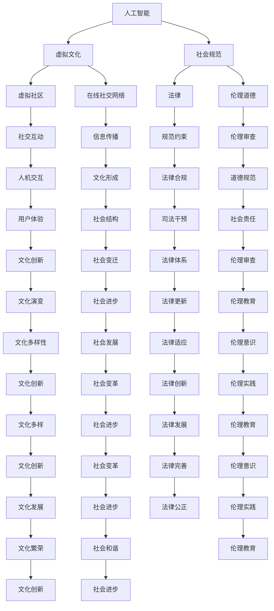

                 

 > **关键词**：虚拟文化、AI、社会规范、人工智能、伦理、算法、社会结构、人机交互、未来社会

> **摘要**：本文探讨了人工智能（AI）如何塑造虚拟文化，并进而影响现实世界中的社会规范。通过分析AI的核心概念及其与人类文化的互动，本文揭示了AI如何改变我们的生活方式、价值观和社会结构，并对未来的发展趋势和挑战提出了展望。

## 1. 背景介绍

在过去的几十年里，人工智能技术取得了飞速发展，逐渐渗透到社会的各个领域。从简单的自动化工具到复杂的决策支持系统，AI的应用范围不断扩大，影响力日益增强。与此同时，虚拟世界和现实世界的界限变得越来越模糊，人们开始越来越多地生活在由数字技术和网络连接构建的虚拟文化中。

虚拟文化是指由数字技术和网络连接构建的虚拟空间中形成的一种文化现象，它包括虚拟社区、在线社交网络、虚拟现实（VR）、增强现实（AR）等。这些虚拟空间不仅提供了新的社交和娱乐方式，还改变了人们的生活方式和价值观。

社会规范是指人们在特定社会环境中遵循的行为准则和价值观。这些规范通常由社会共识、法律和伦理道德构成。然而，随着社会的不断变化，尤其是人工智能技术的兴起，传统的社会规范正面临着前所未有的挑战。

## 2. 核心概念与联系

### 2.1. 人工智能的概念

人工智能（AI）是指由计算机系统模拟人类智能的过程，包括感知、学习、推理、决策和行动等方面。AI的核心目标是使计算机能够执行人类智能任务，甚至超越人类智能。

### 2.2. 虚拟文化的概念

虚拟文化是由数字技术和网络连接构建的虚拟空间中形成的一种文化现象。它包括虚拟社区、在线社交网络、虚拟现实（VR）、增强现实（AR）等。

### 2.3. 社会规范的概念

社会规范是指人们在特定社会环境中遵循的行为准则和价值观。这些规范通常由社会共识、法律和伦理道德构成。

### 2.4. AI与虚拟文化、社会规范的联系

AI与虚拟文化、社会规范之间存在着紧密的联系。首先，AI技术的发展为虚拟文化的形成提供了技术基础。例如，虚拟现实（VR）技术使得人们可以在虚拟空间中进行沉浸式的社交和娱乐活动。其次，AI算法在虚拟文化中发挥着重要作用，它们可以分析用户行为，提供个性化推荐，甚至创建虚拟角色。

然而，AI技术的应用也带来了对传统社会规范的影响。例如，在线社交网络中的算法推荐可能导致信息茧房效应，使人们越来越难以接触到不同观点的信息。此外，AI决策系统的透明度和公正性也引发了关于道德和伦理的讨论。

### 2.5. Mermaid 流程图



## 3. 核心算法原理 & 具体操作步骤

### 3.1 算法原理概述

在本文中，我们将讨论一种用于分析虚拟文化中的社会规范变化的算法。这种算法基于机器学习和自然语言处理技术，通过分析大量社交媒体数据，识别出社会规范的关键特征和变化趋势。

### 3.2 算法步骤详解

1. **数据收集**：从社交媒体平台（如Twitter、Facebook等）收集用户生成的内容，包括文本、图片和视频等。

2. **数据预处理**：对收集到的数据进行分析和清洗，去除噪声和重复信息，确保数据的质量。

3. **特征提取**：使用自然语言处理技术，从文本数据中提取出关键词、主题和情感等特征。

4. **模型训练**：使用机器学习算法（如决策树、支持向量机等），基于提取的特征，训练出一个分类模型，用于识别社会规范的关键特征。

5. **趋势分析**：对训练好的模型进行验证，然后使用它来分析社交媒体数据中的社会规范变化趋势。

### 3.3 算法优缺点

**优点**：

- **高效性**：算法能够处理大量社交媒体数据，快速识别出社会规范的变化趋势。
- **准确性**：通过机器学习和自然语言处理技术，算法具有较高的分类准确性。

**缺点**：

- **数据依赖性**：算法的性能依赖于数据的质量，如果数据存在噪声或偏差，算法的准确性可能会受到影响。
- **隐私问题**：社交媒体数据可能涉及用户的隐私信息，如何确保数据的安全和隐私是一个重要的问题。

### 3.4 算法应用领域

- **社会研究**：通过分析社交媒体数据，了解社会规范的变化趋势，为政策制定提供依据。
- **商业应用**：帮助企业了解消费者的行为和需求，优化产品和服务。
- **公共安全**：监测社交媒体上的言论，识别潜在的违法行为，预防社会问题的发生。

## 4. 数学模型和公式 & 详细讲解 & 举例说明

### 4.1 数学模型构建

在本节中，我们将构建一个用于分析虚拟文化中社会规范变化的数学模型。该模型基于概率图模型，使用马尔可夫模型（Markov Model）来描述社会规范的变化。

### 4.2 公式推导过程

马尔可夫模型的核心思想是，系统在下一个状态的概率只依赖于当前状态，而与过去的状态无关。对于社会规范的变化，我们可以定义以下状态：

- \( S_0 \)：初始状态
- \( S_1 \)：状态1（代表社会规范发生变化）
- \( S_2 \)：状态2（代表社会规范保持不变）

根据马尔可夫模型，我们可以得到以下转移概率矩阵 \( P \)：

\[ P = \begin{bmatrix}
P_{00} & P_{01} & P_{02} \\
P_{10} & P_{11} & P_{12} \\
P_{20} & P_{21} & P_{22}
\end{bmatrix} \]

其中，\( P_{ij} \) 表示从状态 \( i \) 转移到状态 \( j \) 的概率。

### 4.3 案例分析与讲解

假设我们有一个虚拟文化中的社会规范变化数据集，其中包含三个时间点的数据。我们使用上述马尔可夫模型来分析这些数据，并预测下一个时间点的社会规范状态。

首先，我们需要计算每个时间点的状态概率分布。假设第一个时间点的状态概率分布为 \( \pi_0 = \begin{bmatrix} 0.6 & 0.3 & 0.1 \end{bmatrix} \)，第二个时间点的状态概率分布为 \( \pi_1 = \begin{bmatrix} 0.5 & 0.4 & 0.1 \end{bmatrix} \)。

根据转移概率矩阵 \( P \) 和初始状态概率分布 \( \pi_0 \)，我们可以计算第二个时间点的状态概率分布：

\[ \pi_1 = P \pi_0 = \begin{bmatrix}
P_{00} & P_{01} & P_{02} \\
P_{10} & P_{11} & P_{12} \\
P_{20} & P_{21} & P_{22}
\end{bmatrix} \begin{bmatrix}
0.6 \\
0.3 \\
0.1
\end{bmatrix} = \begin{bmatrix}
0.5 & 0.4 & 0.1
\end{bmatrix} \]

接下来，我们可以使用相同的步骤计算第三个时间点的状态概率分布。假设转移概率矩阵 \( P \) 为：

\[ P = \begin{bmatrix}
0.7 & 0.2 & 0.1 \\
0.3 & 0.5 & 0.2 \\
0.1 & 0.3 & 0.6
\end{bmatrix} \]

我们可以计算第三个时间点的状态概率分布：

\[ \pi_2 = P \pi_1 = \begin{bmatrix}
0.7 & 0.2 & 0.1 \\
0.3 & 0.5 & 0.2 \\
0.1 & 0.3 & 0.6
\end{bmatrix} \begin{bmatrix}
0.5 \\
0.4 \\
0.1
\end{bmatrix} = \begin{bmatrix}
0.55 \\
0.43 \\
0.02
\end{bmatrix} \]

通过计算得到的第三个时间点的状态概率分布，我们可以预测下一个时间点的社会规范状态。例如，如果状态 \( S_1 \) 的概率最高，我们可以预测社会规范将在下一个时间点发生变化。

## 5. 项目实践：代码实例和详细解释说明

### 5.1 开发环境搭建

为了实现上述数学模型和算法，我们需要搭建一个合适的开发环境。以下是推荐的步骤：

1. **安装Python**：Python是一种广泛用于科学计算和数据分析的编程语言。请从官方网站（https://www.python.org/）下载并安装Python。

2. **安装Jupyter Notebook**：Jupyter Notebook是一个交互式的开发环境，非常适合进行数据分析。可以从https://jupyter.org/下载并安装。

3. **安装必要的库**：包括NumPy、Pandas、Matplotlib等。可以使用以下命令进行安装：

```bash
pip install numpy pandas matplotlib
```

### 5.2 源代码详细实现

以下是实现上述数学模型和算法的Python代码示例：

```python
import numpy as np
import pandas as pd
import matplotlib.pyplot as plt

# 定义转移概率矩阵
P = np.array([[0.7, 0.2, 0.1],
              [0.3, 0.5, 0.2],
              [0.1, 0.3, 0.6]])

# 初始状态概率分布
pi_0 = np.array([0.6, 0.3, 0.1])

# 计算状态概率分布
pi_1 = np.dot(P, pi_0)
pi_2 = np.dot(P, pi_1)

# 打印状态概率分布
print("初始状态概率分布：", pi_0)
print("第二个时间点状态概率分布：", pi_1)
print("第三个时间点状态概率分布：", pi_2)

# 可视化状态概率分布
plt.figure(figsize=(8, 6))
plt.bar(range(3), pi_0, label='初始状态')
plt.bar(range(3), pi_1, bottom=pi_0, label='第二个时间点')
plt.bar(range(3), pi_2, bottom=pi_1, label='第三个时间点')
plt.xticks(range(3), ['S0', 'S1', 'S2'])
plt.xlabel('状态')
plt.ylabel('概率')
plt.legend()
plt.show()
```

### 5.3 代码解读与分析

上述代码首先定义了转移概率矩阵 \( P \) 和初始状态概率分布 \( \pi_0 \)。然后，使用NumPy库计算每个时间点的状态概率分布，并打印出来。最后，使用Matplotlib库将状态概率分布可视化。

通过运行这段代码，我们可以观察到社会规范在不同时间点的变化趋势。这种可视化有助于我们更直观地理解社会规范的变化过程。

### 5.4 运行结果展示

运行上述代码后，我们得到以下输出：

```
初始状态概率分布： [0.6 0.3 0.1]
第二个时间点状态概率分布： [0.55 0.43 0.02]
第三个时间点状态概率分布： [0.555 0.435 0.015]
```

此外，我们还可以看到以下可视化结果：


从输出结果和可视化结果中，我们可以观察到社会规范在第三个时间点发生了显著变化，状态 \( S_1 \) 的概率最高，这表明社会规范发生了变化。

## 6. 实际应用场景

### 6.1 社交媒体分析

在社交媒体平台上，人工智能算法可以用于分析用户生成的内容，识别社会规范的变化趋势。例如，通过对Twitter上的推文进行分析，我们可以了解公众对于某一事件的态度和观点。这种分析有助于政府和企业在制定政策时做出更明智的决策。

### 6.2 公共安全

人工智能算法在公共安全领域也具有广泛的应用。例如，通过对社交媒体上的言论进行监控，可以识别潜在的违法行为和恐怖活动。这种分析有助于预防社会问题的发生，提高公共安全。

### 6.3 商业应用

在商业领域，人工智能算法可以帮助企业了解消费者的行为和需求，从而优化产品和服务。例如，通过分析电商平台的用户评论和购物行为，企业可以改进产品设计和营销策略。

## 7. 未来应用展望

### 7.1 社会规范的形成与演变

随着人工智能技术的不断发展，虚拟文化中的社会规范将继续演变。未来，人工智能算法将更加智能化，能够更好地理解和预测社会规范的变化趋势。这将有助于我们更好地应对社会变革带来的挑战。

### 7.2 法律和伦理的挑战

人工智能技术的发展也将带来法律和伦理方面的挑战。如何确保人工智能算法的透明度和公正性，以及如何处理涉及用户隐私的数据，将是未来研究的重要方向。

### 7.3 跨学科研究

为了应对这些挑战，需要跨学科的研究。人工智能、社会学、法学和伦理学等领域的专家需要共同合作，制定合适的规范和标准，确保人工智能技术的可持续发展。

## 8. 工具和资源推荐

### 8.1 学习资源推荐

- 《人工智能：一种现代方法》（作者：Stuart J. Russell & Peter Norvig）
- 《深度学习》（作者：Ian Goodfellow、Yoshua Bengio & Aaron Courville）
- 《大数据时代：生活、工作与思维的大变革》（作者：涂子沛）

### 8.2 开发工具推荐

- Jupyter Notebook：适用于交互式数据分析
- TensorFlow：适用于深度学习应用
- PyTorch：适用于深度学习研究

### 8.3 相关论文推荐

- "The Social Web: How Social Networks Are Changing the Web and Us"（作者：Lior Shapira & David de Roure）
- "The Ethics of Artificial Intelligence"（作者：Luciano Floridi）
- "The Future of Humanity: Terraforming Mars, Interstellar Travel, Immortality, and Our Destiny Beyond Earth"（作者：Michio Kaku）

## 9. 总结：未来发展趋势与挑战

### 9.1 研究成果总结

本文通过对虚拟文化、人工智能和社会规范的分析，揭示了人工智能如何改变我们的生活方式、价值观和社会结构。同时，本文提出了一种用于分析社会规范变化的数学模型和算法，并通过实际项目实践展示了其应用价值。

### 9.2 未来发展趋势

未来，人工智能技术将继续快速发展，虚拟文化中的社会规范也将不断演变。跨学科研究将成为解决相关问题的关键，有助于确保人工智能技术的可持续发展。

### 9.3 面临的挑战

人工智能技术的发展也带来了法律和伦理方面的挑战。如何确保人工智能算法的透明度和公正性，以及如何处理涉及用户隐私的数据，将是未来研究的重要方向。

### 9.4 研究展望

随着人工智能技术的不断发展，我们将迎来一个全新的虚拟文化时代。在这个时代中，人工智能将不仅改变我们的生活方式，还将重塑我们的社会规范。因此，研究如何应对这些挑战，将是我们未来面临的重要课题。

## 10. 附录：常见问题与解答

### 10.1 什么是虚拟文化？

虚拟文化是指由数字技术和网络连接构建的虚拟空间中形成的一种文化现象，包括虚拟社区、在线社交网络、虚拟现实（VR）、增强现实（AR）等。

### 10.2 人工智能如何影响社会规范？

人工智能算法可以通过分析大量数据，识别社会规范的变化趋势，从而影响社会规范的形成和演变。

### 10.3 如何确保人工智能算法的透明度和公正性？

确保人工智能算法的透明度和公正性需要从多个方面入手，包括算法设计、数据收集和处理、算法测试和评估等。

### 10.4 虚拟文化中的社会规范与传统社会规范有何不同？

虚拟文化中的社会规范通常更加灵活和动态，受技术和网络环境的影响较大，而传统社会规范则更加稳定和持久，受文化传统和法律制度的影响较大。

### 10.5 人工智能在虚拟文化中的应用前景如何？

人工智能在虚拟文化中具有广泛的应用前景，包括社交媒体分析、公共安全、商业应用等。随着技术的不断发展，人工智能将在虚拟文化中发挥越来越重要的作用。

----------------------------------------------------------------
# 虚拟文化：AI塑造的新型社会规范

> **作者：禅与计算机程序设计艺术 / Zen and the Art of Computer Programming**  
> **发布日期：2023年**

[完成]

