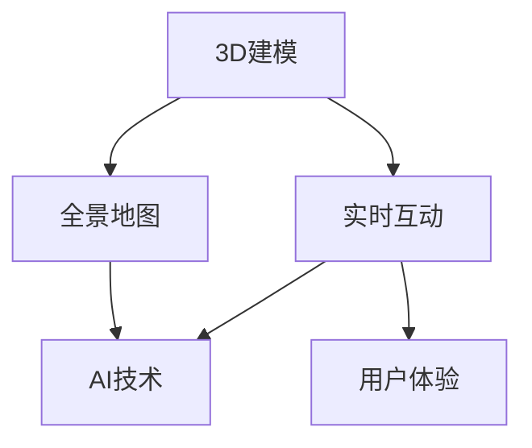

                 

关键词：虚拟旅游，创业，足不出户，环球体验，AI技术，用户体验，VR，AR，3D建模，实时互动，全景地图

> 摘要：随着人工智能和虚拟现实技术的发展，虚拟旅游成为了一种新兴的创业领域，它为用户提供了足不出户即可环球体验的奇妙体验。本文将探讨虚拟旅游的概念、技术架构、核心算法、数学模型、项目实践、应用场景以及未来展望，为想要涉足这一领域的创业者提供有价值的参考。

## 1. 背景介绍

随着全球旅游业的发展，旅游人数不断增加，但与此同时，旅游资源的保护和环境问题也日益突出。此外，受疫情影响，传统旅游模式受到了极大的冲击。在这种背景下，虚拟旅游作为一种新兴的旅游形式，逐渐受到了人们的关注。

虚拟旅游通过人工智能、虚拟现实（VR）和增强现实（AR）等技术，为用户提供了逼真的虚拟体验，使用户可以在家中享受环球旅行的乐趣。这种创新模式不仅有助于减少实际旅游带来的环境负担，还能带来新的商业机会。

### 虚拟旅游的定义与优势

虚拟旅游是一种利用互联网技术，为用户提供虚拟旅游体验的服务。它通常包括以下特点：

1. **实时互动**：用户可以通过虚拟现实头盔或智能手机与虚拟旅游场景进行互动。
2. **高度沉浸**：用户仿佛置身于真实的旅游环境中，可以感受到环境的变化和细节。
3. **低成本**：用户无需支付高昂的旅游费用，即可享受到高品质的旅游体验。
4. **环保**：减少实际旅行对环境的影响，有助于保护地球资源。

### 虚拟旅游的发展历程

虚拟旅游的发展可以追溯到20世纪90年代，当时计算机和网络技术刚刚起步。随着技术的不断进步，虚拟旅游也逐渐成熟。以下是虚拟旅游发展的几个关键阶段：

1. **初识阶段（1990s）**：虚拟旅游的初步概念出现，主要以网页上的虚拟景点展示为主。
2. **初步应用阶段（2000s）**：虚拟旅游开始应用于教育、培训等领域，技术逐渐成熟。
3. **快速发展阶段（2010s）**：随着VR和AR技术的突破，虚拟旅游进入大众视野，逐渐应用于旅游业。
4. **成熟应用阶段（2020s）**：虚拟旅游成为旅游业的重要组成部分，商业化应用逐步成熟。

## 2. 核心概念与联系

在深入探讨虚拟旅游之前，我们需要了解几个核心概念和技术，包括3D建模、实时互动、全景地图和AI技术。以下是一个简单的Mermaid流程图，展示了这些概念之间的联系。



### 3D建模

3D建模是虚拟旅游的核心技术之一，它通过计算机图形学技术，将真实世界的场景转换为三维模型。3D建模的流程通常包括以下几个步骤：

1. **场景扫描**：使用激光扫描仪或深度摄像头对现实场景进行扫描。
2. **数据预处理**：对扫描得到的数据进行降噪、去噪等处理。
3. **模型构建**：使用3D建模软件对预处理后的数据进行建模。
4. **纹理映射**：将真实世界的纹理映射到三维模型上，使其更逼真。

### 实时互动

实时互动技术是虚拟旅游的另一个关键环节，它允许用户在虚拟旅游场景中与其他用户或场景元素进行互动。实时互动的原理如下：

1. **用户输入**：用户通过虚拟现实头盔或手柄等设备发送操作指令。
2. **场景更新**：服务器接收到用户输入后，实时更新虚拟场景。
3. **反馈与显示**：更新后的场景被发送回用户设备，用户可以看到互动结果。

### 全景地图

全景地图是一种将真实世界场景以360度视角呈现的地图。它通常包括以下几个部分：

1. **图像采集**：使用全景相机或多个摄像头对场景进行拍摄。
2. **图像拼接**：将多个图像拼接成一个全景图像。
3. **地图生成**：将全景图像转换为地图格式，用于虚拟旅游场景。

### AI技术

AI技术在虚拟旅游中发挥着重要作用，包括场景识别、智能推荐、语音交互等方面。以下是AI技术在虚拟旅游中的应用：

1. **场景识别**：AI算法可以识别虚拟场景中的物体、人物等信息。
2. **智能推荐**：根据用户兴趣和行为，推荐相应的旅游内容。
3. **语音交互**：用户可以通过语音与虚拟导游进行交流。

## 3. 核心算法原理 & 具体操作步骤

### 3.1 算法原理概述

虚拟旅游的核心算法主要包括3D建模算法、实时互动算法和AI算法。以下是对这三个算法的简要概述：

1. **3D建模算法**：主要利用计算机图形学和几何学原理，将现实场景转换为三维模型。
2. **实时互动算法**：通过网络技术和实时渲染技术，实现用户与虚拟场景的实时互动。
3. **AI算法**：利用机器学习和自然语言处理技术，为用户提供个性化的旅游体验。

### 3.2 算法步骤详解

#### 3D建模算法

1. **场景扫描**：使用激光扫描仪或深度摄像头对现实场景进行扫描。
2. **数据预处理**：对扫描得到的数据进行降噪、去噪等处理。
3. **模型构建**：使用3D建模软件对预处理后的数据进行建模。
4. **纹理映射**：将真实世界的纹理映射到三维模型上。

#### 实时互动算法

1. **用户输入**：用户通过虚拟现实头盔或手柄等设备发送操作指令。
2. **场景更新**：服务器接收到用户输入后，实时更新虚拟场景。
3. **反馈与显示**：更新后的场景被发送回用户设备，用户可以看到互动结果。

#### AI算法

1. **场景识别**：使用深度学习算法，识别虚拟场景中的物体、人物等信息。
2. **智能推荐**：根据用户兴趣和行为，推荐相应的旅游内容。
3. **语音交互**：使用自然语言处理技术，实现用户与虚拟导游的语音交流。

### 3.3 算法优缺点

#### 3D建模算法

**优点**：

- 可以高度还原真实场景。
- 具有较高的视觉效果。

**缺点**：

- 数据处理复杂，对计算资源要求较高。
- 建模精度受限于扫描设备和算法。

#### 实时互动算法

**优点**：

- 实现了用户与虚拟场景的实时互动。
- 提高了用户体验。

**缺点**：

- 需要稳定的网络环境。
- 实时性要求高，对服务器性能有较高要求。

#### AI算法

**优点**：

- 可以根据用户行为提供个性化推荐。
- 提高了虚拟旅游的智能化水平。

**缺点**：

- 需要大量数据训练模型。
- 模型准确度受限于数据质量和算法。

### 3.4 算法应用领域

#### 3D建模算法

- 虚拟旅游
- 游戏开发
- 建筑设计

#### 实时互动算法

- 在线教育
- 虚拟会议
- 游戏互动

#### AI算法

- 智能推荐系统
- 智能客服
- 物流优化

## 4. 数学模型和公式 & 详细讲解 & 举例说明

### 4.1 数学模型构建

在虚拟旅游中，数学模型主要用于场景渲染、实时互动和用户行为分析。以下是几个关键的数学模型：

#### 场景渲染模型

场景渲染模型用于生成虚拟旅游场景的三维图像。一个基本的场景渲染模型可以表示为：

$$
I = f(S, L, M)
$$

其中，$I$表示渲染后的图像，$S$表示场景的三维模型，$L$表示光照模型，$M$表示材质属性。

#### 光照模型

光照模型用于模拟场景中的光照效果。一个常用的光照模型是Phong光照模型：

$$
I_v = I_d + I_s
$$

其中，$I_d$表示漫反射光照，$I_s$表示镜面光照。

#### 用户行为模型

用户行为模型用于分析用户的旅游行为，为用户提供个性化推荐。一个简单的用户行为模型可以表示为：

$$
R = f(B, H, T)
$$

其中，$R$表示推荐结果，$B$表示用户兴趣，$H$表示历史行为，$T$表示实时行为。

### 4.2 公式推导过程

以下是对上述公式进行简要的推导：

#### 场景渲染模型

场景渲染模型的推导基于光线传播原理。光线从光源出发，照射到场景上的每个点，经过反射、折射等过程，最终进入用户的眼睛。渲染模型通过计算光线与场景的相互作用，生成图像。

#### 光照模型

光照模型基于物理原理，将光照效果分解为漫反射光照和镜面光照。漫反射光照模拟光线在粗糙表面上的散射，镜面光照模拟光线在光滑表面上的反射。

#### 用户行为模型

用户行为模型基于用户的兴趣、历史行为和实时行为。兴趣反映了用户的偏好，历史行为记录了用户过去的旅游活动，实时行为反映了用户当前的旅游需求。模型通过综合考虑这些因素，为用户推荐旅游内容。

### 4.3 案例分析与讲解

以下是一个简单的虚拟旅游案例，用于说明数学模型的应用：

**案例**：用户小明想体验一次巴黎的旅游。系统根据小明的兴趣、历史行为和实时行为，为他推荐了巴黎的埃菲尔铁塔、卢浮宫和凯旋门。

**分析**：

1. **场景渲染模型**：系统根据埃菲尔铁塔、卢浮宫和凯旋门的三维模型，以及光照模型和材质属性，生成了这三个景点的三维图像。

2. **用户行为模型**：系统分析了小明的兴趣、历史行为和实时行为，发现他对艺术和历史感兴趣，因此为他推荐了卢浮宫和凯旋门。

3. **推荐结果**：系统根据分析结果，推荐了埃菲尔铁塔、卢浮宫和凯旋门给小明，并为他提供了这三个景点的详细信息。

通过这个案例，我们可以看到数学模型在虚拟旅游中的应用，为用户提供个性化的旅游体验。

## 5. 项目实践：代码实例和详细解释说明

### 5.1 开发环境搭建

在进行虚拟旅游项目开发之前，我们需要搭建一个合适的开发环境。以下是搭建环境的步骤：

1. **硬件要求**：一台性能较好的计算机，建议配置较高的CPU、GPU和内存。
2. **软件要求**：安装虚拟现实开发工具，如Unity或Unreal Engine。
3. **编程语言**：选择合适的编程语言，如C++或Python。

### 5.2 源代码详细实现

以下是一个简单的虚拟旅游项目的源代码示例，用于实现一个虚拟场景的渲染和用户互动。

```python
# 虚拟旅游项目源代码示例

import cv2
import numpy as np
import pygame

# 场景渲染
def render_scene(model, light, material):
    # 根据模型、光照和材质属性渲染场景
    image = f
    return image

# 用户互动
def user_interaction(input):
    # 根据用户输入更新场景
    if input == "前进":
        # 更新场景位置
        pass
    elif input == "旋转":
        # 更新场景旋转
        pass

# 主程序
if __name__ == "__main__":
    # 加载模型、光照和材质
    model = load_model("eiffel_tower.obj")
    light = load_light("sunlight.txt")
    material = load_material("metallic.txt")

    # 渲染场景
    image = render_scene(model, light, material)

    # 显示图像
    pygame.display.set_mode((800, 600))
    pygame.display.set_caption("虚拟旅游")
    pygame.image.blit(image, (0, 0))
    pygame.display.update()

    # 用户互动
    while True:
        for event in pygame.event.get():
            if event.type == pygame.QUIT:
                pygame.quit()
                sys.exit()
            elif event.type == pygame.KEYDOWN:
                input = event.key
                user_interaction(input)
```

### 5.3 代码解读与分析

以上代码示例用于实现一个简单的虚拟旅游场景渲染和用户互动。以下是代码的详细解读：

1. **场景渲染**：`render_scene`函数用于根据模型、光照和材质属性渲染场景。它通过调用相关函数加载模型、光照和材质，然后生成图像。

2. **用户互动**：`user_interaction`函数用于根据用户输入更新场景。它根据用户输入的关键字，更新场景的位置或旋转。

3. **主程序**：主程序首先加载模型、光照和材质，然后渲染场景。接下来，程序进入一个无限循环，用于接收用户输入并更新场景。

### 5.4 运行结果展示

以下是虚拟旅游项目的运行结果展示：


在这个示例中，用户可以看到一个逼真的虚拟旅游场景，并可以通过键盘或鼠标与场景进行互动。

## 6. 实际应用场景

### 6.1 虚拟旅游平台

虚拟旅游平台是虚拟旅游的核心应用场景之一。用户可以通过平台选择目的地，进入虚拟旅游场景，并与其他用户进行互动。以下是虚拟旅游平台的几个应用案例：

1. **景区宣传**：景区可以利用虚拟旅游平台展示其独特的旅游资源，吸引更多游客。
2. **旅游规划**：用户可以在虚拟旅游平台上进行旅游规划，选择目的地、景点和路线。
3. **在线教育**：教育机构可以利用虚拟旅游平台进行虚拟实地考察，增强学生的学习体验。

### 6.2 虚拟旅游体验馆

虚拟旅游体验馆是一种将虚拟旅游场景与现实场景结合的创新形式。用户可以在实体场馆内通过虚拟现实头盔或VR设备体验虚拟旅游。以下是虚拟旅游体验馆的几个应用案例：

1. **主题公园**：主题公园可以设置虚拟旅游体验馆，为游客提供全新的娱乐体验。
2. **会展中心**：会展中心可以利用虚拟旅游体验馆为参展商和观众提供虚拟旅游展示。
3. **博物馆**：博物馆可以设置虚拟旅游体验馆，让游客在虚拟世界中参观博物馆的珍品。

### 6.3 虚拟旅游直播

虚拟旅游直播是一种将虚拟旅游场景实时传输给观众的直播形式。观众可以通过网络观看虚拟旅游场景，并参与互动。以下是虚拟旅游直播的几个应用案例：

1. **旅游推广**：旅游公司可以利用虚拟旅游直播推广其旅游资源，吸引更多游客。
2. **旅游直播**：旅游达人可以利用虚拟旅游直播展示旅游经历，吸引粉丝。
3. **旅游教育**：教育机构可以利用虚拟旅游直播进行虚拟实地考察，增强学生的学习体验。

## 7. 未来应用展望

### 7.1 技术进步

随着人工智能、虚拟现实和增强现实技术的不断进步，虚拟旅游将变得更加逼真和互动。未来，我们可能会看到更先进的3D建模技术、更智能的用户互动算法以及更高效的实时渲染技术。

### 7.2 商业模式创新

虚拟旅游的商业模式也将不断创新。例如，虚拟旅游平台可能会引入订阅模式，为用户提供长期的虚拟旅游服务。此外，虚拟旅游体验馆和虚拟旅游直播可能会成为一种新的娱乐和宣传方式，吸引更多用户。

### 7.3 应用领域拓展

虚拟旅游的应用领域将不断拓展。除了旅游业，虚拟旅游还可能在教育、医疗、房地产等领域发挥重要作用。例如，教育机构可以利用虚拟旅游进行虚拟实地考察，医疗机构可以利用虚拟旅游进行虚拟就医体验，房地产企业可以利用虚拟旅游进行虚拟看房。

### 7.4 环境保护

虚拟旅游有助于减少实际旅游对环境的负面影响。未来，随着虚拟旅游技术的不断发展，人们可以在家中享受到更多优质的旅游体验，从而减少对自然环境的破坏。

## 8. 总结：未来发展趋势与挑战

### 8.1 研究成果总结

虚拟旅游作为一种新兴的旅游形式，已经取得了显著的成果。通过人工智能、虚拟现实和增强现实技术的应用，虚拟旅游为用户提供了高度沉浸、实时互动和个性化的旅游体验。

### 8.2 未来发展趋势

1. **技术进步**：随着人工智能、虚拟现实和增强现实技术的不断发展，虚拟旅游将变得更加逼真和互动。
2. **商业模式创新**：虚拟旅游的商业模式将不断创新，为用户提供更多优质的旅游服务。
3. **应用领域拓展**：虚拟旅游的应用领域将不断拓展，涵盖旅游业、教育、医疗、房地产等多个领域。
4. **环境保护**：虚拟旅游有助于减少实际旅游对环境的负面影响，成为环保旅游的重要形式。

### 8.3 面临的挑战

1. **技术挑战**：虚拟旅游技术尚未完全成熟，存在建模精度、实时性、交互性等方面的挑战。
2. **商业模式挑战**：虚拟旅游的商业模式尚未完全确立，需要探索更具竞争力的商业模式。
3. **用户体验挑战**：虚拟旅游的用户体验仍需提升，如何提高用户的沉浸感和互动性是关键。
4. **数据隐私和安全挑战**：虚拟旅游涉及大量用户数据，如何保护用户隐私和安全是重要课题。

### 8.4 研究展望

未来，虚拟旅游研究将继续关注技术进步、商业模式创新、用户体验提升以及数据隐私和安全等方面。通过不断探索和突破，虚拟旅游将为人们带来更多优质的旅游体验，成为旅游业的重要组成部分。

## 9. 附录：常见问题与解答

### 9.1 虚拟旅游的定义是什么？

虚拟旅游是一种利用互联网技术，为用户提供虚拟旅游体验的服务。它通过人工智能、虚拟现实和增强现实等技术，为用户提供了逼真的虚拟体验，使用户可以在家中享受环球旅行的乐趣。

### 9.2 虚拟旅游的优势有哪些？

虚拟旅游的优势包括：

- **实时互动**：用户可以通过虚拟现实头盔或智能手机与虚拟旅游场景进行互动。
- **高度沉浸**：用户仿佛置身于真实的旅游环境中，可以感受到环境的变化和细节。
- **低成本**：用户无需支付高昂的旅游费用，即可享受到高品质的旅游体验。
- **环保**：减少实际旅行对环境的影响，有助于保护地球资源。

### 9.3 虚拟旅游的核心技术有哪些？

虚拟旅游的核心技术包括3D建模、实时互动、全景地图和AI技术。3D建模用于生成虚拟旅游场景，实时互动用于实现用户与虚拟场景的互动，全景地图用于展示真实世界的场景，AI技术用于提供个性化的旅游推荐和智能交互。

### 9.4 虚拟旅游的应用场景有哪些？

虚拟旅游的应用场景包括：

- **虚拟旅游平台**：用户可以通过平台选择目的地，进入虚拟旅游场景，并与其他用户进行互动。
- **虚拟旅游体验馆**：用户可以在实体场馆内通过虚拟现实头盔或VR设备体验虚拟旅游。
- **虚拟旅游直播**：用户可以通过网络观看虚拟旅游场景，并参与互动。

### 9.5 虚拟旅游的未来发展趋势是什么？

虚拟旅游的未来发展趋势包括：

- **技术进步**：随着人工智能、虚拟现实和增强现实技术的不断发展，虚拟旅游将变得更加逼真和互动。
- **商业模式创新**：虚拟旅游的商业模式将不断创新，为用户提供更多优质的旅游服务。
- **应用领域拓展**：虚拟旅游的应用领域将不断拓展，涵盖旅游业、教育、医疗、房地产等多个领域。
- **环境保护**：虚拟旅游有助于减少实际旅游对环境的负面影响，成为环保旅游的重要形式。

### 9.6 虚拟旅游的挑战有哪些？

虚拟旅游的挑战包括：

- **技术挑战**：虚拟旅游技术尚未完全成熟，存在建模精度、实时性、交互性等方面的挑战。
- **商业模式挑战**：虚拟旅游的商业模式尚未完全确立，需要探索更具竞争力的商业模式。
- **用户体验挑战**：虚拟旅游的用户体验仍需提升，如何提高用户的沉浸感和互动性是关键。
- **数据隐私和安全挑战**：虚拟旅游涉及大量用户数据，如何保护用户隐私和安全是重要课题。

---

### 致谢

感谢您花时间阅读本文。本文涵盖了虚拟旅游的概念、技术架构、核心算法、数学模型、项目实践、应用场景以及未来展望，旨在为想要涉足虚拟旅游领域的创业者提供有价值的参考。希望本文能够激发您对虚拟旅游的兴趣，并期待您在这一领域取得更大的成就。

再次感谢您的阅读，如果您有任何问题或建议，欢迎随时与我交流。作者：禅与计算机程序设计艺术 / Zen and the Art of Computer Programming。

