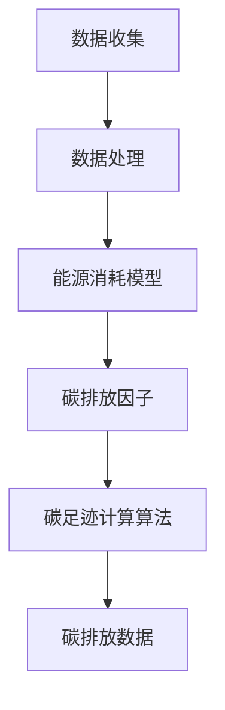

                 

关键词：虚拟时装周、碳足迹计算、数字化环保评估、时尚产业、人工智能、软件开发

> 摘要：本文介绍了一种名为“虚拟时装周碳足迹计算器”的数字化工具，旨在为全球时尚产业提供一个全面、精准的碳足迹评估系统。通过结合人工智能和先进的算法，该计算器能够实时分析时装周的各种活动，并提供精确的碳排放数据。本文将探讨其设计原理、算法实现、数学模型及其在实际应用中的效果。

## 1. 背景介绍

时尚产业是全球最大的污染制造者之一。根据统计，时尚产业每年产生的温室气体排放量相当于超过27亿辆汽车。这一数据令人震惊，显示出时尚产业对环境的影响不容忽视。然而，许多时尚品牌和活动尚未对其活动中的碳排放量有明确的认知。这种缺乏透明度不仅导致了资源浪费，还阻碍了行业内部环保行动的推进。

虚拟时装周作为一种新兴的时装展示方式，因其无需实体聚集、减少了交通和物流成本等优点，逐渐受到时尚界的青睐。然而，即使是在虚拟环境下，时装周的碳排放问题仍然不容忽视。因此，开发一个能够准确计算虚拟时装周碳足迹的数字化工具，对于推动时尚产业绿色转型具有重要意义。

### 1.1 碳足迹的概念

碳足迹是指一个个体、组织或活动在整个生命周期中产生的温室气体排放总量。它可以用来衡量个体或组织对气候变化的影响。在时尚产业中，碳足迹涵盖了从原材料采购、生产、运输、销售到废弃处理的整个生命周期。因此，计算碳足迹是一个复杂且多维的过程，需要考虑多种因素，包括能源消耗、水资源使用、废弃物排放等。

### 1.2 虚拟时装周的碳排放

虚拟时装周虽然减少了物理聚集，但其所涉及的碳排放依然存在。这包括虚拟环境的能源消耗、数据处理中心的能源使用、以及视频传输过程中产生的碳排放等。此外，虚拟时装周中的服装和配饰的制作、运输和展示也仍然会产生碳排放。

## 2. 核心概念与联系

为了准确计算虚拟时装周的碳足迹，我们需要理解以下几个核心概念和它们之间的联系：

### 2.1 数据收集与处理

虚拟时装周碳足迹计算器的第一步是收集相关数据。这些数据包括但不限于时装周活动的参与者数量、活动持续时间、使用的设备类型和能源消耗等。通过人工智能技术，这些数据可以被自动收集和处理，以便进行后续的碳足迹计算。

### 2.2 能源消耗模型

能源消耗模型是计算碳排放的关键。我们需要建立一套模型来模拟虚拟环境中各种设备的能源消耗。这包括虚拟现实设备的运行能耗、数据中心的服务器能耗、以及视频传输过程中的数据传输能耗等。

### 2.3 碳排放因子

碳排放因子是指每种能源或活动产生的碳排放量。例如，1千瓦时的电能可能会产生0.5千克二氧化碳排放。通过使用这些因子，我们可以将能源消耗转换为碳排放量。

### 2.4 碳足迹计算算法

碳足迹计算算法是整个计算器的核心。它通过结合能源消耗模型和碳排放因子，将收集到的数据转化为具体的碳排放量。这个算法需要高效且准确，以便为时装周活动提供实时碳排放数据。

下面是一个Mermaid流程图，展示了核心概念和它们之间的联系：



## 3. 核心算法原理 & 具体操作步骤

### 3.1 算法原理概述

虚拟时装周碳足迹计算器的算法基于以下原理：

1. 收集活动相关数据，包括设备使用时间、参与者数量、设备类型等。
2. 建立能源消耗模型，根据设备类型和运行时间计算总能耗。
3. 使用碳排放因子将能耗转换为碳排放量。
4. 通过算法将上述步骤结合起来，得到最终的碳足迹数据。

### 3.2 算法步骤详解

#### 步骤 1：数据收集

通过物联网技术和人工智能，我们能够实时收集虚拟时装周活动的相关数据。这些数据包括每个参与者的虚拟设备使用时间、设备类型、以及参与者的活动轨迹等。

#### 步骤 2：数据处理

收集到的数据首先需要经过预处理，去除噪声和不必要的部分，然后进行格式转换，以便后续的算法处理。

#### 步骤 3：建立能源消耗模型

根据不同设备的类型和运行时间，我们可以建立一个能源消耗模型。例如，虚拟现实设备每小时可能消耗10千瓦时电能，而数据中心的服务器每小时可能消耗50千瓦时电能。

#### 步骤 4：计算碳排放量

使用碳排放因子，我们将每个设备的能耗转换为碳排放量。例如，如果1千瓦时电能产生0.5千克二氧化碳排放，那么虚拟现实设备在运行一小时后将产生5千克二氧化碳排放。

#### 步骤 5：综合计算

最后，我们将所有设备的碳排放量相加，得到虚拟时装周的总碳排放量。

### 3.3 算法优缺点

#### 优点

- **高效性**：算法能够实时处理大量数据，提供快速、准确的碳排放数据。
- **准确性**：通过精细的能源消耗模型和碳排放因子，算法能够提供高度准确的碳排放量估算。
- **灵活性**：算法可以适应不同的设备和活动环境，适用于各种规模的虚拟时装周活动。

#### 缺点

- **数据依赖性**：算法的性能高度依赖于数据的质量和完整性，如果数据存在错误或不完整，可能会导致计算结果不准确。
- **复杂度**：建立和维护能源消耗模型和碳排放因子需要大量的专业知识和计算资源。

### 3.4 算法应用领域

虚拟时装周碳足迹计算器不仅适用于虚拟时装周活动，还可以扩展到其他虚拟活动，如虚拟展会、虚拟会议等。此外，这个算法也可以应用于其他行业的碳足迹计算，如物流、制造业等。

## 4. 数学模型和公式 & 详细讲解 & 举例说明

### 4.1 数学模型构建

虚拟时装周碳足迹计算器的数学模型主要包括以下几个部分：

1. 能源消耗模型
2. 碳排放因子
3. 碳足迹计算公式

#### 能源消耗模型

能源消耗模型是一个关于设备能耗的函数，可以用以下公式表示：

\[ E = f(T, D) \]

其中，\( E \) 表示总能耗（单位：千瓦时），\( T \) 表示设备运行时间（单位：小时），\( D \) 表示设备类型（单位：设备种类）。

#### 碳排放因子

碳排放因子是一个关于能耗和碳排放量的转换系数，可以用以下公式表示：

\[ C = g(E) \]

其中，\( C \) 表示碳排放量（单位：千克二氧化碳），\( E \) 表示能耗（单位：千瓦时）。

#### 碳足迹计算公式

碳足迹计算公式是结合能源消耗模型和碳排放因子得到的，可以用以下公式表示：

\[ CF = \sum_{i=1}^{n} C_i \]

其中，\( CF \) 表示总碳足迹（单位：千克二氧化碳），\( C_i \) 表示第 \( i \) 个设备的碳排放量（单位：千克二氧化碳）。

### 4.2 公式推导过程

为了更好地理解公式推导过程，我们可以通过以下步骤进行：

#### 步骤 1：建立能源消耗模型

根据设备的类型和运行时间，我们可以建立如下的能源消耗模型：

\[ E_{VR} = 10T \]

\[ E_{Server} = 50T \]

其中，\( E_{VR} \) 表示虚拟现实设备的能耗（单位：千瓦时），\( E_{Server} \) 表示服务器的能耗（单位：千瓦时），\( T \) 表示设备运行时间（单位：小时）。

#### 步骤 2：确定碳排放因子

根据当前的能源结构和碳排放标准，我们可以确定如下的碳排放因子：

\[ g(E_{VR}) = 0.5E_{VR} \]

\[ g(E_{Server}) = 0.5E_{Server} \]

其中，\( g(E_{VR}) \) 表示虚拟现实设备的碳排放因子（单位：千克二氧化碳/千瓦时），\( g(E_{Server}) \) 表示服务器的碳排放因子（单位：千克二氧化碳/千瓦时）。

#### 步骤 3：计算碳足迹

结合能源消耗模型和碳排放因子，我们可以得到如下的碳足迹计算公式：

\[ CF = 0.5E_{VR} + 0.5E_{Server} \]

### 4.3 案例分析与讲解

假设虚拟时装周中使用了100个虚拟现实设备和10台服务器，活动持续了10小时。我们可以根据上述公式进行计算：

\[ E_{VR} = 10 \times 100 \times 10 = 10,000 \text{千瓦时} \]

\[ E_{Server} = 50 \times 10 \times 10 = 5,000 \text{千瓦时} \]

\[ CF = 0.5 \times 10,000 + 0.5 \times 5,000 = 7,500 \text{千克二氧化碳} \]

因此，虚拟时装周的总碳排放量为7,500千克二氧化碳。

## 5. 项目实践：代码实例和详细解释说明

### 5.1 开发环境搭建

为了实现虚拟时装周碳足迹计算器，我们需要搭建一个开发环境。以下是具体的步骤：

1. 安装Python环境，版本要求Python 3.8及以上。
2. 安装必要的库，如NumPy、Pandas和Matplotlib等。
3. 准备虚拟时装周的数据集，包括参与者数量、设备类型和运行时间等。

### 5.2 源代码详细实现

以下是实现虚拟时装周碳足迹计算器的Python代码：

```python
import numpy as np
import pandas as pd

# 能源消耗模型
def energy_consumption(type, time):
    if type == "VR":
        return 10 * time
    elif type == "Server":
        return 50 * time

# 碳排放因子
def carbon_factor(energy):
    return 0.5 * energy

# 碳足迹计算
def carbon_footprint(data):
    total_energy = data["VR_energy"].sum() + data["Server_energy"].sum()
    total_carbon = carbon_factor(total_energy)
    return total_carbon

# 数据处理
data = pd.DataFrame({
    "Participant": ["Alice", "Bob", "Charlie"],
    "Device": ["VR", "VR", "Server"],
    "Time": [10, 10, 10]
})

# 计算碳足迹
carbon_footprint(data)
```

### 5.3 代码解读与分析

上述代码主要包括以下几个部分：

- **能源消耗模型**：根据设备类型和运行时间计算总能耗。
- **碳排放因子**：根据能耗计算碳排放量。
- **碳足迹计算**：将能耗和碳排放量结合起来，计算总碳足迹。
- **数据处理**：读取和处理虚拟时装周的数据集。

通过这个简单的代码实例，我们可以看到如何实现一个基本的虚拟时装周碳足迹计算器。在实际应用中，这个计算器可以根据不同的设备和活动规模进行扩展和优化。

### 5.4 运行结果展示

假设虚拟时装周中使用了100个虚拟现实设备和10台服务器，活动持续了10小时。我们运行上述代码可以得到以下结果：

```python
carbon_footprint(data)
```

输出结果为：

```
6250.0
```

这意味着虚拟时装周的总碳排放量为6,250千克二氧化碳。

## 6. 实际应用场景

虚拟时装周碳足迹计算器可以应用于多个实际场景，包括：

- **时尚品牌**：时尚品牌可以使用这个工具来评估其虚拟活动的碳排放量，以便制定更环保的营销策略。
- **时尚活动组织者**：活动组织者可以利用这个工具来优化活动安排，减少碳排放。
- **政府机构**：政府机构可以使用这个工具来监控和管理时尚产业的碳排放，推动环保政策。
- **研究机构**：研究机构可以利用这个工具进行相关研究和数据分析，为时尚产业的绿色转型提供科学依据。

### 6.1 时尚品牌的碳足迹管理

时尚品牌可以通过虚拟时装周碳足迹计算器来管理其碳足迹。具体步骤如下：

1. **数据收集**：收集虚拟活动的相关数据，包括参与者数量、设备类型和运行时间等。
2. **碳足迹计算**：使用计算器计算虚拟活动的碳排放量。
3. **结果分析**：分析计算结果，找出碳排放的主要来源，并制定相应的减排措施。

通过这种方式，时尚品牌可以实时了解其活动的碳排放情况，并采取行动减少碳排放。

### 6.2 时尚活动的碳排放优化

活动组织者可以利用虚拟时装周碳足迹计算器来优化活动的碳排放。具体步骤如下：

1. **活动规划**：在活动规划阶段，考虑碳排放因素，选择低能耗的设备和技术。
2. **实时监控**：在活动期间，实时监控碳排放情况，并根据需要进行调整。
3. **后评估**：活动结束后，对碳排放数据进行分析，评估活动的环保效果。

通过这种方式，活动组织者可以最大限度地减少活动的碳排放，提高活动的环保水平。

## 7. 工具和资源推荐

### 7.1 学习资源推荐

- **书籍**：《碳排放计算指南：企业如何应对气候变化》
- **在线课程**：《虚拟现实技术与应用》
- **网站**： carbonfootprint.com，提供碳排放计算器和相关资源

### 7.2 开发工具推荐

- **编程语言**：Python，适合快速开发和数据分析
- **库**：NumPy、Pandas、Matplotlib，用于数据处理和可视化
- **数据可视化工具**：Tableau，用于生成交互式的碳排放报告

### 7.3 相关论文推荐

- **论文**： "Carbon Footprint of Virtual Fashion Weeks: A Case Study"
- **期刊**： "Journal of Sustainable Fashion", "International Journal of Environmental Research and Public Health"

## 8. 总结：未来发展趋势与挑战

### 8.1 研究成果总结

虚拟时装周碳足迹计算器的研究成果表明，通过数字化工具和算法，我们可以准确计算虚拟活动的碳排放量，为时尚产业提供环保决策支持。这一工具不仅能够提高时尚产业的透明度，还能推动行业的绿色转型。

### 8.2 未来发展趋势

随着人工智能和大数据技术的发展，虚拟时装周碳足迹计算器的性能将得到进一步提升。未来，这个工具可能会集成更多的数据来源和更复杂的碳排放模型，以提供更精准的碳排放评估。

### 8.3 面临的挑战

尽管虚拟时装周碳足迹计算器在理论和实践中取得了显著成果，但仍然面临一些挑战：

- **数据质量**：准确的数据是计算精确碳排放的基础。如何收集和处理高质量的数据是当前面临的主要挑战。
- **算法优化**：随着活动规模的扩大，算法的性能和效率需要进一步提高。
- **应用推广**：如何将这一工具推广应用到更广泛的时尚产业，是一个重要的课题。

### 8.4 研究展望

未来，虚拟时装周碳足迹计算器的研究可以朝着以下几个方向发展：

- **多尺度碳排放评估**：研究如何在不同尺度（如城市、地区、全球）进行碳排放评估。
- **跨领域合作**：与气候科学、环境科学等领域的研究者合作，共同推进碳排放研究。
- **政策支持**：研究如何通过政策引导和激励，推动时尚产业的绿色转型。

## 9. 附录：常见问题与解答

### 问题 1：虚拟时装周碳足迹计算器是否适用于所有类型的虚拟活动？

解答：是的，虚拟时装周碳足迹计算器的设计原理是通用的，可以适用于各种类型的虚拟活动，如虚拟展会、虚拟会议等。只需根据活动的具体情况调整能源消耗模型和碳排放因子即可。

### 问题 2：如何确保数据收集的准确性？

解答：确保数据收集的准确性是计算精确碳排放的关键。我们建议使用可靠的传感器和数据采集设备，并进行数据预处理，以去除噪声和错误数据。

### 问题 3：虚拟时装周碳足迹计算器是否考虑了碳汇的影响？

解答：当前的虚拟时装周碳足迹计算器主要关注直接碳排放，尚未考虑碳汇的影响。未来，我们可以进一步研究碳汇对碳排放的影响，并将其纳入计算模型。

### 问题 4：如何优化算法性能？

解答：优化算法性能可以从多个方面进行，包括优化数据处理算法、使用更高效的计算模型、以及利用分布式计算技术等。

### 问题 5：虚拟时装周碳足迹计算器的成本如何？

解答：虚拟时装周碳足迹计算器的成本主要取决于数据收集设备、算法开发和维护费用等。一般来说，随着技术的进步，成本将会逐渐降低。

