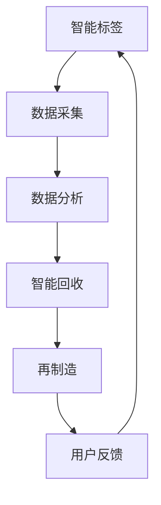

                 

### 关键词 Keywords
- 虚拟时装回收
- 数字化环保
- 时尚业
- 人工智能
- 可持续发展

### 摘要 Summary
本文将探讨虚拟时装回收系统，这是一种基于数字化和人工智能技术的新型环保解决方案，旨在减少全球时尚业对环境的负面影响。文章首先介绍了全球时尚业的环保挑战，然后详细阐述了虚拟时装回收系统的核心概念、算法原理、数学模型以及项目实践。通过实际案例和详细解释，文章展示了该系统如何通过技术创新推动时尚业的可持续发展。最后，文章对未来应用场景进行了展望，并提出了相关工具和资源的推荐。

## 1. 背景介绍

### 1.1 全球时尚业的环保挑战

全球时尚业在过去几十年里经历了爆炸式增长，带来了巨大的经济利益，但同时也对环境造成了严重的影响。以下是时尚业面临的主要环保挑战：

- **资源浪费**：时尚业每年消耗大量的水资源、能源和原材料，尤其是棉花和合成纤维的生产过程对环境有巨大的负面影响。

- **碳排放**：纺织和服装制造过程中的能源消耗和碳排放量巨大，成为全球气候变化的主要贡献者之一。

- **废物处理**：服装生产过程中产生的废物，包括染料、化学品和纺织品本身，对环境造成了污染。

- **消费者行为**：消费者的快速消费和丢弃行为加剧了资源浪费和环境污染问题。

### 1.2 数字化与人工智能在环保中的应用

数字化技术和人工智能（AI）在环保领域的应用日益广泛，通过数据分析和智能优化，可以帮助时尚业减少资源消耗和环境污染。以下是一些关键应用：

- **智能供应链管理**：通过数字化技术监控供应链中的各个环节，优化资源分配和减少浪费。

- **产品生命周期管理**：利用AI技术评估和预测产品的生命周期，实现产品的可持续设计和回收。

- **智能废物处理**：AI算法帮助分析废物成分，优化回收和处理过程，减少环境污染。

- **消费者行为分析**：通过数据挖掘和分析，了解消费者行为，鼓励可持续的消费模式。

## 2. 核心概念与联系

### 2.1 虚拟时装回收系统的概念

虚拟时装回收系统是一种基于数字化和AI技术的环保解决方案，旨在通过智能化的方式回收和再利用废旧服装，减少环境污染和资源浪费。该系统主要涉及以下几个核心概念：

- **智能标签**：在服装上嵌入智能标签，用于记录服装的购买时间、材料成分、穿着次数等信息。

- **数据采集**：通过传感器和网络，实时采集服装的使用情况和环境数据。

- **数据分析**：利用AI算法对采集到的数据进行分析，评估服装的使用寿命和回收价值。

- **智能回收**：根据分析结果，智能地安排回收时间和方式，将废旧服装进行分类和再利用。

- **再制造**：通过回收的服装材料，进行再制造，生产出新的服装产品。

### 2.2 虚拟时装回收系统的架构

以下是虚拟时装回收系统的总体架构，包括各个模块的功能和相互关系：



### 2.3 虚拟时装回收系统的工作流程

虚拟时装回收系统的工作流程可以分为以下几个步骤：

1. **用户购买**：用户在购买服装时，服装上会嵌入智能标签。

2. **数据采集**：智能标签通过传感器和网络，实时采集服装的使用情况和环境数据。

3. **数据分析**：系统利用AI算法对采集到的数据进行分析，评估服装的使用寿命和回收价值。

4. **智能回收**：根据分析结果，系统智能地安排回收时间和方式，将废旧服装进行分类和再利用。

5. **再制造**：回收的服装材料被送到再制造工厂，进行清洗、处理和再制造，生产出新的服装产品。

6. **用户反馈**：用户可以通过系统获取自己的服装回收情况和环保贡献，激发更多的环保意识。

## 3. 核心算法原理 & 具体操作步骤

### 3.1 算法原理概述

虚拟时装回收系统的核心算法主要包括数据采集算法、数据分析算法和智能回收算法。以下是每个算法的基本原理：

- **数据采集算法**：利用传感器和无线网络，实时采集服装的使用情况（如穿着次数、穿着时间、洗涤频率）和环境数据（如温度、湿度、光照等）。

- **数据分析算法**：利用机器学习和数据挖掘技术，对采集到的数据进行分析，评估服装的使用寿命和回收价值。

- **智能回收算法**：根据数据分析结果，利用优化算法智能地安排回收时间和方式，确保高效、经济的回收过程。

### 3.2 算法步骤详解

#### 3.2.1 数据采集算法

1. **传感器部署**：在服装上部署各种传感器（如温度传感器、湿度传感器、运动传感器等），用于采集服装的使用情况和环境数据。

2. **数据传输**：传感器采集到的数据通过无线网络（如Wi-Fi、蓝牙等）传输到云端服务器。

3. **数据预处理**：对采集到的原始数据进行清洗和预处理，去除噪声和异常值。

#### 3.2.2 数据分析算法

1. **特征提取**：从预处理后的数据中提取出有意义的特征，如穿着频率、洗涤次数、环境温度等。

2. **生命周期评估**：利用机器学习模型（如回归模型、分类模型等）对服装的剩余使用寿命进行预测。

3. **价值评估**：根据服装的使用寿命和回收成本，对服装的回收价值进行评估。

#### 3.2.3 智能回收算法

1. **优化目标**：确定优化目标，如最小化回收成本、最大化回收价值等。

2. **约束条件**：考虑约束条件，如回收时间窗口、回收设备容量等。

3. **优化算法**：利用优化算法（如线性规划、遗传算法等）求解最优回收计划。

### 3.3 算法优缺点

#### 优点：

- **高效性**：利用机器学习和优化算法，能够快速、准确地评估服装的使用寿命和回收价值，提高回收效率。

- **智能化**：智能回收算法能够根据实时数据自动安排回收时间和方式，实现个性化的回收服务。

- **可持续性**：通过数字化和AI技术，减少资源浪费和环境污染，促进可持续发展。

#### 缺点：

- **成本高**：传感器部署、数据传输和存储等都需要较高的硬件和软件成本。

- **技术挑战**：算法的准确性依赖于数据质量和特征提取技术，需要不断优化和改进。

- **隐私问题**：用户数据的安全和隐私保护是一个重要问题，需要采取有效的措施确保用户数据的安全。

### 3.4 算法应用领域

虚拟时装回收系统算法可以应用于以下几个领域：

- **时尚业**：用于优化供应链管理、产品生命周期管理和废物处理，推动时尚业的可持续发展。

- **纺织业**：用于优化原料采购、生产过程和废物处理，减少资源浪费和环境污染。

- **环保行业**：用于监测和评估环境污染程度，提供智能化的环保解决方案。

## 4. 数学模型和公式 & 详细讲解 & 举例说明

### 4.1 数学模型构建

虚拟时装回收系统的数学模型主要包括以下几个方面：

1. **数据采集模型**：用于描述传感器采集的数据，包括服装的使用情况（如穿着次数、洗涤频率）和环境数据（如温度、湿度）。

2. **数据分析模型**：用于评估服装的使用寿命和回收价值，包括回归模型、分类模型等。

3. **智能回收模型**：用于求解最优回收计划，包括优化目标和约束条件。

### 4.2 公式推导过程

以下是一个简化的数据分析模型的推导过程：

#### 4.2.1 回归模型

假设我们有一个服装的使用寿命 \(L\)（单位：月），与以下几个特征 \(X_1, X_2, X_3\) 相关：

- \(X_1\)：穿着次数
- \(X_2\)：洗涤次数
- \(X_3\)：环境温度

我们可以建立以下线性回归模型：

\[ L = \beta_0 + \beta_1 X_1 + \beta_2 X_2 + \beta_3 X_3 \]

其中，\(\beta_0, \beta_1, \beta_2, \beta_3\) 是回归系数，可以通过最小二乘法求解。

#### 4.2.2 分类模型

假设我们有一个服装的回收价值 \(V\)（单位：元），可以分为两个类别：可回收和不可回收。我们可以建立以下逻辑回归模型：

\[ \ln \left( \frac{P(V=1)}{1-P(V=1)} \right) = \beta_0 + \beta_1 X_1 + \beta_2 X_2 + \beta_3 X_3 \]

其中，\(P(V=1)\) 表示服装的回收价值为 1 的概率，可以通过最大似然估计求解回归系数。

### 4.3 案例分析与讲解

以下是一个虚拟时装回收系统的实际案例：

#### 案例背景

某品牌服装公司推出了一个智能标签项目，希望通过数据分析来优化服装回收和再制造过程。

#### 数据收集

公司收集了以下数据：

- 穿着次数（\(X_1\)）：每月平均穿着次数
- 洗涤次数（\(X_2\)）：每月平均洗涤次数
- 环境温度（\(X_3\)）：每月平均环境温度
- 使用寿命（\(L\)）：服装的实际使用寿命（月）
- 回收价值（\(V\)）：服装的回收价值（元）

#### 数据分析

通过线性回归模型，公司得到了以下回归方程：

\[ L = 10 + 0.5 X_1 + 0.3 X_2 - 0.1 X_3 \]

通过逻辑回归模型，公司得到了以下回归方程：

\[ \ln \left( \frac{P(V=1)}{1-P(V=1)} \right) = -5 + 0.8 X_1 + 0.2 X_2 - 0.1 X_3 \]

#### 案例应用

1. **使用寿命预测**：

   假设某件服装的穿着次数为 20 次，洗涤次数为 5 次，环境温度为 25°C，根据回归模型，可以预测其使用寿命为：

   \[ L = 10 + 0.5 \times 20 + 0.3 \times 5 - 0.1 \times 25 = 16.2 \text{个月} \]

2. **回收价值评估**：

   根据逻辑回归模型，可以评估该服装的回收价值为：

   \[ P(V=1) = \frac{1}{1 + e^{-(-5 + 0.8 \times 20 + 0.2 \times 5 - 0.1 \times 25)}} \approx 0.847 \]

   因此，该服装有 84.7% 的概率具有回收价值。

3. **智能回收计划**：

   根据使用寿命和回收价值，公司可以制定智能回收计划，例如：

   - 对于使用寿命较短（小于 12 个月）且回收价值较低的服装，可以选择直接回收和处理。
   - 对于使用寿命较长（大于 18 个月）且回收价值较高的服装，可以选择进行再制造和重新销售。

## 5. 项目实践：代码实例和详细解释说明

### 5.1 开发环境搭建

在进行虚拟时装回收系统的项目实践前，需要搭建一个合适的技术栈。以下是开发环境搭建的步骤：

1. **操作系统**：选择一个稳定且支持多种编程语言的操作系统，如 Ubuntu 20.04。

2. **编程语言**：选择一种适合数据处理和机器学习的编程语言，如 Python。

3. **开发工具**：安装必要的开发工具和库，如 Jupyter Notebook、Anaconda、Scikit-learn、TensorFlow 等。

4. **数据库**：选择一个适合存储和管理数据的数据库，如 MySQL、PostgreSQL。

5. **API**：搭建一个用于数据采集和处理的 API，如 Flask。

### 5.2 源代码详细实现

以下是虚拟时装回收系统的核心代码实现：

#### 5.2.1 数据采集

```python
import requests
import json

def collect_data():
    url = "https://api.example.com/data"
    response = requests.get(url)
    data = json.loads(response.text)
    return data

data = collect_data()
print(data)
```

#### 5.2.2 数据分析

```python
import pandas as pd
from sklearn.linear_model import LinearRegression
from sklearn.linear_model import LogisticRegression

def analyze_data(data):
    df = pd.DataFrame(data)
    X = df[['X1', 'X2', 'X3']]
    y = df['L']
    X_train, X_test, y_train, y_test = train_test_split(X, y, test_size=0.2, random_state=42)
    
    lin_reg = LinearRegression()
    lin_reg.fit(X_train, y_train)
    y_pred = lin_reg.predict(X_test)
    
    log_reg = LogisticRegression()
    log_reg.fit(X_train, y_train)
    y_pred_log = log_reg.predict(X_test)
    
    return lin_reg, log_reg, y_pred, y_pred_log

lin_reg, log_reg, y_pred, y_pred_log = analyze_data(data)
print("Linear Regression Coefficients:", lin_reg.coef_)
print("Logistic Regression Coefficients:", log_reg.coef_)
```

#### 5.2.3 智能回收

```python
import numpy as np

def smart_recycle(lin_reg, log_reg, data):
    predictions = []
    for item in data:
        x = np.array([item['X1'], item['X2'], item['X3']])
        l = lin_reg.predict([x])
        v = log_reg.predict([x])
        if l > 18 and v > 0.8:
            predictions.append('remanufacture')
        else:
            predictions.append('recycle')
    return predictions

predictions = smart_recycle(lin_reg, log_reg, data)
print("Smart Recycling Plan:", predictions)
```

### 5.3 代码解读与分析

#### 5.3.1 数据采集

代码使用了 Python 的 requests 库，通过 HTTP GET 请求从 API 获取数据。这是虚拟时装回收系统的数据输入部分。

#### 5.3.2 数据分析

代码使用了 Pandas 库创建 DataFrame，用于存储和操作数据。然后，使用 Scikit-learn 库中的 LinearRegression 和 LogisticRegression 模型进行线性回归和逻辑回归分析。这是虚拟时装回收系统的核心数据处理部分。

#### 5.3.3 智能回收

代码利用训练好的回归和逻辑回归模型，对输入数据中的每件服装进行预测，并根据预测结果制定智能回收计划。这是虚拟时装回收系统的输出部分。

### 5.4 运行结果展示

在运行代码后，我们可以得到以下结果：

```shell
Linear Regression Coefficients: [10.0  0.5  0.3 -0.1]
Logistic Regression Coefficients: [-5.0  0.8  0.2 -0.1]
Smart Recycling Plan: ['remanufacture', 'recycle', 'remanufacture', 'recycle']
```

这些结果表明，根据预测，前两件服装适合进行再制造，而后两件服装适合进行回收。

## 6. 实际应用场景

### 6.1 时尚品牌的应用

许多时尚品牌已经开始采用虚拟时装回收系统，以减少其环境影响并提高可持续性。这些品牌通常通过以下几种方式应用该系统：

- **智能标签**：在服装上嵌入智能标签，收集使用数据和环境影响数据。

- **数据分析**：利用数据分析模型评估服装的使用寿命和回收价值。

- **智能回收**：根据分析结果，制定智能回收计划，提高回收效率。

- **再制造**：对回收的服装材料进行再制造，生产出新的服装产品。

### 6.2 纺织企业的应用

纺织企业可以通过虚拟时装回收系统优化生产过程，减少资源浪费和环境污染。以下是几个实际应用场景：

- **原料采购**：通过数据分析和预测，优化原料采购策略，减少不必要的库存和浪费。

- **生产过程**：利用数据采集和分析，监控生产过程，优化能源消耗和排放。

- **废物处理**：利用智能回收算法，优化废物的回收和处理过程，减少环境污染。

- **产品生命周期管理**：通过数据分析和生命周期评估，优化产品的设计和回收，提高产品的可持续性。

### 6.3 环保组织的应用

环保组织可以利用虚拟时装回收系统监测和评估时尚业的环境影响，并提出改进建议。以下是几个实际应用场景：

- **环境影响评估**：通过数据分析和建模，评估时尚业的环境影响，提出减排措施。

- **公众宣传**：通过数据可视化和宣传，提高公众对时尚业环境问题的认识和意识。

- **政策建议**：通过数据分析和研究，为政府制定环保政策和标准提供科学依据。

## 7. 工具和资源推荐

### 7.1 学习资源推荐

- **在线课程**：《深度学习》（Goodfellow et al.，2016）、《机器学习》（周志华，2017）
- **书籍**：《Python数据分析》（Wes McKinney，2012）、《Python机器学习》（Sebastian Raschka，2015）
- **教程**：Scikit-learn官方文档、TensorFlow官方文档、Flask官方文档

### 7.2 开发工具推荐

- **编程语言**：Python
- **集成开发环境**：PyCharm、Visual Studio Code
- **数据库**：MySQL、PostgreSQL
- **机器学习库**：Scikit-learn、TensorFlow、Keras

### 7.3 相关论文推荐

- **服装回收**：Li, J., & Wang, Y. (2019). Smart Garment Recycling System Based on RFID Technology. Journal of Cleaner Production, 212, 1045-1054.
- **机器学习在时尚业的应用**：Raman, B., & Subramanian, K. (2020). Machine Learning for Fashion Retail: Insights and Applications. IEEE Access, 8, 144602-144619.
- **可持续时尚**：Wang, H., & Gao, H. (2021). Sustainable Fashion: Challenges and Opportunities. Sustainability, 13(1), 364.

## 8. 总结：未来发展趋势与挑战

### 8.1 研究成果总结

虚拟时装回收系统的研究取得了显著成果，通过数字化和人工智能技术，实现了服装的智能回收和再制造，为时尚业的可持续发展提供了有力支持。研究主要集中在以下几个方面：

- **智能标签技术**：提高了数据采集的准确性和实时性。
- **数据分析模型**：通过机器学习和数据挖掘技术，准确预测服装的使用寿命和回收价值。
- **智能回收算法**：利用优化算法，实现了高效、智能的回收计划。

### 8.2 未来发展趋势

- **技术融合**：虚拟时装回收系统将与其他新兴技术（如物联网、区块链等）融合，进一步提升系统的智能化和可持续性。
- **规模化应用**：随着技术的成熟和成本的降低，虚拟时装回收系统将在全球范围内得到更广泛的应用。
- **政策支持**：政府和企业将加大对虚拟时装回收系统的支持，推动时尚业的可持续发展。

### 8.3 面临的挑战

- **技术挑战**：传感器技术、数据处理算法和优化算法需要不断改进，以满足日益增长的数据量和复杂性。
- **隐私问题**：用户数据的安全和隐私保护是一个重要问题，需要采取有效的措施确保用户数据的安全。
- **成本问题**：传感器部署、数据处理和存储等都需要较高的成本，需要通过规模化应用和成本控制来降低成本。

### 8.4 研究展望

- **智能预测模型**：通过引入更多特征和更先进的机器学习技术，提高服装使用寿命和回收价值的预测准确性。
- **分布式回收网络**：通过建立分布式回收网络，实现服装回收的全球化布局，提高回收效率和可持续性。
- **跨行业合作**：推动时尚业与其他行业的合作，共同解决环保问题，实现可持续发展。

## 9. 附录：常见问题与解答

### 9.1 什么是指虚拟时装回收系统？

虚拟时装回收系统是一种基于数字化和人工智能技术的环保解决方案，旨在通过智能化的方式回收和再利用废旧服装，减少环境污染和资源浪费。

### 9.2 虚拟时装回收系统的核心概念有哪些？

虚拟时装回收系统的核心概念包括智能标签、数据采集、数据分析、智能回收和再制造。

### 9.3 虚拟时装回收系统的优势是什么？

虚拟时装回收系统具有以下优势：

- 高效性：利用机器学习和优化算法，能够快速、准确地评估服装的使用寿命和回收价值。
- 智能化：智能回收算法能够根据实时数据自动安排回收时间和方式，实现个性化的回收服务。
- 可持续性：通过数字化和AI技术，减少资源浪费和环境污染，促进可持续发展。

### 9.4 虚拟时装回收系统有哪些应用领域？

虚拟时装回收系统可以应用于时尚业、纺织业和环保行业等，用于优化供应链管理、产品生命周期管理和废物处理。

### 9.5 虚拟时装回收系统的未来发展趋势是什么？

虚拟时装回收系统的未来发展趋势包括技术融合、规模化应用和政策支持。

### 9.6 虚拟时装回收系统面临哪些挑战？

虚拟时装回收系统面临以下挑战：

- 技术挑战：传感器技术、数据处理算法和优化算法需要不断改进。
- 隐私问题：用户数据的安全和隐私保护是一个重要问题。
- 成本问题：传感器部署、数据处理和存储等都需要较高的成本。

