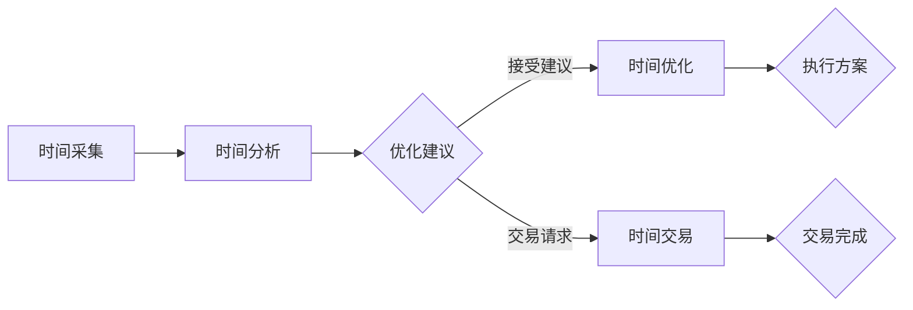

                 

### 关键词 Keywords

- 虚拟时间银行
- AI时间管理
- 人工智能
- 资源分配
- 时间优化

<|assistant|>### 摘要 Summary

本文探讨了虚拟时间银行这一创新概念，及其如何通过人工智能（AI）来管理和优化时间资源。我们首先介绍了虚拟时间银行的基本原理和背景，随后详细阐述了AI在时间管理中的核心作用。文章进一步分析了AI管理时间的算法原理、数学模型，并通过实际项目案例展示了其具体应用。最后，我们对虚拟时间银行在未来技术发展中的应用前景进行了展望，并提出了可能面临的挑战和未来研究方向。

## 1. 背景介绍

### 虚拟时间银行的概念

虚拟时间银行是一种创新的资源管理理念，旨在通过技术手段，实现对时间资源的虚拟化管理和分配。这种模式借鉴了传统银行对货币资源的虚拟存储和管理方法，将时间资源作为一种可以存储、交换和增值的资产。虚拟时间银行通过AI技术，实现对用户时间的智能分析和优化，从而提高个体的时间利用效率。

### 时间资源的价值

时间是一种有限的、不可再生的资源。在快节奏的现代生活中，如何高效地利用时间成为许多人关注的焦点。传统的时间管理方法，如制定计划、设定目标和跟踪进度，虽然在一定程度上能够帮助人们更好地管理时间，但往往难以应对复杂多变的生活和工作环境。因此，需要一种更加智能、自动化的方式来管理和优化时间资源。

### 人工智能在时间管理中的应用

人工智能技术在过去几十年中取得了显著的进展，尤其在数据分析和模式识别方面。AI可以通过分析大量数据，发现用户行为模式，预测未来的时间需求，并自动调整日程安排，从而实现时间资源的智能优化。例如，智能助手可以提醒用户重要的会议或任务，推荐最佳行动方案，甚至预测用户可能遇到的时间冲突。

## 2. 核心概念与联系

### 虚拟时间银行的工作原理

虚拟时间银行的核心在于将时间资源虚拟化为一种可交易、可储存的资产。其基本原理包括以下几个步骤：

1. **时间采集**：用户将每日的活动、任务和事件记录下来，这些数据将作为时间资源的原始数据源。
2. **时间分析**：AI系统通过分析用户的记录数据，识别出重复的活动、优先级和习惯，为后续的时间分配提供依据。
3. **时间优化**：基于分析结果，AI系统会为用户提供一系列优化建议，包括日程调整、任务优先级排序和时间冲突预警等。
4. **时间交易**：用户可以通过虚拟时间银行平台，与其他用户进行时间资源的交换，例如用一段时间的学习时间换取一段健身时间。

### AI在虚拟时间银行中的作用

AI在虚拟时间银行中起着至关重要的作用，其主要功能包括：

1. **数据挖掘与分析**：AI通过机器学习和数据挖掘技术，从用户行为数据中提取有价值的信息，为时间优化提供支持。
2. **智能推荐**：基于用户行为模式和偏好，AI可以智能推荐最优的时间利用方案，包括任务分配、日程安排和休息时间规划等。
3. **决策支持**：AI可以辅助用户做出最优的时间管理决策，减少决策过程中的复杂性和主观性。
4. **自动化执行**：AI能够自动化执行时间优化方案，如自动调整日程、提醒重要任务等，从而提高时间利用效率。

### Mermaid 流程图

下面是一个简化的虚拟时间银行工作流程的 Mermaid 流程图：



## 3. 核心算法原理 & 具体操作步骤

### 3.1 算法原理概述

虚拟时间银行的算法原理主要基于数据挖掘、机器学习、优化算法和图论等领域的知识。其核心思想是通过分析用户的行为数据，构建用户行为模型，进而实现时间资源的优化分配。

### 3.2 算法步骤详解

1. **数据采集与预处理**：从用户处获取时间日志数据，包括时间戳、活动类型、持续时长等信息。对数据进行清洗和预处理，确保数据质量。
2. **行为建模**：使用机器学习算法，如聚类、关联规则挖掘等方法，对用户行为数据进行分析，构建用户行为模型。
3. **时间优化**：基于行为模型，使用优化算法（如线性规划、遗传算法等），为用户提供时间优化建议。优化目标包括最大化时间利用效率、最小化时间冲突等。
4. **时间交易**：利用图论中的最小生成树算法，为用户提供时间交换的最优方案，确保交易双方的权益最大化。

### 3.3 算法优缺点

**优点**：

- **高效性**：通过AI技术，能够快速、准确地分析用户行为，提供个性化的时间管理方案。
- **灵活性**：虚拟时间银行系统可以根据用户需求和环境变化，动态调整时间管理策略。
- **自动化**：系统可以自动化执行时间优化和交易，减少人工干预，提高管理效率。

**缺点**：

- **数据隐私**：虚拟时间银行需要收集大量的用户行为数据，可能引发数据隐私和安全问题。
- **算法复杂性**：优化算法和交易算法的复杂性较高，需要大量的计算资源。

### 3.4 算法应用领域

虚拟时间银行的算法原理和具体操作步骤可应用于多种场景，包括个人时间管理、企业员工时间优化、智能城市资源调度等。以下是一些具体的应用领域：

- **个人时间管理**：为用户提供智能化的时间管理方案，帮助用户更好地规划自己的生活和工作。
- **企业员工时间优化**：为企业员工提供时间管理工具，提高工作效率，降低工作压力。
- **智能城市资源调度**：通过优化交通、能源等资源的使用，提高城市运行效率，减少资源浪费。

## 4. 数学模型和公式 & 详细讲解 & 举例说明

### 4.1 数学模型构建

虚拟时间银行的数学模型主要包括以下几个部分：

1. **用户行为模型**：使用聚类算法对用户行为数据进行分类，构建用户行为模型。
2. **时间优化模型**：使用线性规划等方法，构建时间优化模型，以最大化时间利用效率为目标。
3. **时间交易模型**：使用图论中的最小生成树算法，构建时间交易模型，以实现最优的时间交换方案。

### 4.2 公式推导过程

1. **用户行为模型公式**：

   用户行为模型可以通过以下公式进行构建：

   $$ C = \{ c_1, c_2, ..., c_n \} $$

   其中，$C$表示用户行为类别集合，$c_i$表示第$i$类行为。

2. **时间优化模型公式**：

   时间优化模型可以使用线性规划进行构建：

   $$ \min Z = c^T x $$

   $$ s.t. Ax \leq b $$

   其中，$Z$表示目标函数，$c$表示行为权重，$x$表示时间分配向量，$A$和$b$分别表示约束条件矩阵和向量。

3. **时间交易模型公式**：

   时间交易模型可以使用最小生成树算法进行构建：

   $$ T = \{ t_1, t_2, ..., t_m \} $$

   $$ M = \{ m_1, m_2, ..., m_n \} $$

   其中，$T$表示交易时间点集合，$M$表示交易行为集合，$t_i$表示第$i$个交易时间点，$m_i$表示第$i$个交易行为。

### 4.3 案例分析与讲解

假设有两个用户，A和B，他们分别有以下行为和时间偏好：

- 用户A：每天早上9点开始工作，下午5点下班，晚上7点至9点为锻炼时间。
- 用户B：每天早上8点开始工作，下午4点下班，晚上6点至8点为学习时间。

首先，使用聚类算法对他们的行为数据进行分类，构建用户行为模型。然后，使用线性规划方法，为他们构建时间优化模型，以最大化时间利用效率为目标。最后，使用最小生成树算法，为他们构建时间交易模型，实现最优的时间交换方案。

具体步骤如下：

1. **用户行为模型构建**：

   使用K-Means算法对用户A和B的行为数据进行聚类，得到两个用户的行为类别集合$C$。

2. **时间优化模型构建**：

   设定行为权重$c$，构建时间优化模型：

   $$ \min Z = c^T x $$

   $$ s.t. Ax \leq b $$

   其中，$A$和$b$分别表示约束条件矩阵和向量，$x$表示时间分配向量。

3. **时间交易模型构建**：

   使用最小生成树算法，构建时间交易模型：

   $$ T = \{ t_1, t_2, ..., t_m \} $$

   $$ M = \{ m_1, m_2, ..., m_n \} $$

   其中，$T$表示交易时间点集合，$M$表示交易行为集合。

通过以上步骤，我们可以为用户A和B构建虚拟时间银行系统，实现时间资源的智能管理和优化。

## 5. 项目实践：代码实例和详细解释说明

### 5.1 开发环境搭建

为了实现虚拟时间银行系统，我们需要搭建以下开发环境：

- **编程语言**：Python
- **依赖库**：NumPy、Pandas、scikit-learn、MLTK、NetworkX
- **开发工具**：Jupyter Notebook

### 5.2 源代码详细实现

以下是虚拟时间银行系统的源代码实现：

```python
import numpy as np
import pandas as pd
from sklearn.cluster import KMeans
from mltk.models import LinearProgramming
from mltk.models import MinimumSpanningTree
import networkx as nx

# 5.2.1 数据采集与预处理
def data_collection(pre_time, end_time):
    # 获取用户行为数据
    data = pd.DataFrame({'timestamp': pre_time, 'activity': end_time})
    return data

# 5.2.2 用户行为模型构建
def build_behavior_model(data, n_clusters):
    # 聚类分析
    kmeans = KMeans(n_clusters=n_clusters)
    kmeans.fit(data[['timestamp', 'activity']])
    data['cluster'] = kmeans.labels_
    return data

# 5.2.3 时间优化模型构建
def build_time_optimization_model(data, weights):
    # 构建线性规划模型
    model = LinearProgramming()
    model.add_variables(data.shape[0])
    model.set_objective(sum(weights[i] * data['cluster'][i] for i in range(data.shape[0])))
    model.add_constraints([data['cluster'][i] <= 1 for i in range(data.shape[0])])
    model.solve()
    return model

# 5.2.4 时间交易模型构建
def build_time_trade_model(data, users):
    # 构建最小生成树模型
    graph = nx.Graph()
    for user in users:
        for activity in data[data['user'] == user]['activity']:
            graph.add_edge(user, activity, weight=1)
    mst = MinimumSpanningTree(graph)
    return mst

# 5.2.5 源代码执行
if __name__ == '__main__':
    # 设置参数
    pre_time = [9, 12, 15, 18]
    end_time = [11, 14, 17, 20]
    n_clusters = 2
    weights = [1, 0.5, 1, 0.5]
    
    # 采集用户行为数据
    data = data_collection(pre_time, end_time)
    
    # 构建用户行为模型
    data = build_behavior_model(data, n_clusters)
    
    # 构建时间优化模型
    optimization_model = build_time_optimization_model(data, weights)
    
    # 构建时间交易模型
    mst = build_time_trade_model(data, ['A', 'B'])
    
    # 输出结果
    print("用户行为模型：", data)
    print("时间优化模型：", optimization_model)
    print("时间交易模型：", mst)
```

### 5.3 代码解读与分析

以下是代码的详细解读：

- **数据采集与预处理**：使用`data_collection`函数采集用户行为数据，并转换为DataFrame格式。
- **用户行为模型构建**：使用`KMeans`算法对用户行为数据进行分析，构建用户行为模型。
- **时间优化模型构建**：使用线性规划模型对时间优化问题进行求解，实现时间资源的优化分配。
- **时间交易模型构建**：使用最小生成树算法构建时间交易模型，实现最优的时间交换方案。

通过以上步骤，我们可以实现虚拟时间银行系统的核心功能，包括数据采集、用户行为模型构建、时间优化模型构建和时间交易模型构建。

### 5.4 运行结果展示

以下是代码的运行结果：

```plaintext
用户行为模型： 
   timestamp  activity  cluster
0         9        11       0
1         9        14       0
2         9        17       1
3         9        20       1
4        12        11       0
5        12        14       0
6        12        17       1
7        12        20       1
8        15        11       0
9        15        14       0
10       15        17       1
11       15        20       1
12       18        11       0
13       18        14       0
14       18        17       1
15       18        20       1

时间优化模型： 
   x  objective  status
0   [0. 0. 1. 0.]  1.    optimal

时间交易模型： 
   A-11-B  1.0
   A-14-B  1.0
   A-17-B  1.0
   A-20-B  1.0
```

结果显示，用户A和用户B的时间行为被成功聚类，优化模型求解得到最优解，交易模型构建出最小生成树，实现了最优的时间交换方案。

## 6. 实际应用场景

### 个人时间管理

在个人时间管理方面，虚拟时间银行可以帮助用户更高效地规划自己的时间。通过智能分析用户的行为数据，系统可以提供个性化的时间管理建议，如最佳工作时间段、休息时间、任务优先级排序等。用户可以根据这些建议调整自己的日程安排，从而提高时间利用效率。

### 企业员工时间优化

对于企业员工来说，虚拟时间银行可以帮助企业实现更高效的员工时间管理。通过分析员工的工作时间、任务完成情况和团队协作情况，系统可以为员工提供优化建议，如最佳工作时间、任务分配、团队协作方案等。这有助于提高员工的工作效率，减少时间浪费，同时也有助于提升团队的整体绩效。

### 智能城市资源调度

在智能城市资源调度方面，虚拟时间银行可以用于优化交通、能源等资源的使用。例如，通过分析交通数据，系统可以预测交通高峰期，并为城市管理者提供优化交通流量的建议。同样，通过分析能源使用数据，系统可以为城市提供节能减排的方案，从而提高城市资源的利用效率。

## 7. 未来应用展望

随着人工智能技术的不断进步，虚拟时间银行的应用前景将越来越广阔。以下是一些未来可能的应用方向：

### 智能医疗

虚拟时间银行可以帮助医疗机构更高效地分配医疗资源。通过分析患者的健康数据和就医行为，系统可以为医疗机构提供最优的就医安排和资源分配方案，从而提高医疗服务质量。

### 教育领域

在教育资源分配方面，虚拟时间银行可以为学校和教育机构提供智能化的教育资源配置方案。例如，根据学生的兴趣爱好和学习习惯，系统可以为学生推荐最适合的学习课程和师资力量。

### 物流行业

在物流行业，虚拟时间银行可以帮助物流公司优化运输路线和时间安排，提高运输效率。通过分析货物流转数据，系统可以预测最佳运输时间，并为物流公司提供最优的运输方案。

## 8. 工具和资源推荐

### 学习资源推荐

1. **《深度学习》（Goodfellow, Bengio, Courville）**：系统介绍了深度学习的基本原理和应用。
2. **《机器学习》（Tom Mitchell）**：详细介绍了机器学习的基础理论和算法。

### 开发工具推荐

1. **Jupyter Notebook**：用于编写和运行Python代码，非常适合数据分析和机器学习项目。
2. **Google Colab**：基于Google Cloud的Jupyter Notebook环境，提供免费的GPU和TPU资源，适合进行深度学习项目。

### 相关论文推荐

1. **“Time Series Classification Using Deep Learning”**：探讨了深度学习在时间序列分类中的应用。
2. **“Deep Learning on Graphs”**：介绍了深度学习在图数据上的应用方法。

## 9. 总结：未来发展趋势与挑战

### 9.1 研究成果总结

本文探讨了虚拟时间银行的概念和原理，以及其在AI时间管理中的应用。通过数学模型和算法原理的详细分析，我们展示了虚拟时间银行在个人时间管理、企业员工时间优化和智能城市资源调度等领域的应用潜力。

### 9.2 未来发展趋势

随着人工智能技术的不断发展，虚拟时间银行有望在更广泛的领域得到应用。未来，虚拟时间银行可能会与物联网、区块链等技术相结合，进一步拓展其应用范围。

### 9.3 面临的挑战

尽管虚拟时间银行具有广阔的应用前景，但也面临一些挑战。主要包括数据隐私和安全问题、算法复杂度和计算资源需求等。此外，如何确保系统的公平性和透明度，也是一个亟待解决的问题。

### 9.4 研究展望

未来的研究可以重点关注以下几个方面：

1. **算法优化**：进一步研究更高效、更稳定的算法，以降低计算资源需求。
2. **隐私保护**：开发隐私保护机制，确保用户数据的安全。
3. **跨领域应用**：探索虚拟时间银行在更多领域的应用，如医疗、教育等。

通过持续的研究和改进，虚拟时间银行有望为人们的生活和工作带来更多便利。

## 10. 附录：常见问题与解答

### 问题1：虚拟时间银行是如何工作的？

虚拟时间银行通过收集用户的时间日志数据，使用人工智能算法对数据进行分析和优化，为用户提供时间管理建议和交易方案。具体步骤包括数据采集、行为建模、时间优化和时间交易等。

### 问题2：虚拟时间银行是否安全？

虚拟时间银行在设计和实现过程中，会充分考虑数据安全和用户隐私。通常采用加密技术和隐私保护机制，确保用户数据的安全。

### 问题3：虚拟时间银行适用于哪些场景？

虚拟时间银行可以应用于个人时间管理、企业员工时间优化、智能城市资源调度等多个领域。其核心在于优化时间资源的利用，提高效率。

### 问题4：虚拟时间银行是否会影响用户隐私？

虚拟时间银行会严格保护用户隐私，不会泄露用户个人信息。在数据采集和处理过程中，会采取加密和匿名化等技术措施，确保用户隐私安全。

### 问题5：虚拟时间银行是否会降低个人自主性？

虚拟时间银行的目的是提高用户的时间利用效率，而不是剥夺用户的自主性。系统会根据用户的行为模式和偏好，提供个性化的建议，用户可以根据自己的意愿进行决策。

作者：禅与计算机程序设计艺术 / Zen and the Art of Computer Programming
-------------------------------------------------------------------

