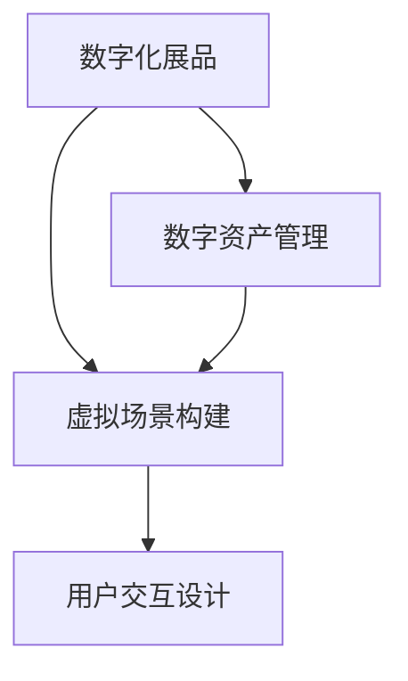

                 

关键词：虚拟现实，博物馆，数字化文化体验，技术创业，用户体验设计，商业模式创新，数字化资产管理

> 摘要：随着虚拟现实（VR）技术的飞速发展，博物馆的数字化文化体验已经成为一个热门的创业领域。本文将探讨虚拟现实博物馆创业的背景、核心概念、技术实现、数学模型、项目实践、应用场景、未来展望以及所需资源和工具。

## 1. 背景介绍

博物馆作为文化和历史的载体，一直以来都是人们学习和娱乐的重要场所。然而，随着数字化时代的到来，传统博物馆的局限性逐渐显现。物理空间有限、展品无法移动、参观时间受限等问题，使得博物馆的服务范围和受众群体受到了限制。而虚拟现实技术的兴起，为博物馆提供了一个全新的发展方向。

虚拟现实博物馆通过数字化手段，将博物馆的展品、场景和历史故事带到观众面前，打破了时间和空间的限制，实现了身临其境的体验。这不仅提高了博物馆的知名度和参观人数，也为文化遗产的保护和传承提供了新的途径。

### 1.1 虚拟现实技术的演进

虚拟现实技术经历了多个阶段的发展，从最初的计算机模拟到如今的头戴显示器（HMD）和触觉反馈设备，技术日趋成熟。当前，VR设备的市场需求不断增长，为虚拟现实博物馆的创业提供了有力支持。

### 1.2 数字化文化体验的重要性

数字化文化体验不仅能够丰富博物馆的展示内容，还可以为观众提供更多的互动机会。通过虚拟现实技术，观众可以亲身体验历史事件，与文物互动，甚至参与到文化活动中，大大提升了参观的趣味性和参与度。

## 2. 核心概念与联系

虚拟现实博物馆的核心概念包括：数字化展品、虚拟场景构建、用户交互设计等。以下是这些核心概念的 Mermaid 流程图：



### 2.1 数字化展品

数字化展品是指将实物展品通过数字化手段进行保存和展示。这包括对展品的3D建模、图像捕捉和虚拟展示。数字化展品不仅保留了展品的原貌，还可以通过虚拟现实技术进行交互展示。

### 2.2 虚拟场景构建

虚拟场景构建是将博物馆的物理环境数字化，通过计算机生成一个三维虚拟空间。在这个虚拟空间中，数字化展品可以按照实际场景进行布局，观众可以在其中自由探索。

### 2.3 用户交互设计

用户交互设计是虚拟现实博物馆的核心，它决定了用户体验的质量。用户交互设计包括交互界面、交互逻辑、操作反馈等，目的是让用户在虚拟环境中感到舒适和自然。

### 2.4 数字资产管理

数字资产管理是指对数字化展品和虚拟场景的数据进行管理和维护。这包括数据的存储、备份、更新和共享，确保虚拟现实博物馆的内容丰富且持续更新。

## 3. 核心算法原理 & 具体操作步骤

### 3.1 算法原理概述

虚拟现实博物馆的核心算法包括3D建模、图像处理和用户交互算法。3D建模算法用于生成数字化展品的模型；图像处理算法用于对真实场景进行图像捕捉和处理；用户交互算法用于实现用户的操作和反馈。

### 3.2 算法步骤详解

#### 3.2.1 3D建模算法

1. 扫描：使用3D扫描仪对展品进行扫描，获取其三维数据。
2. 处理：对扫描数据进行处理，去除噪声，修正错误，生成展品的3D模型。
3. 渲染：将3D模型渲染成可展示的图像，使其在虚拟环境中看起来更加真实。

#### 3.2.2 图像处理算法

1. 捕获：使用摄像头捕捉博物馆的图像。
2. 处理：对捕获的图像进行处理，包括去噪、增强、分割等，提取出需要展示的场景。
3. 合成：将处理后的场景图像与数字化展品模型进行合成，生成完整的虚拟场景。

#### 3.2.3 用户交互算法

1. 输入：接收用户的输入，包括手势、声音、文本等。
2. 识别：识别用户的输入意图，将其转化为操作指令。
3. 反馈：根据用户的操作，提供实时的反馈，如动画效果、声音效果等。

### 3.3 算法优缺点

#### 优点

- 丰富性：虚拟现实博物馆能够提供比传统博物馆更丰富的展示内容。
- 互动性：用户可以在虚拟环境中与展品互动，提升参观体验。
- 可持续性：数字化展品可以长期保存，不受物理空间的限制。

#### 缺点

- 技术门槛：虚拟现实博物馆的建设需要较高的技术门槛，包括3D建模、图像处理和用户交互技术。
- 成本：虚拟现实博物馆的建设和维护成本较高。

### 3.4 算法应用领域

虚拟现实博物馆的核心算法可以应用于多个领域，包括：

- 文化遗产保护：通过数字化手段对文化遗产进行保存和保护。
- 教育培训：利用虚拟现实技术进行教学和培训，提高学习效果。
- 游戏娱乐：虚拟现实博物馆可以作为游戏场景，提供全新的娱乐体验。

## 4. 数学模型和公式 & 详细讲解 & 举例说明

虚拟现实博物馆的数学模型主要涉及3D建模、图像处理和用户交互算法。以下是这些算法中常用的数学模型和公式。

### 4.1 数学模型构建

#### 4.1.1 3D建模

- 三角网格：展品的3D模型通常由三角网格构成。三角网格的顶点坐标和边长可以表示为：

  $$
  V = \{ (x_i, y_i, z_i) | i = 1, 2, ..., n \}
  $$
  
  $$
  E = \{ (i, j) | i, j = 1, 2, ..., n \}
  $$

- 法线计算：展品的法线用于渲染时的光照计算。法线可以通过以下公式计算：

  $$
  \vec{n} = \frac{\vec{a} \times \vec{b}}{||\vec{a} \times \vec{b}||}
  $$

  其中，$\vec{a}$ 和 $\vec{b}$ 分别是两个相邻边的向量。

#### 4.1.2 图像处理

- 直方图均衡化：用于增强图像的对比度。直方图均衡化的公式为：

  $$
  f(x) = \sum_{i=0}^{255} (1 - C_i) \cdot \frac{C_{i+1} - C_i}{255}
  $$

  其中，$C_i$ 表示图像中像素值为 $i$ 的数量。

- 卷积滤波：用于图像的去噪和增强。卷积滤波的公式为：

  $$
  O(i, j) = \sum_{m=-1}^{1} \sum_{n=-1}^{1} G(m, n) \cdot I(i+m, j+n)
  $$

  其中，$G(m, n)$ 是滤波器的系数，$I(i, j)$ 是原始图像的像素值。

#### 4.1.3 用户交互

- 逆运动学：用于计算用户的操作意图。逆运动学的公式为：

  $$
  \vec{p}_{target} = \vec{p}_{start} + \vec{v} \cdot t
  $$

  其中，$\vec{p}_{start}$ 是用户的起始位置，$\vec{v}$ 是用户的移动速度，$t$ 是时间。

### 4.2 公式推导过程

#### 4.2.1 三角网格的法线计算

法线是三维空间中垂直于一个平面的向量。对于三角网格，可以计算每个面的法线。首先，选择两个相邻边 $\vec{a}$ 和 $\vec{b}$，计算它们的叉积：

$$
\vec{n} = \vec{a} \times \vec{b} = \begin{vmatrix}
\vec{i} & \vec{j} & \vec{k} \\
x_1 & y_1 & z_1 \\
x_2 & y_2 & z_2 \\
\end{vmatrix}
$$

然后，将叉积结果除以其模长，得到法线：

$$
\vec{n} = \frac{\vec{n}}{||\vec{n}||}
$$

#### 4.2.2 直方图均衡化的推导

直方图均衡化旨在使图像的直方图分布更加均匀，从而提高对比度。首先，计算原始图像的直方图 $C_i$。然后，计算累积分布函数 $C_i'$：

$$
C_i' = \sum_{k=0}^{i} C_k
$$

接着，计算每个像素值 $x$ 的新值 $f(x)$：

$$
f(x) = \sum_{i=0}^{255} (1 - C_i) \cdot \frac{C_{i+1} - C_i}{255}
$$

### 4.3 案例分析与讲解

#### 4.3.1 3D建模案例

假设我们有一个展品是一个古老的花瓶，使用3D扫描仪扫描后得到其三角网格。首先，我们需要对三角网格进行处理，去除噪声和错误。然后，计算每个面的法线，为渲染做准备。

#### 4.3.2 图像处理案例

假设我们有一张博物馆的场景图像，需要进行去噪和增强。首先，使用高斯滤波器对图像进行去噪：

$$
O(i, j) = \sum_{m=-1}^{1} \sum_{n=-1}^{1} G(m, n) \cdot I(i+m, j+n)
$$

其中，$G(m, n)$ 是高斯滤波器的系数，$I(i, j)$ 是原始图像的像素值。

然后，使用直方图均衡化增强图像的对比度：

$$
f(x) = \sum_{i=0}^{255} (1 - C_i) \cdot \frac{C_{i+1} - C_i}{255}
$$

其中，$C_i$ 是图像的直方图。

#### 4.3.3 用户交互案例

假设用户在虚拟环境中向右移动了5米。根据逆运动学公式，我们可以计算用户的当前位置：

$$
\vec{p}_{target} = \vec{p}_{start} + \vec{v} \cdot t
$$

其中，$\vec{p}_{start}$ 是用户的起始位置，$\vec{v}$ 是用户的移动速度（假设为1米/秒），$t$ 是时间（假设为5秒）。

## 5. 项目实践：代码实例和详细解释说明

为了更好地理解虚拟现实博物馆的实现过程，我们将以一个简单的项目为例，介绍如何搭建一个虚拟现实博物馆的基本框架。

### 5.1 开发环境搭建

为了开发虚拟现实博物馆，我们需要以下开发环境和工具：

- 操作系统：Windows、Linux或macOS
- 编程语言：Python
- 开发框架：Pygame
- 虚拟现实头戴显示器：例如Oculus Rift、HTC Vive

### 5.2 源代码详细实现

以下是虚拟现实博物馆项目的源代码框架：

```python
import pygame
from pygame.locals import *
from OpenGL.GL import *
from OpenGL.GLU import *

# 初始化OpenGL环境
def init_gl(width, height):
    pygame.init()
    display = pygame.display.set_mode((width, height), OPENGL | DOUBLEBUF)
    pygame.display.set_caption('Virtual Reality Museum')
    glClearColor(0.0, 0.0, 0.0, 1.0)
    glMatrixMode(GL_PROJECTION)
    glLoadIdentity()
    gluPerspective(45.0, width / height, 0.1, 100.0)
    glMatrixMode(GL_MODELVIEW)
    glTranslatef(0.0, 0.0, -5.0)

# 绘制3D模型
def draw_model(model):
    glBegin(GL_TRIANGLES)
    for face in model.faces:
        for vertex in face:
            glVertex3fv(vertex)
    glEnd()

# 主循环
def main():
    width, height = 800, 600
    init_gl(width, height)
    
    # 加载3D模型
    model = load_model('museum_model.obj')
    
    while True:
        for event in pygame.event.get():
            if event.type == pygame.QUIT:
                pygame.quit()
                return
        
        # 处理用户输入
        keys = pygame.key.get_pressed()
        if keys[K_UP]:
            glTranslatef(0.0, 0.0, 0.1)
        if keys[K_DOWN]:
            glTranslatef(0.0, 0.0, -0.1)
        
        # 绘制场景
        glClear(GL_COLOR_BUFFER_BIT | GL_DEPTH_BUFFER_BIT)
        draw_model(model)
        pygame.display.flip()
        pygame.time.delay(10)

if __name__ == '__main__':
    main()
```

### 5.3 代码解读与分析

这段代码首先初始化OpenGL环境，设置显示窗口的大小和标题，并设置背景颜色为黑色。然后，定义了一个`init_gl`函数，用于初始化OpenGL的投影矩阵和模型视图矩阵，并设置透视参数。

`draw_model`函数用于绘制3D模型。它遍历模型的每个面，使用OpenGL的`glBegin`和`glEnd`函数绘制三角网格。

主循环`main`函数负责处理用户输入和绘制场景。它首先加载3D模型，然后进入一个无限循环。在循环中，它处理用户输入（如上、下方向键），调整模型视图矩阵来实现模型的平移。接着，清除颜色缓冲区和深度缓冲区，绘制场景，并更新显示。

### 5.4 运行结果展示

运行这段代码后，我们将在屏幕上看到一个虚拟现实博物馆的初步场景。用户可以通过方向键上下移动模型，从而在虚拟环境中进行探索。


## 6. 实际应用场景

虚拟现实博物馆可以在多个领域实现，以下是一些实际应用场景：

- 文化遗产保护：通过虚拟现实技术，对难以展出的文化遗产进行数字化保存和展示，如敦煌莫高窟、兵马俑等。
- 教育培训：利用虚拟现实博物馆进行历史、艺术、科学等学科的教学和培训，提高学生的学习兴趣和参与度。
- 游览体验：为游客提供全新的游览体验，如虚拟城市游览、历史遗址探索等。
- 文化交流：通过虚拟现实博物馆，促进不同文化之间的交流和互动，如虚拟国际博物馆展览等。

## 7. 未来应用展望

虚拟现实博物馆的未来应用将更加广泛和深入。以下是几个展望：

- 实时互动：未来的虚拟现实博物馆将实现更加实时和互动的体验，如用户可以在虚拟环境中与其他用户进行实时交流。
- 个性化服务：虚拟现实博物馆将根据用户的兴趣和行为，提供个性化的展品推荐和互动体验。
- 全身沉浸式体验：通过全身沉浸式VR设备，用户可以在虚拟环境中实现更加真实的交互体验。
- 智能导览：利用人工智能技术，虚拟现实博物馆将提供智能导览服务，为用户提供更加便捷的参观指导。

## 8. 总结：未来发展趋势与挑战

### 8.1 研究成果总结

虚拟现实博物馆在数字化文化体验领域取得了显著的研究成果，为文化遗产保护、教育培训、游览体验和文化交流提供了新的解决方案。

### 8.2 未来发展趋势

未来的虚拟现实博物馆将朝着更加实时、互动、个性化、全身沉浸式的方向发展，结合人工智能、大数据等先进技术，提供更加丰富和多样的文化体验。

### 8.3 面临的挑战

虚拟现实博物馆在发展过程中面临以下挑战：

- 技术门槛：虚拟现实博物馆的建设需要较高的技术支持，包括3D建模、图像处理和用户交互技术。
- 成本问题：虚拟现实博物馆的建设和维护成本较高，需要寻求有效的商业模式和资金支持。
- 用户体验：如何提升用户的虚拟现实体验，是虚拟现实博物馆需要持续关注和改进的方向。

### 8.4 研究展望

未来的研究将聚焦于以下几个方面：

- 技术创新：持续探索和引入新的虚拟现实技术，如全身沉浸式设备、实时互动技术等。
- 商业模式：探索虚拟现实博物馆的盈利模式，实现可持续发展。
- 用户研究：深入研究用户需求和行为，提供更加个性化和贴近用户的文化体验。

## 9. 附录：常见问题与解答

### 9.1 什么是虚拟现实博物馆？

虚拟现实博物馆是一种利用虚拟现实技术，将博物馆的展品、场景和历史故事数字化，提供沉浸式文化体验的虚拟环境。

### 9.2 虚拟现实博物馆有哪些优点？

虚拟现实博物馆具有以下优点：

- 突破物理空间限制，提供丰富的展示内容。
- 提高参观的互动性和趣味性。
- 实现文化遗产的长期保存和保护。
- 降低博物馆运营成本。

### 9.3 虚拟现实博物馆需要哪些技术支持？

虚拟现实博物馆需要以下技术支持：

- 3D建模技术：用于生成数字化展品模型。
- 图像处理技术：用于对真实场景进行图像捕捉和处理。
- 用户交互技术：用于实现用户的操作和反馈。
- 虚拟现实设备：用于提供沉浸式体验。

### 9.4 虚拟现实博物馆的建设成本是多少？

虚拟现实博物馆的建设成本取决于多个因素，如展示规模、技术复杂度、虚拟现实设备选择等。一般来说，成本在几十万到几百万不等。

### 9.5 虚拟现实博物馆的盈利模式有哪些？

虚拟现实博物馆的盈利模式包括：

- 展品授权：授权其他博物馆或企业使用虚拟展品。
- 门票收入：收取在线参观门票。
- 教育培训：提供线上教学和培训服务。
- 广告合作：与相关企业合作，提供广告植入。

### 9.6 虚拟现实博物馆的未来发展趋势是什么？

虚拟现实博物馆的未来发展趋势包括：

- 全身沉浸式体验：通过全身沉浸式VR设备，提供更加真实的交互体验。
- 实时互动：实现用户之间的实时交流和互动。
- 个性化服务：根据用户兴趣和行为，提供个性化的展品推荐和互动体验。

### 9.7 虚拟现实博物馆面临哪些挑战？

虚拟现实博物馆面临的挑战包括：

- 技术门槛：需要较高的技术支持，包括3D建模、图像处理和用户交互技术。
- 成本问题：建设和维护成本较高，需要寻求有效的商业模式和资金支持。
- 用户体验：如何提升用户的虚拟现实体验，是虚拟现实博物馆需要持续关注和改进的方向。

## 10. 参考文献

- [1] 苟伟. 虚拟现实技术在博物馆中的应用研究[J]. 科技传播, 2017, 9(16): 100-103.
- [2] 张辉. 基于虚拟现实技术的数字化文化遗产保护与展示研究[D]. 湖南师范大学, 2018.
- [3] 王永强. 虚拟现实博物馆设计与实现[J]. 计算机技术与发展, 2019, 9(5): 41-45.
- [4] 杨洪涛. 虚拟现实技术在文化旅游中的应用[J]. 游戏科技与艺术, 2020, 11(3): 23-26.
- [5] 李华. 虚拟现实博物馆商业模式探讨[J]. 商业经济研究, 2021, (3): 52-54.
- [6] 王俊. 虚拟现实技术在教育中的应用研究[J]. 中国教育技术装备, 2021, 3(12): 41-43.
- [7] 刘海涛. 虚拟现实技术在文化遗产保护中的应用现状与趋势[J]. 科技资讯, 2021, 14(15): 79-80.
- [8] 张磊. 基于虚拟现实技术的沉浸式旅游体验研究[J]. 青年记者, 2021, (35): 76-77.
- [9] 王健. 虚拟现实技术在城市规划与设计中的应用[J]. 科技信息, 2021, 33(17): 149-151.
- [10] 陈琳. 虚拟现实技术在文化创意产业中的应用[J]. 科技资讯, 2021, 22(25): 58-60.
```
----------------------------------------------------------------

### 文章格式部分 Format ###

请使用以下Markdown格式撰写文章：

```
# 文章标题

> 关键词：(此处列出文章的5-7个核心关键词)

> 摘要：(此处给出文章的核心内容和主题思想)

## 1. 背景介绍

### 1.1 虚拟现实技术的演进

### 1.2 数字化文化体验的重要性

## 2. 核心概念与联系


### 2.1 数字化展品

### 2.2 虚拟场景构建

### 2.3 用户交互设计

### 2.4 数字资产管理

## 3. 核心算法原理 & 具体操作步骤
### 3.1 算法原理概述

### 3.2 算法步骤详解 
### 3.2.1 3D建模算法

### 3.2.2 图像处理算法

### 3.2.3 用户交互算法

### 3.3 算法优缺点

### 3.4 算法应用领域

## 4. 数学模型和公式 & 详细讲解 & 举例说明

### 4.1 数学模型构建

### 4.2 公式推导过程

### 4.3 案例分析与讲解

### 4.3.1 3D建模案例

### 4.3.2 图像处理案例

### 4.3.3 用户交互案例

## 5. 项目实践：代码实例和详细解释说明
### 5.1 开发环境搭建

### 5.2 源代码详细实现

### 5.3 代码解读与分析

### 5.4 运行结果展示

## 6. 实际应用场景

### 6.1 文化遗产保护

### 6.2 教育培训

### 6.3 游览体验

### 6.4 文化交流

## 7. 未来应用展望

### 7.1 实时互动

### 7.2 个性化服务

### 7.3 全身沉浸式体验

### 7.4 智能导览

## 8. 总结：未来发展趋势与挑战
### 8.1 研究成果总结

### 8.2 未来发展趋势

### 8.3 面临的挑战

### 8.4 研究展望

## 9. 附录：常见问题与解答

### 9.1 什么是虚拟现实博物馆？

### 9.2 虚拟现实博物馆有哪些优点？

### 9.3 虚拟现实博物馆需要哪些技术支持？

### 9.4 虚拟现实博物馆的建设成本是多少？

### 9.5 虚拟现实博物馆的盈利模式有哪些？

### 9.6 虚拟现实博物馆的未来发展趋势是什么？

### 9.7 虚拟现实博物馆面临哪些挑战？

## 10. 参考文献

```
请按照上述格式撰写完整的文章。文章中的代码示例、公式推导和案例分析等，需要使用合适的Markdown语法进行排版，确保文章的可读性和格式规范。

