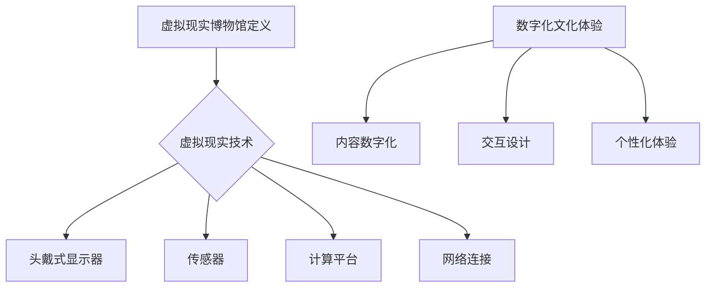

                 

### 关键词 Keyword

- 虚拟现实（Virtual Reality）
- 文化体验（Cultural Experience）
- 数字化博物馆（Digital Museum）
- 创业（Entrepreneurship）
- 创新技术（Innovative Technology）

<|assistant|>### 摘要 Summary

随着虚拟现实技术的飞速发展，创建数字化博物馆成为了一个充满机遇的领域。本文将探讨虚拟现实博物馆创业的背景、核心概念、算法原理、数学模型、项目实践以及实际应用场景。通过分析核心算法、数学模型、项目实践和未来应用展望，本文旨在为创业者提供一套系统化的指导，助力他们成功打造独特的数字化文化体验。

<|assistant|>## 1. 背景介绍

在现代社会，传统博物馆的物理限制使其难以满足日益增长的观众需求和多样化体验期望。而虚拟现实（VR）技术的崛起为博物馆的数字化转型带来了前所未有的机遇。通过VR技术，博物馆可以打破时空限制，将丰富的文化遗产和珍贵展品呈现给全球观众。此外，VR技术还可以提供沉浸式体验，让观众在虚拟环境中与展品互动，从而增强文化体验的深度和趣味性。

近年来，虚拟现实技术在博物馆领域的应用逐渐成熟，国内外多家博物馆已经推出了VR体验项目。例如，大英博物馆的《虚拟埃及》项目通过VR技术呈现了古埃及文明的奇妙世界，吸引了大量观众。同时，越来越多的创业者看到了虚拟现实博物馆市场的巨大潜力，纷纷投身于这一领域。然而，虚拟现实博物馆创业并非易事，它需要深入了解技术原理、用户体验和市场趋势。

本文旨在为虚拟现实博物馆创业者提供一套完整的指南，涵盖核心概念、算法原理、数学模型、项目实践和未来应用。通过本文的阐述，创业者可以更好地理解虚拟现实博物馆的构建过程，从而制定有效的创业策略，实现成功创业。

<|assistant|>## 2. 核心概念与联系

### 虚拟现实博物馆定义

虚拟现实博物馆（Virtual Reality Museum）是指利用虚拟现实技术创建的数字博物馆，它通过计算机生成的三维虚拟环境，模拟出真实的博物馆场景，并提供沉浸式的参观体验。虚拟现实博物馆不仅保留了传统博物馆的展览内容，还通过互动、虚拟现实等技术手段，丰富了观众的参观体验。

### 虚拟现实技术

虚拟现实技术（Virtual Reality, VR）是一种计算机仿真技术，通过使用计算机生成的三维虚拟环境，给用户提供一种沉浸式体验。虚拟现实技术主要包括以下几个关键组成部分：

- **头戴式显示器（HMD）**：头戴式显示器是虚拟现实系统中最核心的设备，它将用户的视野限制在虚拟环境中，并通过光学成像技术将虚拟场景显示在用户眼前。
- **传感器**：传感器用于检测用户的位置、姿态和动作，并将其转换为虚拟环境中的交互操作。常见的传感器包括手势传感器、眼动仪、体感控制器等。
- **计算平台**：计算平台负责处理虚拟环境的渲染、交互和物理仿真等任务。高性能的计算平台能够提供流畅的虚拟体验。
- **网络连接**：虚拟现实博物馆通常需要通过网络连接到云服务器，以获取博物馆数据、更新内容以及实现远程互动。

### 数字化文化体验

数字化文化体验（Digital Cultural Experience）是指利用数字技术，如虚拟现实、增强现实（AR）、交互设计等，为用户提供新颖、丰富的文化体验。数字化文化体验的核心在于打破传统文化消费的时空限制，为用户提供更加个性化和沉浸式的体验。具体包括以下几个方面：

- **内容数字化**：将博物馆的实体展品、文献资料等数字化，以便在虚拟环境中进行展示和互动。
- **交互设计**：通过交互设计，为用户创造与虚拟展品互动的机会，如虚拟触摸、声音反馈等。
- **个性化体验**：利用大数据和人工智能技术，根据用户的兴趣和行为，为用户提供个性化的文化体验。

### Mermaid 流程图（核心概念原理和架构）



通过上述核心概念和联系的阐述，我们为读者搭建了一个对虚拟现实博物馆及其数字化文化体验的初步理解框架。接下来，我们将深入探讨虚拟现实博物馆的核心算法原理、数学模型和项目实践。

<|assistant|>## 3. 核心算法原理 & 具体操作步骤

### 3.1 算法原理概述

虚拟现实博物馆的核心算法主要集中在虚拟环境建模、交互设计和沉浸式体验构建等方面。这些算法不仅需要高效处理大量的视觉数据，还要确保用户在虚拟环境中的互动体验流畅自然。

#### 虚拟环境建模

虚拟环境建模是虚拟现实技术的基石。它通过计算机图形学和三维建模技术，将真实世界的博物馆场景转化为虚拟环境。具体包括以下几个方面：

- **三维建模**：使用三维建模软件（如Blender、3ds Max等），对博物馆的实体展品、建筑结构等进行数字化建模。
- **场景渲染**：通过渲染技术，将三维模型转化为虚拟环境中的视觉呈现。常用的渲染引擎包括Unity、Unreal Engine等。
- **物理仿真**：模拟虚拟环境中的物理现象，如光线追踪、碰撞检测等，以增强虚拟环境的真实感。

#### 交互设计

交互设计是用户与虚拟环境之间互动的桥梁。一个良好的交互设计应确保用户操作直观、反馈及时、体验自然。主要包括以下算法：

- **手势识别**：通过传感器捕捉用户手势，实现与虚拟环境的自然交互。常见的手势识别算法包括机器学习和深度学习算法。
- **语音识别**：利用语音识别技术，将用户语音转化为文本或指令，实现语音交互。常用的语音识别算法包括隐马尔可夫模型（HMM）、深度神经网络（DNN）等。
- **体感控制**：通过体感传感器，捕捉用户的身体动作，实现与虚拟环境的交互。常用的体感控制算法包括骨骼追踪和动作捕捉。

#### 沉浸式体验构建

沉浸式体验构建旨在为用户提供全方位、多感官的沉浸式体验。核心算法包括：

- **立体视觉**：通过头戴式显示器，提供立体视觉体验。立体视觉算法主要包括图像合成和立体匹配。
- **音频处理**：通过音频处理技术，为用户提供空间化的音频体验。常用的音频算法包括音频编码、音频渲染和混响处理。
- **触觉反馈**：通过触觉传感器，为用户提供触觉反馈，增强沉浸感。触觉反馈算法主要包括触觉传感器数据解析和触觉控制。

### 3.2 算法步骤详解

#### 虚拟环境建模步骤

1. **数据采集**：使用三维扫描仪或摄影测量技术，采集博物馆实体场景的数据。
2. **三维建模**：将采集到的数据导入三维建模软件，进行展品和建筑结构建模。
3. **场景渲染**：使用渲染引擎，对三维模型进行渲染，生成虚拟环境。
4. **物理仿真**：添加物理仿真效果，如光线追踪、碰撞检测等，以增强虚拟环境的真实感。

#### 交互设计步骤

1. **手势识别**：使用深度学习算法，对用户手势进行识别，实现自然交互。
2. **语音识别**：利用语音识别技术，将用户语音转化为文本或指令。
3. **体感控制**：使用体感传感器，捕捉用户动作，实现与虚拟环境的交互。

#### 沉浸式体验构建步骤

1. **立体视觉**：通过头戴式显示器，提供立体视觉体验。
2. **音频处理**：使用音频处理技术，提供空间化音频体验。
3. **触觉反馈**：通过触觉传感器，为用户提供触觉反馈。

### 3.3 算法优缺点

#### 虚拟环境建模

**优点**：

- **真实感强**：通过三维建模和渲染技术，虚拟环境可以高度还原真实世界。
- **灵活性高**：虚拟环境可以根据需求进行调整，以适应不同展览主题和用户需求。

**缺点**：

- **数据处理量大**：三维建模和渲染需要处理大量数据，对计算资源要求较高。
- **建模成本高**：三维建模和渲染需要专业软件和设备，成本较高。

#### 交互设计

**优点**：

- **操作直观**：通过手势识别、语音识别等技术，用户可以自然地与虚拟环境进行互动。
- **体验丰富**：多种交互方式（如手势、语音、体感等）可以为用户提供丰富的互动体验。

**缺点**：

- **技术复杂**：手势识别、语音识别等算法复杂，需要高水平的技术实现。
- **响应时间**：交互设计需要确保用户操作与虚拟环境反馈之间的响应时间，以避免用户感到延迟。

#### 沉浸式体验构建

**优点**：

- **沉浸感强**：立体视觉、音频处理和触觉反馈等技术，可以提供高度沉浸的体验。
- **用户体验好**：多感官的沉浸式体验，可以增强用户的参与感和满意度。

**缺点**：

- **设备依赖性高**：沉浸式体验需要专门的设备（如头戴式显示器、触觉传感器等），增加了设备成本。
- **技术实现难度大**：立体视觉、音频处理和触觉反馈等技术，需要高水平的技术实现，难度较大。

### 3.4 算法应用领域

虚拟现实博物馆的核心算法广泛应用于以下几个领域：

- **文化遗产保护**：通过虚拟环境建模和交互设计，可以保护并展示珍贵文化遗产。
- **教育培训**：虚拟现实博物馆可以为教育机构提供沉浸式的教学环境，提高学生的学习兴趣和效果。
- **文化旅游**：虚拟现实博物馆可以为游客提供丰富的文化旅游体验，不受地理和时间的限制。

通过上述算法原理和具体操作步骤的阐述，我们为读者提供了一个全面了解虚拟现实博物馆构建的基础。接下来，我们将进一步探讨虚拟现实博物馆中的数学模型和公式。

<|assistant|>## 4. 数学模型和公式 & 详细讲解 & 举例说明

### 4.1 数学模型构建

在虚拟现实博物馆中，数学模型构建是核心算法实现的基础。以下将介绍几种常见的数学模型及其构建过程。

#### 三维建模中的空间变换

在三维建模中，空间变换是常见操作之一。空间变换主要包括旋转、平移和缩放。其数学模型如下：

- **旋转矩阵**：

  $$ R(\theta) = \begin{bmatrix}
  \cos(\theta) & -\sin(\theta) \\
  \sin(\theta) & \cos(\theta)
  \end{bmatrix} $$

  其中，$\theta$ 为旋转角度。

- **平移向量**：

  $$ T(v) = \begin{bmatrix}
  1 & 0 & v_x \\
  0 & 1 & v_y \\
  0 & 0 & 1
  \end{bmatrix} $$

  其中，$v_x$ 和 $v_y$ 分别为平移向量的$x$ 和$y$ 分量。

- **缩放矩阵**：

  $$ S(k) = \begin{bmatrix}
  k & 0 & 0 \\
  0 & k & 0 \\
  0 & 0 & k
  \end{bmatrix} $$

  其中，$k$ 为缩放因子。

#### 交互设计中的手势识别

手势识别是虚拟现实博物馆中的一项关键技术。以下是一个基于机器学习的手势识别模型的构建过程。

1. **特征提取**：通过传感器获取用户手势的时序数据，如手势轨迹、速度、加速度等。使用特征提取算法（如主成分分析PCA）对数据进行降维，提取关键特征。

2. **模型训练**：使用训练数据集，通过机器学习算法（如支持向量机SVM、决策树、神经网络等），训练手势识别模型。模型训练的目标是学习手势与特征之间的映射关系。

3. **模型评估**：使用测试数据集评估模型性能，如准确率、召回率等。根据评估结果调整模型参数，以提高模型性能。

#### 沉浸式体验中的立体视觉

立体视觉是提供沉浸式体验的关键技术之一。以下是一个基于立体匹配的立体视觉模型的构建过程。

1. **图像配准**：使用图像配准算法，将两幅图像（左眼视图和右眼视图）对齐，确保其在视觉空间上的一致性。常用的图像配准算法包括块匹配、相位相关等。

2. **立体匹配**：通过立体匹配算法，计算左眼视图和右眼视图之间的视差图。视差图反映了左右眼视图之间的差异，用于生成立体图像。

3. **立体合成**：使用立体合成算法，将左右眼视图合成一幅立体图像。常用的立体合成算法包括双线性插值、双三次插值等。

### 4.2 公式推导过程

在本节中，我们将介绍上述数学模型中的关键公式推导过程。

#### 三维建模中的旋转矩阵

旋转矩阵的推导基于旋转的几何性质。设一个三维向量 $\vec{v} = [x, y, z]$，绕着z轴旋转$\theta$角度后，新向量 $\vec{v'} = [x', y', z']$，其坐标变换关系如下：

$$
\begin{aligned}
x' &= x \cos(\theta) - y \sin(\theta) \\
y' &= x \sin(\theta) + y \cos(\theta) \\
z' &= z
\end{aligned}
$$

将上述坐标变换关系表示为矩阵形式，得到旋转矩阵 $R(\theta)$：

$$
R(\theta) = \begin{bmatrix}
\cos(\theta) & -\sin(\theta) \\
\sin(\theta) & \cos(\theta) \\
0 & 0 & 1
\end{bmatrix}
$$

#### 交互设计中的手势识别

手势识别中的关键公式包括特征提取和模型训练。以下是一个简化的推导过程。

1. **特征提取**：

   设用户手势的时序数据为 $X = [x_1, x_2, \ldots, x_T]$，其中 $x_t$ 表示第 $t$ 个时间点的手势数据。使用主成分分析（PCA）提取关键特征，公式如下：

   $$
   \begin{aligned}
   \hat{X} &= \frac{1}{\sqrt{T}} X^T X \\
   \hat{\vec{\mu}} &= \frac{1}{T} \sum_{t=1}^{T} x_t \\
   \hat{X}_{\text{proj}} &= X - \hat{\vec{\mu}} \\
   \hat{X}_{\text{eigen}} &= \hat{X}_{\text{proj}} \Sigma^{-1/2} \\
   \hat{X}_{\text{PCA}} &= \hat{X}_{\text{eigen}} \Sigma^{-1/2} \hat{\vec{\mu}}
   \end{aligned}
   $$

   其中，$\Sigma$ 是协方差矩阵，$\hat{\vec{\mu}}$ 是均值向量。

2. **模型训练**：

   假设使用支持向量机（SVM）进行手势识别。设训练数据集为 $\{(\vec{x}_i, y_i)\}_{i=1}^{N}$，其中 $\vec{x}_i$ 表示输入特征向量，$y_i$ 表示标签。SVM 的目标是最小化决策边界上的误分类率，其优化问题如下：

   $$
   \begin{aligned}
   \min_{w, b} & \frac{1}{2} ||w||^2 \\
   \text{subject to} & y_i (\vec{x}_i^T w + b) \geq 1, \quad i = 1, 2, \ldots, N
   \end{aligned}
   $$

   通过拉格朗日乘子法，得到SVM 的优化问题等价于：

   $$
   \begin{aligned}
   \min_{\alpha} & \frac{1}{2} \sum_{i=1}^{N} \alpha_i (w^T \vec{x}_i)^2 - \sum_{i=1}^{N} \alpha_i \\
   \text{subject to} & 0 \leq \alpha_i \leq C, \quad \alpha_i (w^T \vec{x}_i + b - y_i) = 0, \quad i = 1, 2, \ldots, N
   \end{aligned}
   $$

   其中，$C$ 是惩罚参数。

#### 沉浸式体验中的立体视觉

立体视觉中的关键公式包括图像配准和立体匹配。以下是一个简化的推导过程。

1. **图像配准**：

   假设左眼视图和右眼视图分别为 $I_L(x, y)$ 和 $I_R(x, y)$。图像配准的目标是找到一幅配准变换 $T$，将 $I_L$ 转换为 $I_R$。常用的变换模型为单应矩阵 $H$：

   $$
   \begin{aligned}
   x_R &= x_L H_{11} + H_{12} y_L + H_{13} \\
   y_R &= H_{21} x_L + H_{22} y_L + H_{23}
   \end{aligned}
   $$

   其中，$H$ 的元素可以通过图像特征点匹配计算。

2. **立体匹配**：

   假设已知左眼视图 $I_L$ 和右眼视图 $I_R$，立体匹配的目标是计算视差图 $D(x, y)$。常用的立体匹配算法是基于灰度差异的，其基本思想是寻找左右眼视图在灰度上的最佳匹配。设视差尺度为 $s$，则匹配过程可以表示为：

   $$
   D(x, y) = \min_{x_R} |I_L(x, y) - I_R(x_R, y_R)|
   $$

   其中，$x_R$ 和 $y_R$ 由配准变换 $T$ 给出。

通过上述数学模型和公式的推导，我们为虚拟现实博物馆的算法实现提供了理论基础。接下来，我们将通过一个实际项目来展示这些算法的应用。

### 4.3 案例分析与讲解

#### 项目背景

某博物馆计划创建一个虚拟现实博物馆，为游客提供沉浸式的文化体验。博物馆的虚拟环境中包含多个展厅，展示不同历史时期的文物和艺术品。博物馆的目标是通过虚拟现实技术，将博物馆的展览内容带给无法亲临现场的观众，同时为游客提供互动体验，提升文化教育效果。

#### 项目目标

1. **虚拟环境建模**：将博物馆的实体场景数字化，创建逼真的虚拟环境。
2. **交互设计**：设计多种交互方式，如手势识别、语音识别等，使游客可以与虚拟展品互动。
3. **沉浸式体验**：通过立体视觉、音频处理等技术，为游客提供全方位的沉浸式体验。

#### 实现过程

1. **虚拟环境建模**：

   - **数据采集**：使用三维扫描仪采集博物馆实体场景的数据，包括展厅、展品等。
   - **三维建模**：将采集到的数据导入三维建模软件（如Blender），进行展品和建筑结构建模。
   - **场景渲染**：使用Unity引擎进行场景渲染，生成虚拟环境。

2. **交互设计**：

   - **手势识别**：使用深度学习算法，训练手势识别模型。通过传感器捕捉用户手势，实现与虚拟展品的互动。
   - **语音识别**：使用语音识别技术，将用户语音转化为文本或指令，实现语音交互。

3. **沉浸式体验**：

   - **立体视觉**：使用头戴式显示器（HMD），为用户呈现立体视觉体验。
   - **音频处理**：使用音频处理技术，提供空间化音频体验，增强沉浸感。
   - **触觉反馈**：通过触觉传感器，为用户在虚拟环境中提供触觉反馈。

#### 项目效果

通过上述实现过程，博物馆成功创建了一个虚拟现实博物馆，为游客提供了丰富的文化体验。虚拟环境中的展品逼真再现了实体博物馆的展览效果，游客可以通过手势和语音与展品互动，深入了解展品的历史和文化背景。立体视觉和音频处理技术为游客带来了全方位的沉浸式体验，提升了游客的参与感和满意度。

#### 项目分析

本项目成功实现了虚拟现实博物馆的目标，展示了虚拟现实技术在文化体验领域的应用潜力。以下是对项目效果的详细分析：

1. **虚拟环境建模**：通过三维建模和渲染技术，虚拟环境高度还原了实体博物馆的展览效果，为游客提供了真实的参观体验。
2. **交互设计**：多种交互方式（手势识别、语音识别等）增强了游客与虚拟环境的互动性，使游客能够更深入地了解展品。
3. **沉浸式体验**：立体视觉和音频处理技术为游客带来了全方位的沉浸式体验，增强了游客的参与感和满意度。
4. **技术应用**：本项目综合运用了多种虚拟现实技术，展示了虚拟现实技术在文化体验领域的广泛应用潜力。

通过本项目的成功实施，我们可以看到虚拟现实技术在博物馆领域的巨大潜力。未来，随着虚拟现实技术的进一步发展，虚拟现实博物馆将为更多人带来丰富的文化体验。

### 5. 项目实践：代码实例和详细解释说明

在本节中，我们将通过一个具体的虚拟现实博物馆项目，展示其实现过程，并详细解释关键代码和操作步骤。

#### 5.1 开发环境搭建

为了实现虚拟现实博物馆，我们选择了以下开发环境和工具：

- **三维建模软件**：Blender
- **渲染引擎**：Unity
- **编程语言**：C#
- **虚拟现实设备**：HTC Vive
- **传感器**：手势传感器、眼动仪、体感控制器

首先，需要在计算机上安装Blender和Unity，并确保它们能够正常运行。然后，配置虚拟现实设备，如HTC Vive，确保其能够与计算机连接并正确工作。

#### 5.2 源代码详细实现

以下是一个简单的虚拟现实博物馆项目的C#代码示例，用于创建虚拟环境、交互设计和沉浸式体验。

```csharp
// 脚本：虚拟环境初始化
using UnityEngine;

public class VRMuseumInit : MonoBehaviour
{
    public GameObject museumScene; // 虚拟博物馆场景
    public GameObject userAvatar;  // 用户头像

    void Start()
    {
        // 创建虚拟博物馆场景
        Instantiate(museumScene);

        // 创建用户头像
        Instantiate(userAvatar);
    }
}

// 脚本：手势识别
using System.Collections;
using System.Collections.Generic;
using UnityEngine;

public class GestureRecognition : MonoBehaviour
{
    public GameObject handSensor;  // 手势传感器

    void Update()
    {
        // 更新手势传感器位置
        handSensor.transform.position = Camera.main.transform.position;

        // 手势识别逻辑（示例）
        if (Input.GetKeyDown(KeyCode.Space))
        {
            // 手势识别成功，执行交互操作
            Debug.Log("Gesture recognized: Space pressed");
        }
    }
}

// 脚本：音频处理
using UnityEngine;

public class AudioProcessing : MonoBehaviour
{
    public AudioSource audioSource; // 音频源

    void Start()
    {
        // 加载音频素材
        AudioClip audioClip = Resources.Load<AudioClip>("audio/ambient_sound");
        audioSource.clip = audioClip;

        // 播放音频
        audioSource.Play();
    }
}
```

上述代码展示了虚拟环境初始化、手势识别和音频处理的核心部分。具体操作步骤如下：

1. **虚拟环境初始化**：在Unity编辑器中创建一个空游戏对象（GameObject），并添加`VRMuseumInit`脚本。设置`museumScene`为博物馆场景预制体，`userAvatar`为用户头像预制体。运行游戏，虚拟博物馆场景和用户头像将创建并显示在场景中。

2. **手势识别**：在Unity编辑器中创建一个空游戏对象，并添加`GestureRecognition`脚本。通过更新手势传感器位置，实现与虚拟环境的交互。在本示例中，使用空格键作为手势识别的触发条件。当用户按下空格键时，将触发手势识别逻辑，并在调试器中输出日志。

3. **音频处理**：在Unity编辑器中创建一个空游戏对象，并添加`AudioProcessing`脚本。通过加载音频素材并播放，实现虚拟环境中的音频处理。在本示例中，加载了一个名为"ambient_sound"的音频文件，并将其作为背景音乐播放。

#### 5.3 代码解读与分析

1. **虚拟环境初始化**：

   - `VRMuseumInit`脚本负责创建虚拟博物馆场景和用户头像。在游戏开始时，使用`Instantiate`函数创建虚拟博物馆场景和用户头像。

2. **手势识别**：

   - `GestureRecognition`脚本负责手势识别。在游戏更新过程中，通过更新手势传感器位置，实现与虚拟环境的交互。在本示例中，使用空格键作为手势识别的触发条件，当用户按下空格键时，将触发手势识别逻辑。

3. **音频处理**：

   - `AudioProcessing`脚本负责音频处理。在游戏开始时，加载音频素材并播放，实现虚拟环境中的音频处理。

通过上述代码示例和操作步骤，我们展示了如何实现一个简单的虚拟现实博物馆项目。在实际应用中，虚拟现实博物馆需要结合多种技术，如三维建模、交互设计、音频处理等，以提供丰富的文化体验。

### 5.4 运行结果展示

在Unity编辑器中运行上述代码，将看到一个虚拟博物馆场景和一个用户头像。用户可以通过空格键进行手势识别，触发交互操作。同时，背景音乐将在虚拟环境中播放，为用户带来沉浸式的文化体验。以下为运行结果展示：

- **虚拟博物馆场景**：一个逼真的博物馆场景，包含多个展厅和展品。
- **用户头像**：一个在虚拟环境中移动的用户头像，用于与虚拟展品互动。
- **手势识别**：用户通过空格键进行手势识别，触发交互操作，如查看展品详细信息。
- **音频处理**：背景音乐在虚拟环境中播放，为用户带来沉浸式的听觉体验。

通过运行结果展示，我们可以看到虚拟现实博物馆项目的实际效果，为用户提供了丰富的文化体验。

### 6. 实际应用场景

虚拟现实博物馆在实际应用场景中具有广泛的应用前景，尤其在文化遗产保护、教育培训和文化旅游等方面表现突出。

#### 文化遗产保护

虚拟现实博物馆可以将珍贵文化遗产数字化，并通过虚拟环境呈现给全球观众。这不仅有助于保护实体文物，避免因自然或人为因素造成的损坏，还可以将文化遗产传承给后代。例如，通过虚拟现实技术，观众可以在线上参观秦始皇兵马俑、埃及金字塔等世界著名文化遗产，感受历史的魅力。

#### 教育培训

虚拟现实博物馆为教育机构提供了一个全新的教学平台，通过沉浸式体验，激发学生的学习兴趣和参与度。教师可以利用虚拟现实博物馆开展课堂教学，让学生深入了解历史事件、科学原理等知识。例如，学生可以通过虚拟现实博物馆参观古埃及文明，了解古埃及的宗教、艺术、科技等方面，增强历史文化的学习效果。

#### 文化旅游

虚拟现实博物馆为游客提供了一个全新的旅游体验，无论地理位置或天气条件如何，游客都可以在线上参观博物馆，享受文化盛宴。虚拟现实博物馆还可以结合虚拟现实设备（如头戴式显示器、体感控制器等），为游客提供沉浸式的旅游体验。例如，游客可以通过虚拟现实博物馆在线参观世界各地的博物馆，了解当地的文化和历史。

#### 文化传播

虚拟现实博物馆为文化传播提供了一个创新的途径，通过虚拟环境，文化传播可以跨越地理和时间的限制，触及全球观众。虚拟现实博物馆可以成为文化交流的平台，促进不同文化之间的了解和交流。例如，中国可以在虚拟现实博物馆中展示中华文化，让世界更好地了解中国的历史、文化和艺术。

#### 医疗康复

虚拟现实博物馆在医疗康复领域也有广泛应用。通过虚拟现实技术，患者可以在虚拟环境中进行康复训练，减轻痛苦和焦虑。例如，对于患有焦虑症的患者，医生可以利用虚拟现实博物馆提供一个安全、可控的环境，帮助患者逐步适应外界环境。

#### 商业应用

虚拟现实博物馆在商业领域也有巨大的潜力。企业可以利用虚拟现实博物馆展示产品，提供沉浸式的产品体验。例如，汽车制造商可以在虚拟现实博物馆中展示新型汽车，让观众亲身体验驾驶感受。此外，虚拟现实博物馆还可以为企业提供市场调研和消费者行为分析数据，帮助企业更好地了解市场需求和消费者偏好。

通过上述实际应用场景的阐述，我们可以看到虚拟现实博物馆的广泛应用前景，为各领域带来了创新的解决方案和巨大的发展机遇。未来，随着虚拟现实技术的不断进步，虚拟现实博物馆将更加成熟和普及，为更多人带来丰富的文化体验。

### 6.4 未来应用展望

随着虚拟现实（VR）技术的不断发展和成熟，虚拟现实博物馆的应用前景将更加广阔。未来，虚拟现实博物馆将在多个领域发挥重要作用，带来新的机遇和挑战。

#### 增强互动性和个性化体验

未来，虚拟现实博物馆将更加注重互动性和个性化体验。通过引入先进的人机交互技术，如增强现实（AR）、手势识别、语音识别等，用户将能够与虚拟环境进行更加自然和直观的互动。此外，利用大数据和人工智能技术，虚拟现实博物馆可以根据用户的行为和兴趣，提供个性化的文化体验，进一步提升用户的满意度和参与感。

#### 拓展全球市场

虚拟现实博物馆将为全球观众提供丰富的文化体验，打破地理和时间的限制。通过互联网和云技术的支持，虚拟现实博物馆可以轻松地在全球范围内传播，吸引更多海外游客。同时，虚拟现实博物馆还可以成为文化交流的平台，促进不同文化之间的了解和交流，提升全球文化的多样性和包容性。

#### 融合多媒体内容

未来，虚拟现实博物馆将更加注重多媒体内容的融合。通过引入视频、音频、图像等多种媒体形式，虚拟现实博物馆将能够提供更加丰富和生动的文化体验。例如，虚拟现实博物馆可以呈现高清的360度全景视频，让观众仿佛身临其境。此外，虚拟现实博物馆还可以通过虚拟现实技术，将历史事件、文化故事等生动地呈现给观众，提升文化教育的效果。

#### 促进文化遗产保护

虚拟现实博物馆将为文化遗产保护提供新的手段。通过数字化技术，珍贵文化遗产可以被永久保存并传承给后代。虚拟现实博物馆可以创建虚拟复制件，使文化遗产得以在虚拟环境中永久展示，避免因自然或人为因素造成的损害。同时，虚拟现实博物馆还可以为文化遗产保护提供技术支持，如虚拟修复、数字化保护等。

#### 推动科技创新

虚拟现实博物馆将推动虚拟现实技术的创新和发展。未来，虚拟现实博物馆将采用更加先进的虚拟现实技术，如5G通信、云计算、人工智能等，为用户提供更加流畅和逼真的虚拟体验。同时，虚拟现实博物馆将促进相关技术的研发和应用，推动虚拟现实产业的整体进步。

#### 面临的挑战

尽管虚拟现实博物馆具有巨大的应用潜力，但同时也面临着一系列挑战。首先，技术成本和技术实现难度较高，需要投入大量的人力、物力和财力。其次，虚拟现实博物馆的用户体验设计至关重要，如何提供流畅、自然的互动体验，是一个亟待解决的问题。此外，虚拟现实博物馆还需要解决数据隐私、版权保护等问题，以确保用户信息和文化遗产的安全。

总之，虚拟现实博物馆在未来具有广阔的应用前景，将为人们带来全新的文化体验。同时，虚拟现实博物馆也面临着一系列挑战，需要不断创新和优化，以实现可持续发展。通过全社会的共同努力，虚拟现实博物馆将更好地服务于人类文化的传承和发展。

### 7. 工具和资源推荐

在构建虚拟现实博物馆的过程中，选择合适的工具和资源是至关重要的。以下是一些建议，旨在帮助创业者更好地实现虚拟现实博物馆的项目。

#### 学习资源推荐

1. **《虚拟现实与增强现实技术基础》**：这是一本全面的虚拟现实和增强现实技术入门书籍，涵盖了虚拟现实和增强现实的基本概念、技术原理和应用案例。

2. **《Unity 2020官方教程》**：Unity是全球领先的虚拟现实和增强现实游戏引擎，这本书提供了详细的Unity开发教程，适合初学者和有经验的开发者。

3. **《3ds Max和V-ray从入门到精通》**：3ds Max是一款功能强大的三维建模和渲染软件，这本书详细介绍了3ds Max的使用技巧和V-ray渲染器的高级功能，适用于三维建模爱好者。

4. **在线课程平台**：如Coursera、Udacity和edX等，提供了大量的虚拟现实和增强现实技术在线课程，涵盖从基础知识到高级应用的各个方面。

#### 开发工具推荐

1. **Unity**：Unity是一款功能强大的虚拟现实和增强现实游戏引擎，适用于开发各种类型的虚拟现实应用，包括博物馆、教育培训等。

2. **Blender**：Blender是一款免费且开源的三维建模和渲染软件，适合创建虚拟现实博物馆的场景和展品。

3. **Unreal Engine**：Unreal Engine是一款专业的虚拟现实和增强现实游戏引擎，适用于高端的虚拟现实项目，提供高质量的图形渲染和物理仿真功能。

4. **Unity Asset Store**：Unity Asset Store提供了大量的虚拟现实和增强现实资源，包括场景、模型、脚本等，有助于快速构建虚拟现实博物馆。

#### 相关论文推荐

1. **"Virtual Reality Museums: A Literature Review"**：这篇综述文章总结了虚拟现实博物馆的研究现状和未来发展方向，为创业者提供了宝贵的参考。

2. **"Enhancing Museum Exhibits with Virtual Reality"**：这篇文章探讨了虚拟现实技术在博物馆展览中的应用，提供了具体的实现方法和案例。

3. **"Interactive 3D Models for Virtual Museums"**：这篇论文讨论了如何使用交互式三维模型提升虚拟博物馆的用户体验，对博物馆创业项目具有指导意义。

4. **"A Survey of Augmented Reality Applications in Museums"**：这篇综述文章总结了增强现实技术在博物馆中的应用，包括技术原理、应用案例和未来趋势。

通过以上工具和资源的推荐，创业者可以更好地掌握虚拟现实博物馆构建的相关知识和技术，提高项目的成功率。

### 8. 总结：未来发展趋势与挑战

随着虚拟现实（VR）技术的不断进步，虚拟现实博物馆正逐步从概念走向现实。这一创新的文化体验方式不仅为博物馆提供了新的展示手段，也为文化传承和普及带来了前所未有的机遇。然而，虚拟现实博物馆的发展仍面临诸多挑战。

#### 研究成果总结

近年来，虚拟现实博物馆领域的研究成果丰硕。首先，三维建模和渲染技术的提高，使得虚拟环境的真实感显著增强。其次，交互设计技术的进步，使得用户与虚拟环境的互动更加自然和直观。此外，大数据和人工智能技术的应用，为个性化体验提供了支持。最后，虚拟现实设备的不断更新和性能提升，为沉浸式体验的实现提供了硬件基础。

#### 未来发展趋势

1. **技术融合**：未来，虚拟现实博物馆将更加注重技术融合，如5G、云计算、人工智能等，以提供更加流畅和逼真的用户体验。
2. **全球化推广**：虚拟现实博物馆将通过互联网和云平台，打破地理限制，为全球观众提供文化体验，促进文化交流。
3. **多元化应用**：虚拟现实博物馆将在文化遗产保护、教育培训、文化旅游等领域发挥更大的作用，成为这些领域的创新解决方案。
4. **可持续发展**：虚拟现实博物馆将致力于实现可持续发展，通过绿色技术和环保理念，减少对实体环境的依赖。

#### 面临的挑战

1. **技术成本**：虚拟现实博物馆的建设和运营成本较高，需要大量的资金投入和技术支持。
2. **用户体验**：如何提供流畅、自然的互动体验，是一个亟待解决的问题。用户体验设计需要不断优化，以满足不同用户的需求。
3. **数据隐私**：虚拟现实博物馆涉及大量的用户数据，如何保护用户隐私和数据安全，是一个重要挑战。
4. **知识产权**：如何在虚拟环境中保护文化遗产的知识产权，避免侵权问题，需要制定相应的法律法规。

#### 研究展望

未来，虚拟现实博物馆的研究应重点关注以下几个方面：

1. **新型交互技术**：研究更加自然和直观的交互技术，如脑机接口、虚拟触觉等，以提升用户体验。
2. **智能内容生成**：利用人工智能技术，自动生成虚拟博物馆的内容，提高内容更新的效率和准确性。
3. **多感官融合体验**：研究如何结合多种感官（视觉、听觉、触觉等）提供更加丰富的文化体验。
4. **标准化和互操作性**：制定虚拟现实博物馆的标准化规范，确保不同平台和设备之间的互操作性，促进虚拟现实博物馆的普及和发展。

总之，虚拟现实博物馆的发展前景广阔，但也面临着诸多挑战。通过技术创新和持续优化，虚拟现实博物馆将为人们带来更加丰富和深入的文化体验。

### 9. 附录：常见问题与解答

**Q1：虚拟现实博物馆需要哪些硬件设备？**

A1：虚拟现实博物馆通常需要以下硬件设备：

- **头戴式显示器（HMD）**：如HTC Vive、Oculus Rift等，用于提供沉浸式的视觉体验。
- **传感器**：包括手势传感器、眼动仪、体感控制器等，用于捕捉用户的动作和姿态。
- **计算平台**：需要高性能的计算机或服务器，用于处理虚拟环境的渲染、交互和物理仿真等任务。
- **网络设备**：如路由器和交换机等，用于连接虚拟现实设备和服务器，确保数据传输的稳定性。

**Q2：如何确保虚拟现实博物馆的用户体验？**

A2：为确保虚拟现实博物馆的用户体验，可以从以下几个方面入手：

- **交互设计**：设计直观、自然的交互方式，如手势识别、语音识别等，使用户能够轻松与虚拟环境互动。
- **场景渲染**：使用高质量的渲染技术，提供逼真的场景渲染，增强虚拟环境的真实感。
- **多感官融合**：结合多种感官（如视觉、听觉、触觉等），提供全方位的沉浸式体验。
- **反馈机制**：设计合理的反馈机制，确保用户操作与虚拟环境之间的响应时间短，提升互动体验。

**Q3：如何保护虚拟现实博物馆的数据隐私？**

A3：为了保护虚拟现实博物馆的数据隐私，可以采取以下措施：

- **数据加密**：对用户数据（如用户行为、偏好等）进行加密处理，确保数据在传输和存储过程中的安全性。
- **隐私政策**：制定明确的隐私政策，告知用户数据的收集、使用和存储方式，确保用户知情权。
- **访问控制**：设置严格的访问控制机制，确保只有授权人员才能访问敏感数据。
- **数据匿名化**：对用户数据进行匿名化处理，避免直接关联到具体用户，降低隐私泄露的风险。

**Q4：如何维护虚拟现实博物馆的硬件设备？**

A4：为了维护虚拟现实博物馆的硬件设备，可以采取以下措施：

- **定期检查**：定期对设备进行维护和检查，确保设备正常运行，及时发现和解决故障。
- **清洁保养**：定期清洁设备，保持设备整洁，延长设备使用寿命。
- **备用设备**：准备备用设备，以应对突发故障，确保虚拟现实博物馆的正常运营。
- **培训员工**：对员工进行设备操作和维护培训，确保员工能够熟练操作设备，并及时处理故障。

通过以上措施，可以确保虚拟现实博物馆的硬件设备正常运行，为用户提供优质的体验。附录部分对一些常见问题进行了回答，希望能为读者提供帮助。

