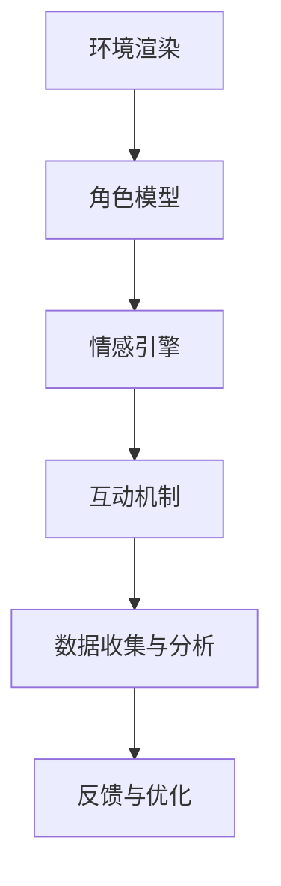

                 

关键词：虚拟现实、同理心、社会情感、互动平台、游戏创业

> 摘要：本文旨在探讨虚拟现实（VR）技术在游戏创业中的应用，特别是如何通过同理心游戏设计培养参与者的社会情感，打造一个互动性强的平台。本文将详细阐述虚拟现实同理心游戏的核心概念、设计原则、算法原理、数学模型、项目实践以及未来展望。

## 1. 背景介绍

近年来，虚拟现实（VR）技术以其沉浸式、互动性和高度仿真的特点，引发了游戏、教育、医疗等多个领域的革命。VR游戏不仅提供了前所未有的沉浸体验，还为玩家创造了互动和合作的机会。然而，随着技术的发展，人们越来越意识到，虚拟现实游戏不仅仅是为了娱乐，还可以用于培养和提升社会情感。

同理心是一种重要的社会情感，指的是理解和感受他人情绪的能力。在现代社会，同理心的培养变得越来越重要，因为缺乏同理心可能导致人际关系的疏离和社会冲突的加剧。因此，通过游戏设计来培养同理心成为了一个值得探索的领域。

同理心游戏是一种旨在通过互动和体验来增强玩家同理心的游戏设计方法。这些游戏通常需要玩家在虚拟环境中扮演不同的角色，并通过模拟真实情境来理解和感受他人的情绪。同理心游戏不仅可以提高玩家的情感认知，还可以促进他们的社交技能和团队合作能力。

## 2. 核心概念与联系

### 2.1. 虚拟现实同理心游戏定义

虚拟现实同理心游戏是一种利用VR技术设计的游戏，旨在通过模拟真实情境，让玩家在虚拟环境中体验和理解他人的情绪，从而培养同理心。这些游戏通常包含以下核心元素：

1. **沉浸式环境**：通过VR技术为玩家创造一个高度仿真的虚拟环境，使玩家感觉身临其境。
2. **情感角色扮演**：玩家需要在虚拟环境中扮演不同的角色，并体验这些角色的情感和经历。
3. **互动性**：游戏提供与虚拟角色和环境的互动机会，让玩家通过行动来理解和感受他人的情绪。
4. **情感反馈**：游戏设计包括对玩家情感的反馈，帮助玩家意识到自己的情感状态，并鼓励他们同理他人的感受。

### 2.2. 同理心游戏设计原则

设计同理心游戏时，应遵循以下原则：

1. **情境真实性**：游戏场景应尽可能接近现实生活，以增加玩家的投入感和认同感。
2. **情感共鸣**：游戏需要引发玩家的情感共鸣，使他们能够深入体验到他人的情感。
3. **互动机制**：游戏应提供丰富的互动机制，鼓励玩家主动参与和探索。
4. **情感反馈**：游戏应提供及时的反馈，帮助玩家了解自己的情感状态，并鼓励他们同理他人的感受。

### 2.3. 虚拟现实同理心游戏架构

虚拟现实同理心游戏的架构可以分为以下几个部分：

1. **环境渲染**：使用VR技术渲染游戏场景，提供高度仿真的视觉体验。
2. **角色模型**：创建具有复杂情感和行为特征的虚拟角色。
3. **情感引擎**：用于模拟和控制角色的情感状态，以及玩家与角色之间的情感互动。
4. **互动机制**：设计玩家与虚拟角色和环境之间的互动机制。
5. **数据收集与分析**：收集玩家在游戏中的互动数据，进行分析以优化游戏设计。

下面是虚拟现实同理心游戏的架构Mermaid流程图：



### 2.4. 虚拟现实同理心游戏的作用

虚拟现实同理心游戏不仅能够提供娱乐体验，还具有以下重要作用：

1. **情感认知提升**：通过模拟真实情境，玩家能够更深入地理解他人的情绪，提升情感认知能力。
2. **社交技能培养**：游戏中的互动机制和团队合作任务有助于培养玩家的社交技能。
3. **心理健康促进**：同理心游戏可以作为一种心理健康促进工具，帮助玩家缓解压力和焦虑。
4. **教育意义**：同理心游戏可以用于教育领域，帮助学生和社会大众培养同理心，提高社会道德水平。

## 3. 核心算法原理 & 具体操作步骤

### 3.1. 算法原理概述

虚拟现实同理心游戏的核心算法主要包括环境渲染算法、角色模型算法和情感引擎算法。这些算法共同作用，为玩家提供一个沉浸式、互动性和情感丰富的游戏体验。

1. **环境渲染算法**：使用计算机图形学技术，根据游戏设计需求，实时渲染虚拟环境。这包括场景建模、纹理映射、光照计算等步骤。
2. **角色模型算法**：创建具有复杂情感和行为特征的虚拟角色，包括角色动作捕捉、情感状态模拟和行为决策等。
3. **情感引擎算法**：模拟和控制角色的情感状态，以及玩家与角色之间的情感互动。这包括情感感知、情感表达和情感反馈等步骤。

### 3.2. 算法步骤详解

1. **环境渲染算法步骤**：

   - **场景建模**：使用三维建模软件创建游戏场景，包括建筑、人物、物体等。
   - **纹理映射**：为场景中的物体贴上纹理，使其更加真实。
   - **光照计算**：根据场景中的光源和物体属性，计算光照效果，使场景更加生动。
   - **实时渲染**：使用GPU进行实时渲染，将场景呈现给玩家。

2. **角色模型算法步骤**：

   - **角色设计**：设计角色的外观、动作和情感特征。
   - **动作捕捉**：使用动作捕捉技术记录角色的动作，用于驱动虚拟角色的运动。
   - **情感状态模拟**：根据角色属性和游戏情境，模拟角色的情感状态。
   - **行为决策**：根据情感状态和游戏规则，决定角色的行为。

3. **情感引擎算法步骤**：

   - **情感感知**：通过音频、视频和互动数据，感知玩家的情感状态。
   - **情感表达**：根据玩家的情感状态，调整角色的情感表达。
   - **情感反馈**：通过游戏界面和互动机制，向玩家反馈情感状态，增强沉浸感。

### 3.3. 算法优缺点

**优点**：

- **沉浸式体验**：虚拟现实技术能够为玩家提供高度沉浸式的游戏体验。
- **情感互动**：通过情感引擎算法，玩家能够与虚拟角色建立情感互动，培养同理心。
- **多样化应用**：同理心游戏可以应用于教育、医疗、心理健康等多个领域。

**缺点**：

- **技术门槛**：虚拟现实技术的开发和维护需要较高的技术门槛和成本。
- **设备依赖**：玩家需要使用VR设备，这限制了游戏的普及和受众范围。
- **伦理争议**：虚拟现实游戏可能会引发伦理争议，特别是在模拟敏感情境时。

### 3.4. 算法应用领域

虚拟现实同理心游戏的应用领域非常广泛，包括但不限于：

- **教育**：通过同理心游戏，帮助学生培养社会情感和团队合作能力。
- **心理健康**：作为心理治疗工具，帮助患者缓解焦虑和压力。
- **社交技能训练**：为社交障碍者提供互动和社交技能训练。
- **商业培训**：用于商业场景的团队合作和沟通技能培训。

## 4. 数学模型和公式 & 详细讲解 & 举例说明

### 4.1. 数学模型构建

虚拟现实同理心游戏的数学模型主要包括环境渲染模型、角色模型算法和情感引擎模型。以下是一个简化的数学模型示例：

1. **环境渲染模型**：

   - **场景建模**：使用三维空间坐标系表示场景中的物体，每个物体可以用三维向量表示。
   - **纹理映射**：使用二维纹理坐标系将纹理映射到三维物体上。
   - **光照计算**：使用向量计算光照强度和颜色。

2. **角色模型算法**：

   - **角色设计**：使用参数化建模方法，定义角色的外观、动作和情感特征。
   - **动作捕捉**：使用贝塞尔曲线或样条曲线表示角色的动作轨迹。
   - **情感状态模拟**：使用贝叶斯网络或马尔可夫模型表示角色的情感状态。

3. **情感引擎模型**：

   - **情感感知**：使用支持向量机（SVM）或神经网络模型分析玩家情感。
   - **情感表达**：使用线性回归模型预测角色情感表达。
   - **情感反馈**：使用动态系统模型描述玩家与角色之间的情感互动。

### 4.2. 公式推导过程

以下是一个简化的环境渲染模型公式推导过程：

1. **场景建模**：

   - **三维空间坐标系**：假设场景中的物体位置可以用三维向量 \(\vec{P} = (x, y, z)\) 表示。
   - **纹理映射**：假设纹理坐标系中的纹理坐标为 \((u, v)\)，可以使用以下公式将三维物体映射到二维纹理上：

     $$ \vec{N} = \vec{P} \times \vec{T} $$
     
     其中，\(\vec{T} = (u, v, 0)\) 是纹理坐标向量。

2. **光照计算**：

   - **光源位置**：假设光源位置为 \(\vec{L} = (l_x, l_y, l_z)\)。
   - **光照强度**：使用以下公式计算光照强度：

     $$ I = \frac{|\vec{L} \cdot \vec{N}|}{||\vec{L}|| \cdot ||\vec{N}||} $$
     
     其中，\(\vec{N}\) 是法向量，\(\vec{L}\) 是光源向量。

3. **实时渲染**：

   - **渲染方程**：使用以下公式进行实时渲染：

     $$ \vec{C} = I \cdot \vec{N} $$
     
     其中，\(\vec{C}\) 是物体颜色。

### 4.3. 案例分析与讲解

以下是一个简单的虚拟现实同理心游戏案例，用于培养玩家的同理心。

**案例背景**：一个模拟医院急诊室的同理心游戏，玩家需要扮演一名急诊医生，处理各种急诊病例。

**情感状态**：游戏设计了以下情感状态：

- **焦虑**：当玩家面对复杂的病例或时间紧迫时。
- **沮丧**：当玩家无法救治患者时。
- **满足**：当玩家成功救治患者时。

**情感感知**：使用支持向量机（SVM）模型感知玩家的焦虑、沮丧和满足情感状态。例如，当玩家在急诊室内时间过长时，SVM模型可以识别出玩家的焦虑状态。

**情感表达**：根据玩家的情感状态，游戏调整角色的情感表达。例如，当玩家焦虑时，角色可以表现出紧张和不安。

**情感反馈**：通过游戏界面和互动机制，向玩家反馈情感状态。例如，当玩家成功救治患者时，游戏界面可以显示祝贺和鼓励的图像。

### 4.4. 数学模型在实际项目中的应用

以下是一个虚拟现实同理心游戏项目的数学模型应用示例：

**项目简介**：一个名为“同理心体验”的虚拟现实游戏，玩家需要在虚拟环境中扮演不同的角色，体验和理解他人的情绪。

**环境渲染模型**：使用三维建模软件创建游戏场景，使用向量计算场景中的物体位置和光照。

**角色模型算法**：使用贝塞尔曲线表示角色的动作轨迹，使用贝叶斯网络模拟角色的情感状态。

**情感引擎模型**：使用神经网络模型感知玩家的情感状态，使用动态系统模型描述玩家与角色之间的情感互动。

**数据收集与分析**：收集玩家在游戏中的互动数据，使用统计方法分析玩家的情感变化，优化游戏设计。

## 5. 项目实践：代码实例和详细解释说明

### 5.1. 开发环境搭建

**开发工具**：

- **Unity**：用于游戏开发，提供强大的VR支持和三维图形渲染能力。
- **C#**：用于编写游戏逻辑和算法。
- **Python**：用于数据处理和模型训练。

**开发环境**：

- **Unity Hub**：用于安装Unity版本和管理项目。
- **Visual Studio**：用于编写C#代码。
- **Python**：使用Anaconda发行版，提供Python环境和相关库。

**环境搭建步骤**：

1. 安装Unity Hub，并创建一个新的Unity项目。
2. 安装Visual Studio，并配置C#开发环境。
3. 安装Python和Anaconda，配置Python开发环境。

### 5.2. 源代码详细实现

以下是一个简单的虚拟现实同理心游戏源代码实现示例：

**Unity项目结构**：

- **Assets**：存放游戏资源和脚本。
- **Scenes**：存放游戏场景文件。
- **Scripts**：存放C#脚本。

**主要脚本**：

1. **MainCamera.cs**：用于控制主摄像头的位置和方向。
2. **PlayerController.cs**：用于控制玩家的移动和交互。
3. **EmotionEngine.cs**：用于处理玩家的情感状态。

**代码实现**：

**MainCamera.cs**：

```csharp
using UnityEngine;

public class MainCamera : MonoBehaviour
{
    public Transform playerTransform;
    public float sensitivity = 5.0f;

    private float rotationX = 0.0f;
    private float rotationY = 0.0f;

    void Update()
    {
        rotationX += Input.GetAxis("Mouse X") * sensitivity;
        rotationY += Input.GetAxis("Mouse Y") * sensitivity;

        rotationY = Mathf.Clamp(rotationY, -90.0f, 90.0f);

        playerTransform.rotation = Quaternion.Euler(0.0f, rotationX, 0.0f);
        transform.localRotation = Quaternion.Euler(-rotationY, 0.0f, 0.0f);
    }
}
```

**PlayerController.cs**：

```csharp
using UnityEngine;

public class PlayerController : MonoBehaviour
{
    public float speed = 5.0f;

    private CharacterController characterController;

    void Start()
    {
        characterController = GetComponent<CharacterController>();
    }

    void Update()
    {
        float moveX = Input.GetAxis("Horizontal");
        float moveZ = Input.GetAxis("Vertical");

        Vector3 moveDirection = transform.right * moveX + transform.forward * moveZ;
        moveDirection.y = 0.0f;

        characterController.Move(moveDirection * speed * Time.deltaTime);
    }
}
```

**EmotionEngine.cs**：

```csharp
using UnityEngine;

public class EmotionEngine : MonoBehaviour
{
    public enum Emotion
    {
        Happy,
        Sad,
        Angry,
        Neutral
    }

    private Emotion currentEmotion = Emotion.Neutral;

    public void SetEmotion(Emotion emotion)
    {
        currentEmotion = emotion;
        // 更新角色情感表现
    }

    public Emotion GetCurrentEmotion()
    {
        return currentEmotion;
    }
}
```

### 5.3. 代码解读与分析

**MainCamera.cs**：

这个脚本用于控制主摄像头的旋转，实现自由视角控制。通过鼠标输入，玩家可以左右旋转摄像头，实现360度观察游戏场景。

**PlayerController.cs**：

这个脚本用于控制玩家的移动。玩家可以通过键盘输入控制角色的前后移动和左右转向。使用CharacterController组件实现平滑的移动效果。

**EmotionEngine.cs**：

这个脚本用于处理玩家的情感状态。玩家可以通过游戏情境触发不同的情感状态，如快乐、悲伤、愤怒等。SetEmotion方法用于设置当前情感状态，GetCurrentEmotion方法用于获取当前情感状态。

### 5.4. 运行结果展示

运行游戏后，玩家可以通过键盘和鼠标控制角色在虚拟环境中移动和观察。摄像头可以自由旋转，观察场景的各个角度。角色会根据情感状态表现出不同的情感反应，如微笑、哭泣、皱眉等。

## 6. 实际应用场景

### 6.1. 教育领域

虚拟现实同理心游戏在教育领域有广泛的应用前景。通过模拟真实情境，学生可以在虚拟环境中体验和理解他人的情绪，培养同理心和社会情感。以下是一些具体的应用场景：

1. **情感教育**：通过角色扮演和情境模拟，学生可以学习如何识别和理解他人的情绪，提高情感认知能力。
2. **团队合作训练**：虚拟现实同理心游戏可以设计团队合作任务，帮助学生培养团队合作能力和社交技能。
3. **心理辅导**：同理心游戏可以作为心理辅导工具，帮助学生缓解焦虑和压力，提高心理健康水平。

### 6.2. 医疗领域

在医疗领域，虚拟现实同理心游戏可以用于培养医护人员的同理心和专业技能。以下是一些具体的应用场景：

1. **同理心培养**：通过模拟患者情境，医护人员可以体验患者的情绪和感受，提高同理心。
2. **心理辅导**：同理心游戏可以作为心理辅导工具，帮助患者缓解焦虑和压力，提高治疗配合度。
3. **团队协作训练**：通过虚拟现实同理心游戏，医护人员可以模拟实际工作情境，培养团队协作能力和沟通技巧。

### 6.3. 社交障碍者训练

对于社交障碍者，虚拟现实同理心游戏提供了一种安全、可控的训练环境，帮助他们提高社交技能和同理心。以下是一些具体的应用场景：

1. **社交技能训练**：通过角色扮演和情境模拟，社交障碍者可以学习如何识别和理解他人的情绪，提高社交技能。
2. **情感认知提升**：同理心游戏可以帮助社交障碍者提高情感认知能力，理解他人的情感需求。
3. **心理健康促进**：同理心游戏可以作为心理健康促进工具，帮助社交障碍者缓解焦虑和压力，提高生活质量。

### 6.4. 未来应用展望

虚拟现实同理心游戏在未来有望在更广泛的领域得到应用。以下是一些未来应用展望：

1. **商业培训**：虚拟现实同理心游戏可以用于商业场景的团队合作和沟通技能培训。
2. **公共安全教育**：通过模拟真实情境，虚拟现实同理心游戏可以用于公共安全教育和防范意识培养。
3. **社会福利**：同理心游戏可以作为一种社会福利工具，帮助社会弱势群体提高生活质量和心理健康水平。

## 7. 工具和资源推荐

### 7.1. 学习资源推荐

1. **《虚拟现实技术基础》**：适合初学者了解虚拟现实技术的基本原理和应用。
2. **《情感计算与同理心培养》**：深入探讨情感计算和同理心培养的理论和方法。
3. **《Unity游戏开发入门教程》**：适合初学者学习Unity游戏开发的基本技能。

### 7.2. 开发工具推荐

1. **Unity**：功能强大的游戏开发引擎，支持VR开发。
2. **Unreal Engine**：另一个流行的游戏开发引擎，具有高性能的VR渲染能力。
3. **Python**：用于数据分析和模型训练，具有丰富的库和工具。

### 7.3. 相关论文推荐

1. **"Affective Computing: Tracing the Rise of a New Discipline"**：探讨了情感计算的发展历程和影响。
2. **"Embodied Cognition: A Distributed交互作用视角"**：从分布式交互作用的角度探讨了同理心的本质。
3. **"Virtual Reality Therapy: A Guide to Developing and Using Interactive Virtual Environments for Clinical Treatment"**：介绍了虚拟现实治疗的应用和实践。

## 8. 总结：未来发展趋势与挑战

### 8.1. 研究成果总结

虚拟现实同理心游戏作为一种新兴的游戏设计方法，已经在教育、医疗、心理健康等领域取得了显著成果。通过虚拟现实技术，玩家可以在虚拟环境中体验和理解他人的情绪，培养同理心和社会情感。这一技术不仅提高了玩家的情感认知能力，还促进了他们的社交技能和团队合作能力。

### 8.2. 未来发展趋势

虚拟现实同理心游戏在未来有望在更广泛的领域得到应用。随着技术的不断进步，虚拟现实技术的沉浸感和互动性将进一步提高，为同理心游戏设计提供更丰富的可能性。此外，人工智能和情感计算技术的融合将为同理心游戏带来更精准的情感感知和表达，进一步提升玩家的体验。

### 8.3. 面临的挑战

尽管虚拟现实同理心游戏具有巨大潜力，但仍面临一些挑战。首先，技术门槛和成本较高，限制了该技术的普及和应用。其次，伦理争议是一个重要问题，特别是在模拟敏感情境时，如何确保游戏的道德底线和用户隐私。最后，游戏设计的质量和用户体验的优化也是一个长期挑战。

### 8.4. 研究展望

未来，虚拟现实同理心游戏的研究将集中在以下几个方面：

1. **技术优化**：通过改进虚拟现实技术和情感计算算法，提高游戏的沉浸感和互动性。
2. **伦理规范**：建立伦理规范，确保游戏的道德底线和用户隐私。
3. **应用拓展**：探索虚拟现实同理心游戏在更多领域的应用，如商业培训、公共安全等。
4. **用户体验**：优化游戏设计，提高玩家的参与度和满意度。

## 9. 附录：常见问题与解答

### 9.1. 虚拟现实同理心游戏是什么？

虚拟现实同理心游戏是一种利用虚拟现实技术设计的游戏，旨在通过模拟真实情境，让玩家在虚拟环境中体验和理解他人的情绪，从而培养同理心。

### 9.2. 虚拟现实同理心游戏有哪些应用领域？

虚拟现实同理心游戏可以应用于教育、医疗、心理健康、社交障碍者训练等多个领域。

### 9.3. 如何设计一款成功的虚拟现实同理心游戏？

设计一款成功的虚拟现实同理心游戏需要考虑以下因素：

- 情境真实性
- 情感共鸣
- 互动机制
- 情感反馈

同时，需要遵循伦理规范，确保游戏的道德底线和用户隐私。

### 9.4. 虚拟现实同理心游戏有哪些挑战？

虚拟现实同理心游戏面临的主要挑战包括技术门槛、成本、伦理争议和用户体验优化。

### 9.5. 虚拟现实同理心游戏与普通虚拟现实游戏有何区别？

虚拟现实同理心游戏侧重于通过模拟真实情境，培养玩家的同理心和社会情感。而普通虚拟现实游戏主要侧重于娱乐和体验。

### 9.6. 虚拟现实同理心游戏如何提高玩家的情感认知？

虚拟现实同理心游戏通过模拟真实情境，让玩家在虚拟环境中体验和理解他人的情绪，从而提高情感认知能力。

### 9.7. 虚拟现实同理心游戏对心理健康有何影响？

虚拟现实同理心游戏可以作为心理健康促进工具，帮助玩家缓解焦虑和压力，提高心理健康水平。

### 9.8. 虚拟现实同理心游戏对社交技能有何影响？

虚拟现实同理心游戏通过互动和合作任务，可以帮助玩家培养社交技能，提高团队合作能力。

### 9.9. 虚拟现实同理心游戏对教育有何影响？

虚拟现实同理心游戏可以用于教育领域，帮助学生培养社会情感和团队合作能力，提高教育效果。

### 9.10. 虚拟现实同理心游戏对商业有何影响？

虚拟现实同理心游戏可以用于商业培训，帮助员工培养团队合作和沟通技能，提高工作效率。

### 9.11. 虚拟现实同理心游戏对医疗有何影响？

虚拟现实同理心游戏可以用于医疗领域，培养医护人员的同理心和专业技能，提高医疗服务质量。

### 9.12. 虚拟现实同理心游戏对社会有何影响？

虚拟现实同理心游戏可以促进社会和谐，提高人们的情感认知和同理心，减少社会冲突和人际关系的疏离。作者：禅与计算机程序设计艺术 / Zen and the Art of Computer Programming。

