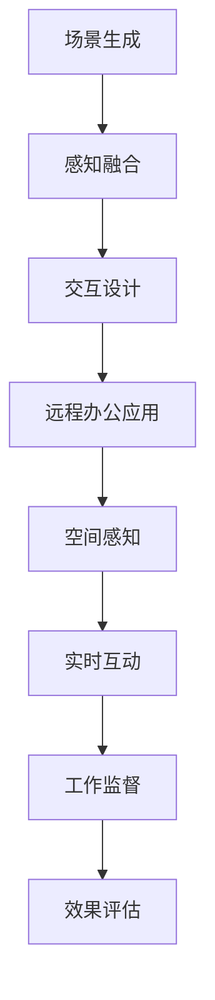

                 

关键词：虚拟现实、远程办公、VR技术、创业、工作空间、未来模式

> 摘要：本文探讨了虚拟现实（VR）在工作空间中的应用，以及如何利用VR技术推动远程办公的革新。文章分析了VR技术的核心概念、实现步骤、数学模型及其在现实世界中的具体应用，探讨了VR技术在创业环境下的潜力，并展望了其未来的发展趋势与挑战。

## 1. 背景介绍

### 虚拟现实与远程办公的现状

近年来，虚拟现实（Virtual Reality，VR）技术逐渐成为信息技术领域的重要创新方向。随着硬件设备的成熟和技术的进步，VR技术在娱乐、教育、医疗等多个领域已经取得了显著成果。而在远程办公方面，VR技术也展现出了巨大的潜力。随着全球化和数字化的深入，远程办公已经成为一种常态，尤其是在COVID-19疫情的影响下，远程办公的需求更是急剧增长。

### 远程办公的挑战与机遇

远程办公虽然为人们提供了更大的灵活性，但也带来了一系列挑战，如沟通障碍、协作困难、工作监督等。而VR技术有望通过构建高度沉浸的工作环境，解决这些难题。同时，远程办公的兴起也为VR技术带来了新的应用场景和商业机会。

## 2. 核心概念与联系

### VR技术核心概念

虚拟现实技术是一种通过计算机生成三维场景，利用头戴式显示器等设备为用户带来沉浸式体验的技术。VR技术主要包括以下几个方面：

- **场景生成**：利用计算机图形学技术生成三维场景，包括建筑物、人物、物体等。
- **感知融合**：通过传感器和追踪设备，将用户在现实世界中的动作和视觉反馈与虚拟世界进行实时融合。
- **交互设计**：设计符合人类操作习惯的交互界面，使用户能够自然地与虚拟环境进行交互。

### 远程办公与VR技术的联系

远程办公与VR技术的结合，可以构建一个高度沉浸、实时互动的工作空间。具体来说，VR技术可以解决以下几个关键问题：

- **空间感知**：通过虚拟现实技术，用户可以在虚拟环境中感知自己的工作空间，无需受限于物理空间。
- **实时互动**：虚拟现实技术可以实现远程团队之间的实时互动，减少沟通障碍，提高协作效率。
- **工作监督**：通过虚拟现实技术，管理层可以实时监控员工的工作状态，提高工作效率。

### Mermaid 流程图

下面是一个简化的VR技术核心概念及工作流程的Mermaid流程图：



## 3. 核心算法原理 & 具体操作步骤

### 3.1 算法原理概述

虚拟现实工作空间的核心算法主要包括以下几个方面：

- **场景渲染算法**：利用图形学技术生成三维场景。
- **传感器融合算法**：将用户动作与虚拟环境进行实时融合。
- **交互算法**：设计符合人类操作习惯的交互界面。

### 3.2 算法步骤详解

#### 场景渲染算法

1. **场景建模**：利用3D建模软件或开源模型库构建虚拟空间。
2. **光线追踪**：通过光线追踪算法实现场景的渲染效果，包括阴影、反射、折射等。

#### 传感器融合算法

1. **姿态追踪**：使用头部追踪器和手部追踪器获取用户动作。
2. **空间映射**：将用户动作映射到虚拟空间中，实现实时交互。

#### 交互算法

1. **输入处理**：将用户的操作（如点击、拖动等）转换为虚拟环境中的操作。
2. **反馈机制**：根据用户操作实时更新虚拟环境，提供视觉、听觉等多感官反馈。

### 3.3 算法优缺点

**优点**：

- 提高远程办公的沉浸感和互动性。
- 减少物理空间的限制，实现灵活的办公环境。
- 提高工作效率，减少沟通障碍。

**缺点**：

- 硬件设备成本较高。
- 技术实现复杂，对开发人员要求较高。

### 3.4 算法应用领域

VR技术广泛应用于远程办公、教育、医疗、娱乐等领域。在远程办公中，VR技术可以构建高度沉浸、实时互动的工作空间，提高工作效率和团队协作能力。

## 4. 数学模型和公式 & 详细讲解 & 举例说明

### 4.1 数学模型构建

虚拟现实工作空间的数学模型主要包括以下几个方面：

- **三维空间建模**：使用向量表示三维空间中的点、线、面等元素。
- **传感器数据处理**：使用滤波算法处理传感器数据，提高数据精度和稳定性。
- **交互控制**：使用数学模型描述用户操作与虚拟环境之间的交互关系。

### 4.2 公式推导过程

以下是构建虚拟现实工作空间数学模型的一个简化示例：

- **三维空间建模**：

  - 点的表示：\(P(x, y, z)\)
  - 向量的表示：\( \vec{v} = (v_x, v_y, v_z) \)
  - 点到点的距离：\( d(P_1, P_2) = \sqrt{(x_2 - x_1)^2 + (y_2 - y_1)^2 + (z_2 - z_1)^2} \)

- **传感器数据处理**：

  - 姿态矩阵：\( A = \begin{bmatrix} r_x & -r_y & r_z \\ r_y & r_x & -r_z \\ -r_z & r_y & r_x \end{bmatrix} \)
  - 传感器数据融合：\( \hat{P} = A \cdot P \)

- **交互控制**：

  - 输入处理：\( C = \begin{bmatrix} x \\ y \\ z \end{bmatrix} \)
  - 输出控制：\( D = C \cdot P \)

### 4.3 案例分析与讲解

假设在一个远程办公场景中，用户A和用户B需要通过VR技术进行实时协作。以下是具体的数学模型应用实例：

- **三维空间建模**：

  - 用户A的位置：\( P_A(x_A, y_A, z_A) \)
  - 用户B的位置：\( P_B(x_B, y_B, z_B) \)

- **传感器数据处理**：

  - 用户A的姿态矩阵：\( A_A = \begin{bmatrix} r_{Ax} & -r_{Ay} & r_{Az} \\ r_{Ay} & r_{Ax} & -r_{Az} \\ -r_{Az} & r_{Ay} & r_{Ax} \end{bmatrix} \)
  - 用户B的姿态矩阵：\( A_B = \begin{bmatrix} r_{Bx} & -r_{By} & r_{Bz} \\ r_{By} & r_{Bx} & -r_{Bz} \\ -r_{Bz} & r_{By} & r_{Bx} \end{bmatrix} \)

- **交互控制**：

  - 用户A的输入：\( C_A = \begin{bmatrix} x_A \\ y_A \\ z_A \end{bmatrix} \)
  - 用户B的输入：\( C_B = \begin{bmatrix} x_B \\ y_B \\ z_B \end{bmatrix} \)

通过以上数学模型，可以实现用户A和B之间的实时协作。例如，当用户A移动时，其位置和姿态会实时更新，并反馈给用户B，确保双方在同一虚拟空间中保持同步。

## 5. 项目实践：代码实例和详细解释说明

### 5.1 开发环境搭建

在本文中，我们将使用Unity引擎作为主要开发工具，结合VRSDK进行虚拟现实工作空间的开发。以下是开发环境搭建的步骤：

1. **安装Unity引擎**：从Unity官网下载并安装Unity Hub，创建一个新的Unity项目。
2. **安装VRSDK**：从VRSDK官网下载SDK，并按照文档说明将其集成到Unity项目中。
3. **配置Unity项目**：在Unity编辑器中配置VR设备，如Oculus Rift、HTC Vive等。

### 5.2 源代码详细实现

以下是虚拟现实工作空间的核心源代码实现：

```csharp
using UnityEngine;
using UnityEngine.XR;

public class VirtualWorkspace : MonoBehaviour
{
    public GameObject avatarPrefab;
    public Transform workspace;

    private GameObject avatar;
    private Pose lastPose;

    void Start()
    {
        // 创建用户头像
        avatar = Instantiate(avatarPrefab, workspace.position, workspace.rotation);
        
        // 获取初始姿态
        lastPose = new Pose(workspace.position, workspace.rotation);
    }

    void Update()
    {
        // 获取当前姿态
        Pose currentPose = new Pose();
        XRDevice.Begin姿态更新（currentPose， out bool initialized）
        
        // 更新用户头像位置
        if (initialized)
        {
            avatar.transform.position = currentPose.position;
            avatar.transform.rotation = currentPose.rotation;
        }
        
        // 将当前姿态更新为上一姿态
        lastPose = currentPose;
    }
}
```

### 5.3 代码解读与分析

上述代码实现了一个简单的虚拟现实工作空间。主要分为以下几个部分：

1. **创建用户头像**：在项目开始时，创建一个用户头像对象，并将其放置在工作空间中。
2. **获取姿态更新**：在Update函数中，通过调用XRDevice.BeginTracking()获取当前用户姿态。
3. **更新用户头像位置**：根据当前姿态更新用户头像的位置和旋转。

### 5.4 运行结果展示

在运行上述代码后，用户可以在虚拟现实环境中实时感知自己的位置和姿态，并通过VR设备进行交互。

## 6. 实际应用场景

### 6.1 虚拟会议室

虚拟会议室是VR技术在远程办公中的一种典型应用。通过虚拟现实技术，参会者可以在一个虚拟会议室中实时互动，如同在现实中一样。这种模式不仅可以减少差旅费用，还能提高会议效率。

### 6.2 虚拟办公室

虚拟办公室通过VR技术构建一个高度沉浸的工作空间，员工可以在虚拟环境中办公，实现远程协作。这种模式为远程工作者提供了更大的灵活性，同时也便于管理者进行监督和指导。

### 6.3 虚拟培训

虚拟培训利用VR技术为培训者提供沉浸式的学习体验。培训者可以在虚拟环境中模拟各种场景，提高培训效果。这种模式尤其适用于安全风险较高的行业，如航空航天、医疗等。

## 7. 未来应用展望

### 7.1 技术成熟度

随着硬件设备的不断发展和优化，VR技术的性能和成本将逐步提升。未来，VR设备将更加轻便、易用、成本低廉，从而进一步推动VR技术在远程办公中的应用。

### 7.2 社会接受度

随着VR技术的普及，社会对VR技术的接受度也将逐步提高。越来越多的企业和个人将认识到VR技术在远程办公中的优势，并积极采用VR技术进行工作。

### 7.3 跨行业应用

未来，VR技术将在更多行业得到应用。例如，在建筑设计、工业制造、零售等领域，VR技术可以用于虚拟展示、虚拟制造、虚拟零售等场景，提高工作效率和用户体验。

## 8. 总结：未来发展趋势与挑战

### 8.1 研究成果总结

本文通过分析虚拟现实技术核心概念、实现步骤、数学模型及应用场景，探讨了VR技术在远程办公领域的潜力。研究表明，VR技术可以显著提升远程办公的沉浸感和互动性，提高工作效率和团队协作能力。

### 8.2 未来发展趋势

未来，VR技术将在远程办公、教育、医疗、娱乐等领域得到广泛应用。随着技术的成熟和社会接受度的提高，VR技术将逐步成为远程办公的标配。

### 8.3 面临的挑战

尽管VR技术在远程办公中具有巨大潜力，但仍面临一些挑战。例如，硬件设备成本较高、技术实现复杂等。未来，需要进一步降低成本、优化技术，并提高开发人员的技术水平，以应对这些挑战。

### 8.4 研究展望

在未来，我们应关注以下几个方面：

1. **硬件优化**：提高VR设备的性能、降低成本，使其更加普及。
2. **交互优化**：设计更加符合人类操作习惯的交互界面，提高用户体验。
3. **应用拓展**：探索VR技术在更多行业中的应用，提高社会效益。

## 9. 附录：常见问题与解答

### 9.1 VR设备成本高吗？

目前，VR设备的成本较高，但随着技术的进步和市场竞争的加剧，未来VR设备的价格有望进一步降低。

### 9.2 VR技术对隐私有何影响？

VR技术本身并不直接侵犯隐私，但需要确保数据的安全性和隐私保护。在应用VR技术时，应遵循相关法律法规，并采取必要的安全措施。

### 9.3 VR技术是否会造成视觉疲劳？

适当的休息和调节可以减轻VR技术带来的视觉疲劳。同时，未来VR设备的屏幕技术和内容设计将进一步优化，以减少视觉疲劳。

---

### 作者署名

本文由“作者：禅与计算机程序设计艺术 / Zen and the Art of Computer Programming”撰写。

