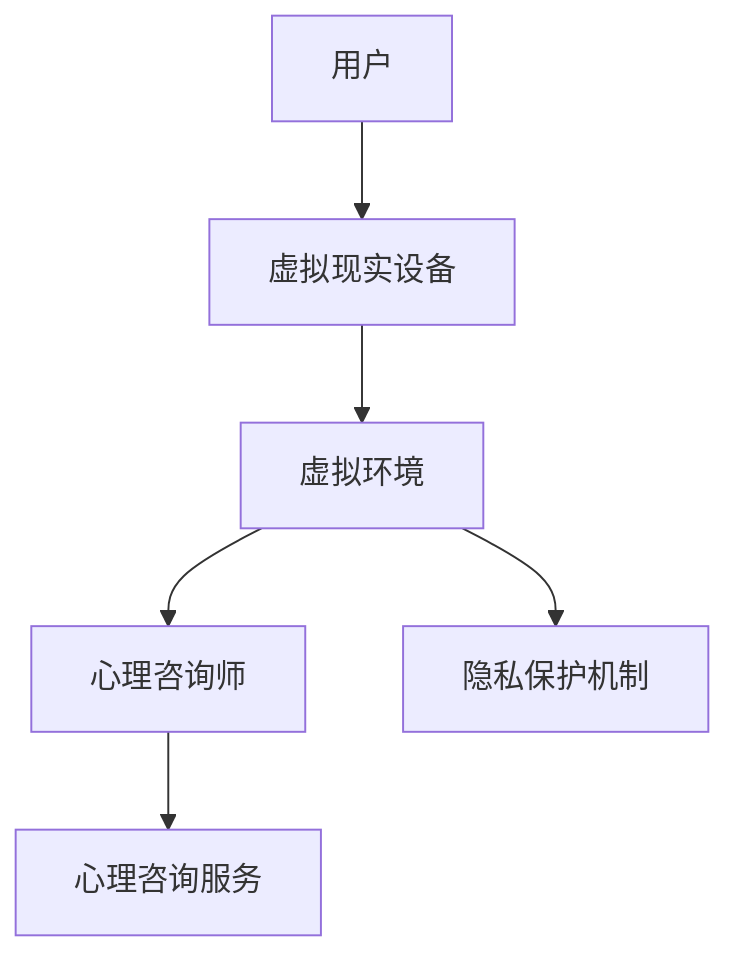

                 

关键词：虚拟现实，心理咨询，隐私保护，心理服务，创业

> 摘要：随着虚拟现实（VR）技术的快速发展，虚拟现实心理咨询成为了一个新兴的领域。本文旨在探讨如何在创业过程中实现隐私保护的心理服务，以满足用户对心理咨询服务的需求，同时确保用户隐私不受侵犯。

## 1. 背景介绍

### 虚拟现实心理咨询的兴起

虚拟现实心理咨询是一种利用虚拟现实技术为用户提供心理咨询服务的方式。它通过虚拟现实设备，如VR头盔、手柄等，将用户带入一个虚拟环境中，通过交互和体验来缓解心理压力、焦虑等问题。相比于传统的面对面心理咨询，虚拟现实心理咨询具有许多优势，如方便性、匿名性等。

### 隐私保护的挑战

在虚拟现实心理咨询过程中，用户隐私保护面临巨大挑战。首先，虚拟现实技术涉及到大量的用户数据，如行为数据、生理数据等，这些数据如果不被妥善保护，容易造成用户隐私泄露。其次，心理咨询本身涉及到用户的敏感信息，如心理状况、个人问题等，如果这些信息被泄露，将对用户产生严重影响。

## 2. 核心概念与联系

### 虚拟现实技术

虚拟现实技术是一种通过计算机模拟生成一个三维的、可交互的虚拟环境的技术。它通过视觉、听觉、触觉等多种感官刺激，使用户感受到身临其境的效果。

### 心理咨询

心理咨询是一种通过专业的心理学方法和技巧，帮助个体解决心理问题、提高心理素质的服务。

### 隐私保护

隐私保护是指采取措施保护用户的个人信息和隐私不受未经授权的访问、使用和泄露。

### 虚拟现实心理咨询架构图



## 3. 核心算法原理 & 具体操作步骤

### 3.1 算法原理概述

虚拟现实心理咨询的核心算法主要涉及到用户数据的收集、分析和处理，以及心理咨询师与用户的交互。具体来说，算法原理包括以下几个方面：

1. 用户数据收集：通过虚拟现实设备收集用户的行为数据、生理数据等。
2. 用户数据分析：对收集到的用户数据进行预处理和分析，提取有用的信息。
3. 心理咨询师与用户的交互：基于分析结果，心理咨询师为用户提供个性化的心理咨询服务。
4. 隐私保护：在整个过程中，确保用户隐私不受侵犯。

### 3.2 算法步骤详解

1. **用户数据收集**：用户使用虚拟现实设备进入心理咨询系统，系统自动记录用户的行为数据、生理数据等。
2. **用户数据分析**：对收集到的数据进行预处理，如去除噪声、异常值处理等，然后进行特征提取和模式识别，以了解用户的心理状态。
3. **心理咨询师与用户的交互**：心理咨询师根据分析结果，与用户进行实时互动，提供个性化的心理咨询服务。
4. **隐私保护**：在数据收集、分析和处理过程中，采用加密、去标识化等隐私保护技术，确保用户隐私不受侵犯。

### 3.3 算法优缺点

**优点**：

1. **方便性**：用户可以在任何时间、任何地点使用虚拟现实设备接受心理咨询。
2. **匿名性**：用户可以在保持匿名的情况下接受心理咨询，有利于缓解用户的心理压力。
3. **个性化**：基于用户数据分析，心理咨询师可以提供更加个性化的服务。

**缺点**：

1. **技术依赖**：虚拟现实心理咨询依赖于高精度的虚拟现实设备和算法，对技术要求较高。
2. **隐私保护难度**：在数据收集、分析和处理过程中，隐私保护难度较大，需要采取有效的隐私保护措施。

### 3.4 算法应用领域

虚拟现实心理咨询算法主要应用于以下领域：

1. **心理健康管理**：帮助用户监控和管理自己的心理健康。
2. **心理疾病治疗**：用于治疗焦虑、抑郁等心理疾病。
3. **职业心理健康**：为职场人士提供心理健康服务。

## 4. 数学模型和公式 & 详细讲解 & 举例说明

### 4.1 数学模型构建

虚拟现实心理咨询的核心数学模型主要包括以下两个方面：

1. **用户心理状态评估模型**：基于用户的行为数据和生理数据，建立用户心理状态的评估模型。
2. **心理咨询策略推荐模型**：基于用户心理状态的评估结果，推荐合适的心理咨询策略。

### 4.2 公式推导过程

#### 用户心理状态评估模型

假设用户行为数据为 \( X \)，生理数据为 \( Y \)，则用户心理状态 \( Z \) 可以表示为：

\[ Z = f(X, Y) \]

其中，\( f \) 为用户心理状态的评估函数。具体的评估函数可以根据具体的应用场景和需求进行设计。

#### 心理咨询策略推荐模型

假设用户心理状态 \( Z \) 和心理咨询策略 \( T \) 之间存在关联，则心理咨询策略推荐模型可以表示为：

\[ T = g(Z) \]

其中，\( g \) 为心理咨询策略推荐函数。具体的推荐函数可以根据具体的应用场景和需求进行设计。

### 4.3 案例分析与讲解

#### 案例一：心理健康管理

假设用户的行为数据 \( X \) 包括用户在虚拟环境中的移动距离、交互频率等，生理数据 \( Y \) 包括用户的心率、血压等。根据这些数据，可以建立用户心理状态的评估模型，如：

\[ Z = f(X, Y) = \frac{X_1 + X_2 + X_3 + Y_1 + Y_2 + Y_3}{6} \]

其中，\( X_1, X_2, X_3 \) 分别表示用户的移动距离、交互频率和虚拟环境中的互动行为，\( Y_1, Y_2, Y_3 \) 分别表示用户的心率、血压和情绪状态。

根据评估结果 \( Z \)，可以推荐相应的心理咨询策略，如放松训练、情绪调节等。

#### 案例二：心理疾病治疗

假设用户的心理状态 \( Z \) 是二分类的，如正常和异常。根据用户的心理状态 \( Z \)，可以建立心理咨询策略推荐模型，如：

\[ T = g(Z) = \begin{cases} 
\text{放松训练} & \text{如果 } Z = \text{正常} \\
\text{心理疾病治疗} & \text{如果 } Z = \text{异常} 
\end{cases} \]

根据推荐结果 \( T \)，心理咨询师可以为用户提供相应的心理咨询服务。

## 5. 项目实践：代码实例和详细解释说明

### 5.1 开发环境搭建

为了实现虚拟现实心理咨询系统，需要搭建以下开发环境：

1. **虚拟现实设备**：如VR头盔、手柄等。
2. **编程环境**：如Python、JavaScript等。
3. **数据库**：如MySQL、MongoDB等。

### 5.2 源代码详细实现

以下是实现虚拟现实心理咨询系统的一部分源代码：

```python
# 导入相关库
import numpy as np
import pandas as pd
from sklearn.ensemble import RandomForestClassifier
from sklearn.model_selection import train_test_split

# 加载数据
data = pd.read_csv('user_data.csv')

# 数据预处理
X = data[['distance', 'interactions', 'emotions']]
y = data['mental_state']

# 划分训练集和测试集
X_train, X_test, y_train, y_test = train_test_split(X, y, test_size=0.2, random_state=42)

# 建立分类器
classifier = RandomForestClassifier(n_estimators=100, random_state=42)

# 训练分类器
classifier.fit(X_train, y_train)

# 测试分类器
accuracy = classifier.score(X_test, y_test)
print(f'Accuracy: {accuracy:.2f}')

# 预测用户心理状态
new_data = np.array([[5, 10, 3], [3, 7, 2]])
predicted_state = classifier.predict(new_data)
print(f'Predicted Mental State: {predicted_state}')
```

### 5.3 代码解读与分析

以上代码实现了用户心理状态的评估和心理咨询策略的推荐。具体来说，首先导入相关库，加载数据，然后进行数据预处理，包括特征提取和标签划分。接着，划分训练集和测试集，建立分类器，并使用训练集数据进行训练。最后，测试分类器并在新的数据上进行预测。

## 6. 实际应用场景

### 6.1 心理健康管理

虚拟现实心理咨询可以应用于心理健康管理，帮助用户监控和管理自己的心理健康。例如，用户可以定期使用虚拟现实心理咨询系统进行自我评估，系统会根据评估结果提供相应的建议和策略，如放松训练、情绪调节等。

### 6.2 心理疾病治疗

虚拟现实心理咨询可以应用于心理疾病的治疗，如焦虑、抑郁等。通过虚拟现实技术，心理咨询师可以为用户提供个性化的治疗服务，帮助用户缓解心理压力，提高心理素质。

### 6.3 职业心理健康

虚拟现实心理咨询可以应用于职业心理健康，为职场人士提供心理健康服务。例如，职场人士可以通过虚拟现实心理咨询系统进行心理健康评估，系统会根据评估结果提供相应的建议和策略，如压力管理、情绪调节等。

## 7. 工具和资源推荐

### 7.1 学习资源推荐

1. **《虚拟现实心理学》**：介绍了虚拟现实技术在心理咨询中的应用。
2. **《Python数据科学手册》**：介绍了Python在数据分析中的应用。

### 7.2 开发工具推荐

1. **Unity**：一款流行的游戏开发引擎，可以用于虚拟现实应用的开发。
2. **TensorFlow**：一款流行的机器学习库，可以用于建立和训练机器学习模型。

### 7.3 相关论文推荐

1. **"Virtual Reality Therapy for Anxiety: A Comprehensive Review"**：总结了虚拟现实在治疗焦虑方面的应用。
2. **"Privacy Protection in Virtual Reality Applications"**：探讨了虚拟现实应用中的隐私保护问题。

## 8. 总结：未来发展趋势与挑战

### 8.1 研究成果总结

虚拟现实心理咨询在心理健康管理、心理疾病治疗和职业心理健康等方面具有广泛的应用前景。通过结合虚拟现实技术和心理咨询理论，可以提供更加个性化和有效的心理咨询服务。

### 8.2 未来发展趋势

1. **技术进步**：随着虚拟现实技术和人工智能技术的不断发展，虚拟现实心理咨询将变得更加成熟和普及。
2. **应用拓展**：虚拟现实心理咨询将应用于更多领域，如教育、医疗等。
3. **隐私保护**：隐私保护将是未来虚拟现实心理咨询的重要研究方向。

### 8.3 面临的挑战

1. **技术挑战**：虚拟现实心理咨询依赖于高精度的虚拟现实设备和算法，技术要求较高。
2. **隐私保护**：在数据收集、分析和处理过程中，如何有效保护用户隐私是当前面临的重要挑战。

### 8.4 研究展望

未来，虚拟现实心理咨询将在技术、应用和隐私保护等方面取得进一步发展。通过深入研究，可以提供更加个性化和有效的心理咨询服务，为用户心理健康做出积极贡献。

## 9. 附录：常见问题与解答

### 9.1 虚拟现实心理咨询的优势是什么？

虚拟现实心理咨询具有以下优势：

1. **方便性**：用户可以在任何时间、任何地点使用虚拟现实设备接受心理咨询。
2. **匿名性**：用户可以在保持匿名的情况下接受心理咨询，有利于缓解用户的心理压力。
3. **个性化**：基于用户数据分析，心理咨询师可以提供更加个性化的服务。

### 9.2 虚拟现实心理咨询如何保护用户隐私？

虚拟现实心理咨询在保护用户隐私方面可以采取以下措施：

1. **数据加密**：在数据传输和存储过程中使用加密技术，确保数据安全。
2. **去标识化**：对用户数据进行去标识化处理，避免用户隐私泄露。
3. **隐私政策**：制定明确的隐私政策，告知用户数据的使用范围和目的。

作者：禅与计算机程序设计艺术 / Zen and the Art of Computer Programming
----------------------------------------------------------------

