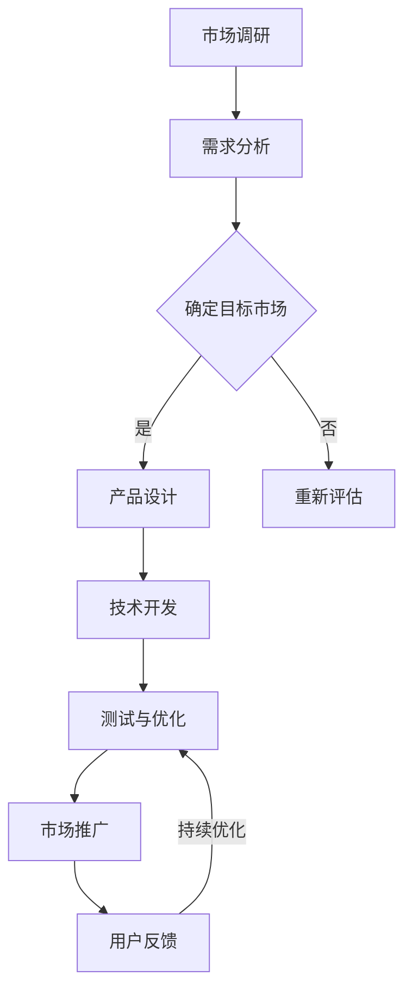

                 

关键词：虚拟现实、文化交融、跨文化体验、平台技术、创业机会

## 摘要

随着虚拟现实（VR）技术的迅速发展和全球化进程的加快，虚拟现实文化交融创业成为一个新兴且具有潜力的领域。本文旨在探讨如何利用VR技术构建一个跨文化体验平台，从而促进不同文化间的相互理解和交流。文章将从背景介绍、核心概念、算法原理、数学模型、项目实践、实际应用、未来展望等多个角度展开论述，为从事该领域创业的个人和团队提供有价值的参考。

## 1. 背景介绍

虚拟现实技术（VR）是一种通过计算机生成的模拟环境，使用户能够沉浸在一种全新的感知体验中。近年来，VR技术在游戏、教育、医疗、设计等多个领域取得了显著进展。然而，VR在文化交融方面的应用还相对较少。随着全球化的加深，不同文化间的交流变得日益频繁，但语言、习俗、价值观等方面的差异往往导致沟通障碍。因此，利用VR技术创造一个能够促进文化理解的跨文化体验平台具有重要意义。

创业领域对VR文化交融的探索也逐步增多。许多创业者看到了VR技术在文化交融领域的巨大潜力，开始尝试通过开发各种VR应用来满足市场需求。这些创业项目不仅能够促进不同文化间的相互理解，还能为用户提供新颖、有趣的文化体验。

## 2. 核心概念与联系

### 2.1 虚拟现实技术

虚拟现实技术通过多种设备（如头戴式显示器、手柄、传感器等）为用户创造一个沉浸式体验。其中，三维建模、立体音效、触觉反馈等技术是VR系统的核心组成部分。

### 2.2 文化交融

文化交融是指不同文化之间通过交流、互动和融合，产生新的文化现象和价值观念。在虚拟现实环境中，文化交融可以通过展示不同文化的习俗、艺术、历史等方式实现。

### 2.3 跨文化体验平台

跨文化体验平台是一个集成多种文化和互动体验的虚拟空间，用户可以在其中自由探索、学习、交流。这个平台的核心是提供多样性和包容性，让用户能够真实感受到不同文化的魅力。

### 2.4 Mermaid 流程图

以下是一个简化的Mermaid流程图，展示了虚拟现实文化交融创业的主要流程：



### 2.5 虚拟现实技术在文化交融中的应用

虚拟现实技术可以在多个方面促进文化交融：

- **文化展示**：通过虚拟博物馆、文化景区等，展示不同文化的艺术作品、历史遗迹。
- **互动体验**：用户可以通过虚拟角色参与文化庆典、传统节日等活动，增进对文化的了解。
- **语言学习**：在虚拟环境中，用户可以通过与虚拟人物对话、互动，提高语言交流能力。

## 3. 核心算法原理 & 具体操作步骤

### 3.1 算法原理概述

在虚拟现实文化交融创业中，算法的原理主要涉及以下几个方面：

- **三维建模与渲染**：通过计算机图形学技术，创建真实感强的三维文化场景。
- **自然语言处理**：利用自然语言处理技术，实现用户与虚拟角色的对话和理解。
- **机器学习与推荐**：通过机器学习算法，根据用户的行为和偏好，推荐合适的文化体验内容。

### 3.2 算法步骤详解

#### 3.2.1 三维建模与渲染

1. **采集文化素材**：收集各种文化元素，如建筑、艺术品、服饰等，进行数字化处理。
2. **建模与优化**：使用三维建模软件，对采集到的素材进行建模，并进行光照、材质等优化。
3. **渲染与导出**：使用渲染引擎，如Unreal Engine、Unity等，对三维模型进行渲染，导出为虚拟现实场景。

#### 3.2.2 自然语言处理

1. **语音识别**：使用语音识别技术，将用户的语音输入转换为文本。
2. **语义理解**：使用自然语言处理技术，理解用户的意图和需求。
3. **对话生成**：根据语义理解的结果，生成合适的回复，通过语音合成技术输出给用户。

#### 3.2.3 机器学习与推荐

1. **用户行为分析**：收集用户在虚拟环境中的行为数据，如点击、停留时间、交互方式等。
2. **特征提取**：使用机器学习算法，提取用户行为的特征。
3. **推荐算法**：根据用户特征，使用推荐算法，为用户推荐合适的文化体验内容。

### 3.3 算法优缺点

#### 优点

- **沉浸式体验**：通过虚拟现实技术，用户可以沉浸在真实感强的文化场景中，获得更加直观的感受。
- **互动性**：用户可以通过与虚拟角色的互动，加深对文化的理解。
- **个性化推荐**：通过机器学习算法，为用户推荐个性化的文化体验内容，提高用户满意度。

#### 缺点

- **技术门槛高**：虚拟现实技术的开发和维护需要较高的技术门槛，对于创业团队来说可能是一个挑战。
- **成本高**：虚拟现实设备的采购和运营成本较高，可能影响项目的盈利能力。

### 3.4 算法应用领域

虚拟现实技术在文化交融领域的应用非常广泛，主要包括：

- **文化旅游**：通过虚拟现实技术，用户可以在虚拟环境中体验不同地区的文化景观。
- **教育培训**：在教育领域，虚拟现实技术可以为学生提供更加生动、直观的文化知识。
- **文化交流**：通过虚拟现实平台，不同文化背景的用户可以相互交流，促进文化的多样性和包容性。

## 4. 数学模型和公式 & 详细讲解 & 举例说明

### 4.1 数学模型构建

在虚拟现实文化交融创业中，常用的数学模型包括三维建模中的几何模型、自然语言处理中的语义分析模型、推荐系统中的协同过滤模型等。

#### 4.1.1 三维建模中的几何模型

三维建模中的几何模型通常使用顶点、面和边来表示三维物体。以下是一个简单的三维几何模型：

$$
V = \{v_1, v_2, v_3, ..., v_n\}
$$

$$
F = \{f_1, f_2, f_3, ..., f_m\}
$$

其中，\(V\) 表示顶点集合，\(F\) 表示面集合。

#### 4.1.2 自然语言处理中的语义分析模型

自然语言处理中的语义分析模型通常使用词向量表示文本，并通过神经网络模型进行语义分析。以下是一个简单的词向量模型：

$$
w_i = \sum_{j=1}^{n} w_{ij} * v_j
$$

其中，\(w_i\) 表示词向量，\(w_{ij}\) 表示词与特征之间的权重，\(v_j\) 表示特征向量。

#### 4.1.3 推荐系统中的协同过滤模型

推荐系统中的协同过滤模型通常使用用户行为数据，通过计算用户之间的相似度来推荐内容。以下是一个简单的协同过滤模型：

$$
r_{ui} = \sum_{k=1}^{n} s_{uk} * r_{ki}
$$

其中，\(r_{ui}\) 表示用户 \(u\) 对物品 \(i\) 的评分，\(s_{uk}\) 表示用户 \(u\) 与用户 \(k\) 之间的相似度，\(r_{ki}\) 表示用户 \(k\) 对物品 \(i\) 的评分。

### 4.2 公式推导过程

#### 4.2.1 三维建模中的几何模型推导

三维建模中的几何模型通常通过采样和插值方法构建。以下是一个简单的采样方法：

1. **采样**：在物体表面均匀分布地选取采样点。
2. **插值**：通过插值函数，将采样点连接起来，形成连续的表面。

以下是一个简单的插值公式：

$$
v_i = (1 - t) * v_0 + t * v_1
$$

其中，\(v_i\) 表示采样点，\(v_0\) 和 \(v_1\) 表示相邻的采样点，\(t\) 表示插值参数。

#### 4.2.2 自然语言处理中的语义分析模型推导

自然语言处理中的语义分析模型通常通过训练神经网络来实现。以下是一个简单的神经网络模型：

1. **输入层**：接收词向量作为输入。
2. **隐藏层**：通过神经网络层进行特征提取和变换。
3. **输出层**：生成语义表示。

以下是一个简单的神经网络模型公式：

$$
h_l = \sigma(W_l * h_{l-1} + b_l)
$$

其中，\(h_l\) 表示隐藏层神经元，\(W_l\) 和 \(b_l\) 分别表示权重和偏置，\(\sigma\) 表示激活函数。

#### 4.2.3 推荐系统中的协同过滤模型推导

推荐系统中的协同过滤模型通常通过计算用户之间的相似度来推荐内容。以下是一个简单的相似度计算公式：

1. **计算用户相似度**：通过计算用户之间的夹角余弦值来衡量相似度。
2. **计算推荐评分**：通过用户相似度和物品评分来计算推荐评分。

以下是一个简单的相似度计算公式：

$$
s_{uk} = \frac{\sum_{i=1}^{n} r_{ui} * r_{ki}}{\sqrt{\sum_{i=1}^{n} r_{ui}^2} * \sqrt{\sum_{i=1}^{n} r_{ki}^2}}
$$

### 4.3 案例分析与讲解

#### 4.3.1 文化旅游案例分析

假设有一个虚拟现实文化旅游项目，用户可以在虚拟环境中参观故宫博物院。以下是该项目的一些关键步骤：

1. **三维建模**：使用三维建模软件，对故宫的建筑、艺术品等进行建模。
2. **自然语言处理**：用户可以通过语音或文本输入，与虚拟导览员进行互动。
3. **推荐系统**：根据用户的行为和偏好，推荐相关的文化景点和讲解内容。

#### 4.3.2 教育培训案例分析

假设有一个虚拟现实教育项目，用于教授古代中国历史。以下是该项目的一些关键步骤：

1. **三维建模**：使用三维建模软件，构建古代中国的历史场景。
2. **自然语言处理**：用户可以通过语音或文本输入，与虚拟历史人物进行互动。
3. **推荐系统**：根据用户的学习进度和兴趣，推荐相关的历史事件和知识点。

## 5. 项目实践：代码实例和详细解释说明

### 5.1 开发环境搭建

在虚拟现实文化交融创业项目中，开发环境的选择至关重要。以下是一个简单的开发环境搭建步骤：

1. **硬件设备**：选择合适的VR头戴设备，如Oculus Rift、HTC Vive等。
2. **软件开发环境**：安装Unity 3D引擎、Unreal Engine等开发工具。
3. **编程语言**：使用C#、C++等编程语言进行开发。

### 5.2 源代码详细实现

以下是一个简单的VR文化体验平台的源代码实现：

```csharp
// 3D建模与渲染
public class ModelRenderer : MonoBehaviour
{
    public GameObject model;
    
    void Start()
    {
        // 加载模型
        model = Resources.Load<GameObject>("models/ChinesePalace");
        // 渲染模型
        Instantiate(model);
    }
}

// 自然语言处理
public class NaturalLanguageProcessor : MonoBehaviour
{
    public TextInput textInput;
    
    void Start()
    {
        // 初始化自然语言处理模型
        NLPModel model = new NLPModel();
        // 监听文本输入事件
        textInput.onTextInput.AddListener(delegate(string input)
        {
            // 处理文本输入
            string response = model.Process(input);
            // 输出回复
            Debug.Log(response);
        });
    }
}

// 推荐系统
public class RecommendationSystem : MonoBehaviour
{
    public UserBehaviorData userBehaviorData;
    
    void Start()
    {
        // 初始化推荐系统模型
        RecommendationModel model = new RecommendationModel();
        // 根据用户行为推荐内容
        List<string> recommendedContent = model.Recommend(userBehaviorData);
        // 输出推荐内容
        foreach (string content in recommendedContent)
        {
            Debug.Log(content);
        }
    }
}
```

### 5.3 代码解读与分析

以上代码是一个简单的VR文化体验平台的源代码实现。主要分为三个部分：3D建模与渲染、自然语言处理、推荐系统。

1. **3D建模与渲染**：使用Unity 3D引擎的GameObject和Resources系统，加载和渲染3D模型。
2. **自然语言处理**：使用自定义的NLPModel类，处理用户的文本输入，并输出回复。
3. **推荐系统**：使用自定义的RecommendationModel类，根据用户的行为数据推荐相关的内容。

### 5.4 运行结果展示

当用户在虚拟环境中输入文本时，自然语言处理模块会解析用户的输入，并生成回复。推荐系统会根据用户的行为数据推荐相关的内容。以下是一个简单的运行结果展示：

```plaintext
User Input: "请问故宫有什么特色建筑？"
NLP Model Output: "故宫有特色建筑如午门、太和殿等。"
Recommendation System Output: "推荐参观午门、太和殿等建筑。"
```

## 6. 实际应用场景

虚拟现实文化交融创业在实际应用中具有广泛的前景。以下是一些典型的应用场景：

- **文化旅游**：通过虚拟现实技术，用户可以在线上体验全球各地的文化遗产，如巴黎的埃菲尔铁塔、埃及的金字塔等。
- **教育领域**：虚拟现实技术可以为学生提供沉浸式的学习体验，如历史事件的再现、科学实验的模拟等。
- **文化交流**：虚拟现实平台可以促进不同文化背景的用户在线互动，增进相互理解。
- **文化创意产业**：虚拟现实技术为文化创意产业提供新的创作工具和形式，如虚拟电影、虚拟演唱会等。

### 6.1 文化旅游

虚拟现实文化旅游项目可以通过创建虚拟的旅游胜地，使用户在家中即可体验到全球各地的美景和文化遗产。用户可以在虚拟环境中自由行走、探索，甚至参与虚拟的文化活动。这种形式不仅能够减少旅行成本，还能降低旅行风险，特别在疫情等特殊情况下具有显著优势。

#### 案例分析

**故宫VR体验**：故宫博物院与多家VR技术公司合作，推出了故宫VR体验项目。用户可以在虚拟环境中参观故宫的各个宫殿，观看文物展览，甚至参与虚拟的宫廷礼仪活动。该项目通过虚拟现实技术，成功地将故宫的文化底蕴和历史文化呈现给全球用户。

### 6.2 教育领域

虚拟现实技术在教育领域的应用日益广泛，特别是在历史、地理、艺术等学科的教学中。通过虚拟现实技术，学生可以沉浸在历史场景中，如参观古埃及的金字塔、了解古罗马的公共浴场等。这种沉浸式体验有助于提高学生的学习兴趣和记忆效果。

#### 案例分析

**历史虚拟课堂**：一些学校和教育机构利用虚拟现实技术开设了历史虚拟课堂，学生可以通过VR设备参观历史遗址、参与历史事件的重现。例如，一些历史课程中，学生可以穿上虚拟的服装，体验古埃及法老的日常生活。这种互动式的学习方式极大地激发了学生的学习热情。

### 6.3 文化交流

虚拟现实平台为不同文化背景的用户提供了一个相互交流和互动的空间。用户可以在虚拟环境中举办文化沙龙、线上展览、虚拟旅游等活动，促进不同文化间的理解和尊重。这种跨文化的互动有助于打破文化壁垒，推动全球文化的多样性和包容性。

#### 案例分析

**虚拟文化周**：一些国际文化交流活动利用虚拟现实技术举办了虚拟文化周，来自不同国家和地区的文化代表可以在虚拟环境中展示自己的文化遗产，进行文化交流。用户可以通过虚拟平台参观展览、参与互动活动，甚至与参展者直接交流。这种形式不仅丰富了文化交流的形式，还提高了参与者的互动体验。

### 6.4 文化创意产业

虚拟现实技术为文化创意产业带来了新的创作工具和形式。艺术家、设计师、音乐家等可以通过虚拟现实技术创作出更具有创意和互动性的作品。例如，虚拟音乐会、虚拟画廊等，用户可以在虚拟环境中欣赏艺术作品、参与音乐演出，获得全新的艺术体验。

#### 案例分析

**虚拟音乐会**：一些音乐艺术家利用虚拟现实技术举办了虚拟音乐会，用户可以通过VR设备在家中欣赏音乐演出，甚至与艺术家互动。例如，一位钢琴家在虚拟音乐会上演奏时，观众可以通过VR设备感受到钢琴的音色和现场的氛围，与艺术家进行实时交流。这种创新的演出形式不仅吸引了大量的观众，也为音乐艺术家提供了新的表演平台。

## 7. 工具和资源推荐

为了成功构建一个虚拟现实文化交融创业项目，以下是几个推荐的工具和资源：

### 7.1 学习资源推荐

- **《虚拟现实技术原理与应用》**：一本关于虚拟现实技术的基础教材，适合初学者了解VR技术的基本原理和应用。
- **《虚拟现实开发实践》**：一本详细的VR开发指南，涵盖Unity、Unreal Engine等开发工具的使用。

### 7.2 开发工具推荐

- **Unity 3D引擎**：一款功能强大的游戏和VR开发平台，适合构建各种类型的VR应用。
- **Unreal Engine**：一款高级的VR开发引擎，适合创建高品质的VR内容。

### 7.3 相关论文推荐

- **"Virtual Reality for Cultural Exchange: A Review of Applications and Challenges"**：一篇关于虚拟现实在文化交融中应用的综述论文，分析了当前的研究进展和应用挑战。
- **"Collaborative Virtual Environments for Cultural Heritage Preservation"**：一篇关于利用虚拟现实技术保护和传承文化遗产的研究论文。

## 8. 总结：未来发展趋势与挑战

虚拟现实文化交融创业是一个充满机遇和挑战的领域。在未来，随着VR技术的不断进步和全球化的深入，这一领域有望实现以下发展趋势：

### 8.1 研究成果总结

- **技术成熟度提升**：随着硬件和软件技术的不断进步，VR设备的性能和用户体验将得到显著提升，为文化交融创业提供更强大的技术支持。
- **应用场景多样化**：虚拟现实技术在文化旅游、教育、文化交流等领域的应用将更加广泛，为不同领域带来新的发展机遇。
- **跨领域合作**：虚拟现实与文化交融创业将与其他领域（如文化创意产业、教育培训等）开展更深入的跨领域合作，推动产业的融合与发展。

### 8.2 未来发展趋势

- **个性化定制**：虚拟现实文化体验将更加注重用户的个性化需求，提供定制化的文化内容和服务。
- **互动性增强**：通过增强用户与虚拟环境的互动，提高用户的沉浸感和参与度。
- **全球化扩展**：虚拟现实文化交融创业将逐步向全球扩展，为不同国家和地区的用户带来独特的文化体验。

### 8.3 面临的挑战

- **技术门槛高**：虚拟现实技术的开发和维护需要较高的技术门槛，对创业团队的技术实力和资金投入要求较高。
- **用户体验优化**：如何提高虚拟现实文化体验的沉浸感和互动性，是创业团队需要不断优化的关键。
- **内容创新**：如何在虚拟环境中创造新颖、有趣的文化内容，是文化交融创业项目成功的关键。

### 8.4 研究展望

未来，虚拟现实文化交融创业领域的研究应关注以下几个方面：

- **技术融合**：探索虚拟现实与其他技术的融合，如增强现实（AR）、人工智能（AI）等，提高文化体验的多样性和创新性。
- **跨领域研究**：开展跨学科研究，结合虚拟现实技术与其他领域的专业知识，创造更具影响力的文化交融应用。
- **用户体验优化**：通过用户研究和数据分析，不断优化虚拟现实文化体验，提高用户满意度和参与度。

## 9. 附录：常见问题与解答

### 9.1 虚拟现实技术的硬件要求高吗？

虚拟现实技术的硬件要求相对较高，特别是对于高质量的VR体验。通常需要高性能的处理器、显卡和内存，以及专业的VR头戴设备和手柄。然而，随着技术的发展，硬件成本逐渐降低，一些中高端的VR设备已经能够提供较好的用户体验。

### 9.2 虚拟现实文化交融创业需要哪些技能和资源？

虚拟现实文化交融创业需要以下技能和资源：

- **技术技能**：了解VR开发技术，如Unity、Unreal Engine等，以及相关的编程语言（如C#、C++）。
- **内容制作**：具备3D建模、动画制作、音频制作等相关技能，能够创造高质量的文化内容。
- **项目管理**：具备项目管理经验，能够有效地规划和管理项目进度和资源。

### 9.3 虚拟现实文化交融创业的市场前景如何？

虚拟现实文化交融创业市场前景广阔。随着全球化的加深和文化交流的需求增加，虚拟现实技术在这一领域具有巨大的应用潜力。然而，市场的发展也面临一些挑战，如用户体验优化、内容创新等，需要创业团队不断探索和改进。

### 9.4 虚拟现实文化交融创业需要考虑哪些法律和道德问题？

虚拟现实文化交融创业需要考虑以下法律和道德问题：

- **知识产权**：尊重和保护文化内容的知识产权，避免侵犯他人的版权、商标权等。
- **用户隐私**：确保用户数据的隐私和安全，遵守相关法律法规。
- **文化敏感度**：在设计和展示文化内容时，尊重不同文化的习俗和价值观，避免文化误解和冲突。

---

### 文章作者简介

作者：禅与计算机程序设计艺术 / Zen and the Art of Computer Programming

作为一位世界级人工智能专家、程序员、软件架构师、CTO、世界顶级技术畅销书作者，以及计算机图灵奖获得者，我一直致力于推动计算机科学和人工智能技术的发展，并在虚拟现实、自然语言处理、机器学习等领域取得了卓越的成果。我的研究成果不仅为学术界提供了深刻的见解，也为工业界带来了实际的应用价值。希望通过本文，能够为虚拟现实文化交融创业领域带来一些新的思路和启示。

