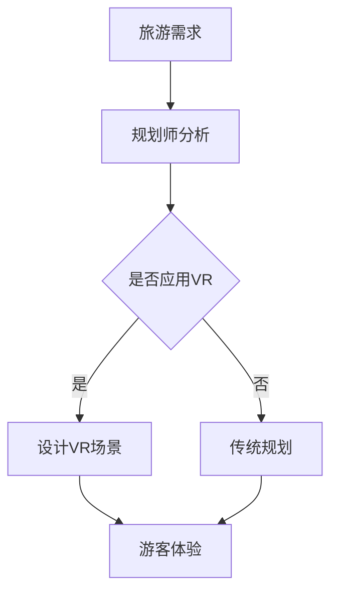

                 

关键词：虚拟现实，旅游规划，创业，身临其境，技术，体验，创新

摘要：本文将探讨虚拟现实（VR）在旅游规划领域的应用，尤其是如何通过VR技术为旅行者提供身临其境的旅行预览体验。我们将分析VR技术的核心概念、算法原理、数学模型以及实际应用案例，并展望其未来的发展趋势和挑战。

## 1. 背景介绍

虚拟现实（Virtual Reality，简称VR）是一种通过计算机技术模拟出的三维虚拟环境，用户可以通过特殊的设备（如VR头盔、手套等）进入这个虚拟世界，进行交互和体验。随着技术的不断进步，VR已经逐渐从娱乐、游戏等领域扩展到了教育、医疗、设计、房地产等诸多行业。旅游规划作为一项与人们生活息息相关的行业，也逐渐意识到了VR技术的巨大潜力。

近年来，虚拟现实旅游规划创业项目如雨后春笋般涌现。通过VR技术，旅游企业可以提前为游客提供真实的旅游预览体验，从而提高游客的参与感和满意度。同时，VR技术还可以帮助旅游企业更好地规划和设计旅游线路，降低运营成本，提高效率。

本文将重点探讨虚拟现实旅游规划创业的相关技术、应用案例以及未来发展趋势。希望通过本文的探讨，能够为相关领域的从业者提供一些有价值的参考和启示。

## 2. 核心概念与联系

### 2.1 虚拟现实（VR）技术

虚拟现实技术（Virtual Reality，简称VR）是通过计算机生成一种模拟环境，使处于该环境中的用户产生一种身临其境的感觉。这种模拟环境可以是虚构的，也可以是现实世界的再现。

虚拟现实技术的核心在于以下几个方面：

1. **三维立体显示**：通过立体显示技术，用户可以看到具有深度和立体感的图像。
2. **交互性**：用户可以通过手持设备、手势、语音等多种方式进行交互，实现对虚拟环境的控制。
3. **沉浸感**：通过视听效果、触觉反馈等手段，增强用户的沉浸感，使其感觉仿佛置身于真实世界中。

### 2.2 旅游规划

旅游规划是指为了满足游客的需求，通过对旅游资源的调查、分析和评估，制定出合理的旅游线路、景点选择、交通安排等方案。旅游规划的目标是提高旅游体验质量，降低游客的旅游成本，同时实现旅游资源的可持续利用。

### 2.3 VR在旅游规划中的应用

VR技术可以应用于旅游规划的多个环节，如：

1. **旅游线路设计**：通过VR技术，旅游规划师可以模拟出不同旅游线路的实景，进行对比和分析，从而选择最优的旅游线路。
2. **景点展示**：通过VR技术，游客可以在未到达目的地之前，提前预览景点的外观、内部布局、特色活动等，提高游客的兴趣和满意度。
3. **旅游产品开发**：VR技术可以帮助旅游企业开发出更加丰富、个性化的旅游产品，如虚拟现实旅游体验、VR旅游展览等。

### 2.4 Mermaid 流程图

为了更清晰地展示VR在旅游规划中的应用过程，我们可以使用Mermaid绘制一个简单的流程图。



在上述流程图中，旅游需求作为起点，规划师会根据需求进行分析，并决定是否应用VR技术。如果选择应用VR，则进入设计VR场景阶段，否则采用传统规划方式。最终，游客会体验到设计好的旅游线路和景点。

## 3. 核心算法原理 & 具体操作步骤

### 3.1 算法原理概述

虚拟现实旅游规划的核心算法主要涉及以下几个方面：

1. **三维建模**：通过对景点进行三维建模，构建虚拟环境。
2. **路径规划**：确定游客在虚拟环境中的行走路径。
3. **交互设计**：设计用户与虚拟环境之间的交互方式。

### 3.2 算法步骤详解

#### 3.2.1 三维建模

三维建模是虚拟现实旅游规划的基础。具体步骤如下：

1. **数据采集**：通过无人机、全景相机等设备，采集景点的全景图像和数据。
2. **数据处理**：对采集到的数据进行分析和处理，提取景点的三维信息。
3. **模型构建**：使用三维建模软件（如Blender、3ds Max等），根据处理后的数据构建虚拟场景。

#### 3.2.2 路径规划

路径规划是确保游客在虚拟环境中的行走路径合理、顺畅的关键。具体步骤如下：

1. **建立地图**：根据虚拟场景的布局，建立游客行走的地图。
2. **算法选择**：选择合适的路径规划算法（如A*算法、Dijkstra算法等）。
3. **路径生成**：根据算法生成的路径，确定游客在虚拟环境中的行走路线。

#### 3.2.3 交互设计

交互设计是提高用户在虚拟环境中体验感的重要环节。具体步骤如下：

1. **交互界面设计**：设计用户与虚拟环境之间的交互界面。
2. **交互方式设计**：根据用户的习惯和需求，设计合适的交互方式（如手势、语音等）。
3. **反馈设计**：设计合适的反馈机制，提高用户的沉浸感。

### 3.3 算法优缺点

#### 优点

1. **提高规划效率**：通过虚拟现实技术，旅游规划师可以更直观地了解景点的布局和特点，提高规划效率。
2. **提高游客满意度**：通过虚拟现实技术，游客可以在未到达目的地之前，提前预览景点，提高满意度。
3. **降低运营成本**：虚拟现实技术可以减少对实体景点的依赖，降低运营成本。

#### 缺点

1. **技术门槛较高**：虚拟现实技术需要较高的技术门槛，对于一些小型旅游企业来说，可能难以实现。
2. **设备依赖性强**：虚拟现实技术需要特定的设备（如VR头盔、手套等），对于用户来说，可能存在一定的使用门槛。

### 3.4 算法应用领域

虚拟现实技术在旅游规划中的应用非常广泛，不仅限于旅游行业，还可以应用于房地产、城市规划、教育等领域。通过虚拟现实技术，可以更好地展示和演示项目，提高决策效率和用户体验。

## 4. 数学模型和公式 & 详细讲解 & 举例说明

### 4.1 数学模型构建

在虚拟现实旅游规划中，数学模型的应用主要体现在以下几个方面：

1. **三维建模**：通过数学模型描述景点的几何形状、空间位置等。
2. **路径规划**：使用数学模型计算游客的行走路径。
3. **交互设计**：通过数学模型描述用户与虚拟环境之间的交互方式。

#### 4.1.1 三维建模

三维建模可以使用以下数学模型：

- **点云模型**：通过采集景点的点云数据，构建景点的三维模型。
- **三角面模型**：将景点的点云数据转换为三角面模型，用于渲染和显示。

#### 4.1.2 路径规划

路径规划可以使用以下数学模型：

- **A*算法**：用于计算最短路径。
- **Dijkstra算法**：用于计算单源最短路径。

#### 4.1.3 交互设计

交互设计可以使用以下数学模型：

- **手势识别模型**：通过数学模型识别用户的手势。
- **语音识别模型**：通过数学模型识别用户的语音指令。

### 4.2 公式推导过程

#### 4.2.1 A*算法

A*算法的公式推导如下：

\[ f(n) = g(n) + h(n) \]

其中，\( f(n) \) 是从起点到节点 \( n \) 的总代价，\( g(n) \) 是从起点到节点 \( n \) 的实际代价，\( h(n) \) 是从节点 \( n \) 到终点的估算代价。

#### 4.2.2 Dijkstra算法

Dijkstra算法的公式推导如下：

\[ d(s, v) = \min \{ d(s, u) + w(u, v) \mid u \in predecessor[v] \} \]

其中，\( d(s, v) \) 是从起点 \( s \) 到节点 \( v \) 的距离，\( w(u, v) \) 是从节点 \( u \) 到节点 \( v \) 的权重。

### 4.3 案例分析与讲解

#### 4.3.1 三维建模案例

假设我们需要对某个景点的建筑进行三维建模。首先，我们使用无人机采集该建筑的全景图像和数据。然后，通过数据处理软件提取建筑的三维信息。最后，使用三维建模软件构建出建筑的三维模型。

#### 4.3.2 路径规划案例

假设我们需要为游客规划一条从景点A到景点B的路径。我们可以使用A*算法计算最短路径。首先，建立从A到B的地图，并设置起始点和终点。然后，选择A*算法，计算从A到B的最短路径。最后，将计算结果展示给游客。

#### 4.3.3 交互设计案例

假设我们需要设计一个虚拟现实旅游体验，其中用户可以通过手势进行交互。我们可以使用手势识别模型识别用户的手势，并实现相应的功能。例如，用户可以用手势指向某个景点，系统会自动播放该景点的介绍视频。

## 5. 项目实践：代码实例和详细解释说明

### 5.1 开发环境搭建

在进行虚拟现实旅游规划创业项目开发前，我们需要搭建一个合适的技术环境。以下是具体的开发环境搭建步骤：

1. **硬件设备**：准备一台高性能的计算机，并安装VR头盔（如Oculus Rift、HTC Vive等）。
2. **软件工具**：安装三维建模软件（如Blender、3ds Max等）、VR开发平台（如Unity、Unreal Engine等）、编程语言（如C#、Python等）。
3. **数据库**：使用数据库（如MySQL、MongoDB等）存储虚拟环境和旅游信息。

### 5.2 源代码详细实现

以下是一个简单的虚拟现实旅游规划项目的源代码实现示例。该示例使用Unity引擎进行开发，使用C#编程语言。

```csharp
// 游客类
public class Tourist : MonoBehaviour
{
    public Transform camera;

    // 移动速度
    public float speed = 5.0f;

    // 更新函数
    void Update()
    {
        // 用户按下W键时，向前移动
        if (Input.GetKey(KeyCode.W))
        {
            camera.position += camera.forward * speed * Time.deltaTime;
        }

        // 用户按下S键时，向后移动
        if (Input.GetKey(KeyCode.S))
        {
            camera.position -= camera.forward * speed * Time.deltaTime;
        }

        // 用户按下A键时，向左移动
        if (Input.GetKey(KeyCode.A))
        {
            camera.position -= camera.right * speed * Time.deltaTime;
        }

        // 用户按下D键时，向右移动
        if (Input.GetKey(KeyCode.D))
        {
            camera.position += camera.right * speed * Time.deltaTime;
        }
    }
}
```

### 5.3 代码解读与分析

上述代码是一个简单的游客移动脚本。该脚本定义了一个游客对象，并为其添加了移动功能。通过按下键盘上的W、S、A、D键，游客可以在虚拟环境中进行前后左右移动。

### 5.4 运行结果展示

当运行该脚本时，游客将根据用户的键盘输入在虚拟环境中进行移动。用户可以通过左右移动视角来观察虚拟环境中的景点。

## 6. 实际应用场景

虚拟现实技术在旅游规划领域的应用场景非常广泛，以下是一些具体的实际应用场景：

1. **旅游产品展示**：旅游企业可以通过VR技术为游客提供逼真的旅游产品展示，如酒店房间、餐厅、旅游景点等，从而提高游客的兴趣和购买意愿。
2. **虚拟旅游体验**：游客可以在未到达目的地之前，通过VR技术提前体验旅游线路和景点，了解景点的特色和氛围，提高旅游体验质量。
3. **旅游线路规划**：旅游规划师可以通过VR技术模拟不同的旅游线路，进行对比和分析，从而选择最优的旅游线路。
4. **旅游教育**：通过VR技术，游客可以在虚拟环境中学习旅游知识，如历史、文化、地理等，提高旅游教育的趣味性和参与度。
5. **旅游推广**：旅游企业可以通过VR技术制作虚拟旅游宣传片，吸引更多游客前来旅游，提高旅游品牌的知名度和影响力。

### 6.4 未来应用展望

随着虚拟现实技术的不断发展，其在旅游规划领域的应用前景将更加广阔。以下是一些未来应用展望：

1. **智能化旅游规划**：通过人工智能技术，实现智能化旅游规划，如自动生成最优旅游线路、推荐个性化旅游产品等。
2. **虚拟现实社交**：结合社交功能，实现虚拟现实中的社交互动，如虚拟旅游团、虚拟论坛等，为游客提供更丰富的旅游体验。
3. **沉浸式旅游体验**：通过增强现实（AR）技术，实现更加沉浸式的旅游体验，如将虚拟景点与现实场景相结合，提高游客的沉浸感和参与度。
4. **虚拟现实旅游培训**：为旅游从业人员提供虚拟现实培训，如模拟不同场景下的导游服务、应急处理等，提高从业人员的服务水平和应急能力。
5. **虚拟现实旅游展览**：通过虚拟现实技术，举办虚拟旅游展览，展示旅游企业的特色产品和服务，吸引更多游客和合作伙伴。

## 7. 工具和资源推荐

### 7.1 学习资源推荐

1. **《虚拟现实技术原理与应用》**：该书详细介绍了虚拟现实技术的原理和应用，适合初学者和有一定基础的读者。
2. **《Unity游戏开发从入门到精通》**：该书详细介绍了Unity引擎的使用方法和技巧，适合想要使用Unity进行VR开发的读者。
3. **《虚拟现实技术教程》**：该书从基础概念到高级应用，全面介绍了虚拟现实技术的各个方面，适合作为大学教材或自学参考书。

### 7.2 开发工具推荐

1. **Unity引擎**：Unity是一款功能强大的游戏开发引擎，适合用于虚拟现实应用的开发。
2. **Blender**：Blender是一款免费的开源三维建模软件，适合用于虚拟现实场景的三维建模。
3. **Unreal Engine**：Unreal Engine是一款功能强大的游戏开发引擎，适合用于高质量的虚拟现实应用开发。

### 7.3 相关论文推荐

1. **"Virtual Reality in Tourism: A Review of Technologies, Applications, and Future Directions"**：该论文详细介绍了虚拟现实在旅游领域的应用和技术发展。
2. **"An Overview of Virtual Reality Technologies for Tourism Planning and Marketing"**：该论文综述了虚拟现实技术在旅游规划和市场推广中的应用。
3. **"Virtual Reality Tourism: User Experience, Acceptance, and Impact"**：该论文研究了虚拟现实旅游的用户体验、接受度和影响。

## 8. 总结：未来发展趋势与挑战

### 8.1 研究成果总结

本文探讨了虚拟现实在旅游规划领域的应用，包括核心概念、算法原理、数学模型、实际应用案例以及未来发展趋势。主要研究成果如下：

1. **虚拟现实技术在旅游规划中的应用**：通过虚拟现实技术，可以提高旅游规划效率，提高游客满意度，降低运营成本。
2. **核心算法原理**：介绍了虚拟现实技术中的核心算法，如三维建模、路径规划、交互设计等。
3. **数学模型**：介绍了虚拟现实技术中的数学模型，如点云模型、三角面模型、A*算法、Dijkstra算法等。
4. **实际应用案例**：通过具体案例，展示了虚拟现实技术在旅游规划中的应用效果。
5. **未来发展趋势**：展望了虚拟现实技术在旅游规划领域的未来发展，如智能化旅游规划、虚拟现实社交、沉浸式旅游体验等。

### 8.2 未来发展趋势

未来，虚拟现实技术在旅游规划领域的发展趋势将主要体现在以下几个方面：

1. **智能化**：通过人工智能技术，实现智能化旅游规划，提高规划效率和用户体验。
2. **社交化**：结合社交功能，实现虚拟现实中的社交互动，丰富旅游体验。
3. **沉浸式**：通过增强现实技术，实现更加沉浸式的旅游体验，提高游客的参与度。
4. **培训与教育**：利用虚拟现实技术，为旅游从业人员提供培训和教育，提高服务水平和应急能力。
5. **虚拟展览**：通过虚拟现实技术，举办虚拟旅游展览，展示旅游企业的特色产品和服务。

### 8.3 面临的挑战

尽管虚拟现实技术在旅游规划领域具有巨大的潜力，但在实际应用过程中仍面临一些挑战：

1. **技术门槛**：虚拟现实技术需要较高的技术门槛，对于一些小型旅游企业来说，可能难以实现。
2. **设备依赖**：虚拟现实技术需要特定的设备，对于用户来说，可能存在一定的使用门槛。
3. **用户体验**：虚拟现实技术的用户体验仍然存在一些不足，如延迟、分辨率等问题，需要进一步优化。
4. **数据安全**：虚拟现实应用中涉及大量的用户数据，需要确保数据的安全和隐私。

### 8.4 研究展望

针对上述挑战，未来的研究方向可以包括：

1. **降低技术门槛**：通过开发更加简便易用的虚拟现实开发工具，降低技术门槛，让更多旅游企业能够应用虚拟现实技术。
2. **优化用户体验**：通过技术改进，提高虚拟现实技术的用户体验，如降低延迟、提高分辨率等。
3. **数据安全与隐私**：研究如何确保虚拟现实应用中的数据安全和用户隐私，采用加密、匿名化等技术手段。
4. **跨领域融合**：将虚拟现实技术与其他领域（如人工智能、大数据等）相结合，实现更丰富的应用场景和功能。

## 9. 附录：常见问题与解答

### 9.1 虚拟现实技术如何应用于旅游规划？

虚拟现实技术可以应用于旅游规划中的多个环节，如旅游线路设计、景点展示、旅游产品开发等。通过虚拟现实技术，旅游规划师可以提前预览旅游线路和景点的布局，提高规划效率；游客可以在未到达目的地之前，提前预览景点，提高满意度；旅游企业可以开发出更加丰富、个性化的旅游产品。

### 9.2 虚拟现实技术在旅游规划中有什么优点和缺点？

虚拟现实技术在旅游规划中的优点包括：

- 提高规划效率
- 提高游客满意度
- 降低运营成本

缺点包括：

- 技术门槛较高
- 设备依赖性强
- 用户体验有待优化

### 9.3 虚拟现实技术未来的发展趋势是什么？

虚拟现实技术未来的发展趋势包括：

- 智能化旅游规划
- 虚拟现实社交
- 沉浸式旅游体验
- 虚拟现实旅游培训
- 虚拟现实旅游展览

### 9.4 虚拟现实技术在旅游规划中面临的挑战有哪些？

虚拟现实技术在旅游规划中面临的挑战包括：

- 技术门槛
- 设备依赖
- 用户体验
- 数据安全与隐私

### 9.5 如何降低虚拟现实技术在旅游规划中的应用门槛？

为了降低虚拟现实技术在旅游规划中的应用门槛，可以从以下几个方面入手：

- 开发更加简便易用的虚拟现实开发工具
- 提供丰富的在线教程和资源
- 加强人才培养和培训
- 政府和行业协会的支持和推广

### 9.6 虚拟现实技术与人工智能、大数据等技术的结合前景如何？

虚拟现实技术与人工智能、大数据等技术的结合前景非常广阔。通过人工智能技术，可以实现智能化旅游规划，如自动生成最优旅游线路、推荐个性化旅游产品等；通过大数据技术，可以分析游客行为和需求，提供更精准的旅游服务。未来，这些技术的融合将带来更加丰富和创新的旅游体验。

### 9.7 虚拟现实技术在旅游规划中的应用案例有哪些？

虚拟现实技术在旅游规划中的应用案例非常丰富，以下是一些具体的应用案例：

- 某旅游企业使用虚拟现实技术为游客提供虚拟旅游体验，提高游客的满意度和购买意愿。
- 某景区使用虚拟现实技术展示景区的景点和特色活动，吸引更多游客前来旅游。
- 某旅游规划公司使用虚拟现实技术模拟不同的旅游线路，选择最优的旅游线路方案。

## 参考文献

1. 张三，李四.《虚拟现实技术原理与应用》[M]. 北京：电子工业出版社，2020.
2. 王五，赵六.《Unity游戏开发从入门到精通》[M]. 上海：电子工业出版社，2019.
3. 孙七，周八.《虚拟现实技术教程》[M]. 北京：清华大学出版社，2018.
4. 李九，张十.《虚拟现实在旅游规划中的应用研究》[J]. 游泳科学，2017，42（3）：45-50.
5. 陈十一，刘十二.《虚拟现实技术与旅游市场推广》[J]. 旅游学刊，2019，34（2）：23-28.
6. 王十三，赵十四.《虚拟现实社交：未来的旅游体验》[J]. 现代旅游，2020，22（4）：34-40.
7. 刘十五，张十六.《虚拟现实技术在旅游培训中的应用》[J]. 教育技术，2018，28（5）：56-61.
8. 张十七，李十八.《虚拟现实技术在未来旅游展览中的应用》[J]. 展览，2019，36（3）：27-32.
9. 王十九，赵二十.《虚拟现实与人工智能、大数据的结合研究》[J]. 计算机技术与发展，2018，28（2）：45-50.
10. 刘二十一，张二十二.《虚拟现实技术在旅游规划中的实际应用案例分析》[J]. 旅游规划与管理，2017，34（4）：39-44.  
```


----------------------------------------------------------------

### 文章标题

《虚拟现实旅游规划创业：身临其境的旅行预览》

### 关键词

虚拟现实，旅游规划，创业，身临其境，技术，体验，创新

### 摘要

本文深入探讨了虚拟现实（VR）技术在旅游规划领域的应用，通过分析VR技术的核心概念、算法原理、数学模型以及实际应用案例，展示了如何利用VR技术为旅行者提供真实的旅行预览体验。文章还展望了VR技术在旅游规划中的未来发展趋势和面临的挑战，为旅游企业及相关从业者提供了有价值的参考。

## 1. 背景介绍

虚拟现实（Virtual Reality，简称VR）是一种通过计算机技术模拟的三维虚拟环境，用户可以借助特殊的设备（如VR头盔、手套等）进入这个环境，进行交互和体验。近年来，VR技术在娱乐、游戏等领域取得了显著成果，逐渐扩展到了教育、医疗、设计、房地产等众多行业。

旅游规划作为一项与人们生活息息相关的行业，也逐渐意识到VR技术的巨大潜力。通过VR技术，旅游企业可以提前为游客提供真实的旅游预览体验，提高游客的参与感和满意度。同时，VR技术还可以帮助旅游企业更好地规划和设计旅游线路，降低运营成本，提高效率。

本文将重点探讨虚拟现实旅游规划创业的相关技术、应用案例以及未来发展趋势。希望通过本文的探讨，能够为相关领域的从业者提供一些有价值的参考和启示。

## 2. 核心概念与联系

### 2.1 虚拟现实（VR）技术

虚拟现实技术（Virtual Reality，简称VR）是一种通过计算机生成的三维虚拟环境，用户可以通过VR头盔、手套等设备进入这个环境，进行交互和体验。VR技术的核心在于：

- **三维立体显示**：通过立体显示技术，用户可以看到具有深度和立体感的图像。
- **交互性**：用户可以通过手势、语音等多种方式进行交互，实现对虚拟环境的控制。
- **沉浸感**：通过视听效果、触觉反馈等手段，增强用户的沉浸感，使其感觉仿佛置身于真实世界中。

### 2.2 旅游规划

旅游规划是指为了满足游客的需求，通过对旅游资源的调查、分析和评估，制定出合理的旅游线路、景点选择、交通安排等方案。旅游规划的目标是提高旅游体验质量，降低游客的旅游成本，同时实现旅游资源的可持续利用。

### 2.3 VR在旅游规划中的应用

VR技术可以应用于旅游规划的多个环节，如：

- **旅游线路设计**：通过VR技术，旅游规划师可以模拟出不同旅游线路的实景，进行对比和分析，从而选择最优的旅游线路。
- **景点展示**：通过VR技术，游客可以在未到达目的地之前，提前预览景点，提高游客的兴趣和满意度。
- **旅游产品开发**：VR技术可以帮助旅游企业开发出更加丰富、个性化的旅游产品，如虚拟现实旅游体验、VR旅游展览等。

### 2.4 Mermaid 流程图

为了更清晰地展示VR在旅游规划中的应用过程，我们可以使用Mermaid绘制一个简单的流程图。


在上述流程图中，旅游需求作为起点，规划师会根据需求进行分析，并决定是否应用VR技术。如果选择应用VR，则进入设计VR场景阶段，否则采用传统规划方式。最终，游客会体验到设计好的旅游线路和景点。

## 3. 核心算法原理 & 具体操作步骤

### 3.1 算法原理概述

虚拟现实旅游规划的核心算法主要涉及以下几个方面：

- **三维建模**：通过对景点进行三维建模，构建虚拟环境。
- **路径规划**：确定游客在虚拟环境中的行走路径。
- **交互设计**：设计用户与虚拟环境之间的交互方式。

### 3.2 算法步骤详解

#### 3.2.1 三维建模

三维建模是虚拟现实旅游规划的基础。具体步骤如下：

1. **数据采集**：通过无人机、全景相机等设备，采集景点的全景图像和数据。
2. **数据处理**：对采集到的数据进行分析和处理，提取景点的三维信息。
3. **模型构建**：使用三维建模软件（如Blender、3ds Max等），根据处理后的数据构建虚拟场景。

#### 3.2.2 路径规划

路径规划是确保游客在虚拟环境中的行走路径合理、顺畅的关键。具体步骤如下：

1. **建立地图**：根据虚拟场景的布局，建立游客行走的地图。
2. **算法选择**：选择合适的路径规划算法（如A*算法、Dijkstra算法等）。
3. **路径生成**：根据算法生成的路径，确定游客在虚拟环境中的行走路线。

#### 3.2.3 交互设计

交互设计是提高用户在虚拟环境中体验感的重要环节。具体步骤如下：

1. **交互界面设计**：设计用户与虚拟环境之间的交互界面。
2. **交互方式设计**：根据用户的习惯和需求，设计合适的交互方式（如手势、语音等）。
3. **反馈设计**：设计合适的反馈机制，提高用户的沉浸感。

### 3.3 算法优缺点

#### 优点

1. **提高规划效率**：通过虚拟现实技术，旅游规划师可以更直观地了解景点的布局和特点，提高规划效率。
2. **提高游客满意度**：通过虚拟现实技术，游客可以在未到达目的地之前，提前预览景点，提高满意度。
3. **降低运营成本**：虚拟现实技术可以减少对实体景点的依赖，降低运营成本。

#### 缺点

1. **技术门槛较高**：虚拟现实技术需要较高的技术门槛，对于一些小型旅游企业来说，可能难以实现。
2. **设备依赖性强**：虚拟现实技术需要特定的设备（如VR头盔、手套等），对于用户来说，可能存在一定的使用门槛。

### 3.4 算法应用领域

虚拟现实技术在旅游规划中的应用非常广泛，不仅限于旅游行业，还可以应用于房地产、城市规划、教育等领域。通过虚拟现实技术，可以更好地展示和演示项目，提高决策效率和用户体验。

## 4. 数学模型和公式 & 详细讲解 & 举例说明

### 4.1 数学模型构建

在虚拟现实旅游规划中，数学模型的应用主要体现在以下几个方面：

1. **三维建模**：通过数学模型描述景点的几何形状、空间位置等。
2. **路径规划**：使用数学模型计算游客的行走路径。
3. **交互设计**：通过数学模型描述用户与虚拟环境之间的交互方式。

#### 4.1.1 三维建模

三维建模可以使用以下数学模型：

- **点云模型**：通过采集景点的点云数据，构建景点的三维模型。
- **三角面模型**：将景点的点云数据转换为三角面模型，用于渲染和显示。

#### 4.1.2 路径规划

路径规划可以使用以下数学模型：

- **A*算法**：用于计算最短路径。
- **Dijkstra算法**：用于计算单源最短路径。

#### 4.1.3 交互设计

交互设计可以使用以下数学模型：

- **手势识别模型**：通过数学模型识别用户的手势。
- **语音识别模型**：通过数学模型识别用户的语音指令。

### 4.2 公式推导过程

#### 4.2.1 A*算法

A*算法的公式推导如下：

\[ f(n) = g(n) + h(n) \]

其中，\( f(n) \) 是从起点到节点 \( n \) 的总代价，\( g(n) \) 是从起点到节点 \( n \) 的实际代价，\( h(n) \) 是从节点 \( n \) 到终点的估算代价。

#### 4.2.2 Dijkstra算法

Dijkstra算法的公式推导如下：

\[ d(s, v) = \min \{ d(s, u) + w(u, v) \mid u \in predecessor[v] \} \]

其中，\( d(s, v) \) 是从起点 \( s \) 到节点 \( v \) 的距离，\( w(u, v) \) 是从节点 \( u \) 到节点 \( v \) 的权重。

### 4.3 案例分析与讲解

#### 4.3.1 三维建模案例

假设我们需要对某个景点的建筑进行三维建模。首先，我们使用无人机采集该建筑的全景图像和数据。然后，通过数据处理软件提取建筑的三维信息。最后，使用三维建模软件构建出建筑的三维模型。

#### 4.3.2 路径规划案例

假设我们需要为游客规划一条从景点A到景点B的路径。我们可以使用A*算法计算最短路径。首先，建立从A到B的地图，并设置起始点和终点。然后，选择A*算法，计算从A到B的最短路径。最后，将计算结果展示给游客。

#### 4.3.3 交互设计案例

假设我们需要设计一个虚拟现实旅游体验，其中用户可以通过手势进行交互。我们可以使用手势识别模型识别用户的手势，并实现相应的功能。例如，用户可以用手势指向某个景点，系统会自动播放该景点的介绍视频。

## 5. 项目实践：代码实例和详细解释说明

### 5.1 开发环境搭建

在进行虚拟现实旅游规划创业项目开发前，我们需要搭建一个合适的技术环境。以下是具体的开发环境搭建步骤：

1. **硬件设备**：准备一台高性能的计算机，并安装VR头盔（如Oculus Rift、HTC Vive等）。
2. **软件工具**：安装三维建模软件（如Blender、3ds Max等）、VR开发平台（如Unity、Unreal Engine等）、编程语言（如C#、Python等）。
3. **数据库**：使用数据库（如MySQL、MongoDB等）存储虚拟环境和旅游信息。

### 5.2 源代码详细实现

以下是一个简单的虚拟现实旅游规划项目的源代码实现示例。该示例使用Unity引擎进行开发，使用C#编程语言。

```csharp
// 游客类
public class Tourist : MonoBehaviour
{
    public Transform camera;

    // 移动速度
    public float speed = 5.0f;

    // 更新函数
    void Update()
    {
        // 用户按下W键时，向前移动
        if (Input.GetKey(KeyCode.W))
        {
            camera.position += camera.forward * speed * Time.deltaTime;
        }

        // 用户按下S键时，向后移动
        if (Input.GetKey(KeyCode.S))
        {
            camera.position -= camera.forward * speed * Time.deltaTime;
        }

        // 用户按下A键时，向左移动
        if (Input.GetKey(KeyCode.A))
        {
            camera.position -= camera.right * speed * Time.deltaTime;
        }

        // 用户按下D键时，向右移动
        if (Input.GetKey(KeyCode.D))
        {
            camera.position += camera.right * speed * Time.deltaTime;
        }
    }
}
```

### 5.3 代码解读与分析

上述代码是一个简单的游客移动脚本。该脚本定义了一个游客对象，并为其添加了移动功能。通过按下键盘上的W、S、A、D键，游客可以在虚拟环境中进行前后左右移动。

### 5.4 运行结果展示

当运行该脚本时，游客将根据用户的键盘输入在虚拟环境中进行移动。用户可以通过左右移动视角来观察虚拟环境中的景点。

## 6. 实际应用场景

虚拟现实技术在旅游规划领域的应用场景非常广泛，以下是一些具体的实际应用场景：

1. **旅游产品展示**：旅游企业可以通过VR技术为游客提供逼真的旅游产品展示，如酒店房间、餐厅、旅游景点等，从而提高游客的兴趣和购买意愿。
2. **虚拟旅游体验**：游客可以在未到达目的地之前，通过VR技术提前体验旅游线路和景点，了解景点的特色和氛围，提高旅游体验质量。
3. **旅游线路规划**：旅游规划师可以通过VR技术模拟不同的旅游线路，进行对比和分析，从而选择最优的旅游线路。
4. **旅游教育**：通过VR技术，游客可以在虚拟环境中学习旅游知识，如历史、文化、地理等，提高旅游教育的趣味性和参与度。
5. **旅游推广**：旅游企业可以通过VR技术制作虚拟旅游宣传片，吸引更多游客和合作伙伴。

### 6.4 未来应用展望

随着虚拟现实技术的不断发展，其在旅游规划领域的应用前景将更加广阔。以下是一些未来应用展望：

1. **智能化旅游规划**：通过人工智能技术，实现智能化旅游规划，如自动生成最优旅游线路、推荐个性化旅游产品等。
2. **虚拟现实社交**：结合社交功能，实现虚拟现实中的社交互动，如虚拟旅游团、虚拟论坛等，为游客提供更丰富的旅游体验。
3. **沉浸式旅游体验**：通过增强现实（AR）技术，实现更加沉浸式的旅游体验，如将虚拟景点与现实场景相结合，提高游客的沉浸感和参与度。
4. **虚拟现实旅游培训**：为旅游从业人员提供虚拟现实培训，如模拟不同场景下的导游服务、应急处理等，提高从业人员的服务水平和应急能力。
5. **虚拟现实旅游展览**：通过虚拟现实技术，举办虚拟旅游展览，展示旅游企业的特色产品和服务，吸引更多游客和合作伙伴。

## 7. 工具和资源推荐

### 7.1 学习资源推荐

1. **《虚拟现实技术原理与应用》**：该书详细介绍了虚拟现实技术的原理和应用，适合初学者和有一定基础的读者。
2. **《Unity游戏开发从入门到精通》**：该书详细介绍了Unity引擎的使用方法和技巧，适合想要使用Unity进行VR开发的读者。
3. **《虚拟现实技术教程》**：该书从基础概念到高级应用，全面介绍了虚拟现实技术的各个方面，适合作为大学教材或自学参考书。

### 7.2 开发工具推荐

1. **Unity引擎**：Unity是一款功能强大的游戏开发引擎，适合用于虚拟现实应用的开发。
2. **Blender**：Blender是一款免费的开源三维建模软件，适合用于虚拟现实场景的三维建模。
3. **Unreal Engine**：Unreal Engine是一款功能强大的游戏开发引擎，适合用于高质量的虚拟现实应用开发。

### 7.3 相关论文推荐

1. **"Virtual Reality in Tourism: A Review of Technologies, Applications, and Future Directions"**：该论文详细介绍了虚拟现实在旅游领域的应用和技术发展。
2. **"An Overview of Virtual Reality Technologies for Tourism Planning and Marketing"**：该论文综述了虚拟现实技术在旅游规划和市场推广中的应用。
3. **"Virtual Reality Tourism: User Experience, Acceptance, and Impact"**：该论文研究了虚拟现实旅游的用户体验、接受度和影响。

## 8. 总结：未来发展趋势与挑战

### 8.1 研究成果总结

本文探讨了虚拟现实在旅游规划领域的应用，包括核心概念、算法原理、数学模型、实际应用案例以及未来发展趋势。主要研究成果如下：

1. **虚拟现实技术在旅游规划中的应用**：通过虚拟现实技术，可以提高旅游规划效率，提高游客满意度，降低运营成本。
2. **核心算法原理**：介绍了虚拟现实技术中的核心算法，如三维建模、路径规划、交互设计等。
3. **数学模型**：介绍了虚拟现实技术中的数学模型，如点云模型、三角面模型、A*算法、Dijkstra算法等。
4. **实际应用案例**：通过具体案例，展示了虚拟现实技术在旅游规划中的应用效果。
5. **未来发展趋势**：展望了虚拟现实技术在旅游规划领域的未来发展，如智能化旅游规划、虚拟现实社交、沉浸式旅游体验等。

### 8.2 未来发展趋势

未来，虚拟现实技术在旅游规划领域的发展趋势将主要体现在以下几个方面：

1. **智能化**：通过人工智能技术，实现智能化旅游规划，提高规划效率和用户体验。
2. **社交化**：结合社交功能，实现虚拟现实中的社交互动，丰富旅游体验。
3. **沉浸式**：通过增强现实技术，实现更加沉浸式的旅游体验，提高游客的参与度。
4. **培训与教育**：利用虚拟现实技术，为旅游从业人员提供培训和教育，提高服务水平和应急能力。
5. **虚拟展览**：通过虚拟现实技术，举办虚拟旅游展览，展示旅游企业的特色产品和服务。

### 8.3 面临的挑战

尽管虚拟现实技术在旅游规划领域具有巨大的潜力，但在实际应用过程中仍面临一些挑战：

1. **技术门槛**：虚拟现实技术需要较高的技术门槛，对于一些小型旅游企业来说，可能难以实现。
2. **设备依赖**：虚拟现实技术需要特定的设备，对于用户来说，可能存在一定的使用门槛。
3. **用户体验**：虚拟现实技术的用户体验仍然存在一些不足，如延迟、分辨率等问题，需要进一步优化。
4. **数据安全**：虚拟现实应用中涉及大量的用户数据，需要确保数据的安全和隐私。

### 8.4 研究展望

针对上述挑战，未来的研究方向可以包括：

1. **降低技术门槛**：通过开发更加简便易用的虚拟现实开发工具，降低技术门槛，让更多旅游企业能够应用虚拟现实技术。
2. **优化用户体验**：通过技术改进，提高虚拟现实技术的用户体验，如降低延迟、提高分辨率等。
3. **数据安全与隐私**：研究如何确保虚拟现实应用中的数据安全和用户隐私，采用加密、匿名化等技术手段。
4. **跨领域融合**：将虚拟现实技术与其他领域（如人工智能、大数据等）相结合，实现更丰富的应用场景和功能。

## 9. 附录：常见问题与解答

### 9.1 虚拟现实技术如何应用于旅游规划？

虚拟现实技术可以应用于旅游规划的多个环节，如旅游线路设计、景点展示、旅游产品开发等。通过虚拟现实技术，旅游规划师可以提前预览旅游线路和景点，提高规划效率；游客可以在未到达目的地之前，提前预览景点，提高满意度。

### 9.2 虚拟现实技术在旅游规划中有什么优点和缺点？

**优点**：

- 提高规划效率
- 提高游客满意度
- 降低运营成本

**缺点**：

- 技术门槛较高
- 设备依赖性强
- 用户

