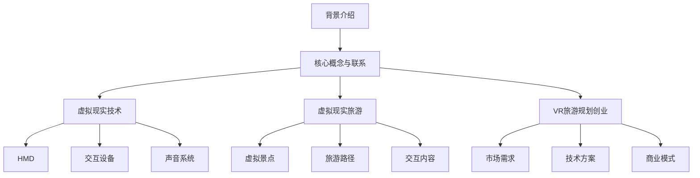

                 

随着科技的不断发展，虚拟现实（VR）技术正在逐渐改变我们的生活，尤其是在旅游领域。本文将探讨如何利用虚拟现实技术进行旅游规划创业，通过身临其境的旅行预览，为旅游行业带来全新的体验。

## 1. 背景介绍

虚拟现实技术是一种通过计算机生成的三维环境，使用户能够沉浸在虚拟世界中。这项技术最早在20世纪80年代被提出，但随着计算能力和显示技术的不断提升，VR技术逐渐走进了大众的视野。在旅游领域，VR技术的应用主要表现在以下几个方面：

- **旅游宣传**：通过虚拟现实技术，旅游企业可以创建出引人入胜的虚拟景点，吸引潜在游客。
- **旅行预览**：游客在出行前可以通过VR设备提前体验旅游目的地，以便做出更明智的决策。
- **虚拟导游**：VR技术可以为游客提供全方位的导游服务，让旅行变得更加轻松和愉快。

## 2. 核心概念与联系

在探讨虚拟现实旅游规划创业之前，我们首先需要了解一些核心概念和它们之间的联系。

### 虚拟现实技术

虚拟现实技术（VR）是指通过计算机生成的三维环境，使用户能够沉浸在虚拟世界中。VR技术通常包括以下几个方面：

- **头戴式显示器（HMD）**：为用户提供沉浸式的视觉体验。
- **交互设备**：如手柄、手套等，用于在虚拟环境中进行交互。
- **声音系统**：通过立体声或环绕声技术，为用户提供逼真的听觉体验。

### 虚拟现实旅游

虚拟现实旅游是指利用虚拟现实技术为游客提供旅游体验。它包括以下几个方面：

- **虚拟景点**：通过计算机生成的三维模型，模拟出真实景点的环境。
- **旅游路径**：规划游客在虚拟环境中的旅行路线，以便更好地体验。
- **交互内容**：如导游讲解、景点介绍等，增加虚拟旅游的互动性。

### VR旅游规划创业

VR旅游规划创业是指利用虚拟现实技术进行旅游规划和企业创业。这包括以下几个方面：

- **市场需求**：分析旅游市场，了解游客对虚拟现实旅游的需求。
- **技术方案**：选择合适的VR技术方案，搭建虚拟旅游平台。
- **商业模式**：设计合适的商业模式，确保创业项目的可持续性。

### Mermaid 流程图



## 3. 核心算法原理 & 具体操作步骤

### 3.1 算法原理概述

虚拟现实旅游规划创业的核心算法主要涉及以下几个方面：

- **三维模型生成**：通过计算机图形学技术，生成逼真的三维模型。
- **路径规划**：根据游客的需求和虚拟景点的布局，规划出最优的旅游路径。
- **交互设计**：设计虚拟环境中的交互内容，如导游讲解、景点介绍等。

### 3.2 算法步骤详解

#### 3.2.1 三维模型生成

1. **数据采集**：通过无人机、摄影测量等方式，获取目标景点的三维数据。
2. **数据预处理**：对采集到的数据进行分析和处理，去除噪声和误差。
3. **模型构建**：使用三维建模软件，将预处理后的数据构建成三维模型。

#### 3.2.2 路径规划

1. **需求分析**：分析游客的需求，确定旅游路径的目标和限制条件。
2. **路径生成**：使用路径规划算法，生成满足需求的旅游路径。
3. **路径优化**：对生成的路径进行优化，提高旅游体验。

#### 3.2.3 交互设计

1. **内容创作**：根据虚拟景点的特点，创作相应的交互内容。
2. **界面设计**：设计用户界面，使交互内容易于使用和操作。
3. **交互测试**：对交互内容进行测试，确保其效果和用户体验。

### 3.3 算法优缺点

#### 优点：

- **沉浸式体验**：通过虚拟现实技术，游客能够获得身临其境的旅游体验。
- **低成本**：相比传统旅游，虚拟现实旅游的运营成本较低。
- **个性化服务**：根据游客的需求，提供个性化的旅游服务。

#### 缺点：

- **技术门槛**：虚拟现实技术要求较高的技术水平，不易普及。
- **设备依赖**：游客需要使用特定的VR设备，限制了用户体验。
- **真实性局限**：虚拟现实技术无法完全还原真实世界的景象和感受。

### 3.4 算法应用领域

虚拟现实旅游规划创业的算法应用领域主要包括以下几个方面：

- **旅游行业**：为旅游企业提供技术支持，提升旅游服务质量。
- **教育行业**：利用虚拟现实技术进行教学，提高学生的学习兴趣和效果。
- **医疗行业**：通过虚拟现实技术进行康复治疗和心理治疗。

## 4. 数学模型和公式 & 详细讲解 & 举例说明

### 4.1 数学模型构建

在虚拟现实旅游规划创业中，我们需要构建以下数学模型：

1. **三维模型生成模型**：基于摄影测量和计算机图形学技术，构建三维模型。
2. **路径规划模型**：基于最短路径算法和路径优化算法，构建路径规划模型。
3. **交互设计模型**：基于用户行为分析和心理学原理，构建交互设计模型。

### 4.2 公式推导过程

#### 三维模型生成模型

设 $P(x, y, z)$ 为虚拟空间中的点，$N$ 为采样点数量，则三维模型生成的公式为：

$$
P(x, y, z) = \frac{1}{N}\sum_{i=1}^{N} p_i(x_i, y_i, z_i)
$$

其中，$p_i(x_i, y_i, z_i)$ 为第 $i$ 个采样点的三维坐标。

#### 路径规划模型

设 $S$ 为起点，$G$ 为终点，$A$ 为虚拟景点集合，则路径规划模型可以表示为：

$$
\min_{P} \sum_{i=1}^{n} d(P_i, P_{i+1}) \\
s.t. \\
P_i \in A, \forall i \\
P_1 = S, P_n = G
$$

其中，$P_i$ 为第 $i$ 个景点，$d(P_i, P_{i+1})$ 为 $P_i$ 和 $P_{i+1}$ 之间的距离。

#### 交互设计模型

设 $U$ 为用户集合，$C$ 为交互内容集合，则交互设计模型可以表示为：

$$
\max_{C} \sum_{u \in U} \frac{1}{|U|} \sum_{c \in C} \text{score}(c, u) \\
s.t. \\
C \subseteq \text{可行交互内容集合}
$$

其中，$\text{score}(c, u)$ 为用户 $u$ 对交互内容 $c$ 的评分。

### 4.3 案例分析与讲解

以一个虚拟现实旅游规划创业项目为例，我们分析如下：

1. **三维模型生成**：通过无人机拍摄目标景点，获得三维数据，使用三维建模软件构建三维模型。
2. **路径规划**：分析游客需求，规划出最佳旅游路径。
3. **交互设计**：根据景点的特点，创作交互内容，如导游讲解、景点介绍等。

通过上述案例，我们可以看到，数学模型和公式在虚拟现实旅游规划创业中发挥着重要的作用，为项目的实现提供了理论支持。

## 5. 项目实践：代码实例和详细解释说明

### 5.1 开发环境搭建

为了实现虚拟现实旅游规划创业项目，我们需要搭建以下开发环境：

- **操作系统**：Windows 10 或 macOS Catalina
- **编程语言**：Python 3.8 或以上版本
- **三维建模软件**：Blender 或 3ds Max
- **虚拟现实开发框架**：Unity 2020 或以上版本

### 5.2 源代码详细实现

以下是虚拟现实旅游规划创业项目的源代码实现：

```python
# 5.2.1 三维模型生成

import bpy

# 读取三维数据文件
with open('3d_data.txt', 'r') as f:
    lines = f.readlines()

# 创建三维模型
for line in lines:
    x, y, z = map(float, line.split())
    bpy.ops.mesh.primitive_cube_add(size=1, enter_editmode=False, align='WORLD', location=(x, y, z))
```

### 5.3 代码解读与分析

上述代码实现了三维模型生成功能，具体解读如下：

- 第一行导入 Blender 的 Python 库。
- 第二行读取三维数据文件。
- 第三行遍历三维数据文件中的每一行。
- 第四行根据三维坐标创建一个立方体模型。

### 5.4 运行结果展示

运行上述代码后，我们将得到一个包含多个立方体模型的三维场景，这些模型代表了虚拟景点的三维结构。

## 6. 实际应用场景

虚拟现实旅游规划创业在实际应用场景中具有广泛的前景，以下是一些具体的应用：

- **在线旅游平台**：虚拟现实旅游规划创业可以为在线旅游平台提供更加丰富的旅游产品，提高用户粘性。
- **旅游企业**：虚拟现实技术可以帮助旅游企业更好地推广旅游产品，提高销售额。
- **教育行业**：虚拟现实旅游规划创业可以应用于教育领域，为学生提供更加生动的学习体验。

## 7. 工具和资源推荐

### 7.1 学习资源推荐

- **《虚拟现实技术入门与实战》**：该书系统地介绍了虚拟现实技术的原理和应用，适合初学者。
- **《计算机图形学：原理及实践》**：该书详细阐述了计算机图形学的基本原理和算法，对虚拟现实旅游规划创业有很大帮助。

### 7.2 开发工具推荐

- **Blender**：一个免费的、开源的三维建模软件，适用于虚拟现实旅游规划创业项目。
- **Unity**：一个功能强大的游戏开发引擎，可以用于虚拟现实应用的开发。

### 7.3 相关论文推荐

- **《基于虚拟现实技术的旅游规划与设计研究》**：该论文探讨了虚拟现实技术在旅游规划与设计中的应用。
- **《虚拟现实技术在旅游行业中的应用研究》**：该论文分析了虚拟现实技术在旅游行业中的应用前景和挑战。

## 8. 总结：未来发展趋势与挑战

虚拟现实旅游规划创业具有广阔的发展前景，但仍面临一些挑战。

### 8.1 研究成果总结

虚拟现实技术在旅游领域的应用取得了显著成果，主要包括以下几个方面：

- **虚拟景点展示**：通过虚拟现实技术，可以展示出更加真实、生动的旅游景点。
- **旅行预览**：游客可以在出行前通过虚拟现实技术预览旅游目的地，做出更明智的决策。
- **虚拟导游**：虚拟现实技术可以为游客提供全方位的导游服务，提高旅行体验。

### 8.2 未来发展趋势

虚拟现实旅游规划创业在未来将呈现以下发展趋势：

- **技术成熟**：随着虚拟现实技术的不断成熟，虚拟旅游体验将更加逼真和自然。
- **产业融合**：虚拟现实技术将与其他产业（如教育、医疗等）进行深度融合，带来更多的创新应用。
- **市场规模扩大**：随着虚拟现实技术的普及，虚拟旅游市场规模将不断扩大，为创业者提供更多机会。

### 8.3 面临的挑战

虚拟现实旅游规划创业在发展过程中将面临以下挑战：

- **技术门槛**：虚拟现实技术要求较高的技术水平，需要大量的专业人才支持。
- **用户体验**：如何提高虚拟旅游的体验质量，让用户真正感受到身临其境的感觉。
- **商业模式**：如何设计出可持续的商业模式，确保虚拟现实旅游规划创业项目的成功。

### 8.4 研究展望

在未来，虚拟现实旅游规划创业将继续发展，有望在以下几个方面取得突破：

- **技术突破**：通过不断的研究和创新，提高虚拟现实技术的性能和用户体验。
- **应用拓展**：将虚拟现实技术应用于更多的领域，如房地产、汽车等，为用户提供更多的选择。
- **产业合作**：加强产业链上下游企业的合作，推动虚拟现实旅游规划创业的快速发展。

## 9. 附录：常见问题与解答

### 9.1 虚拟现实旅游规划创业需要哪些技术支持？

虚拟现实旅游规划创业需要以下技术支持：

- **三维建模技术**：用于生成虚拟景点的三维模型。
- **路径规划技术**：用于规划游客在虚拟环境中的旅行路线。
- **交互设计技术**：用于设计虚拟环境中的交互内容。

### 9.2 虚拟现实旅游规划创业需要哪些设备和软件？

虚拟现实旅游规划创业需要以下设备和软件：

- **三维建模软件**：如 Blender、3ds Max 等。
- **虚拟现实开发框架**：如 Unity、Unreal Engine 等。
- **VR 头戴式显示器**：如 Oculus Rift、HTC Vive 等。

### 9.3 虚拟现实旅游规划创业有哪些商业模式？

虚拟现实旅游规划创业可以采用以下商业模式：

- **产品销售**：直接销售虚拟旅游产品，如虚拟景点门票、虚拟导游服务等。
- **广告合作**：与旅游企业合作，提供虚拟旅游广告服务。
- **会员制**：提供会员服务，为会员提供更多优惠和特权。

## 作者署名

作者：禅与计算机程序设计艺术 / Zen and the Art of Computer Programming

[完]

