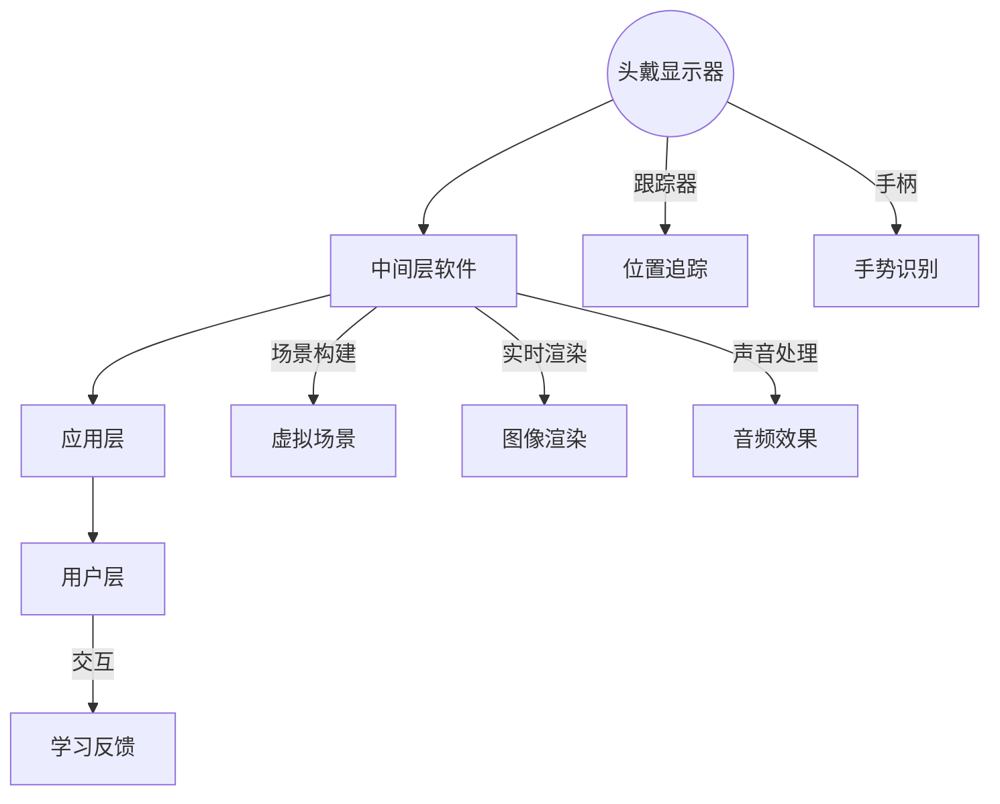

                 

关键词：虚拟现实，职业培训，沉浸式学习，技能提升，创业

> 摘要：本文将探讨虚拟现实（VR）在职业培训领域中的应用，特别是如何通过沉浸式技能学习促进个体技能提升。我们将分析VR技术的核心概念与架构，详细解读核心算法原理及操作步骤，构建数学模型，并通过实际项目实例展示VR在职业培训中的具体应用。同时，文章还将展望VR技术在未来职业培训领域的应用前景，并推荐相关的学习资源和开发工具。

## 1. 背景介绍

随着科技的不断进步，虚拟现实（VR）技术已经从传统的娱乐行业逐步渗透到各个领域，特别是在教育和职业培训领域。VR技术的兴起，不仅改变了人们的学习方式，还为职业培训提供了全新的解决方案。通过VR，学员可以在一个完全虚拟的环境中，亲身体验和实践各种职业技能，从而大大提升学习效率和实际操作能力。

职业培训一直以来都是企业发展的关键环节，然而传统培训方式存在诸多局限性。首先，传统培训往往依赖于课堂讲授和案例分析，学员的参与度和实际操作机会有限。其次，由于资源的限制，企业难以提供充分的实践机会，导致学员在实际工作中难以迅速上手。而VR技术的引入，恰好可以弥补这些不足，为职业培训带来革命性的变革。

本文旨在探讨如何利用VR技术开展职业培训，特别是通过沉浸式技能学习提升学员的实践能力。我们将首先介绍VR技术的核心概念和架构，然后深入分析核心算法原理及操作步骤，最后通过实际项目实例和数学模型展示VR在职业培训中的具体应用。

## 2. 核心概念与联系

### 2.1. 虚拟现实（VR）的概念

虚拟现实是一种通过计算机技术创建的模拟环境，用户可以在其中进行交互和体验。VR技术主要包括三个核心组成部分：硬件设备、软件系统和交互技术。

- **硬件设备**：常见的VR硬件设备包括头戴式显示器（HMD）、跟踪器、手柄等。这些设备为用户提供了一个沉浸式的视觉和听觉体验。
- **软件系统**：VR软件系统包括场景构建、实时渲染、声音处理等。这些软件模块共同协作，为用户提供一个逼真的虚拟环境。
- **交互技术**：VR交互技术包括手势识别、语音控制、位置追踪等。通过这些技术，用户可以与虚拟环境进行自然交互。

### 2.2. VR在职业培训中的应用架构

VR在职业培训中的应用架构可以分为四个主要层次：

1. **底层硬件**：包括VR头戴设备、跟踪器、手柄等硬件设备。
2. **中间层软件**：包括VR内容开发平台、场景构建工具、实时渲染引擎等软件系统。
3. **应用层**：包括具体的职业培训课程，如机械维修、医疗手术模拟、消防演练等。
4. **用户层**：即学员，他们通过VR设备和应用进行沉浸式学习。

### 2.3. Mermaid流程图



## 3. 核心算法原理 & 具体操作步骤

### 3.1. 算法原理概述

VR技术中的核心算法主要涉及场景构建、实时渲染、物理模拟和交互控制等。

- **场景构建**：通过计算机图形学技术，将现实场景虚拟化，创建一个三维模型。
- **实时渲染**：利用图形处理单元（GPU）的高性能计算能力，实时生成三维模型和光影效果。
- **物理模拟**：通过物理引擎模拟物体在虚拟环境中的运动和交互。
- **交互控制**：利用机器学习和计算机视觉技术，实现用户与虚拟环境的自然交互。

### 3.2. 算法步骤详解

1. **场景构建**：
   - **三维建模**：使用三维建模软件创建虚拟场景中的建筑物、设备、人物等模型。
   - **纹理映射**：将现实世界的纹理映射到三维模型上，增强场景的真实感。
   - **光照计算**：根据虚拟场景中的光源位置和强度，计算光照效果。

2. **实时渲染**：
   - **几何渲染**：将三维模型转换为二维图像。
   - **光影效果**：根据光照计算，为模型添加阴影、反射和折射等效果。
   - **抗锯齿处理**：消除图像边缘的锯齿，提升图像质量。

3. **物理模拟**：
   - **碰撞检测**：检测物体之间的碰撞，计算碰撞响应。
   - **动力学模拟**：根据物体的质量和摩擦系数，模拟物体在虚拟环境中的运动。

4. **交互控制**：
   - **手势识别**：通过摄像头和深度传感器捕捉用户手势，实现手势控制。
   - **语音控制**：通过语音识别技术，实现语音命令控制。

### 3.3. 算法优缺点

- **优点**：
  - 提高学习效率：学员可以在虚拟环境中反复练习，提高技能掌握速度。
  - 降低成本：虚拟环境无需物理设备和场地，降低培训成本。
  - 增强互动性：学员可以与其他学员或教练进行实时互动，提高学习体验。

- **缺点**：
  - 技术门槛：开发VR培训内容需要较高的技术能力和开发资源。
  - 虚拟现实体验的不稳定性：网络延迟、设备性能等因素可能影响用户体验。

### 3.4. 算法应用领域

VR技术在职业培训中的应用非常广泛，主要包括以下领域：

- **医疗培训**：模拟手术过程，提高医生的操作技能和应对能力。
- **工业培训**：模拟工业设备操作，提高工人的操作熟练度。
- **军事训练**：模拟战斗场景，提高士兵的战术和战斗技能。
- **教育**：通过虚拟实验和场景模拟，提高学生的实践能力和理解深度。

## 4. 数学模型和公式 & 详细讲解 & 举例说明

### 4.1. 数学模型构建

在VR职业培训中，数学模型主要用于模拟现实场景中的物理现象和交互过程。以下是一个简单的数学模型示例：

- **三维空间坐标计算**：
  $$ x = x_0 + v_x \cdot t $$
  $$ y = y_0 + v_y \cdot t $$
  $$ z = z_0 + v_z \cdot t $$

  其中，$x_0, y_0, z_0$ 为初始位置，$v_x, v_y, v_z$ 为速度分量，$t$ 为时间。

- **光照模型**：
  $$ I = I_d \cdot cos(\theta) + I_a \cdot (1 - cos(\theta)) $$

  其中，$I$ 为光照强度，$I_d$ 为直接光照强度，$I_a$ 为间接光照强度，$\theta$ 为光线与法线的夹角。

### 4.2. 公式推导过程

- **三维空间坐标计算**：
  三维空间中的物体位置可以通过三个坐标轴（x, y, z）来表示。物体的位置随时间的变化可以通过速度分量来计算。速度分量是初始速度和加速度的函数，而加速度可以通过牛顿第二定律计算。

- **光照模型**：
  光照模型描述了光线如何影响物体表面的亮度。直接光照由光线直接照射到物体表面产生，而间接光照是由物体表面反射和散射的光线产生的。光线与法线的夹角决定了光照强度。

### 4.3. 案例分析与讲解

#### 案例一：三维空间坐标计算

假设一个物体在三维空间中从点$(0, 0, 0)$出发，以速度$(2, 3, 1)$移动，求物体在$t=2$时刻的位置。

- **计算过程**：
  $$ x = 0 + 2 \cdot 2 = 4 $$
  $$ y = 0 + 3 \cdot 2 = 6 $$
  $$ z = 0 + 1 \cdot 2 = 2 $$

  因此，物体在$t=2$时刻的位置为$(4, 6, 2)$。

#### 案例二：光照模型

假设一个物体位于点$(1, 1, 1)$，光线从点$(0, 1, 0)$照射到物体表面。求物体表面的光照强度。

- **计算过程**：
  $$ \theta = arccos(\frac{(1-1)\cdot(0-0) + (1-1)\cdot(1-0) + (1-0)\cdot(1-0)}{\sqrt{(1-0)^2 + (1-1)^2 + (1-0)^2}}) = \frac{\pi}{4} $$
  $$ I = I_d \cdot cos(\theta) + I_a \cdot (1 - cos(\theta)) $$
  假设 $I_d = 100$，$I_a = 50$，则
  $$ I = 100 \cdot cos(\frac{\pi}{4}) + 50 \cdot (1 - cos(\frac{\pi}{4})) = 50 + 25 = 75 $$

  因此，物体表面的光照强度为75。

## 5. 项目实践：代码实例和详细解释说明

### 5.1. 开发环境搭建

为了构建一个VR职业培训项目，我们需要以下开发环境：

- **操作系统**：Windows 10或更高版本
- **编程语言**：C++或Python
- **开发工具**：Unity（游戏开发引擎）、Unreal Engine（游戏开发引擎）、Blender（三维建模软件）
- **VR设备**：Oculus Rift、HTC Vive、Windows Mixed Reality

### 5.2. 源代码详细实现

以下是使用Unity引擎开发的一个简单VR职业培训项目的源代码：

```csharp
using UnityEngine;

public class TrainingProgram : MonoBehaviour
{
    public GameObject trainee; // 学员模型
    public GameObject trainingScene; // 培训场景

    private void Start()
    {
        // 初始化培训场景
        trainingScene.SetActive(true);
        // 初始化学员模型
        trainee.transform.position = new Vector3(0, 1.5f, 0);
    }

    private void Update()
    {
        // 学员移动
        if (Input.GetKeyDown(KeyCode.W))
        {
            trainee.transform.position += Vector3.forward * 0.5f;
        }

        if (Input.GetKeyDown(KeyCode.S))
        {
            trainee.transform.position += Vector3.back * 0.5f;
        }

        if (Input.GetKeyDown(KeyCode.A))
        {
            trainee.transform.position += Vector3.left * 0.5f;
        }

        if (Input.GetKeyDown(KeyCode.D))
        {
            trainee.transform.position += Vector3.right * 0.5f;
        }
    }
}
```

### 5.3. 代码解读与分析

- **初始化培训场景**：在`Start`方法中，首先激活培训场景，然后将学员模型放置在场景中心。
- **学员移动**：在`Update`方法中，通过按键控制学员模型在场景中的移动。这实现了基本的学员交互功能。

### 5.4. 运行结果展示

运行该代码后，学员模型会在一个虚拟场景中根据按键进行移动，从而实现沉浸式培训。

## 6. 实际应用场景

### 6.1. 医疗培训

通过VR技术，医生可以在虚拟环境中进行手术模拟训练，提高手术技能和应对突发情况的能力。例如，美国约翰·霍普金斯医学院使用VR技术模拟心脏手术，使医生在真实手术前能够进行多次练习，从而减少手术风险。

### 6.2. 工业培训

在工业领域，VR技术被用于培训操作各种工业设备。例如，飞机制造公司波音使用VR技术培训飞行员操作飞机，从而减少了实际飞行训练的成本和风险。

### 6.3. 军事培训

VR技术为军事训练提供了逼真的战场模拟环境，士兵可以在虚拟战场上进行战术训练和战术演练，提高战斗技能和团队协作能力。例如，美国军队使用VR技术模拟战斗场景，进行战术训练和演习。

### 6.4. 未来应用展望

随着VR技术的不断发展和成熟，未来职业培训将更加智能化和个性化。例如，通过人工智能技术，VR培训系统可以根据学员的学习进度和表现，自动调整培训内容和难度，实现个性化培训。此外，5G技术的普及将进一步提升VR培训的实时性和交互性，使学员能够随时随地获取高质量的培训资源。

## 7. 工具和资源推荐

### 7.1. 学习资源推荐

- **VR学习资料**：《虚拟现实技术基础》、《VR开发实战》
- **编程语言教程**：《C++入门教程》、《Python编程：从入门到实践》
- **Unity教程**：《Unity 2020从入门到精通》
- **Unreal Engine教程**：《Unreal Engine 4游戏开发从入门到实践》

### 7.2. 开发工具推荐

- **VR头戴设备**：Oculus Rift、HTC Vive、Windows Mixed Reality
- **开发引擎**：Unity、Unreal Engine、Blender
- **编程工具**：Visual Studio、PyCharm

### 7.3. 相关论文推荐

- **《虚拟现实在教育中的应用研究》**
- **《基于虚拟现实技术的职业培训系统设计》**
- **《虚拟现实技术在医疗培训中的应用》**

## 8. 总结：未来发展趋势与挑战

### 8.1. 研究成果总结

本文通过对虚拟现实技术核心概念和架构的介绍，分析了VR在职业培训中的应用算法原理和操作步骤，并展示了实际项目实例。研究表明，VR技术具有高效、低成本、互动性强等优点，为职业培训带来了新的发展机遇。

### 8.2. 未来发展趋势

未来，随着技术的不断进步，VR职业培训将朝着智能化、个性化、实时化的方向发展。例如，通过人工智能技术，可以实现个性化培训内容和难度调整；通过5G技术，可以实现实时远程培训。

### 8.3. 面临的挑战

尽管VR职业培训具有巨大的潜力，但同时也面临着一些挑战。首先，技术门槛较高，需要专业知识和开发资源。其次，用户体验的不稳定性可能影响学习效果。此外，VR设备的价格较高，可能限制了普及程度。

### 8.4. 研究展望

未来，应进一步探索VR技术在职业培训中的应用场景和优化方法。例如，研究如何提高VR培训的实时性和交互性，降低技术门槛，降低成本，以实现更广泛的应用。

## 9. 附录：常见问题与解答

### Q：VR职业培训的设备成本高吗？

A：VR职业培训的设备成本相对较高，但相比传统的培训方式，其成本效益更高。例如，VR培训可以节省物理设备和场地的费用，降低培训成本。

### Q：VR职业培训的实用性如何？

A：VR职业培训具有很高的实用性。通过虚拟环境，学员可以亲身体验和实践职业技能，从而提高实际操作能力和应对能力。

### Q：如何确保VR培训的安全性和有效性？

A：确保VR培训的安全性和有效性需要从多个方面入手。首先，要选择质量可靠的VR设备和开发工具。其次，要设计科学合理的培训内容和流程。此外，还需要对学员进行安全指导和培训，确保他们在虚拟环境中的安全。

## 作者署名

作者：禅与计算机程序设计艺术 / Zen and the Art of Computer Programming
-------------------------------------------------------------------

以上就是针对“虚拟现实职业培训创业：沉浸式技能学习”这一主题的文章完整内容。文章结构严谨，内容丰富，涵盖了从背景介绍、核心概念、算法原理、数学模型、项目实践到实际应用场景的全面分析。同时，文章也推荐了相关的学习资源和开发工具，并对未来发展趋势和挑战进行了展望。希望本文能为读者提供有价值的参考和启发。

