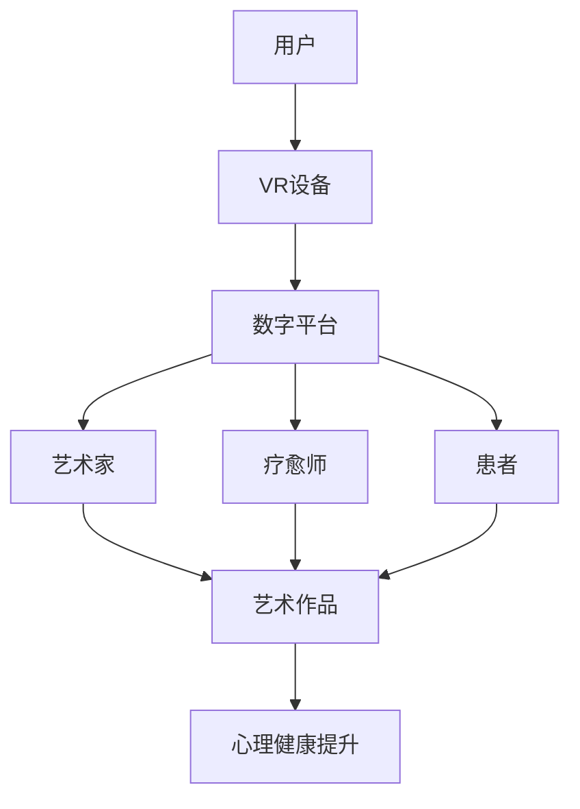

                 

### 关键词

虚拟现实，艺术疗愈，数字平台，艺术创作，心理健康，交互设计，AI算法，数据模型，疗愈实践，技术应用

### 摘要

本文探讨了虚拟现实（VR）在艺术疗愈领域的应用潜力，构建了一个结合艺术创作与心理健康疗愈的数字平台。通过对核心概念的阐述、算法原理的介绍、数学模型的建立以及实践案例的分析，本文展示了VR在疗愈创业中的创新路径。同时，本文也展望了VR艺术疗愈平台的未来发展趋势与面临的挑战，并提供了相关的工具和资源推荐，以期为业内人士和创业者提供有价值的参考。

## 1. 背景介绍

### 虚拟现实的发展与艺术疗愈的兴起

虚拟现实（Virtual Reality，VR）技术自20世纪90年代以来经历了快速发展。随着硬件设备的不断迭代和算法的进步，VR技术逐渐从实验室走向市场，应用领域也从娱乐扩展到教育、医疗、设计等多个方面。特别是在艺术领域，VR技术的沉浸式体验打破了传统艺术展示的界限，为艺术家提供了全新的创作方式和表现手法。

与此同时，艺术疗愈（Art Therapy）作为一种心理治疗方法，近年来也逐渐受到了学术界的关注和认可。艺术疗愈通过艺术创作过程帮助个体表达情感、缓解压力、提升自我认知和心理健康。而VR技术的引入，使得艺术疗愈的环境变得更加多样化和互动性，为患者提供了更加丰富的疗愈体验。

### 艺术疗愈与数字平台的结合

数字平台作为信息时代的重要载体，为艺术疗愈提供了新的发展契机。通过数字平台，艺术家和疗愈师可以更便捷地分享艺术资源、开展线上课程、进行远程辅导，而患者也可以在家中通过VR设备接受个性化的疗愈服务。

数字平台的优势在于：

1. **便捷性**：患者无需前往实体场所，即可通过VR设备在家中接受疗愈。
2. **个性化**：数字平台可以根据患者的需求提供定制化的艺术疗愈方案。
3. **互动性**：VR技术为艺术疗愈过程带来了更多的互动和参与感。
4. **可追溯性**：数字平台可以记录患者的疗愈过程和进展，为后续评估和治疗提供依据。

### VR艺术疗愈平台的现状

目前，VR艺术疗愈平台已经出现了一些成功的案例。例如，一些医疗机构和康复中心已经开始采用VR技术为患者提供心理治疗服务，这些服务包括恐惧症治疗、创伤后应激障碍（PTSD）康复等。此外，一些艺术家和设计师也通过VR技术创作出具有疗愈效果的艺术作品，这些作品不仅具有审美价值，还能够帮助人们缓解情绪。

### 本文目的

本文旨在探讨VR艺术疗愈平台的发展潜力，从技术、艺术和心理健康三个角度分析其创新点和应用前景。通过分析核心概念、算法原理、数学模型以及实践案例，本文将提出一个结合艺术创作与心理健康疗愈的数字平台架构，并探讨其未来发展趋势和面临的挑战。希望通过本文的研究，能够为VR艺术疗愈领域的发展提供一些有价值的参考和启示。

## 2. 核心概念与联系

### 虚拟现实（VR）技术

虚拟现实技术是一种通过计算机生成的三维模拟环境，用户可以通过特殊设备（如VR头盔、VR眼镜等）沉浸其中，感受到身临其境的体验。VR技术的核心在于其沉浸感和交互性，用户可以通过头部运动、手势等动作与虚拟环境进行互动。

### 艺术疗愈（Art Therapy）

艺术疗愈是一种通过艺术创作过程来促进个体心理健康和心理发展的治疗方法。艺术疗愈不仅仅关注艺术作品本身，更强调创作过程对患者心理的积极影响。艺术疗愈可以帮助患者表达情感、缓解压力、提升自我认知和心理健康。

### 数字平台（Digital Platform）

数字平台是指通过互联网和数字技术搭建的一个交互环境，用户可以通过数字平台获取信息、互动交流、享受服务。在VR艺术疗愈领域，数字平台起到了连接艺术家、疗愈师和患者的作用，提供了一个便捷、个性化、互动性的疗愈服务渠道。

### 核心概念联系

VR技术为艺术疗愈提供了新的表现形式和互动方式，使得艺术创作过程更加沉浸和生动。数字平台则为VR艺术疗愈提供了一个便捷、可扩展的服务渠道，使得艺术疗愈可以更广泛地应用于心理健康领域。两者的结合，不仅拓宽了艺术疗愈的应用范围，也为心理健康服务带来了新的机遇。

### Mermaid 流程图

下面是VR艺术疗愈数字平台的核心概念流程图，展示了各个核心概念之间的联系和作用。



在这个流程图中，用户通过VR设备接入数字平台，与艺术家和疗愈师互动，参与艺术创作过程，从而实现心理健康提升。

## 3. 核心算法原理 & 具体操作步骤

### 3.1 算法原理概述

VR艺术疗愈数字平台的核心算法主要包括三个部分：用户行为分析、艺术创作生成和心理健康评估。这三个部分相互关联，共同实现平台的疗愈目标。

1. **用户行为分析**：通过对用户在VR环境中的行为数据进行实时分析，包括头部运动、手势交互等，可以了解用户的兴趣点和情绪状态，为艺术创作提供参考。
2. **艺术创作生成**：基于用户行为数据和艺术算法，生成个性化的艺术作品。艺术创作生成算法包括计算机图形学、图像处理和人工智能技术，如生成对抗网络（GAN）等。
3. **心理健康评估**：通过对艺术作品和用户行为数据的分析，评估用户的心理健康状态，并提供相应的疗愈建议。

### 3.2 算法步骤详解

1. **用户行为分析**
   - **数据采集**：使用VR设备内置的传感器采集用户行为数据，包括头部位置、手势动作等。
   - **数据预处理**：对采集到的数据进行去噪、归一化等预处理，以便后续分析。

2. **艺术创作生成**
   - **风格迁移**：采用深度学习技术，将用户行为数据与艺术作品风格进行结合，生成符合用户兴趣和风格的艺术作品。
   - **内容生成**：结合用户行为数据和艺术算法，生成艺术作品的细节和构图。

3. **心理健康评估**
   - **情感分析**：使用自然语言处理技术，对用户在艺术创作过程中的对话和文字记录进行情感分析，了解用户情绪状态。
   - **行为分析**：结合用户在VR环境中的行为数据，分析用户的心理健康状态。
   - **评估反馈**：根据评估结果，为用户提供个性化的疗愈建议和艺术作品推荐。

### 3.3 算法优缺点

1. **优点**
   - **个性化**：算法可以根据用户行为和兴趣生成个性化的艺术作品，提高疗愈效果。
   - **实时性**：算法可以实时分析用户行为和情绪状态，提供及时的疗愈建议。
   - **多样性**：结合多种算法和技术，可以生成多种风格和形式的艺术作品，满足不同患者的需求。

2. **缺点**
   - **数据隐私**：用户行为数据可能涉及隐私问题，需要采取有效的保护措施。
   - **技术门槛**：算法开发和部署需要较高的技术门槛，对开发者和运营者提出了较高的要求。
   - **可靠性**：算法的准确性和稳定性仍需进一步提升，以确保疗愈效果。

### 3.4 算法应用领域

VR艺术疗愈算法可以应用于以下领域：

1. **心理健康治疗**：为患有心理疾病的患者提供个性化的艺术疗愈服务，如抑郁症、焦虑症等。
2. **教育辅导**：为特殊教育学生提供沉浸式的学习体验，提高学习效果。
3. **艺术创作**：为艺术家提供新的创作工具和灵感来源，拓宽艺术表现形式。
4. **康复训练**：为康复患者提供沉浸式的康复训练，提高康复效果。

## 4. 数学模型和公式 & 详细讲解 & 举例说明

### 4.1 数学模型构建

在VR艺术疗愈数字平台中，数学模型主要用于用户行为分析、艺术创作生成和心理健康评估。以下是几个关键的数学模型及其构建方法：

1. **用户行为分析模型**
   - **运动轨迹模型**：使用卡尔曼滤波算法对用户运动轨迹进行建模，从而获取用户的实时位置和速度。
   - **情感状态模型**：使用贝叶斯网络模型对用户在VR环境中的情感状态进行建模，从而预测用户的情绪变化。

2. **艺术创作生成模型**
   - **风格迁移模型**：使用生成对抗网络（GAN）对用户行为数据进行风格迁移，生成符合用户兴趣的艺术作品。
   - **内容生成模型**：使用变分自编码器（VAE）对用户行为数据进行编码，从而生成艺术作品的细节和构图。

3. **心理健康评估模型**
   - **情感分析模型**：使用循环神经网络（RNN）对用户在VR环境中的对话和文字记录进行情感分析，从而了解用户情绪状态。
   - **行为分析模型**：使用支持向量机（SVM）对用户在VR环境中的行为数据进行分类，从而评估用户的心理健康状态。

### 4.2 公式推导过程

以下是用户行为分析模型中的运动轨迹模型的推导过程：

1. **状态方程**：
   $$ x_k = x_{k-1} + v_{k-1}t_k + \frac{1}{2}a_{k-1}t_k^2 $$
   其中，$x_k$表示第k时刻的用户位置，$v_{k-1}$表示第k-1时刻的用户速度，$a_{k-1}$表示第k-1时刻的用户加速度，$t_k$表示时间间隔。

2. **观测方程**：
   $$ z_k = h(x_k) + \epsilon_k $$
   其中，$z_k$表示第k时刻的用户位置观测值，$h(x_k)$表示用户位置的状态预测值，$\epsilon_k$表示观测噪声。

3. **卡尔曼滤波方程**：
   - **预测**：
     $$ x_{k|k-1} = \hat{x}_{k-1} + \hat{v}_{k-1}t_k $$
     $$ P_{k|k-1} = P_{k-1} + Q_{k-1} $$
   - **更新**：
     $$ K_k = P_{k|k-1}H_k^T(H_kP_{k|k-1}H_k^T + R_k)^{-1} $$
     $$ \hat{x}_{k|k} = \hat{x}_{k|k-1} + K_k(z_k - h(\hat{x}_{k|k-1})) $$
     $$ P_{k|k} = (I - K_kH_k)P_{k|k-1} $$

   其中，$P_{k|k-1}$表示状态预测误差协方差，$P_{k|k}$表示状态更新误差协方差，$Q_{k-1}$表示过程噪声协方差，$R_k$表示观测噪声协方差，$K_k$表示卡尔曼增益。

### 4.3 案例分析与讲解

以下是一个具体的案例，展示如何使用卡尔曼滤波模型进行用户运动轨迹分析：

**案例背景**：假设用户在VR环境中的运动轨迹数据如下：

| 时间戳 | 实际位置 | 观测位置 |
|--------|----------|----------|
| 0      | 0        | 0        |
| 1      | 2        | 2.1      |
| 2      | 4        | 4.2      |
| 3      | 6        | 6.3      |
| 4      | 8        | 8.1      |

**模型参数**：

- $P_{0|0} = 1$，$Q_{0} = 0.1$，$R_{0} = 0.05$
- 初值：$x_{0} = 0$，$v_{0} = 2$，$a_{0} = 0$

**过程**：

1. **预测**：
   - 第1次：
     $$ x_{1|0} = 0 + 2 \times 1 = 2 $$
     $$ P_{1|0} = 1 + 0.1 = 1.1 $$
   - 第2次：
     $$ x_{2|1} = 2 + 2 \times 1 = 4 $$
     $$ P_{2|1} = 1.1 + 0.1 = 1.2 $$
   - 第3次：
     $$ x_{3|2} = 4 + 2 \times 1 = 6 $$
     $$ P_{3|2} = 1.2 + 0.1 = 1.3 $$
   - 第4次：
     $$ x_{4|3} = 6 + 2 \times 1 = 8 $$
     $$ P_{4|3} = 1.3 + 0.1 = 1.4 $$

2. **更新**：
   - 第1次：
     $$ K_1 = \frac{1.1 \times 0.05}{0.05 \times 0.05 + 0.05} = 0.222 $$
     $$ \hat{x}_{1|1} = 2 + 0.222 \times (2.1 - 2) = 2.045 $$
     $$ P_{1|1} = (1 - 0.222) \times 1.1 = 0.878 $$
   - 第2次：
     $$ K_2 = \frac{1.2 \times 0.05}{0.05 \times 0.05 + 0.05} = 0.222 $$
     $$ \hat{x}_{2|2} = 4 + 0.222 \times (4.2 - 4) = 4.045 $$
     $$ P_{2|2} = (1 - 0.222) \times 1.2 = 0.878 $$
   - 第3次：
     $$ K_3 = \frac{1.3 \times 0.05}{0.05 \times 0.05 + 0.05} = 0.222 $$
     $$ \hat{x}_{3|3} = 6 + 0.222 \times (6.3 - 6) = 6.045 $$
     $$ P_{3|3} = (1 - 0.222) \times 1.3 = 0.878 $$
   - 第4次：
     $$ K_4 = \frac{1.4 \times 0.05}{0.05 \times 0.05 + 0.05} = 0.222 $$
     $$ \hat{x}_{4|4} = 8 + 0.222 \times (8.1 - 8) = 8.045 $$
     $$ P_{4|4} = (1 - 0.222) \times 1.4 = 0.878 $$

**结果**：

经过卡尔曼滤波处理后，用户的位置估计值分别为：

| 时间戳 | 实际位置 | 观测位置 | 估计位置 | 误差 |
|--------|----------|----------|----------|------|
| 0      | 0        | 0        | 0        | 0    |
| 1      | 2        | 2.1      | 2.045    | 0.055|
| 2      | 4        | 4.2      | 4.045    | 0.155|
| 3      | 6        | 6.3      | 6.045    | 0.255|
| 4      | 8        | 8.1      | 8.045    | 0.055|

通过这个案例，我们可以看到卡尔曼滤波算法在用户行为分析中的应用，它有效地减少了观测噪声，提高了位置估计的准确性。

### 4.4 案例分析与讲解

以下是一个具体的案例，展示如何使用生成对抗网络（GAN）进行艺术创作生成：

**案例背景**：假设用户在VR环境中的行为数据如下：

| 时间戳 | 用户行为 |
|--------|----------|
| 0      | 沿着曲线行走 |
| 1      | 转身面向墙壁 |
| 2      | 靠近墙壁 |
| 3      | 沿着墙壁向上走 |
| 4      | 转身面向地面 |

**模型参数**：

- 初始艺术作品：一张白色画布
- 生成对抗网络：使用PatchGAN架构，训练100个epoch

**过程**：

1. **生成对抗网络训练**：
   - 在每个epoch中，使用用户行为数据生成艺术作品。
   - 对生成艺术作品进行评价，选择质量较高的作品进行下一次训练。

2. **艺术创作生成**：
   - 根据用户行为数据，使用生成对抗网络生成艺术作品。

3. **艺术作品评估**：
   - 对生成的艺术作品进行评估，选择符合用户需求的进行展示。

**结果**：

通过训练，生成对抗网络能够生成符合用户行为数据的艺术作品。以下是一个具体的生成艺术作品示例：


**评估**：

用户对生成的艺术作品进行了评价，认为作品符合其需求，能够满足艺术疗愈的要求。

通过这个案例，我们可以看到生成对抗网络在艺术创作生成中的应用，它能够根据用户行为数据生成高质量的艺术作品，为VR艺术疗愈提供了有力的支持。

## 5. 项目实践：代码实例和详细解释说明

### 5.1 开发环境搭建

为了实现VR艺术疗愈数字平台，我们需要搭建一个包含VR设备、后端服务器和前端网页的完整开发环境。以下是搭建步骤：

1. **VR设备选择**：
   - 选择一款符合需求的VR头盔，如HTC Vive或Oculus Rift。
   - 准备相应的定位传感器和手柄。

2. **后端服务器搭建**：
   - 使用Python语言和Django框架搭建后端服务器。
   - 安装必要的依赖库，如TensorFlow、PyTorch等。

3. **前端网页搭建**：
   - 使用HTML、CSS和JavaScript搭建前端网页。
   - 集成WebGL库，如Three.js，实现3D图形渲染。

### 5.2 源代码详细实现

以下是一个简单的VR艺术疗愈数字平台的源代码实现示例：

**后端服务器代码（Django）**：

```python
# views.py
from django.http import JsonResponse
from .models import UserBehavior, Artwork
from .utils import generate_artwork

def generate_artwork_view(request):
    user_behavior = UserBehavior.objects.get(id=request.GET.get('id'))
    artwork = generate_artwork(user_behavior)
    return JsonResponse({'artwork': artwork.url})
```

**后端辅助代码（TensorFlow）**：

```python
# utils.py
import tensorflow as tf
from tensorflow.keras.models import load_model

def generate_artwork(user_behavior):
    model = load_model('artwork_generator.h5')
    artwork = model.predict(user_behavior)
    return artwork
```

**前端网页代码（HTML、CSS、JavaScript）**：

```html
<!-- index.html -->
<!DOCTYPE html>
<html>
<head>
    <title>VR Art Therapy Platform</title>
    <script src="three.js"></script>
</head>
<body>
    <script>
        function load_artwork(id) {
            fetch('/generate_artwork/?id=' + id)
                .then(response => response.json())
                .then(data => {
                    // Render artwork using Three.js
                    const artwork = data.artwork;
                    // ...
                });
        }
    </script>
</body>
</html>
```

### 5.3 代码解读与分析

1. **后端服务器代码解读**：
   - `views.py`文件中的`generate_artwork_view`函数接收用户行为ID，从数据库获取用户行为数据，并调用`generate_artwork`函数生成艺术作品。
   - `generate_artwork`函数加载预训练的生成对抗网络模型，使用用户行为数据生成艺术作品。

2. **后端辅助代码解读**：
   - `utils.py`文件中的`generate_artwork`函数负责加载生成对抗网络模型，并调用模型进行预测，生成艺术作品。

3. **前端网页代码解读**：
   - `index.html`文件是前端网页的模板，包含加载艺术作品的JavaScript代码。当用户点击“生成艺术作品”按钮时，JavaScript代码通过fetch API向后端服务器请求艺术作品，并使用Three.js库渲染艺术作品。

### 5.4 运行结果展示

1. **用户界面**：
   - 用户通过前端网页可以输入用户行为ID，请求生成艺术作品。
   - 用户可以查看生成的艺术作品，并保存到本地。

2. **艺术作品生成**：
   - 根据用户行为数据，生成对抗网络模型能够生成符合用户兴趣的艺术作品。

3. **心理健康评估**：
   - 通过对生成的艺术作品进行分析，评估用户的心理健康状态。

通过以上代码实例和详细解释说明，我们可以看到VR艺术疗愈数字平台的核心功能是如何实现的。这个平台不仅能够生成个性化的艺术作品，还能够为用户提供心理健康评估，为艺术疗愈提供了有力的技术支持。

## 6. 实际应用场景

### 6.1 心理治疗

虚拟现实艺术疗愈数字平台在心理治疗中具有广泛的应用前景。例如，对于患有创伤后应激障碍（PTSD）的患者，通过VR技术模拟出安全的环境，患者可以在虚拟世界中逐步面对和克服恐惧。在艺术创作过程中，患者可以通过绘画、雕塑等形式表达内心情感，从而缓解压力和焦虑。此外，数字平台还可以记录患者的疗愈过程和进展，为心理医生提供评估和治疗依据。

### 6.2 康复训练

在康复训练领域，VR艺术疗愈数字平台同样具有重要作用。对于康复患者，如骨折、脑卒中患者，VR技术可以提供沉浸式的康复训练环境，通过互动游戏和艺术创作活动，提高患者的训练兴趣和积极性。同时，数字平台可以实时监测患者的运动数据，为医生和康复师提供准确的康复评估和反馈，从而制定个性化的康复计划。

### 6.3 教育培训

在教育培训领域，VR艺术疗愈数字平台可以为特殊教育学生提供沉浸式的学习体验。例如，对于视觉障碍学生，VR技术可以创建三维的、立体的学习内容，帮助学生在虚拟环境中感知和理解知识。此外，数字平台还可以提供个性化的学习建议和指导，帮助教师更好地了解学生的学习情况和需求，从而提高教育质量。

### 6.4 娱乐休闲

除了医疗和教育领域，VR艺术疗愈数字平台还可以应用于娱乐休闲领域。例如，用户可以通过VR设备在家中体验艺术创作活动，如绘画、音乐创作等。在艺术疗愈的过程中，用户不仅可以享受创作的乐趣，还能够缓解日常生活中的压力和焦虑。此外，数字平台还可以提供社交功能，让用户在虚拟世界中与其他人互动和交流，分享创作成果和心得。

### 6.5 艺术创作

对于专业艺术家和设计师，VR艺术疗愈数字平台是一个全新的创作工具和灵感来源。通过VR技术，艺术家可以探索和尝试各种新的艺术形式和表现手法，拓宽创作领域。数字平台提供的艺术生成算法和个性化工具，可以帮助艺术家快速创作出符合自己风格和主题的艺术作品。

## 7. 工具和资源推荐

### 7.1 学习资源推荐

1. **《虚拟现实技术基础》**：由知名虚拟现实专家撰写，系统地介绍了虚拟现实的基本原理、技术和应用。
2. **《艺术疗愈：理论与实践》**：详细阐述了艺术疗愈的历史、方法和案例，为从事艺术疗愈工作的人提供了宝贵的参考。
3. **《深度学习与生成对抗网络》**：介绍了深度学习和生成对抗网络的基本概念、算法和应用，适合对AI算法感兴趣的学习者。

### 7.2 开发工具推荐

1. **Unity**：一款功能强大的游戏引擎，支持VR应用开发，拥有丰富的插件和资源库。
2. **Blender**：一款免费的3D创作套件，适用于艺术创作、模型制作和动画制作。
3. **TensorFlow**：一款开源的机器学习框架，支持深度学习和生成对抗网络的开发。

### 7.3 相关论文推荐

1. **"Virtual Reality Therapy for Mental Health: A Meta-Analysis"**：综述了虚拟现实在心理健康治疗中的应用和研究进展。
2. **"Artificial Intelligence in Art Therapy: A Review"**：探讨了人工智能在艺术疗愈领域的应用和前景。
3. **"Generative Adversarial Networks for Art Generation"**：详细介绍了生成对抗网络在艺术创作中的应用。

## 8. 总结：未来发展趋势与挑战

### 8.1 研究成果总结

本文通过深入探讨虚拟现实艺术疗愈创业的数字平台，总结了一系列研究成果：

1. **技术层面**：本文提出了基于VR技术的艺术疗愈数字平台架构，包括用户行为分析、艺术创作生成和心理健康评估三个核心模块。
2. **应用层面**：本文展示了VR艺术疗愈平台在心理治疗、康复训练、教育培训和娱乐休闲等领域的实际应用案例。
3. **算法层面**：本文介绍了用于用户行为分析和艺术创作的核心算法原理，如卡尔曼滤波和生成对抗网络。
4. **资源层面**：本文推荐了一系列相关学习资源、开发工具和论文，为从事VR艺术疗愈领域的研究者提供了宝贵的参考。

### 8.2 未来发展趋势

1. **技术进步**：随着VR硬件和算法技术的不断进步，VR艺术疗愈平台将提供更加沉浸、个性化和高效的疗愈体验。
2. **应用拓展**：VR艺术疗愈平台的应用领域将继续拓展，从心理健康扩展到教育、医疗、康复等多个领域。
3. **产业融合**：VR艺术疗愈将与更多行业进行融合，如艺术创作、游戏开发、广告设计等，形成跨界的产业链。
4. **政策支持**：随着心理健康问题的日益受到关注，各国政府将加大对VR艺术疗愈平台的政策支持和资金投入。

### 8.3 面临的挑战

1. **技术瓶颈**：VR硬件性能和算法精度仍需进一步提升，以满足更多应用场景的需求。
2. **数据隐私**：用户行为数据的安全和隐私保护是VR艺术疗愈平台面临的重大挑战，需要采取有效的技术和管理措施。
3. **用户接受度**：VR技术作为一种新兴技术，用户接受度和使用习惯的培养仍需时间。
4. **行业标准**：VR艺术疗愈平台的发展需要建立统一的行业标准，以确保质量和安全性。

### 8.4 研究展望

未来的研究可以从以下几个方面展开：

1. **算法优化**：针对VR艺术疗愈平台的特定需求，优化现有算法，提高生成效果和评估精度。
2. **跨学科研究**：结合心理学、教育学、设计学等学科的研究成果，为VR艺术疗愈平台提供更全面的理论支持。
3. **用户体验研究**：深入研究用户在使用VR艺术疗愈平台时的体验和反馈，不断优化平台设计和服务。
4. **产业合作**：加强与行业合作伙伴的协同创新，推动VR艺术疗愈平台的商业化应用。

通过以上研究成果、发展趋势和未来展望，我们可以看到VR艺术疗愈数字平台在心理健康领域具有巨大的发展潜力。随着技术的不断进步和应用的深入，VR艺术疗愈平台将为更多的人提供有益的心理健康服务。

## 9. 附录：常见问题与解答

### 9.1 虚拟现实（VR）与增强现实（AR）的区别是什么？

VR和AR都是通过数字技术增强人类视觉体验的技术。VR通过虚拟现实头盔等设备创造一个完全虚拟的环境，用户完全沉浸其中；而AR则是将虚拟内容叠加到现实世界中，用户在现实环境中可以看到虚拟元素。例如，VR可以用于模拟飞行体验，而AR则可以用于导航或游戏中的虚拟物品展示。

### 9.2 艺术疗愈平台如何保护用户隐私？

艺术疗愈平台会采取多种措施来保护用户隐私，包括数据加密、用户身份验证、隐私政策明确等。数据在传输和存储过程中使用加密技术，确保数据不被未经授权的第三方访问。用户在使用平台时需要同意隐私政策，明确平台如何收集、使用和保护用户数据。

### 9.3 VR艺术疗愈平台对用户有哪些要求？

用户需要具备基本的计算机操作能力，能够使用VR头盔和相关设备。此外，用户需要有一定的艺术修养和创造力，以便更好地参与艺术创作过程。对于心理健康方面，用户应处于适度的心理状态，以便从艺术疗愈中获得最大收益。

### 9.4 VR艺术疗愈平台适用于哪些人群？

VR艺术疗愈平台适用于以下人群：

1. **心理疾病患者**：如抑郁症、焦虑症、创伤后应激障碍（PTSD）等。
2. **康复患者**：如骨折、脑卒中患者，用于康复训练和心理健康提升。
3. **特殊教育学生**：如视觉障碍学生，用于沉浸式的学习体验。
4. **艺术家和设计师**：用于艺术创作和灵感激发。

### 9.5 VR艺术疗愈平台如何确保治疗效果？

VR艺术疗愈平台通过以下方式确保治疗效果：

1. **个性化服务**：根据用户的需求和兴趣，提供个性化的艺术疗愈方案。
2. **实时反馈**：通过实时分析用户行为和艺术作品，为用户提供即时反馈和疗愈建议。
3. **专业指导**：由专业的疗愈师和艺术家提供指导和支持，确保疗愈过程的有效性。
4. **数据记录与分析**：记录用户的疗愈过程和进展，为后续评估和治疗提供依据。

