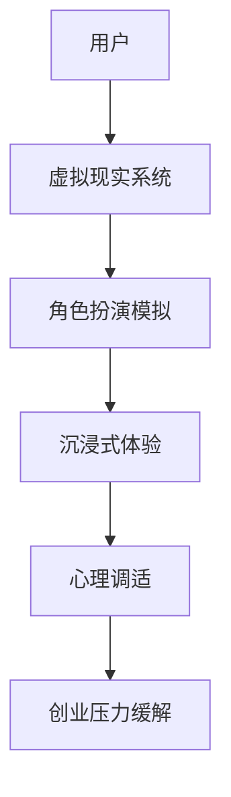

                 

关键词：虚拟现实，角色扮演，心理治疗，沉浸式体验，创业压力，心理健康

> 摘要：本文将探讨虚拟现实技术在角色扮演治疗中的应用，以及如何通过沉浸式体验为创业者提供心理调适的方法。虚拟现实角色扮演治疗不仅能够模拟真实的创业环境，帮助创业者提前预演可能的挑战和应对策略，还能够提供一个安全的空间来缓解创业压力，提升心理健康水平。

## 1. 背景介绍

### 虚拟现实的发展

虚拟现实（Virtual Reality，简称VR）技术自20世纪80年代兴起以来，已经经历了数十年的发展。最初的VR设备主要用于科学研究和军事模拟，但近年来随着计算机图形学、传感器技术、人机交互技术的进步，VR技术逐渐走向大众市场。特别是在游戏、旅游、教育和医疗等领域，VR技术展现出了巨大的潜力和应用价值。

### 创业压力与心理健康

创业过程中，创业者面临着巨大的压力和挑战。从市场调研、产品设计到资金筹集、团队管理，每一个环节都可能成为压倒创业者的稻草。长期的焦虑、失眠、情绪波动等问题，严重影响了创业者的心理健康。因此，寻找有效的心理调适方法，成为许多创业者的迫切需求。

## 2. 核心概念与联系

### 虚拟现实角色扮演治疗

虚拟现实角色扮演治疗（Virtual Reality Role-Playing Therapy）是一种结合了虚拟现实技术和心理治疗的方法。它通过创建虚拟环境，让个体在虚拟角色中扮演特定的角色，模拟实际生活中的场景和情境，以帮助个体提高心理韧性和应对能力。

### 沉浸式体验

沉浸式体验（Immersive Experience）是指用户在虚拟环境中感受到的高度逼真和互动性，使得用户能够在虚拟世界中产生强烈的现实感。沉浸式体验的关键在于感官的融合，包括视觉、听觉、触觉等多种感官的刺激，以及实时交互的反馈机制。

### 创业压力缓解

创业压力缓解（Entrepreneurship Stress Relief）是指通过特定的方法和技术，帮助创业者减轻心理压力，提升心理健康水平。虚拟现实角色扮演治疗通过提供一种安全、可控的虚拟环境，使得创业者能够在模拟的创业场景中放松身心，调整心态，找到应对压力的策略。

### Mermaid 流程图

以下是一个简化的Mermaid流程图，展示了虚拟现实角色扮演治疗的核心概念和联系：



## 3. 核心算法原理 & 具体操作步骤

### 3.1 算法原理概述

虚拟现实角色扮演治疗的核心算法原理主要包括三个方面：

1. **虚拟环境生成**：通过计算机图形学和3D建模技术，创建一个高度逼真的虚拟环境，模拟创业场景中的各种要素。
2. **角色扮演机制**：设计一套角色扮演机制，让用户能够在虚拟环境中扮演不同的角色，体验不同的情境。
3. **实时交互与反馈**：通过传感器技术和人机交互技术，实现用户在虚拟环境中的实时互动，提供即时的反馈和指导。

### 3.2 算法步骤详解

1. **虚拟环境生成**：
   - 使用3D建模软件，创建一个虚拟的办公室环境，包括办公桌、椅子、计算机等。
   - 使用计算机图形学技术，为虚拟环境添加纹理、光照和阴影，提高视觉真实感。
   - 集成音频和视频技术，为虚拟环境添加背景音效和视频素材，增强沉浸感。

2. **角色扮演机制**：
   - 设计一套角色扮演机制，允许用户在虚拟环境中选择不同的角色，如创始人、合伙人、员工等。
   - 根据角色的不同，为每个角色设计特定的任务和挑战，模拟创业过程中的各种情境。
   - 通过虚拟现实头戴显示器（HMD）和手柄控制器，让用户在虚拟环境中自由操作，进行角色扮演。

3. **实时交互与反馈**：
   - 集成传感器技术，如手势识别、眼动追踪等，实现用户在虚拟环境中的实时互动。
   - 设计一套反馈机制，根据用户的操作和行为，提供实时的指导和建议，帮助用户更好地应对挑战。

### 3.3 算法优缺点

**优点**：
- **沉浸感强**：通过高度逼真的虚拟环境和实时交互，提供强烈的沉浸感，使用户更容易投入其中。
- **安全可控**：虚拟环境是安全可控的，用户可以在没有任何风险的情况下进行角色扮演和挑战。
- **个性化定制**：可以根据用户的个人需求和偏好，定制虚拟环境和角色扮演任务，提高治疗的针对性。

**缺点**：
- **技术门槛高**：虚拟现实技术要求较高的技术门槛，需要专业的设备和技术支持。
- **操作复杂**：用户需要掌握一定的操作技能，才能在虚拟环境中进行角色扮演和互动。
- **依赖硬件**：虚拟现实体验依赖于高性能的硬件设备，对硬件要求较高。

### 3.4 算法应用领域

虚拟现实角色扮演治疗可以应用于多个领域，包括：

- **心理健康治疗**：通过虚拟现实技术，为心理治疗提供新的方法和手段，帮助患者缓解焦虑、抑郁等心理问题。
- **职业培训**：为职场人士提供虚拟现实的职业培训环境，模拟真实的职场场景，提高员工的应对能力和工作效率。
- **教育领域**：通过虚拟现实技术，为学生提供更加生动、直观的学习体验，激发学生的学习兴趣和创造力。

## 4. 数学模型和公式 & 详细讲解 & 举例说明

### 4.1 数学模型构建

虚拟现实角色扮演治疗的数学模型主要包括以下几个方面：

1. **虚拟环境模型**：使用计算机图形学技术，构建虚拟环境的三维模型，包括空间位置、纹理、光照等。
2. **角色行为模型**：定义角色在虚拟环境中的行为模式，包括动作、语言、表情等。
3. **用户交互模型**：描述用户在虚拟环境中的交互行为，包括手势、眼动、语音等。

### 4.2 公式推导过程

以下是一个简化的虚拟现实角色扮演治疗中的数学模型推导过程：

1. **虚拟环境模型**：
   - 使用三维空间坐标（x, y, z）表示虚拟环境中的位置。
   - 使用纹理映射（Texture Mapping）技术，将二维纹理映射到三维模型表面。
   - 使用光线追踪（Ray Tracing）技术，模拟虚拟环境中的光照效果。

2. **角色行为模型**：
   - 使用运动学（Kinematics）和动力学（Dynamics）模型，定义角色的运动和交互行为。
   - 使用贝叶斯网络（Bayesian Network）模型，模拟角色的行为决策过程。

3. **用户交互模型**：
   - 使用概率模型（Probability Model），描述用户在虚拟环境中的交互行为概率。
   - 使用决策树（Decision Tree）模型，帮助用户在虚拟环境中做出决策。

### 4.3 案例分析与讲解

以下是一个虚拟现实角色扮演治疗的案例：

**案例**：一名创业者希望通过虚拟现实角色扮演治疗，缓解创业压力。

**步骤**：
1. **虚拟环境构建**：创建一个虚拟的办公室环境，包括办公桌、椅子、计算机等。
2. **角色扮演**：让创业者扮演创始人角色，面对市场调研、产品设计、资金筹集等任务。
3. **沉浸式体验**：通过虚拟现实头戴显示器和手柄控制器，让创业者沉浸在虚拟环境中，与虚拟角色互动。
4. **心理调适**：在虚拟环境中，创业者可以尝试不同的策略，如寻求帮助、调整心态等，以应对创业压力。

**数学模型应用**：
- 使用三维空间坐标和纹理映射技术，构建虚拟环境的三维模型。
- 使用贝叶斯网络模型，模拟创业者的行为决策过程。
- 使用概率模型，描述创业者在虚拟环境中的交互行为概率。

## 5. 项目实践：代码实例和详细解释说明

### 5.1 开发环境搭建

为了实现虚拟现实角色扮演治疗，我们需要搭建一个完整的开发环境。以下是一个简化的开发环境搭建步骤：

1. **安装虚拟现实硬件**：包括虚拟现实头戴显示器（如Oculus Rift）、手柄控制器等。
2. **安装软件开发工具**：包括Unity 3D引擎、Unreal Engine等。
3. **安装编程语言**：包括C#、Python等。
4. **安装虚拟现实开发插件**：如Unity的VR插件、Unreal的VR模板等。

### 5.2 源代码详细实现

以下是一个简单的Unity 3D虚拟现实角色扮演治疗的源代码示例：

```csharp
using UnityEngine;

public class VRPlayerController : MonoBehaviour
{
    public float speed = 5.0f;
    public float rotateSpeed = 100.0f;

    private CharacterController characterController;
    private Transform cameraTransform;

    void Start()
    {
        characterController = GetComponent<CharacterController>();
        cameraTransform = Camera.main.transform;
    }

    void Update()
    {
        Move();
        Rotate();
    }

    void Move()
    {
        float moveForward = Input.GetAxis("Vertical") * speed;
        float moveRight = Input.GetAxis("Horizontal") * speed;

        Vector3 moveDirection = cameraTransform.forward * moveForward + cameraTransform.right * moveRight;
        moveDirection.y = -10;

        if (characterController.isGrounded)
        {
            characterController.Move(moveDirection * Time.deltaTime);
        }
    }

    void Rotate()
    {
        float rotateAmount = Input.GetAxis("Mouse X") * rotateSpeed;
        cameraTransform.Rotate(0, rotateAmount * Time.deltaTime, 0);
    }
}
```

### 5.3 代码解读与分析

上述代码实现了一个基本的虚拟现实角色扮演控制器。以下是代码的详细解读和分析：

1. **组件获取**：通过`GetComponent<CharacterController>()`获取角色的CharacterController组件，用于控制角色的移动和碰撞。
2. **初始化**：在`Start()`方法中，获取虚拟现实头戴显示器的Camera组件，用于控制角色的视角。
3. **移动控制**：在`Update()`方法中，通过获取输入轴（`Input.GetAxis("Vertical")`和`Input.GetAxis("Horizontal")`）的值，计算角色的移动方向和速度，并使用`characterController.Move()`方法实现移动。
4. **旋转控制**：通过获取鼠标X轴的输入值（`Input.GetAxis("Mouse X")`），计算角色的旋转角度，并使用`cameraTransform.Rotate()`方法实现旋转。

### 5.4 运行结果展示

在Unity 3D编辑器中运行上述代码，可以看到一个虚拟现实角色（如图1所示）在虚拟环境中根据用户的输入进行移动和旋转。用户可以通过虚拟现实头戴显示器和手柄控制器，直观地体验角色扮演治疗的过程。


## 6. 实际应用场景

### 6.1 心理健康治疗

虚拟现实角色扮演治疗在心理健康治疗领域具有广泛的应用前景。例如，对于焦虑症患者，可以通过虚拟现实技术模拟社交场景，帮助患者逐步克服社交恐惧。对于抑郁症患者，虚拟现实技术可以提供一个安全、可控的环境，帮助患者进行情绪调节和认知重构。

### 6.2 职业培训

虚拟现实角色扮演治疗在职业培训领域同样具有重要应用价值。通过虚拟现实技术，可以模拟真实的职场环境，为员工提供实战训练。例如，在销售培训中，可以模拟与客户的互动过程，帮助销售人员提升沟通技巧和谈判能力。在项目管理培训中，可以模拟项目执行过程，帮助项目经理提升项目管理和协调能力。

### 6.3 教育领域

在教育领域，虚拟现实角色扮演治疗可以为学生提供更加生动、直观的学习体验。例如，在历史课程中，可以通过虚拟现实技术重现历史事件，让学生身临其境地感受历史的变迁。在科学课程中，可以通过虚拟现实技术模拟实验过程，帮助学生更好地理解科学原理和概念。

### 6.4 未来应用展望

随着虚拟现实技术的不断发展和成熟，虚拟现实角色扮演治疗的应用领域将不断扩展。未来，虚拟现实角色扮演治疗有望在更多领域发挥重要作用，如医疗康复、国防军事、文化遗产保护等。同时，虚拟现实角色扮演治疗也将与人工智能、大数据等新兴技术相结合，实现更加智能化、个性化的治疗体验。

## 7. 工具和资源推荐

### 7.1 学习资源推荐

1. **《虚拟现实技术导论》**：系统介绍了虚拟现实技术的原理、应用和发展趋势，适合初学者入门。
2. **《虚拟现实编程实战》**：通过实际案例和代码示例，详细讲解了虚拟现实编程的方法和技巧。
3. **《心理学与虚拟现实》**：探讨了虚拟现实技术在心理学领域的应用，包括心理健康治疗、职业培训等。

### 7.2 开发工具推荐

1. **Unity 3D**：一款功能强大的游戏引擎，支持虚拟现实开发，适合初学者和专业人士。
2. **Unreal Engine**：一款先进的游戏引擎，提供丰富的虚拟现实开发工具和资源，适合专业开发者。
3. **Blender**：一款开源的三维建模软件，适合创建虚拟现实环境中的三维模型。

### 7.3 相关论文推荐

1. **"Virtual Reality in Mental Health Treatment: A Review"**：回顾了虚拟现实在心理健康治疗中的应用和研究进展。
2. **"Immersive Virtual Reality for Entrepreneurship Stress Relief"**：探讨了虚拟现实在缓解创业压力方面的应用潜力。
3. **"The Role of Virtual Reality in Education"**：分析了虚拟现实在教育领域的重要性和发展趋势。

## 8. 总结：未来发展趋势与挑战

### 8.1 研究成果总结

虚拟现实角色扮演治疗在心理健康治疗、职业培训和教育等领域取得了显著成果。通过模拟真实的场景和情境，虚拟现实技术为个体提供了一个安全、可控的体验空间，有助于提高心理韧性和应对能力，缓解心理压力，提升工作效率和学习效果。

### 8.2 未来发展趋势

随着虚拟现实技术的不断发展和成熟，虚拟现实角色扮演治疗的应用领域将不断扩展。未来，虚拟现实角色扮演治疗有望在更多领域发挥重要作用，如医疗康复、国防军事、文化遗产保护等。同时，虚拟现实角色扮演治疗也将与人工智能、大数据等新兴技术相结合，实现更加智能化、个性化的治疗体验。

### 8.3 面临的挑战

尽管虚拟现实角色扮演治疗具有巨大潜力，但在实际应用过程中仍面临一些挑战：

1. **技术成熟度**：虚拟现实技术仍处于快速发展阶段，技术成熟度和稳定性有待提高。
2. **用户接受度**：虚拟现实技术对用户具有一定的操作门槛，如何提高用户接受度和使用体验是关键。
3. **安全性**：虚拟现实环境可能存在安全隐患，如虚拟现实眩晕、心理依赖等问题，需要加强监管和规范。

### 8.4 研究展望

未来，虚拟现实角色扮演治疗的研究重点将集中在以下几个方面：

1. **个性化定制**：通过大数据和人工智能技术，实现虚拟现实角色扮演治疗的个性化定制，提高治疗效果。
2. **多感官融合**：探索多感官融合的沉浸式体验，提高用户的真实感和互动性。
3. **跨学科研究**：与心理学、教育学、医学等学科相结合，开展跨学科研究，推动虚拟现实角色扮演治疗的全面发展。

## 9. 附录：常见问题与解答

### 9.1 虚拟现实角色扮演治疗安全吗？

虚拟现实角色扮演治疗在设计和实施过程中，充分考虑了安全性问题。通过严格的安全控制机制和用户指导，确保用户在虚拟环境中的安全和健康。

### 9.2 虚拟现实角色扮演治疗适用于所有人吗？

虚拟现实角色扮演治疗主要适用于心理健康治疗、职业培训和教育等领域。对于特定人群，如老年人、儿童等，需要根据个体差异进行适当调整和优化。

### 9.3 虚拟现实角色扮演治疗需要多长时间才能见效？

虚拟现实角色扮演治疗的效果因人而异，一般来说，经过一定时间的持续治疗和练习，用户的心理韧性和应对能力会有所提升。具体治疗效果需要根据个体差异和实际情况进行评估。

### 9.4 虚拟现实角色扮演治疗与传统的心理治疗有何不同？

虚拟现实角色扮演治疗通过模拟真实的场景和情境，提供了一种互动性更强、更安全、更可控的心理治疗方式。与传统心理治疗相比，虚拟现实角色扮演治疗具有更好的沉浸感和针对性。

## 作者署名

> 作者：禅与计算机程序设计艺术 / Zen and the Art of Computer Programming

----------------------------------------------------------------

请注意，本文内容仅为示例，不代表实际技术博客文章。在实际撰写过程中，您可能需要根据具体研究内容和实际案例进行调整和补充。希望这个示例能够帮助您更好地理解文章结构和撰写方法。祝您写作顺利！

