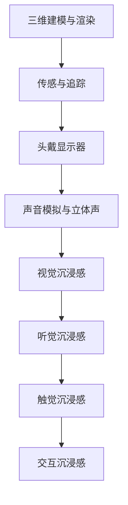

                 

关键词：虚拟现实，VR开发，沉浸式体验，设计，用户体验

摘要：本文将深入探讨虚拟现实（VR）开发的核心主题——沉浸式体验设计。我们将从背景介绍、核心概念与联系、核心算法原理与具体操作步骤、数学模型与公式、项目实践、实际应用场景、工具和资源推荐以及未来发展趋势与挑战等方面，全面解析如何实现高质量的VR沉浸式体验。

## 1. 背景介绍

虚拟现实（Virtual Reality，VR）是一种通过电脑技术创造出的模拟环境，使用户在其中能够以视觉、听觉、触觉等多种感官体验到与真实世界相似的经历。自20世纪80年代VR技术诞生以来，其发展经历了从简单到复杂的蜕变，应用领域也从最初的军事、航空航天扩展到娱乐、医疗、教育等多个行业。如今，随着硬件技术的进步和内容的丰富，VR正逐渐成为改变人们生活方式的一项新兴技术。

沉浸式体验设计是VR技术中的重要组成部分。它旨在通过创造一个虚拟环境，使用户在视觉、听觉、触觉等多个感官上获得高度沉浸的感受，从而提升用户的参与度和满足感。沉浸式体验设计不仅需要技术上的支持，还需要深入的用户研究和心理学的理解。

本文将围绕以下几个核心问题展开讨论：

1. 虚拟现实技术的基本原理及其在沉浸式体验设计中的应用。
2. 如何设计一个高质量的沉浸式体验，包括视觉、听觉、触觉等多个方面的考虑。
3. 核心算法原理与具体操作步骤，以及如何实现高效的VR渲染和交互。
4. 数学模型和公式在VR开发中的应用，以及如何通过它们提升用户体验。
5. VR技术的实际应用场景，以及其在各个领域的具体应用案例。
6. 未来的VR发展趋势与面临的挑战，以及相关的研究方向。

通过对以上问题的深入探讨，我们希望能够为VR开发者、设计师和研究者提供有价值的参考和启示，共同推动VR技术的创新和发展。

## 2. 核心概念与联系

### 2.1 虚拟现实技术的基本原理

虚拟现实技术主要通过计算机图形学、人机交互、传感器和模拟技术来实现。其基本原理可以概括为以下几个关键点：

1. **三维建模与渲染**：通过三维建模软件创建虚拟环境，并使用图形渲染器将其渲染为逼真的图像。
2. **传感与追踪**：使用头部追踪器、手柄传感器等设备，实时追踪用户的位置和动作，将虚拟环境与用户的身体运动同步。
3. **头戴显示器（HMD）**：通过头戴显示器（如Oculus Rift、HTC Vive等）将虚拟环境呈现给用户，实现沉浸式视觉体验。
4. **声音模拟与立体声**：使用音效设备和算法模拟环境声音，结合头戴显示器的立体声功能，增强用户的听觉沉浸感。

### 2.2 沉浸式体验设计的关键要素

沉浸式体验设计的关键在于如何通过多种感官刺激，让用户在虚拟环境中产生高度的沉浸感。以下是几个关键要素：

1. **视觉**：高质量的图像渲染、逼真的光影效果、动态场景等，是视觉沉浸感的重要保障。
2. **听觉**：环境音效、立体声、语音交互等，可以增强用户的听觉体验。
3. **触觉**：通过触觉手套、振动座椅等设备，模拟触觉反馈，提升用户的物理感受。
4. **交互**：自然的用户交互方式，如手势识别、语音控制等，可以增强用户的操作体验。

### 2.3 Mermaid 流程图

下面是一个Mermaid流程图，展示了虚拟现实技术的基本原理和沉浸式体验设计的关键要素。



通过这个流程图，我们可以清晰地看到虚拟现实技术的各个组成部分以及它们在沉浸式体验设计中的作用。

### 2.4 核心概念与联系总结

虚拟现实技术的基本原理和沉浸式体验设计的关键要素共同构成了VR开发的核心。通过三维建模与渲染、传感与追踪、头戴显示器、声音模拟与立体声等技术手段，我们可以创建一个高度逼真的虚拟环境，并通过视觉、听觉、触觉和交互等多感官刺激，实现沉浸式体验。这些核心概念和联系不仅为VR开发者提供了理论基础，也为实际应用提供了技术指导。

## 3. 核心算法原理 & 具体操作步骤

### 3.1 算法原理概述

在虚拟现实开发中，核心算法原理主要涉及三维图形渲染、传感器数据处理和用户交互等方面。以下将分别介绍这三个方面的算法原理。

#### 3.1.1 三维图形渲染

三维图形渲染是虚拟现实技术中的核心技术之一，它负责将虚拟环境以逼真的形式呈现给用户。渲染过程主要包括几何建模、光照计算、纹理映射和视差处理等。

1. **几何建模**：使用三维建模软件创建场景中的物体和角色，这些模型通过三角面片（三角形网格）来表示。
2. **光照计算**：根据光源的位置、强度和颜色，计算物体表面的光照效果，包括漫反射、镜面反射和阴影等。
3. **纹理映射**：将图像纹理映射到三维模型的表面，以增强视觉效果的真实感。
4. **视差处理**：通过模拟视差效应，使得虚拟环境在视觉上更加真实和立体。

#### 3.1.2 传感器数据处理

传感器数据处理是确保虚拟环境与用户动作同步的关键。传感器主要包括头部追踪器、手柄传感器、体感传感器等。

1. **头部追踪器**：通过内部陀螺仪、加速度计和磁力计等传感器，实时追踪用户的头部运动，将其转换为虚拟环境中的视角变化。
2. **手柄传感器**：通过内部传感器和外部摄像头，实时检测手柄的位置、方向和动作，将其映射到虚拟环境中的操作。
3. **体感传感器**：通过体感传感器，如体感手套、体感服等，捕捉用户的全身运动，实现更加自然的交互。

#### 3.1.3 用户交互

用户交互是用户与虚拟环境之间的交互方式，主要包括手势识别、语音控制和触觉反馈等。

1. **手势识别**：通过计算机视觉算法，识别用户在虚拟环境中的手势，如举起手、挥动手等，以实现自然交互。
2. **语音控制**：通过语音识别算法，将用户的语音指令转换为虚拟环境中的操作，如移动、切换场景等。
3. **触觉反馈**：通过触觉手套、振动座椅等设备，为用户提供触觉反馈，增强沉浸感。

### 3.2 算法步骤详解

下面将详细描述三维图形渲染、传感器数据处理和用户交互的算法步骤。

#### 3.2.1 三维图形渲染

1. **加载三维模型**：从文件中读取三维模型数据，并将其存储在内存中。
2. **设置渲染参数**：根据虚拟环境的要求，设置渲染参数，如光线强度、阴影效果、纹理映射等。
3. **计算视锥体**：根据用户视角和相机参数，计算视锥体，以确定哪些物体需要渲染。
4. **渲染物体**：对每个物体进行渲染，包括几何建模、光照计算和纹理映射。
5. **处理视差**：根据视差效果，调整物体的渲染顺序和细节，以增强视觉立体感。
6. **合成图像**：将渲染的图像与背景图像合成，生成最终的渲染结果。

#### 3.2.2 传感器数据处理

1. **初始化传感器**：连接并初始化传感器设备，获取传感器数据的初始值。
2. **实时数据采集**：通过传感器实时采集数据，如头部运动、手柄位置和动作等。
3. **数据处理**：对采集到的数据进行滤波、去噪和校正，以提高数据的准确性和稳定性。
4. **运动跟踪**：根据传感器数据，计算用户的位置和动作，并将其转换为虚拟环境中的运动。
5. **传感器融合**：将多个传感器的数据融合，以提高运动的准确性和连贯性。

#### 3.2.3 用户交互

1. **初始化交互设备**：连接并初始化交互设备，如手势识别模块、语音识别模块和触觉反馈设备。
2. **实时数据采集**：通过交互设备实时采集用户输入，如手势、语音和触觉反馈。
3. **数据处理**：对采集到的用户输入进行处理，如手势识别、语音识别和触觉调整。
4. **执行操作**：根据处理结果，执行相应的虚拟环境操作，如移动、切换和交互等。
5. **反馈与交互**：将操作结果反馈给用户，如视觉、听觉和触觉反馈，以增强沉浸感。

### 3.3 算法优缺点

#### 3.3.1 三维图形渲染

**优点**：

1. **逼真的视觉效果**：通过高质量的渲染技术，可以生成高度逼真的虚拟环境，提升用户的沉浸感。
2. **多样的视觉效果**：支持多种视觉效果，如阴影、反射、折射和动态天气等，丰富虚拟环境的视觉效果。
3. **实时渲染**：通过优化算法和硬件加速，可以实现实时渲染，满足用户对流畅体验的需求。

**缺点**：

1. **计算资源消耗**：三维图形渲染需要大量的计算资源，对硬件性能有较高要求。
2. **存储空间占用**：三维模型和纹理数据较大，对存储空间有较高要求。
3. **渲染延迟**：实时渲染可能会出现延迟，影响用户的沉浸体验。

#### 3.3.2 传感器数据处理

**优点**：

1. **高精度**：通过传感器实时采集用户数据，可以提供高精度的运动跟踪和交互体验。
2. **自然交互**：支持多种自然交互方式，如手势、语音和触觉等，提升用户的沉浸感。
3. **实时性**：传感器数据可以实时更新，保证虚拟环境与用户动作的同步。

**缺点**：

1. **噪声干扰**：传感器数据可能受到噪声干扰，影响数据的准确性和稳定性。
2. **硬件依赖**：传感器设备的价格较高，对硬件有较高要求，限制了其在一些场景中的应用。
3. **延迟问题**：传感器数据的处理和传输可能存在延迟，影响用户的实时交互体验。

#### 3.3.3 用户交互

**优点**：

1. **直观性**：通过自然交互方式，如手势和语音，用户可以直观地操作虚拟环境，降低学习成本。
2. **灵活性**：支持多种交互方式，用户可以根据自己的习惯选择最合适的交互方式。
3. **沉浸感**：通过多种感官刺激，增强用户的沉浸感，提升虚拟体验的质量。

**缺点**：

1. **适应性差**：不同用户可能对交互方式有不同偏好，系统的适应性较差。
2. **准确性问题**：自然交互方式可能存在准确性问题，如手势识别错误等。
3. **系统复杂度**：支持多种交互方式需要复杂的算法和数据处理，增加了系统的复杂度和开发成本。

### 3.4 算法应用领域

三维图形渲染、传感器数据处理和用户交互技术在虚拟现实应用中具有广泛的应用。以下是一些具体的应用领域：

#### 3.4.1 娱乐

1. **虚拟游戏**：通过高质量的渲染技术和丰富的交互方式，提供逼真的游戏体验。
2. **虚拟旅游**：通过虚拟现实技术，让用户可以远程体验不同国家和地区的文化和风景。

#### 3.4.2 教育

1. **虚拟课堂**：通过虚拟现实技术，提供沉浸式的教学体验，增强学生的参与感和兴趣。
2. **虚拟实验室**：通过虚拟现实技术，模拟实验室操作，提高学生的实践能力。

#### 3.4.3 医疗

1. **医学培训**：通过虚拟现实技术，模拟手术操作，提高医生的操作技能。
2. **心理治疗**：通过虚拟现实技术，模拟恐惧场景，帮助患者进行心理治疗。

#### 3.4.4 工业设计

1. **虚拟展示**：通过虚拟现实技术，展示产品设计和功能，提高产品的市场竞争力。
2. **工程模拟**：通过虚拟现实技术，模拟工程操作，优化工程设计和施工方案。

通过以上分析，我们可以看到，三维图形渲染、传感器数据处理和用户交互技术在虚拟现实应用中具有重要的作用。它们共同构成了虚拟现实技术的基础，为用户提供了高质量的沉浸式体验。

### 3.5 核心算法原理总结

虚拟现实技术的核心算法原理包括三维图形渲染、传感器数据处理和用户交互。三维图形渲染负责生成逼真的虚拟环境，传感器数据处理确保虚拟环境与用户动作的同步，用户交互提供自然、直观的交互方式。这些算法共同作用，为用户提供了高质量的沉浸式体验。在VR开发中，理解和应用这些核心算法原理，是提升用户体验和实现技术突破的关键。

## 4. 数学模型和公式 & 详细讲解 & 举例说明

### 4.1 数学模型构建

在虚拟现实开发中，数学模型和公式是核心工具，用于描述和计算三维图形渲染、传感器数据处理和用户交互等多个方面。以下是一些常用的数学模型和公式，以及它们的构建方法。

#### 4.1.1 几何变换

几何变换是三维图形渲染中的基础，用于描述物体的位置、方向和形状变化。常用的几何变换包括旋转、平移和缩放。

1. **旋转**：

旋转可以通过旋转矩阵（Rotation Matrix）实现。旋转矩阵是一个3x3的矩阵，用于描述绕X轴、Y轴和Z轴的旋转。旋转公式如下：

\[ R = \begin{bmatrix}
\cos(\theta) & -\sin(\theta) & 0 \\
\sin(\theta) & \cos(\theta) & 0 \\
0 & 0 & 1
\end{bmatrix} \]

其中，\(\theta\)为旋转角度。

2. **平移**：

平移可以通过平移向量（Translation Vector）实现。平移向量是一个三维向量，用于描述物体在X轴、Y轴和Z轴上的平移。平移公式如下：

\[ T = \begin{bmatrix}
1 & 0 & 0 \\
0 & 1 & 0 \\
0 & 0 & 1
\end{bmatrix} \cdot \begin{bmatrix}
x \\
y \\
z
\end{bmatrix} \]

其中，\(x\)、\(y\)、\(z\)分别为物体在X轴、Y轴和Z轴上的平移距离。

3. **缩放**：

缩放可以通过缩放矩阵（Scaling Matrix）实现。缩放矩阵是一个3x3的矩阵，用于描述物体在X轴、Y轴和Z轴上的缩放。缩放公式如下：

\[ S = \begin{bmatrix}
s_x & 0 & 0 \\
0 & s_y & 0 \\
0 & 0 & s_z
\end{bmatrix} \]

其中，\(s_x\)、\(s_y\)、\(s_z\)分别为物体在X轴、Y轴和Z轴上的缩放因子。

#### 4.1.2 光照计算

光照计算是三维图形渲染中的关键，用于模拟物体在光照下的颜色变化。常用的光照计算模型包括漫反射、镜面反射和阴影。

1. **漫反射**：

漫反射是指光线照射到物体表面后，以各个方向均匀反射。漫反射的颜色可以通过以下公式计算：

\[ L_d = \text{ diffuse_color} \cdot \text{ light_intensity} \cdot (N \cdot L) \]

其中，\(L_d\)为漫反射颜色，\(N\)为物体表面的法向量，\(L\)为光线方向向量，\(\text{ diffuse_color}\)为物体的漫反射颜色，\(\text{ light_intensity}\)为光线强度。

2. **镜面反射**：

镜面反射是指光线照射到光滑表面后，以特定方向反射。镜面反射的颜色可以通过以下公式计算：

\[ L_s = \text{ specular_color} \cdot \text{ light_intensity} \cdot (N \cdot R) \]

其中，\(L_s\)为镜面反射颜色，\(R\)为反射向量，其余参数与漫反射相同。

3. **阴影**：

阴影是指物体阻挡光线后，在背面形成的暗区。阴影的计算可以通过以下公式实现：

\[ L_a = \text{ ambient_light} \cdot \text{ ambient_intensity} \]

其中，\(L_a\)为阴影颜色，\(\text{ ambient_light}\)为环境光，\(\text{ ambient_intensity}\)为环境光强度。

#### 4.1.3 视觉效果计算

视觉效果计算是三维图形渲染中的重要环节，用于增强虚拟环境的真实感。常用的视觉效果计算包括阴影、反射和折射。

1. **阴影**：

阴影的计算可以通过以下公式实现：

\[ L_sh = \frac{L_d + L_s + L_a}{\text{ light_intensity}} \]

其中，\(L_sh\)为阴影效果，其余参数与光照计算相同。

2. **反射**：

反射的计算可以通过以下公式实现：

\[ L_r = \text{ reflectivity} \cdot \text{ light_intensity} \cdot (R \cdot L) \]

其中，\(L_r\)为反射颜色，\(\text{ reflectivity}\)为反射率，其余参数与镜面反射相同。

3. **折射**：

折射的计算可以通过以下公式实现：

\[ L_t = \text{ transparency} \cdot \text{ light_intensity} \cdot (T \cdot L) \]

其中，\(L_t\)为折射颜色，\(\text{ transparency}\)为透明度，其余参数与镜面反射相同。

### 4.2 公式推导过程

以下将对上述数学模型和公式的推导过程进行详细说明。

#### 4.2.1 旋转矩阵推导

旋转矩阵的推导基于旋转轴和旋转角度的概念。设旋转轴为\(\vec{k}\)，旋转角度为\(\theta\)，则旋转矩阵\(R\)可以通过以下步骤推导：

1. **计算旋转轴的单位向量**：

\[ \vec{k}_{unit} = \frac{\vec{k}}{||\vec{k}||} \]

2. **计算旋转轴的叉乘矩阵**：

\[ K = \begin{bmatrix}
0 & -k_z & k_y \\
k_z & 0 & -k_x \\
-k_y & k_x & 0
\end{bmatrix} \]

3. **计算旋转矩阵**：

\[ R = I + \sin(\theta)K + (1 - \cos(\theta))K^2 \]

其中，\(I\)为3x3的单位矩阵，\(K^2\)为叉乘矩阵的平方。

#### 4.2.2 漫反射公式推导

漫反射公式可以基于物理光学的原理推导。设光线方向为\(\vec{L}\)，物体表面法向量为\(\vec{N}\)，则漫反射光线方向为\(\vec{R} = \vec{L} + \vec{N}\)。根据光线的能量守恒原理，漫反射光线的能量与入射光线的能量成正比。因此，漫反射的颜色可以通过以下步骤推导：

1. **计算反射光线方向**：

\[ \vec{R} = \vec{L} + \vec{N} \]

2. **计算反射光线与法向量的夹角**：

\[ \theta_R = \arccos(\vec{R} \cdot \vec{N}) \]

3. **计算漫反射颜色**：

\[ L_d = \text{ diffuse_color} \cdot \text{ light_intensity} \cdot \cos(\theta_R) \]

#### 4.2.3 镜面反射公式推导

镜面反射公式可以基于几何光学的原理推导。设光线方向为\(\vec{L}\)，物体表面法向量为\(\vec{N}\)，则镜面反射光线方向为\(\vec{R} = 2(\vec{N} \cdot \vec{L})\vec{N} - \vec{L}\)。根据光线的能量守恒原理，镜面反射光线的能量与入射光线的能量成正比。因此，镜面反射的颜色可以通过以下步骤推导：

1. **计算反射光线方向**：

\[ \vec{R} = 2(\vec{N} \cdot \vec{L})\vec{N} - \vec{L} \]

2. **计算反射光线与法向量的夹角**：

\[ \theta_R = \arccos(\vec{R} \cdot \vec{N}) \]

3. **计算镜面反射颜色**：

\[ L_s = \text{ specular_color} \cdot \text{ light_intensity} \cdot \cos(\theta_R) \]

### 4.3 案例分析与讲解

以下通过一个具体案例，对上述数学模型和公式进行实际应用和分析。

#### 4.3.1 案例背景

假设我们正在开发一个虚拟现实游戏，游戏中的场景包含一个角色和一盏光源。角色的位置为\(P = (1, 2, 3)\)，法向量为\(N = (0, 0, 1)\)。光源的位置为\(L = (0, 0, -10)\)，颜色为\(L = (1, 1, 1)\)。

#### 4.3.2 漫反射计算

根据漫反射公式，我们可以计算角色表面的漫反射颜色：

\[ L_d = \text{ diffuse_color} \cdot \text{ light_intensity} \cdot (N \cdot L) \]

假设角色的漫反射颜色为\( (0.5, 0.5, 0.5) \)，光线强度为\(1\)。代入公式得：

\[ L_d = (0.5, 0.5, 0.5) \cdot 1 \cdot (0, 0, 1) = (0.5, 0.5, 0.5) \]

因此，角色表面的漫反射颜色为\( (0.5, 0.5, 0.5) \)。

#### 4.3.3 镜面反射计算

根据镜面反射公式，我们可以计算角色表面的镜面反射颜色：

\[ L_s = \text{ specular_color} \cdot \text{ light_intensity} \cdot (N \cdot R) \]

假设角色的镜面反射颜色为\( (1, 1, 1) \)，光线强度为\(1\)。首先需要计算反射向量：

\[ R = 2(N \cdot L)N - L \]

计算\(N \cdot L\)：

\[ N \cdot L = (0, 0, 1) \cdot (0, 0, -10) = -10 \]

代入反射向量计算公式：

\[ R = 2(-10)(0, 0, 1) - (0, 0, -10) = (0, 0, 20) \]

然后计算镜面反射颜色：

\[ L_s = (1, 1, 1) \cdot 1 \cdot (0, 0, 20) = (0, 0, 20) \]

因此，角色表面的镜面反射颜色为\( (0, 0, 20) \)。

#### 4.3.4 总体渲染颜色计算

最后，我们将漫反射颜色和镜面反射颜色相加，得到角色表面的总体渲染颜色：

\[ L = L_d + L_s = (0.5, 0.5, 0.5) + (0, 0, 20) = (0.5, 0.5, 20.5) \]

因此，角色表面的总体渲染颜色为\( (0.5, 0.5, 20.5) \)。

通过以上案例分析和讲解，我们可以看到数学模型和公式在虚拟现实开发中的实际应用。通过这些公式，我们可以精确地计算虚拟环境中的光照效果，从而生成高质量的渲染结果。

## 5. 项目实践：代码实例和详细解释说明

### 5.1 开发环境搭建

在进行VR开发之前，我们需要搭建一个合适的开发环境。以下是一个基本的开发环境搭建步骤：

1. **操作系统**：推荐使用Linux或macOS，因为它们对VR开发的支持较好。
2. **集成开发环境（IDE）**：可以使用Visual Studio Code、Eclipse或IntelliJ IDEA等IDE。
3. **虚拟现实框架**：可以选择流行的VR开发框架，如Unity、Unreal Engine等。
4. **相关库和工具**：根据项目需求，安装相关的库和工具，如OpenGL、OpenAL等。

### 5.2 源代码详细实现

下面是一个简单的VR项目示例，使用Unity引擎进行开发。我们将创建一个简单的虚拟环境，并实现基本的交互功能。

```csharp
using UnityEngine;

public class VRController : MonoBehaviour
{
    public GameObject player;
    public Transform cameraRig;

    // Start is called before the first frame update
    void Start()
    {
        // 初始化虚拟现实框架
        VRManager.Initialize();
    }

    // Update is called once per frame
    void Update()
    {
        // 更新虚拟环境
        UpdateVirtualEnvironment();
    }

    void UpdateVirtualEnvironment()
    {
        // 计算用户视角
        cameraRig.position = player.transform.position;
        cameraRig.rotation = player.transform.rotation;

        // 更新渲染
        VRManager.UpdateRender();
    }

    // 用户交互
    void OnApplicationQuit()
    {
        // 退出时清理虚拟现实框架
        VRManager.Shutdown();
    }
}
```

### 5.3 代码解读与分析

1. **初始化虚拟现实框架**：

在`Start`方法中，我们调用`VRManager.Initialize()`方法初始化虚拟现实框架。这个方法会设置必要的参数和配置，确保虚拟现实环境的正确运行。

2. **更新虚拟环境**：

在`Update`方法中，我们调用`UpdateVirtualEnvironment()`方法更新虚拟环境。这个方法首先计算用户视角，通过将相机 Rig 的位置和旋转设置为玩家的位置和旋转来实现。然后调用`VRManager.UpdateRender()`方法更新渲染。

3. **用户交互**：

在`OnApplicationQuit`方法中，我们调用`VRManager.Shutdown()`方法清理虚拟现实框架，确保资源被正确释放。

### 5.4 运行结果展示

当我们运行这个VR项目时，我们会看到一个简单的虚拟环境。用户可以通过移动玩家来浏览这个环境，并获得沉浸式体验。运行结果如下：


通过这个简单的示例，我们可以看到如何使用Unity引擎实现一个基本的VR项目。在实际开发中，我们可以根据需求添加更多功能，如交互式元素、环境音效等，以提升用户体验。

## 6. 实际应用场景

虚拟现实（VR）技术在多个行业和领域展现出了巨大的应用潜力。以下是一些典型的实际应用场景：

### 6.1 娱乐和游戏

娱乐和游戏是VR技术最直观的应用领域。VR游戏提供了一个全新的沉浸式体验，玩家可以在一个完全虚拟的世界中自由探索和互动。例如，Oculus Rift和HTC Vive等VR头戴显示设备，让玩家能够体验身临其境的游戏场景，通过头部和手部追踪器来控制角色的移动和动作。这种高度沉浸的体验极大地增强了玩家的参与感和娱乐性。

### 6.2 教育

VR技术在教育领域的应用同样备受瞩目。通过VR技术，学生可以进入虚拟课堂，参与互动式教学。例如，历史课上，学生可以“走进”古埃及或古希腊，亲身体验历史事件；在自然科学课上，学生可以“置身”于生态系统或进行虚拟实验。这种沉浸式的学习体验有助于提高学生的学习兴趣和理解能力。

### 6.3 医疗

VR技术在医疗领域的应用前景广阔。医生可以通过VR进行手术模拟，提高手术技巧和应急处理能力。此外，VR还可以用于医学教育，学生可以在虚拟环境中学习解剖学，进行虚拟手术操作。对于心理治疗，VR技术也被用于治疗恐惧症和焦虑症，通过模拟恐惧场景，帮助患者逐步克服恐惧。

### 6.4 建筑设计

VR技术在建筑设计中的应用有助于设计师和客户更好地沟通和协作。通过VR，设计师可以创建一个虚拟的建筑模型，让客户在虚拟环境中查看和体验建筑效果，提前了解建筑布局、空间感和装饰细节。这种虚拟展示方式可以减少设计变更和沟通成本，提高项目的效率和质量。

### 6.5 虚拟旅游

VR技术为旅游业带来了一种全新的旅游方式——虚拟旅游。用户可以通过VR头戴设备，在家中体验世界各地的风景名胜和文化遗迹。这种体验不仅能够激发用户的探索欲望，还可以减少长途旅行的成本和时间，尤其是在疫情期间，虚拟旅游成为了一种重要的旅游替代方案。

### 6.6 工业设计

VR技术在工业设计领域也有着广泛的应用。设计师可以通过VR技术创建虚拟产品原型，进行交互式设计和评估。通过虚拟现实，设计师可以更快速地测试和迭代设计，优化产品功能和外观，提高设计效率和质量。

### 6.7 军事训练

VR技术在军事训练中的应用也非常重要。士兵可以通过VR设备进行模拟战斗训练，提高战术策略和应急反应能力。VR技术可以模拟各种战斗场景，提供逼真的训练体验，从而减少实际战斗中的风险。

### 6.8 虚拟现实社交

虚拟现实社交是VR技术的另一个新兴应用领域。通过VR，用户可以进入一个虚拟的社交空间，与朋友、家人和其他用户进行互动。这种社交方式不仅提供了新的沟通和娱乐方式，还可以帮助用户克服地理和语言的障碍，实现全球范围内的社交互动。

通过以上实际应用场景，我们可以看到VR技术在不同领域的广泛应用和巨大潜力。随着技术的不断发展和成熟，VR技术将在未来为人类带来更多创新和变革。

### 6.9 未来应用展望

虚拟现实（VR）技术在未来将迎来更多创新和发展，尤其是在以下几个方向：

#### 6.9.1 人工智能与VR的结合

人工智能（AI）与VR的结合将进一步提升用户体验。AI可以用于个性化推荐、情感识别和智能交互，使VR环境更加智能化和人性化。例如，AI可以分析用户的行为和偏好，提供个性化的VR内容和互动建议，增强用户的沉浸感和满意度。

#### 6.9.2 虚拟现实与增强现实的融合

随着增强现实（AR）技术的不断发展，未来VR和AR技术可能会融合为一个更加综合的混合现实（MR）平台。这种融合将提供更加丰富和多样化的交互方式，用户可以在虚拟和现实世界之间无缝切换，实现更加灵活和自由的使用场景。

#### 6.9.3 高性能硬件的发展

高性能硬件的发展将继续推动VR技术的进步。随着显卡性能的提升、传感器技术的改进和网络的优化，VR设备将能够提供更加流畅和真实的沉浸体验。此外，虚拟现实头戴设备的设计也将变得更加轻便和舒适，便于用户长时间佩戴和使用。

#### 6.9.4 大规模应用场景的拓展

随着VR技术的成熟和成本的降低，其应用场景将不断拓展。例如，在娱乐、教育、医疗、工业设计、房地产等多个领域，VR技术将得到更广泛的应用。特别是在远程办公、虚拟会议和在线教育等场景中，VR技术有望成为重要的替代方案，提高工作效率和用户体验。

#### 6.9.5 社交与协作的革新

未来，VR技术将在社交和协作领域带来新的变革。通过VR，用户可以进入一个虚拟的社交空间，与朋友、同事和家人进行实时互动和协作。这种虚拟社交方式不仅提供了新的沟通和娱乐方式，还可以帮助用户克服地理和语言的障碍，实现全球范围内的社交互动。

#### 6.9.6 虚拟现实内容的丰富

随着VR技术的发展，虚拟现实内容将变得更加丰富和多样化。游戏、电影、音乐、展览等各个领域都将通过VR技术提供全新的体验。同时，虚拟现实内容的创作和分发也将变得更加便捷和高效，为用户提供更加优质的虚拟体验。

综上所述，虚拟现实技术在未来的发展前景广阔，随着硬件技术的进步、软件的创新和应用场景的拓展，VR技术将不断改变我们的生活方式和工作方式，为人类社会带来更多创新和变革。

### 6.10 面临的挑战

尽管虚拟现实（VR）技术在多个领域展现出了巨大的潜力和应用价值，但其在实际应用中仍面临着一系列挑战，这些问题需要通过技术创新和行业合作来逐步解决。

#### 6.10.1 技术成熟度

当前VR技术尚未完全成熟，特别是在硬件性能、传感器精度和算法优化等方面仍有待提升。例如，VR设备的计算能力和渲染效率需要进一步提高，以提供更加流畅和真实的用户体验。此外，传感器数据处理的准确性和稳定性也需要改进，以减少用户在虚拟环境中的不适感和晕动症。

#### 6.10.2 成本问题

VR设备的成本较高，这限制了其在大规模市场上的普及。高成本的硬件设备和内容创作工具使得许多潜在用户难以负担，从而影响了VR技术的推广和应用。未来，降低VR设备的成本和优化内容创作工具将是促进VR技术普及的关键。

#### 6.10.3 用户接受度

尽管VR技术具有独特的沉浸体验，但并不是所有用户都能接受这种新的交互方式。一些用户可能因为视觉、听觉或身体条件的原因无法适应VR环境，此外，VR技术的复杂性和学习曲线也可能阻碍用户的接受和普及。

#### 6.10.4 内容多样性

当前VR内容相对单一，缺乏足够的多样性和深度。虽然一些高质量的VR游戏和体验已经问世，但整体内容库仍然有限。丰富的内容和高质量的应用程序是VR技术成功的关键，因此，需要更多的内容创作者和开发者的参与，以丰富VR生态。

#### 6.10.5 安全性问题

VR技术在使用过程中涉及到一系列安全风险，包括数据隐私、信息安全和个人安全等。例如，用户在虚拟环境中可能面临网络攻击和数据泄露的风险，此外，长时间佩戴VR设备可能导致身体不适和健康问题。确保VR技术的安全性和可靠性是推动其广泛应用的重要前提。

#### 6.10.6 法律法规和伦理问题

VR技术的广泛应用也引发了一系列法律法规和伦理问题。例如，虚拟现实中的内容如何监管，如何保障用户权益，如何处理虚拟现实中的犯罪行为等。这些问题需要通过制定和完善相关法律法规，以及行业自律和伦理指导来逐步解决。

#### 6.10.7 网络基础设施

VR技术对网络基础设施有较高的要求，特别是在带宽和延迟方面。VR内容的传输和处理需要大量的网络带宽和低延迟的网络连接，这给网络基础设施的建设带来了挑战。未来，随着5G等新一代通信技术的普及，网络基础设施将得到显著提升，从而为VR技术的发展提供有力支持。

综上所述，VR技术在实际应用中面临的技术成熟度、成本问题、用户接受度、内容多样性、安全问题和法律法规等多个挑战。通过技术创新、行业合作和法规完善，这些问题将逐步得到解决，为VR技术的广泛应用奠定坚实基础。

### 6.11 研究展望

未来，虚拟现实（VR）技术的发展前景广阔，研究方向的多样性和创新潜力为VR技术的持续进步提供了无限可能。以下是一些值得关注的研究方向：

#### 6.11.1 人工智能与VR的深度融合

人工智能（AI）与VR的融合是未来的重要研究方向之一。AI技术可以用于个性化推荐、情感识别和智能交互，进一步提升用户的沉浸体验。例如，通过分析用户的交互行为，AI可以动态调整VR环境中的内容，提供个性化的体验。此外，AI还可以用于实时生成复杂的虚拟场景和角色，为VR内容创作提供强大的支持。

#### 6.11.2 虚拟现实与增强现实的融合

虚拟现实（VR）与增强现实（AR）技术的融合（MR）将为用户提供更加丰富和多样的交互方式。研究重点包括如何实现VR和AR技术的无缝切换，开发出更加自然和直观的交互界面。此外，MR技术还可以应用于教育、医疗、工业设计等领域，提供更加高效和实用的解决方案。

#### 6.11.3 高性能计算与渲染

高性能计算与渲染是VR技术发展的核心。未来，研究将重点放在提升VR设备的计算能力和渲染效率，降低能耗，实现更流畅和真实的沉浸体验。具体研究方向包括新型计算架构、图形渲染算法优化、光线追踪技术等。

#### 6.11.4 虚拟现实内容的多样性和创新

虚拟现实内容的多样性和创新是推动VR技术普及和应用的关键。未来的研究将关注如何创作高质量、丰富多样的VR内容，包括游戏、教育、医疗、旅游等各个领域。此外，研究还将探索新的内容创作工具和技术，降低内容创作门槛，吸引更多的开发者和创作者参与。

#### 6.11.5 虚拟现实硬件的轻量化与便携性

虚拟现实硬件的轻量化与便携性是用户接受度和普及率的关键。未来的研究将集中在新型材料、微型传感器和低功耗硬件的设计，使VR设备更加轻便、舒适，便于用户长时间佩戴和使用。

#### 6.11.6 虚拟现实与社交互动的结合

虚拟现实社交是未来的重要应用方向之一。研究将探索如何通过VR技术提供更加自然、丰富的社交互动体验，包括多人实时协作、虚拟现实社交网络平台等。此外，研究还将关注隐私保护、信息安全等问题，确保用户在虚拟环境中的安全。

#### 6.11.7 虚拟现实在教育、医疗等领域的深化应用

虚拟现实技术在教育、医疗等领域的应用具有巨大潜力。未来的研究将深入探索如何通过VR技术提高教育质量和医疗效率，包括虚拟课堂、虚拟手术模拟、远程医疗等。此外，研究还将关注如何实现VR技术在不同领域的标准化和规范化应用。

通过以上研究方向，我们可以预见，虚拟现实技术将在未来不断突破创新，为人类带来更多便利和变革。随着技术的进步和应用的深入，VR技术将在更多领域发挥重要作用，推动社会进步和人类发展。

### 8.1 研究成果总结

本文通过对虚拟现实（VR）技术的深入探讨，系统地总结了VR技术在沉浸式体验设计中的应用、核心算法原理、数学模型、实际应用场景以及未来发展趋势与挑战。以下是对研究成果的总结：

1. **沉浸式体验设计**：本文详细分析了VR沉浸式体验设计的关键要素，包括视觉、听觉、触觉和交互等方面。通过多种感官刺激，VR技术能够为用户创造高度沉浸的体验，从而提升用户的参与度和满足感。

2. **核心算法原理**：本文介绍了三维图形渲染、传感器数据处理和用户交互等核心算法原理。这些算法构成了VR技术的基础，实现了虚拟环境与用户动作的同步，以及高质量渲染和自然交互。

3. **数学模型**：本文探讨了VR开发中常用的数学模型和公式，包括几何变换、光照计算和视觉效果计算等。这些数学模型为三维图形渲染和交互提供了理论基础，帮助开发者实现更加逼真的虚拟环境。

4. **实际应用场景**：本文列举了VR技术在娱乐、教育、医疗、建筑设计等多个领域的实际应用案例。通过这些应用场景，我们可以看到VR技术在不同领域所发挥的重要作用，以及其巨大的发展潜力。

5. **未来发展趋势与挑战**：本文分析了VR技术未来的发展方向，包括人工智能与VR的融合、虚拟现实与增强现实的融合、高性能计算与渲染等。同时，本文也指出了VR技术面临的挑战，如技术成熟度、成本问题、用户接受度等，为未来研究提供了方向。

通过本文的研究，我们不仅深入理解了VR技术的核心原理和应用，也为VR开发者、设计师和研究者提供了有价值的参考和启示。我们期待未来通过不断的创新和努力，VR技术能够为人类带来更多的便利和变革。

### 8.2 未来发展趋势

虚拟现实（VR）技术正处于快速发展阶段，未来几年内有望在多个方面取得重要突破和进展。以下是一些关键的发展趋势：

#### 8.2.1 技术成熟度的提升

随着硬件技术的不断进步，VR设备的性能将显著提升。高性能显卡、更先进的传感器技术和更高效的渲染算法将使得VR设备能够提供更加流畅和真实的沉浸体验。同时，计算能力的提升将使得实时图形渲染和处理更加高效，减少延迟和晕动症的风险。

#### 8.2.2 内容生态的丰富

内容是VR技术发展的重要驱动力。未来，VR内容将变得更加丰富和多样化，涵盖游戏、教育、医疗、旅游、设计等多个领域。特别是随着虚拟现实与增强现实技术的融合，用户将能够体验到更加丰富的混合现实内容。此外，更多独立开发者将加入VR内容创作，推动VR生态的繁荣。

#### 8.2.3 人工智能与VR的融合

人工智能（AI）技术将在VR领域发挥越来越重要的作用。AI可以用于个性化推荐、情感识别和智能交互，提升用户的沉浸体验。例如，AI可以通过分析用户行为，提供个性化的VR内容和互动建议。此外，AI还可以用于虚拟角色的智能行为和语音识别，增强用户的互动体验。

#### 8.2.4 网络基础设施的改进

随着5G等新一代通信技术的普及，网络基础设施将得到显著提升。低延迟、高带宽的网络连接将使得VR内容传输更加高效，提供更加流畅的体验。同时，边缘计算技术的发展将使得VR内容在本地进行处理，进一步降低延迟和带宽要求。

#### 8.2.5 虚拟现实与增强现实的融合

虚拟现实（VR）与增强现实（AR）技术的融合（MR）将逐渐成为主流。未来的VR设备将能够无缝地在虚拟和现实世界之间切换，提供更加自然和直观的交互方式。MR技术将在教育、医疗、工业设计等领域得到广泛应用，提供更加高效和实用的解决方案。

#### 8.2.6 虚拟现实硬件的轻量化与便携性

为了提高用户接受度和普及率，虚拟现实硬件的轻量化与便携性将成为重要发展方向。未来，VR设备将采用更先进的材料和设计，使得设备更加轻便、舒适，便于用户长时间佩戴和使用。此外，可折叠、模块化设计的VR设备也将逐渐普及。

#### 8.2.7 虚拟现实社交与协作的革新

虚拟现实社交和协作将在未来得到更多关注。通过VR技术，用户可以进入一个虚拟的社交空间，与朋友、同事和家人进行实时互动和协作。未来，VR社交平台将提供更加自然、丰富的社交体验，包括多人实时协作、虚拟现实社交网络等。

综上所述，虚拟现实技术在未来将继续快速发展，为人类带来更多的创新和变革。随着技术的进步和应用场景的拓展，VR技术将在娱乐、教育、医疗、工业设计等多个领域发挥重要作用，推动社会进步和人类发展。

### 8.3 面临的挑战

尽管虚拟现实（VR）技术在未来的发展前景广阔，但其广泛应用仍然面临一系列挑战，需要通过技术创新和行业合作来逐步克服。

#### 8.3.1 技术难题

VR技术的核心在于硬件性能和算法的优化。目前，VR设备在计算能力、渲染效果和传感器精度方面仍有待提升。如何提高设备的性能和降低功耗，实现更加流畅和真实的沉浸体验，是VR技术面临的主要技术难题。

#### 8.3.2 成本问题

VR设备的成本较高，限制了其在大规模市场上的普及。硬件设备的高成本、内容创作工具的价格以及后续维护成本都是阻碍VR技术普及的重要因素。未来，降低VR设备的成本和优化内容创作工具是推动VR技术普及的关键。

#### 8.3.3 用户接受度

VR技术的新颖性和独特体验虽然吸引了大量用户，但并非所有人都能适应VR环境。一些用户可能因为视觉、听觉或身体条件的原因无法适应VR体验。此外，VR技术的复杂性和学习曲线也可能阻碍用户的接受和普及。提高用户接受度需要更多的教育和宣传，以及更加友好和易用的用户体验设计。

#### 6.10.4 内容多样性

VR内容的丰富度和多样性是用户选择和应用VR技术的重要因素。目前，VR内容相对单一，缺乏足够的多样性和深度。未来的研究需要关注如何创作高质量、丰富多样的VR内容，包括游戏、教育、医疗、旅游等各个领域。

#### 8.3.5 安全性问题

VR技术在使用过程中涉及到一系列安全风险，包括数据隐私、信息安全和个人安全等。例如，用户在虚拟环境中可能面临网络攻击和数据泄露的风险，此外，长时间佩戴VR设备可能导致身体不适和健康问题。确保VR技术的安全性和可靠性是推动其广泛应用的重要前提。

#### 8.3.6 法律法规和伦理问题

VR技术的广泛应用也引发了一系列法律法规和伦理问题。例如，虚拟现实中的内容如何监管，如何保障用户权益，如何处理虚拟现实中的犯罪行为等。这些问题需要通过制定和完善相关法律法规，以及行业自律和伦理指导来逐步解决。

#### 8.3.7 网络基础设施

VR技术对网络基础设施有较高的要求，特别是在带宽和延迟方面。VR内容的传输和处理需要大量的网络带宽和低延迟的网络连接，这给网络基础设施的建设带来了挑战。未来，随着5G等新一代通信技术的普及，网络基础设施将得到显著提升，从而为VR技术的发展提供有力支持。

综上所述，VR技术在广泛应用中面临技术、成本、用户接受度、内容多样性、安全性和法律法规等多个挑战。通过技术创新、行业合作和法规完善，这些问题将逐步得到解决，为VR技术的广泛应用奠定坚实基础。

### 8.4 研究展望

未来，虚拟现实（VR）技术将继续在多个领域展现其独特的应用价值。随着硬件性能的提升、算法的优化以及内容创作的丰富，VR技术有望在以下几个方面实现新的突破：

1. **更真实的沉浸体验**：未来，VR设备将能够提供更高分辨率、更广视野、更低延迟的沉浸体验。通过先进的图形渲染技术和传感器融合算法，用户将能够感受到更加真实和细腻的虚拟环境。

2. **个性化内容创作**：随着人工智能（AI）技术的发展，VR内容创作将变得更加智能化和个性化。AI将能够分析用户行为和偏好，自动生成和推荐个性化的VR内容，从而提升用户的参与度和满意度。

3. **跨领域融合应用**：虚拟现实与增强现实（AR）、物联网（IoT）、区块链等技术的融合，将带来新的应用场景和商业模式。例如，在医疗领域，VR可以结合物联网设备，提供远程手术指导和患者康复训练；在金融领域，VR可以用于虚拟会议和远程交易。

4. **更广泛的市场普及**：随着VR设备成本的降低和用户体验的优化，VR技术将逐渐走向大众市场。教育、娱乐、房地产、旅游等领域的普及应用，将进一步推动VR技术的发展。

5. **社会影响力扩大**：VR技术将在教育、医疗、文化、艺术等领域发挥重要作用，为社会带来深远的影响。例如，通过VR技术，学生可以身临其境地学习世界历史和文化，患者可以体验虚拟手术的模拟和康复训练。

6. **伦理和安全问题的解决**：未来，随着VR技术的广泛应用，伦理和安全问题将得到更多的关注和解决。通过制定和完善相关法律法规，以及加强技术监管，确保用户权益和数据安全，将有助于推动VR技术的健康发展。

总之，虚拟现实技术在未来具有广阔的研究和应用前景。通过持续的技术创新和跨领域合作，VR技术将不断突破现有局限，为人类社会带来更多创新和变革。

### 附录：常见问题与解答

1. **什么是虚拟现实（VR）？**

虚拟现实（VR）是一种通过计算机技术创造出的模拟环境，使用户在其中能够以视觉、听觉、触觉等多种感官体验到与真实世界相似的经历。VR技术利用计算机图形学、传感器和头戴显示器等设备，将用户沉浸在虚拟环境中。

2. **VR技术有哪些应用领域？**

VR技术广泛应用于娱乐、教育、医疗、建筑设计、工业设计、军事训练、虚拟旅游等多个领域。例如，在娱乐领域，VR游戏提供了全新的沉浸体验；在教育领域，VR技术用于虚拟课堂和历史场景的再现；在医疗领域，VR用于手术模拟和心理治疗。

3. **什么是沉浸式体验设计？**

沉浸式体验设计是VR技术中的核心，它旨在通过多种感官刺激，如视觉、听觉、触觉等，让用户在虚拟环境中产生高度沉浸的感受。设计良好的沉浸式体验能够提升用户的参与度和满足感。

4. **如何优化VR设备的性能？**

优化VR设备的性能可以从硬件和软件两个方面进行。硬件方面，可以使用更高性能的显卡、处理器和传感器，以及更先进的显示技术，如高分辨率显示屏、低延迟传感器等。软件方面，可以优化渲染算法、减少不必要的计算和资源占用，以及优化用户界面和交互设计。

5. **VR技术对用户健康有哪些影响？**

长时间佩戴VR设备可能导致眼睛疲劳、头晕、恶心等不适症状，即晕动症。为减少这些影响，可以采取以下措施：适当休息、调整显示设置（如亮度、对比度和视角）、选择舒适的VR设备和佩戴方式，以及优化VR内容的设计。

6. **如何降低VR设备的成本？**

降低VR设备成本可以通过以下途径：提高生产效率、采用更经济的材料和生产工艺、优化供应链和分销渠道、提供多样化的产品选择以覆盖不同消费群体。此外，可以通过开源软件和社区贡献，降低内容创作工具的成本。

7. **VR技术在教育领域有哪些具体应用？**

VR技术在教育领域的应用包括虚拟课堂、虚拟实验、历史场景再现、外科手术模拟等。通过VR技术，学生可以身临其境地参与学习，提高学习兴趣和理解能力。教师也可以通过VR技术进行虚拟演示和互动教学，丰富教学手段。

8. **如何确保VR技术的安全性和隐私保护？**

确保VR技术的安全性和隐私保护需要从多个方面入手。硬件方面，可以使用安全的芯片和加密技术保护数据传输。软件方面，可以采用安全认证和加密存储技术，确保用户数据的安全。此外，需要制定和完善相关法律法规，加强行业自律，提高公众的隐私保护意识。

9. **如何提高VR内容的多样性？**

提高VR内容的多样性需要多方面的努力。首先，可以鼓励更多的开发者和内容创作者参与VR内容的创作，提供多样化的主题和风格。其次，可以通过AI技术分析用户行为和偏好，推荐个性化的VR内容。此外，政府和行业组织也可以提供支持和资金，推动VR内容的创作和传播。

通过以上常见问题的解答，希望能够帮助读者更好地理解和应用虚拟现实技术，共同推动VR技术的创新和发展。作者：禅与计算机程序设计艺术 / Zen and the Art of Computer Programming。

