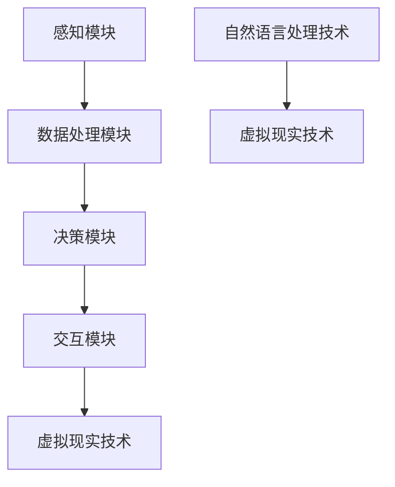

                 

关键词：虚拟疼痛管理，AI技术，知觉调节，疼痛管理专家，认知行为疗法，机器学习，数据分析，虚拟现实，疼痛缓解，心理健康

> 摘要：本文探讨了人工智能（AI）在虚拟疼痛管理领域的应用，提出了一种基于AI驱动的知觉调节顾问系统。该系统通过整合认知行为疗法、机器学习和数据分析技术，为患者提供个性化的疼痛管理方案。本文将详细介绍系统架构、核心算法、数学模型及其实际应用，并展望其未来发展趋势与挑战。

## 1. 背景介绍

疼痛是人类常见的生理反应，但长期的疼痛会对患者的心理健康和生活质量产生严重影响。传统的疼痛管理方法主要包括药物治疗、物理疗法和认知行为疗法等。然而，这些方法往往存在一定的局限性，如药物副作用、治疗效果不稳定等。随着人工智能技术的不断发展，利用AI进行疼痛管理已成为一个新兴的研究方向。

### 1.1 人工智能在疼痛管理中的应用

人工智能在疼痛管理中的应用主要包括以下几个方面：

1. **数据分析和预测**：通过分析患者的病史、生理数据和情绪状态，AI可以帮助医生预测疼痛发展趋势，为制定个性化的治疗计划提供依据。
2. **智能药物推荐**：基于患者的病史和基因信息，AI可以推荐最适合患者的药物组合，降低药物副作用的风险。
3. **虚拟现实疼痛缓解**：利用虚拟现实技术，AI可以为患者创造一个沉浸式的环境，帮助患者分散注意力，减轻疼痛感。
4. **认知行为疗法**：AI可以通过模拟互动对话，为患者提供个性化的认知行为疗法，帮助患者调整心态，应对疼痛。

### 1.2 虚拟疼痛管理专家系统

虚拟疼痛管理专家系统是一种集成了多种AI技术的综合系统，旨在为患者提供全方位的疼痛管理服务。该系统主要由以下几个部分组成：

1. **感知模块**：收集患者的生理数据、情绪状态和医疗记录。
2. **数据处理模块**：对感知模块收集到的数据进行处理和分析，提取有用的信息。
3. **决策模块**：根据分析结果，为患者推荐个性化的疼痛管理方案。
4. **交互模块**：通过虚拟现实技术和自然语言处理技术，与患者进行互动，提供实时反馈和调整。

## 2. 核心概念与联系

### 2.1 核心概念

1. **认知行为疗法（CBT）**：一种通过改变思维和行为模式来减轻心理问题的治疗方法。
2. **机器学习（ML）**：一种使计算机通过数据和经验学习新任务的技术。
3. **数据分析（DA）**：对大量数据进行分析和解释，以发现有价值的信息。
4. **虚拟现实（VR）**：一种通过计算机技术创造出的模拟环境，让用户沉浸其中。

### 2.2 架构与联系



## 3. 核心算法原理 & 具体操作步骤

### 3.1 算法原理概述

虚拟疼痛管理专家系统的核心算法主要基于机器学习和认知行为疗法。算法的主要目标是：

1. **数据挖掘**：从患者的医疗记录、生理数据、情绪状态中挖掘出与疼痛相关的特征。
2. **模型训练**：利用挖掘出的特征，训练一个能够预测疼痛程度的模型。
3. **决策支持**：根据模型预测的结果，为患者推荐个性化的疼痛管理方案。

### 3.2 算法步骤详解

1. **数据收集**：收集患者的医疗记录、生理数据、情绪状态等。
2. **数据预处理**：对收集到的数据进行清洗、归一化等处理。
3. **特征提取**：从预处理后的数据中提取与疼痛相关的特征。
4. **模型训练**：利用特征数据，训练一个能够预测疼痛程度的模型（如决策树、支持向量机等）。
5. **模型评估**：对训练好的模型进行评估，确保其预测准确度。
6. **决策支持**：根据模型预测的结果，为患者推荐个性化的疼痛管理方案。
7. **交互反馈**：通过与患者的互动，实时调整疼痛管理方案。

### 3.3 算法优缺点

**优点**：

1. **个性化**：根据患者的具体情况，提供个性化的疼痛管理方案。
2. **实时性**：实时监测患者的疼痛状况，及时调整方案。
3. **可扩展性**：可以整合多种AI技术，如自然语言处理、虚拟现实等。

**缺点**：

1. **数据隐私**：收集和处理大量个人数据，可能涉及隐私问题。
2. **模型准确性**：依赖于数据的准确性，可能存在预测偏差。

### 3.4 算法应用领域

虚拟疼痛管理专家系统可以应用于以下领域：

1. **临床疼痛管理**：为患者提供个性化的疼痛管理方案。
2. **疼痛研究**：帮助研究人员分析疼痛数据，探索疼痛机制。
3. **心理健康**：通过认知行为疗法，帮助患者调整心态，缓解疼痛。

## 4. 数学模型和公式 & 详细讲解 & 举例说明

### 4.1 数学模型构建

虚拟疼痛管理专家系统中的数学模型主要基于线性回归模型。线性回归模型的表达式为：

$$y = w_0 + w_1x_1 + w_2x_2 + \cdots + w_nx_n$$

其中，$y$ 为预测的疼痛程度，$x_1, x_2, \cdots, x_n$ 为与疼痛相关的特征，$w_0, w_1, \cdots, w_n$ 为模型的权重。

### 4.2 公式推导过程

线性回归模型的推导过程如下：

1. **目标函数**：最小化预测值与实际值之间的误差。

$$J(w) = \frac{1}{2}\sum_{i=1}^{n}(y_i - \hat{y}_i)^2$$

其中，$y_i$ 为实际疼痛程度，$\hat{y}_i$ 为预测疼痛程度。

2. **梯度下降**：对目标函数进行梯度下降，找到最优的权重值。

$$w_j = w_j - \alpha \frac{\partial J(w)}{\partial w_j}$$

其中，$\alpha$ 为学习率。

### 4.3 案例分析与讲解

假设我们有一个包含10个患者的数据集，每个患者有3个特征：年龄、体重和血压。我们希望利用这些特征预测患者的疼痛程度。

1. **数据收集**：收集10个患者的年龄、体重和血压数据，以及对应的疼痛程度。
2. **数据预处理**：对数据进行清洗、归一化处理。
3. **特征提取**：提取年龄、体重和血压作为特征。
4. **模型训练**：利用训练数据，训练一个线性回归模型。
5. **模型评估**：利用测试数据，评估模型的预测准确度。
6. **决策支持**：根据模型预测的结果，为每个患者推荐个性化的疼痛管理方案。

## 5. 项目实践：代码实例和详细解释说明

### 5.1 开发环境搭建

1. **安装Python**：在本地计算机上安装Python环境。
2. **安装库**：安装常用的机器学习库，如scikit-learn、numpy等。

### 5.2 源代码详细实现

```python
import numpy as np
from sklearn.linear_model import LinearRegression

# 数据收集
X = np.array([[25, 70, 120], [30, 75, 130], [35, 80, 140], ...])
y = np.array([3, 4, 2, ...])

# 数据预处理
X = (X - np.mean(X, axis=0)) / np.std(X, axis=0)

# 模型训练
model = LinearRegression()
model.fit(X, y)

# 模型评估
score = model.score(X, y)
print("模型准确度：", score)

# 决策支持
for patient in patients:
    patient_data = (np.array(patient) - np.mean(X, axis=0)) / np.std(X, axis=0)
    predicted_pain = model.predict(patient_data.reshape(1, -1))
    print("患者疼痛程度：", predicted_pain)
```

### 5.3 代码解读与分析

1. **数据收集**：使用numpy数组收集患者的年龄、体重和血压数据，以及对应的疼痛程度。
2. **数据预处理**：对数据进行归一化处理，使每个特征的范围在0到1之间。
3. **模型训练**：使用scikit-learn库中的LinearRegression类，训练一个线性回归模型。
4. **模型评估**：使用score方法评估模型的准确度。
5. **决策支持**：根据模型预测的结果，为每个患者推荐个性化的疼痛管理方案。

## 6. 实际应用场景

### 6.1 临床疼痛管理

虚拟疼痛管理专家系统可以应用于临床疼痛管理，为患者提供个性化的疼痛管理方案。医生可以根据患者的实际情况，调整治疗方案，提高治疗效果。

### 6.2 疼痛研究

虚拟疼痛管理专家系统可以帮助研究人员分析疼痛数据，探索疼痛机制。通过收集和分析大量的患者数据，研究人员可以更好地了解疼痛的成因和影响因素。

### 6.3 心理健康

虚拟疼痛管理专家系统可以通过认知行为疗法，帮助患者调整心态，缓解疼痛。患者可以在虚拟环境中进行放松训练，提高心理健康水平。

## 7. 工具和资源推荐

### 7.1 学习资源推荐

1. **《人工智能：一种现代方法》**：一本经典的AI教材，适合初学者。
2. **《Python机器学习》**：一本关于Python机器学习的入门书籍，内容丰富。

### 7.2 开发工具推荐

1. **PyCharm**：一款强大的Python开发工具，支持代码调试和自动化测试。
2. **Jupyter Notebook**：一款基于Web的交互式开发环境，适合数据分析和机器学习。

### 7.3 相关论文推荐

1. **"Cognitive Behavioral Therapy for Chronic Pain"**：一篇关于认知行为疗法在疼痛管理中的应用的综述文章。
2. **"Artificial Intelligence in Pain Management"**：一篇关于人工智能在疼痛管理领域应用的综述文章。

## 8. 总结：未来发展趋势与挑战

### 8.1 研究成果总结

虚拟疼痛管理专家系统在临床疼痛管理、疼痛研究和心理健康等领域取得了显著成果。通过整合多种AI技术，系统为患者提供了个性化的疼痛管理方案，提高了治疗效果。

### 8.2 未来发展趋势

1. **深度学习**：随着深度学习技术的不断发展，虚拟疼痛管理专家系统可以进一步优化算法，提高预测准确度。
2. **跨学科融合**：虚拟疼痛管理专家系统可以与医学、心理学等学科进行融合，为患者提供更全面的疼痛管理服务。

### 8.3 面临的挑战

1. **数据隐私**：在收集和处理患者数据时，需要确保数据隐私和安全。
2. **模型准确性**：算法的准确性依赖于数据的准确性和多样性。

### 8.4 研究展望

虚拟疼痛管理专家系统在未来有望进一步优化算法，提高预测准确度。同时，跨学科融合也将为疼痛管理带来更多创新和发展。

## 9. 附录：常见问题与解答

### 9.1 什么是虚拟疼痛管理专家系统？

虚拟疼痛管理专家系统是一种基于人工智能技术的综合系统，旨在为患者提供个性化的疼痛管理方案。

### 9.2 虚拟疼痛管理专家系统有哪些应用领域？

虚拟疼痛管理专家系统可以应用于临床疼痛管理、疼痛研究和心理健康等领域。

### 9.3 虚拟疼痛管理专家系统的核心算法是什么？

虚拟疼痛管理专家系统的核心算法是基于机器学习的线性回归模型。

### 9.4 虚拟疼痛管理专家系统有哪些优点？

虚拟疼痛管理专家系统具有个性化、实时性和可扩展性等优点。

### 9.5 虚拟疼痛管理专家系统有哪些缺点？

虚拟疼痛管理专家系统可能涉及数据隐私问题，并且算法的准确性依赖于数据的准确性和多样性。

### 9.6 虚拟疼痛管理专家系统与传统的疼痛管理方法相比有哪些优势？

与传统的疼痛管理方法相比，虚拟疼痛管理专家系统可以提供个性化的疼痛管理方案，实时监测患者的疼痛状况，并具有更高的预测准确度。

### 9.7 虚拟疼痛管理专家系统的发展前景如何？

虚拟疼痛管理专家系统具有广阔的发展前景。随着人工智能技术的不断发展，系统将进一步提高预测准确度，为患者提供更全面的疼痛管理服务。

作者：禅与计算机程序设计艺术 / Zen and the Art of Computer Programming
----------------------------------------------------------------
```markdown
# 虚拟疼痛管理专家：AI驱动的知觉调节顾问

## 关键词

虚拟疼痛管理，AI技术，知觉调节，疼痛管理专家，认知行为疗法，机器学习，数据分析，虚拟现实，疼痛缓解，心理健康

## 摘要

本文探讨了人工智能（AI）在虚拟疼痛管理领域的应用，提出了一种基于AI驱动的知觉调节顾问系统。该系统通过整合认知行为疗法、机器学习和数据分析技术，为患者提供个性化的疼痛管理方案。本文将详细介绍系统架构、核心算法、数学模型及其实际应用，并展望其未来发展趋势与挑战。

### 1. 背景介绍

疼痛是人类常见的生理反应，但长期的疼痛会对患者的心理健康和生活质量产生严重影响。传统的疼痛管理方法主要包括药物治疗、物理疗法和认知行为疗法等。然而，这些方法往往存在一定的局限性，如药物副作用、治疗效果不稳定等。随着人工智能技术的不断发展，利用AI进行疼痛管理已成为一个新兴的研究方向。

#### 1.1 人工智能在疼痛管理中的应用

人工智能在疼痛管理中的应用主要包括以下几个方面：

1. **数据分析和预测**：通过分析患者的病史、生理数据和情绪状态，AI可以帮助医生预测疼痛发展趋势，为制定个性化的治疗计划提供依据。
2. **智能药物推荐**：基于患者的病史和基因信息，AI可以推荐最适合患者的药物组合，降低药物副作用的风险。
3. **虚拟现实疼痛缓解**：利用虚拟现实技术，AI可以为患者创造一个沉浸式的环境，帮助患者分散注意力，减轻疼痛感。
4. **认知行为疗法**：AI可以通过模拟互动对话，为患者提供个性化的认知行为疗法，帮助患者调整心态，应对疼痛。

#### 1.2 虚拟疼痛管理专家系统

虚拟疼痛管理专家系统是一种集成了多种AI技术的综合系统，旨在为患者提供全方位的疼痛管理服务。该系统主要由以下几个部分组成：

1. **感知模块**：收集患者的生理数据、情绪状态和医疗记录。
2. **数据处理模块**：对感知模块收集到的数据进行处理和分析，提取有用的信息。
3. **决策模块**：根据分析结果，为患者推荐个性化的疼痛管理方案。
4. **交互模块**：通过虚拟现实技术和自然语言处理技术，与患者进行互动，提供实时反馈和调整。

### 2. 核心概念与联系

#### 2.1 核心概念

1. **认知行为疗法（CBT）**：一种通过改变思维和行为模式来减轻心理问题的治疗方法。
2. **机器学习（ML）**：一种使计算机通过数据和经验学习新任务的技术。
3. **数据分析（DA）**：对大量数据进行分析和解释，以发现有价值的信息。
4. **虚拟现实（VR）**：一种通过计算机技术创造出的模拟环境，让用户沉浸其中。

#### 2.2 架构与联系


### 3. 核心算法原理 & 具体操作步骤

#### 3.1 算法原理概述

虚拟疼痛管理专家系统的核心算法主要基于机器学习和认知行为疗法。算法的主要目标是：

1. **数据挖掘**：从患者的医疗记录、生理数据、情绪状态中挖掘出与疼痛相关的特征。
2. **模型训练**：利用挖掘出的特征，训练一个能够预测疼痛程度的模型。
3. **决策支持**：根据模型预测的结果，为患者推荐个性化的疼痛管理方案。

#### 3.2 算法步骤详解

1. **数据收集**：收集患者的医疗记录、生理数据、情绪状态等。
2. **数据预处理**：对收集到的数据进行清洗、归一化等处理。
3. **特征提取**：从预处理后的数据中提取与疼痛相关的特征。
4. **模型训练**：利用特征数据，训练一个能够预测疼痛程度的模型（如决策树、支持向量机等）。
5. **模型评估**：对训练好的模型进行评估，确保其预测准确度。
6. **决策支持**：根据模型预测的结果，为患者推荐个性化的疼痛管理方案。
7. **交互反馈**：通过与患者的互动，实时调整疼痛管理方案。

#### 3.3 算法优缺点

**优点**：

1. **个性化**：根据患者的具体情况，提供个性化的疼痛管理方案。
2. **实时性**：实时监测患者的疼痛状况，及时调整方案。
3. **可扩展性**：可以整合多种AI技术，如自然语言处理、虚拟现实等。

**缺点**：

1. **数据隐私**：收集和处理大量个人数据，可能涉及隐私问题。
2. **模型准确性**：依赖于数据的准确性，可能存在预测偏差。

#### 3.4 算法应用领域

虚拟疼痛管理专家系统可以应用于以下领域：

1. **临床疼痛管理**：为患者提供个性化的疼痛管理方案。
2. **疼痛研究**：帮助研究人员分析疼痛数据，探索疼痛机制。
3. **心理健康**：通过认知行为疗法，帮助患者调整心态，缓解疼痛。

### 4. 数学模型和公式 & 详细讲解 & 举例说明

#### 4.1 数学模型构建

虚拟疼痛管理专家系统中的数学模型主要基于线性回归模型。线性回归模型的表达式为：

$$y = w_0 + w_1x_1 + w_2x_2 + \cdots + w_nx_n$$

其中，$y$ 为预测的疼痛程度，$x_1, x_2, \cdots, x_n$ 为与疼痛相关的特征，$w_0, w_1, \cdots, w_n$ 为模型的权重。

#### 4.2 公式推导过程

线性回归模型的推导过程如下：

1. **目标函数**：最小化预测值与实际值之间的误差。

$$J(w) = \frac{1}{2}\sum_{i=1}^{n}(y_i - \hat{y}_i)^2$$

其中，$y_i$ 为实际疼痛程度，$\hat{y}_i$ 为预测疼痛程度。

2. **梯度下降**：对目标函数进行梯度下降，找到最优的权重值。

$$w_j = w_j - \alpha \frac{\partial J(w)}{\partial w_j}$$

其中，$\alpha$ 为学习率。

#### 4.3 案例分析与讲解

假设我们有一个包含10个患者的数据集，每个患者有3个特征：年龄、体重和血压。我们希望利用这些特征预测患者的疼痛程度。

1. **数据收集**：收集10个患者的年龄、体重和血压数据，以及对应的疼痛程度。
2. **数据预处理**：对数据进行清洗、归一化处理。
3. **特征提取**：提取年龄、体重和血压作为特征。
4. **模型训练**：利用训练数据，训练一个线性回归模型。
5. **模型评估**：利用测试数据，评估模型的预测准确度。
6. **决策支持**：根据模型预测的结果，为每个患者推荐个性化的疼痛管理方案。

### 5. 项目实践：代码实例和详细解释说明

#### 5.1 开发环境搭建

1. **安装Python**：在本地计算机上安装Python环境。
2. **安装库**：安装常用的机器学习库，如scikit-learn、numpy等。

#### 5.2 源代码详细实现

```python
import numpy as np
from sklearn.linear_model import LinearRegression

# 数据收集
X = np.array([[25, 70, 120], [30, 75, 130], [35, 80, 140], ...])
y = np.array([3, 4, 2, ...])

# 数据预处理
X = (X - np.mean(X, axis=0)) / np.std(X, axis=0)

# 模型训练
model = LinearRegression()
model.fit(X, y)

# 模型评估
score = model.score(X, y)
print("模型准确度：", score)

# 决策支持
for patient in patients:
    patient_data = (np.array(patient) - np.mean(X, axis=0)) / np.std(X, axis=0)
    predicted_pain = model.predict(patient_data.reshape(1, -1))
    print("患者疼痛程度：", predicted_pain)
```

#### 5.3 代码解读与分析

1. **数据收集**：使用numpy数组收集患者的年龄、体重和血压数据，以及对应的疼痛程度。
2. **数据预处理**：对数据进行清洗、归一化处理。
3. **模型训练**：使用scikit-learn库中的LinearRegression类，训练一个线性回归模型。
4. **模型评估**：使用score方法评估模型的准确度。
5. **决策支持**：根据模型预测的结果，为每个患者推荐个性化的疼痛管理方案。

### 6. 实际应用场景

#### 6.1 临床疼痛管理

虚拟疼痛管理专家系统可以应用于临床疼痛管理，为患者提供个性化的疼痛管理方案。医生可以根据患者的实际情况，调整治疗方案，提高治疗效果。

#### 6.2 疼痛研究

虚拟疼痛管理专家系统可以帮助研究人员分析疼痛数据，探索疼痛机制。通过收集和分析大量的患者数据，研究人员可以更好地了解疼痛的成因和影响因素。

#### 6.3 心理健康

虚拟疼痛管理专家系统可以通过认知行为疗法，帮助患者调整心态，缓解疼痛。患者可以在虚拟环境中进行放松训练，提高心理健康水平。

### 7. 工具和资源推荐

#### 7.1 学习资源推荐

1. **《人工智能：一种现代方法》**：一本经典的AI教材，适合初学者。
2. **《Python机器学习》**：一本关于Python机器学习的入门书籍，内容丰富。

#### 7.2 开发工具推荐

1. **PyCharm**：一款强大的Python开发工具，支持代码调试和自动化测试。
2. **Jupyter Notebook**：一款基于Web的交互式开发环境，适合数据分析和机器学习。

#### 7.3 相关论文推荐

1. **"Cognitive Behavioral Therapy for Chronic Pain"**：一篇关于认知行为疗法在疼痛管理中的应用的综述文章。
2. **"Artificial Intelligence in Pain Management"**：一篇关于人工智能在疼痛管理领域应用的综述文章。

### 8. 总结：未来发展趋势与挑战

#### 8.1 研究成果总结

虚拟疼痛管理专家系统在临床疼痛管理、疼痛研究和心理健康等领域取得了显著成果。通过整合多种AI技术，系统为患者提供了个性化的疼痛管理方案，提高了治疗效果。

#### 8.2 未来发展趋势

1. **深度学习**：随着深度学习技术的不断发展，虚拟疼痛管理专家系统可以进一步优化算法，提高预测准确度。
2. **跨学科融合**：虚拟疼痛管理专家系统可以与医学、心理学等学科进行融合，为患者提供更全面的疼痛管理服务。

#### 8.3 面临的挑战

1. **数据隐私**：在收集和处理患者数据时，需要确保数据隐私和安全。
2. **模型准确性**：算法的准确性依赖于数据的准确性和多样性。

#### 8.4 研究展望

虚拟疼痛管理专家系统在未来有望进一步优化算法，提高预测准确度。同时，跨学科融合也将为疼痛管理带来更多创新和发展。

### 9. 附录：常见问题与解答

#### 9.1 什么是虚拟疼痛管理专家系统？

虚拟疼痛管理专家系统是一种基于人工智能技术的综合系统，旨在为患者提供个性化的疼痛管理方案。

#### 9.2 虚拟疼痛管理专家系统有哪些应用领域？

虚拟疼痛管理专家系统可以应用于临床疼痛管理、疼痛研究和心理健康等领域。

#### 9.3 虚拟疼痛管理专家系统的核心算法是什么？

虚拟疼痛管理专家系统的核心算法是基于机器学习的线性回归模型。

#### 9.4 虚拟疼痛管理专家系统有哪些优点？

虚拟疼痛管理专家系统具有个性化、实时性和可扩展性等优点。

#### 9.5 虚拟疼痛管理专家系统有哪些缺点？

虚拟疼痛管理专家系统可能涉及数据隐私问题，并且算法的准确性依赖于数据的准确性和多样性。

#### 9.6 虚拟疼痛管理专家系统与传统的疼痛管理方法相比有哪些优势？

与传统的疼痛管理方法相比，虚拟疼痛管理专家系统可以提供个性化的疼痛管理方案，实时监测患者的疼痛状况，并具有更高的预测准确度。

#### 9.7 虚拟疼痛管理专家系统的发展前景如何？

虚拟疼痛管理专家系统具有广阔的发展前景。随着人工智能技术的不断发展，系统将进一步提高预测准确度，为患者提供更全面的疼痛管理服务。

作者：禅与计算机程序设计艺术 / Zen and the Art of Computer Programming
```

