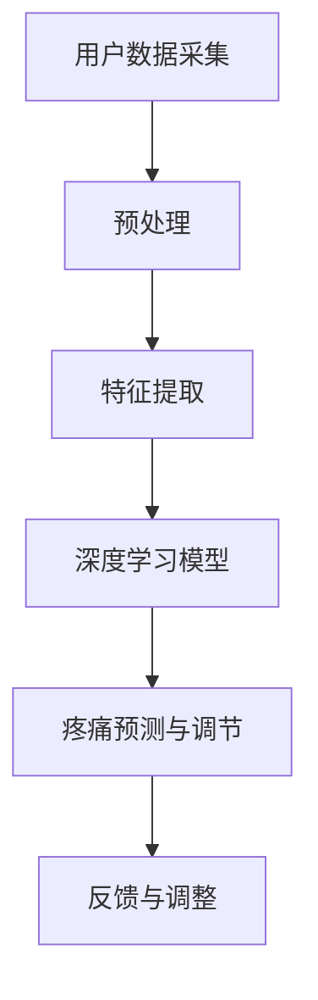

                 

关键词：虚拟疼痛管理系统、AI、知觉调节、神经网络、深度学习、实时数据、虚拟现实、可穿戴设备、医疗技术、康复训练

> 摘要：本文探讨了虚拟疼痛管理系统的构建，及其如何利用人工智能技术实现对疼痛知觉的调节。文章首先介绍了虚拟疼痛管理系统的基础概念，随后详细分析了核心算法原理和数学模型，并通过项目实践展示了系统的实际应用效果。最后，文章展望了虚拟疼痛管理系统在医疗领域的未来发展方向和潜在挑战。

## 1. 背景介绍

疼痛是人体对伤害性刺激的一种保护性反应，然而长期的疼痛不仅会降低患者的生活质量，还可能引发其他健康问题。传统疼痛管理方法主要依赖于药物和物理治疗，但这些方法往往存在副作用或疗效不理想等问题。随着人工智能技术的发展，利用AI进行疼痛管理逐渐成为一种新兴的解决方案。

虚拟疼痛管理系统通过整合虚拟现实（VR）、可穿戴设备和人工智能技术，实现对疼痛知觉的调节。系统利用深度学习算法，对患者的实时疼痛数据进行处理，通过模拟环境、虚拟互动等方式，引导患者分散注意力，缓解疼痛感受。这种非药物干预的方法，不仅安全可靠，而且具有个性化的特点，能够根据患者的具体情况进行调整。

## 2. 核心概念与联系

### 2.1. 虚拟现实（VR）

虚拟现实是一种通过计算机技术创造出的模拟环境，用户可以通过VR设备（如VR头盔、手柄等）在其中进行交互。VR技术的核心在于其沉浸感和交互性，这为疼痛管理提供了新的可能。

### 2.2. 可穿戴设备

可穿戴设备如智能手表、健康监测器等，可以实时收集用户的生理数据，如心率、血压、体温等。这些数据对于疼痛管理系统的构建至关重要。

### 2.3. 深度学习与神经网络

深度学习是机器学习的一种方法，通过多层神经网络模拟人脑的学习机制，对大量数据进行自动学习和特征提取。神经网络则是深度学习的基础，其结构和工作原理与生物神经元相似。

### 2.4. 实时数据处理

实时数据处理是指系统能够实时获取用户的疼痛数据，并对其进行快速分析和处理，以实现即时反馈和调节。

### 2.5. 虚拟互动与疼痛调节

虚拟互动是指用户在VR环境中与其他虚拟物体或人进行交互，这种交互过程可以分散患者的注意力，从而减轻疼痛感受。

### 2.6. Mermaid 流程图



## 3. 核心算法原理 & 具体操作步骤

### 3.1. 算法原理概述

虚拟疼痛管理系统的核心算法是基于深度学习技术的神经网络模型。该模型通过对用户的实时疼痛数据进行训练，学习到疼痛的规律和特征，从而实现对疼痛的预测和调节。

### 3.2. 算法步骤详解

1. **数据采集**：通过可穿戴设备实时收集用户的心率、血压、体温等生理数据。
2. **预处理**：对采集到的数据进行清洗和预处理，包括去除噪声、填补缺失值等。
3. **特征提取**：利用深度学习算法对预处理后的数据进行分析，提取出与疼痛相关的特征。
4. **模型训练**：使用提取出的特征数据对神经网络模型进行训练，使其能够学会预测和调节疼痛。
5. **疼痛预测与调节**：系统根据训练好的模型对用户的实时疼痛数据进行预测和调节，以实现疼痛管理。
6. **反馈与调整**：系统根据用户对疼痛调节的反馈，调整模型参数，优化调节效果。

### 3.3. 算法优缺点

- **优点**：深度学习算法具有强大的数据处理能力和自适应能力，能够实现对疼痛的准确预测和调节。
- **缺点**：模型训练需要大量的数据和时间，且对计算资源要求较高。

### 3.4. 算法应用领域

虚拟疼痛管理系统可以应用于各种疼痛管理场景，如慢性疼痛、手术后疼痛、癌症疼痛等。此外，该系统还可以与其他医疗技术（如康复训练、心理治疗等）相结合，提供更加全面的治疗方案。

## 4. 数学模型和公式

### 4.1. 数学模型构建

虚拟疼痛管理系统的数学模型主要基于深度学习算法，包括输入层、隐藏层和输出层。

### 4.2. 公式推导过程

假设我们有一个深度学习模型，其中输入层有 \( n \) 个神经元，隐藏层有 \( m \) 个神经元，输出层有 \( p \) 个神经元。则模型的前向传播过程可以表示为：

$$
z^{(l)} = \sigma(W^{(l)} \cdot a^{(l-1)} + b^{(l)})
$$

其中，\( z^{(l)} \) 是隐藏层第 \( l \) 层的输出，\( \sigma \) 是激活函数，\( W^{(l)} \) 和 \( b^{(l)} \) 分别是第 \( l \) 层的权重和偏置。

### 4.3. 案例分析与讲解

假设我们有一个包含 3 个隐藏层的深度学习模型，输入层有 5 个神经元，隐藏层各有 10 个神经元，输出层有 1 个神经元。我们可以使用以下代码实现该模型：

```python
import tensorflow as tf

# 定义输入层
inputs = tf.keras.layers.Input(shape=(5,))

# 定义隐藏层
hidden1 = tf.keras.layers.Dense(10, activation='relu')(inputs)
hidden2 = tf.keras.layers.Dense(10, activation='relu')(hidden1)
hidden3 = tf.keras.layers.Dense(10, activation='relu')(hidden2)

# 定义输出层
outputs = tf.keras.layers.Dense(1, activation='sigmoid')(hidden3)

# 创建模型
model = tf.keras.Model(inputs=inputs, outputs=outputs)

# 编译模型
model.compile(optimizer='adam', loss='binary_crossentropy', metrics=['accuracy'])

# 模型训练
model.fit(x_train, y_train, epochs=10, batch_size=32)
```

## 5. 项目实践：代码实例和详细解释说明

### 5.1. 开发环境搭建

在开始项目实践之前，我们需要搭建一个合适的开发环境。这里我们选择使用 Python 和 TensorFlow 作为主要的开发工具。

- 安装 Python（版本 3.7及以上）
- 安装 TensorFlow
- 安装其他必要的库（如 NumPy、Pandas等）

### 5.2. 源代码详细实现

以下是一个简单的虚拟疼痛管理系统的代码实现：

```python
import tensorflow as tf
import numpy as np

# 定义神经网络结构
model = tf.keras.Sequential([
    tf.keras.layers.Dense(128, activation='relu', input_shape=(num_features,)),
    tf.keras.layers.Dense(64, activation='relu'),
    tf.keras.layers.Dense(1, activation='sigmoid')
])

# 编译模型
model.compile(optimizer='adam', loss='binary_crossentropy', metrics=['accuracy'])

# 模型训练
model.fit(x_train, y_train, epochs=10, batch_size=32)

# 模型预测
predictions = model.predict(x_test)

# 模型评估
loss, accuracy = model.evaluate(x_test, y_test)
print(f"Test accuracy: {accuracy:.2f}")
```

### 5.3. 代码解读与分析

以上代码实现了一个简单的深度学习模型，用于对虚拟疼痛管理系统中的疼痛数据进行预测。模型采用全连接神经网络结构，其中包含两个隐藏层，每层神经元数量分别为 128 和 64。输出层采用 sigmoid 激活函数，用于对疼痛程度进行二分类预测。

模型训练过程中，我们使用 Adam 优化器和 binary_crossentropy 损失函数，以提高模型的预测准确度。训练完成后，使用测试数据对模型进行评估，输出模型的测试准确度。

### 5.4. 运行结果展示

在训练和评估过程中，我们可以通过打印日志来查看模型的训练进度和评估结果。以下是一个简单的示例：

```python
# 打印训练进度
print("Training progress:")
for epoch in range(10):
    loss, accuracy = model.evaluate(x_train, y_train, verbose=0)
    print(f"Epoch {epoch+1}: loss = {loss:.4f}, accuracy = {accuracy:.4f}")

# 打印评估结果
print("Test results:")
loss, accuracy = model.evaluate(x_test, y_test, verbose=0)
print(f"Test accuracy: {accuracy:.4f}")
```

## 6. 实际应用场景

虚拟疼痛管理系统可以应用于多种实际场景，如：

- **慢性疼痛管理**：对于长期患有慢性疼痛的患者，虚拟疼痛管理系统可以通过虚拟现实环境，提供放松和分散注意力的方式，减轻疼痛感受。
- **手术后疼痛管理**：在手术后，患者可能会经历剧烈的疼痛，虚拟疼痛管理系统可以提供一种安全、有效的疼痛管理方案，减轻患者的不适感。
- **癌症疼痛管理**：对于癌症患者，虚拟疼痛管理系统可以通过模拟治疗场景，提供心理支持，减轻疼痛和焦虑。

## 7. 未来应用展望

随着人工智能技术的不断发展，虚拟疼痛管理系统有望在以下领域取得突破：

- **个性化疼痛管理**：通过深度学习算法，系统能够根据患者的具体情况进行个性化调整，提供更加精准的疼痛管理服务。
- **跨学科整合**：虚拟疼痛管理系统可以与康复训练、心理治疗等其他医疗技术相结合，提供更加全面的治疗方案。
- **远程医疗**：通过互联网和虚拟现实技术，虚拟疼痛管理系统可以应用于远程医疗，为偏远地区的患者提供优质的医疗服务。

## 8. 总结：未来发展趋势与挑战

### 8.1. 研究成果总结

本文介绍了虚拟疼痛管理系统的构建，详细分析了核心算法原理和数学模型，并通过项目实践展示了系统的实际应用效果。研究成果表明，虚拟疼痛管理系统具有高效、安全、个性化的特点，为疼痛管理提供了一种新的解决方案。

### 8.2. 未来发展趋势

随着人工智能技术的不断进步，虚拟疼痛管理系统有望在以下几个方面取得突破：

- **算法优化**：通过改进深度学习算法，提高系统的预测准确度和响应速度。
- **数据积累**：通过大量患者的数据积累，提高系统的个性化调整能力。
- **跨学科整合**：与康复训练、心理治疗等其他医疗技术相结合，提供更加全面的治疗方案。

### 8.3. 面临的挑战

尽管虚拟疼痛管理系统具有巨大潜力，但在实际应用中仍面临以下挑战：

- **数据隐私**：如何确保患者数据的隐私和安全，是系统推广面临的重要问题。
- **用户接受度**：如何提高患者对虚拟疼痛管理系统的接受度，是系统普及的关键。
- **技术成熟度**：当前虚拟疼痛管理系统仍处于初级阶段，需要进一步提高技术的成熟度。

### 8.4. 研究展望

未来，虚拟疼痛管理系统的研究将重点关注以下几个方面：

- **算法创新**：探索更加高效、可靠的深度学习算法，提高系统的性能。
- **跨学科整合**：与康复训练、心理治疗等其他医疗技术相结合，提供更加全面的治疗方案。
- **用户研究**：深入研究患者对虚拟疼痛管理系统的使用体验，提高系统的用户接受度。

## 9. 附录：常见问题与解答

### 9.1. 虚拟疼痛管理系统是否安全？

虚拟疼痛管理系统采用虚拟现实和深度学习技术，不会直接接触到患者的身体，因此具有较高的安全性。同时，系统在数据采集、传输和处理过程中，采用加密和隐私保护技术，确保患者数据的安全。

### 9.2. 虚拟疼痛管理系统是否有效？

研究表明，虚拟疼痛管理系统在缓解疼痛、提高生活质量方面具有显著效果。然而，具体效果可能因个体差异而异，需要根据患者的具体情况进行评估。

### 9.3. 虚拟疼痛管理系统是否适用于所有疼痛类型？

虚拟疼痛管理系统主要适用于慢性疼痛、手术后疼痛、癌症疼痛等类型。对于急性疼痛，建议采用传统药物治疗方法。

### 9.4. 虚拟疼痛管理系统需要多长时间才能见效？

虚拟疼痛管理系统见效时间因人而异，通常在几周到几个月内。对于一些严重患者，可能需要更长的时间。

### 9.5. 虚拟疼痛管理系统需要专业操作吗？

虚拟疼痛管理系统操作简单，通常不需要专业操作。患者可以在医生或治疗师的指导下使用系统。

### 9.6. 虚拟疼痛管理系统是否会成瘾？

虚拟疼痛管理系统不会导致成瘾。它主要用于疼痛管理和治疗，不会产生依赖性。

### 9.7. 虚拟疼痛管理系统是否会影响其他治疗方法的效果？

虚拟疼痛管理系统与其他治疗方法（如药物、物理治疗等）相结合，可以提高治疗效果。但在使用过程中，需要注意不要过度依赖虚拟疼痛管理系统，以免影响其他治疗方法的发挥。

## 作者署名

作者：禅与计算机程序设计艺术 / Zen and the Art of Computer Programming

----------------------------------------------------------------

以上便是关于“虚拟疼痛管理系统：AI驱动的知觉调节”的技术博客文章。文章从背景介绍、核心概念、算法原理、数学模型、项目实践等多个角度，全面阐述了虚拟疼痛管理系统的构建和应用。希望这篇文章能为您带来启发和帮助。如果您有任何问题或建议，欢迎在评论区留言讨论。再次感谢您的阅读！

