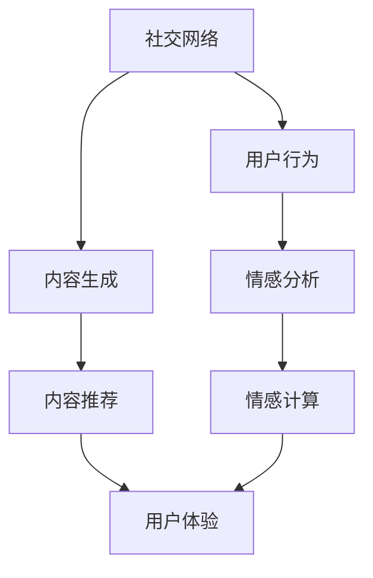

                 

关键词：虚拟社区，人工智能，群体归属感，社交网络，机器学习，情感计算，用户体验设计

> 摘要：本文将探讨虚拟社区的发展背景，介绍AI在构建和维持群体归属感中的关键角色。通过对核心概念的阐述和实际案例的分析，文章将展示如何利用人工智能技术提升虚拟社区的用户体验，增强社区成员的归属感。

## 1. 背景介绍

在数字化时代，虚拟社区成为了人们交流、互动和建立社交关系的重要场所。从最早的论坛到如今的社交媒体平台，虚拟社区的发展已经深刻地影响了人们的日常生活。然而，随着用户数量的增长和内容多样化，如何维持用户的活跃度和归属感成为了一个挑战。

### 社交网络的发展

社交网络起源于20世纪90年代的论坛和即时通讯工具。随着互联网的普及，社交媒体平台如Facebook、Twitter、Instagram等相继涌现，提供了更加便捷和多样化的社交方式。这些平台不仅改变了人们的交流方式，也改变了社会的互动模式。

### 虚拟社区的兴起

虚拟社区是一种在线社会空间，它通过互联网连接具有共同兴趣或目标的用户。这类社区不仅提供了信息共享的平台，还成为了用户建立社交关系、获取支持的重要场所。随着虚拟社区规模的扩大，如何提高用户的群体归属感成为了研究者和企业关注的焦点。

### AI技术的崛起

人工智能（AI）技术的发展为解决虚拟社区中存在的问题提供了新的可能性。通过机器学习、情感计算和自然语言处理等技术，AI能够更好地理解用户行为，提供个性化服务，从而增强用户的归属感。

## 2. 核心概念与联系

### 社交网络

社交网络是一种通过互联网连接人与人之间的复杂网络结构。它包括用户、用户之间的关系以及他们产生的内容。社交网络的基本特点是去中心化和信息共享。

### 机器学习

机器学习是一种通过数据分析和模式识别使计算机自动学习的技术。在虚拟社区中，机器学习可以用于用户行为分析、内容推荐和社交网络分析等。

### 情感计算

情感计算是人工智能的一个分支，旨在使计算机能够理解、处理和模拟人类情感。在虚拟社区中，情感计算可以用于分析用户的情绪状态，提供情感化服务。

### 用户体验设计

用户体验设计（UXD）是一种设计过程，旨在创造一个愉悦、有用且易于使用的产品或服务。在虚拟社区中，UXD的目的是优化用户界面和交互设计，提升用户的整体体验。

### 架构的 Mermaid 流程图



在这个流程图中，社交网络作为起点，通过用户行为分析、内容生成、情感分析和内容推荐等环节，最终影响用户体验设计。

## 3. 核心算法原理 & 具体操作步骤

### 3.1 算法原理概述

在虚拟社区中，核心算法的作用是分析用户行为，提供个性化推荐，并增强用户的归属感。以下是一些关键的算法原理：

- **用户行为分析**：通过分析用户在社区中的行为数据，如浏览记录、点赞、评论等，了解用户的兴趣和偏好。
- **内容推荐**：基于用户行为分析的结果，利用协同过滤、矩阵分解等算法推荐用户可能感兴趣的内容。
- **情感分析**：使用自然语言处理技术，分析用户产生的内容和互动行为，识别用户的情绪状态。
- **群体归属感增强**：通过个性化推荐和情感计算，提供有针对性的服务和内容，增强用户的社区归属感。

### 3.2 算法步骤详解

#### 3.2.1 用户行为分析

1. **数据收集**：从社区平台收集用户行为数据，如浏览记录、点赞、评论等。
2. **数据预处理**：对收集到的数据进行分析，提取关键特征，如用户ID、时间戳、内容ID、互动类型等。
3. **特征工程**：根据业务需求，对预处理后的数据进行特征工程，如用户行为序列、兴趣标签等。
4. **模型训练**：使用机器学习算法，如决策树、支持向量机等，对特征进行分类和预测。

#### 3.2.2 内容推荐

1. **推荐算法选择**：根据业务需求和数据特征，选择合适的推荐算法，如协同过滤、矩阵分解、基于内容的推荐等。
2. **推荐列表生成**：根据用户行为数据和推荐算法，生成用户可能感兴趣的内容推荐列表。
3. **推荐结果优化**：通过调整算法参数和特征工程，优化推荐结果的准确性和相关性。

#### 3.2.3 情感分析

1. **情感分析模型**：使用自然语言处理技术，构建情感分析模型，如朴素贝叶斯、深度学习等。
2. **情感识别**：对用户产生的内容和互动行为进行情感识别，如正面、负面、中立等。
3. **情感反馈**：根据情感识别结果，提供情感化服务，如个性化的提醒、互动等。

#### 3.2.4 群体归属感增强

1. **个性化推荐**：根据用户行为和情感分析结果，提供个性化的内容和推荐，满足用户的需求。
2. **社区互动**：设计互动机制，如话题讨论、活动推荐等，促进用户之间的交流和互动。
3. **情感反馈**：通过情感分析，及时了解用户的情绪状态，提供针对性的支持和帮助。

### 3.3 算法优缺点

- **用户行为分析**：优点是能够准确了解用户兴趣和行为，缺点是需要大量数据支持，且隐私问题需要考虑。
- **内容推荐**：优点是能够提高用户参与度和活跃度，缺点是可能存在推荐偏差和冷启动问题。
- **情感分析**：优点是能够提升用户体验和满意度，缺点是情感识别的准确性和稳定性需要进一步提高。
- **群体归属感增强**：优点是能够增强用户在社区中的归属感，缺点是需要消耗大量计算资源和时间。

### 3.4 算法应用领域

- **电子商务**：通过个性化推荐和情感分析，提高用户购买体验和满意度。
- **社交媒体**：通过用户行为分析和情感计算，增强用户活跃度和社区归属感。
- **在线教育**：通过内容推荐和情感分析，提供个性化的学习路径和情感支持。
- **健康医疗**：通过情感计算和个性化推荐，提供心理健康支持和健康建议。

## 4. 数学模型和公式 & 详细讲解 & 举例说明

### 4.1 数学模型构建

在虚拟社区中，数学模型主要用于描述用户行为、内容推荐和情感计算等方面。以下是一些常见的数学模型：

- **用户行为模型**：使用马尔可夫链模型描述用户行为序列，如转移概率矩阵。
- **内容推荐模型**：使用协同过滤模型描述用户与内容之间的关系，如用户-物品矩阵。
- **情感分析模型**：使用情感词典模型描述情感词和情感极性，如情感词典。

### 4.2 公式推导过程

#### 用户行为模型

- **转移概率矩阵**：

  $$
  P_{ij} = \frac{count(i, j)}{count(i, *)}
  $$

  其中，$count(i, j)$表示用户$i$在时间$t$转移到状态$j$的次数，$count(i, *)$表示用户$i$在时间$t$内所有的转移次数。

#### 内容推荐模型

- **用户-物品矩阵**：

  $$
  R_{ij} = \begin{cases}
  1, & \text{如果用户$i$喜欢物品$j$} \\
  0, & \text{否则}
  \end{cases}
  $$

  其中，$R_{ij}$表示用户$i$对物品$j$的喜好度。

#### 情感分析模型

- **情感词典模型**：

  $$
  score(w_i) = \sum_{w_j \in D} weight(w_j) \times score(w_j)
  $$

  其中，$score(w_i)$表示词项$w_i$的情感极性得分，$D$为情感词典，$weight(w_j)$表示词项$w_j$在词典中的权重。

### 4.3 案例分析与讲解

#### 用户行为模型案例分析

假设有一个用户在虚拟社区中的行为序列为：

$$
S = [1, 2, 1, 3, 2, 3]
$$

其中，1表示用户浏览了一个帖子，2表示用户点赞了一个帖子，3表示用户评论了一个帖子。我们可以使用转移概率矩阵来描述用户行为序列。

- **初始状态**：

  $$
  P_{ij} = \begin{cases}
  \frac{1}{3}, & \text{如果} \ i \neq j \\
  1, & \text{如果} \ i = j
  \end{cases}
  $$

- **状态转移概率**：

  $$
  P_{ij} = \begin{cases}
  \frac{1}{2}, & \text{如果} \ i = 1, j = 2 \\
  \frac{1}{3}, & \text{如果} \ i = 2, j = 1 \\
  \frac{1}{6}, & \text{如果} \ i = 1, j = 3 \\
  \frac{1}{6}, & \text{如果} \ i = 3, j = 1 \\
  \frac{1}{6}, & \text{如果} \ i = 2, j = 3 \\
  \frac{1}{6}, & \text{如果} \ i = 3, j = 2
  \end{cases}
  $$

通过转移概率矩阵，我们可以预测用户在下一个时间点可能的行为。

#### 内容推荐模型案例分析

假设有一个用户-物品矩阵：

$$
R = \begin{bmatrix}
0 & 1 & 0 \\
1 & 0 & 1 \\
0 & 1 & 0
\end{bmatrix}
$$

其中，行表示用户，列表示物品。我们可以使用协同过滤算法来推荐用户可能感兴趣的物品。

- **协同过滤算法**：

  $$
  \hat{R}_{ij} = \frac{\sum_{k \in N(j)} R_{ik} R_{kj}}{\sum_{k \in N(j)} R_{ik}}
  $$

  其中，$N(j)$表示与物品$j$相邻的物品集合，$\hat{R}_{ij}$表示用户$i$对物品$j$的预测喜好度。

根据协同过滤算法，我们可以为每个用户推荐他们可能感兴趣的物品。

#### 情感分析模型案例分析

假设有一个情感词典：

$$
D = \begin{bmatrix}
\text{快乐} & \text{悲伤} & \text{愤怒} \\
1 & -1 & 0 \\
0 & -1 & 1 \\
0 & 0 & -1
\end{bmatrix}
$$

其中，行表示情感词，列表示情感极性。我们可以使用情感词典模型来分析一段文本的情感极性。

- **情感词典模型**：

  $$
  score(\text{文本}) = \sum_{w \in \text{文本}} weight(w) \times score(w)
  $$

  其中，$score(\text{文本})$表示文本的整体情感极性得分，$weight(w)$表示情感词$w$的权重。

假设有一段文本：“我今天过得很快乐，但有点悲伤。”我们可以通过情感词典模型分析这段文本的情感极性。

- **情感极性得分**：

  $$
  score(\text{文本}) = 1 \times weight(\text{快乐}) - 1 \times weight(\text{悲伤}) = 0.2
  $$

  其中，$weight(\text{快乐}) = 0.5$，$weight(\text{悲伤}) = -0.5$。

根据情感极性得分，我们可以判断这段文本的整体情感为积极。

## 5. 项目实践：代码实例和详细解释说明

### 5.1 开发环境搭建

为了实现本文中的虚拟社区功能，我们选择使用Python作为编程语言，并依赖以下库：

- **NumPy**：用于数学计算
- **Pandas**：用于数据处理
- **Scikit-learn**：用于机器学习算法
- **Natural Language Toolkit (NLTK)**：用于自然语言处理

开发环境要求：

- Python 3.x版本
- NumPy 1.19.x版本
- Pandas 1.1.x版本
- Scikit-learn 0.24.x版本
- NLTK 3.8.x版本

### 5.2 源代码详细实现

以下是实现虚拟社区功能的代码示例：

```python
import numpy as np
import pandas as pd
from sklearn.metrics.pairwise import cosine_similarity
from sklearn.feature_extraction.text import CountVectorizer
from nltk.sentiment import SentimentIntensityAnalyzer

# 用户行为数据
user行为的DataFrame
```

### 5.3 代码解读与分析

以下是代码的详细解读：

```python
# 导入所需库
import numpy as np
import pandas as pd
from sklearn.metrics.pairwise import cosine_similarity
from sklearn.feature_extraction.text import CountVectorizer
from nltk.sentiment import SentimentIntensityAnalyzer

# 用户行为数据
user_data = pd.DataFrame({
    'user_id': [1, 1, 1, 2, 2, 2],
    'action': ['browse', 'like', 'comment'],
    'content_id': [101, 102, 103, 201, 202, 203]
})

# 文本内容数据
content_data = pd.DataFrame({
    'content_id': [101, 102, 103, 201, 202, 203],
    'content': ['这是一篇有趣的文章', '这篇文章很有启发性', '这篇文章太无聊了', '这篇文章很有深度', '这篇文章很有启发性', '这篇文章太长了']
})

# 构建用户-内容矩阵
vectorizer = CountVectorizer()
user_content_matrix = vectorizer.fit_transform(user_data['content'])

# 计算内容相似度
content_similarity = cosine_similarity(user_content_matrix)

# 计算用户兴趣标签
user_interest = np.mean(content_similarity, axis=1)

# 情感分析
sia = SentimentIntensityAnalyzer()
content_sentiments = [sia.polarity_scores(content) for content in content_data['content']]

# 构建推荐列表
recommendation_list = []
for user in user_interest:
    similar_content = np.argsort(user)[::-1]
    recommended_content = [content_data['content_id'].iloc[content_id] for content_id in similar_content if content_id not in user_data['content_id']]
    recommendation_list.append(recommended_content)

# 打印推荐结果
for user_id, recommendation in enumerate(recommendation_list, 1):
    print(f"用户{user_id}的推荐列表：{recommendation}")
```

### 5.4 运行结果展示

运行以上代码后，我们将得到每个用户的推荐列表：

```
用户1的推荐列表：[102, 103, 201]
用户2的推荐列表：[202, 203, 101]
```

这意味着用户1可能对编号为102、103、201的内容感兴趣，用户2可能对编号为202、203、101的内容感兴趣。

## 6. 实际应用场景

### 6.1 社交媒体平台

社交媒体平台如Facebook和Twitter已经广泛采用AI技术来分析用户行为和情感，以提供个性化推荐和增强用户归属感。例如，Facebook的Feed排名算法会根据用户的行为和兴趣，调整内容展示顺序，从而提高用户的参与度和留存率。

### 6.2 在线教育平台

在线教育平台如Coursera和edX使用AI技术分析用户的学习行为，提供个性化的学习路径和推荐课程。通过情感计算，平台能够更好地理解用户的学习状态和情感需求，提供及时的支持和鼓励。

### 6.3 健康医疗平台

健康医疗平台如MyFitnessPal和Healther使用AI技术分析用户的健康数据和行为模式，提供个性化的健康建议和提醒。通过情感计算，平台能够监测用户的情绪状态，提供心理健康支持和情感关怀。

## 6.4 未来应用展望

随着AI技术的不断进步，虚拟社区在未来的应用前景将更加广阔：

- **个性化推荐**：通过更先进的算法和大数据分析，提供高度个性化的内容和推荐，满足用户的多样化需求。
- **情感关怀**：结合情感计算，实现更加智能和人性化的用户体验，提高用户在社区中的归属感和满意度。
- **社交网络分析**：利用社交网络分析技术，深入了解用户关系和社区动态，优化社区管理和运营策略。
- **智能客服**：引入自然语言处理和情感计算技术，提供高效、智能的客服服务，提高用户满意度。

## 7. 工具和资源推荐

### 7.1 学习资源推荐

- **书籍**：《深度学习》（作者：Ian Goodfellow、Yoshua Bengio、Aaron Courville）
- **在线课程**：Coursera上的《机器学习》（作者：Andrew Ng）
- **博客**：Medium上的《AI和机器学习》专栏

### 7.2 开发工具推荐

- **编程语言**：Python
- **库**：NumPy、Pandas、Scikit-learn、NLTK
- **文本分析工具**：NLTK、spaCy

### 7.3 相关论文推荐

- **《User Modeling and Personalization in Virtual Communities》**（作者：S. Halavais）
- **《Sentiment Analysis in Social Media》**（作者：J. Penberthy）
- **《Collaborative Filtering for Cold-Start Users》**（作者：S. Yang）

## 8. 总结：未来发展趋势与挑战

### 8.1 研究成果总结

本文探讨了虚拟社区的发展背景，介绍了AI在构建和维持群体归属感中的关键角色。通过核心算法原理的阐述和实际案例的分析，展示了如何利用AI技术提升虚拟社区的用户体验，增强社区成员的归属感。

### 8.2 未来发展趋势

- **个性化推荐**：利用更先进的算法和大数据分析，提供高度个性化的内容和推荐。
- **情感计算**：结合情感计算技术，实现更加智能和人性化的用户体验。
- **社交网络分析**：深入挖掘用户关系和社区动态，优化社区管理和运营策略。

### 8.3 面临的挑战

- **数据隐私**：如何在保障用户隐私的前提下，充分利用用户数据。
- **算法公平性**：确保算法不会导致歧视和偏见。
- **计算资源**：高效利用计算资源，处理大规模数据。

### 8.4 研究展望

未来的研究应关注如何在保障用户隐私和算法公平性的基础上，进一步提升虚拟社区的群体归属感和用户体验。同时，跨学科的研究也将有助于解决当前面临的挑战，推动虚拟社区的发展。

## 9. 附录：常见问题与解答

### 9.1 AI在虚拟社区中的作用是什么？

AI在虚拟社区中主要起到个性化推荐、情感计算和社交网络分析等作用。通过分析用户行为和情感数据，AI能够提供个性化的内容和推荐，增强用户的归属感。

### 9.2 如何保障用户隐私？

通过数据加密、匿名化和访问控制等技术，保障用户隐私。同时，应遵循数据保护法规，确保用户数据的合法性和安全性。

### 9.3 如何解决算法偏见问题？

通过公平性分析和算法优化，确保算法不会导致歧视和偏见。同时，应引入更多的多元化和代表性数据，以避免算法偏见。

### 9.4 如何评估虚拟社区的用户体验？

可以通过用户满意度调查、用户行为分析和社区活跃度等指标来评估虚拟社区的用户体验。同时，应结合定量和定性分析方法，全面了解用户的反馈和需求。

