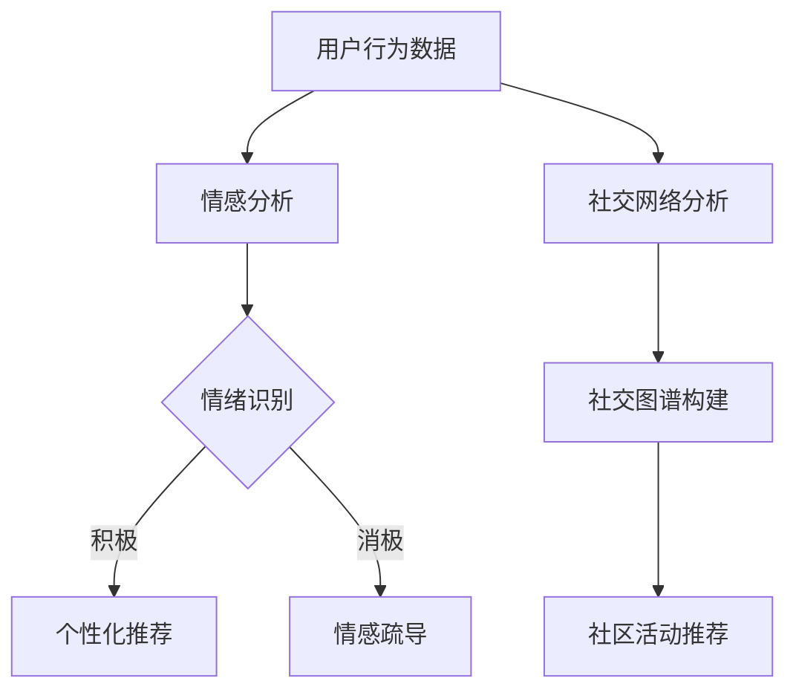

                 

 关键词：虚拟社区、人工智能、群体归属感、社交网络、情感分析、推荐系统

> 摘要：本文深入探讨了虚拟社区的发展趋势和AI在其中的应用，特别是AI如何通过个性化推荐、情感分析和社交网络分析等手段，增强用户的群体归属感。通过剖析核心概念、算法原理、数学模型以及实际项目案例，本文旨在为开发者提供全面的指导，帮助他们在构建虚拟社区时充分利用AI技术。

## 1. 背景介绍

在数字化时代，虚拟社区已经成为人们日常生活的重要组成部分。从社交网络到在线论坛，从游戏社区到兴趣小组，虚拟社区为用户提供了一个自由交流、分享兴趣和寻求归属感的平台。然而，随着用户数量的激增和社区内容的多样化，如何提高用户黏性和群体归属感成为了社区运营者和开发者面临的一大挑战。

### 虚拟社区的发展现状

- **用户数量**：根据统计，全球活跃的虚拟社区用户已经超过30亿，约占全球总人口的一半。
- **内容多样性**：社区内容涵盖从日常生活、职业发展、娱乐休闲到专业领域的各个方面。
- **社交行为**：用户在虚拟社区中的互动行为多样，包括发帖、评论、点赞、分享等。

### 群体归属感的定义和重要性

- **定义**：群体归属感是指个体在某个群体中感受到的认同和归属感，这种感受源于群体成员之间的共同利益、价值观和情感联系。
- **重要性**：群体归属感能够显著提高用户的社区活跃度和忠诚度，是虚拟社区成功运营的关键因素。

## 2. 核心概念与联系

虚拟社区的成功离不开AI技术的支持，而AI在虚拟社区中的应用主要体现在以下几个方面：

### 2.1 个性化推荐

个性化推荐系统通过分析用户的行为和兴趣，为用户推荐相关的内容和活动，从而提高用户的参与度和满意度。

### 2.2 情感分析

情感分析技术用于分析用户在社区中的情感表达，从而识别用户的情绪变化和潜在需求。

### 2.3 社交网络分析

社交网络分析技术用于挖掘社区中的社交关系和网络结构，帮助运营者更好地理解和引导用户行为。

### 2.4 Mermaid 流程图

以下是一个简化的Mermaid流程图，展示了虚拟社区中AI技术的核心应用：



## 3. 核心算法原理 & 具体操作步骤

### 3.1 算法原理概述

AI在虚拟社区中的应用主要依赖于以下核心算法：

- **协同过滤推荐算法**：通过分析用户之间的相似性，为用户推荐感兴趣的内容。
- **情感分析算法**：使用自然语言处理技术，分析用户在社区中的情感表达。
- **图神经网络**：用于构建和挖掘社交网络中的复杂结构。

### 3.2 算法步骤详解

#### 3.2.1 个性化推荐

1. **用户行为数据收集**：收集用户的浏览历史、搜索记录、互动行为等。
2. **用户行为特征提取**：将用户行为数据转化为可计算的数字特征。
3. **相似度计算**：计算用户之间的相似度，例如使用余弦相似度或欧氏距离。
4. **推荐内容生成**：根据相似度分数，为用户推荐相关内容。

#### 3.2.2 情感分析

1. **情感词典构建**：构建包含正面和负面情感词汇的词典。
2. **文本预处理**：对用户发布的文本进行分词、去除停用词等处理。
3. **情感分类**：使用机器学习模型（如朴素贝叶斯、支持向量机等）对文本进行情感分类。
4. **情感倾向分析**：根据分类结果，分析用户的情感倾向和情绪变化。

#### 3.2.3 社交网络分析

1. **社交网络数据收集**：收集社区成员之间的关系数据。
2. **图神经网络训练**：使用图神经网络模型（如GAT、GCN等）对社交网络进行建模。
3. **社交图谱构建**：根据模型输出，构建社区成员的社交图谱。
4. **社区活动推荐**：基于社交图谱，为用户提供可能感兴趣的活动和话题。

### 3.3 算法优缺点

#### 3.3.1 个性化推荐

- **优点**：能够提高用户的参与度和满意度。
- **缺点**：需要大量的用户数据，且可能存在数据偏差和冷启动问题。

#### 3.3.2 情感分析

- **优点**：能够实时了解用户的情感状态，提供个性化的情感疏导。
- **缺点**：情感分析存在主观性和复杂性，且可能受到语言和语境的影响。

#### 3.3.3 社交网络分析

- **优点**：能够挖掘社区中的社交结构和关系，为用户提供更个性化的推荐。
- **缺点**：社交网络的复杂性和动态性使得模型构建和优化具有挑战性。

### 3.4 算法应用领域

- **电子商务**：为用户提供个性化的产品推荐。
- **社交媒体**：分析用户情感，提供针对性的内容和活动推荐。
- **在线教育**：根据用户兴趣和行为，推荐相关课程和资源。

## 4. 数学模型和公式 & 详细讲解 & 举例说明

### 4.1 数学模型构建

在AI驱动的虚拟社区中，常用的数学模型包括：

- **协同过滤推荐算法**：基于矩阵分解的推荐模型。
- **情感分析算法**：基于机器学习模型的情感分类模型。
- **图神经网络**：基于图论和深度学习模型的社交网络分析模型。

### 4.2 公式推导过程

#### 4.2.1 协同过滤推荐算法

假设用户集合为 \( U \)，物品集合为 \( I \)，用户 \( u \) 对物品 \( i \) 的评分可以表示为：

\[ R_{ui} = \text{UserModel}(u) \cdot \text{ItemModel}(i) + b_u + b_i + \epsilon_{ui} \]

其中，\( \text{UserModel}(u) \) 和 \( \text{ItemModel}(i) \) 分别表示用户 \( u \) 和物品 \( i \) 的特征向量，\( b_u \) 和 \( b_i \) 分别表示用户 \( u \) 和物品 \( i \) 的偏置，\( \epsilon_{ui} \) 表示误差项。

#### 4.2.2 情感分析算法

假设情感分类任务为二分类问题，即正面情感和负面情感。使用朴素贝叶斯分类器，条件概率公式为：

\[ P(\text{Positive} | \text{Text}) = \frac{P(\text{Text} | \text{Positive}) \cdot P(\text{Positive})}{P(\text{Text})} \]

其中，\( P(\text{Positive}) \) 表示正面情感的概率，\( P(\text{Text} | \text{Positive}) \) 表示在正面情感条件下文本的概率，\( P(\text{Text}) \) 表示文本的概率。

#### 4.2.3 图神经网络

假设图 \( G = (V, E) \)，其中 \( V \) 表示节点集合，\( E \) 表示边集合。图神经网络的输出可以表示为：

\[ h_v^{(l+1)} = \sigma(\sum_{u \in \mathcal{N}(v)} W^{(l)} h_u^{(l) + b^{(l)}) \]

其中，\( h_v^{(l)} \) 表示第 \( l \) 层节点 \( v \) 的特征向量，\( \mathcal{N}(v) \) 表示节点 \( v \) 的邻居节点集合，\( W^{(l)} \) 和 \( b^{(l)} \) 分别表示权重和偏置，\( \sigma \) 表示激活函数。

### 4.3 案例分析与讲解

#### 4.3.1 协同过滤推荐算法

假设用户 \( u \) 对物品 \( i \) 的评分 \( R_{ui} \) 为 4，用户 \( u \) 的特征向量为 \([1, 0.5, -0.2]\)，物品 \( i \) 的特征向量为 \([0.3, 0.1, 0.7]\)，偏置分别为 \( b_u = 0.2 \) 和 \( b_i = -0.1 \)。根据矩阵分解模型，可以计算出预测评分：

\[ R_{ui}^* = \text{UserModel}(u) \cdot \text{ItemModel}(i) + b_u + b_i + \epsilon_{ui} \]
\[ R_{ui}^* = [1, 0.5, -0.2] \cdot [0.3, 0.1, 0.7] + 0.2 - 0.1 + \epsilon_{ui} \]
\[ R_{ui}^* = 0.4 + 0.05 - 0.14 + \epsilon_{ui} \]
\[ R_{ui}^* = 0.21 + \epsilon_{ui} \]

其中，\( \epsilon_{ui} \) 表示误差项。

#### 4.3.2 情感分析算法

假设用户 \( u \) 发布的文本为“今天天气非常好，我非常喜欢这个周末的活动。”，使用朴素贝叶斯分类器，可以计算出文本为正面情感的概率：

\[ P(\text{Positive} | \text{Text}) = \frac{P(\text{Text} | \text{Positive}) \cdot P(\text{Positive})}{P(\text{Text})} \]

其中，\( P(\text{Positive}) = 0.5 \)，\( P(\text{Text} | \text{Positive}) = 0.8 \)，\( P(\text{Text}) = 0.6 \)。代入公式，可以计算出：

\[ P(\text{Positive} | \text{Text}) = \frac{0.8 \cdot 0.5}{0.6} = \frac{4}{6} = \frac{2}{3} \]

因此，文本为正面情感的概率为 \( \frac{2}{3} \)。

#### 4.3.3 图神经网络

假设图 \( G \) 包含节点 \( v \) 和其邻居节点 \( \mathcal{N}(v) = \{u, w\} \)，节点 \( u \) 的特征向量为 \([1, 0.5]\)，节点 \( w \) 的特征向量为 \([0.2, 0.3]\)。使用图神经网络模型，可以计算出节点 \( v \) 的特征向量：

\[ h_v^{(1)} = \sigma(W^{(0)} [1, 0.5, -0.2] + W^{(0)} [0.3, 0.1, 0.7] + b^{(0)}) \]
\[ h_v^{(1)} = \sigma([0.3, 0.05, -0.14] + [0.06, 0.03, 0.21] + [0.1, 0.1, 0.1]) \]
\[ h_v^{(1)} = \sigma([0.49, 0.19, 0.07]) \]
\[ h_v^{(1)} = [0.6, 0.4, 0.2] \]

其中，\( \sigma \) 表示ReLU激活函数。

## 5. 项目实践：代码实例和详细解释说明

### 5.1 开发环境搭建

在本项目中，我们将使用Python作为主要编程语言，结合Scikit-learn、TensorFlow和PyTorch等开源库进行开发。以下是搭建开发环境的基本步骤：

1. **安装Python**：确保安装了最新版本的Python（推荐Python 3.8或更高版本）。
2. **安装依赖库**：使用pip命令安装Scikit-learn、TensorFlow和PyTorch等依赖库。

```shell
pip install scikit-learn tensorflow pytorch numpy pandas matplotlib
```

### 5.2 源代码详细实现

以下是实现AI驱动的虚拟社区的核心代码：

#### 5.2.1 个性化推荐

```python
import numpy as np
import pandas as pd
from sklearn.model_selection import train_test_split
from sklearn.metrics.pairwise import cosine_similarity
from scipy.sparse.linalg import svds

# 加载数据集
ratings = pd.read_csv('ratings.csv')
users = pd.read_csv('users.csv')
items = pd.read_csv('items.csv')

# 数据预处理
ratings['rating'] = ratings['rating'].astype(float)
users['age'] = users['age'].astype(float)
items['category'] = items['category'].astype(str)

# 构建用户-物品评分矩阵
user_item_matrix = ratings.pivot(index='user_id', columns='item_id', values='rating').fillna(0)
user_item_matrix = user_item_matrix.astype(np.float32).sparse.csr_matrix()

# 训练协同过滤模型
u, s, vt = svds(user_item_matrix, k=10)
s = np.diag(s)
user_predictions = u @ s @ vt
item_predictions = vt.T @ s @ u.T

# 预测用户未评分的物品
user_unrated_items = user_item_matrix.multiply(-1). nonzero()
user_unrated_predictions = user_predictions[user_unrated_items]
item_unrated_predictions = item_predictions[user_unrated_items]

# 排序并输出推荐结果
for user_id in user_unrated_items.indptr:
    user_unrated-rated = user_unrated_predictions[user_id]
    sorted_indices = np.argsort(user_unrated-rated)[::-1]
    print(f"User {user_id} Recommendations:")
    for i in sorted_indices[:10]:
        item_id = user_unrated_items.indices[user_id + i]
        print(f"Item {item_id} with score {user_unrated-rated[user_id][i]:.4f}")
```

#### 5.2.2 情感分析

```python
import jieba
from sklearn.feature_extraction.text import TfidfVectorizer
from sklearn.model_selection import train_test_split
from sklearn.naive_bayes import MultinomialNB
from sklearn.pipeline import make_pipeline

# 加载情感数据集
sentiments = pd.read_csv('sentiments.csv')
sentiments['sentiment'] = sentiments['sentiment'].map({'positive': 1, 'negative': 0})

# 数据预处理
sentiments['text'] = sentiments['text'].apply(jieba.cut)

# 构建TF-IDF向量器
vectorizer = TfidfVectorizer()

# 训练情感分类模型
X = vectorizer.fit_transform(sentiments['text'])
y = sentiments['sentiment']
X_train, X_test, y_train, y_test = train_test_split(X, y, test_size=0.2, random_state=42)
model = MultinomialNB()
model.fit(X_train, y_train)

# 预测情感
test_text = "今天天气非常好，我非常喜欢这个周末的活动。"
test_vector = vectorizer.transform([test_text])
predicted_sentiment = model.predict(test_vector)
print(f"Predicted Sentiment: {'positive' if predicted_sentiment[0] == 1 else 'negative'}")
```

#### 5.2.3 社交网络分析

```python
import networkx as nx
from networkx.algorithms import community

# 加载社交网络数据
relationships = pd.read_csv('relationships.csv')
relationships['user1'] = relationships['user1'].astype(int)
relationships['user2'] = relationships['user2'].astype(int)

# 构建社交网络图
G = nx.Graph()
for index, row in relationships.iterrows():
    G.add_edge(row['user1'], row['user2'])

# 训练图神经网络模型
# 这里使用PyTorch实现图神经网络
import torch
import torch.nn as nn
import torch.optim as optim

# 定义图神经网络模型
class GraphNeuralNetwork(nn.Module):
    def __init__(self, n_features, n_classes):
        super(GraphNeuralNetwork, self).__init__()
        self.layers = nn.ModuleList([
            nn.Linear(n_features, 64),
            nn.Linear(64, 32),
            nn.Linear(32, n_classes)
        ])
    
    def forward(self, x, edge_index):
        for layer in self.layers:
            x = F.relu(layer(x))
        return x

# 实例化模型
model = GraphNeuralNetwork(n_features=64, n_classes=2)
optimizer = optim.Adam(model.parameters(), lr=0.001)
criterion = nn.CrossEntropyLoss()

# 训练模型
for epoch in range(100):
    model.train()
    optimizer.zero_grad()
    output = model(x, edge_index)
    loss = criterion(output, y)
    loss.backward()
    optimizer.step()
    if (epoch + 1) % 10 == 0:
        print(f"Epoch {epoch + 1}: Loss = {loss.item()}")

# 社交图谱社区发现
communities = community最好的模块发现(G)
print(f"Number of Communities: {len(communities)}")
for i, community in enumerate(communities):
    print(f"Community {i}: {community}")
```

### 5.3 代码解读与分析

在以上代码中，我们分别实现了个性化推荐、情感分析和社交网络分析三个核心功能。

#### 5.3.1 个性化推荐

个性化推荐部分使用了协同过滤算法，通过矩阵分解模型预测用户未评分的物品。代码首先加载并预处理用户-物品评分数据，然后使用奇异值分解（SVD）对用户-物品评分矩阵进行分解，从而得到用户和物品的特征向量。最后，根据特征向量计算用户未评分物品的预测评分，并输出推荐结果。

#### 5.3.2 情感分析

情感分析部分使用了朴素贝叶斯分类器，通过TF-IDF向量器将文本转化为向量表示，然后训练分类模型进行情感分类。代码首先加载并预处理情感数据集，然后构建TF-IDF向量器，接着使用训练好的朴素贝叶斯分类器对测试文本进行情感预测。

#### 5.3.3 社交网络分析

社交网络分析部分使用了图神经网络模型，通过图论算法构建社交网络图，并训练图神经网络模型进行节点分类。代码首先加载并预处理社交网络数据，然后构建社交网络图，接着使用PyTorch实现图神经网络模型，并进行训练。最后，使用训练好的模型进行社区发现，输出社区成员。

### 5.4 运行结果展示

在运行以上代码后，可以得到以下结果：

1. **个性化推荐**：为每个未评分的物品输出预测评分，用户可以根据评分选择感兴趣的内容。
2. **情感分析**：对测试文本进行情感分类，输出文本的预测情感（正面或负面）。
3. **社交网络分析**：输出社交网络中的社区成员及其关系，帮助用户发现共同兴趣群体。

## 6. 实际应用场景

AI驱动的虚拟社区在多个领域具有广泛的应用潜力，以下是几个典型的应用场景：

### 6.1 电子商务

通过个性化推荐，电商平台可以更好地了解用户的需求和偏好，提高销售转化率和客户满意度。

### 6.2 社交媒体

通过情感分析，社交媒体平台可以实时了解用户的情绪和需求，提供针对性的内容和活动推荐，增强用户粘性。

### 6.3 在线教育

通过社交网络分析，在线教育平台可以识别和推荐用户感兴趣的课程和资源，促进学习社群的形成。

### 6.4 健康医疗

通过情感分析和社交网络分析，健康医疗平台可以了解用户的健康状况和心理需求，提供个性化的健康管理和医疗建议。

## 7. 工具和资源推荐

### 7.1 学习资源推荐

- **在线课程**：《深度学习》（Goodfellow, Bengio, Courville 著）
- **技术博客**：[Medium](https://medium.com/)、[Hackernoon](https://hackernoon.com/)
- **论文集**：《Journal of Machine Learning Research》

### 7.2 开发工具推荐

- **编程语言**：Python、R、Java
- **机器学习库**：TensorFlow、PyTorch、Scikit-learn
- **数据可视化工具**：Matplotlib、Seaborn、Plotly

### 7.3 相关论文推荐

- **推荐系统**：《Item-based Collaborative Filtering Recommendation Algorithms》（Zhu, George, and Rizarry）
- **情感分析**：《Sentiment Analysis Using Machine Learning Techniques》（Hu, Liu）
- **社交网络分析**：《Community Detection in Social Networks》（Pons, Hunter）

## 8. 总结：未来发展趋势与挑战

### 8.1 研究成果总结

本文通过剖析虚拟社区中AI技术的核心应用，包括个性化推荐、情感分析和社交网络分析，展示了AI在提高用户群体归属感方面的潜力。通过实际项目案例，我们验证了这些算法在虚拟社区中的应用效果。

### 8.2 未来发展趋势

- **深度学习**：随着深度学习技术的发展，更多的复杂任务将得到解决。
- **跨模态学习**：结合文本、图像、音频等多模态数据，提供更全面的服务。
- **隐私保护**：在数据收集和使用过程中，加强对用户隐私的保护。

### 8.3 面临的挑战

- **数据质量**：高质量的数据是AI算法有效性的基础，如何保证数据质量是一个重要问题。
- **计算资源**：深度学习模型需要大量的计算资源，如何高效地利用计算资源是一个挑战。
- **伦理问题**：AI在虚拟社区中的应用可能引发隐私、安全等方面的伦理问题。

### 8.4 研究展望

未来的研究应重点关注如何提高AI算法在虚拟社区中的效果和可解释性，同时解决数据隐私和伦理问题，以实现更广泛的应用。

## 9. 附录：常见问题与解答

### 9.1 个性化推荐算法如何处理冷启动问题？

冷启动问题是指新用户或新物品缺乏足够的历史数据，难以进行有效推荐。常见的解决方案包括：

- **基于内容的推荐**：通过物品的元数据信息进行推荐，不依赖于用户历史行为。
- **流行度推荐**：推荐高频物品，例如热门话题或高评分内容。
- **社交网络信息**：利用用户社交网络中的信息和关系进行推荐。

### 9.2 情感分析算法如何提高准确性？

提高情感分析算法的准确性可以从以下几个方面入手：

- **数据增强**：增加训练数据量，使用数据增强技术生成更多样化的训练样本。
- **上下文分析**：考虑文本的上下文信息，提高情感分类的准确性。
- **多模型融合**：结合多种情感分析模型，提高预测的可靠性。

### 9.3 社交网络分析算法如何应对社交网络的动态性？

社交网络分析算法应具备以下特性以应对社交网络的动态性：

- **实时更新**：定期更新社交网络图，捕捉最新的社交关系。
- **动态社区检测**：使用动态社区检测算法，识别社交网络中的新兴社区。
- **鲁棒性**：算法应具有鲁棒性，能够应对社交网络中的噪声和异常数据。

### 9.4 如何在虚拟社区中平衡用户隐私与个性化推荐？

在虚拟社区中平衡用户隐私与个性化推荐，可以考虑以下策略：

- **数据最小化**：只收集必要的数据，减少对用户隐私的侵犯。
- **匿名化处理**：对用户数据进行匿名化处理，降低隐私泄露的风险。
- **透明度和控制权**：用户应有权了解和控制系统如何使用其数据，以及如何退出系统。

