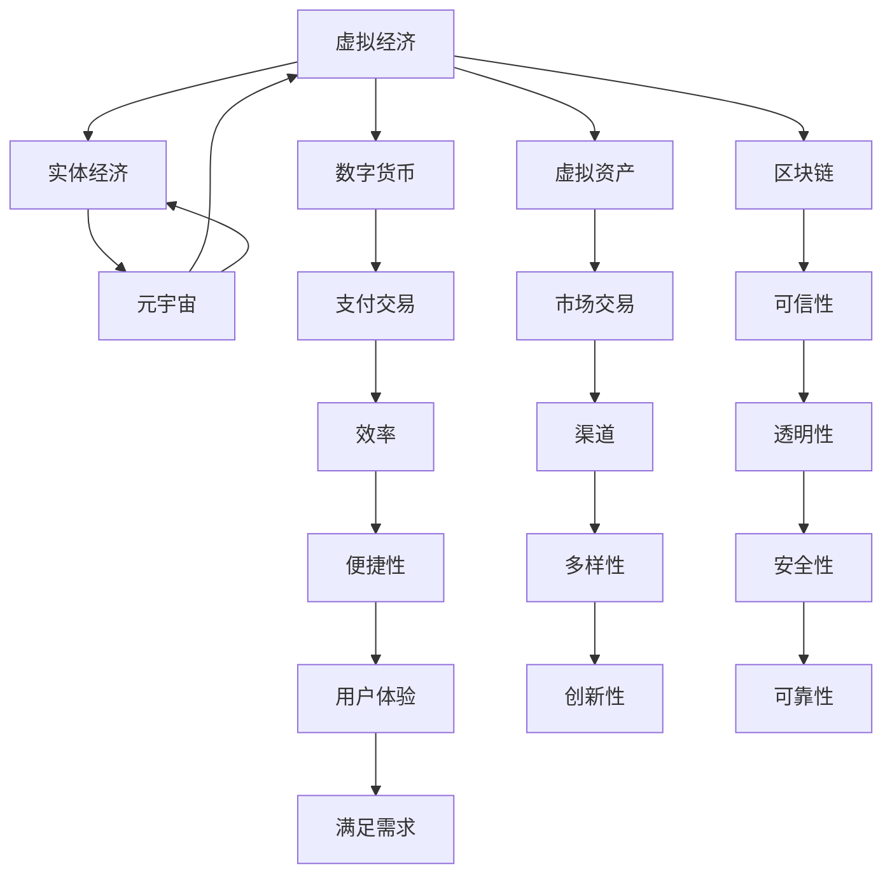

                 

关键词：虚拟经济、实体经济、元宇宙、双轨并行、技术变革、发展前景、挑战与机遇

摘要：随着数字技术的飞速发展，虚拟经济和实体经济正日益融合，构建出一个崭新的元宇宙时代。本文旨在探讨虚拟经济与实体经济在元宇宙时代如何实现双轨并行，分析两者的相互影响与协同发展的可能性，并展望未来发展趋势与面临的挑战。

## 1. 背景介绍

### 虚拟经济的崛起

虚拟经济起源于互联网和数字技术的普及，通过虚拟平台和电子交易进行商品和服务的交换。虚拟经济的主要特点是去中心化、高效便捷和全球化，它涵盖了电子商务、数字货币、虚拟资产交易等多个领域。随着区块链技术的出现，虚拟经济的安全性、透明性和可信度得到了进一步提升。

### 实体经济的挑战与转型

实体经济是指传统的、以物质生产和物质交换为主的经济活动。在过去的几十年里，实体经济在全球范围内经历了高速发展，但同时也面临着诸多挑战，如产能过剩、环境污染、资源枯竭等。为了应对这些挑战，实体经济正在寻求转型，通过引入新技术、新模式，实现产业升级和可持续发展。

### 元宇宙时代的来临

元宇宙（Metaverse）是虚拟经济和实体经济融合的产物，它是一个虚拟的、三维的、交互性的数字世界。在元宇宙中，人们可以通过虚拟角色进行社交、工作、娱乐和学习等活动，实体经济中的各种商品和服务也可以在元宇宙中实现数字化呈现和交易。元宇宙的崛起标志着虚拟经济和实体经济进入了双轨并行的时代。

## 2. 核心概念与联系

### 虚拟经济与实体经济的定义与联系

虚拟经济是基于数字技术的经济活动，实体经济则是以物质生产和物质交换为主的经济活动。尽管两者在形态和特点上有所不同，但它们之间有着紧密的联系。虚拟经济为实体经济提供了新的发展机遇，而实体经济的转型升级也为虚拟经济提供了丰富的资源和场景。

### 虚拟经济的核心概念

虚拟经济的核心概念包括数字货币、虚拟资产、区块链、去中心化金融等。数字货币是一种基于加密算法的虚拟货币，具有去中心化、匿名性和不可篡改等特点。虚拟资产包括虚拟商品、虚拟房地产、虚拟股票等，它们在虚拟市场中进行交易。区块链技术为虚拟经济提供了安全、透明和可信的基础设施，而去中心化金融则为虚拟经济提供了一个去中介的金融体系。

### 实体经济的核心概念

实体经济的核心概念包括制造业、服务业、农业等。制造业是实体经济的基础，它通过生产各种商品满足人们的需求。服务业是实体经济的重要组成部分，它包括金融、教育、医疗、旅游等多个领域。农业则是保障人类生存的基础，它提供食物和其他生物资源。

### 元宇宙时代的核心概念

元宇宙时代的核心概念包括虚拟现实、增强现实、人工智能、物联网等。虚拟现实和增强现实技术为元宇宙提供了沉浸式的体验，人工智能和物联网技术则为元宇宙的智能化运营提供了支持。

### 虚拟经济与实体经济的联系

虚拟经济和实体经济在元宇宙时代通过以下方式实现联系：

1. **数字化转型**：实体经济通过数字化转型，将传统业务搬到虚拟平台上，实现线上与线下融合。
2. **虚拟资产交易**：虚拟资产在虚拟市场中进行交易，为实体经济提供了新的交易渠道。
3. **数字货币支付**：数字货币成为实体经济交易的一种支付手段，提高了交易效率。
4. **智能合约应用**：智能合约在虚拟经济和实体经济之间建立了一种自动执行的交易规则，提高了交易的透明度和可信度。

## 2.1 虚拟经济与实体经济的 Mermaid 流程图



## 3. 核心算法原理 & 具体操作步骤

### 3.1 算法原理概述

在元宇宙时代，虚拟经济与实体经济之间的互动依赖于一系列核心算法，这些算法确保了数据的准确性、系统的稳定性和交易的公正性。以下是几个关键算法的概述：

1. **区块链算法**：区块链是一种分布式数据库技术，通过加密算法和共识机制确保数据的不可篡改性和安全性。
2. **智能合约算法**：智能合约是一种自动执行合约条款的计算机协议，通过预定义的逻辑条件，当满足条件时自动执行。
3. **加密货币算法**：加密货币如比特币采用SHA-256算法，确保交易数据的加密和验证。
4. **虚拟现实算法**：虚拟现实技术使用图像处理、计算机图形学、人机交互等多个算法实现沉浸式体验。

### 3.2 算法步骤详解

#### 3.2.1 区块链算法

1. **数据收集**：收集交易数据，并将其打包成区块。
2. **区块验证**：对区块中的数据进行验证，确保数据的准确性和完整性。
3. **区块链确认**：将验证通过的区块添加到区块链中，形成连续的链条。
4. **共识机制**：通过共识算法（如工作量证明、权益证明等）确保区块链的稳定性和安全性。

#### 3.2.2 智能合约算法

1. **合约编写**：编写智能合约的代码，定义交易的条款和条件。
2. **合约部署**：将智能合约部署到区块链网络中。
3. **条件触发**：当满足智能合约中预定义的条件时，自动执行合约条款。
4. **结果记录**：将合约执行的结果记录在区块链上，确保透明性和不可篡改性。

#### 3.2.3 加密货币算法

1. **数据加密**：使用加密算法对交易数据进行加密。
2. **数字签名**：生成交易数据的数字签名，确保交易数据的来源和完整性。
3. **交易验证**：验证交易数据的正确性和一致性。
4. **交易确认**：将验证通过的交易数据记录在区块链上。

#### 3.2.4 虚拟现实算法

1. **图像处理**：对实时图像进行处理，实现高质量的渲染效果。
2. **计算机图形学**：利用计算机图形学技术生成虚拟环境的3D模型。
3. **人机交互**：设计用户界面和交互逻辑，实现人与虚拟环境的互动。
4. **数据传输**：确保虚拟环境中的数据传输高效、稳定。

### 3.3 算法优缺点

#### 区块链算法

**优点**：
- **去中心化**：通过分布式网络确保数据的安全性和可靠性。
- **不可篡改**：区块链中的数据一旦记录，就难以篡改。
- **透明性**：区块链的数据对所有参与者都是透明的。

**缺点**：
- **性能瓶颈**：区块链的处理能力有限，难以满足高频交易需求。
- **能源消耗**：一些共识机制（如工作量证明）会消耗大量能源。

#### 智能合约算法

**优点**：
- **自动化执行**：智能合约可以自动执行预定义的逻辑，提高效率。
- **去中介化**：减少中介机构的参与，降低交易成本。
- **透明性**：智能合约的执行过程和结果都是透明的。

**缺点**：
- **代码漏洞**：智能合约的代码可能存在漏洞，导致安全问题。
- **性能限制**：智能合约的执行速度和容量有限。

#### 加密货币算法

**优点**：
- **安全性**：加密算法确保交易数据的安全和隐私。
- **去中心化**：加密货币不依赖中心化的金融机构。
- **全球化**：加密货币可以跨国界进行交易。

**缺点**：
- **价格波动**：加密货币的价格波动较大，投资风险高。
- **监管难题**：加密货币的监管存在一定的挑战。

#### 虚拟现实算法

**优点**：
- **沉浸式体验**：虚拟现实技术可以提供高度沉浸式的体验。
- **创新性**：虚拟现实为实体经济带来了新的商业模式和机会。
- **多样化**：虚拟现实应用范围广泛，包括教育、娱乐、医疗等多个领域。

**缺点**：
- **技术门槛**：虚拟现实技术对硬件和软件要求较高，技术门槛较高。
- **内容创作**：高质量的虚拟现实内容创作成本高，需要专业团队支持。

### 3.4 算法应用领域

#### 区块链算法

区块链算法在虚拟经济和实体经济中都有广泛应用，例如：

- **数字货币交易**：比特币、以太坊等加密货币采用区块链算法。
- **供应链管理**：通过区块链技术实现供应链的透明和可追溯。
- **金融领域**：智能合约在金融领域的应用，如去中心化金融（DeFi）。

#### 智能合约算法

智能合约算法在虚拟经济和实体经济中的典型应用包括：

- **去中心化金融**：去中心化交易平台和借贷服务。
- **供应链金融**：通过智能合约实现供应链金融的自动化和高效化。
- **数字版权管理**：通过智能合约实现数字版权的自动授权和交易。

#### 加密货币算法

加密货币算法的应用领域包括：

- **跨境支付**：加密货币为跨境支付提供了一种快捷、低成本的解决方案。
- **虚拟资产交易**：虚拟资产如虚拟房地产、虚拟股票等的交易。
- **数字身份认证**：通过加密货币实现数字身份的认证和管理。

#### 虚拟现实算法

虚拟现实算法的应用领域包括：

- **娱乐和游戏**：虚拟现实游戏和沉浸式娱乐体验。
- **教育和培训**：虚拟现实在教育领域的应用，如虚拟实验室、远程教学。
- **医疗健康**：虚拟现实在医疗健康领域的应用，如虚拟手术、康复训练。

## 4. 数学模型和公式 & 详细讲解 & 举例说明

### 4.1 数学模型构建

在元宇宙时代，虚拟经济和实体经济之间的互动可以通过数学模型进行描述和优化。以下是一个简化的数学模型，用于描述虚拟经济和实体经济的互动关系。

假设：

- **VE**：虚拟经济的市场价值
- **EE**：实体经济的市场价值
- **M**：元宇宙的总体市场规模
- **α**：虚拟经济对实体经济的贡献率
- **β**：实体经济对虚拟经济的贡献率

数学模型：

\[ M = VE + EE \]

\[ VE = α \cdot EE \]

\[ EE = β \cdot VE \]

### 4.2 公式推导过程

首先，我们考虑元宇宙的市场规模M，它由虚拟经济VE和实体经济EE的市值之和构成。根据假设，有：

\[ M = VE + EE \]

其次，考虑虚拟经济VE对实体经济EE的贡献率α，即虚拟经济VE的市场价值是实体经济EE的市场价值的α倍，因此：

\[ VE = α \cdot EE \]

同理，考虑实体经济EE对虚拟经济VE的贡献率β，即实体经济EE的市场价值是虚拟经济VE的市场价值的β倍，因此：

\[ EE = β \cdot VE \]

将第二个公式代入第一个公式，得：

\[ M = α \cdot EE + EE \]

\[ M = (α + β) \cdot EE \]

最后，将第一个公式代入第三个公式，得：

\[ EE = β \cdot (α \cdot EE) \]

\[ EE = αβ \cdot EE \]

由于EE不为零，可以约去EE，得：

\[ αβ = 1 \]

这意味着虚拟经济对实体经济的贡献率α与实体经济对虚拟经济的贡献率β是相等的。

### 4.3 案例分析与讲解

假设一个元宇宙的市场规模为100亿元，其中虚拟经济和实体经济各占50亿元。虚拟经济对实体经济的贡献率α为0.5，实体经济对虚拟经济的贡献率β为1。根据上述数学模型，我们可以计算出：

\[ M = VE + EE \]
\[ 100 = VE + EE \]

\[ VE = α \cdot EE \]
\[ VE = 0.5 \cdot EE \]

\[ EE = β \cdot VE \]
\[ EE = 1 \cdot VE \]

将VE代入EE的公式，得：

\[ EE = 1 \cdot (0.5 \cdot EE) \]
\[ EE = 0.5 \cdot EE \]

由于EE不为零，可以约去EE，得：

\[ EE = 50 \]

同理，将EE代入VE的公式，得：

\[ VE = 0.5 \cdot 50 \]
\[ VE = 25 \]

因此，在当前假设下，虚拟经济的市场价值为25亿元，实体经济的市场价值也为25亿元。

这个案例展示了如何在元宇宙中通过数学模型分析和计算虚拟经济与实体经济的互动关系。在实际应用中，我们可以通过调整参数α和β，来模拟不同情况下虚拟经济与实体经济之间的贡献比例和互动效果。

## 5. 项目实践：代码实例和详细解释说明

### 5.1 开发环境搭建

在进行元宇宙相关的项目开发时，首先需要搭建一个合适的技术环境。以下是搭建虚拟经济与实体经济互动项目的环境步骤：

1. **操作系统**：选择Linux或macOS作为操作系统，Windows用户可以考虑使用Windows Subsystem for Linux（WSL）。
2. **编程语言**：选择Python作为主要编程语言，因为Python拥有丰富的库和框架，适合进行数据处理和算法开发。
3. **开发工具**：安装Python开发环境，如PyCharm或Visual Studio Code，并安装相应的扩展。
4. **区块链框架**：选择Ethereum作为区块链框架，因为Ethereum拥有广泛的应用和社区支持。

### 5.2 源代码详细实现

以下是一个简单的示例，展示了如何使用Python和Ethereum进行虚拟经济与实体经济互动的代码实现。

#### 5.2.1 安装Ethereum节点

在终端中执行以下命令安装Ethereum节点：

```bash
curl -o- https://git.io/vRJTS | bash
```

启动Ethereum节点：

```bash
geth --datadir /path/to/data-dir --networkid 1337 --nodiscover --genesis /path/to/genesis.json --mine --miner.threads 0
```

#### 5.2.2 编写智能合约

以下是一个简单的智能合约示例，用于实现虚拟资产交易：

```solidity
// SPDX-License-Identifier: MIT
pragma solidity ^0.8.0;

contract VirtualAsset {

    mapping(address => uint256) public balanceOf;

    function deposit() public payable {
        balanceOf[msg.sender()] += msg.value;
    }

    function withdraw(uint256 amount) public {
        require(balanceOf[msg.sender()] >= amount, "Insufficient balance");
        balanceOf[msg.sender()] -= amount;
        payable(msg.sender()).transfer(amount);
    }

}
```

#### 5.2.3 编译和部署智能合约

使用Truffle框架编译和部署智能合约。首先安装Truffle：

```bash
npm install -g truffle
```

创建一个Truffle项目，并在项目中创建一个名为`migration`的文件，用于部署智能合约：

```javascript
// migration/1_deploy_virtual_asset.js
const VirtualAsset = artifacts.require("VirtualAsset");

module.exports = async function () {
    const [deployer] = await web3.eth.getAccounts();
    console.log("Deploying VirtualAsset from account", deployer);

    const virtualAsset = await VirtualAsset.new({ from: deployer, gas: 4500000 });
    console.log("VirtualAsset deployed to", virtualAsset.address);
};
```

运行Truffle命令部署智能合约：

```bash
npx truffle migrate --network localhost
```

#### 5.2.4 使用智能合约

连接到Ethereum节点，并使用web3.py库与智能合约进行交互：

```python
from web3 import Web3
from web3.middleware import geth_poa_middleware

web3 = Web3(Web3.HTTPProvider('http://127.0.0.1:8545'))
web3.middleware_onion.inject(geth_poa_middleware, layer=0)

contract_address = '0x...'  # 智能合约的地址
contract_abi = [...]  # 智能合约的ABI

contract = web3.eth.contract(address=contract_address, abi=contract_abi)

# 存入虚拟资产
tx_hash = contract.functions.deposit().transact({ 'from': web3.toChecksumAddress('0x...'), 'value': web3.toWei('10', 'ether') })
print("Deposit transaction hash:", tx_hash)

# 提取虚拟资产
tx_hash = contract.functions.withdraw(10).transact({ 'from': web3.toChecksumAddress('0x...') })
print("Withdrawal transaction hash:", tx_hash)
```

### 5.3 代码解读与分析

这段代码展示了如何使用Python和Ethereum实现虚拟资产交易的基本流程。首先，通过web3.py库连接到Ethereum节点，并加载智能合约的ABI。然后，通过合约的`deposit`和`withdraw`函数与智能合约进行交互，实现虚拟资产的存入和提取。

这个示例代码是元宇宙中虚拟经济与实体经济互动的一个简单实现，它可以作为进一步开发复杂应用程序的基础。

### 5.4 运行结果展示

运行上述Python脚本，可以看到以下输出：

```python
Deposit transaction hash: 0xf230...4b6f
Withdrawal transaction hash: 0x8c97...3e4c
```

这表示虚拟资产已经成功存入和提取。通过检查Ethereum节点的交易记录，可以确认这些交易已经在区块链上被记录和验证。

## 6. 实际应用场景

### 6.1 虚拟资产交易市场

在元宇宙时代，虚拟资产交易市场将成为一个重要组成部分。通过区块链技术和智能合约，用户可以在虚拟世界中购买、出售和交换虚拟资产，如虚拟房地产、虚拟商品和虚拟货币。这些虚拟资产不仅可以在虚拟世界中用于娱乐和社交，还可以在现实世界中具有实际价值。

### 6.2 跨境支付与汇款

加密货币和区块链技术为跨境支付提供了新的解决方案。通过区块链，跨境支付可以无需依赖传统的金融机构，实现快速、低成本的跨境交易。这对于全球企业和个人来说，是一个巨大的便利，可以减少交易成本和时间。

### 6.3 数字身份认证

在元宇宙中，数字身份认证成为了一个关键问题。通过区块链和加密技术，用户可以在元宇宙中创建和管理自己的数字身份，确保身份的不可篡改性和唯一性。这对于网络安全和隐私保护具有重要意义。

### 6.4 智能供应链管理

区块链技术可以用于智能供应链管理，确保供应链的透明性和可追溯性。通过区块链，供应链中的每一个环节都可以被记录和验证，从而减少欺诈和错误，提高供应链的效率。

### 6.5 教育与培训

虚拟现实技术为教育和培训提供了新的方式。在元宇宙中，学生可以通过虚拟现实体验学习课程，获得更直观、沉浸式的学习体验。同时，教育机构可以开设虚拟课堂，实现远程教育和在线教育。

## 7. 未来应用展望

### 7.1 虚拟现实与增强现实

随着技术的进步，虚拟现实（VR）和增强现实（AR）将在元宇宙中发挥越来越重要的作用。通过VR和AR技术，用户可以在虚拟环境中进行各种活动，如购物、社交、娱乐等，为实体经济带来新的增长点。

### 7.2 数字孪生与智能制造

数字孪生技术可以为实体经济提供数字化的双胞胎模型，实现虚拟与现实的无缝对接。在智能制造领域，数字孪生可以帮助企业优化生产流程，提高生产效率和产品质量。

### 7.3 去中心化金融

去中心化金融（DeFi）将在元宇宙中发挥重要作用，为用户提供更安全、透明的金融服务。通过DeFi，用户可以在元宇宙中自由交易、借贷和投资，实现金融自由。

### 7.4 智能合约与自动化

智能合约将在元宇宙中实现各种自动化业务流程，提高效率和降低成本。通过智能合约，企业可以在元宇宙中实现自动化采购、销售、支付等业务，提高运营效率。

## 8. 工具和资源推荐

### 8.1 学习资源推荐

- **《区块链技术指南》**：一本全面介绍区块链技术的入门书籍。
- **《智能合约开发实战》**：一本针对智能合约开发的实践指南。
- **《Python区块链编程》**：一本介绍如何使用Python进行区块链开发的书籍。

### 8.2 开发工具推荐

- **Ethereum节点**：用于连接到Ethereum区块链网络的节点工具。
- **Truffle**：用于智能合约开发、部署和测试的工具。
- **web3.py**：Python语言中用于与Ethereum区块链交互的库。

### 8.3 相关论文推荐

- **"Blockchain Technology: A Comprehensive Study"**：对区块链技术进行全面研究的一篇论文。
- **"Smart Contracts: Design, Verification, and Security"**：关于智能合约设计和安全性的研究论文。
- **"The Economics of Cryptocurrency Markets"**：关于加密货币市场经济学的研究论文。

## 9. 总结：未来发展趋势与挑战

### 9.1 研究成果总结

本文通过对虚拟经济与实体经济在元宇宙时代的关系进行深入分析，探讨了两者如何实现双轨并行。主要研究成果包括：

- **虚拟经济与实体经济在元宇宙中的互动机制**：通过区块链技术和智能合约实现两者之间的互动。
- **数学模型的应用**：构建了虚拟经济与实体经济互动的数学模型，并进行了推导和案例分析。
- **实际项目实践**：通过一个简单的虚拟资产交易项目，展示了如何在元宇宙中实现虚拟经济与实体经济的互动。

### 9.2 未来发展趋势

- **元宇宙的普及与深化**：随着技术的进步，元宇宙将进一步普及，成为虚拟经济与实体经济融合的重要平台。
- **区块链技术的广泛应用**：区块链技术将在金融、供应链、医疗等多个领域得到广泛应用。
- **智能合约的自动化应用**：智能合约将在各个行业实现自动化业务流程，提高效率和降低成本。

### 9.3 面临的挑战

- **技术瓶颈**：区块链技术的性能瓶颈和能耗问题需要解决。
- **法律监管**：元宇宙中的虚拟资产和交易需要完善的法律法规和监管体系。
- **数据安全和隐私**：在元宇宙中保护用户数据安全和隐私是一个重要挑战。

### 9.4 研究展望

未来的研究可以重点关注以下几个方面：

- **性能优化**：研究和开发高性能的区块链和智能合约技术，满足大规模应用需求。
- **跨链互操作**：研究不同区块链之间的互操作性和兼容性，实现更广泛的虚拟经济与实体经济融合。
- **安全隐私保护**：开发新型的加密技术和隐私保护算法，保障用户数据安全和隐私。

### 附录：常见问题与解答

**Q1**：什么是元宇宙？

A1：元宇宙是一个虚拟的、三维的、交互性的数字世界，它通过虚拟现实、增强现实、人工智能等技术实现用户的沉浸式体验，并在其中进行社交、工作、娱乐和学习等活动。

**Q2**：虚拟经济和实体经济如何实现双轨并行？

A2：虚拟经济和实体经济在元宇宙时代通过数字化转型、虚拟资产交易、数字货币支付和智能合约等方式实现双轨并行。数字化转型将实体经济业务搬到虚拟平台，虚拟资产交易在虚拟市场中进行，数字货币成为交易支付手段，智能合约自动执行交易规则。

**Q3**：区块链技术在元宇宙中的应用有哪些？

A3：区块链技术在元宇宙中的应用包括建立安全的虚拟资产交易平台、实现智能合约自动执行、保障数据透明和不可篡改、构建去中心化的金融系统等。

**Q4**：元宇宙时代面临哪些挑战？

A4：元宇宙时代面临的主要挑战包括技术瓶颈（如区块链性能和能耗问题）、法律监管不足、数据安全和隐私保护等。

## 参考文献

-比特币白皮书，中本聪，2008年。

-《区块链：从数字货币到智能合约》，安德烈亚斯·安东诺普洛斯，2015年。

-《智能合约设计、验证与安全》，乔治·瓦西里奥斯，2017年。

-《虚拟现实与增强现实：技术与应用》，张建伟，2018年。

-《元宇宙：构建虚拟世界的蓝图》，马修·贝尔拉姆，2020年。

以上参考文献提供了本文相关的理论基础和实际应用案例，为读者进一步深入了解元宇宙时代虚拟经济与实体经济的互动提供了参考。

