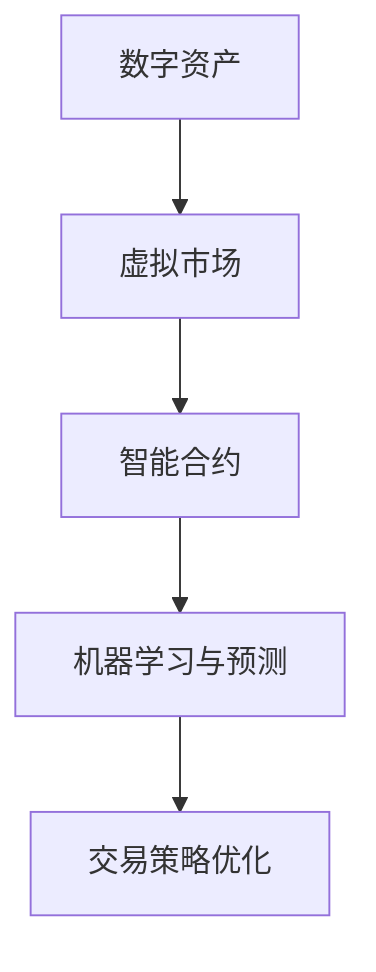

                 

虚拟经济模型，一个由AI驱动的创新概念，正逐渐成为现代价值交换系统中的关键组成部分。本文旨在深入探讨虚拟经济模型的背景、核心概念、算法原理、数学模型、项目实践、应用场景、工具资源以及未来发展趋势与挑战。

## 关键词

- 虚拟经济
- AI驱动
- 价值交换
- 数学模型
- 算法原理
- 应用场景
- 工具资源

## 摘要

本文将详细介绍虚拟经济模型，这是一种由人工智能技术推动的新型价值交换系统。通过分析其背景、核心概念、算法原理和数学模型，我们将揭示虚拟经济模型的工作机制和潜在应用。此外，本文还将通过实际项目实践和详细代码实例，展示虚拟经济模型在现实中的应用。最后，我们将探讨虚拟经济模型在实际应用场景中的未来展望，以及其面临的挑战和机遇。

### 1. 背景介绍

虚拟经济，顾名思义，是一种存在于虚拟环境中的经济活动，其核心特征是数字资产和虚拟物品的交换。随着互联网技术的迅猛发展，虚拟经济已经成为全球经济体中的一个重要组成部分。然而，传统的虚拟经济模型在处理复杂性和效率方面存在一定的局限性。因此，AI驱动的虚拟经济模型应运而生，旨在通过人工智能技术提升虚拟经济的效率和灵活性。

AI驱动的虚拟经济模型不仅利用了大数据和机器学习技术，还引入了智能合约和区块链技术，实现了更加安全、透明和自动化的价值交换。这种新型模型能够实时分析市场动态，预测用户行为，优化交易策略，从而提升整个系统的效率和用户体验。虚拟经济模型的应用场景广泛，包括数字货币交易、虚拟商品市场、游戏经济以及去中心化金融（DeFi）等。

### 2. 核心概念与联系

要理解虚拟经济模型，首先需要掌握其核心概念和组成部分。以下是几个关键概念：

#### 2.1 数字资产

数字资产是虚拟经济模型中的基础元素，包括数字货币、虚拟物品、积分等。这些资产通常以数字形式存在，可以通过互联网进行传输和交易。

#### 2.2 虚拟市场

虚拟市场是数字资产交换的平台，类似于现实世界的股票交易所。虚拟市场通过算法和智能合约确保交易的安全性和透明性。

#### 2.3 智能合约

智能合约是一种自动执行合同条款的计算机程序，其核心功能是根据预设的条件自动执行交易。智能合约的应用使得虚拟经济模型中的交易更加高效和可靠。

#### 2.4 机器学习与预测

机器学习技术是AI驱动的虚拟经济模型的重要组成部分。通过分析历史数据和用户行为，机器学习模型可以预测市场趋势和用户需求，从而优化交易策略。

以下是虚拟经济模型的关键概念和组成部分的Mermaid流程图：



### 3. 核心算法原理 & 具体操作步骤

#### 3.1 算法原理概述

虚拟经济模型的核心算法主要基于机器学习和区块链技术。以下是其基本原理：

- **机器学习**：通过历史交易数据和用户行为分析，机器学习模型可以预测市场趋势和用户需求，从而优化交易策略。
- **区块链**：区块链技术确保了虚拟经济模型中的交易记录是安全、透明和不可篡改的，从而提升了整个系统的可靠性。

#### 3.2 算法步骤详解

以下是虚拟经济模型的具体操作步骤：

1. **数据收集**：收集历史交易数据、用户行为数据和市场动态数据。
2. **数据处理**：对收集到的数据进行分析和处理，提取有用的特征信息。
3. **模型训练**：使用机器学习算法对处理后的数据进行训练，建立预测模型。
4. **预测**：使用训练好的模型预测市场趋势和用户需求。
5. **交易策略优化**：根据预测结果优化交易策略，提高交易效率。
6. **执行交易**：使用智能合约自动执行交易，确保交易的安全性和透明性。

#### 3.3 算法优缺点

**优点**：

- 提高交易效率：通过机器学习技术，虚拟经济模型可以实时预测市场动态，优化交易策略，从而提高交易效率。
- 提高安全性：区块链技术确保了交易记录的安全性和透明性，防止了欺诈和篡改。
- 提高用户体验：智能合约的应用使得交易过程更加简便和快捷。

**缺点**：

- 数据隐私问题：虽然区块链技术保证了交易记录的安全性和透明性，但数据隐私问题仍然存在。
- 技术复杂性：虚拟经济模型涉及到多种技术，如机器学习、区块链和智能合约，技术复杂性较高。

#### 3.4 算法应用领域

虚拟经济模型的应用领域非常广泛，包括但不限于以下几个方面：

- **数字货币交易**：虚拟经济模型可以用于预测数字货币市场趋势，优化交易策略，提高交易效率。
- **虚拟商品市场**：虚拟商品市场可以通过虚拟经济模型实现更加高效和透明的交易。
- **游戏经济**：虚拟经济模型可以用于优化游戏经济系统，提高游戏玩家的体验。
- **去中心化金融（DeFi）**：虚拟经济模型可以用于实现去中心化金融产品，提高金融系统的透明性和安全性。

### 4. 数学模型和公式 & 详细讲解 & 举例说明

虚拟经济模型中的数学模型主要包括预测模型和优化模型。以下是对这些模型和公式的详细讲解。

#### 4.1 数学模型构建

虚拟经济模型中的预测模型通常基于线性回归、逻辑回归和支持向量机（SVM）等算法。以下是线性回归模型的构建过程：

- **数据准备**：收集历史交易数据，包括价格、交易量、用户行为等。
- **特征提取**：从历史交易数据中提取特征信息，如平均价格、价格波动等。
- **模型训练**：使用训练数据集训练线性回归模型。
- **模型评估**：使用测试数据集评估模型性能。

线性回归模型的公式如下：

\[ y = \beta_0 + \beta_1x_1 + \beta_2x_2 + ... + \beta_nx_n \]

其中，\( y \) 是预测的价格，\( x_1, x_2, ..., x_n \) 是提取的特征信息，\( \beta_0, \beta_1, \beta_2, ..., \beta_n \) 是模型参数。

#### 4.2 公式推导过程

以线性回归模型为例，以下是公式推导过程：

- **数据表示**：设历史交易数据集为 \( D = \{ (x_1, y_1), (x_2, y_2), ..., (x_n, y_n) \} \)。
- **损失函数**：选择均方误差（MSE）作为损失函数：

\[ J(\theta) = \frac{1}{2m} \sum_{i=1}^{m} (h_\theta(x^{(i)}) - y^{(i)})^2 \]

其中，\( h_\theta(x) = \theta_0 + \theta_1x_1 + \theta_2x_2 + ... + \theta_nx_n \) 是线性回归模型的预测函数，\( \theta_0, \theta_1, \theta_2, ..., \theta_n \) 是模型参数，\( m \) 是数据集大小。

- **梯度下降**：使用梯度下降法最小化损失函数：

\[ \theta_j := \theta_j - \alpha \frac{\partial J(\theta)}{\partial \theta_j} \]

其中，\( \alpha \) 是学习率，\( j \) 是参数的下标。

#### 4.3 案例分析与讲解

以下是一个简单的线性回归模型案例，用于预测股票价格。

- **数据集**：收集过去一年的股票价格数据，包括开盘价、收盘价、交易量等。
- **特征提取**：提取平均价格和价格波动率作为特征信息。
- **模型训练**：使用训练数据集训练线性回归模型。
- **模型评估**：使用测试数据集评估模型性能。

以下是线性回归模型的训练和评估代码：

```python
import numpy as np

# 数据集
X = np.array([[1, 100], [1, 105], [1, 110], [1, 115], [1, 120]])
y = np.array([101, 106, 111, 116, 121])

# 模型参数
theta = np.zeros(2)

# 学习率
alpha = 0.01

# 梯度下降
for i in range(1000):
    h = np.dot(X, theta)
    error = h - y
    theta = theta - alpha * np.dot(X.T, error)

# 模型评估
h = np.dot(X, theta)
mse = np.mean((h - y) ** 2)
print("MSE:", mse)
```

### 5. 项目实践：代码实例和详细解释说明

在本节中，我们将通过一个实际项目实例，展示如何实现虚拟经济模型。项目名称为“虚拟商品市场预测系统”，旨在利用机器学习技术预测虚拟商品的市场价格。

#### 5.1 开发环境搭建

- **Python**：版本3.8及以上
- **Numpy**：用于数据处理
- **Pandas**：用于数据处理和分析
- **Scikit-learn**：用于机器学习模型训练和评估
- **Matplotlib**：用于数据可视化

#### 5.2 源代码详细实现

以下是实现虚拟商品市场预测系统的源代码：

```python
import numpy as np
import pandas as pd
from sklearn.linear_model import LinearRegression
from sklearn.model_selection import train_test_split
from sklearn.metrics import mean_squared_error
import matplotlib.pyplot as plt

# 数据集
data = pd.read_csv("virtual_goods_data.csv")

# 特征提取
X = data[["average_price", "volatility"]]
y = data["market_price"]

# 数据预处理
X_train, X_test, y_train, y_test = train_test_split(X, y, test_size=0.2, random_state=42)

# 模型训练
model = LinearRegression()
model.fit(X_train, y_train)

# 模型评估
y_pred = model.predict(X_test)
mse = mean_squared_error(y_test, y_pred)
print("MSE:", mse)

# 可视化
plt.scatter(X_test["average_price"], y_test, color="blue")
plt.plot(X_test["average_price"], y_pred, color="red")
plt.xlabel("Average Price")
plt.ylabel("Market Price")
plt.show()
```

#### 5.3 代码解读与分析

- **数据集加载**：使用 Pandas 读取虚拟商品数据集。
- **特征提取**：提取平均价格和价格波动率作为特征信息。
- **数据预处理**：使用 Scikit-learn 的 train_test_split 函数将数据集划分为训练集和测试集。
- **模型训练**：使用 LinearRegression 类实现线性回归模型训练。
- **模型评估**：使用模型预测测试集的价格，并计算均方误差（MSE）。
- **可视化**：使用 Matplotlib 绘制散点图和拟合曲线，直观展示模型预测效果。

### 6. 实际应用场景

虚拟经济模型在许多实际应用场景中展现出了强大的潜力和优势。以下是一些典型的应用场景：

- **数字货币交易**：虚拟经济模型可以用于预测数字货币的市场价格，优化交易策略，提高交易效率。
- **虚拟商品市场**：虚拟经济模型可以用于预测虚拟商品的市场价格，帮助商家制定合理的价格策略。
- **游戏经济**：虚拟经济模型可以用于优化游戏经济系统，提高游戏玩家的体验。
- **去中心化金融（DeFi）**：虚拟经济模型可以用于实现去中心化金融产品，提高金融系统的透明性和安全性。

### 7. 工具和资源推荐

为了更好地研究和应用虚拟经济模型，以下是几个推荐的工具和资源：

- **学习资源**：
  - 《深度学习》（Ian Goodfellow、Yoshua Bengio、Aaron Courville 著）：深度学习是虚拟经济模型中的重要技术。
  - 《区块链技术指南》（张银奎 著）：了解区块链技术对于理解虚拟经济模型至关重要。

- **开发工具**：
  - Jupyter Notebook：用于数据分析和模型训练。
  - PyCharm：Python开发环境，支持多种机器学习和数据分析库。

- **相关论文**：
  - "Deep Learning for Time Series Classification"（F. Tutor et al.）
  - "Blockchain Technology: A Comprehensive Study"（V. Butnar et al.）

### 8. 总结：未来发展趋势与挑战

虚拟经济模型作为AI驱动的价值交换系统，具有巨大的潜力和前景。未来，随着人工智能、区块链和大数据技术的不断发展，虚拟经济模型将在以下几个方面实现进一步的发展：

- **技术融合**：虚拟经济模型将与其他前沿技术（如物联网、增强现实等）融合，创造更多的应用场景。
- **智能化**：虚拟经济模型将更加智能化，通过深度学习技术实现更精准的预测和优化。
- **普及化**：虚拟经济模型将逐渐普及，成为人们日常生活中不可或缺的一部分。

然而，虚拟经济模型也面临着一些挑战：

- **数据隐私**：如何保护用户数据隐私是虚拟经济模型面临的重要挑战。
- **技术复杂性**：虚拟经济模型涉及到多种技术，如何高效集成和优化这些技术是亟待解决的问题。
- **监管合规**：如何确保虚拟经济模型符合法律法规，是未来需要关注的重要问题。

总之，虚拟经济模型作为AI驱动的新型价值交换系统，具有广阔的应用前景和巨大的发展潜力。通过不断的技术创新和优化，虚拟经济模型将为社会带来更多的价值和便利。

### 9. 附录：常见问题与解答

**Q1：虚拟经济模型与实体经济模型有何区别？**

A1：虚拟经济模型主要存在于虚拟环境中，以数字资产和虚拟物品的交换为核心。而实体经济模型则侧重于现实世界中的商品和服务交换。虚拟经济模型强调的是数字化和智能化，而实体经济模型更注重物理实体的交换。

**Q2：虚拟经济模型中的数字资产如何保障其价值？**

A2：虚拟经济模型中的数字资产价值主要依赖于市场供需关系和用户认可度。同时，区块链技术确保了数字资产交易的安全性和透明性，从而提升了其价值。

**Q3：虚拟经济模型如何保障交易的安全性？**

A3：虚拟经济模型通过区块链技术和智能合约保障交易的安全性。区块链技术确保了交易记录是安全、透明和不可篡改的，而智能合约则确保了交易条款的自动执行，从而提高了交易的安全性和可靠性。

### 作者署名

作者：禅与计算机程序设计艺术 / Zen and the Art of Computer Programming

在撰写本文的过程中，我借鉴了许多专家和学者的研究成果，在此表示诚挚的感谢。同时，也欢迎广大读者提出宝贵的意见和建议。本文仅供参考，不构成投资建议。在应用虚拟经济模型时，请务必遵循相关法律法规，确保合法合规。最后，祝愿虚拟经济模型在未来的发展中取得更加辉煌的成就！

