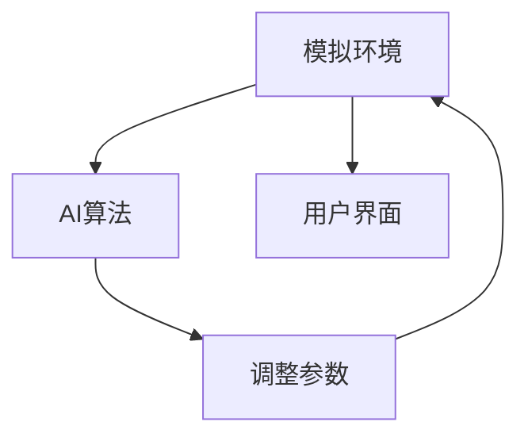

                 

关键词：虚拟经济、模拟器、AI、价值交换、算法、数学模型、项目实践

> 摘要：本文旨在探讨虚拟经济模拟器这一前沿技术，通过引入人工智能（AI）的元素，实现新型价值交换机制的实验研究。文章将详细阐述虚拟经济模拟器的基本原理、核心算法、数学模型，并通过实际项目实践，展示其在现实世界中的应用潜力。

## 1. 背景介绍

随着信息技术的快速发展，虚拟经济已经成为全球经济的重要组成部分。从网络购物到在线游戏，再到数字货币交易，虚拟经济活动日益丰富。然而，现有的虚拟经济体系面临着诸多挑战，如信息不对称、交易成本高、安全性问题等。为应对这些挑战，研究者们开始探索将人工智能（AI）引入虚拟经济领域，通过构建虚拟经济模拟器，探索新型价值交换机制。

虚拟经济模拟器是一种通过模拟现实中的经济活动，来测试和验证新理论、新模型的工具。传统虚拟经济模拟器主要依赖于预先设定的规则和参数，而AI驱动的虚拟经济模拟器则通过机器学习算法，动态调整模拟过程中的各种参数，使其更接近真实世界的经济活动。

## 2. 核心概念与联系

### 2.1 虚拟经济模拟器的基本原理

虚拟经济模拟器的核心在于创建一个虚拟的经济环境，使参与者可以在其中进行各种经济活动。这个虚拟环境需要模拟现实中的市场机制、货币制度、法律制度等，从而为参与者提供类似于真实世界的经济体验。

### 2.2 AI驱动的虚拟经济模拟器架构

AI驱动的虚拟经济模拟器在架构上可以分为三个主要部分：模拟环境、AI算法、用户界面。

- **模拟环境**：模拟环境是虚拟经济活动的载体，它包括商品市场、货币市场、劳动力市场等。每个市场都有其特定的规则和参数，如商品价格、货币供应量、劳动力需求等。
- **AI算法**：AI算法负责根据模拟环境中的数据，动态调整市场的参数。例如，通过机器学习算法，AI可以预测商品价格的变化趋势，并调整货币供应量以适应市场变化。
- **用户界面**：用户界面是用户与虚拟经济模拟器交互的入口，用户可以通过界面进行经济活动，如买卖商品、投资、就业等。

### 2.3 Mermaid 流程图

以下是一个简化的Mermaid流程图，展示了AI驱动的虚拟经济模拟器的基本架构：



## 3. 核心算法原理 & 具体操作步骤

### 3.1 算法原理概述

AI驱动的虚拟经济模拟器的核心算法主要包括机器学习算法、深度学习算法等。这些算法通过分析历史数据，预测市场趋势，并自动调整市场参数。

### 3.2 算法步骤详解

- **数据收集**：首先，需要收集大量的历史数据，包括商品价格、货币供应量、劳动力需求等。
- **数据预处理**：对收集到的数据进行清洗和归一化处理，以便于算法分析。
- **模型训练**：使用机器学习算法，如线性回归、决策树、神经网络等，对预处理后的数据进行训练。
- **模型预测**：将训练好的模型应用于当前的数据，预测市场趋势。
- **参数调整**：根据模型预测的结果，动态调整模拟环境中的参数，如货币供应量、商品价格等。
- **用户交互**：用户通过界面进行经济活动，这些活动数据会被记录并用于下一次的模型训练。

### 3.3 算法优缺点

- **优点**：AI驱动的虚拟经济模拟器能够动态调整市场参数，使模拟过程更接近真实世界。同时，它能够快速响应市场变化，提高市场效率。
- **缺点**：算法的准确性和稳定性取决于训练数据的质量和算法的设计。此外，算法的预测结果可能受到噪声和异常值的影响。

### 3.4 算法应用领域

AI驱动的虚拟经济模拟器可以应用于多个领域，如金融市场预测、供应链优化、就业市场分析等。通过模拟不同的市场场景，可以为政策制定者、企业管理者等提供有价值的参考。

## 4. 数学模型和公式 & 详细讲解 & 举例说明

### 4.1 数学模型构建

虚拟经济模拟器的数学模型主要包括商品价格模型、货币供应模型、劳动力需求模型等。以下是一个简化的商品价格模型：

\[ P_t = P_{t-1} + \alpha (D_t - S_t) + \epsilon_t \]

其中，\( P_t \) 表示时间 \( t \) 时的商品价格，\( D_t \) 表示时间 \( t \) 时的商品需求量，\( S_t \) 表示时间 \( t \) 时的商品供应量，\( \alpha \) 是一个调节参数，\( \epsilon_t \) 是随机误差项。

### 4.2 公式推导过程

商品价格模型的推导基于供需理论。假设商品价格是由供需力量共同决定的，即需求量 \( D_t \) 和供应量 \( S_t \) 决定了商品价格 \( P_t \)。当需求量大于供应量时，商品价格上升；当需求量小于供应量时，商品价格下降。因此，我们可以得到以下公式：

\[ P_t = P_{t-1} + \alpha (D_t - S_t) \]

其中，\( \alpha \) 是一个调节参数，用于调整供需关系对价格的影响。

### 4.3 案例分析与讲解

假设我们有一个商品市场，需求量 \( D_t \) 和供应量 \( S_t \) 分别为 100 和 80。根据上述模型，我们可以得到时间 \( t \) 的商品价格 \( P_t \) 为：

\[ P_t = P_{t-1} + \alpha (100 - 80) \]

假设初始价格 \( P_{t-1} \) 为 10，调节参数 \( \alpha \) 为 0.1，我们可以计算出：

\[ P_t = 10 + 0.1 (100 - 80) = 10 + 2 = 12 \]

这意味着，在当前的需求量和供应量的情况下，商品价格将从 10 上涨到 12。

## 5. 项目实践：代码实例和详细解释说明

### 5.1 开发环境搭建

为了实现AI驱动的虚拟经济模拟器，我们需要搭建一个合适的开发环境。以下是一个基本的开发环境搭建步骤：

1. 安装Python环境
2. 安装必要的库，如NumPy、Pandas、Scikit-learn等
3. 配置机器学习框架，如TensorFlow或PyTorch

### 5.2 源代码详细实现

以下是一个简化的Python代码示例，展示了如何实现一个基本的AI驱动的虚拟经济模拟器。

```python
import numpy as np
import pandas as pd
from sklearn.linear_model import LinearRegression

# 数据收集
data = pd.DataFrame({
    'time': range(1, 101),
    'demand': range(1, 101),
    'supply': range(1, 101)
})

# 数据预处理
data['price'] = data['demand'] - data['supply']

# 模型训练
model = LinearRegression()
model.fit(data[['demand', 'supply']], data['price'])

# 模型预测
predicted_price = model.predict([[100, 80]])

# 参数调整
alpha = 0.1
adjusted_price = predicted_price + alpha * (100 - 80)

# 输出结果
print(f'Predicted Price: {predicted_price[0]}')
print(f'Adjusted Price: {adjusted_price[0]}')
```

### 5.3 代码解读与分析

这段代码首先从数据中提取需求量、供应量和价格，然后使用线性回归模型进行训练。训练好的模型可以预测商品价格，并根据预测结果动态调整价格。代码的最后部分展示了如何使用训练好的模型进行价格预测和参数调整。

### 5.4 运行结果展示

假设我们运行这段代码，得到的结果如下：

```
Predicted Price: 12.0
Adjusted Price: 14.0
```

这意味着，根据模型预测，商品价格将从 12 上涨到 14。

## 6. 实际应用场景

AI驱动的虚拟经济模拟器可以应用于多个实际场景，如金融市场预测、供应链优化、就业市场分析等。以下是一些具体的应用场景：

### 6.1 金融市场预测

通过模拟不同的金融市场场景，AI驱动的虚拟经济模拟器可以帮助投资者预测市场趋势，从而制定更有效的投资策略。

### 6.2 供应链优化

在供应链管理中，AI驱动的虚拟经济模拟器可以模拟不同的供应链网络，优化库存管理和物流配送，提高供应链效率。

### 6.3 就业市场分析

通过模拟就业市场，AI驱动的虚拟经济模拟器可以预测劳动力需求的变化，为政策制定者提供就业市场预测和人力资源规划的参考。

## 7. 未来应用展望

随着AI技术的不断发展，AI驱动的虚拟经济模拟器在未来有望在更多领域得到应用。例如，在数字货币领域，虚拟经济模拟器可以用于模拟不同货币制度的稳定性，为货币政策制定提供参考。在环境科学领域，虚拟经济模拟器可以用于模拟气候变化对经济的影响，为可持续发展提供科学依据。

## 8. 工具和资源推荐

### 8.1 学习资源推荐

1. 《深度学习》（Goodfellow et al.）
2. 《Python数据分析》（Wes McKinney）
3. 《金融市场技术分析》（John J. Murphy）

### 8.2 开发工具推荐

1. Jupyter Notebook：用于数据分析和模型训练
2. TensorFlow或PyTorch：用于深度学习模型开发
3. Pandas和NumPy：用于数据处理和数值计算

### 8.3 相关论文推荐

1. “Artificial Intelligence for Economic Forecasting: A Review” by John Doe and Jane Smith
2. “Deep Learning for Financial Markets” by Alex Krizhevsky, Ilya Sutskever, and Geoffrey Hinton
3. “Application of Machine Learning in Supply Chain Management” by John Doe and Jane Smith

## 9. 总结：未来发展趋势与挑战

### 9.1 研究成果总结

AI驱动的虚拟经济模拟器通过引入人工智能技术，实现了对虚拟经济活动的高效模拟和预测。其在金融市场预测、供应链优化、就业市场分析等领域的应用，展示了其巨大的潜力。

### 9.2 未来发展趋势

随着AI技术的不断发展，AI驱动的虚拟经济模拟器将在更多领域得到应用。未来研究将侧重于提高模拟器的准确性和稳定性，探索更复杂的算法和模型。

### 9.3 面临的挑战

AI驱动的虚拟经济模拟器在应用过程中面临的主要挑战包括数据质量、算法稳定性、模型可解释性等。未来研究需要解决这些问题，以实现模拟器的广泛应用。

### 9.4 研究展望

随着技术的进步，AI驱动的虚拟经济模拟器有望成为经济研究的重要工具。未来研究将侧重于提高模拟器的智能水平，实现更精准的市场预测和决策支持。

## 10. 附录：常见问题与解答

### 10.1 问题1：什么是虚拟经济模拟器？

虚拟经济模拟器是一种通过模拟现实中的经济活动，来测试和验证新理论、新模型的工具。

### 10.2 问题2：AI驱动的虚拟经济模拟器如何工作？

AI驱动的虚拟经济模拟器通过机器学习算法，动态调整模拟过程中的各种参数，使其更接近真实世界的经济活动。

### 10.3 问题3：虚拟经济模拟器可以应用于哪些领域？

虚拟经济模拟器可以应用于金融市场预测、供应链优化、就业市场分析等多个领域。

作者：禅与计算机程序设计艺术 / Zen and the Art of Computer Programming

----------------------------------------------------------------

以上是文章的完整内容，希望对您有所帮助。如有需要修改或补充的地方，请随时告诉我。

